# Chapter 2 The Basic Encoding Rules 
第二章 基本编码规则

(Or: Encodings for the 80s - simple, robust, but inefficient!) （或者：80 年代的编码方式——简单、可靠，但效率较低！）

Summary: This chapter provides details of the Basic Encoding Rules. It describes: 摘要：本章详细介绍了基本编码规则的相关内容。具体内容包括：

• The form of the T part of a TLV encoding (the identifier octets), including the primitive/constructed bit. • TLV 编码中 T 部分的格式（标识符的八位组），包括原始/构造位。

The short, definite, and indefinite forms of encoding for the L part of the TLV (the length octets). 用于 TLV 中 L 部分的编码，包括简短的、明确的以及不明确的编码形式（即长度对应的八位组）。

• The V part of the TLV encoding (the contents octets) for each of the primitive types, taken roughly in order of increasing complexity. • TLV 编码中的 V 部分，即每种基本类型的内容字节数，按照复杂度递增的顺序排列。

• The encoding of the constructed types (such as SET and SEQUENCE) • 那些被构建出来的类型（如 SET 和 SEQUENCE 等）的编码方式

The encoding of remaining types, such as the character string and time types and types that represent "holes" of various sorts. 其余类型的编码，比如字符串类型、时间类型，以及表示各种“空洞”的类型。

## 1 Introduction 1 引言

The TLV principles underlying BER encodings have been extensively introduced in earlier chapters, and the reader should have little difficulty in going to the actual Standard/Recommendation for authoritative details. 在之前的章节中已经详细介绍了 BER 编码所基于的 TLV 原则。读者们应该能够轻松找到相关标准/建议的权威资料，以获取更多详细信息。

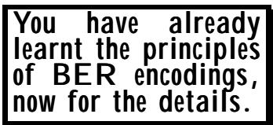

For completeness, however, this chapter provides examples of all the encodings, and gives some further explanation in a few cases. 不过，为了完整性，这一章节还是提供了所有编码方式的示例，并在一些情况下给出了进一步的说明。

## 2 General issues 2. 一般问题

## 2.1 Notation for bit numbers and diagrams 2.1 位数的表示方式及图表形式

One of the problems with encoding specifications in the late 1970s was that the bits of an octet were sometimes numbered from left to right in diagrams, sometimes the other way, and sometimes the most significant bit was shown at the right, and sometimes at the left. The order of octet transmission from diagrams could also be right to left in some specifications and left to right in others. Naturally there was often confusion! 在 1970 年代末，编码规范存在的问题之一是：在图表中，一个八位组的各个位有时被从左到右编号，有时则相反；有时最重要的位被标在右边，有时则在左边。在某些规范中，八位组数据的传输顺序可能是从右到左，而在另一些规范中则可能是从左到右。显然，这种情况常常会导致混淆！

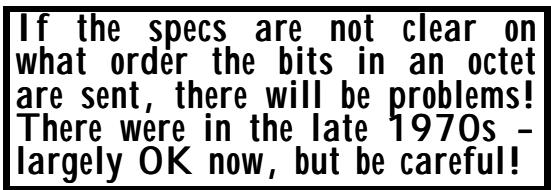

In the case of ASN.1 (and this book), we show the first transmitted octet to the left (or above) later transmitted octets, and we show each octet with the most significant bit on the left, with bit numbers running from 8 (most significant) to 1 (least significant) as shown in Figure III-4. 在 ASN.1 的情况下（以及本书中），我们会将第一个传输的八位组显示在最左侧（或上方），然后依次显示后续每个八位组。每个八位组的显示方式是将最高有效位放在最左侧，八位组的编号从 8（最高有效位）开始，到 1（最低有效位）结束，如图 III-4 所示。

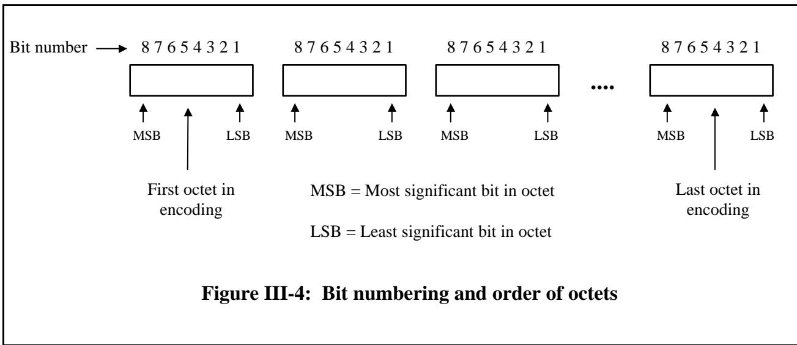

Whether within an octet the most or least significant bit is transmitted first (or the bits are transmitted in parallel) is not prescribed in ASN.1. This is determined by the carrier protocols. On a serial line, most significant first is the most common. It is the terms "most significant bit" and "least significant bit" that link the ASN.1 specifications to the lower layer carrier specifications for the determination of the order of bits on the line. 在 ASN.1 标准中并没有规定在八个字节中，哪个位应该先传输，或者各个位是否应并行传输。这一决定由上层协议来决定。在串行线路中，通常是以最高有效位为优先传输的。正是“最高有效位”和“最低有效位”这两个术语，使得 ASN.1 规范与下层载波规范能够相互衔接，从而确定线路上各位的传输顺序。

The order of octets on the line is entirely determined by ASN.1. When encoding a multi-octet integer value, ASN.1 specifies that the most significant octet of the value is transmitted first, and hence is shown in diagrams in the standard (and in this book) as the left-most octet of the value (see the encoding of the integer type later in this chapter). 行中八位组的顺序完全由 ASN.1 协议决定。在编码多八位组整数值时，ASN.1 规定首先传输该数值的最高位八位组，因此在标准规范中（以及本书中），这个八位组被标记为数值的最左侧位组（请参考本章后面的整数类型编码部分）。

## 2.2 The identifier octets 2.2 标识符的八位组

Every ASN.1 type has a tag of one of four classes, with a number for the tag, as discussed earlier. In the simplest case these values are encoded in a single octet as shown in Figure III-5. 每个 ASN.1 类型都有一个属于四个类别之一的标签，该标签由一个数字组成，如前所述。在最简单的情况下，这些数值被编码为一个八位元，如图 III-5 所示。

<table><tbody><tr><td data-imt-p="1">First the T part, encoding the tag value. 首先是对 T 部分的处理，即对标签值的编码。</td></tr></tbody></table>

We see that the first two bits encode the class as follows: 我们看到，前两个位元分别用于编码类别信息，具体编码方式如下：

<table><tbody><tr><td data-imt-p="1">Class 班级</td><td data-imt-p="1">Bit 8 第 8 位</td><td data-imt-p="1">Bit 7 第 7 位</td></tr><tr><td data-imt-p="1">Universal 通用性</td><td>0</td><td>0</td></tr><tr><td data-imt-p="1">Application 应用程序</td><td>0</td><td>1</td></tr><tr><td data-imt-p="1">Context-specific 特定情境下的</td><td>1</td><td>0</td></tr><tr><td data-imt-p="1">Private 私人</td><td>1</td><td>1</td></tr></tbody></table>

<table><tbody><tr><td data-imt-p="1">Class 班级</td><td data-imt-p="1" data-imt_insert_failed_reason="same_text">P/C</td><td data-imt-p="1">Number 数字</td></tr></tbody></table>

Figure III-5: Encoding of the identifier octet (number less than 31) 图 III-5：标识符八位组的编码（数值小于 31）

The next bit (bit six) is called the primitive/constructed (P/C) bit, and we will return to that in a moment. 下一个位（第六位）被称为原始/构造位（P/C 位），我们稍后会再次讨论这个问题。

The last five bits (bits 5 to 1) encode the number of the tag. Clearly this will only cope with numbers that are less than 32. In fact, the value 31 is used as an escape marker, so only tag numbers up to 30 encode in a single octet. 最后五位二进制位（从位 5 到位 1）用于编码标签的编号。显然，这一编码方式只能表示小于 32 的数字。实际上，数值 31 被用作一个转义标记，因此只有直到 30 的标签编号才能用单个八位元来表示。

For larger tag values, the first octet has all ones in bits 5 to 1, and the tag value is then encoded in as many following octets as are needed, using only the least significant seven bits of each octet, and using the minimum number of octets for the encoding. The most significant bit (the "more" bit) is set to 1 in the first following octet, and to zero in the last. This is illustrated in Figure III-6. 对于较大的标签值，第一个八位组中的第 5 位到第 1 位都是 1。之后，需要多少位就可以用多少位来编码标签值，只需使用每个八位组的最低 7 位，并尽量使用最少的位数进行编码。在接下来的第一个八位组中，最高位（“更多”位）被设置为 1，而在最后一个八位组中则设置为 0。如图 III-6 所示。

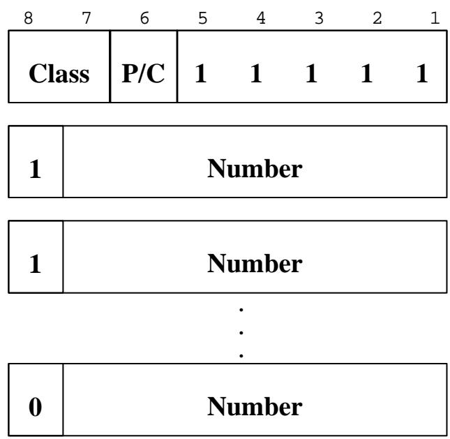

Figure III-6: Encoding of the identifier octets (numbers greater than 30) 图 III-6：标识符八位组（数值大于 30 的位）的编码方式

Thus tag numbers between 31 and 127 (inclusive) will produce two identifier octets, tag numbers between 128 and 16383 will produce three identifier octets. (Most ASN.1 specifications keep tag numbers below 128, so either 1 identifier octet - most common - or two identifier octets is what you will normally see, but I have seen a tag number of 999!. 因此，标签编号在 31 到 127 之间（包括两端）会生成两个标识符位元组；而标签编号在 128 到 16383 之间则会生成三个标识符位元组。大多数 ASN.1 规范将标签编号限制在 128 以下，所以通常情况下你会看到的是一个标识符位元组——也就是最常见的做法。不过，我也见过一些标签编号高达 999 的案例。

What about the primitive/constructed bit? This is required to be set to 1 (constructed) if the V part of the encoding is itself a series of TLV encodings, and is required to be set to 0 (primitive) otherwise. Thus for the encoding of an integer type or boolean type (provided any tagging was implicit), it is always set to 0. For the encoding of a SET or SET-OF etc, it is always set to 1. In these cases it is clearly redundant, provided the decoder has the type definition available. 那么“原始”与“构造”这部分呢？如果编码中的 V 部分本身是由多个 TLV 编码构成的序列，那么这部分应该被设置为 1（构造的）；否则，应该设置为 0（原始的）。因此，对于整数类型或布尔类型的数据编码（只要标签是隐式的），这部分总是被设置为 0。而对于 SET 或 SET-OF 等类型的编码，这部分则总是被设置为 1。在这些情况下，只要解码器能够获取类型定义，那么设置这部分为 0 显然是没有必要的。

But having this bit present permits a style of decoding architecture in which the incoming octetstream is first parsed into a tree-structure of TLV encodings (with no knowledge of the type definition), so that the leaves of the tree are all primitive encodings. The tree is then passed to code that does know about the type definition, for further processing. 不过，如果具备这一特性，就可以采用一种解码架构。在这种架构中，传入的八位元数据流首先会被解析成一种树形结构，其中各个节点都代表某种基本编码格式。然后，这个树形结构会被传递给那些了解类型定义的处理器，以便进行进一步的处理。

There is, however, a rather more important role for this bit. As we will see later, when transmitting a very long octet string value (and the same applies to bit string and character string values), ASN.1 permits the encoder to either transmit as the entire V part the octets of the octet string value (preceded by a length count), or to fragment the octet string into a series of fragments which are each turned into TLV encodings which then go into the V part of the main outer-level encoding of the octet string value. Clearly a decoder needs to know which option was taken, and the primitive/constructed bit tells it precisely that. 不过，这一位确实扮演着更为重要的角色。正如我们稍后会看到的，在传输非常长的八位组字符串值时（对于位字符串和字符字符串值也是如此），ASN.1 允许编码器将八位组字符串值的各个八位组作为一个完整的 V 部分进行传输（并附带长度信息），或者将八位组字符串拆分成多个片段，每个片段都进行 TLV 编码后作为 V 部分的一部分被包含在主外部编码中。显然，解码器需要知道采用了哪种方式，而原始/构造位就能准确传达这一信息。

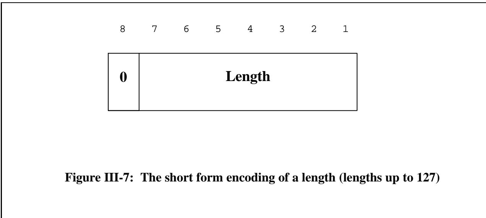

Why is fragmentation in this way useful? This will become clearer in the next Clause, when we consider the form of the "L" encoding, but the problem is roughly as follows. 为什么这种碎片化结构是有用的呢？这一点在下一节中将会更清楚地体现出来，当我们讨论“L”形编码的形式时就会明白。不过，问题的核心大致可以概括为以下几点。

If our V part is primitive, clearly all possible octet values can appear within it, and the only mechanism that ASN.1 provides for determining its length is to have an explicit count of octets in the "L" part. For extremely long octet values, this could mean a lot of disk churning to determine the exact length (and transmit it) before any of the actual octets can be sent. If however, the V part is made up of a series of TLVs, we can find ways of terminating that series of TLVs without an up-front count, so we can transmit octets from the value as they become available, without having to count them all first. 如果 V 部分是一个原始的数据结构，那么显然所有可能的八位元数值都可能出现在其中。而 ASN.1 提供的唯一确定其长度的方法，就是明确指定“L”部分中的八位元数量。对于非常长的八位元数值来说，这意味着需要花费大量时间来计算确切的长度（并在发送实际八位元数值之前先发送出该长度）。不过，如果 V 部分由一系列 TLV 组成，那么我们可以找到方法在不进行预先计数的情况下终止这一系列 TLV 的传输，这样就能在八位元数值逐个可用时将其发送出去，而无需先计算出总数。

## 2.3 The length octets 2.3 长度字节位

There are three forms of length encoding used in BER, called the short form, the long form, and the indefinite form. It is not always possible to use all three forms, but where it is, it is an encoder's option which to use. This is one of the main sources of optionality in BER, and the main area that canonical/distinguished encoding rules have to address. 在 BER 中，有三种长度编码方式：短形式、长形式和不定形式。虽然并不总是能够同时使用这三种方式，但在必要时，编码器可以选择使用其中一种。这是 BER 中可变性的主要来源之一，也是规范/特殊编码规则需要处理的主要领域。

## 2.3.1 The short form 2.3.1 缩写形式

Now the L part - three forms are available in general, sometimes only two, and occasionally only one. The encoder chooses the one to use. 现在，L 部分有三种形式可供选择：通常情况下会有三种形式，有时只有两种，偶尔甚至只有一种。编码器会自行决定使用哪种形式。

This is illustrated in Figure III-7. 如图 III-7 所示。

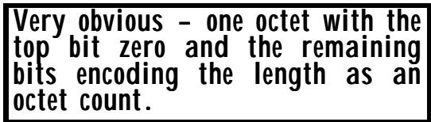

The short form can be used if the number of octets in the V part is less than or equal to 127, and can be used whether the V part is primitive or constructed. This form is identified by encoding bit 8 as zero, with the length count in bits 7 to 1 (as usual, with bit 7 the most significant bit of the length). 如果 V 部分的八位组数量小于或等于 127，就可以使用这种简式表示法。无论 V 部分是原始格式还是组合格式，都可以使用这种形式。这种形式的识别方式是将第 8 位编码为 0，而长度信息则存储在第 7 位到第 1 位上（按照常规，第 7 位代表长度的最高位）。

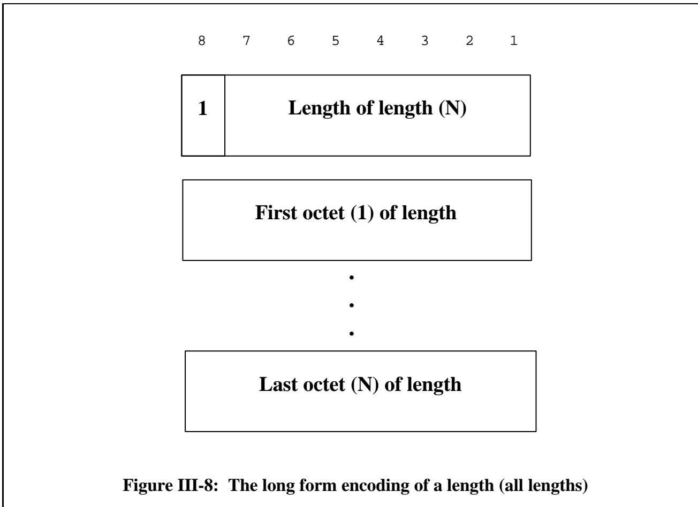

## 2.3.2 The long form 2.3.2 长形式

If bit 8 of the first length octet is set to 1, then we have the long form of length. This form can be used for all types of V part, no matter how long or short, no matter whether primitive or constructed. In this long form, the first octet encodes in its remaining seven bits a value N which is the length of a series of octets that themselves encode the length of the V part. This is shown in Figure III-8. 如果第一个长度字节的第 8 位被设置为 1，那么我们就得到了完整的长度表示形式。这种表示形式适用于所有类型的 V 部分，无论其长度长短，也不管是原始类型还是复合类型。在这种完整的形式中，第一个字节的其余 7 位则用于表示一个数值 N，这个数值代表了由多个字节组成的序列的长度。如图 III-8 所示。

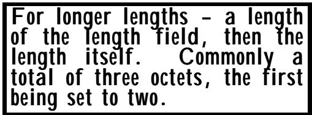

There is no requirement that the minimum number of octets be used to encode the actual length, so all the length encodings shown in Figure III-9 are permitted if the actual length of the V part is 5. 并没有要求必须使用最小数量的八位元来编码实际长度。因此，如果 V 部分的实际长度为 5，那么图 III-9 中所示的所有长度编码都是可行的。

This was actually introduced into ASN.1 in the early 1980s just before the first specification was finalised (early drafts required length encodings to be as small as possible). It was introduced because there were a number of implementors that wanted N to have a fixed value (typically 2), then the N (2) octets that would hold the actual length value, then the V part. There are probably still BER implementations around today that always have three length octets (using the long form encoding), even where one octet (using the short form encoding) would do. 这一规范实际上是在 20 世纪 80 年代初被引入到 ASN.1 标准中的。当时，第一个规范草案尚未最终确定（早期的草案要求长度编码的位数要尽可能少）。之所以引入这一规范，是因为有一些实现方希望 N 具有固定的值（通常设为 2），然后由 N（2 个八位组）来表示实际的长度值，再接着是 V 部分。今天，可能仍然有一些 BER 实现始终使用三个八位组来表示长度，即使使用一个八位组就能满足需求的情况也是如此。

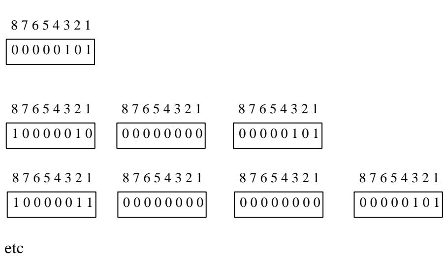

Figure III-9: Options for encoding a length of 5 图 III-9：编码长度为 5 的数据的各种方法

There is a restriction on the first length octet in the long form. N is not allowed to have the value 127. This is "reserved for future extensions", but such extensions are now highly unlikely. If you consider how long the V part can be when N has the maximum value of 126, and how large an integer value such a V part can hold, you will find that the number is greater than the number of stars in our galaxy. It was also calculated that if you transmit down a line running at one tera-bit per second the longest possible V part, it would take one hundred million years to transmit all the octets! So there is no practical limit imposed by BER on the size of the V part, or on the value of integers. 在长形式中，第一个长度八位组有一个限制条件：N 的值不得为 127。这个限制“为未来的扩展预留了空间”，但实际上这样的扩展现在几乎不太可能出现。如果考虑到当 N 的值为 126 时，V 部分可以包含多少数据，以及这样的 V 部分所能容纳的整数值有多大，你会发现这个数字远远超过我们银河系中恒星的数量。此外，据计算，如果以每秒一太字节的速度传输数据，要传输完所有八位组的话，需要一亿年时间！因此，BER 对 V 部分的大小或整数的取值并没有实际的限制。

## 2.3.3 The indefinite form 2.3.3 不定形式

The indefinite form of length can only be used (but does not have to be) if the V part is constructed, that is to say, consists of a series of TLVs. (The length octets of each of these TLVs in this contained series can independently be chosen as short, definite, or indefinite where such choices are available - the form used at the outer level does not affect the inner encoding.) “不定长度”形式只能用于那些由多个传输层标签（TLV）构成的条目中。（这些 TLV 中的长度八位组可以独立地选择为固定、明确或不确定的形式——在外部层次中使用的格式并不影响内部的编码方式。）


In the indefinite form of length the first bit of the first octet is set to 1, as for the long form, but the value N is set to zero. Clearly a value of zero for N would not be useful in the long form, so this serves as a flag that the indefinite form is in use. Following this single octet, we get the series of TLVs forming the V part, followed by a special delimiter that is a pair of zero octets. 在无限长度的形式中，第一个八位组的第一个位被设置为 1；而在长格式中，这个位则被设置为 0。显然，在长格式中，N 的值为 0 是没有意义的，因此这个位起到了标识当前使用无限长度格式的作用。在第一个八位组之后，是构成 V 部分的多个 TLV 字段，接着是一个特殊的分隔符，即一对零八位组。

This is shown in Figure III-10. 如图 III-10 所示。

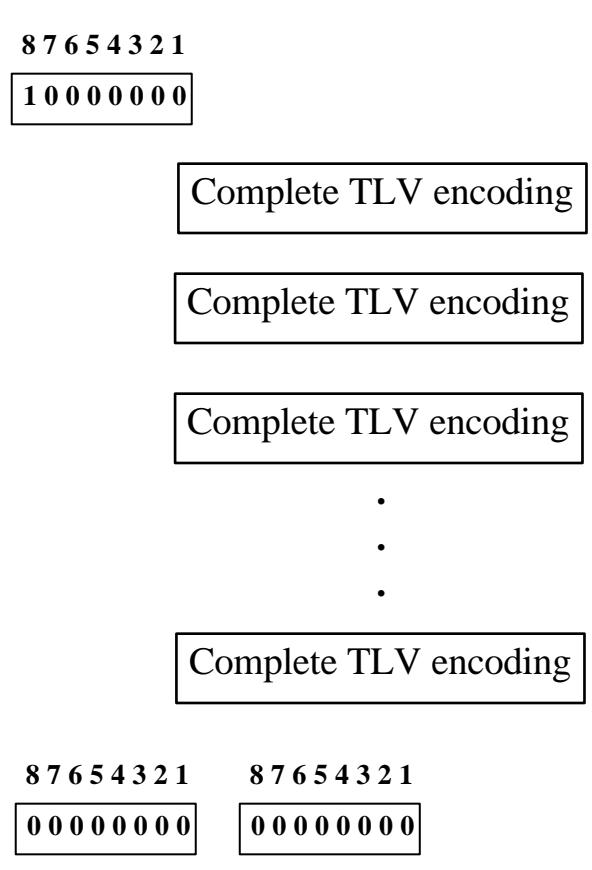

Figure III-10: An indefinite length encoding 图 III-10：不定长度编码

How does this work? The most important thing to note is that a decoder is processing the series of TLVs, and when it hits the pair of zero octets it will interpret them as the start of another TLV. So let us do just that. The zero T looks like a primitive encoding (bit six is zero) with a tag of UNIVERSAL class ZERO, and a definite form length encoding of zero length (zero octets in the V part). 这是如何工作的呢？最重要的是，解码器正在处理一系列 TLV 数据。当遇到一对零八位组时，它会将其视为另一个 TLV 数据的开始。那么，我们就按照这种方式来处理吧。这个零八位组看起来像是一种原始编码（第六位为 0），其标签为“UNIVERSAL 类零”，而定义形式长度则被设置为零长度（V 部分包含零个八位组）。

If you now refer back to the assignment of UNIVERSAL class tags given in Figure II-7, you will see that UNIVERSAL class zero is "Reserved for use by Encoding Rules" (and remember that users are not allowed to assign UNIVERSAL class tags). So a pair of zero octets can never appear as a TLV in any real encoding, and this "special" TLV can safely be defined by BER as the delimiter for the series of TLVs in the V part of an indefinite form encoding. 如果你现在回想一下图 II-7 中给出的通用类标签的分配情况，你会发现通用类零号是“预留用于编码规则使用的”（记住，用户不允许分配通用类标签）。因此，一对零八位组永远不可能出现在任何实际编码中作为 TLV 元素。而这一“特殊”的 TLV 可以被 BER 安全地定义为不定形式编码中 V 部分内一系列 TLV 元素的分隔符。

We have said earlier that, within an indefinite form TLV we may have inner TLVs that themselves are constructed and have an indefinite form of length. There is no confusion: a pair of zero octets (when a TLV is expected) terminates the innermost "open" indefinite form. 我们已经提到过，在一个不定长的 TLV 中，可能还存在一些内部 TLV。这些内部 TLV 也是由多个元素构成的，并且它们的长度也是不定长的。需要注意的是：当遇到 TLV 时，一对零八位组会作为最内层的“开放”不定长形式的终结。

## 2.3.4 Discussion of length variants 2.3.4 长度变体的讨论

Why do we need so many different variants of length? Clearly they all have some advantages and disadvantages. The short form is the briefest when it can be used, the long form is the only one that can handle very large primitive encodings, and seems to many to be intuitively simpler than the indefinite form. The indefinite is the only one which allows very large OCTET STRING values or SEQUENCE OF values to be transmitted without counting the number of octets in the value before starting. 为什么我们需要这么多不同形式的长度表示方式呢？显然，每种形式都有其优缺点。最短的形式在需要使用时最为简洁；而长形式则能够处理非常庞大的原始编码，而且似乎比不定形式更直观易懂。不定形式是唯一一种可以传输非常大的 OCTET STRING 值或 SEQUENCE OF 值的形式，无需在开始传输之前计算这些值的字节数。

The disadvantage of having three options is the extra implementation complexity in decoders, and the presence of encoding options creating side-channels and extra debugging effort. If we want to remove these options, then we have to either say "use indefinite length form whenever possible" (and make statements about the size of fragment to use when fragmenting an octet string), or to say "use short form where possible, otherwise use long form with the minimum value of N needed for the count". Both of these approaches are standardised! The distinguished/canonical encoding rules that take the former approach are called the Canonical Encoding Rules (CER), and those that take the latter approach are called the Distinguished Encoding Rules (DER). Applications with requirements for canonical/distinguished encoding rules will mandate use of one of these in the application specification. 采用三种编码方式的缺点在于，解码过程会更加复杂；此外，多种编码方式还会产生额外的侧流，从而增加调试工作的复杂性。如果我们想要取消这些选项，那么我们就必须选择一种方式：要么“尽可能使用不定长度的形式”，同时还需要说明在分割八位组时应该使用的片段大小；要么“尽可能使用短形式，否则就使用长形式，但需确保使用的 N 值尽可能小”。这两种方法都是标准化的！采用第一种方法的规范编码规则被称为“标准编码规则”（CER），而采用第二种方法的则被称为“特色编码规则”（DER）。那些需要采用标准或特色编码规则的应用程序，会在应用规范中明确要求使用其中一种编码方式。

## 3 Encodings of the V part of the main types 主类型中 V 部分的 3 种编码方式

In the examples for this clause we use the ASN.1 value notation to specify a value of a type, and then show the complete encoding of that value using hexadecimal notation for the value of each octet. 在本节的示例中，我们使用 ASN.1 值表示法来指定某种类型的值。同时，我们会以十六进制表示法来展示每个八位组值的完整编码形式。

The primary focus here is to illustrate the encoding of the V part for each type, but it must be remembered that there will be other permissible length encodings in addition to the one illustrated (as discussed earlier), and that if implicit tagging were to be applied, the T part would differ. 这里的主要目的是为了说明每种类型中 V 部分的编码方式。不过，需要注意的是，除了所展示的编码方式之外，还可能存在其他允许的长度编码方式（如前所述）。如果采用隐式标签标记方式，那么 T 部分的编码方式也会有所不同。

<table><tbody><tr><td data-imt-p="1">Encoding the V part is specific to each type. In many cases it is obvious, but the majority of types throw up problems which produce a little complexity in the encoding. 对 V 部分的编码是特定于每种类型的。在许多情况下，这种编码是显而易见的，但大多数类型都会带来一些复杂性的问题，从而增加了编码的难度。</td></tr></tbody></table>

The encoding of each of the following types is always primitive unless stated otherwise. The types are taken roughly in ascending order of complexity! 以下每种类型的编码方式通常都是原始的，除非另有说明。这些类型大致按照复杂度的递增顺序排列！

## 3.1 Encoding a NULL value 3.1 对空值进行编码

Utterly simple! 非常简单！

The value of 数值为

 

$$
\text { null NULL }: := \text { NULL }
$$

 

(the only value of the NULL type) is encoded as （NULL 类型的唯一值）被编码为

<table><tbody><tr><td></td><td>T</td><td>L</td><td>V</td></tr><tr><td data-imt-p="1">null: 无：</td><td>05</td><td>00</td><td data-imt-p="1">empty 空的</td></tr></tbody></table>

Note that whilst we have described our structure as TLV, it is (as in this case) possible for there to be zero octets in the V part if the length is zero. This can arise in cases other than NULL. So for example, a SEQUENCE OF value with an iteration count of zero would encode with an L of zero. Similarly a SEQUENCE, all of whose elements were optional, and which in an instance of communication were all missing, would again encode with an L of zero. 请注意，虽然我们将我们的结构描述为 TLV 格式，但实际上如果 V 部分的长度为 0，那么可能不会有任何八位元被使用。这种情况可能出现在其他情况下，而不仅仅是 NULL 情况下。例如，一个迭代次数为零的 SEQUENCE-of-value 序列，其编码方式就是使用一个零值的 L。同样，如果一个 SEQUENCE 中的所有元素都是可选的，并且在通信过程中这些元素实际上并未被使用，那么这个 SEQUENCE 的编码方式同样也会是零值的 L。

## 3.2 Encoding a BOOLEAN value 3.2 对布尔值进行编码

The values of 这些数值/内容

<table><tbody><tr><td data-imt-p="1">boolean1 布尔值 1</td><td data-imt-p="1" data-imt_insert_failed_reason="same_text">BOOLEAN ::= TRUE</td></tr><tr><td data-imt-p="1">boolean2 布尔值 2</td><td data-imt-p="1" data-imt_insert_failed_reason="same_text">BOOLEAN ::= FALSE</td></tr></tbody></table>

<table><tbody><tr><td data-imt-p="1">Still pretty obvious, but we now have encoders options! 虽然很明显，但现在我们有了编码器选项了！</td></tr></tbody></table>

are encoded as 被编码为

<table><tbody><tr><td></td><td>T</td><td>L</td><td>V</td></tr><tr><td data-imt-p="1">boolean1: 布尔值 1：</td><td>01</td><td>01</td><td>FF</td></tr><tr><td data-imt-p="1">boolean2: 布尔值 2：</td><td>01</td><td>01</td><td>00</td></tr></tbody></table>

For the value TRUE, an encoding of hex FF is shown. This is the only permissible encoding in DER and CER, but in BER any non-zero value for the V part is permitted. 当值为 TRUE 时，会显示十六进制编码 FF。这是 DER 和 CER 中唯一允许的编码方式；而在 BER 中，V 部分的任何非零值都是被允许的。

## 3.3 Encoding an INTEGER value 3.3 对整数值进行编码

A two's complement encoding of the integer values into the smallest possible V part is specified. When two's complement is used "smallest possible" means that the first (most significant) nine bits of the V part cannot be all zeros or all ones, but there will be values that will encode with the first eight bits all zeros or ones. 该整数值采用了二进制补码编码方式来表示，以使得 V 部分的位数尽可能少。当使用二进制补码编码时，“尽可能少”的含义是，V 部分的前九个二进制位不能全部为 0 或全部为 1，而是会有一些数值使得前八个二进制位全部为 0 或全部为 1。


Note that it would in theory have been possible to use an L value of zero and no V part to represent the integer value zero, but this is expressly forbidden by BER - there is always at least one octet in the V part. 需要注意的是，理论上可以使用零的 L 值和不存在的 V 部分来表示整数零值。但实际上，BER 明确禁止了这种用法——V 部分中总是至少有一个八位组。

Thus the values of 因此，这些数值为

<table><tbody><tr><td data-imt-p="1">integer1 整数 1</td><td data-imt-p="1">INTEGER ::= 72 整数 ::= 72</td></tr><tr><td data-imt-p="1">integer2 整数 2</td><td data-imt-p="1">INTEGER ::= 127 整数 ::= 127</td></tr><tr><td data-imt-p="1">integer3 整数 3</td><td data-imt-p="1">INTEGER ::= -128 整数 ::= -128</td></tr><tr><td data-imt-p="1">integer4 整数 4</td><td data-imt-p="1">INTEGER ::= 128 整数类型 ::= 128</td></tr></tbody></table>

are encoded as 被编码为

<table><tbody><tr><td></td><td>T</td><td>L</td><td>V</td></tr><tr><td data-imt-p="1">integer1 整数 1</td><td>02</td><td>01</td><td>48</td></tr><tr><td data-imt-p="1">integer2 整数 2</td><td>02</td><td>01</td><td>7F</td></tr><tr><td data-imt-p="1">integer3 整数 3</td><td>02</td><td>01</td><td>80</td></tr><tr><td data-imt-p="1">integer4 整数 4</td><td>02</td><td>02</td><td>0080</td></tr></tbody></table>

If the integer type was defined with a distinguished value list, this does not in any way affect the encoding. 如果整数类型被定义为具有特定的值列表，那么这并不会对编码过程产生任何影响。

## 3.4 Encoding an ENUMERATED value 3.4 对枚举值进行编码

The definition of an enumerated type may include integer values to be used to represent each enumeration during transfer, or (post 1994) may allow those values to be automatically assigned in order from zero. In the latter case all such values will be positive, but in the general case a user is allowed to assign negative values for 枚举类型的定义可能包括用于在传输过程中表示每个枚举值的整数值。或者，自 1994 年后，这些值可以自动从零开始分配。在后一种情况下，所有值都将为正数；但在一般情况下，用户也可以为这些值分配负数值。


enumerations (nobody ever does). BER takes no account of the (common) case where all associated values are positive: the encoding of an enumerated value is exactly the same as the (two's complement) encoding of the associated integer value (except that the tag value is different of course). 枚举类型（从来没有人会处理这种情况）。BER 算法并没有考虑到一种常见的情况：即所有相关的数值都是正数。在这种情况下，对枚举值的编码方式与对相关整数的二进制补码编码方式完全相同（当然，标签值需要有所不同）。

In practice, this only makes an efficiency difference if there are more than 127 enumerations, which is rare. 实际上，这种情况只有在枚举次数超过 127 次时才会产生效率上的差异，而这种情况非常罕见。

## 3.5 Encoding a REAL value 3.5 对实数进行编码

The encoding of a real value is quite complex. First of all, recall that the type is formally defined as the set of all values that can be expressed base 10, together with the set of all possible values that can be expressed base 2, even if these are the same numerical value. This means that different 对实数进行编码是非常复杂的操作。首先，需要记住的是，类型被正式定义为所有可以用十进制表示的值的集合，以及所有可以用二进制表示的值的集合——即使这些二进制表示的值与十进制表示的值相同。这意味着不同的实数在编码时会有不同的处理方式。

Forget about floating point format standards. What matters is how easily you can encode/decode with real hardware. 先不要考虑浮点数的格式标准了。真正重要的是，你是否能够轻松地使用实际的硬件进行编码和解码操作。

encodings are applied to these two sets of values, and the application may apply different semantics. (There is one exception to this - the value zero has just one encoding, zero octets in the V part.) For base 10 values, the encoding is character-based, for base 2 values, it is binary floating point. 这两种数值集都经过了编码处理，而且应用程序可能会采用不同的编码方式。（不过有一个例外——数值零只有一种编码方式，即 V 部分使用零个八位元。）对于基于 10 的数值，编码方式是字符编码；而对于基于 2 的数值，则采用二进制浮点数的编码方式。

There are also two further values of type REAL - PLUS-INFINITY and MINUS-INFINITY, with their own special encodings. 此外，还有两个更高级别的 REAL 类型的值：PLUS-INFINITY 和 MINUS-INFINITY，它们各自具有独特的编码方式。

Note that it is possible to subtype type REAL to contain only base 10 or base 2 values, effectively giving the application designer control over whether the character-based encoding or the binarybased encoding of values of the type are to be used. 需要注意的是，可以将类型“REAL”进一步细分，以仅包含基于 10 进制或 2 进制的数值。这样实际上就给了应用程序设计者选择权，让他们决定是使用基于字符的编码方式，还是基于二进制的编码方式来表示该类型的数值。

## 3.5.1 Encoding base 10 values 3.5.1 将基于 10 的数值进行编码

If the (non-zero) value is base 10, then the contents octets (the V part) start with one octet whose first two bits are 00 (other values are used for the base 2 values and the special values PLUS-INFINITY and MINUS-INFINITY). Octets after this initial octet are a series of ASCII characters (8 bits 如果这个（非零）数值是以 10 为基数，那么这些八位元的内容（即 V 部分）会以一个八位元开头，该八位元的前两位为 00（对于以 2 为基数的数值，以及其他特殊数值如 PLUS-INFINITY 和 MINUS-INFINITY，则使用其他值）。在第一个八位元之后，接下来的八位元则是由一系列 ASCII 字符组成的（共 8 位）。

A character encoding base 10 is available. (But not much used!) 该字符编码基于十进制系统。（不过其实很少被使用！）

per character) representing digits 0 to 9, space, plus sign, minus sign, comma or full-stop (for "decimal mark"), and capital E and small e (for exponents), in a format defined in the ISO Standard 6093. This standard has a lot of options, and in particular defines "Numerical Representation 1" (NR1), NR2, and NR3. Which of these is used is coded as values 1, 2, or 3 respectively into the bottom six bits of the first contents octet. Even within these representations, there are many options. In particular, arbitrary many leading spaces can be included, plus signs are optional, and so on. 每个字符代表一个数字，这些数字可以是 0 到 9 之间的整数，空格、加号、减号、逗号或句号（用于表示小数点），以及大写的 E 和小写的 e（用于表示指数）。这些字符的表示方式遵循 ISO 标准 6093 的规定。该标准提供了许多选项，特别是定义了“数值表示 1”（NR1）、NR2 和 NR3 三种表示方法。究竟使用哪种表示方法，可以通过第一个内容字节的后六位来指定相应的值，分别表示为 1、2 或 3。即使在这三种表示方法中，也有许多可选的设置。例如，可以包含任意多的前导空格；加号是可选的，等等。

When used with DER and CER (and all versions of PER), options are restricted to NR3, spaces and leading zeros are in general forbidden, the full-stop has to be used for any "decimal mark", and the plus sign is required for positive values. The mantissa is required to be normalised so that there are no digits after the "decimal mark". In each case below, the second column shows the way the same real value would be encoded in DER/CER/PER. 当与 DER 和 CER（以及所有版本的 PER）结合使用时，选项的限制如下：只能使用 NR3 表示法；通常禁止使用空格和前导零；任何“小数点”都需要用全停号表示；对于正数，必须使用加号来表示。尾数必须进行标准化处理，以确保“小数点”之后没有其他数字。在下面的每个例子中，第二列展示了相同实数值在 DER/CER/PER 编码中的表示方式。

We will not attempt here a detailed description of ISO 6093, but give below some examples of the resulting strings. Note that whilst there may be leading spaces, there are never trailing spaces. There may also be leading zeros and trailing zeros. 我们不会在这里对 ISO 6093 标准进行详细的说明，而是提供一些具体的例子。需要注意的是，虽然字符串开头可能会有空格，但结尾永远不会有空格。此外，字符串开头和结尾也可能出现零位。

NR1 encodes only simple whole numbers (no decimal point, no exponent). Here are some examples of NR1 encodings, where # is used to denote the space character: NR1 仅编码简单的整数（没有小数点，也没有指数）。以下是一些 NR1 编码的示例，其中#用来表示空格字符：

<table><tbody><tr><td>4902</td><td data-imt-p="1">4902.E+0 4902. E^0</td></tr><tr><td>#4902</td><td data-imt-p="1">4902.E+0 4902. E^0</td></tr><tr><td>###0004902</td><td data-imt-p="1">4902.E+0 4902. E^0</td></tr><tr><td data-imt-p="1" data-imt_insert_failed_reason="same_text">###+4902</td><td data-imt-p="1">4902.E+0 4902.E^0</td></tr><tr><td>-004902</td><td data-imt-p="1" data-imt_insert_failed_reason="same_text">-4902.E+0</td></tr></tbody></table>

NR2 requires the presence of a "decimal mark" (full-stop or comma as an encoders option). Here are some examples of NR2 encodings: NR2 要求必须有一个“小数点”符号（编码器可以选择使用句号或逗号作为分隔符）。以下是一些 NR2 编码的示例：

<table><tbody><tr><td>4902.00</td><td data-imt-p="1">4902.E+0 4902. E^0</td></tr><tr><td>###4902,00</td><td data-imt-p="1">4902.E+0 4902. E^0</td></tr><tr><td>000.4</td><td>4.E-1</td></tr><tr><td>#.4</td><td>4.E-1</td></tr><tr><td>4.</td><td data-imt-p="1" data-imt_insert_failed_reason="same_text">4.E+0</td></tr></tbody></table>

NR3 extends NR2 by the use of a base 10 exponent represented by a capital E or lower case e. Examples of NR3 are: NR3 通过使用以大写字母 E 或小写字母 e 表示的 10 进制指数来表示 NR2。NR3 的例子包括：

## 3.5.2 Encoding base 2 values 3.5.2 将二进制值进行编码

NOTE — For a full understanding of this material the reader will need some familiarity with the form of computer floating point units - something assembler language programmers of the 1960s were very familiar with, but something today's programmers can usually forget about! You may want to skim this material very quickly, or even totally ignore it. 注意：要完全理解这部分内容，读者需要一些关于计算机浮点运算单位形式的知识——这种知识在 1960 年代的汇编语言程序员中非常常见，但现在的程序员往往已经忘记了！你可以快速浏览这部分内容，或者完全忽略它吧。

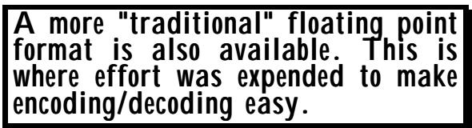

Base 2 values are encoded in a form that is similar to the floating point formats used when a computer system dumps the contents of a floating point unit into main memory. We talk about the mantissa (M), the base (B) and the exponent (E) of the number. 基数 2 的值是以一种类似于计算机系统中将浮点数值输出到主内存时使用的浮点格式来编码的。我们所说的数字中的尾数（M）、基数（B）和指数（E）。

However, in real floating point units, the base may be either 2, 8 or 16 (but is fixed for that hardware). In an ASN.1 encoding, the value of B has to be sent. This is done in the first contents octet. We then need the value of the exponent for this numerical value, and of the mantissa. 不过，在实际的浮点数表示中，基数可以是 2、8 或 16（但这是针对特定硬件而言的）。在 ASN.1 编码中，必须发送 B 的值。这一数值是通过第一个内容字节来表示的。接下来，我们需要该数值的指数部分的值，以及 Mantissa 部分的值。

Let us look at the first contents octet in the case of base 2 values (recall that the first contents octet for base 10 values started 00 and then encoded NR1, NR2, or NR3). This first content octet is illustrated in Figure III-11. 让我们来看看二进制数值的第一个内容八位组。回想一下，十进制数值的第一个内容八位组以 00 开始，之后分别编码为 NR1、NR2 或 NR3。这个第一个内容八位组如图 III-11 所示。

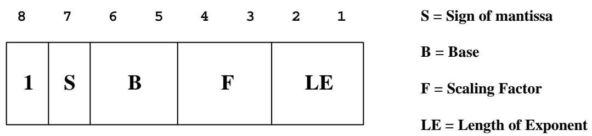

Figure III-11: Encoding of the first contents octet of a base 2 real value 图 III-11：二进制实数第一个字节内容的编码方式

The first bit (bit 8, most significant) is set to 1 to identify this as a base 2 value. The next bit (S) is the sign of the number, with the mantissa represented (later) as a positive integer value. The next two bits (B) encode the base (2, 8, or 16, with the fourth value reserved for future use). The next two bits encode a "scaling factor" value called F, restricted to values 0 to 3, and the final two bits encode the length (LE) of the exponent encoding (the exponent is encoded as a two's complement integer value immediately following this initial octet). The four values of LE allow for a one octet, two octet, or three octet exponent, with the fourth value indicating that the exponent field starts with a one octet length field, then the exponent value. Following the encoding of the exponent field we get the mantissa (M) as a positive integer encoding, terminated by the end of the contents octets (V part) in the usual way. 第一个位（第 8 位，最高有效位）被设置为 1，以表明这是一个二进制数值。接下来的位表示数的符号，而数值部分则被表示为一个正整数。接下来的两个位用于指定进制类型（2、8 或 16，第四个位保留供将来使用）。再接下来的两个位则编码一个称为 F 的“缩放因子”值，该值的范围限制在 0 到 3 之间。最后两个位则编码指数字段的长度（LE），指数字段是一个二进制补码整数，紧接在初始的 8 位字节之后。LE 的四个值可以对应 1 位、2 位或 3 位指数字段；第四个位表示指数字段以 1 位的长度字段开始，然后才是指数值。在指数字段编码之后，数值部分作为一个正整数进行编码，并以通常的方式结束，即位于内容字节部分的末尾。

The actual value of the real number encoded in this way is: 以这种方式编码的实数的实际值为：

$$
\texttt {S x M x (2 * *} \texttt {F) x (B * *} \texttt {E)}
$$

where \*\* above denotes exponentiation and x denotes multiplication. 其中，\*\*表示幂运算，而 x 表示乘法。

This is a fairly familiar way to represent floating point numbers, apart from the presence of F. We also need to discuss a little more the use of sign and magnitude instead of a 2's complement (or even 1's complement) mantissa. 这种表示浮点数的方法相当常见，不过其中使用了“F”这个符号。我们还需要进一步讨论使用符号和幅度来表示数值，而不是使用二进制补数或二进制补码来表示尾数。

In the early 1980s, there was very considerable variation in the form of floating point units, even within a single computer manufacturer, and although there are now de jure standards for floating point representation, there is in practice still a wide de facto variation. 在 20 世纪 80 年代初，即使是同一家计算机制造商生产的设备，其浮点运算单元的形式也存在很大的差异。虽然现在法律上有了关于浮点表示的标准，但实际上各种实现方式仍然存在很大的差异。

What has to be achieved (and was achieved) in the ASN.1 encoding of real is a representation that makes it (fairly) easy and quick for any floating point architecture to encode or decode values. 在 ASN.1 编码中，需要实现的目标就是创建一个能够让任何浮点运算架构都易于快速进行数值编码和解码的表达式。

Consider the choice between sign and magnitude or two's complement for the mantissa. If your actual hardware is two's complement, you can easily test the number and set the S bit, then negate the number, and you have a sign and magnitude format. If, however, your hardware was sign and magnitude and you are asked to generate a two's complement representation for transfer, the task is much more difficult. It is clear then that sign and magnitude is right for transfer, no matter which type of machine is most common. 在保留数的表示方式上，可以考虑使用符号表示法和绝对值表示法，或者二进制补码表示法。如果你的硬件使用的是二进制补码表示法，那么你可以很容易地测试数字，并设置 S 位，然后取数字的反转形式，这样就能得到符号表示法的数字了。然而，如果你使用的硬件是符号表示法，而你需要生成二进制补码表示法以供传输使用，那么任务就会变得复杂得多。显然，无论哪种类型的机器更为常见，符号表示法都是适合传输数据的表示方式。

The scaling factor F is included for a similar reason. All mantissa's have an implied decimal point position when the floating point value is dumped into main memory, but this is frequently not at the end of the mantissa field, that is, the mantissa is not naturally considered as an integer value. However, it is an integer value we wish to transfer in the ASN.1 encoding, and rather than try to encode the position of the implied decimal point, instead we recognise that the implied point can be moved one place to the right if we subtract one off the exponent value (for base 2). If the base is 8, one off the exponent value moves the implied decimal point three places right, and base 16 four places. Thus with a fixed (for this hardware) decrement to the exponent, we can get the implied decimal point close to the end of the mantissa. In particular, to within three positions of the end for a base 16 machine. By encoding an F value (which again is fixed for any given hardware), we can move the implied decimal point the remaining zero to three bits to get it exactly at the end. Of course a decoder has to multiply the resulting number by 2 to the power F, but this is quick and easy to do in a floating point unit. 之所以要包含缩放因子 F，也是出于同样的原因。当浮点数值被存入主内存时，所有的小数部分都带有隐含的小数点位置，但这一位置通常并不位于小数部分的末尾，也就是说，小数部分并不天然被视为一个整数值。然而，在 ASN.1 编码中，我们希望将其表示为一个整数值。因此，我们不会试图编码隐含的小数点位置，而是认识到，如果从指数值中减去 1（对于二进制基数而言），那么隐含的小数点就可以向右移动一位。如果基数为 8，那么指数值减 1 会使隐含的小数点向右移动三位；而对于基数为 16 的系统，则向右移动四位。因此，通过给指数值加上一个固定的值，我们可以使隐含的小数点靠近小数部分的末尾。特别是对于基于 16 的机器来说，误差可以控制在距离末尾三位以内。通过编码一个 F 值（该值……对于任何给定的硬件来说，“再次”这个操作都是可以实现的。我们可以将隐含的小数点移动到后面的零位上三个位置，这样就能使其正好位于末尾了。当然，解码器需要将得到的数字乘以 2 的 F 次方，不过这一步骤在浮点运算单元中操作起来非常快速且简单。

When this encoding was developed in the mid-1980s, there was a lot of discussion of these issues, and there was agreement over a range of vendors that the format provided a very good "neutral" format that they could all encode into and decode out of from a range of actual floating point hardware. Recommendation X.690/ISO 8825 Part 1 has a substantial tutorial annex about both the rationale for including F and also describing in some detail the algorithm needed to statically determine the encodings for a given floating point unit, and for encoding and decoding values. The interested reader is referred to this tutorial for further detail. 当这种编码方式在 20 世纪 80 年代中期被开发出来时，关于这些问题有很多讨论。许多供应商都认为，这种格式提供了一种非常优秀的“中立”格式，他们可以使用这种格式对实际使用的浮点硬件进行编码和解码。ISO 8825 标准中的 X.690 建议书第 1 部分中包含了关于为何要包含浮点运算的详细说明，同时还详细描述了用于确定特定浮点运算单元所需的编码方式，以及编码和解码过程的算法。有兴趣的读者可以参考该教程以获取更多详细信息。

Once again, in producing a canonical/distinguished encoding, we have to look at what options are being permitted, and eliminate them. We also have to concern ourselves with "normalization" of the representation. (This was illustrated in the character case above, where we required 4.E-1 rather than 0.4. A similar concern arises with the binary encoding.) For DER/CER/PER (all forms) we require that B be 2, that the mantissa be odd, that F be zero, and that the exponent and mantissa be encoded in the minimum number of octets possible. This is sufficient to remove all options. 在生成标准的/独特的编码方式时，我们必须考虑有哪些可行的选项，并排除那些不合适的选项。我们还必须关注表示的“规范化”问题。（正如上面的字符示例所示，我们需要使用 4.E-1 而不是 0.4。在二进制编码中也有类似的问题。）对于 DER/CER/PER（所有形式）来说，我们要求 B 为 2，尾数必须为奇数，F 为零，并且指数和尾数用最少的八位二进制数来表示。这样的要求足以排除所有不合适的选项。

## 3.5.3 Encoding the special real values 3.5.3 对特殊实数值的编码

There were early discussions about allowing special encodings for real values of the form "underflow" and "overflow", and for pi and other "interesting" values, but the only special values standardised so far (and there are unlikely to be any others now) are PLUS-INFINITY and MINUS-INFINITY. 最初有过关于为“下溢”和“溢出”这样的特殊数值，以及π和其他“有趣”的数值设置特殊编码的讨论。不过，目前唯一被标准化的特殊数值就是“正无穷”和“负无穷”。很可能不会再有其他特殊数值被标准化了。

And finally there are "special" real values that cannot easily be represented by normal character or floating point formats. 最后，还有一些“特殊”的实数，它们很难用常规的文字或浮点数格式来表示。

Recall that for a base 2 encoding the first (most significant) bit of the first contents octet is 1, and that for a base 10 encoding, the first two bits are zero. A special value encoding has the first two bits set to zero and one, with the remaining six bits of the first (and only) content octet identifying the value (two encodings only used). 需要注意的是，在二进制编码中，第一个内容八位组的第 1 位为 1；而在十进制编码中，前两位为 0。特殊值编码中，前两位分别设为 0 和 1，而第一个内容八位组剩下的 6 位则用于标识该值（仅使用两种编码方式）。

## 3.6 Encoding an OCTET STRING value 3.6 对 OCTET STRING 值进行编码

As was pointed out earlier, there are two ways of encoding an octet string - either as a primitive encoding, or as a series of TLV encodings, which we illustrate using the indefinite form for the outer-level TLV. 正如之前所指出的，对八位元字符串进行编码有两种方式：一种是使用原始编码方式，另一种则是使用 TLV 编码方式。我们以外层级 TLV 的无限形式为例来说明这两种编码方式。

Thus: 因此：

<table><tbody><tr><td data-imt-p="1">Pretty simple again - except that if you have a very long octet string you may want to fragment it to avoid counting it before transmission. Again, an encoder's option. 其实很简单——只不过，如果字符串的长度非常长，你可能需要将其分割开来，以避免在传输之前重复计算。这同样也是编码器可以选择的选项。</td></tr></tbody></table>

## octetstring OCTET STRING ::= '00112233445566778899AABBCCDDEEFF'H 八位组字符串 OCTET STRING ::= '00112233445566778899AABBCCDDEEFF'H

encodes as either 编码为以下任一方式：

<table><tbody><tr><td></td><td>T</td><td>L</td><td>V</td><td></td><td></td></tr><tr><td data-imt-p="1">octetstring: 八位组字符串：</td><td>04</td><td>10</td><td colspan="3">00112233445566778899AABBCCDDEEFF</td></tr><tr><td data-imt-p="1">or as octetstring: 或者作为八位元字符串：</td><td>24</td><td>80</td><td></td><td></td><td></td></tr><tr><td></td><td></td><td></td><td>T</td><td>L</td><td>V</td></tr><tr><td></td><td></td><td></td><td>04</td><td>08</td><td>0011223344556677</td></tr><tr><td></td><td></td><td></td><td>04</td><td>08</td><td>8899AABBCCDDEEFF</td></tr><tr><td></td><td></td><td>0000</td><td></td><td></td><td></td></tr></tbody></table>

There are a number of points to note here. Of course fragmentation makes little sense for such a short string, but it illustrates the form. We chose here to fragment into two equal halves, but in general we can fragment at any point. We chose not to fragment our fragments, but we are actually permitted to do so! In DER fragmentation is forbidden. In CER the fragment size is fixed at 1000 octets (no fragmentation if 1000 octets or under), and additional fragmentation of fragments is forbidden. 这里有几个需要注意的点。当然，对于如此短的一段数据来说，进行分割是没有意义的，但这说明了这种形式的特点。我们在这里选择将数据分割成两个相等的部分，不过一般来说，可以在任何点进行分割。我们选择不分割分割后的片段，但实际上是可以这样做的！在 DER 协议中，禁止进行分割操作。而在 CER 协议中，片段的大小被固定为 1000 个八位组（如果大小达到或低于 1000 个八位组，则不需要进行分割），并且还禁止对片段进行进一步的分割。

Finally, note that if the OCTET STRING had been implicitly tagged, the outer most T value (24 - universal class 4, constructed), would reflect the replacement tag, but the tag on each fragment would remain 04 (universal class 4, primitive). 最后，需要注意的是，如果 OCTET STRING 被隐式标记了，那么最外层的 T 值（24 - 通用类 4，构造型）将会反映替换标签的信息，而每个片段上的标签则仍然保持为 04（通用类 4，原始类型）。

## 3.7 Encoding a BIT STRING value 3.7 对位串值进行编码

For a BIT STRING value, we talk about the leading bit of the bitstring and the trailing bit, with the leading bit numbered as bit zero if we list named bits. The leading bit goes into the most significant bit of the first octet of the contents octets. Thus using the diagram conventions detailed earlier, the bits are transmitted with the left-most on the paper as the leading bit, proceeding to the right-most. When specifying a BIT STRING value, the value 对于 BIT 串值，我们讨论的是 BIT 串的首位和尾位。如果以命名方式来表示这些位，那么首位被编号为 0 位。首位位于内容八位组的第一个八位组的最高位。根据之前描述的图表规范，这些位按照从纸面的左端到右端的顺序进行传输。在指定 BIT 串值时，数值为……

<table><tbody><tr><td data-imt-p="1">BER length counts are always in octets. So how to determine the exact length of a bit string encoding? And what bit-value to pad with to reach an octet boundary? (Answer to the latter - encoder's option!) BER 长度总是以八位元为单位进行表示的。那么，如何确定用于编码的位串的确切长度呢？又该如何填充适当的位值以达到八位元的边界呢？（关于后一个问题的答案——由编码器自行决定！）</td></tr></tbody></table>

notation declares the left-most bit in the notation as the leading bit, so there is general consistency, except that the numbering of bits in a BIT STRING type goes in the opposite direction to the numbering of bits in an octet. 这种表示方式将表示法中最左侧的位指定为首位位。因此，这种表示方式具有一致性，只不过 BIT 串中位的编号方向与八位字节中位的编号方向相反。

As with an OCTET STRING value, BIT STRING value encodings can be primitive or broken into fragments. There is only one additional complication - the length count in BER is always a count of octets, so we need some way of determining how many unused bits there are in the last octet. This is handled by adding an extra contents octet at the start of the contents octets saying how many unused bits there are in the last octet. (In CER/DER these unused bits are required to be set to zero. BER has their values as a sender's option.) 与 OCTET STRING 值类似，BIT STRING 值的编码也可以采用原始形式，或者拆分为多个片段。不过还有一个额外的问题：在 BER 编码中，长度计数总是以八位组为单位进行统计的，因此我们需要一种方法来确定最后一个八位组中还有多少位未被使用。解决这个问题的方法是在描述内容部分的八位组开头添加一个额外的八位组，用来说明最后一个八位组中有多少位未被使用。（在 CER/DER 编码中，这些未被使用的位必须被设置为零。而在 BER 编码中，这些位的值则由发送方自行决定。）

If fragmentation of the bitstring into separate TLVs is performed, the fragments are required to be on an octet boundary, and the extra octet described above is placed (only) at the start of the last fragment in the fragmented encoding. 如果将对位串的分割成一个个独立的 TLV 结构，那么这些片段必须位于八位组的边界上。上述提到的额外八位组则只会被放置在分段编码中最后一个片段的起始位置。

Thus: 因此：

## bitstring BIT STRING ::= '1111000011110000111101'B 位串 BIT STRING ::= '1111000011110000111101'B

encodes as either 编码为以下任一方式：

<table><tbody><tr><td></td><td>T</td><td>L</td><td>V</td><td></td><td></td></tr><tr><td data-imt-p="1">bitstring: 比特串：</td><td>03</td><td>0F</td><td>02F0F0F4</td><td></td><td></td></tr><tr><td data-imt-p="1">or as bitstring: 或者像 bitstring 那样：</td><td>23</td><td>80</td><td></td><td></td><td></td></tr><tr><td></td><td></td><td></td><td>T</td><td>L</td><td>V</td></tr><tr><td></td><td></td><td></td><td>03</td><td>02</td><td>F0F0</td></tr><tr><td></td><td></td><td></td><td>03</td><td>02</td><td>02F4</td></tr><tr><td></td><td></td><td>0000</td><td></td><td></td><td></td></tr></tbody></table>

Again, fragmentation makes little sense for such a short string, and again in DER fragmentation is forbidden. In CER the fragment size is again fixed at 1000 octets (no fragmentation if 1000 octets or under), and additional fragmentation of fragments is forbidden. 同样，对于如此短的字符串来说，分片处理毫无意义。在 DER 协议中，分片处理是被禁止的。而在 CER 协议中，分片的大小被固定为 1000 个八位组（如果长度在 1000 个八位组或以下，则不需要分片处理），并且不允许对分片进行进一步的分片处理。

Apart from the extra octet detailing the number of unused bits, the situation is in all respects the same as for OCTET STRING. 除了额外增加了用于表示未使用位数的八个字节之外，其他方面的情况都与 OCTET STRING 的情况相同。

## 3.8 Encoding values of tagged types 3.8 对标记类型的值进行编码处理

If an implicit tag is applied (either by use of the word IMPLICIT, or because we are in an environment of automatic or implicit tagging), then as described in Section II, the class and number of the new tag replaces that of the old tag in all the above encodings. 如果使用了隐式标签（无论是通过“IMPLICIT”一词，还是因为处于自动或隐式标签使用的环境中），那么正如第二节所描述的，新标签的类别和编号将会取代旧标签在所有上述编码中的身份。

<table><tbody><tr><td data-imt-p="1">The final discussion of tagging!If its not clear by the end of thisclause, throw the book in theriver! 关于标签使用的最后讨论！如果到本节结束时仍然不清楚，那就把书扔到河里吧！</td></tr></tbody></table>

If however, an explicit tag is applied, we get the original encoding with the old tag, placed as a (single) TLV as the contents octets of a constructed encoding whose T part encodes the new (explicit) tag. 不过，如果使用了明确的标签，那么就会得到原始编码格式。在这种格式中，旧的标签被作为单独的 TLV 元素来放置，而构建出的编码内容则包含新的（明确的）标签的八位元数据。

For example: 例如：

integer1 INTEGER ::= 72 integer1 整数 ::= 72

integer2 \[1\] IMPLICIT INTEGER ::= 72 整数 2 \[1\] 定义为整数类型：72

integer3 \[APPLICATION 27\] EXPLICIT INTEGER ::= 72 整数 3 \[应用 27\] 显式整数 ::= 72

are encoded as 被编码为

<table><tbody><tr><td></td><td>T</td><td>L</td><td>V</td><td></td><td></td></tr><tr><td data-imt-p="1">integer1 整数 1</td><td>02</td><td>01</td><td>48</td><td></td><td></td></tr><tr><td data-imt-p="1">integer2 整数 2</td><td>C1</td><td>01</td><td>48</td><td></td><td></td></tr><tr><td data-imt-p="1">integer3 整数 3</td><td>7B</td><td>03</td><td></td><td></td><td></td></tr><tr><td></td><td></td><td></td><td>T</td><td>L</td><td>V</td></tr><tr><td></td><td></td><td></td><td>02</td><td>01</td><td>48</td></tr></tbody></table>

where the 7B is made up, in binary, as follows: 其中，7B 由以下二进制数字组成：

<table><tbody><tr><td data-imt-p="1">Class 班级</td><td data-imt-p="1" data-imt_insert_failed_reason="same_text">P/C</td><td data-imt-p="1">Number 数字</td></tr><tr><td>APPLICATION</td><td data-imt-p="1">Constructed 建造完成</td><td>27</td></tr><tr><td>01</td><td>1</td><td data-imt-p="1" data-imt_insert_failed_reason="same_text">11011 = 01111011 = 7B</td></tr></tbody></table>

## 3.9 Encoding values of CHOICE types 3.9 对 CHOICE 类型的数据进行编码处理

In all variants of BER, there are no additional TL wrappers for choices. The encoding is just that of the chosen item. The decoder knows which was encoded, because the tags of all alternatives in a choice are required to be distinct. 在所有的 BER 变体中，都不会为选项提供额外的标签封装。编码仅针对所选选项进行。解码器能够识别出哪个选项被选中了，因为每个选项的标签都必须各不相同。

<table><tbody><tr><td data-imt-p="1">This is either obvious or curious! There is no TLV associated with the CHOICE construct itself - you just encode the TLV for a value of the chosen alternative. 这要么很明显，要么就令人好奇！这个 CHOICE 结构本身并没有相关的 TLV 值——你只需要为所选选项编码一个 TLV 值即可。</td></tr></tbody></table>

So (compare with the encodings for the INTEGER and BOOLEAN types given above) 因此（与上面给出的 INTEGER 和 BOOLEAN 类型的编码进行比较）

and 以及

```txt
value1 CHOICE
{ flag BOOLEAN,
    value INTEGER} ::= flag:TRUE
value2 CHOICE
{flag BOOLEAN,
    value INTEGER} ::= value:72 
```

we get the encodings: 我们得到了这些编码：

<table><tbody><tr><td></td><td>T</td><td>L</td><td>V</td></tr><tr><td data-imt-p="1">value1 价值 1</td><td>01</td><td>01</td><td>FF</td></tr><tr><td data-imt-p="1">value2 价值 2</td><td>02</td><td>01</td><td>48</td></tr></tbody></table>

## 3.10 Encoding SEQUENCE OF values 3.10 值编码序列

This is quite straight-forward - an outer (constructed) TL as the wrapper, with a TLV for each element (if any) in the SEQUENCE OF value. 这非常直观——一个外部（构建的）主题列表作为包装层，而在值序列中，每个元素（如果有的话）都有一个主题标签。

So 那么，就这样吧。

<table><tbody><tr><td data-imt-p="1">You should know this already from the general discussion of the TLV approach. Nothing new here. 从对 TLV 方法的讨论中，你应该已经知道这一点了。这里并没有什么新内容。</td></tr></tbody></table>

 

$$
\begin{array}{r l} \text { temperature - each - day SEQUENCE(7)OF INTEGER } \\ & : := \{2 1, 1 5, 5, - 2, 5, 1 0, 5 \} \end{array}
$$

could be encoded as: 可以编码为：

<table><tbody><tr><td rowspan="2" data-imt-p="1">temperature-each-day: 每日温度：</td><td>T</td><td>L</td><td>V</td><td></td><td></td></tr><tr><td>30</td><td>80</td><td></td><td></td><td></td></tr><tr><td></td><td></td><td></td><td>T</td><td>L</td><td>V</td></tr><tr><td></td><td></td><td></td><td>02</td><td>01</td><td>15</td></tr><tr><td></td><td></td><td></td><td>02</td><td>01</td><td>0F</td></tr><tr><td></td><td></td><td></td><td>02</td><td>01</td><td>05</td></tr><tr><td></td><td></td><td></td><td>02</td><td>01</td><td>FE</td></tr><tr><td></td><td></td><td></td><td>02</td><td>01</td><td>05</td></tr><tr><td></td><td></td><td></td><td>02</td><td>01</td><td>10</td></tr><tr><td></td><td></td><td></td><td>02</td><td>01</td><td>05</td></tr><tr><td></td><td></td><td>0000</td><td></td><td></td><td></td></tr></tbody></table>

Of course, we could have employed definite length encoding at the outer level, which in this case would have saved two octets if the short form had been employed. 当然，我们可以在外部层次使用确定性长度编码方式。如果采用短格式，那么就可以节省两个八位元的空间。

## 3.11 Encoding SET OF values 3.11 编码 值集合

What are the actual set of abstract values? Is {3, 2} the same value as {2, 3}? It should be! So we must have just one encoding in distinguished/canonical encoding rules for this single value. This produces a significant cost at encode time. Best not to use set-of if you want to have distinguished/canonical encodings. 那么，这些抽象值到底是什么呢？{3, 2}和{2, 3}到底代表相同的数值吗？应该是这样的吧！因此，对于这个单一值，我们只需要使用一种编码方式即可。不过，这种编码方式在编码时会产生相当大的成本。所以，如果想要使用区分化/规范化的编码方式，就最好不要使用集合形式的编码方式。

The encoding of set-of is just the same as for sequence-of except that the outer T field is 31. If, however, this were a CER or DER encoding then the seven TLVs would be sorted into ascending order and we would get: 这种编码方式与“序列”类型的编码相同，只不过外部的 T 字段值为 31。不过，如果这是 CER 或 DER 编码，那么这七个 TLV 字段会被按照升序排序，最终会得到如下结果：

$$
\begin{array}{c c c c c} \text {unordered - weeks - temps SET (7) OF INTEGER} \\ : := \{2 1, 1 5, 5, - 2, 5, 1 0, 5 \} \\ \text {weekstemperatures:} & T & L & V \\ & 3 1 & 8 0 \\ & & & T & L & V \\ & & & 0 2 & 0 1 & F E \\ & & & 0 2 & 0 1 & 1 5 \\ & & & 0 2 & 0 1 & 1 0 \\ & & & 0 2 & 0 1 & O F \\ & & & 0 2 & 0 1 & 0 5 \\ & & & 0 2 & 0 1 & 0 5 \\ & & & 0 2 & 0 1 & 0 5 \\ & & & 0 0 0 0 \end{array}
$$

Notice that the sort is on the final encodings of each element, so the temperature -2 sorts ahead of the temperature 21. 注意，排序是按照每个元素的末尾编码来进行的，因此温度-2 比温度 21 更优先排序。

## 3.12 Encoding SEQUENCE and SET values 3.12 对序列和集合值进行编码

These are exactly similar, except that now the inner TLVs (one for each element of the sequence or set) will be of varying size and have varying tags. In some cases these elements may themselves be sequences or sets, so we may get deeper nesting of TLVs (to any depth). 这些其实都是类似的，只不过现在每个序列或集合中的元素内部的 TLV 大小各不相同，而且每个 TLV 都有不同的标签。在某些情况下，这些元素本身也可能是其他序列或集合，因此 TLV 的嵌套层次可能会更加深。

<table><tbody><tr><td data-imt-p="1">Back to simplicity again. Nested TLVs, to any depth. 再次回归简单性。嵌套的 TLV 可以嵌套到任意深度。</td></tr></tbody></table>

If there are optional elements, and the abstract value of the sequence or set does not contain a value for these elements, then the corresponding TLV is simply omitted. 如果存在一些可选元素，而序列或集合的抽象值并不包含这些元素的对应值，那么相应的 TLV 就会被省略。

In the case of SET, BER allows the nested TLVs to be appear in any order chosen by the encoder. In DER, the elements are sorted by the tag of each element (which again are required to be distinct). However, if we have 在 SET 的情况下，BER 允许嵌套的 TLV 以编码器选择的任意顺序出现。而在 DER 中，元素则是按照每个元素的标签进行排序的（当然，这些标签必须是唯一的）。不过，如果我们拥有多个……

```txt
My-type ::= SET OF
{ field1 INTEGER,
    field2 CHOICE
    { flag BOOLEAN,
    dummy NULL } } 
```

then each set-of value contains an integer value plus either a boolean or a null value. But in the sort into ascending order of tag, a boolean value would come before an integer value but a null value after it. Thus depending on which value of field2 is chosen, it may appear before or after the value of field1! In CER, a slightly more complicated algorithm applies which says that the maximum tag that appears in any value of field2 is the NULL tag, and that that determines the position of field 2 no matter what value is actually being sent. This is marginally more difficult to explain and perhaps understand, but avoids having to do a sort at encode time. 每组值都包含一个整数值，外加一个布尔值或空值。但在按标签升序排序时，布尔值会出现在整数值之前，而空值则会出现在整数值之后。因此，根据 field2 中选择的数值，它可能会出现在 field1 的值之前或之后！在 CER 中，采用了一种稍微复杂的算法：在任何 field2 的值中，出现次数最多的标签是 NULL 标签。这一规则决定了 field2 的位置，而不管实际发送的是哪种值。这种方法虽然解释起来稍微复杂一些，但可以避免在编码过程中进行排序操作。

## 3.13 Handling of OPTIONAL and DEFAULT elements in sequence and set 3.13 如何处理序列和集合中可选的以及默认的元素

There are no problems caused by OPTIONAL (the use of tags makes it unambiguous what has been included and what has not). However, in the case of DEFAULT, BER leaves it as a sender's option whether to omit 使用可选标签可以确保明确区分哪些内容已被包含，哪些没有包含。不过，在默认情况下，BER 允许发送方自行决定是否忽略某些内容。

a default value (implying possibly complex checking that it is the default value), or whether to encode it anyway! 是否使用默认值（这意味着可能需要进行复杂的检查来确保确实是默认值），还是无论如何都要将其编码处理！

Again, this gives DER and CER problems to remove this encoder's option. In this case they both require that an element whose value equals the default value be omitted, no matter how complicated the check might be. (However, in practice, DEFAULT is normally applied only to elements that are very simple types, rarely to elements that are complex structured sequences and sets). 同样，这也会带来 DER 和 CER 方面的问题，需要去除这个编码器的选项。在这种情况下，无论检查过程多么复杂，都要求将那些值等于默认值的元素进行省略。（不过，实际上，DEFAULT 选项通常只适用于非常简单的元素，很少应用于结构复杂的序列和集合。）

When we discuss PER more fully in the next chapter, however, we find that PER specifies mandatory omission for "simple types" (which it lists) and a sender's option otherwise, avoiding verbosity in and options incommon cases, but avoiding implementation complexity in the other cases. 在下一章中，当我们更详细地讨论 PER 时，会发现 PER 规定了对“简单类型”的强制省略规则，而在其他情况下则允许选择省略，这样可以在常见情况下避免不必要的复杂性，同时也能降低实现上的复杂度。

## 3.14 Encoding OBJECT IDENTIFIER values 3.14 编码对象标识符值

The value is basically a sequence of integers, but we need a more compact encoding than using "SEQUENCE OF INTEGER". The "more bit" concept comes in again here, but with a curious (and nasty) optimization for the top two arcs. 这个值本质上是一个整数序列，不过我们需要一种比“整数序列”更简洁的编码方式。这里又出现了“更节省比特数”的概念，不过对于前两个弧线来说，这种优化方式有些奇怪且不太理想。

Figure III-12 is a repeat of Figure II-1, and shows a part of the object identifier tree. 图 III-12 是图 II-1 的重复显示，它展示了对象标识符树的一部分结构。

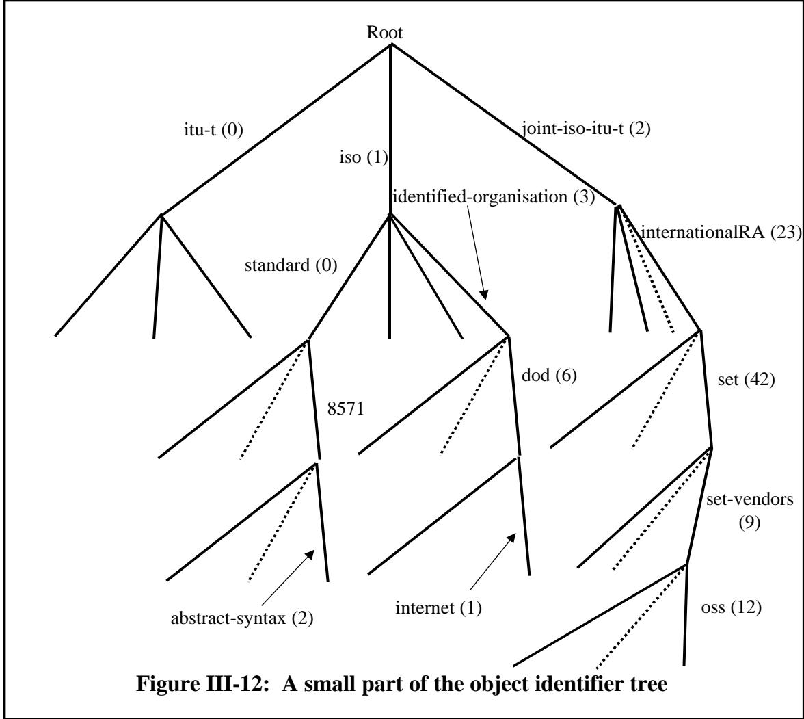

Object identifier values are paths down this tree from the root to a leaf, and one such path is defined by 对象标识符的值就是沿着这棵树从根到叶子的路径。而这样的路径之一就是由…所定义的。

$$
\{\text { iso(1) standard(0) 8571 abstract - syntax(2) } \}
$$

but the only information that is encoded is a value of 但是，唯一被编码的信息只是一个数值而已。

$$
\left\{ \begin{array}{c c c c} 1 & 0 & 8 5 7 1 & 2 \end{array} \right\}
$$

This could in theory be carried by an encoding of "SEQUENCE OF INTEGER", but the presence of T and L fields for each integer value makes this rather verbose, and a different (ad hoc) encoding is specified. 理论上，这可以通过编码“整数序列”来实现。不过，对于每个整数值，都需要使用 T 和 L 字段进行表示，这使得编码方式相当冗长。因此，采用了一种不同的、更为灵活的编码方式。

The "more bit" concept (also used in the encoding of tags – see Figure III-6 in 2.2) is used. For each object identifier component (the values 1, 0, 8571 and 2 above), we encode it as a positive integer value into the minimum necessary number of bits (the standard requires that the minimum multiple of seven bits is used), then place those bits into octets using only the least significant seven bits of each octet (most significant octet first). Bit 8 (most significant) of the last octet is set to 0, earlier bit 8 values (the "more" bit) are set to 1. 采用了“更多位”这一概念（该概念也用于标签的编码中——参见 2.2 节中的图 III-6）。对于每一个对象标识符组件（上述提到的 1、0、8571 和 2 这些值），我们将其编码为尽可能少位的整数值（标准要求使用至少 7 位的倍数）。然后，将这些位转换为八位二进制数，只使用每个八位中最低的 7 位（最高位的 8 位优先处理）。最后一个八位的最高位被设置为 0，而之前的最高位则被设置为 1，即所谓的“更多位”。

The result of encoding 编码的结果

 

$$
\text { ftam - oid OBJECT IDENTIFER }: := \{1 0 8 5 7 1 2 \}
$$

would be (in hex): 在十六进制中表示的话是：

<table><tbody><tr><td></td><td>T</td><td>L</td><td>V</td><td></td><td></td><td></td></tr><tr><td data-imt-p="1">ftam-oid: 类似 ftam 的：</td><td>06</td><td>05</td><td>01</td><td>00</td><td>C27B</td><td>02</td></tr></tbody></table>

However, the actual encoding of this object identifier value is 不过，这个对象标识符值的实际编码方式是……

<table><tbody><tr><td>T</td><td>L</td><td>V</td></tr><tr><td>06</td><td>04</td><td data-imt-p="1" data-imt_insert_failed_reason="same_text">28 C27B 02</td></tr></tbody></table>

How come? 怎么会这样呢？

A dirty trick was played! (And like most dirty tricks, it caused problems later). 一个卑鄙的伎俩被利用了！（就像大多数卑鄙的伎俩一样，这个伎俩后来引发了问题。）

The octets encoding the first two arcs were (in 1986) thought to be unlikely to ever have large values, and that using two octets for these two arcs was "a bad thing". So an "optimization" (mandatory) was introduced. 在 1986 年时，人们认为用于编码前两个弧线的八位组的值不太可能达到较大的数值，因此使用两个八位组来表示这两个弧线被认为是“不妥的”。于是，人们引入了一种“优化”方案（这是必须的）。

We can take the top two arcs of Figure III-12 and "overlay" them with the dotted arcs shown in Figure III-13, producing a single (pseudo) arc from the root to each second level node. How to number these pseudo-arcs? 我们可以选取图 III-12 中前两个弧线，并将其与图 III-13 中显示的虚线弧线进行“叠加”。这样，就能得到一条从根节点到每个第二级节点的伪弧线。那么，该如何为这些伪弧线编号呢？

Well, there are three top-level arcs, and we can accommodate encodings for up to 128 arcs (0 to 127) in a single octet with the "more bit" concept described above. 128 divided by 3 is about 40! Let's assume the first two top-level arcs will never have more than 40 sub-arcs, and allocate the first 40 pseudo-arcs to top-level arc 0, the next 40 to top-level arc 1, and the remainder to top-level arc 2. 嗯，总共有三个顶层弧点。通过上述的“更多位”概念，我们可以在一个八位元中容纳最多 128 个弧点的编码信息（0 到 127）。128 除以 3 约等于 40！假设前两个顶层弧点最多只有 40 个子弧点，那么可以将前 40 个子弧点分配给顶层弧点 0，接下来的 40 个分配给顶层弧点 1，剩下的部分则分配给顶层弧点 2。

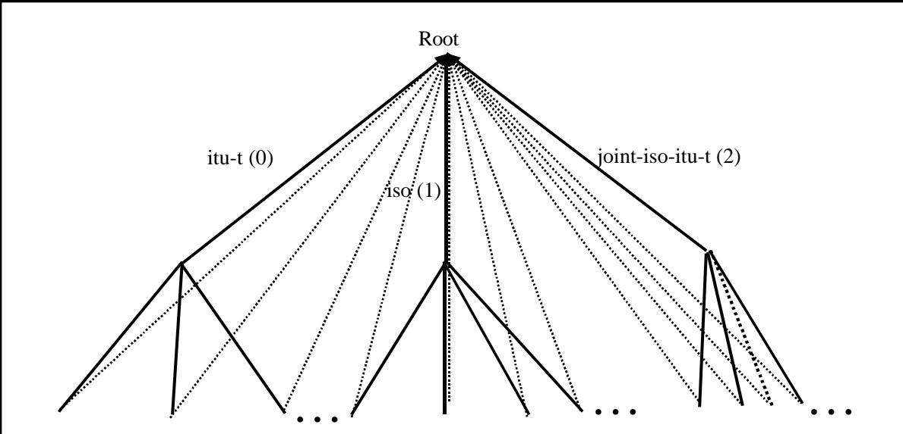

Figure III-13: Making the top two arcs into a single arc 图 III-13：将两条最上面的弧线合并为一条弧线

So for any second level arc beneath top-level arc 0, we use the second level arc number as the number for the pseudo-arc. For any second-level arc beneath top-level arc 1, we use the second level arc number plus 40 as the number for the pseudo-arc, and for any second-level arc beneath top-level arc 2, we use the second level arc number plus 80 as the number for the pseudo-arc. 因此，对于位于最高级别弧线 0 下方的任何二级弧线，我们使用该二级弧线的编号作为伪弧线的编号。对于位于最高级别弧线 1 下方的任何二级弧线，我们使用该二级弧线的编号加上 40 作为伪弧线的编号；而对于位于最高级别弧线 2 下方的任何二级弧线，我们使用该二级弧线的编号加上 80 作为伪弧线的编号。

We then get the encoding of {1 0 8571 2} as 然后，我们将{1 0 8571 2}编码为

$$
\begin{array}{c c c c c} \mathbf {T} & \mathbf {L} & \mathbf {V} \\ 0 6 & 0 4 & 2 8 \text {C27B} 0 2 \end{array}
$$

as described earlier. 如之前所述。

As was pointed out earlier, where you are "hung" on the object identifier tree is unimportant, except that your object identifiers will be longer the lower down you are. In mid-1995 this surfaced as an issue, with other major international players wanting top-level arcs. The above "fudge" with the top two arcs makes it difficult (not impossible, but difficult) to add new top-level arcs, and to alleviate this problem the RELATIVE OID constructor was proposed for addition to ASN.1. 正如之前所指出的，你在对象标识符树中处于什么位置并不重要，只是越往下层次，对象标识符就会越长一些。到了 1995 年中期，这个问题变得明显起来，因为其他主要的国际机构希望拥有最高级别的弧段。对前两个弧段进行这种“调整”使得添加新的最高级别弧段变得困难（虽然并非完全不可能，但确实比较困难）。为了解决这个问题，人们提出了在 ASN.1 中添加“相对 OID 构造器”的方法。

If an organization has the need to allocate object identifiers beneath a root such as: 如果一个组织需要在根节点下分配对象标识符，例如：

$$
\left\{\text { joint - iso - itu - t(2) } \quad \text { internationalRA(2)set(42) } \right\}
$$

and has a protocol that is specifically designed to carry (always or commonly) object identifier values beneath this root, then it can define 并且有一个专门设计的协议，用于承载位于此根下的对象标识符值（总是或通常会如此）。那么，就可以定义这样的结构了。

$$
\begin{array}{r l} \text {SET - OIDs} & : := \text {RELATIVE OID} \\ & \quad \text {- - Relative to\{2 2 42\}} \end{array}
$$

and use that type in its protocol, either alone or as a CHOICE of that and a normal OBJECT IDENTIFIER. 在协议中可以使用这种类型，可以单独使用，也可以作为普通对象标识符的选择之一来使用。

A relative object identifier type is only capable of carrying object identifier values that hang below a known node (in this case {2 2 42}), but the encoding of the value encodes only the object identifier components after {2 2 42}, saving in this case two octets. 相对对象标识符类型只能携带那些位于已知节点下方的对象标识符值（在本例中为{2 2 42}）。该标识符的编码方式仅包含了对象标识符组件的信息，而{2 2 42}之后则不需要再编码额外的八位元数据，从而节省了两个八位元。

The saving can be more significant in PER, where encodings are generally smaller anyway. In the case of Secure Electronic Transactions (SET), getting ASN.1 encodings of certificates down to a size that will fit easily on a smart card posed some challenges, and the use of PER and the relative object identifier technique was important. 在 PER 方面，这种优化可以带来更大的节省效果，因为无论如何，编码的尺寸通常都较小。在安全电子交易（SET）场景中，将证书对应的 ASN.1 编码压缩到适合智能卡存储的大小是一个挑战，而使用 PER 技术和相对对象标识符技术则显得非常重要。

At the time of going to press, the RELATIVE OID work was not finalised, so do check details with the latest standard! (And/or look for errata sheets for this book on the Web site in Appendix 5). 在出版之前，RELATIVE OID 项目的文档尚未完成最终定稿，因此请务必与最新标准进行核对！（或者可以在附录 5 中的网站上下载该书的勘误表。）

## 3.15 Encoding character string values 3.15 编码字符串值

The character string types (as with the time types described below) are encoded by reference to other standards. A more detailed description of these character set standards is included in Section IV, but the basic characteristics of each encoding is described here. 字符字符串类型（就像下面提到的时间类型一样）是通过引用其他标准来编码的。这些字符集标准的详细描述可以在第四部分中找到，但这里会简要介绍每种编码方式的基本特性。

<table><tbody><tr><td data-imt-p="1">Here's where you have to go out and buy additional specifications - almost all the character string encodings are by reference to other specifications. 在这里，你需要去购买额外的功能规格——几乎所有的字符编码都是基于其他规格来定义的。</td></tr></tbody></table>

There is probably more text in this book than in the ASN.1 Standard itself! 这本书中的内容可能比 ASN.1 标准本身还要多！

Starting with the simplest character string types - NumericString, PrintableString, VisibleString, and GraphicString - the contents octets of these are just the ASCII encoding of the characters. 从最简单的字符字符串类型开始——NumericString、PrintableString、VisibleString 和 GraphicString。这些类型的内部字节序列实际上都是对应字符的 ASCII 编码形式。

The next group is TeletexString, VideotexString, GraphicString and GeneralString. These have encodings whose structure is specified in ISO 2022, using "escape sequences" specified for each Register Entry in the International Register to "designate and invoke" that register entry. After the appropriate escape sequence, subsequent eight bit encodings reference characters from that register entry until the next escape sequence occurs. It is important to note that there are many characters that appear in multiple register entries, so there are frequently many encodings for a given character string. It is also theoretically possible to have a succession of escape sequences each one over-riding the last, with no intervening character encoding. In the distinguished/canonical encoding rules, all these options are eliminated. 下一个编码组是 TeletexString、VideotexString、GraphicString 和 GeneralString。这些编码的结构遵循 ISO 2022 标准，使用“转义序列”来“指定和调用”每个寄存器条目。在适当的转义序列之后，接下来的八位编码会引用该寄存器条目中的字符，直到下一个转义序列出现。需要注意的是，有许多字符出现在多个寄存器条目中，因此对于一个给定的字符字符串，通常会有多种编码方式。理论上，也可以连续使用多个转义序列，而中间没有任何字符编码。但在标准的编码规则中，这些选项都被排除了。

The next two character set types to consider are UniversalString and BMPString. UniversalString supports all the characters of ISO 10646 (the most recent character code standard, using 32 bits per character in the encoding. BMPString supports only those characters in the "Basic Multilingual Plane" (sufficient for all normal earthly activity!) which also corresponds to the "Unicode" character set, using 16 bits per character. 接下来需要考虑的两种字符集类型分别是 UniversalString 和 BMPString。UniversalString 支持 ISO 10646 标准中的所有字符（这是最新的字符编码标准，每个字符使用 32 位来表示）。而 BMPString 则仅支持“基本多文种平面”中的字符，这些字符足以满足所有日常使用的需求！此外，BMPString 还使用 16 位来表示每个字符，这也与“Unicode”字符集相对应。

Finally, UTF8String uses a variable number of octets per character (from one for the ASCII characters to a maximum of six octets). None of the octets in a UTF8String encoding have the top bit set to zero unless they are the (single octet) encoding of an ASCII character. The encoding of octets that form a single character always start with "10" unless they are the first octet of the encoding of a character, so even if you start at a random point in the middle of an encoding, you can easily identify the start of the next character encoding. 最后，UTF8String 每个字符使用的八位元数量是可以变化的（从单个八位元用于 ASCII 字符，最多可达六个八位元）。在 UTF8String 编码中，除非某个八位元代表一个 ASCII 字符，否则其最高位永远不会被设置为零。而构成单个字符的八位元编码总是以“10”开始，除非它们是某个字符的第一个八位元。因此，即使你从编码中间的随机位置开始阅读，也很容易就能识别出下一个字符的起始位置。

A UTF8 encoding of a character has an "initial octet" that either starts with a "0" bit (in which case we have a single octet ASCII encoding), or starts with two to six one bits followed by a zero bit. Remaining bits in this first octet are available to identify the character. The number of one bits gives the number of octets being used to encode the character. Each subsequent octet has the top two bits set to "10", and the remaining six bits are available to identify the character. The character is identified by its number in the ISO 10646 32-bit coding scheme, which is encoded into the available bits (right justified), using the minimum number of octets necessary. Thus characters with values less than two to the power 11 (which is all "European" characters) will encode into two octets, and characters with values less than two to the power 16 will encode into three characters, and so on. UTF8 编码中，一个字符的“首个八位组”要么以“0”位开始（这种情况下，只是一个八位组的 ASCII 编码），要么以两个到六个 1 位 followed by 一个 0 位开始。这个首个八位组中的其余位可以用来标识该字符。1 位的数量决定了用于编码该字符的八位组的数量。每个后续的八位组中，最高两位被设置为“10”，其余六位则可用于标识该字符。该字符通过 ISO 10646 32 位编码方案中的数值来标识，该方案将数值编码到可用的位中（右对齐），同时使用最少的八位组数量。因此，值小于 2 的 11 次方（即所有“欧洲字符”）的字符将被编码为两个八位组，而值小于 2 的 16 次方以上的字符则会被编码为三个八位组，依此类推。

Some examples of UTF8 encodings of characters are given in Figure III-14 as hex representations. 在图 III-14 中，给出了一些 UTF8 编码字符的十六进制表示示例。

<table><tbody><tr><td data-imt-p="1">Name of character 角色名称</td><td data-imt-p="1">Unicode/10646 number Unicode 编码/10646 号数字</td><td data-imt-p="1">Encoding in binary 二进制编码</td></tr><tr><td data-imt-p="1">LATIN CAPITAL LETTER H 拉丁字母 H</td><td>72</td><td>01001000</td></tr><tr><td data-imt-p="1">LATIN DIGIT ZERO 拉丁数字零</td><td>48</td><td>00110000</td></tr><tr><td data-imt-p="1">LATIN CAPITAL LETTER C WITH CEDILLA 带有连音符号的拉丁文大写字母 C</td><td>199</td><td>11000011 10000111</td></tr><tr><td data-imt-p="1">GREEK CAPITAL LETTER BETA 希腊大写字母 BETA</td><td>914</td><td>11001110 10010010</td></tr><tr><td data-imt-p="1">CYRILLIC CAPITAL LETTER EN 西里尔字母表中的大写字母 E</td><td>1053</td><td>11010000 10011101</td></tr><tr><td data-imt-p="1">ARABIC LETTER BEHEH 阿拉伯字母“BEHEH”</td><td>1664</td><td>11011010 10000000</td></tr><tr><td data-imt-p="1">KATAKANA LETTER KA 片假字“KA”</td><td>12459</td><td>11100001 10100001 10101011</td></tr></tbody></table>

Figure III-14: Some examples of UTF8 Encodings 图 III-14：一些 UTF8 编码的示例

## 3.16 Encoding values of the time types 3.16 对时间类型的值进行编码处理

The time types are specified as strings of characters, and their encoding is simply the ASCII encoding of those characters. 时间类型被表示为字符字符串，其编码方式就是这些字符的 ASCII 编码。

There were problems with the precision of GeneralizedTime. The actual referenced standard is GeneralizedTime 的精度存在一些问题。实际上，所参考的标准并不符合要求。

Simply an ASCII encoding of the characters. But watch out for issues of precision in the distinguished/canonical rules. 这只是字符的 ASCII 编码而已。不过需要注意在区分大小写/规范规则方面所存在的精度问题。

ISO 3307, which from its first edition in 1975 permitted seconds to have any number of decimal places. But somehow some parts of the ASN.1 implementor community had got the impression that the precision was limited to milliseconds, and would not accept values to a greater precision. ISO 3307 在 1975 年首次发布时，允许秒数可以有任意多的小数位。不过，似乎有些 ASN.1 实施者认为该数值的精度仅限于毫秒级别，不会接受更高精度的数值。

There are also issues with what is the precise set of abstract values. The ASN.1 specification states that GeneralizedTime allows the representation of times to a variety of precisions. So, for example, is a time of: 此外，关于究竟哪些抽象值才是有效的设定也存在一些问题。ASN.1 规范中提到，GeneralizedTime 允许以多种精度来表示时间。例如，时间可以表示为：

## "199205201221.00Z" “199205201221.00Z”

the same abstract value as 与……具有相同的抽象价值

## "199205201221.0Z" “199205201221.0Z”

If so, then the canonical and distinguished encoding rules should forbid one or the other encoding (or even both!). But if it is regarded that different precisions are different abstract values (and may carry different semantics), then all such encodings need to be allowed in the canonical and distinguished encoding rules. 如果是这样的话，那么标准的、权威的编码规则应该禁止其中一种或两种编码方式的使用！不过，如果认为不同的精度代表着不同的抽象值（并且可能具有不同的语义），那么所有这些编码方式都应该在标准的、权威的编码规则中被允许。

The eventual ruling was that the implied precision by the inclusion of trailing zeros was not a primary part of the abstract value, and that in the distinguished and canonical encoding rules trailing zeros should be forbidden - a time to an implied precision of one hundredth of a second is the same time (abstract value) as one to an implied precision of one tenth of a second, and should not carry different semantics, and should have the same encoding in the distinguished and canonical encoding rules. 最终的裁决是，通过添加尾随零来体现的精确性并非该抽象值的核心要素。在规范的编码规则中，应该禁止这种尾随零的使用——因为将一百分之一秒的精度与一十分之一秒的精度视为相同的抽象值，两者不应具有不同的语义含义，并且在规范和标准的编码规则中都应该采用相同的编码方式。

## 4 Encodings for more complex constructions 4 种编码方式，适用于更复杂的构造情况

## 4.1 Open types 4.1 开放类型

ASN.1 has had the concept of "holes" from its inception, originally described as a type called "ANY", and later as a so-called "open type" specified with syntax looking like: 从一开始，ASN.1 就包含了“空洞”这一概念。最初，这种空洞被描述为一种名为“ANY”的类型；后来则被定义为一种所谓的“开放类型”，其语法规范如下所示：

Most of the more complex types are defined as ASN.1 SEQUENCE types, and their values encode by encoding values of those sequence types. 大多数较为复杂的类型都被定义为 ASN.1 序列类型。这些类型的值就是对这些序列类型的值进行编码后得到的。

## OPERATOR.&Type 操作员。&类型

stating that the type that will fill this field is the value of some ASN.1 type that is assigned to the &Type field of an information object of the OPERATOR class (see Section II Chapter 6). 声明将填充此字段的类型，是某种被分配给操作对象的信息对象中的&Type 字段的 ASN.1 类型的值（详见第 6 章第二节）。

BER handles open types very simply: What eventually fills this field has to be an ASN.1 type, and the encoding of the field is simply the encoding of a value of that type. BER 对开放类型的数据处理非常简单：填充此字段的数据必须是一个 ASN.1 类型，而该字段的编码方式则简单地对应于该类型值的编码方式。

Remember that in BER there is a strict TLV structure, so it is always possible to find the end of a BER TLV encoding without any knowledge of the actual type being encoded. In the case of an open type, the identification of that type may appear later in the encoding than the occurrence of the encoding of a value of the type. That gives no problem in BER, because the TLV structure is independent of the type. 请记住，在 BER 编码中，存在一个严格的 TLV 结构。因此，即使不了解实际要编码的类型，也总能找到 BER TLV 编码的结尾。对于开放类型来说，该类型的标识可能在编码中出现的位置之后才被定义。但在 BER 编码中这并不构成问题，因为 TLV 结构与类型本身是独立的。

## 4.2 The embedded pdv type and the external type 4.2 嵌入式 PVD 类型与外部类型

As described in Section II, these are slightly obscure names for ASN.1 types, but the "embedded" means that here we have foreign (non-ASN.1-defined) material embedded in an ASN.1 type, and the "external" means more or less the same thing - material external to ASN.1 is being embedded. 如第二节所述，这些名称对于 ASN.1 类型来说有些晦涩难懂。不过，“嵌入式”意味着这些内容是嵌入到 ASN.1 类型中的外部数据；“外部的”则指的是那些位于 ASN.1 类型之外的数据。

Historically, EXTERNAL came first, and EMBEDDED PDV was added in 1994 with slightly greater functionality (new specifications should always use EMBEDDED PDV, not EXTERNAL). 从历史上看，最初使用的是“EXTERNAL”模式。而“ EMBEDDED PDV”模式则是在 1994 年才被引入的，其功能稍显完善一些（新的规范建议始终采用“ EMBEDDED PDV”模式，而不是“EXTERNAL”模式）。

Both these types have "associated types" which are sequence types, and which have fields capable of carrying all the semantics of the type. Broadly, this is the encoding of some material (carried as a bitstring in the most general case) and identification (using one object identifier in the case of EXTERNAL and zero to two in the case of EMBEDDED PDV) of the abstract and transfer syntax for the encoding in the bitstring. (There is some slight additional complexity by the inclusion of options that apply when the encodings are transferred over an OSI Presentation Layer protocol, but this does not affect the encoding in the non-OSI case.) The BER encoding is simply defined as the encoding of these "associated types". 这两种类型都包含“相关类型”，即序列类型，这些类型具有能够承载该类型所有语义的字段。总体而言，这种编码方式是将某种数据编码为位串（在最一般的情况下），同时还会为这种编码方式提供唯一标识（对于 EXTERNAL 类型，使用一个对象标识符；对于 EMBEDDED PDV 类型，则使用零到两个对象标识符）。此外，当这些编码信息通过 OSI 表示层协议传输时，还会有一些额外的复杂性，但这些复杂性并不影响非 OSI 情况下的编码过程。BER 编码则简单地被定义为对这些“相关类型”的编码方式。

## 4.3 The INSTANCE OF type 4.3 类型“INSTANCE”的实例

The INSTANCE OF type provides a very simplified version of EXTERNAL or EMBEDDED PDV, designed specifically for the case where what we want to put into our "hole" is a (single) object identifier to identify the (ASN.1) type whose value is encoded into the "hole", followed by a value of that ASN.1 type. This type relates to the built-in very simple information object class TYPE-IDENTIFIER described in section II. 这种类型的定义提供了一种非常简化的版本，用于替代 EXTERNAL 或 EMBEDDED PDV 方式。这种方式的目的是将某个对象标识符放入“孔洞”中，该标识符标识着一种 ASN.1 类型，而其具体值则会被编码到“孔洞”中。这种类型与第二节中提到的内置简单信息对象类 TYPE-IDENTIFIER 相关。

It is encoded as a SEQUENCE type with just two fields - an object identifier and the value of an ASN.1 type (as an open type). 该类型被编码为一种序列类型，仅包含两个字段：一个对象标识符，以及一个 ASN.1 类型的值（作为一种开放类型）。

## 4.4 The CHARACTER STRING type 4.4 字符字符串类型

The CHARACTER STRING type was introduced in 1994, and is almost identical to EMBEDDED PDV in its encoding. The idea here is that we have the value of a character string (from some repertoire identified by a character abstract syntax object identifier) is encoded according to a character transfer syntax object identifier. Thus we have essentially an encoding of a sequence comprising zero to two object identifiers (as with EMBEDDED PDV, there are options where either or both object identifiers take fixed values determined by the protocol specification and which therefore do not need to be encoded), followed by the encoding of the actual characters in the string. CHARACTER STRING 类型是在 1994 年引入的，其编码方式与 EMBEDDED PDV 几乎完全相同。这里的原理是：将字符字符串的值按照字符传输语法对象的标识符进行编码。因此，实际上我们是对一系列对象标识符的编码——这些对象标识符的数量可以是零个，也可以是两个。与 EMBEDDED PDV 一样，有些情况下，某个或两个对象标识符会固定取值，这些固定值由协议规范决定，因此无需进行编码。之后，就是对字符串中实际字符的编码。

## 5 Conclusion 5 结论

The ASN.1 specification of BER is just 17 pages long - less than this chapter! (Ignoring the Annexes and details of DER and CER). The interested reader should now have no problems in understanding that specification. Go away and read it! BER 的 ASN.1 规范仅有 17 页——比这一章的内容还要少！（不包括附录以及 DER 和 CER 的相关细节）。有兴趣的读者应该能够轻松理解这一规范。那就去阅读它吧！


