# Chapter 3 The Packed Encoding Rules 第三章 打包编码规则

(Or: Encodings for the next millennium - as good as you'll get – for now!) （或者：为下一个千年准备的编码方案——目前来看，这已经算是相当不错的了……）

Summary: This chapter provides details of the Packed Encoding Rules. It has broadly two main parts. In the first part further details are given of some of the global features of PER and the terminology employed in the actual specification. In this first part we cover: 摘要：本章详细介绍了打包编码规则的相关内容。全书大致分为两部分。第一部分详细阐述了 PER 的一些全局特性以及规范中使用的术语。在这一部分中，我们涵盖了以下内容：

• The overall structure of a PER encoding and the terminology used (preamble, length determinant, contents), with discussion of the four variants of PER. • PER 编码的整体结构以及所使用的术语（前导码、长度确定器、内容等），同时讨论了 PER 的四种不同变体。

• The general nature of encodings for extensible types. • 可扩展类型的编码通用特性。

• PER-visible constraints. • 可见性限制。

• Effective size and alphabet constraints. • 有效的尺寸和字母表限制。

• Canonical order of tags, and the use of this ordering. • 标签的规范排序方式，以及这种排序方式的应用情况。

• The form of a general length field, when needed. • 在需要的时候，可以使用通用长度字段的形式来表示数据。

• The OPTIONAL bit-map and the CHOICE index (for extensible and non-extensible choices) • 可选的位图格式，以及用于表示可扩展与不可扩展选项的选择索引

The second part gives details of the encodings of each ASN.1 type in much the same way as was done for BER in the previous chapter. The order is again chosen in a way that moves from the simpler to the slightly more complex encodings. We cover the encodings of: 第二部分详细介绍了每种 ASN.1 类型的编码方式，其描述方式与上一章中对 BER 编码的描述方式类似。这些编码的顺序也是按照从简单到稍复杂的顺序来安排的。我们涵盖了以下编码方式：

• NULL and BOOLEAN values. • 空值以及布尔值。

• INTEGER values. • 整数值。

• ENUMERATED values. • 枚举值。

• Length determinants of strings. • 字符串长度的决定因素。

• Character string values. • 字符字符串值。

• Encoding of SEQUENCE and SET. • SEQUENCE 和 SET 的编码处理。

• Encoding of SEQUENCE OF and SET OF. • “SEQUENCE OF”和“SET OF”的编码方式。

• Encoding of REAL and OBJECT IDENTIFIER. • 对 REAL 和 OBJECT IDENTIFIER 进行编码处理。

• Encoding of the remaining types (GeneralizedTime, UTCTime, ObjectDescriptor, and types defined using the "ValueSet" notation). • 对其余类型进行编码（包括 GeneralizedTime、UTCTime、ObjectDescriptor，以及使用“ValueSet”表示法定义的类型）。

Most of these later topics are covered by simply giving examples, as they follow the general approaches that are fully covered in the first part of this chapter. 这些后续主题大多通过举例来讲解，因为它们遵循的是本章第一部分中已经介绍过的总体方法。

## 1 Introduction 1 引言

The principles underlying PER encodings (no encoding of tags, use of a bit-map for OPTIONAL, use of a CHOICE index, and the sorting of SET elements and CHOICE alternatives into tag order have already been introduced in Chapter 1 of this section. In this chapter we complete the detail. 在 PER 编码中遵循的一些原则已经在本章节的第 1 章中介绍过了：不对标签进行编码；可以使用位图来表示可选项；使用 CHOICE 索引；还将 SET 元素和 CHOICE 选项按照标签顺序进行排序。在本章中，我们将对这些原则进行更详细的说明。


The latter part of this chapter provides examples of all the encodings, and gives some further explanation where needed. 这一章的后面部分提供了所有编码方式的示例，并在需要的地方提供了进一步的说明。

This chapter is not totally free-standing. It is assumed that the reader will have read the relevant parts of Section III, Chapter 1 before starting on this chapter, but there are also a number of cases where PER codings are the same as BER (or more usually CER/DER) encodings, and in such cases reference is made to Section III, Chapter 2. 这一章节并不是完全独立存在的。假设读者在开始阅读这一章节之前已经阅读了第三章第一节的相关内容。不过，也有一些情况中，PER 编码与 BER 编码（或更常见的 CER/DER 编码）是相同的。在这种情况下，会引用第三章第二节的内容作为参考。

The bit-numbering and diagram convention (first octet of the encoding shown on the left, bits numbered with 8 as the most significant and shown on the left) that was used for BER is used here also. 在 BER 编码中使用的位编号和图表格式（左侧显示的编码中，最高位的 8 位被标记为最重要的位，并且按照从左到右的顺序进行编号）在这里也被采用。

However, with PER there are sometimes padding bits inserted to produce octet alignment at the start of some field. Where padding bits may have to be inserted (depending on the current bit position within an octet, there may be anything from zero to seven padding bits), a capital "P" is used at the start of the field in the examples given in this chapter. 不过，在使用 PER 的情况下，有时会插入一些填充位来确保某些字段在开头时具有相同的八位长度。根据八位中当前位的不同情况，可能需要插入 0 到 7 个填充位。在本章给出的示例中，这些字段的开头都使用了大写的“P”来表示填充位。

## 2 Structure of a PER encoding 2. PER 编码的结构

## 2.1 General form 2.1 一般形式

You will already know that PER does not necessarily encode into fields that are a multiple of eight bits, but the BER concept of encodings of (for example) SEQUENCE, being some up-front header followed by the complete encodings of each element also applies to PER. 你们已经知道，PER 并不一定需要编码为 8 位的倍数。不过，对于 SEQUENCE 这种编码方式来说，BER 概念仍然适用——即先是一个头部信息，然后是每个元素的完整编码。这一规则同样适用于 PER。

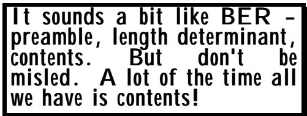

In the case of PER, the "header" is called the preamble, but is present for SEQUENCE only if there are optional elements, otherwise it is null and we have simply the encoding of each element. 在 PER 的情况下，所谓的“头部”被称为前导段。不过，只有当存在可选元素时，该头部才会出现在 SEQUENCE 中；否则，该头部就为空，我们看到的就只是每个元素的编码而已。

There is also a difference in the "L" part of an encoding from BER. Once again, it can frequently be missing (whenever the length is known in advance in fact), but also the terminology changes to "length determinant". This change was made because whilst the length octets of BER are always a count of octets (apart from the indefinite form), in PER the length determinant encodes a value that may be: 在编码的“L”部分方面，BER 与 PER 也有差异。同样，这个部分往往会被省略（实际上，当长度可以预先知道时，这个部分通常是存在的）。此外，术语也发生了改变，变成了“长度决定器”。这种改变是因为，在 BER 中，长度以八位元计数来表示；而在 PER 中，长度决定器则编码一个数值，该数值可以是：

• a count of octets (as in BER); or • 以八位组为单位进行计数（如 BER 格式）；或者

• a count of bits (used for the length of an unconstrained BIT STRING value); or • 位数的统计（用于确定无约束的 BIT 字符串的值的长度）；或者

• a count of iterations (used to determine the length of a SEQUENCE OF or SET OF value). • 迭代次数（用于确定“序列”或“集合”的长度）。

It is also the case that in PER the length determinant is not necessarily an integral multiple of eight bits. 此外，在 PER 中，长度的决定因素并不一定是 8 位整数的倍数。

The precise form and encoding of a length determinant is described later. 长度决定因子的具体形式与编码方式将在后面详细描述。

Each of the three pieces of encoding encode into what is called a bit-field. The length of this bitfield is either statically determinable from the type definition, or that part of the encoding will be preceded by a length determinant encoding. The term "bit-field" is used to imply that the field is not necessarily an integral multiple of eight bits, nor in general is the field required to start on an octet boundary. 这三部分编码中的每一部分都被编码成一种称为“位字段”的结构。这种位字段的长度要么可以从类型定义中直接确定，要么会在编码过程中有一个用于确定长度的部分。所谓“位字段”，意味着该字段不一定是 8 位的整数倍，而且通常也不要求该字段必须以 8 位字节的边界开始。

As we proceed through the encoding of a value of a large and complex structured type, we generate a succession of bit-fields. At the end of the encoding, these are simply placed end-to-end (in order), ignoring octet boundaries, to produce the complete encoding of the value. 在对大型且结构复杂的数值进行编码的过程中，我们会生成一系列位字段。在编码完成后，这些位字段会被按顺序连接在一起，忽略字节边界，从而得出该数值的完整编码结果。

## 2.2 Partial octet alignment and PER variants 2.2 部分八位组对齐方式及 PER 的多种变体

There are a couple of further wrinkles on the overall structure, of which this is the first! 在整个结构中还有几处需要进一步解决的问题，而这只是其中的第一个问题而已！

There are some fields where the designers of PER felt that it would be more sensible to ensure that the field started on an octet boundary (for simplicity of implementation and minimisation of CPU cycles). Fields to which this applies can be identified from the type definition (and do not depend on the particular value being transmitted). Such cases are said to encode into octet-aligned bitfields. In the final concatenation of bit-fields, padding bits are inserted as necessary before any octet-aligned bit-fields to ensure that they start at a multiple of eight bits from the start of the entire encoding of the outer-level type - the message, or "protocol data unit" (PDU). 在一些字段中，PER 的设计者认为，为了简化实现过程并减少 CPU 占用时间，让字段从八位字的边界开始是一个更合理的做法。这些字段可以通过类型定义来识别（它们并不依赖于实际传输的具体值）。这种编码方式可以被看作是将字段编码为按八位字排列的位字段。在最终合并位字段时，会在每个按八位字排列的位字段之前插入填充位，以确保这些字段从整个外层类型编码的起始位置开始，其长度都是 8 的倍数——也就是消息或“协议数据单元”。

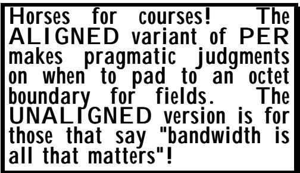

There are some applications (air traffic control is one), where the padding bits are not wanted - minimising bandwidth is considered the primary need. There are therefore formally two variants of PER: 有一些应用场景中并不需要使用填充位——例如空中交通管制领域，此时最小化带宽需求才是首要考虑的问题。因此，PER 有两种正式的实现方式：

• the ALIGNED variant (with padding bits); and • 对齐版本（包含填充位）；以及

• the UNALIGNED variant (with no padding bits, and with some other bandwidth reduction features that will be described later). • 非平行排列的版本（没有填充位，同时还有一些其他的数据带宽降低功能，这些功能将在后面详细说明）。

## 2.3 Canonical encodings 2.3 标准编码方式

BASIC-PER is largely canonical, but there are some types (SET OF, some character string types, time types, and some occurrences of DEFAULT) where being 100% canonical is "expensive". So BASIC-PER (being pragmatic!) has non-canonical encodings for these types. CANONICAL-PER is fully canonical. BASIC-PER 基本上属于标准编码方式，不过有一些类型（如 SET OF、某些字符字符串类型、时间类型，以及 DEFAULT 的一些用法）并非完全符合标准编码规则。因此，BASIC-PER 为了实用起见，为这些类型提供了非标准的编码方式。而 CANONICAL-PER 则完全遵循标准编码规则。

This is another area that gives rise to further encoding rules within the general PER family. 这是另一个会催生更多编码规则的领域，属于通用的 PER 家族的一部分。

Notice that whilst BER has many encoder's options, leading to the production of specifications for CER and DER, PER avoids options in the basic encoding, and looks at first sight to be canonical. (It is certainly far more canonical than BER!) 需要注意的是，虽然 BER 提供了许多编码选项，从而产生了 CER 和 DER 的规范，但 PER 却避开了这些复杂的编码选项，看起来更像是一种规范化的编码方式。（实际上，PER 确实比 BER 更规范化！）

However, to produce truly canonical encodings (as with BER) requires a sort of SET OF elements, and adds complexity to encoding character string types like GeneralString and GraphicString. Socalled BASIC-PER (with both ALIGNED and UNALIGNED variants) does not do this, and produces canonical encodings ONLY if these types are not involved. CANONICAL-PER (with an ALIGNED and an UNALIGNED variant) is fully canonical, and introduces sorting of SET-OF and special rules for GeneralString etc. The actual rules are exactly the same (and are specified by reference) as those used to turn BER into CER. 不过，要生成真正符合规范的编码方式（就像 BER 那样），就需要一组特定的元素，这会增加对像 GeneralString 和 GraphicString 这样的字符字符串类型进行编码的复杂性。所谓的 BASIC-PER 编码方式（包括 ALIGNED 和 UNALIGNED 两种变体）并不具备这种特性，它只能在这些类型不出现的情况下生成规范化的编码。而 CANONICAL-PER 编码方式（也有 ALIGNED 和 UNALIGNED 两种变体）则完全符合规范，它还会对 SET-OF 类型进行排序，并对 GeneralString 等类型引入特殊的规则。实际上，其规则与用于将 BER 转换为 CER 所使用的规则完全相同（并且是通过引用来指定的）。

## 2.4 The outer level complete encoding 2.4 外部层的完整编码

Another slight complication arises at the outer level of a complete encoding (the total message being sent down the line). (This is a pretty detailed point, and unless you are heavily involved in producing encodings you can skip to the next clause). 在完整编码的外层阶段，还会出现另一个小问题（即整个消息是如何被传输出去的）。这一点相当重要，不过如果你并不太熟悉编码的生成过程，那么可以直接跳到下一节内容。

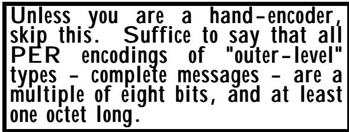

There are a few theoretical cases where a message may encode into zero bits with PER. This would occur, for example, with an outer-level type of NULL, or of a SET OF constrained to have zero iterations (both are highly unlikely to occur in practice, but ...!). 在某些理论情况下，一个消息可以编码为零比特，这种情况会在某些特定情况下发生。例如，当使用外部级别的 NULL 类型时，或者当某个集合被限制为只有零次迭代时，就有可能出现这种情况（不过，实际上这种情况很少发生……）。

The problem here is that if the way a carrier protocol is used allows multiple values of that type to be placed into the carrier, a multiple of zero bits is still zero bits, and the receiver would not know how many values had been sent, even with complete knowledge of the type definition! 这里的问题在于，如果载体协议的使用方式允许将多个该类型的数值存入载体中，那么多个零位仍然会被表示为零位。这样一来，即使接收方完全了解类型的定义，也无法知道究竟发送了几个数值。

So PER requires that if the complete encoding of the outer-level type is zero bits (which would mean that the outer-level type contains only one abstract value), then a single one-bit is used for that encoding instead. 因此，PER 规定，如果外层类型的完整编码为 0 位（这意味着外层类型只包含一个抽象值），那么就可以使用 1 位来编码该类型。

And finally, recognising that carrier protocols often provide "buckets" that are only able to contain multiples of eight bits, PER specifies that the complete encoding should always be padded at the end with zero bits to produce an integral multiple of eight bits. (Again, this is to ensure that there is no doubt at the decoding end about the number of values that have been encoded into the octet bucket that the carrier uses to convey the PER encoding from encoder to decoder). 最后，由于载波协议通常只提供能够存储 8 位倍数的比特数，因此 PER 规定在编码过程中，末尾必须填充零位比特，以确保解码端能够明确知道每个八位字节中编码了哪些值。这一点非常重要，因为它可以避免解码过程中出现任何误解。

So the minimum size of a complete outer-level PER encoding is one octet, and it is always a multiple of eight bits, but individual component parts are generally not a multiple of eight bits, and may be zero bits. 因此，完整的外部级别 PER 编码的最小尺寸为一个八位元，并且总是以八位元为倍数进行表示。不过，各个组成部分通常并不以八位元为倍数，有些组件甚至可以为零位元。

## 3 Encoding values of extensible types 3. 可扩展类型的编码值

PER has a uniform approach to extensibility. Refer in what follows to Figure III-15 for an illustration of the encoding of extensible INTEGER and string values, to Figure III-16 for an illustration of the encoding of extensible SET and SEQUENCE values, to Figure III-17 for an illustration of the encoding of extensible CHOICE values, and to Figure III-18 for an illustration of the encoding of extensible ENUMERATED values. PER 对可扩展性的处理采用了统一的方法。关于可扩展整数和字符串值的编码方式，请参考图 III-15；关于可扩展集合和序列值的编码方式，请参考图 III-16；关于可扩展选择值的编码方式，请参考图 III-17；关于可扩展枚举值的编码方式，请参考图 III-18。

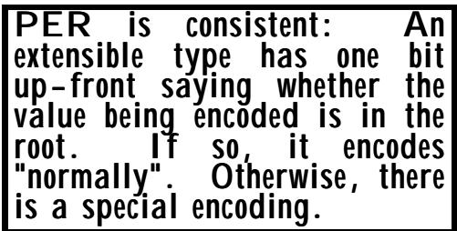

```txt
Either:
0
followed by:
An encoding of a value of the type, which is the same as that for the type without an extensibility marker or extensions.
Or:
1
followed by:
An encoding for a value of the extensible type which is outside the root, which is the same as that for values of the unconstrained type.
Figure III-15: Extensible constrained INTEGER or string encodings 
```

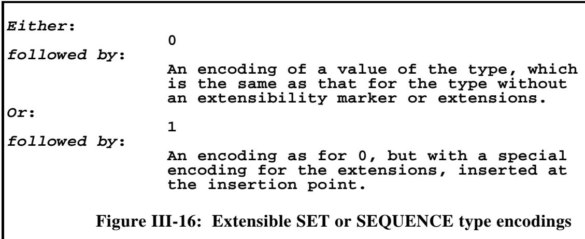

Any type (a constrained INTEGER, a constrained string, a SEQUENCE, a SET, a CHOICE, or an ENUMERATED) that has an extensibility marker (the ellipsis) in its type definition or in a PERvisible constraint has a value of that type encoded as follows: 任何具有可扩展性的类型（包括受限整数、受限字符串、序列、集合、选择或枚举类型），在其类型定义或 PER 可见约束中带有省略号表示的可扩展性标记时，其类型值将按照以下方式进行编码：

```txt
Either:
0
followed by:
An encoding of the choice index (identifying an alternative which is present in the root), which is the same as that for the type without an extensibility marker.
followed by:
The encoding of a value of the chosen alternative within the root.
Or:
1
followed by:
A different encoding for the choice index, (identifying an alternative outside the root).
followed by:
The encoding of a value of the chosen alternative that is outside the root.
Figure III-17: Extensible CHOICE encodings 
```

• There is a one-bit-long bit-field encoded up-front - the extensions bit. • 有一个长度为 1 位的数据字段被预先编码好了——那就是扩展位。

The extensions bit is set to zero if the value being encoded is in the root (one of the original INTEGER or ENUMERATED values, or a SET or SEQUENCE value in which all extension additions - if any - are absent). 如果所编码的值属于根节点（即原始的 INTEGER 或 ENUMERATED 类型之一，或者是一个 SET 或 SEQUENCE 类型，且其中没有包含任何扩展属性），那么这些扩展属性对应的字段值将被设置为零。

• The extensions bit is set to one otherwise (values outside the root). • 如果其他值不在根节点范围内，则“扩展”选项会被设置为 1。

NOTE — Only implementations of versions greater than 1 will set the bit to one, but all implementations may encode a root value, and hence set the extensions bit to zero. 注意：只有那些支持版本高于 1 的实现才会将该位设置为 1。不过，所有实现都可能会编码一个根值，因此会将扩展位设置为 0。

```txt
Either:
0
followed by:
An encoding of a value of the type, which is the same as that for the type without an extensibility marker or extensions.
Or:
1
followed by:
An encoding for a value of the extensible type which is outside the root.
Figure III-18: Extensible ENUMERATED type encodings 
```

• If the "extensions bit" is set to zero, what follows is exactly the same encoding (for all types that can be marked extensible) as if the extension marker (and all extensions) was absent. • 如果“扩展标志”被设置为零，那么对于所有可以被标记为可扩展的类型来说，后续的编码方式将完全与没有使用扩展标志的情况相同。

If the "extensions bit" is set to one, the following encoding is sometimes the same as for the unconstrained type, but sometimes different, as follows: 如果“扩展位”被设置为 1，那么接下来的编码方式有时会与无约束类型相同，但有时也会有所不同，具体如下：

If the "extensions bit" is set to one when encoding an extensible INTEGER or extensible string, what follows is an encoding which is the same as for a value of the unconstrained type. 如果在对可扩展的整数字段或可扩展字符串进行编码时，将“扩展位”设置为 1，那么后续的编码方式就与对无约束类型的值进行编码时相同。

If the "extensions bit" is set to one when encoding a SEQUENCE or SET value, what follows is the encoding of the elements that are in the root, with a special encoding (see 15.2) inserted at the insertion point to carry the values of elements outside the root (and to identify their presence). 如果在编码一个序列或集合值时将“扩展位”设置为 1，那么接下来就是对根节点中各个元素的编码。在插入点处会插入一种特殊的编码方式（参见 15.2 节），用来标记根节点之外的一些元素的值，并表明这些元素的存在。

If the "extensions bit" is set to one when encoding a CHOICE value, what follows is a special encoding of the choice index (recognising that although theoretically unbounded, the value will usually be small), followed by an encoding of the chosen alternative. (See 8.2 for the encoding of a "normally small whole number"). 在编码 CHOICE 值时，如果“扩展位”被设置为 1，那么接下来就是对选择指数的特殊编码（需要注意的是，虽然理论上这个值可以是无限的，但实际上通常都会很小）。之后才是所选选项的编码。（有关“通常较小的整数”的编码方式，请参见 8.2 节。）

• If the "extensions bit" is set to one when encoding an ENUMERATED value, the same encoding is used as for the choice index, for again the value is theoretically unbounded, but in practice will usually be small. • 当对枚举值进行编码时，如果“扩展位”被设置为 1，那么使用的编码方式与选择索引时相同。这样一来，该值理论上可以是无限大的，但实际上通常都会比较小。

It will be seen from the above that the only cost in version 1 of including an extensibility marker is 1 bit (possibly causing the insertion of up to seven padding bits after it). We will see later that if the type actually has extensions, and values outside the root are encoded, we generally get an additional overhead of a length field for such values. 从上述内容可以看出，在版本 1 中，引入可扩展标记的唯一成本就是 1 比特的开销（这可能会导致在标记之后额外添加多达 7 个填充比特）。稍后我们会了解到，如果类型实际上包含扩展功能，并且需要编码那些位于根结构之外的值，那么通常会额外需要一个用于这些值的长度字段。

The encoding for values of extensible types that lie outside the root is described below after the description of the encoding for types that were not defined to be extensible (and for values of extensible types that are within the root). 对于那些不属于根类型的可扩展类型的值的编码方式，将在下文中进行描述。而对于那些被定义为不可扩展类型的类型的值以及属于根范围内的可扩展类型的值的编码方式，则已在前面进行了说明。

It will be clear from the above description that encoders and decoders must agree on whether a type is extensible or not, and if so on precisely which abstract values are in the root. Where a type has an ellipsis as a direct part of the type definition - SET, SEQUENCE, CHOICE, ENUMERATED, there is little problem. But where a type such as integer or a character string is constrained with a constraint that contains an ellipsis, the situation is (perhaps surprisingly!) not so clear cut, and the type may well be declared to be not extensible for PER-encodings, despite the clear presence of an ellipsis! This area is discussed at the end of the discussion on PER-visible constraints. 从上述描述中可以清楚地看出，编码器和解码器必须就某个类型是否可扩展达成一致。如果类型具有省略号作为类型定义的一部分——比如 SET、SEQUENCE、CHOICE、ENUMERATED 等类型，那么问题并不复杂。但是，当像整数或字符字符串这样的类型被某种包含省略号的约束条件所限制时，情况就变得相当复杂了。在这种情况下，尽管类型定义中明确包含了省略号，但该类型仍可能被声明为不可扩展，以适应 PER 编码方式。这一领域在关于 PER 可见约束的讨论的最后部分进行了详细的探讨。

## 4 PER-visible constraints 4 个可见的约束条件

## 4.1 The concept 4.1 概念

Crucial to understanding PER encodings is the concept of PER-visible constraints. These are (subtype) constraints which, if present, affect the encoding of the parent type. 理解 PER 编码的关键在于 PER 可见约束的概念。这些属于子类型约束，如果存在这些约束，就会影响到父类型的编码方式。

The most important PER-visible constraints are those placed on the INTEGER type and on the lengths of strings (or on iteration counts for SET OF and SEQUENCE OF). There are also constraints on the alphabet of some character string types that are PERvisible (see Clause 6), and can reduce the number of bits per character for these character strings. 对 PER 可见性有约束的最重要条件，是那些对 INTEGER 类型以及字符串长度（或 SET OF 和 SEQUENCE OF 结构中的迭代次数）所施加的约束。此外，某些字符字符串类型的字母表也存在 PER 可见性的约束（详见第 6 条），这些约束会减少这些字符字符串每个字符所需的位数。

Constraints that are PER-visible in the above cases are quite widely-defined. They may be applied "a bit at a time", through repeated use of type references, or they may be 在上述情况下，那些在页面上可见的约束条件有着非常广泛的定义。这些约束条件可以逐步被应用，通过反复使用类型引用来实现，或者也可以一次性应用。

PER-visible constraints are constraints that PER uses to produce less verbose encodings - for example - INTEGER (0..7) encodes into just three bits because the (0..7) constraint is PER-visible. BER ignores all constraints, and hence always needs a length field. PER takes a pragmatic view and uses constraints that are "easily" used and produce important bandwidth gains, but ignores other more complex constraints. PER 可见约束是指 PER 用来生成更简洁编码方式的约束条件。例如，INTEGER(0..7)这种编码方式仅用三个比特就能表示，因为(0..7)这个约束是 PER 可见的。而 BER 则完全忽略所有约束条件，因此总是需要长度字段来表示数据长度。PER 采取务实的态度，只使用那些“易于使用”且能带来显著带宽节省的约束条件，而忽略那些更复杂的约束条件。

applied through the use of parameterisation. Or they may be extremely complicated subtype specifications involving included subtype constraints, intersections and unions. 它们是通过参数化来应用的。或者，这些规范可能是非常复杂的子类型定义，包含有子类型的约束条件、交集和并集等元素。

There are two comments to make on this: first, most specifications are pretty simple, so handcoders don't have to do too much work to calculate the actual constraint in the real world; second, an ASN.1 compiler has no problems in resolving such expressions of arbitrary generality down to a precise record of the permitted values for the integer type, the length of the string, etc. 关于这一点，有两点需要指出：首先，大多数规范都相当简单，因此手工编码者不需要花费太多精力来计算现实世界中的实际约束条件；其次，ASN.1 编译器在解析这种具有任意通用性的表达式时毫无问题，因为它能够精确地确定整数类型、字符串长度等允许的值范围。

## 4.2 The effect of variable parameters 4.2 可变参数的影响

One major exception to PER-visibility is if, in trying to determine the actual constraint, a variable parameter (a parameter that still does not have a value when the abstract syntax is defined) is textually referenced in the resolution of the actual constraint, then the constraint ceases to be PER- PER-可见性的一个主要例外情况是：在确定实际约束条件时，如果某个变量参数（即在抽象语法定义时尚未有值的参数）在具体的约束条件描述中被明确提及，那么这种约束条件就不再属于 PER-可见性范畴了。

Presence of a variable parameter in a constraint means that PER totally ignores that entire constraint. 在约束条件中存在一个可变参数意味着 PER 完全忽略了整个约束条件。

visible, and would encode as if that constraint were not present. 可见的，并且会像没有这个限制一样进行编码。

This is the first of several cases where a type which is formally extensible encodes as if it was not extensible. In this case, it contains an ellipsis in a constraint that is not PER-visible, so (assuming no other constraints have been applied) it will encode as not extensible and not constrained. 这是多个类似案例中的第一个例子：一种被定义为可以扩展的类型，实际上却表现得并不具备扩展性。在这个案例中，该类型在一个约束条件中使用了省略号，而这样的省略是肉眼无法辨认的。因此（假设没有其他约束条件被应用），该类型会被编码为不具备扩展性和约束性。

Variable parameters are still not heavily used, so this is not too big an issue, but the term textually above refers to the possibility of constructing union and intersection expressions which appear to use the value of such a parameter, but where the actual result of the expression evaluation proves to be the same no matter what value the variable parameter might have. Even if the parameter does not affect the result, its textual presence kicks the constraint out of court. This was done to ease implementation efforts for compilers, and to avoid possible errors in hand-encoding. 可变参数目前仍未被广泛使用，因此这并不算什么问题。不过，上述术语实际上指的是那种可以构建 union 和 intersection 表达式的情况，这些表达式似乎会利用某个参数的值，但实际上无论该参数取何值，表达式的计算结果都是相同的。即使该参数本身并不影响计算结果，其存在的概念性描述也足以使这种约束失效。这样做是为了简化编译器的实现工作，同时避免在进行手工编码时可能出现的错误。

## 4.3 Character strings with variable length encodings 4.3 具有可变长度编码的字符字符串

Another major exception to PER-visibility that should be noted is that a constraint on the length of a character string applies to the number of (abstract) characters that can appear in the string. If the encoding is something like UTF8 (or GeneralString), where the number of octets needed to encode each character is different for different characters (and in the case of GeneralString can depend on encoder options), the length constraint is not much help at the encoding level - a length field is still needed in order to find the end of the encoding. 另一个需要注意的 PER 可见性方面的例外是：字符字符串的长度存在一个限制，即字符串中出现的（抽象）字符的数量受到了限制。如果编码方式类似于 UTF8（或 GeneralString），那么每个字符所需的八位元数量会有所不同（而在 GeneralString 的情况下，这一数值还可能取决于编码器的设置）。在这种情况下，长度限制在编码层面并没有太大帮助——仍然需要一个长度字段来标识字符编码的结束位置。

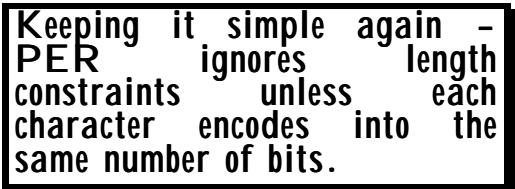

(The above statement is not strictly true. If the itty-gritty details of an encoding scheme such as UTF8 are fully understood then knowledge of the number of abstract characters being encoded is in fact sufficient to find the end of the encoding, but PER wants a decoder to be able to find the end of the encoding without resorting to such detailed analysis.) （上述陈述并不完全正确。虽然如果完全理解诸如 UTF8 这样的编码方案的细节，那么仅仅知道被编码的抽象字符的数量就足以确定编码的结束位置。不过，PER 希望解码器能够在不进行如此详细分析的情况下找到编码的结束点。）

So character set types that have a fixed number of octets for each abstract character are called known multiplier types, and length constraints on such types are PER-visible (and will give rise to reduced or eliminated length encodings), but for character string types that are not "known multiplier types", the constraints are not PER-visible (do not affect the encoding of values of the type), and any extension markers in these constraints are ignored for the purpose of PER encodings. 那些每个抽象字符都有固定数量八位元的字符集类型被称为“已知乘数类型”。对于这类类型，长度限制是严格可见的（这通常会导致编码长度减少或消除）。然而，对于那些不属于“已知乘数类型”的字符串类型来说，这些限制就不具有可见性了（它们不会影响该类型值的编码）。在 PER 编码过程中，这些限制中的任何扩展标记都会被忽略。

## 4.4 Now let's get complicated! 4.4 现在让我们来复杂一些吧！

This book is called "ASN.1 Complete", so we had better explore a bit more about PER-visibility and about extensibility. 这本书的标题是《ASN.1 完整指南》，因此我们有必要进一步了解 PER 可见性以及可扩展性相关的内容。

First, we note that there are a number of different sorts of subtype constraint which may be used alone, but which in the general case combine together using EXCEPT, INTERSECTION, and UNION. We call the basic building blocks component constraints, and the complete constraint the outer-level constraint. Both component constraints and outer-level constraints may contain an ellipsis! 首先，我们注意到存在多种不同类型的子类型约束，这些约束可以单独使用，但在一般情况下，它们会通过 EXCEPT、INTERSECTION 和 UNION 等操作符进行组合使用。我们将构成这些约束的基本单元称为“组件约束”，而完整的约束则被称为“外层约束”。无论是组件约束还是外层约束，都可以包含省略号来表示某些信息。

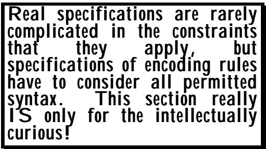

Whether a component constraint is PER-visible will depend in general on the sort of component constraint it is, and on the type being constrained. Figure III-19 gives a list. 一个组件约束是否可见，通常取决于该约束本身的类型以及被约束的具体内容。图 III-19 提供了一个列表，其中列出了各种组件约束的可见性情况。

<table><tbody><tr><td data-imt-p="1">Variable constraint 变量约束</td><td data-imt-p="1">Never visible 永远不可见</td></tr><tr><td data-imt-p="1">Single value constraint 单一值约束</td><td data-imt-p="1">Visible for INTEGER only 仅适用于整数类型的数据可见</td></tr><tr><td data-imt-p="1">Contained subtype constraint 包含的子类型约束</td><td data-imt-p="1">Always visible 始终可见</td></tr><tr><td data-imt-p="1">Value range 价值范围</td><td data-imt-p="1">Visible for INTEGER only and in an alphabet constraint on a known-multiplier character string type 仅对 INTEGER 类型可见，且必须位于一个以字母为字符集的约束条件所限定的已知乘数字符串类型中。</td></tr><tr><td data-imt-p="1">Size constraint 尺寸限制</td><td data-imt-p="1">Visible for OCTET STRING, SET and SEQUENCE OF, and known-multiplier character string types 适用于 OCTET STRING、SET 和 SEQUENCE OF 类型，以及已知乘性字符字符串类型</td></tr><tr><td data-imt-p="1">Permitted alphabet 允许使用的字母表</td><td data-imt-p="1">Visible for known-multiplier character string types 适用于已知乘数字符字符串类型</td></tr><tr><td data-imt-p="1">Inner subtyping 内部类型划分</td><td data-imt-p="1">Never visible 永远不可见</td></tr><tr><td colspan="2" data-imt-p="1">Figure III-19: PER-visibility of constraints 图 III-19：可感知性的约束条件</td></tr></tbody></table>

Two important points to note from Figure III-19 are that a single value constraint is only visible if applied to INTEGER, and a contained subtype constraint is always visible. This can give rise to some distinctly non-obvious effects in relation to known-multiplier character string types such as IA5String! Suppose we have: 从图 III-19 中可以注意到两个重要点：首先，只有当某个值约束应用于 INTEGER 类型时，它才会显示出来；其次，包含的子类型约束总是会显示出来。这一点可能会带来一些不太明显的影响，尤其是在处理像 IA5String!这样的已知乘数字符串类型时。假设我们有如下情况：

Subtype ::= IA5String ("abcd" UNION "abc" UNION SIZE(2)) MyString ::= IA5String (Subtype INTERSECTION SIZE(3)) 类型 ::= IA5String("abcd" UNION "abc" UNION SIZE(2)) 变量名 ::= IA5String(类型 INTERSECTION SIZE(3))

In Mystring, all the component constraints are PER-visible, and we expect to be able to work out the outer-level constraint. In Subtype, the first two component constraints are not PER-visible but the third is. What is the effect on Subtype and on MyString? This question, and a number of related ones, produced some lengthy discussion within the ASN.1 group with "keep it simple" colliding to some extent with "keep it general and intuitive". 在 MyString 中，所有组件的约束都是“PER 可见”的，我们预计能够计算出外部级别的约束。而在 Subtype 中，前两个组件的约束并非“PER 可见”，但第三个约束却是如此。这对 Subtype 和 MyString 有什么影响呢？这个问题以及一些相关的问题在 ASN1 小组中引发了一些长时间的讨论。在讨论过程中，“保持简单性”与“保持通用性和直观性”这两个原则在一定程度上发生了冲突。

The first important rule is that if any component constraint is not PER-visible, then the entire outerlevel constraint is declared to be not PER-visible, and will not affect the encoding. Notice here that if there is an ellipsis in either a component or in the outerlevel constraint, because we are ignoring the entire constraint, the type is NOT encoded as an extensible type. So Subtype above is treated by PER as unconstrained, and contributes all abstract values of an unconstrained IA5String in the set arithmetic for MyString. 第一个重要的规则是，如果任何组件约束都不是“PER-可见”的，那么整个外部级别约束也会被声明为“非 PER-可见”，从而不会影响编码过程。注意，如果组件或外部级别约束中出现省略号，因为整个约束被忽略了，所以该类型的类型就不会被编码为可扩展类型。因此，上述子类型被视為无约束的，其在 MyString 的集合运算中贡献的所有抽象值都属于无约束的 IA5String 类型。


For MyString, all component constraints are PER-visible, so the SIZE(3) applies, and values of the string encode as if it contained all possible abstract values of length 3. 对于 MyString 来说，所有组件的约束都是“完全可见”的，因此 SIZE(3)这个参数仍然适用。字符串的值会被编码为包含长度为 3 的所有可能抽象值。

There is one additional rule, related to the use of the ellipsis. When performing set arithmetic to determine whether a PER-encoding is extensible and what values are in the root, all ellipsis marks (and any actual additions) in a component constraint (or any of the component constraints of that component - such as Subtype above) are ignored. A constrained type is extensible for PERencodings if and only if an ellipsis appears at the outer-level of a constraint, all of whose © OS, 31 May 1999 287 component constraints are PER-visible. This is simple, but perhaps not quite what you might have expected. 还有一条与省略号使用相关的规则。在执行集合运算以确定某个 PER 编码是否可扩展时，该编码中出现的所有省略号标记（以及任何实际添加的内容）都会被忽略。一个受约束的类型只有在其所有约束条件的外层级别出现省略号时，才被认为是可扩展的。© OS，1999 年 5 月 31 日，第 287 页。这个规则很简单，但可能并不像你预期的那样。

Now consider a Version 2 specification, where the constraint in Version 1 was PER-visible, but in Version 2 things (such as a single value constraint) are added that would normally wreck PER-visibility. This does not (and cannot be allowed to) affect PERvisibility of the original Version 1 constraint, otherwise interworking would be prejudiced. So it is only those parts of a constraint that appear in the root that affect PER-visibility (and that affect the way a value is encoded). 现在考虑一下版本 2 的规范。在版本 1 中，约束条件是“可看见”，但在版本 2 中，出现了一些额外的约束条件（比如某个值约束），这些约束条件通常会破坏“可看见”的特性。不过，这些新增的约束条件并不应该影响版本 1 中原有约束条件的“可看见”特性，否则就会导致规范之间的互操作性问题。因此，只有那些出现在根节点中的约束条件部分才会影响“可看见”的特性，以及值编码方式。

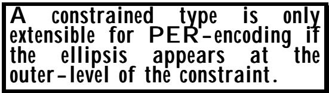

But as someone once said "Such contorted constraint specifications only ever appear in discussions within the ASN.1 group, never in real user specifications." And they are right! 但正如有人曾经说的：“这种扭曲的约束规范只出现在 ASN 社区的讨论中，在真正的用户规范中根本不存在。”他们是对的！

## 5 Encoding INTEGERs - preparatory discussion 5. 整数编码——预备性讨论

What matters for a PER-encoding of the INTEGER type (and of the lengths of known-multiplier 在 INTEGER 类型的编码中，以及对于已知乘数长度的计算来说，真正重要的因素是……

character strings) is not the actual values, but the range of values permitted by PER-visible constraints. It is the largest and smallest value that matter. An integer constrained to have only the two values 0 and 7 will still encode in three bits, not two. What matters is the range, not the number of values. 字符字符串中的值并不是实际的值，而是指由 PER 可见约束所允许的值范围。真正重要的其实是这个范围的最大值和最小值。一个被限制只能取 0 和 7 这两个值的整数，仍然可以用 3 位来表示，而不是 2 位。重要的是这个范围，而不是值的个数。

<table><tbody><tr><td data-imt-p="1">It's the largest and smallest values that matter. Gaps in between do not affect the encoding. 重要的是最大值和最小值之间的差异。中间的差值并不会影响编码结果。</td></tr></tbody></table>

Figure III-20 illustrates some simple constraints that are PER-visible, and the values that PER assumes need encoding. 图 III-20 展示了一些简单的约束条件，这些约束是 PER 可见的；而 PER 所采用的值则需要经过编码处理。

For any integer that has a lower bound (and similarly for the lengths of strings), what is encoded in the PER encoding is the offset from the lower bound. So the encoding of values of SET3 in Figure III-20 would use just 2 bits. 对于任何具有下限的整数（字符串的长度也是如此），PER 编码方式所表示的是与下限之间的差值。因此，在图 III-20 中，SET3 值的编码仅需要使用 2 位二进制数即可。

<table><tbody><tr><td data-imt-p="1">Type definition 类型定义</td><td data-imt-p="1">Values assumed to need encoding 那些被认为需要编码的价值观</td></tr><tr><td data-imt-p="1">INTEGER (0..7) 整数类型（0~7）</td><td data-imt-p="1">0 to 7 0 到 7</td></tr><tr><td data-imt-p="1">INTEGER (0 UNION 7) 整数类型 (0 联合 7)</td><td data-imt-p="1">0 to 7 0 到 7</td></tr><tr><td data-imt-p="1">SET1 ::= INTEGER (15..31) SET1 ::= 整数 (15..31)</td><td data-imt-p="1">15 to 31 15 到 31</td></tr><tr><td data-imt-p="1">SET2 ::= INTEGER (0..18) SET2 ::= 整数(0..18)</td><td data-imt-p="1">0 to 18 0 到 18</td></tr><tr><td data-imt-p="1">SET3 ::= INTEGER (SET1 INTERSECTION SET2) SET3 ::= 整数集合 (SET1 与 SET2 的交集)</td><td data-imt-p="1">15 to 18 15 到 18 岁</td></tr><tr><td data-imt-p="1">SET (SIZE (0..3)) OF INTEGER 整数类型，其大小可以是 0 到 3 中的一个数值。</td><td data-imt-p="1">Iteration count: 0 to 3 迭代次数：0 到 3 次</td></tr><tr><td data-imt-p="1">INTEGER (1 UNION 3 UNION 5 UNION 7) 整数类型（1、3、5、7）</td><td data-imt-p="1">1 to 7 1 到 7</td></tr><tr><td colspan="2" data-imt-p="1">Figure III-20: Values assumed to need encoding 图 III-20：被认为需要编码的数据值</td></tr></tbody></table>

When we look at the encoding of integers (and of the lengths of strings) we will see that there are three distinct cases: 当我们考虑整数的编码方式时（以及字符串长度的编码方式），会发现有三种不同的情况：

• We have a finite upper and lower bound (called a constrained value); • 我们拥有一个有限的上限和下限（这被称为“受限值”）；

• We have a finite lower bound, but no upper bound (called a semi-constrained value); • 我们有一个有限的下界，但并没有上界（这种情况被称为“半约束值”）；

• We do not have a lower bound (this cannot occur for the length of strings, as zero is always a lower bound); this is called an unconstrained value; (even if there is a defined upper bound! - the upper bound gets ignored in this case). • 我们并没有给出下限值（对于字符串长度来说，这种情况是不存在的，因为零始终是一个下限）；这种值被称为无约束值。（即使存在明确的上限的话——在这种情况下，上限会被忽略。）

We describe below the encoding of constrained, semi-constrained, and unconstrained integers, and of constrained and semi-constrained lengths of strings in subsequent text, also addressing any special encodings that arise in the case of an extensible type. In the case of a constrained integer (or length), there are several different encodings depending on the range permitted by the constraint. (Remember that the absolute values permitted do not matter). 我们在下文中描述了受限整数、半受限整数以及无限制整数的编码方式，同时还介绍了字符串长度在受限和半受限情况下的编码方法。此外，我们还讨论了在可扩展类型中出现的一些特殊编码问题。对于受限整数或字符串长度来说，根据约束条件所允许的范围不同，会有多种不同的编码方式。（需要注意的是，所允许的数值范围并不重要。）

The reader may wonder whether it is worth bothering with using "range" (and offset from the lower bound), rather than just determining the coding based on whether negative values are allowed or not, and then using enough bits to handle the largest value permitted by the constraint. Certainly INTEGER (10..13) and INTEGER (-3..0) are not likely to occur in the real world! But INTEGER (1..4) may be more common, and will use just two bits with the "offset from lower bound" rule, rather than three if we encoded the actual values. 读者可能会想，是否值得特意使用“范围”这个概念（并考虑从下限开始进行偏移处理），而不是仅仅根据是否允许使用负值来决定编码方式，然后再用足够的位数来处理由约束条件所允许的最大值。当然，在现实世界中，INTEGER(10..13)和 INTEGER(-3..0)这样的数值不太可能出现！不过，INTEGER(1..4)可能更为常见。使用“从下限开始偏移”的规则，只需要两个位数就能表示这些数值，而不是像编码实际数值那样使用三个位数。

Working with "offset from lower bound" may appear to be an additional complexity, but is actually simpler than a specification saying "First see if all allowed values are positive or not, then etc etc", and amounts to just a couple of orders in a couple of places in actual implementations. 使用“从下限开始偏移”的方法看起来可能更复杂一些，但实际上比那种要求“先判断所有允许的值是否为正数，然后再进行后续操作”的规范要简单得多。在实际实现中，这种方法的复杂度通常只有几个数量级而已。

## 6 Effective size and alphabet constraints. 6. 有效的尺寸和字母表限制。

## 6.1 Statement of the problem 6.1 问题的陈述

We mentioned above (but did not emphasise) that constraints such as: 我们之前已经提到过（不过并没有特别强调）诸如以下这些限制条件：

```autohotkey
MyString ::= PrintableString (FROM (("0" .."9")  
UNION ("#")  
UNION ("*")) 
```

are PER-visible, and would result in just four bits per character for the encoding of values of "MyString" (which consists of all strings that contain only zero to nine and hash and star - twelve characters). 这些编码方式是可见的，因此“MyString”字符串的编码方式下，每个字符只需要 4 位比特位即可表示（“MyString”由所有只包含 0 到 9 以及哈希和星号这 12 个字符组成的字符串构成）。

This is described more fully in the discussion of the encoding of character string values in clause 14, but note here that for alphabet constraints, what matters is the actual number of characters permitted, not the range of characters. This is different from the treatment of constrained integers, as the need to define a character string type with an almost random selection of characters being permitted is far more likely to arise than the need to define an integer type with a random selection of integer values. 在第 14 节中关于字符串值编码的讨论中有更详细的说明。不过这里需要注意的是，对于字母约束来说，重要的是允许使用的字符数量，而不是字符的范围。这与受限整数的处理方式不同，因为定义字符串类型时，通常需要允许使用几乎随机选择的字符，这种情况比定义整数类型时需要允许使用随机整数值的情况要更常见。

There is, however, a slightly difficult interaction between alphabet constraints such as that above and length (size) constraints which can also be applied. 不过，上述字母顺序约束与长度（大小）约束之间存在着一些较为复杂的相互作用，这种相互作用也是需要考虑的。

For example, consider 例如，考虑以下情况：

```txt
MyString1 ::= IA5String (FROM ("01") INTERSECTION SIZE (4))
MyString2 ::= IA5String (FROM ("TF") INTERSECTION SIZE (6))
MyString3 ::= IA5String (Mystring1 UNION Mystring2) 
```

All constraints are PER-visible, and it is clear that MyString 1 has a fixed length of 4 characters so should encode without a length field, and contains only two characters "0" and "1", and should encode with just one bit per character. Similarly MyString2 has an alphabet constraint restricting its character set to "T" and "F" (again giving one bit per character), and a size constraint of 6. 所有约束条件都是显而易见的。显然，MyString1 的固定长度为 4 个字符，因此不需要使用长度字段进行编码；它只包含两个字符“0”和“1”，每个字符只需要用一个比特位来表示。同样，MyString2 有一个字符集限制，即只能使用“T”和“F”两个字符，这也意味着每个字符只需要用一个比特位来表示。此外，MyString2 还有 6 个字符的长度限制。

But what is the alphabet and size constraint on MyString3? Does it have them? This is where the concept of an effective size constraint and an effective alphabet constraint comes in. 但是，MyString3 中的字母表规则和大小限制是什么呢？它真的有这些限制吗？这里就涉及到“有效大小限制”和“有效字母表限制”的概念了。

## 6.2 Effective size constraint 6.2 有效尺寸限制

An "effective size constraint" is defined to be a single size constraint such that a length is permitted by that size constraint if and only if there is at least one abstract value in the constrained type that has that length. “有效大小限制”指的是这样一种大小限制：只有当受限类型中至少有一个抽象值的长度满足该限制时，该长度才被允许使用。

So in the earlier example, MyString3 has abstract values of length 4 and 6 only. But what matters is the range of a size constraint, which is 4 to 6. This is equivalent to 0 to 2 when we remove the lower bound, so the length field of MyString3 would encode with 2 bits. 在前面的例子中，MyString3 只有长度为 4 和 6 的抽象值。但重要的是大小范围的限制，即 4 到 6 之间。如果去掉下限，这就相当于 0 到 2 之间了，所以 MyString3 的长度字段可以用 2 位来表示。

## 6.3 Effective alphabet constraint 6.3 有效的字母顺序限制

In an exactly equivalent fashion, an "effective alphabet constraint" is defined to be a single permitted alphabet constraint such that a character is permitted by that alphabet constraint if and only if there is at least one abstract value in the constrained type that contains somewhere within it that character. 以一种完全类似的方式，所谓的“有效字母表约束”可以被定义为一种单一的允许字母表约束。也就是说，一个字符只有在其所属于的约束类型中至少存在一个抽象值包含该字符时，才被允许使用该字母表约束来表示。

So in the earlier example, all the characters "0", "1", "T" and "F" are used by at least one abstract value, and the effective alphabet constraint allows these (and only these) characters, so two bits will be used per character. 所以在前面的例子中，所有的字符“0”、“1”、“T”和“F”都被至少一个抽象值所使用。而有效的字母表限制要求只能使用这些字符，因此每个字符需要两个比特来表示。

It is normally a simple matter for both a human and a computer to work out the effective alphabet and effective size constraints in every case, provided the rules on what is PER-visible are understood and applied. 对于人类和计算机来说，只要理解并应用了关于什么是“可见”的规则，那么确定每种情况下的有效字母表以及有效的大小限制通常都是一件简单的事情。

This is particularly true for a human because constraints are in practice quite simple. For a computer (which in an ASN.1 tool needs to be programmed to handle all possible constraints, no matter how complex or way-out), a program can be written which can take any arbitrarily complex set arithmetic expression (using only size and alphabet constraints) and resolve it down to an effective alphabet and an effective size constraint. It does this using equalities like: 对于人类来说，这种情况尤为明显，因为约束实际上非常简单。而对于计算机而言（在 ASN.1 工具中，计算机需要被编程来处理所有可能的约束，无论这些约束多么复杂或难以处理），可以编写出一个程序，该程序能够接受任何任意复杂的集合算术表达式（仅使用大小和字母表的约束），并将其解析为有效的字母表和有效的大小约束。这一过程是通过使用诸如“相等”这样的逻辑运算符来实现的。

```txt
A EXCEPT B equals A INTERSECTION (NOT B)
and
NOT (A UNION B) equals (NOT A) INTERSECTION (NOT B)
etc 
```

If single value constraints had been allowed on character string types, this would have been a much more difficult task. 如果字符字符串类型允许使用单一值约束条件的话，那么这件事就会变得困难得多。

## 7 Canonical order of tags 7. 标签的规范顺序

The reader will recall that PER requires a choice index, which means numbering the alternatives in a CHOICE in some order. Similarly, it avoids the need to encode a tag with elements of a SET by determining a fixed order for transmission of values of those elements. 读者应该记得，PER 要求使用一个选择索引，这意味着需要按照某种顺序对 CHOICE 中的选项进行编号。同样，它避免了需要为 SET 中的元素编码标签的情况，而是为这些元素的取值确定了固定的传输顺序。

It would have been possible to have used the textual order of the alternatives and elements for this purpose, but this was felt to be inappropriate, as any change in the textual order (perhaps in going from version 1 to version 2, for purely editorial reasons) would change the encoding on the line. Essentially, such a change of order would have to be forbidden, which was felt to be counter-intuitive. 虽然可以使用备选方案和元素的文本顺序来达到这个目的，但这样做被认为是不合适的。因为无论何时改变文本顺序（比如从版本 1 切换到版本 2，纯粹出于编辑上的考虑），都会改变该行的编码方式。实际上，这样的顺序调整应该被禁止，因为这样做会违反直觉。

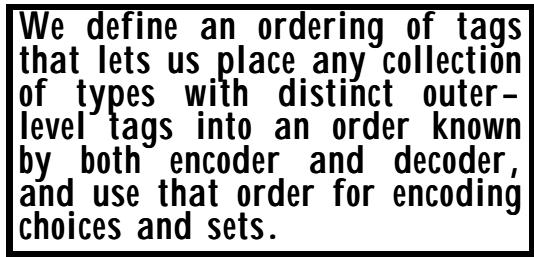

As all alternatives in a CHOICE and all elements in a SET are already required to have distinct (outer-level) tags, there is an obvious alternative available to that of using textual order: define an order for tag values, and then effectively re-order CHOICE and SET into tag order before determining the choice index or the order of transmission for SET elements. This is what is done. 在 CHOICE 结构中，所有的替代选项以及 SET 中的各个元素都明确要求具有独立的（外部级别的）标签。因此，除了使用文本顺序之外，还有一个明显的替代方案：为标签值定义一种排序方式，然后按照该排序方式重新整理 CHOICE 结构和 SET 中的元素，从而在确定选择索引或 SET 元素传输顺序时更加合理。实际上，这就是我们所采取的方法。

The so-called canonical tag order is defined to be: 所谓的规范标签顺序定义为：

```txt
Universal Class (first)
Application Class
Context-specific Class
Private Class (last) 
```

with lower tag numbers coming before higher ones within each class. 在每个类别中，较低的分类号会出现在较高的分类号之前。

There is just one small complication - there always is! Recall that most types have the same outerlevel tag for all their abstract values, and we can validly talk about the "tag of the type". The only case where this is not true is for an untagged choice type. In this case different abstractvalues may have different outer level tags, and we cannot talk about "the tag of the type" so easily. (But remember that all these tags are required to be distinct from any of the tags of any other type in a SET or CHOICE). PER defines the tag of an untagged choice type as the smallest tag of any of its values, for the purpose of putting types into a canonical order, and the problem is solved. 不过有一个小问题需要解决——不过这种情况总是存在的！记住，大多数类型的所有抽象值都拥有相同的外部标签，因此我们可以合理地谈论“类型的标签”。唯一例外的是未标记的选择类型。在这种情况下，不同的抽象值可能拥有不同的外部标签，因此我们无法如此简单地谈论“类型的标签”。（但请记住，所有这些标签都必须与任何其他类型的标签区分开来。）PER 将未标记选择类型的标签定义为其所有值中最小的标签，这样就能将类型按规范顺序进行排序，问题也就解决了。

## 8 Encoding an unbounded count 8. 对无限数量的数据进行编码

If constraints are placed on lengths, iteration counts, or sizes of integers, PER will often omit the length field completely, or will use a highly optimised encoding for the length (described later), otherwise it will use length encodings similar to (but different from) those of BER. It is these encodings that are described in this clause. 如果對整数长度、迭代次数或大小施加了限制，PER 通常会完全省略长度字段，或者会使用一种高度优化的长度编码方式（详见后文）。否则，它会使用与 BER 类似的编码方式，但有所不同。正是这些编码方式在本文中得到了描述。

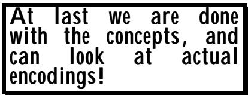

## 8.1 The three forms of length encoding 8.1 三种长度编码方式

PER has an equivalent of the BER short and long definite length and indefinite length forms, but there are a number of important differences, and apart from the short definite form the encodings are not the same as BER. PER 的编码方式与 BER 的短型、长型以及不定型编码方式类似，但两者之间也存在一些重要的差异。除了短型编码方式外，其他类型的编码方式与 BER 并不相同。

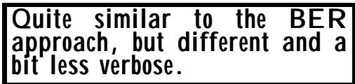

This clause describes the form used for length determinants in cases where a count is needed which is potentially unbounded. This is generally the case only when there are no PER-visible constraints on the length of strings, iteration counts of SEQUENCE OF and SET OF, or on the size of integers. 这一条款规定了在需要计算可能无限长的数值时，所使用的长度表示形式。通常，这种情况只发生在没有对字符串长度、SEQUENCE OF 和 SET OF 的迭代次数，以及整数大小施加任何可见性限制的情况下才会发生。

Where there are such constraints, PER will have a much more optimised length field (described later), or no length field at all. 在存在此类限制的情况下，PER 将会有一个经过优化过的长度字段（稍后会详细说明），或者根本就没有长度字段。

The first important difference from BER is in what PER counts. (BER always counts the number of octets in the contents). PER counts the number of bits in a BIT STRING value, abstract characters in a known-multiplier character string values, the iteration count in a SEQUENCE OF or SET OF, and octets in all other cases. We talk about the count in the length determinant. 与 BER 相比，第一个重要的区别在于 PER 的计算方式不同。（BER 总是计算内容中的八位组数量）。而 PER 则计算 BIT 字符串中的位数、已知乘数字符字符串中的抽象字符、SEQ 或 SET 中的迭代次数，以及其他情况下所有八位组的数量。我们所说的“计数”指的是在长度指标上的计数结果。

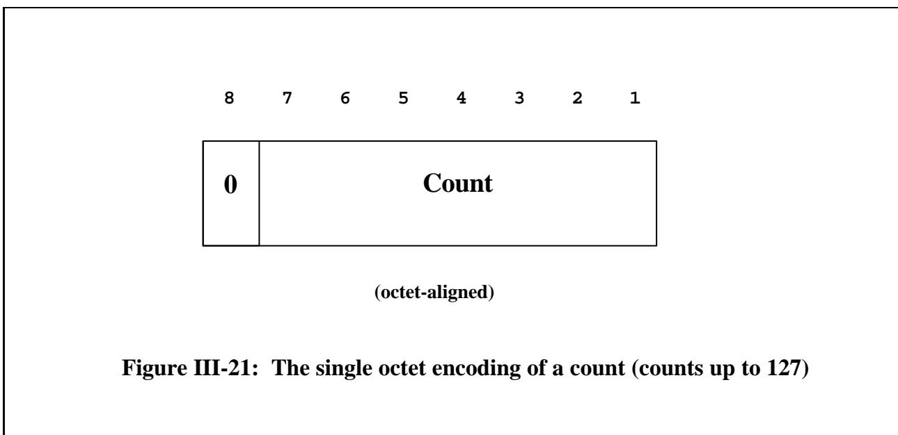

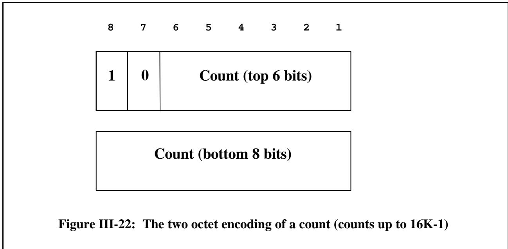

Figure III-21 to III-23 illustrate the three forms of encoding for the length determinant. 图 III-21 至 III-23 展示了长度决定因素三种编码方式的情况。

In the first form (corresponding to the BER short form, although PER does not use this term), we have the same encoding as BER, with the encoding placed in an octet-aligned-bit-field (in other words, there will be padding bits in the ALIGNED variants). The top bit of the octet is set to zero, and the remainder of the octet encodes count values from zero to 127. 在第一种形式中（对应 BER 简式格式，尽管 PER 并不使用这一术语），我们的编码方式与 BER 相同。编码信息被放在一个八位元字段中（也就是说，在 ALIGNED 版本中会有填充位）。八位元的最高位被设置为 0，其余位则用于编码 0 到 127 之间的数值。

In the second form (corresponding roughly to the BER long definite form), there are always exactly two octets of length determinant. The first octet has the first bit set to 1 and the second bit set to zero, and the remaining 14 bits of those two octets encode count values from 128 to 16K-1. 在第二种形式中（大致相当于 BER 长定义形式），总是恰好有两个八位组。第一个八位组的第一位被设置为 1，第二位为 0；这两个八位组中的其余 14 位则用于编码从 128 到 16K-1 的计数值。

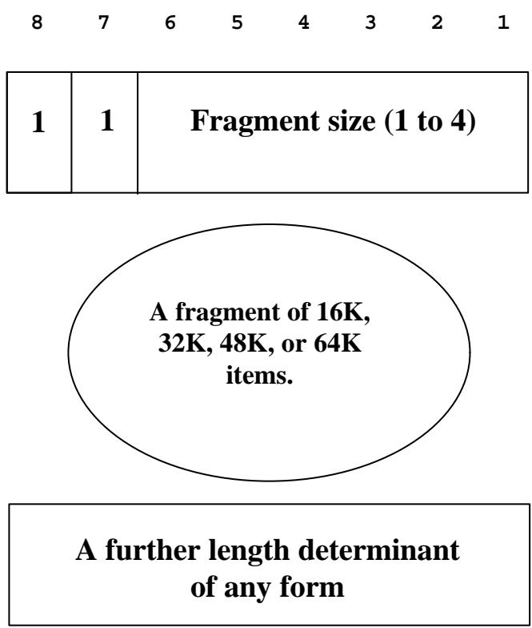

Figure III-23: The encoding for large counts 图 III-23：大数量数据的编码方式

The third form (corresponding roughly to the BER indefinite form, but with a very different mechanism) has an initial octet with both the top two bits set to 1. The remaining six bits encode (right justified) the values 1 to 4 - call this value "m". This octet says two things: 第三种形式（大致相当于 BER 的不确定形式，但机制有所不同）的第一个八位组中，前两个位被设置为 1。剩余的六个位则用来以右对齐的方式存储 1 到 4 的数值——将这個数值称为“m”。这个八位组包含了两方面的信息：

• It says that "m" times 16K bits, iterations, abstract characters, or octets of the contents follow. • 文中提到：“m”乘以 16K 比特、迭代次数、抽象字符或八位元的内容数量如下。

• It says that after this fragment of the contents, there will be a further length field (of either of the three forms) for the rest of the contents, or for another fragment. • 根据说明，在这一段内容之后，还会有一个长度字段，该字段可以采用三种格式中的任何一种来表示后续内容的长度，或者用于指代另一个片段的内容。

PER requires that each fragment should be as large as possible, so there are no encoder's options in the choice of "m". Notice that in principle the largest permitted "m" could have been made much greater (there are six bits available to encode it), but the designers of PER chose to enforce fragmentation into fragments of at most 64K (4 times 16K) items for long octet strings etc. PER 要求每个片段尽可能大，因此在选择“m”时没有编码器的选项。不过，原则上最大的“m”值可以更大（有六个比特位可以用来编码），但 PER 的设计者选择将片段大小限制在最多 64K（即 4 个 16K）项以内，适用于较长的八位元字符串等场景。

Figure III-24 illustrates the encoding (in binary) for count values (for example for a SEQUENCE OF) of 5, 130, 16000, 32768, and 99000. The insertion of one or more padding bits is shown with a "P", the length determinant is prefixed with "L:", and fragments of content with "C:" (a convention used throughout this chapter). 图 III-24 展示了各计数值的二进制编码形式，这些计数值包括 5、130、16000、32768 和 99000。其中一个或多个填充位的插入用“P”表示；而内容片段则用“C”来表示（这一符号格式在整篇文档中都是统一使用的）。

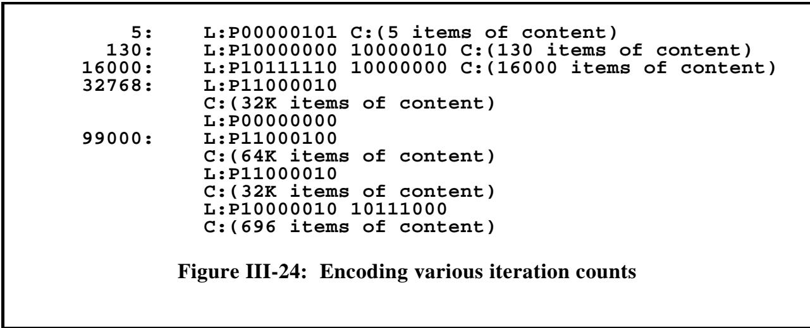

Note that where we get fragmentation in Figure III-24, although the fragments will be encoding multiples of 16K values of the same type, the encodings for each value are not necessarily the same length if the type being iterated has extensions, so padding bits may again be required before the length determinant after a fragment, as all these length determinants are specified as octetaligned. 请注意，在图 III-24 中出现的碎片化现象意味着，虽然各个片段会编码相同类型的 16K 数值的多个副本，但如果所迭代的类型具有扩展部分，那么每个数值的编码长度并不一定是固定的。因此，在分割后的片段中，可能需要再次使用填充位来确定长度，因为所有长度参数都被指定为采用八位对齐格式。

## 8.2 Encoding "normally small" values 8.2 对“通常较小的”数值进行编码处理

PER has one further encoding for counts that are potentially unbounded. This encoding is used in cases where, although there is no upper-bound on the values which may need to be encoded, the values are expected to be "normally small" (and are all zero or positive), so this is described as "encoding a normally small non-negative whole number". PER 还有一种用于处理可能无限大的数值的编码方式。这种编码方式适用于那些虽然不存在数值的上限限制，但预计这些数值会“通常很小”的情况（也就是说，这些数值要么全部为零，要么全部为正）。因此，这种编码方式可以被描述为“对通常很小的非负整数进行编码”。


This case is applied to encode a choice index for a choice alternative that is not in the root - there could be millions of additional choices in Version 2, and a Version 1 system has no idea how many, but actually, there are unlikely to be more than a few. 这个案例用于对那些不在根节点中的选择选项进行编码。在版本 2 中，可能会存在数百万个额外的选择选项，而版本 1 的系统根本无法知道到底有多少种选择选项。但实际上，这样的选择选项数量应该不会超过几个而已。

A second application is to encode values of an enumerated type that are outside the root, where again the possible values are unbounded but are usually going to be small. 第二个应用场景是对那些位于根类型之外枚举类型的值进行编码。在这种情况下，可能的取值是没有上限的，但通常这些取值都会比较小。

In both these cases, encoding the value as an unbounded integer value (which would require an octet-aligned length field - usually set to 1 - as above and an integer encoding of one octet) is not optimal. The specified encoding in this case is instead to use just seven bits (not octet-aligned), with the top bit set to zero and the other six encoding values up to 63. Thus we avoid the octet alignment, and use only seven bits, not sixteen. Why use seven bits and not eight? Remember that this encoding will frequently appear following an extensions bit, so the two together give us exactly eight bits and if we had alignment at the start, we still have it. 在这两种情况下，将值编码为无界整数值都不是最优的选择。无界整数值的编码需要一个八位对齐的字段——通常该字段会被设置为 1——而仅用一个八位整数进行编码则更为简单。在这种情况下，我们采用仅使用七位进行编码，其中最高位设为 0，其余六位可以表示 0 到 63 之间的数值。这样我们就避免了八位对齐的问题，只使用了七位而不是十六位。为什么使用七位而不是八位呢？记住，这种编码方式通常出现在扩展位之后，因此两者加起来正好等于八位。而且，如果一开始就有对齐方式的话，我们仍然可以保持这种对齐状态。

Of course, there is a penalty in optimising for small values! If the normally small non-negative whole number actually turns out to be more than 63, then we add a one-bit bit-field set to one, followed by a positive integer encoding into minimum octets preceded by a general length field as described above. 当然，在针对较小值进行优化时也会存在惩罚机制！如果原本为非负整数的小数值实际上超过了 63，那么我们会添加一个 1 位长的位字段，并将其值设置为 1；然后会使用一个正整数进行编码，该编码结果会被存储到最小 8 位字长的数据中，同时还会包含一个通用长度字段，就像上面所描述的那样。

Figure III-25 illustrates the encoding of a count as a normally small non-negative whole number for values of 5, 60, 254, and 99000. (There is no way the latter will occur in any real specification, and a tool that failed to provide code for this case - simply saying "not supported" - would be very unlikely to be caught out! The specification is, however, complete, and will encode any value no matter how large.) Note the absence of padding bits in the first two cases. 图 III-25 展示了如何将计数编码为一个通常较小的非负整数。对于 5、60、254 和 99000 这些数值，都会采用这种编码方式。（实际上，99000 这样的数值在真实的应用中是不可能出现的，因此如果一个工具无法为这种情况提供编码支持，只是简单地表示“不支持”，那么这种情况很可能会被忽略。不过，该规范是完整的，无论数值有多大，都能得到正确的编码。）注意，在前两种情况下，没有使用填充位。

```txt
5 L:0000101 C:(5 items of content)
60 L:0111100 C:(60 items of content)
254 L:1 P00000001 11111110 C:(254 items of content)
99000: L:1 P11000100
C:(64K items of content)
L:P11000010
C:(32K items of content)
L:P10000010 10111000
C:(696 items of content)

Figure III-25: Encoding normally-small non-negative whole numbers 
```

## 8.3 Comments on encodings of unbounded counts 8.3 关于无限计数编码的评论

The fragmentation mechanism in PER is not reliant on nested TLV structures, and can be applied to any contents encoding, and in particular to encodings of unbounded integers. Because the number of 64K fragments is unlimited, PER can truly encode indefinitely large integers, but we have already seen that the actual limit BER imposes is for all practical purposes irrelevant. The fragmentation mechanism of PER, particularly the lack of encoder's options, is, irrelevant. The fragmentation mechanism of PER, particularly however, probably simpler than that of BER. however, probably simpler than that of BER. PER 中的碎片化机制并不依赖于嵌套的 TLV 结构，因此可以应用于任何内容编码，尤其是无界整数的编码。由于 64K 片段的数量是无限的，PER 能够真正编码无限大的整数。不过，我们已经看到，实际上 BER 所设定的限制在实际使用中并不重要。PER 的碎片化机制，尤其是缺乏编码器的选项这一特点，实际上并不重要。而且，PER 的碎片化机制可能比 BER 的更为简单。

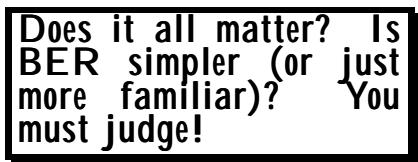

The main advantage of the PER encoding over BER is that length fields will generally be two octets, and counts of less than 128 are required to be done using the short form. With BER, length fields of three octets (long definite form) are permitted (and some implementations use them always), even for a contents length of - say - five octets. This is a big verbosity overhead for such implementations. PER 编码相比 BER 编码的主要优势在于：长度字段通常只有两个八位元；而使用短形式时，需要记录的数量不得超过 128 个。而在 BER 编码中，即使内容长度为五个八位元，也允许使用三个八位元的长度字段（某些实现方式总是采用这种形式）。但对于这类实现方式来说，这种额外的信息量确实会带来很大的负担。

The main advantage of the encoding of normally small non-negative whole numbers is that they (usually) encode into a bit-field without padding bits. If the value gets too big (unlikely to occur in practice), there is still only an additional penalty of one bit over a general length encoding. 通常较小的非负整数的编码方式的主要优势在于：它们可以直接用一位字段来表示数值，而无需进行填充操作。如果数值变得过大（但在实际使用中这种情况很少发生），那么与常规长度编码相比，只会增加一个比特的额外开销而已。

## 9 Encoding the OPTIONAL bit-map and the CHOICE index. 9. 对可选的位图和选择索引进行编码。

## 9.1 The OPTIONAL bit-map 9.1 可选位图

We already know that when encoding a sequence or set value, PER encodes a preamble into a bit-field, with one bit for each OPTIONAL or DEFAULT element (zero bits if there are no OPTIONAL or DEFAULT elements). The bit is set to one if a value of the element is present in the encoding, set to zero otherwise. The encoding of each element then follows. 我们已经知道，在对序列或集合值进行编码时，PER 会将前置码编码到位字段中，每个可选的或默认的元素对应一个位位。如果某个元素在编码中出现，则该位会被设置为 1；否则，该位会被设置为 0。之后，就会对每个元素进行编码处理。

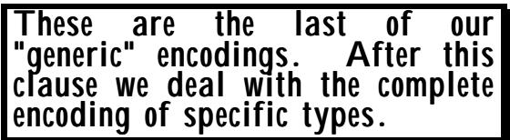

This applies to elements in the root. A similar bit-map is used at the insertion point for elements which are extension additions, but this is described later. 这适用于根节点中的元素。在插入点处，对于通过扩展方式添加的元素，也会使用类似的位图表示方式，不过这一点将在后面详细说明。

Under normal circumstances, there is no length determinant for this bit-map (as both sender and receiver know its length from the type definition), but if (and it will never occur, so a "not supported" response from a tool would be OK!) the length of the bit-map (the number of optional or default elements) exceeds 64K, then a length determinant is included and the bit-map fragments into 64K fragments. 在正常情况下，这个位图并没有明确的长度限制（因为发送方和接收方都可以通过类型定义来知道其长度）。但是，如果位图的长度超过 64K（这种情况几乎不会发生，所以工具可以返回“不支持”的响应即可！），那么就会有一个长度限制机制，位图会被分割成 64K 的片段。

## 9.2 The CHOICE index 9.2 选择指数

For a CHOICE value, there is again a preamble. If the type is not extensible, or the value is in the root, we have an upper bound on this choice index (and a lower bound of zero - the choice index starts at zero with the alternative that has the lowest tag value, as described earlier). This value is encoded as a constrained integer value - one that has both an upper and a lower bound. We will see below that integer values that are constrained to a range of, say, 0 to 15 (up to 16 alternatives in the CHOICE type) encode into a bit-field of four bits. 对于 CHOICE 类型，同样存在一个上限限制。如果该类型不可扩展，或者该值位于根级别，那么这种选择索引就有一个上限；而下限则是零——因为选择索引从具有最低标签值的选项开始，这一点之前已经描述过。这个值被编码为一个有上下限的受限整数值。如下所示，那些被限制在 0 到 15 这个范围内的整数值（在 CHOICE 类型中最多可容纳 16 个选项）会被编码为四个比特位的字段。

If the chosen alternative is outside of the root, then we get our "extensions bit" set to one in a bitfield (as described earlier), followed by (usually) seven bits in a bit-field encoding the normally small non-negative whole number which is the index of the alternative within the extension additions (taking the first addition alternative as value zero). Note that whilst version brackets are allowed in a CHOICE, their presence makes no difference to the encoding, it is only for SEQUENCE and SET that the encoding is affected. 如果所选的替代方案位于根之外，那么我们的“扩展位”就会被设置为 1（如前面所述）。之后，通常还会有一个由 7 位组成的位字段，用来表示那个较小的非负整数值，这个数值就是该替代方案在扩展中的索引值（将第一个替代方案视为值零）。需要注意的是，虽然 CHOICE 类型允许使用版本标记，但这一特性对编码并无影响；只有 SEQUENCE 和 SET 类型时，编码才会受到影响。

Notice that if we started on an octet boundary, we have added exactly eight bits and will remain on an octet boundary, and we have not forced any octet alignment in these encodings. Illustrations of these encodings are given in Clause 16 describing the complete encoding of choice values. 请注意，如果我们从八位组的边界开始，那么我们就增加了整整八位，并且仍然会保持八位组的边界不变。在这些编码中，我们没有强制任何八位组之间的对齐。这些编码的示例可以在第 16 条中找到，该条款描述了选择值的完整编码方式。

## 10 Encoding NULL and BOOLEAN values. 10. 对 NULL 值和 BOOLEAN 值进行编码处理。

These are easy. No PER-visible constraints can apply, and optionality is sorted by the bit-map. 这些都很简单。没有任何 PER 可见性的限制条件适用，而且选项性也是通过位图来处理的。

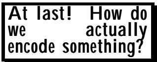

Zero bits for NULL. That's all you need. One bit for BOOLEAN - set to 1 for TRUE and set to zero for FALSE. And of course there are no padding bits in the ALIGNED version. 对于 NULL 字段，只需要 0 位。对于 BOOLEAN 类型的数据，只需要 1 位——当值为 TRUE 时设置这 1 位为 1，当值为 FALSE 时则设置这 1 位为 0。当然，在 ALIGNED 版本中并没有使用任何填充位。

## 11 Encoding INTEGER values. 11. 对整数值进行编码。

Remember - when we talk about constraints below, we are only concerned with PER-visible constraints as discussed earlier. 请记住——当我们讨论以下约束条件时，我们仅关注前面提到的那些对 PER 可见的约束。

The only interesting parts of this discussion are to do with encoding constrained integers, when "minimum bits" tend to be used. For unconstrained integers, we get the standard length determinant and an encoding in the mum octets. There are, however, differences between the ALIGNED and UNALIGNED variants (apart from adding or not adding padding bits). 这次讨论中唯一有趣的内容是关于受限整数的编码问题，因为通常会涉及到“最小位数”的设定。对于无限制的整数，我们得到的是标准的长度表示方式，以及用 mum 八位字节进行编码的方法。不过，ALIGNED 和 UNALIGNED 这两种编码方式之间还是存在差异的（除了是否添加填充位这一点之外）。

## 11.1 Unconstrained integer types 11.1 无约束的整数类型

The most important thing with the encoding of INTEGER types is whether a lower bound on the value exists or not. If it doesn't, we encode into the minimum octets as a signed number, with a general length determinant (as described earlier) containing a count of the number of octets. So: 在整数类型编码中，最重要的是是否存在值的下限。如果不存在下限，我们就将其编码为带有符号的数字，其一般长度由某个确定因素决定（如前所述），该因素包含八位小数的数量。因此，编码方式如下：

If there is no lower bound, we get a 2's-complement encoding into minimum octets with a general length determinant (all variants). 如果没有下限限制，那么就可以采用 2 的补码编码方式，将数据编码成最小数量的八位二进制数，而这一编码方式具有通用的长度确定因素（所有变体都适用）。

```txt
integer1 INTEGER ::= 4096
integer2 INTEGER (MIN .. 65535) ::= 127
integer3 INTEGER (MIN .. 65535) ::= -128
integer4 INTEGER (MIN .. 65535) ::= 128 
```

are all described as "unconstrained" and encode as (with "L:" preceding the length determinant - if any - and "C:" preceding the contents encoding - if any): 所有这些都被描述为“无约束的”，并且其编码方式如下（其中“L：”位于长度决定器的前面——如果有的话；“C：”位于内容编码的前面——如果有的话）：

```yaml
integer1: L:P00000010 C:00010000 00000000
integer2: L:P00000001 C:01111111
integer3: L:P00000001 C:10000000
integer4: L:P00000010 C:00000000 10000000 
```

This is the same as BER (for values up to 127 octets), but without the identifier octets. Remember that in the UNALIGNED variant P bits are never inserted. 这与 BER 类似（适用于最多 127 个八位元的值），但缺少了标识符相关的八位元。请注意，在 UNALIGNED 变体中，从不插入 P 位。

## 11.2 Semi-constrained integer types 11.2 半约束整数类型

Once we have a lower bound (which will typically be zero or one, but could be anything) then we only need to encode a positive value, using the offset from the base as the value to be encoded. 一旦我们得到了一个下限值（通常为零或一，但实际上可以是任何数值），那么我们就只需要编码一个正数即可，将基准值作为需要编码的数值来进行处理。

Encode the (positive) offset from the lower bound. 对从下限开始的正数偏移量进行编码。

As for unconstrained integer types, the encoding is into the minimum necessary multiple of eight bits preceded by a length determinant counting the number of octets. So: 对于无约束的整数类型，其编码方式是将数据编码为至少 8 位的最小倍数，并且会在编码前加上一个表示字节数的长度指示符。因此，编码后的数据总位数由该长度指示符决定。

```txt
integer5 INTEGER (-1.. MAX) ::= 4096
integer6 INTEGER (1 .. MAX) ::= 127
integer7 INTEGER (0 .. MAX) ::= 128 
```

encode as: 编码为：

```yaml
Integer5: L:P00000010 C:00010000 00000001
Integer6: L:P00000001 C:01111110
Integer7: L:P00000001 C:10000000 
```

(Compare the encoding of integer7 with that of integer4.) （将 integer7 的编码与 integer4 的编码进行比较。）

## 11.3 Constrained integer types 11.3 受限整数类型

It is in the encoding of integers with both a lower and an upper bound that PER tries hardest to "do the sensible thing". However, "the sensible thing" as determined by the proponents of the UNALIGNED variant turned out to be different from "the sensible thing" as determined by the proponents of the ALIGNED version, so the approaches are not quite the same. Which is the most sensible, you must judge! 在整数的编码过程中，PER 试图做到“最合理的选择”。不过，由“UNALIGNED”方案的支持者所定义的“最合理的方式”，与由“ALIGNED”方案的支持者所定义的“最合理的方式”并不相同。因此，这两种方法并不完全相同。到底哪种方式更合理呢？这必须由用户自己来判断了！

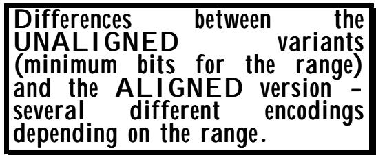

The standard talks about the "range" of the values, defining the "range" as the upper-bound minus the lower-bound plus 1. So a constraint of (0..3) has a "range" of four. Thus "range" is essentially defined as the total number of values between (and including) the upper and lower bounds. 标准中提到了“范围”的概念，将“范围”定义为上限减去下限再加上 1。因此，约束条件(0..3)对应的“范围”为 4。所以，“范围”本质上就是介于上下限之间的值的总数，包括上下限本身。

If the "range" is one, then only one value is possible. This is not likely to occur in practice, but the encoding follows naturally from the treatment of larger ranges and is similar to the handling of NULL: there are no bits in the encoding! 如果“范围”只有一个值，那么只有一种可能性。这种情况在实践中不太可能出现，但编码方式实际上是从处理更大的范围时自然得出的，这与处理 NULL 值的方式类似：在编码过程中并没有使用任何比特位！

We first describe all the cases that can arise, then we give examples. 我们首先描述了所有可能出现的情形，然后给出了具体的例子。

For larger ranges, the UNALIGNED case is the easiest to describe. It encodes the offset from the lower bound into the minimum number of bits needed to support all values in the range. So a constraint of (1..3) - or (6..8) or (11..13) or (-2..0) - has a range of three, and values will encode into a bit-field of 2 bits (as would a range of 4). A constraint of (0..65535) will produce encodings of all values into exactly 16 bits, and so on. Remember that with the UNALIGNED variants, there are never any padding bits, so in this last case successive integers in the encoding of SEQUENCE OF INTEGER (0..65535) will all be 16 bits long, but may all be starting at bit 3 (say) of an octet. 对于更大的范围，UNALIGNED 这种编码方式最为简单。它将下限的偏移量编码为最少数量的位，从而能够支持该范围内的所有值。例如，对于(1..3) - 或 (6..8) - 或 (11..13) - 或 (-2..0) - 这样的约束条件，其范围就是 3 个值；而(0..65535)这样的约束条件则会将所有值编码为 16 位。记住，在 UNALIGNED 编码方式中，永远不会出现填充位，因此在这种情况下，SEQUENCE OF INTEGER (0..65535) 编码中的连续整数都将占用 16 位，但这些整数可能都从八位字的第 3 位开始。

## The ALIGNED case is a bit more varied! “ALIGNED”案例的情况要复杂一些！

If the range is less than or equal to 255 (note: 255, not 256), then the encoding is into a bit-field which is the minimum necessary to encode the range, and there will be no padding bits. If, however, the range is 256 - for example, the constraint might be (0..255) or (1..256) - then the value encodes into eight bits, but they go into an octet-aligned field - we get padding bits if necessary. 如果范围小于或等于 255（注意：是 255，不是 256），那么编码会使用最少的位数来表示这个范围，此时不需要填充位。然而，如果范围大于 256，例如约束条件可能是(0..255)或(1..256)，那么这个值就需要用 8 位来表示，但这些位会被安排到一个八位字段中；如果需要，还会添加填充位。

If the range is greater than 256 but no greater than 64K, we get two octets (octet-aligned). 如果该范围大于 256 但不超过 64K，那么我们得到的是两个八位元数据（即按八位元对齐的方式存储）。

If we need to go over two octets (the range is more than 64K), we encode each value (as a positive integer offset from the lower bound) into the minimum number of octets necessary (except that zero always encodes into an octet of all zeros, not into zero bits, so we always have a minimum of one octet), and prefix a length determinant giving the number of octets used. In this case, however, the general length determinant described earlier is not used! Instead, we look at the range of values that this octet count can take (lower bound one, remember, because zero encodes into one octet), and encode the value of the length in the minimum number of bits needed to encode a positive number with that range, offset from one. 如果我们需要表示的数值超过两个八位元的范围（实际范围超过 64K），我们会将每个数值编码为最少数量的八位元（作为比下限高的一个正整数偏移量）。不过，零总是被编码为一个全零的八位元，因此至少会占用一个八位元。此外，还会添加一个长度指示符来表明所使用的八位元数量。不过，在这种情况下来，我们并不使用之前描述的一般长度指示符。相反，我们会考虑这个八位元计数所能表示的值范围（记住，下限是 1，因为零会被编码为一个八位元）。然后，我们会用最少的比特数来表示这个长度值，从而确保能够表示出该范围内的所有正数。

Let's have some examples. What follows is not correct value notation - for compactness of the examples, we give a value, then a comma, then another value, etc, and use commas to separate the encodings in the same way. 让我们来看一些例子。下面这个写法并不正确——为了简洁起见，我们通常会先给出一个数值，然后加上逗号，再给出另一个数值，以此类推，并用逗号来分隔不同的编码方式。

```txt
integer8 INTEGER (3..6) ::= 3, 4, 5, 6
integer9 INTEGER (4000..4254) ::= 4002, 4006
integer10 INTEGER (4000..4255) ::= 4002, 4006
integer11 INTEGER (0..32000) ::= 0, 31000
integer12 INTEGER (1..65538) ::= 1, 257, 65538 
```

will encode as follows: 将会按照以下方式进行编码：

```txt
integer8 C:00, C:01, C:10, C:11
integer9 C:00000010, C:00000110
integer10 C:P00000010, C:P00000110
integer11 C:P00000000 00000000, C:P01111001 00011000
integer12 (UNALIGNED) C:0 00000000 00000000,
    C:0 00000001 00000000,
    C:1 00000000 00000001
(ALIGNED) L:00 C:P00000000,
    L:01 C:P00000001 00000000,
    L:10 C:P00000001 00000000 00000001 
```

You will see that where there is no length determinant, the field is the same size for all values of the type, and can be deduced from the type notation. (If this were not true, PER would be a bust specification!) Where the field size varies, a length determinant is encoded so that the decoder knows the size of the field, with the length of the length determinant the same for all values, and again derivable from the type definition. As stated earlier, these are necessary conditions for an encoder and decoder to be able to interwork. Study these examples! 你会看到，在不存在长度确定因素的情况下，该字段的大小对于类型中的所有值都是相同的，并且可以从类型表示法中推导出来。（如果情况并非如此，那么 PER 就不是一个有效的规范了！）当字段大小有所变化时，就会引入长度确定因素，这样解码器就能知道字段的大小。而长度确定因素的长度对于所有值都是相同的，同样也可以从类型定义中推导出来。正如之前所说，这些是编码器和解码器能够相互协作的必要条件。请仔细研究这些例子吧！

There is one further (and final) case for encoding the ALIGNED variant of a constrained integer: If the number of octets needed to encode the range of the integer value exceeds 64K ..... Need I go on? This will never ever arise in practice! But if it did, then a general length encoding is used, and the fragmentation procedures discussed earlier come into place. 还有另一种情况需要编码受限整数的对齐版本：如果编码该整数值所需的八位元数量超过 64K……我还需要继续列举下去吗？但实际上这种情况绝不会出现！但如果真出现了，那么就需要使用通用的长度编码方式，然后采用之前讨论过的碎片化处理方案。

## 11.4 And if the constraint on the integer is extensible? 11.4 那么，如果对整数的限制是可以扩展的呢？

There is nothing new or unexpected here. The principles of encoding extensible types have been discussed already. 这里没有任何新内容或意外之处。关于编码可扩展类型的原理，已经有过讨论过了。

But let's have some examples: 不过，让我们来看一些例子吧：

It's just the usual one bit up-front, a constrained encoding if in the root, and an unconstrained encoding otherwise. 这只是通常情况下的预付费用而已：在根节点时采用有限制的编码方式，而在其他情况下则采用无限制的编码方式。

```txt
integer13 INTEGER (MIN .. 65535, ..., 65536 .. 4294967296) ::= 127, 65536
integer14 INTEGER (-1..MAX, ..., -20..0) ::= 4096, -8
integer15 INTEGER (3..6, ..., 7, 8) ::= 3, 4, 5, 6, 7, 8
integer16 INTEGER (1..65538, ..., 65539) ::= 1, 257, 65538, 65539 
```

will encode as (the "extensions bit" has "E:" placed before it for clarity): 将会被编码为（为了清晰起见，将“扩展位”前面的位置放置了“E：”）：

```txt
integer13: E:0 L:P00000001 C:0111111,
E:1 L:P00000011 C:00000001 00000000 00000000
integer14: E:0 L:P00000010 C:00010000 00000001,
E:1 L:P00000001 C:11111000
integer15: E:0 C:00, E:0 C:01, E:0 C:10, E:0 C:11,
E:1 L:P00000001 C:00000101,
E:1 L:P00000001 C:00001000
integer16: (UNALIGNED) E:0 0 00000000 00000000,
E:0 0 00000001 00000001,
E:0 1 00000000 00000001,
E:1 L:00000011 C:00000001 00000000 0000010
(ALIGNED) E:0 L:00 C:P0000000,
E:0 L:01 C:P0000001 0000000,
E:1 L:12 C:P2P2P2P2P2P2P2P2P2P2P2P2P2P2P2P2P2P2P2P2P2P2P2P2P2P2P2P2P2P2P2P2P2P2P2P2P2P2P2P2P2P2P2P2P2P2P2 
```

OK - Now you know it all! It is not difficult, but there are a lot of cases to remember. Come back BER! All the other types are much more straightforward! No doubt you will want to write notes on this lot, and hope that your examination is an Open Book examination! But by now (if you got this far!) you should certainly have a very good understanding of the principles involved in the PER encodings. 好了——现在你们已经了解了一切！这并不难，不过有很多情况需要记住。回头再讨论吧！其他类型的问题则简单得多！毫无疑问，你们会想要记录下这些内容的要点，并希望考试能采用开卷方式！不过到现在为止（如果你已经读到了这里），你应该已经对 PER 编码所涉及的原则有了很好的理解了。

## 12 Encoding ENUMERATED values. 12. 对枚举值进行编码处理。

First we consider the encoding of an enumerated type that is not marked extensible (and remember, the encoding of an extensible type for a value that is in the root is just the same except that it is preceded by an extensions bit set to zero). Encoding of enumerations outside of the root are covered later. 首先，我们考虑那些未被标记为可扩展的枚举类型的编码问题。记住，对于根节点中的可扩展类型来说，其编码方式与普通类型相同，只不过在编码之前会有一个被设置为零的“可扩展”标志。关于根节点之外类型的编码问题，我们将在后面讨论。

The numerical value associated with an enumeration is always bounded above and below. Moreover, it is possible to order the enumerations into ascending order (even if some have negative associated values), and then to re-number each enumeration from zero upwards. 与某个枚举值相关的数值总是存在上下限的约束。此外，还可以按照升序对这些枚举值进行排序（即使某些枚举值的数值为负），然后重新为每个枚举值分配一个从零开始的新编号。

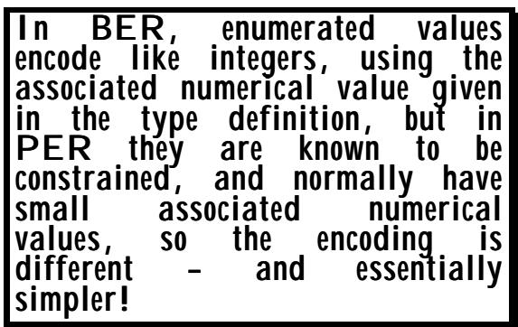

This gives us a compact set of integer values (called the enumeration index) with a lower and an upper bound. Any value of the enumerated type now encodes like the corresponding constrained integer. 这为我们提供了一组有限的整数值（称为枚举索引），该索引有下限和上限。现在，任何枚举类型的值都像对应的受限整数一样被编码了。

In principle, all possible constrained integer encodings are possible, but in practice, definitions of enumerated types never have more than a few tens of enumerations - usually much less, so we are essentially encoding the enumeration index into a bit-field of size equal to the minimum necessary to cope with the range of the index. 原则上，所有可能的受限整数编码都是可能的。但实际上，枚举类型的定义通常只有几十种枚举值而已——通常数量要少得多。因此，我们实际上是将枚举索引编码到一个固定大小的位字段中，这个字段的大小至少要能够满足枚举值的取值范围需求。

If the enumeration is extensible, then enumerations outside the root are again sorted by their associated numerical value, and are given their own enumeration index starting at zero again. (Remember, the extensions bit identifies whether an encoded value is a root one or not, so there is no ambiguity, and starting again at zero keeps the index values as small as possible). For a value outside the root, the encoding is the encoding of the enumeration index as a "normally small nonnegative whole number" described earlier. 如果枚举是可扩展的，那么根之外的元素将按照其对应的数值进行排序，并且会赋予它们各自的枚举索引，该索引从零开始。记住，扩展位用于标识一个编码值是否为根值，因此不会存在歧义；从零开始设置索引值可以确保索引值尽可能小。对于根之外的元素，编码方式就是之前描述的那种将枚举索引编码为“通常较小的非负整数”的方式。

No doubt you want some examples! Here goes (with a way-out example first!) - and again we use commas to separate lists of values and of encodings, for brevity: 毫无疑问，您想要一些例子吧！那么，让我们开始吧（先举一个例子！）——同样，为了简洁起见，我们使用逗号来分隔各种值和编码方式列表：

```txt
enum1 ENUMERATED {red(-6), blue(20), green(-8)}
    ::= red, blue, green
enum2 ENUMERATED {red, blue, green, ..., yellow, purple}
    ::= red, yellow, purple

These encode as:

enum1: C:01, C:10, C:00
enum2: E:0 C:00,
E:1 C:0000000, (These are the "normally small"
E:1 C:0000001 encodings of zero and one.
Note the absence of a "P")

If we had more than 63 extension additions .... No! I am not going to give an example for that. It won't happen! Produce your own example! (You have been told enough to be able do it). 
```

## 13 Encoding length determinants of strings etc 13. 字符串编码长度的确定因素等

The "etc" in the heading of this clause refers to iteration counts in SEQUENCE OF and SET OF. 本条款标题中的“等”指的是在“序列”和“集合”中的迭代次数。

Remember that for iteration counts, the length determinant encodes the number of iterations, for the length of bitstrings it encodes the number of bits, for the length of knownmultiplier character strings it encodes the number of abstract characters, and for everything else it encodes the number of octets. 记住，对于迭代次数的编码，长度确定器会表示迭代的次数；对于位字符串的长度，该确定器则表示位的数量；对于已知乘数字符字符串的长度，该确定器则表示抽象字符的数量；而对于其他所有情况，该确定器则表示八位元的数量。

<table><tbody><tr><td data-imt-p="1">A length determinant which is constrained by an effective size constraint encodes in exactly the same way that an integer with an equivalent constraint would encode (well, almost - read the details below if you wish!). 一种受有效尺寸限制的长度确定器，其编码方式与受类似限制的整数相同（不过，如果你愿意，可以仔细阅读下面的详细说明哦！）。</td></tr></tbody></table>

A length determinant can, however, have values which are constrained by an effective size constraint, and in many ways we can view this as similar to the situation when an integer value (a count) is constrained by a direct constraint on the integer. 然而，长度参数的值可能受到有效大小限制的影响。从许多角度来看，这种情况类似于整数值（即计数）受到整数本身直接限制的情况。

Note that we are here talking only about lengths of strings or iteration counts - the form of the length determinant for integer values has been fully dealt with (and illustrated) earlier. We have also discussed earlier the general case of a length determinant where there are no PER-visible size constraints. So in this clause we are talking only about the case where there is an effective size constraint, and as in earlier clauses, we consider first the case of a constraint without an extension marker (which also applies to encoding counts within the root if there is an extension marker). 请注意，我们在这里讨论的只是字符串的长度或迭代次数而已。对于整数值的长度判定形式，我们已经在之前进行了全面讨论和说明。此外，我们之前也探讨了在没有 PER 可见大小限制的情况下使用长度判定的一般情况。因此，在本段内容中，我们仅讨论存在有效大小限制的情况。就像之前一样，我们首先考虑的是没有扩展标记的情况（如果存在扩展标记，这种情况也适用于根节点内的编码次数）。

The discussion of length encodings for strings etc has been deliberately delayed until after the description of integer encodings was given, and the reader may like to review that description before reading on. 关于字符串等内容的长度编码的讨论，我们特意推迟到先介绍整数编码的相关内容之后再进行讨论。读者在阅读后续内容之前，或许可以先回顾一下关于整数编码的描述部分。

A length or iteration count is basically an integer value, except that it is always bounded below (by zero if no other lower bound is specified), so if we need to encode the lengths of strings, we can draw on the concepts (and the text!) used to describe the encoding of values of the integer type. For a semi-constrained count (no upper bound), it would be pointless to encode a semi-constrained integer value (with its "length of length" encoding), and instead a general length determinant as described in Clause 8 is encoded. 长度或迭代次数本质上是一个整数值，只不过这个值的下限总是有规定的（如果没有指定其他下限的话，那么下限就是 0）。因此，当我们需要编码字符串的长度时，就可以借鉴那些用于描述整数类型值编码的概念和文本。对于具有半限制性限制的情况（即没有上限），那么对具有“长度”特性的半限制性整数值进行编码是没有意义的，相反，应该像第 8 条所描述的那样，使用通用的长度表示方式来编码。

For a constrained count, where the count is restricted to a single value (a fixed length string, for example, or a fixed number of iterations in a sequence-of), then there is no length determinant - we simply encode the contents. Otherwise, we need a length determinant. 当计数受到限制时，即计数被限定在单一数值上（例如，一个固定长度的字符串，或者在一个序列中固定次数的迭代），那么就没有必要设定长度了——我们只需编码内容本身即可。否则，我们就需要一个用于确定长度的因素。

For a constrained count, the count is encoded (in both the ALIGNED and UNALIGNED versions) exactly like the encoding of a corresponding constrained integer, except where the maximum allowed count exceeds 64K. In this latter case the constraint is ignored for purposes of encoding, and a general length determinant is used, with fragmentation into 64K hunks (as described in Clause 8) if the actual value has more than 64K bits, octets, iterations, or abstract characters. 在有限制的计数情况下，计数信息会被编码处理（包括 ALIGNED 和 UNALIGNED 两种版本），其编码方式与相应的有限制整数类型的编码方式完全相同。不过，当允许的最大计数超过 64K 时，这种限制会被忽略，此时会采用通用的长度确定方法来进行编码。如果实际值的位数超过 64K 比特、八位元、迭代次数或抽象字符数，那么就会将数值分割成 64K 的片段进行编码，具体方法请参考第 8 条说明。

Finally, we need to consider an extensible constraint. If the effective size constraint makes the type extensible, then the general provisions for encoding extensible types discussed earlier apply to the type as a whole - we don't encode an extensible integer for the length determinant. So we get the extensions bit up-front saying whether the count (and any other aspect of the value, such as the alphabet used) is in the root, and if so we encode the count according to the size constraint on the root. If not, then the extensions bit is set to one and a general length determinant is used. 最后，我们需要考虑一种可扩展的约束条件。如果有效大小约束使得类型具有可扩展性，那么之前讨论过的关于编码可扩展类型的一般规定也适用于整个类型——我们不会为长度决定因素编码一个可扩展的整数。因此，我们会提前设置一个扩展位，用来表明数值的计数方式（以及该数值的其他特性，如使用的字母表）是否属于可扩展类型。如果是这种情况，我们就根据根类型的尺寸约束来编码计数信息。如果不是这种情况，那么就会设置扩展位为 1，并使用一般的长度决定因素来表示数值。

So to summarise: 总结一下：

• With no PER-visible size constraint, or a constraint that allows counts in excess of 64K, we encode a general length determinant. • 由于没有 PER 可见性的尺寸限制，也没有允许计数超过 64K 的约束条件，因此我们引入了一个通用长度决定因素来进行编码。

• For abstract values outside the root, a general length determinant is again used. • 对于根之外的抽象值，仍然使用了一个通用的长度确定因素。

With a size constraint that gives a fixed value for the count, there is no length determinant encoding. 由于尺寸限制，计数值是一个固定的数值，因此不存在用于编码长度的因素。

• Otherwise, we encode the count exactly like an integer with the equivalent constraint. • 否则，我们就会像处理整数一样来编码这个计数，同时遵循类似的约束条件。

We illustrate this with some IA5String examples, but remember that the same length determinant encodings also apply to iteration counts etc. In the examples you will see "P" for padding bits in the contents. These are a consequence of the main type being IA5String with more than two characters, and would not be present if we had used BIT STRING for the examples (or if we had an IA5String whose length was restricted to at most two characters - see later). Where padding bits are shown in the length determinant, these would be present for all types. We give the E: and L: fields in binary, but the C: fields in hexadecimal, for brevity. 我们通过一些 IA5String 示例来说明这一点。不过请注意，相同长度的确定编码也适用于迭代次数等数值。在示例中，你会看到内容中有“P”表示填充位。这是当主类型是一个包含超过两个字符的 IA5String 时的必然结果；如果我们使用 BIT STRING 来表示示例，或者如果 IA5String 的长度被限制为最多两个字符，那么就不会出现这种情况——稍后会有相关说明。在确定长度时，如果显示了填充位，那么所有类型都会包含这些位。我们以二进制形式表示 E:和 L:字段，而 C:字段则使用十六进制表示，以简化表达。

If the reader wants some exercise, then try writing down the encodings of each value before reading the answers that follow! (For very long strings, we indicate the contents with the count in characters in brackets, and do the same when giving the encoding). 如果读者想要练习一下，那么可以在阅读后续答案之前，先写下每个值的编码方式！对于非常长的字符串，我们会用字符数来表示长度，在给出编码时也会采用同样的表示方法。

With the following value definitions: 根据以下数值定义：

```txt
string1 IA5String (SIZE (6)) ::= "012345"
string2 IA5String (SIZE (5..20)) ::= "0123456"
string3 IA5String (SIZE (MIN..7)) ::= "abc"
string4 IA5String ::= "ABCDEFGH"
string5 IA5String (SIZE (0..7, ..., 8)) ::= "abc", "abcdefgh"
string6 IA5String (SIZE (65534..65535)) ::= "(65534 chars)"
string7 IA5String (SIZE (65537)) ::= "(65537 chars)" 
```

we get the following encodings (using hex or binary as appropriate): 我们得到以下编码方式（使用十六进制或二进制表示，根据具体情况选择）：

```yaml
string1: C:P303132333435
string2: L:0001 C:P30313233343536
string3: L:011 C:P616263
string4: L:P00001000 C:4142434445464748
string5: L:011 C:P616263,
    L:P00001000 C:6162636465666768
string6: L:0 C:(65534 octets)
string7: L:P11000100 C:(65536 octets) L:P00000001 C:(1 octet) 
```

## 14 Encoding character string values. 14. 编码字符串值。

## 14.1 Bits per character 14.1 每个字符的位数

We have discussed above the encoding of the lengths of strings. To recap, the length determinant gives the count of the number of abstract characters for the "known multiplier" character string types, and of octets for the other character string types. 我们在上文已经讨论了字符串长度的编码问题。总结一下，长度确定器能够计算出“已知乘数”类型的字符字符串所对应的抽象字符的数量，以及其他类型的字符字符串所对应的八位元数量。

In the case of the known multiplier character string types, the number of bits used in the encoding of the UNALIGNED variants of PER is the minimum needed to represent each character unambiguously. For the ALIGNED versions, the number of bits for each character is rounded up to a power of two (one, two, four, eight, sixteen, etc), to ensure that octet alignment is not lost between characters. 对于已知的乘法器字符字符串类型，PER 的未对齐版本在编码过程中所使用的位数，是能够唯一表示每个字符所需的最少位数。而对于对齐版本，每个字符所需的位数会被向上取整，成为 2 的幂次形式（1、2、4、8、16 等），这样可以确保在不同字符之间不会出现八位组对齐的问题。

<table><tbody><tr><td data-imt-p="1">Encoding of known multiplier character strings uses the minimum number of bits for each character, except that in the ALIGNED variants this number is rounded up to a power of two, to avoid losing alignment. 对于已知的乘法因子字符串，编码时会使用每个字符所需的最少位数。不过，在 ALIGNED 版本中，这个数值会被向上取整到 2 的幂次，以避免影响数据的对齐效果。</td></tr></tbody></table>

The known multiplier types, with the number of characters that the unconstrained type is defined to contain (and the number you need to exclude to improve the encoding in the UNALIGNED variants) are: 已知的乘数类型包括：无约束类型所定义的字符数量（以及为了改善 UNALIGNED 变体的编码而需要排除的字符数量）。

<table><tbody><tr><td data-imt-p="1">Type name 输入名称</td><td data-imt-p="1">Number of chars 字符数量</td><td data-imt-p="1">Number of reductions needed for better encoding 为了实现更好的编码效果，需要进行的压缩次数。</td></tr><tr><td data-imt-p="1" data-imt_insert_failed_reason="same_text">IA5String</td><td data-imt-p="1">128 characters 128 个字符</td><td>64</td></tr><tr><td data-imt-p="1">PrintableString 可打印的字符串</td><td data-imt-p="1">74 characters 74 个字符</td><td>10</td></tr><tr><td data-imt-p="1">VisibleString 可见字符串</td><td data-imt-p="1">95 characters 95 个字符</td><td>31</td></tr><tr><td data-imt-p="1">NumericString 数字字符串</td><td data-imt-p="1">11 characters 11 个角色</td><td>3</td></tr><tr><td data-imt-p="1">UniversalString 通用字符串</td><td data-imt-p="1">2**32 characters 2**32 个字符</td><td>2**31</td></tr><tr><td data-imt-p="1">BMPString BMP 字符串</td><td data-imt-p="1">2**16 characters 2**16 个字符</td><td>2**15</td></tr></tbody></table>

For all other character string types, the length determinant gives the count in octets, because the number of octets used to represent each character can vary for different characters. In this latter case, constraints are not PER-visible, and the encoding of each character is that specified by the base specification, is outside the scope of this chapter, and is the same as for BER. 对于其他所有字符串类型，长度确定器以八位元数来表示长度，因为表示每个字符所需的八位元数可能会因字符类型而异。在这种情况下，这些限制并非与可读性相关，每个字符的编码方式遵循基础规范的规定，这超出了本章的讨论范围，与 BER 编码方式相同。

All that remains is to discuss the encoding of each character in the known multiplier character string types, as the encoding of these characters is affected by the effective alphabet constraint (see Clause 6), and to see when octet-aligned fields are or are not used for character string encodings. Again we see differences between the ALIGNED and the UNALIGNED variants, but the encodings are what you would probably expect, or have invented yourself! 现在剩下的工作就是讨论已知的多重字符字符串类型中每个字符的编码方式。这些字符的编码方式会受到有效字母表限制的影响（详见第 6 条）。此外，还需要确定在字符字符串编码时是否使用了按八位对齐的字段。我们再次看到了“按八位对齐”与“不按八位对齐”这两种编码方式之间的区别。不过，这些编码方式其实都是人们预期中的结果，或者可以说是人们自己发明出来的结果吧！

Each of the known multiplier characters string types has a canonical order defined for the characters, based on the numerical value in the BER encoding (the ASCII value for IA5String, 所有已知的乘法字符字符串类型都有相应的规范顺序，这一顺序是基于 BER 编码中的数值信息来确定的（对于 IA5String 字符，其 ASCII 值即为该顺序）。

PrintableString, VisibleString, and NumericString, the UNICODE value for BMPString, and the ISO 10646 32-bit value for characters outside the Basic Multi-lingual Plane for UniversalString). These values are used to provide a canonical order of characters. The values used to encode each character are determined by assigning the value zero to the first abstract character permitted by the effective alphabet constraint, one to the second, etc. The last value used is n-1 if there are n abstract characters permitted for the type (using only PER-visible constraints in this determination). There are a minimum number of bits needed to encode the value n-1 as a positive integer, and in the UNALIGNED variants, this is exactly the number of bits used to encode each character. For example: 可打印字符串、可见字符串以及数字字符串。对于 BMP 字符串，使用 UNICODE 编码；而对于通用字符串中不属于基本多语言平面的字符，则使用 ISO 10646 标准的 32 位编码。这些编码方式用于规定字符的规范顺序。每个字符的编码值是通过将有效字母表约束所允许的第一个抽象字符的值设为 0，第二个抽象字符的值设为 1，依此类推来确定的。如果该类型允许使用 n 个抽象字符，那么最后一个使用的编码值就是 n-1。将 n-1 作为正整数进行编码所需的最小位数为固定不变的，而在 UNALIGNED 变体中，这正好就是每个字符的编码所需使用的位数。例如：

$$
\begin{array}{l l} \text {Type definition} & \text {No of bits per char} \\ \text {My - chars1}: := \text {IA5String (FROM ("T"))} & \text {Zero} \\ \text {My - chars2}: := \text {IA5String (FROM ("TF"))} & \text {One} \\ \text {My - chars2}: := \text {UniversalString (FROM ("01"))} & \text {One} \\ \text {My - chars2}: := \text {NumericString (FROM ("01234567")} & \text {Three} \end{array}
$$

Note that in the above, the actual base type being constrained could be any of the known-multiplier character string types, and the result would actually be just the same encoding! You effectively design your own character set, and PER then assigns an efficient encoding for each character. 请注意，在上述示例中，实际被限制的基础类型可以是任何已知的乘数字符串类型。而结果实际上都只是相同的编码方式而已！你实际上是在自己设计一种字符集，然后 PER 为每个字符分配一个高效的编码方式。

For the ALIGNED variants, the number of bits used is always rounded up to a power of two - zero, one, two, four, eight, sixteen, thirty-two, to ensure that octet alignment is not lost within the string. 对于对齐版本，所使用的位数总是向上取整到 2 的幂次——即 0、1、2、4、8、16、32 等，以确保字符串内的八位组能够保持对齐状态。

There is one small exception to this mapping of values to new values for encoding. The original set of characters have associated values with some "holes" in the middle (in general). If remapping the original values to a compact range from zero to n-1 does not produce a reduction in the number of bits per character in the PER encoding (for whichever variant is in use), then the remapping is not done, and the original associated value is used in the encoding. In practice, this means that remapping is more likely for UNALIGNED PER than for ALIGNED PER (where the number of bits per character is always a power of two), except in the case of NumericString, where the presence of "space" means that for both variants (even with no constraints), remapping takes place, reducing the encoding to a maximum of four bits per character. 在将值映射到新值进行编码的过程中，有一个小小的例外情况。原始字符集中存在一些“空位”，这些空位在中间位置。如果重新映射原始值到一个更紧凑的区间，即从零到 n-1，并不会导致 PER 编码中每个字符所需的位数减少，那么就不进行重新映射，而是继续使用原始对应的值进行编码。实际上，对于 UNALIGNED PER 来说，重新映射的可能性更大，因为对于 ALIGNED PER 来说，每个字符所需的位数总是 2 的幂次。不过，在 NumericString 的情况下，由于存在“空格”字符，无论是否受到任何限制，都会进行重新映射，从而将每个字符的编码位数限制在最多 4 位以内。

So with: 所以，使用以下方法：

 

$$
\text { My - Boolean }:: := \text { IA5STRING (FROM ("TF"))(SIZE(1))}
$$

The encoding would be a single bit in a bit-field (with no length encoding) - in other words, it would be identical to the encoding of a BOOLEAN! 这种编码方式相当于在一个位字段中存储单个比特位（无需进行长度编码），换句话说，它和 BOOLEAN 类型的数据的编码方式是完全相同的！

## 14.2 Padding bits 14.2 填充位

When do we get padding bits in the ALIGNED case? Here we need to look at the combination of the effective size constraint (which restricts the number of abstract characters in every value) and the effective alphabet constraint (which determines the number of bits used to encode each character). If the combination of these is 在 ALIGNED 情况下，我们什么时候能得到填充位呢？这里我们需要考虑有效大小限制（这决定了每个值中抽象字符的数量）和有效字母表限制（这决定了编码每个字符所使用的位数）。如果这两种限制的组合满足……

<table><tbody><tr><td data-imt-p="1">No padding if the size is constrained so that an encoded string value never exceeds 16 bits. 如果尺寸有限，那么就不会使用填充字符；这样编码后的字符串长度就不会超过 16 位。</td></tr></tbody></table>

such that the total encoding size for a value of this constrained type can never exceed sixteen bits, then there are no padding bits. The character string value is encoded into a bit-field. If, however, there are some values which might require more than 16 bits, then the encoding is into an octetaligned bit-field, and no character will cross an octet boundary (in the ALIGNED case). 这样，对于这种受限类型的值，总的编码大小永远不会超过十六位比特。因此，不需要使用填充位。字符字符串的值会被编码到一个位字段中。然而，如果有些值需要超过 16 位比特来编码，那么编码方式就会改为使用八位对齐的位字段，这样就不会有字符跨越八位边界了（在对齐的情况下）。

Some examples of character strings whose encodings do not produce padding bits: 以下是一些字符串示例，它们的编码方式不会产生填充位：

```autohotkey
String1 ::= NumericString (SIZE (0..4))
String2 ::= IA5String (FROM ("TF")) (SIZE (0..16))
String3 ::= IA5String (SIZE (0..2))
String4 ::= BMPString (SIZE (0..1)) 
```

Again, this rule of "16 bits" maximum is another example of PER being pragmatic. The limit could just as well have been set at 32, or 64 bits. The philosophy is that for short strings we do not want to force alignment, but that for long strings doing alignment at the start of the string (and then maintaining it) is on balance the best decision. 再次，这种“最多 16 位”的规定也是 PER 务实决策的一个例子。这个限制完全可以设定为 32 位或 64 位。我们的理念是，对于较短的字符串，我们不希望强制进行对齐；而对于较长的字符串，在字符串开头进行对齐，并且之后保持这种对齐方式，总体来看是更好的选择。

## 14.3 Extensible character string types 14.3 可扩展的字符字符串类型

The encoding of an extensible (by PER-visible constraints) known-multiplier character string type follows the normal pattern - an extensions bit set to zero if in the root, one otherwise, then the optimised encoding described above for root values, and an encoding of the unconstrained type (with a general length determinant) if we are not in the root. (Note, however, That mapping of associated values to produce a 4-bit encoding still occurs for an unconstrained NumericString). 这种可扩展的已知乘数字符字符串类型的编码遵循常规模式——如果处于根节点，则扩展位被设置为零；否则，采用上述针对根节点优化的编码方式。如果我们不在根节点上，则采用无约束类型的编码方式（具有通用的长度确定因素）。不过，需要注意的是，对于无约束的 NumericString 类型，仍然会进行相关值的映射，以生成 4 位的编码。

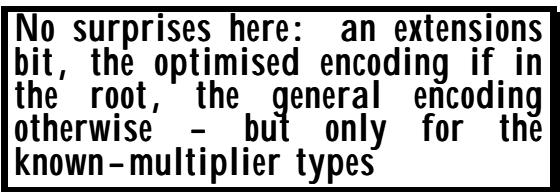

All the above applies only to the known-multiplier types. For the other character string types, there is never an extensions bit, the general encoding always applies for all values. 以上所述仅适用于已知乘数类型。对于其他字符串类型，根本不存在扩展位的概念，因为对于所有值来说，都适用同样的编码方式。

Finally, note that there is no concern in determining encodings of whether a known-multiplier type is extensible for alphabet or for size constraints. All that matters is whether or not PER-visible constraints make it extensible, and what the effective alphabet and effective size constraints for the root then are. The encoding is totally determined by that. 最后，需要指出的是，在确定已知乘数类型是否可扩展时，并不需要考虑字母表的大小限制。真正重要的是：PER 可见性约束是否使得该类型具有可扩展性，以及根节点的有效字母表大小限制是多少。编码方式完全取决于这些因素。

## 15 Encoding SEQUENCE and SET values. 15. 对序列和集合值进行编码。

For a SEQUENCE without an extension marker, earlier text (Clause 9) has described the encoding. There is up-front a preamble (encoded as a bit-field, not octet-aligned), with one bit for each element that is OPTIONAL or DEFAULT, set to one if there is an encoding present for a value of that element, to zero otherwise. Then there is simply the encoding for each element. 对于没有扩展标记的序列，之前的文本已经描述了编码方式。首先有一个前置部分（以位字段的形式编码，而不是按八位对齐），其中每个可选或默认的元素都有一个对应的位，如果该元素有编码存在，则该位设为 1；否则设为 0。之后就是每个元素的编码部分了。

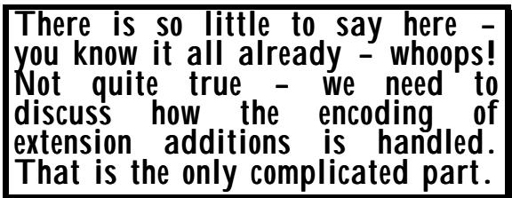

We have also discussed earlier the use of tags to provide a canonical order for the elements of a SET, which then encodes in exactly the same way as a SEQUENCE. 我们之前还讨论过使用标签来为集合中的元素提供规范的排序方式，这种排序方式与序列的编码方式是完全相同的。

We are left in this clause to discuss when/whether values equal to a DEFAULT value are required to be present, or required to be absent, or whether we have an encoder's option. We also need to discuss the way extension additions are encoded. 在这一条款中，我们需要讨论的是：是否要求某些值必须存在，或者必须不存在；以及是否允许编码器自行选择这些值的存在或不存在。我们还需要讨论扩展信息的编码方式。

But first, let's have an example of encoding a value of a simple sequence type. The example is shown in Figure III-26 and the encoding in Figure III-27. The OPTIONAL/DEFAULT bit-map is preceded by "B:", contents by "C:", length determinant by "L:", and one or more padding bits by "P", as in earlier examples. 不过，首先让我们来看一个对简单序列类型的值进行编码的示例。该示例如图 III-26 所示，而编码过程则如图 III-27 所示。像之前的例子一样，OPTIONAL/DEFAULT 位图之前有一个“B:”，内容部分用“C:”表示，长度确定用“L:”来标识，此外还有一个或多个填充位，用“P”来表示。

```txt
my-sequence-val
SEQUENCE
{item-code INTEGER (0..254),
item-name IA5String (SIZE (3..10))OPTIONAL,
urgency ENUMERATED
{normal, high} DEFAULT normal }
::= {item-code 29, item-name "SHERRY"} 
```

```txt
B:10 (item-name present, urgency missing)
C:00011011 (value of item-code)
L:011 C:P534845525259 (length and value of item-name)

Figure III-27 Encoding of the sequence value 
```

It is worth noting that the total length of this PER encoding is seven octets. In BER (assuming the encoder takes the option of encoding default values and always using a 3-octet definite length field, both on the grounds of simplicity), we get a total of 24 octets. If the encoder is more bandwidth conscious and omits the encoding of the default value and uses short definite lengths (which suffice in this case), BER will produce 13 octets. 值得注意的是，这种 PER 编码的总长度共有七个八位组。而在 BER 编码中（假设编码器选择默认值的编码方式，并且始终使用三个八位组来表示固定长度字段，这样更简洁），总长度为 24 个八位组。如果编码器更加注重带宽效率，省略了默认值的编码处理，而采用较短的固定长度字段表示数据，那么 BER 编码将只需要 13 个八位组即可。

## 15.1 Encoding DEFAULT values 15.1 编码 默认值

Here we find some differences between CANONICAL-PER (which is fully canonical), and BASIC-PER (which has encoder's options in complex cases that rarely arise). 在这里，我们发现了两种方式之间的某些差异：一种是“标准模式”（完全符合规范），另一种则是“基础模式”（在极少数情况下允许使用编码器提供的选项）。

For both encoding rules, if the actual value to be encoded equals the default value for "simple types" (defined as anything that is not a SET, SEQUENCE, SET OF, SEQUENCE OF, CHOICE, EMBEDDED PDV, EXTERNAL or unrestricted character string type, then the encoder is required to omit the encoding in both CANONICAL-PER and in BASIC-PER (both are canonical). 对于这两种编码规则，如果待编码的实际值等于“简单类型”的默认值（即那些不属于 SET、SEQUENCE、SET OF、SEQUENCE OF、CHOICE、EMBEDDED PDV、EXTERNAL 或不受限制字符字符串类型的类型），那么编码器需要在 CANONICAL-P 和 BASIC-PER 两种规范中都不进行编码操作（这两种规范都是标准的规范）。

However, for the types listed above, CANONICAL-PER again requires omission if the value equals the default value, but BASIC-PER leave it as an encoder's option, making it unnecessary to do a possibly complex run-time check for equality of a value with the DEFAULT value. 不过，对于上述列出的类型，如果值等于默认值，那么再次需要忽略该值。但是，对于 BASIC-PER 类型，可以将此选项作为编码器的选项来处理，这样就无需进行可能复杂的运行时检查来判断值是否与默认值相等了。

## 15.2 Encoding extension additions 15.2 编码扩展添加

The general principles of encoding extensible types applies: we have an extensions bit up front (before the bit-map of OPTIONAL or DEFAULT elements) which is set to zero if the abstract value is in the root, one otherwise. 扩展类型的编码基本原则同样适用：我们预先定义了一个扩展位（位于 OPTIONAL 或 DEFAULT 元素的位图之前），如果抽象值在根节点中，则该位设为 0；否则就设为 1。

Extension additions tend in practice to be marked OPTIONAL (or DEFAULT), but this is not a requirement. If in Version 2, one addition was not so marked, then Version 2 systems would always have to encode additions, and would always have the extensions bit set to one. Only version 1 systems would set it to zero. 在实际使用中，这些扩展项通常被标记为“可选”或“默认选项”。不过，这并不是强制要求。如果在版本 2 中某个扩展项没有被标记为可选，那么版本 2 的系统必须始终对该扩展项进行编码处理，并且扩展标志始终会被设置为 1。只有版本 1 的系统才会将其设置为 0。

Values for extension additions are always encoded at the position of the insertion point, and a decoder expects such encodings if the extensions bit is set to 1, not otherwise. 扩展添加的值总是被编码在插入点的位置。如果扩展位被设置为 1，那么解码器就会期望看到这种编码方式；否则就不会如此了。

First, we must recap about extension additions in a SEQUENCE. These may be either a single element (called an extension addition type), or a group of elements contained in version brackets (called an extension addition group). 首先，我们需要回顾一下在序列中如何进行扩展添加操作。这些扩展添加可以是单个元素（称为扩展添加类型），也可以是一组包含在版本括号中的元素（称为扩展添加组）。

The easiest way to describe the handling of an extensions addition group (and the way it is described in the specification), is for the reader to mentally replace the entire group of elements and the version brackets with a single OPTIONAL SEQUENCE, whose elements are the elements of the addition group. There is just one rider: if all elements of the group are to be omitted in the encoding (they are all marked OPTIONAL or DEFAULT), then there is no encoding for the entire SEQUENCE, and the outer-most OPTIONAL bit-map would record its absence. (An example of this is given later). 描述扩展加法群的处理方式（以及规范中对该方式的描述）最简单的方法，是让读者在脑海中将整个元素集和那些版本括号替换为单一的“可选序列”。这个序列的元素就是加法群中的元素。不过有一个例外：如果编码过程中需要省略该群的所有元素（因为它们都被标记为“可选”或“默认”），那么整个序列就不会被编码，而最外层的“可选”标志则用于表示这一情况。（稍后会给出一个示例。）

We have now reduced the problem to a simple list of extension addition types, some or all of which may be marked OPTIONAL, and hence may be missing in an encoding. As with elements in the root, a decoder needs to know which elements are present in the encoding, and which are not, and once again a bit-map is used. The problem in this case, however, is that Version 1 systems will not know how many extension addition types there are in the specification, and hence will not know the length of the bit-map. Moreover, such systems will not know whether an extension addition type was marked optional or not. This produces two differences from the bit-map used for the root elements: 我们现在将问题简化为一组简单的扩展加法类型列表。其中一些类型可能被标记为“可选项”，因此可能在编码过程中缺失。就像在根元素中一样，解码器需要知道编码中哪些元素存在，哪些不存在。同样，这里也会使用位图来表示这些信息。不过，问题在于，第 1 版系统并不清楚规范中到底包含了多少种扩展加法类型，因此也无法确定位图的长度。此外，这些系统也无法判断某个扩展加法类型是被标记为“可选项”还是其他情况。这就使得与根元素相关的位图存在两个方面的差异：

• The bit-map contains one bit for every extension addition type, whether it is marked optional or not, recording its presence or absence in the encoding. • 该位图结构中，每种扩展添加类型都对应一个位位。这些位可以标记为可选，也可以不标记，以此来表明该扩展类型在编码中的存在与否。

• The bit-map is preceded by a count giving the number of bits in the bit-map. • 位图之前有一个数字，表示位图中的位数。

The count for the bit-map length is encoded as a normally small whole number. 位图长度的计算结果被编码成一个较小的整数。

The effect of encoding the count as a normally small whole number is that there is again provision for fragmenting the extension additions bit-map into 64K fragments if the number of extension additions exceeds 64K. With the presence of version brackets, where additions are unlikely to occur at less than about one year intervals, a "not supported" response from a tool would be wholly appropriate! 将计数编码为较小的整数，这样做的好处是，如果扩展附加的位数超过了 64K，那么就可以将这部分数据分割成 64K 的片段。考虑到版本间隔通常约为一年，因此当工具返回“不支持”的响应时，这种处理方式是完全合理的。

Following the bit-map, we encode the value of the extension addition types, but in this case a Version 1 system does not know the actual types involved, and would not be able to find the end of the encoding of an extension addition, so each of the extension addition types is "wrapped up" with a preceding length determinant. The situation is slightly worse than this, however. What should the length determinant count, given that the decoder does not know the type that is wrapped up? Clearly the only possibility is bits or octets, and octets was chosen. 在处理位图之后，我们会对扩展加法类型的值进行编码。不过，在版本 1 的系统中，系统并不知晓实际涉及的类型，因此无法确定扩展加法编码的结束位置。因此，每种扩展加法类型都被一个长度指示符“包裹”了起来。不过，情况其实比这更糟糕一些。考虑到解码器并不知晓被“包裹”的类型，那么长度指示符的数量应该是多少呢？显然，唯一的可能性就是比特或八位字节，而这里选择了八位字节作为长度指示符。

So each extension addition type is treated as if it were an outer- level type being encoded. If it is present, but has zero bits (not likely to arise - a NULL, for example), then it encodes to a one-bit. It then has zero padding bits added at the end to make it up to an integral number of octets and is then added to the encoding preceded by a general length determinant (which, remember, is octet aligned). 因此，每种扩展加法类型都被视为一种被编码的外层类型。如果某个类型存在，但其中的位数为零（这种情况不太可能发生，例如 NULL 的情况），那么这种类型就会被编码为一个一位的二进制值。之后，会在该类型末尾添加零个填充位，以使其总位数达到一个完整的八位组，然后再将其添加到编码中，同时还会包含一个通用长度指示符（记住，这个指示符是以八位组为单位对齐的）。

This "wrapping up" then can be quite expensive on bandwidth, and it was for this reason (mainly) that "version brackets" were introduced. Because all the elements in a version bracket encode (optimally) as the elements of an OPTIONAL SEQUENCE which is treated as a single extension addition, we get only one "wrapper" instead of one for each element. 这种“封装”过程可能会消耗大量的带宽资源，因此才主要引入了“版本括号”机制。因为在一个版本括号中，所有元素都被优化地编码为可选序列的元素，而这些可选序列则被视作单一的扩展项。这样一来，我们只需一个“封装器”来处理所有元素，而不是对每个元素都分别进行封装。

```txt
my-sequence-val
SEQUENCE
{item-code INTEGER (0..254),
item-name IA5String (SIZE (3..10))OPTIONAL,
... !1 -- see para 14.6 for exception handling --,
urgency ENUMERATED {normal, high} DEFAULT normal,
[[ alternate-item-code INTEGER (0..254),
alternate-item-name IA5String (SIZE (3..10))OPTIONAL ]] }
::= {item-code 29, item-name "SHERRY",
urgency high, alternate-item-code 45,
alternate-item-name "PORT" }
Figure III:28: An extended sequence value for encoding 
```

The "wrapping up" also has a significant implementation cost, in that it requires the complete encoding (or at least the first 64K octets thereof) of the extension addition to be produced and any necessary padding bits inserted, before the length wrapper count is known and can be encoded. (This is similar to the problem of the use of the long definite form in BER to encode the length of a SEQUENCE, rather than the indefinite form). There is, however, no alternative to this wrapping up if we want interworking between Version 2 and Version 1 systems (unless we go back to a TLV approach for everything). 这种“封装”过程还伴随着较高的实施成本，因为需要完整地编码扩展项（或者至少是前 64K 个八位组），并插入必要的填充位，只有这样，才能确定长度并对其进行编码。（这类似于在 BER 中使用长定义形式来编码 SEQUENCE 的长度的问题，而不是使用不定形式。）不过，如果我们希望版本 2 和版本 1 的系统能够相互协作，那么除了采用 TLV 方法处理所有情况之外，没有其他可行的办法。

```txt
E:1 (extensions bit SET)
B:1 (item-name present)
C:00011011 (value of item-code)
L:011 C:P534845525259 (length and value of item-name)
L:000010 B:11 (length - normally small whole number and value of extensions bit-map)
L:P0000001 C:10000000 (general length and padded value of urgency)
L:P00000011 (general length of version bracket addition)
C:00101101 (alternate-item-code)
L:001 C:P504F5254 (length and value of alternate-item-name) 
```

Figure III-29: The encoding of the extended sequence value 图 III-29：扩展序列值的编码方式

Now for an example of encoding an extensible SEQUENCE with one extension addition type and one extension addition group added. (We base this on the earlier sequence type example.) Figure III-28 shows the value to be encoded, and Figure III-29 shows the encoding (the notation used is the same as in earlier examples of encodings). 现在我们来举个例子，说明如何对一个可扩展的 SEQUENCE 进行编码。在这个例子中，我们只增加了一个扩展类型和一个扩展组。（我们的做法基于之前提到的序列类型示例。）图 III-28 展示了需要编码的数据内容，而图 III-29 则展示了编码方式（所使用的符号与之前示例中的相同）。

This gives a total of 18 octets. Again, if we take the worst case BER encoding as described earlier, this gives 37 octets, and the best case gives 25. 总共需要 18 个八位元。再次强调，如果采用之前描述的最差情况 BER 编码方式，那么所需的数据量将达到 37 个八位元；而使用最佳编码方式的话，所需数据量则降至 25 个八位元。

## 16 Encoding CHOICE values. 16. 编码 CHOICE 值。

The encoding of choice indexes for both root alternatives and for those outside the root has been fully described earlier. The only remaining point to note is that here, as for sequence, if the chosen alternative is outside the root a Version 1 system will not be able to find the end of it, so we again have a "wrapper", encoded in exactly the same way as extension additions in a SEQUENCE or SET. 关于根选项以及那些位于根选项之外的选项的编码方式，之前已经详细描述了。现在需要注意的一点是：在这里，就像在序列中一样，如果选择的选项位于根选项之外，那么版本 1 的系统将无法找到该选项的末端。因此，我们再次需要一个“包装器”来对其进行编码，这种编码方式与在序列或集合中对扩展项的编码方式完全相同。

Here we give one example of each of these cases. 在这里，我们为每个案例提供了一个示例。

Note that version brackets are permitted in choice type extensions, but they do not affect the encoding, and serve purely as a documentation aid for humans. What matters is simply the list of added alternatives, each of which must have distinct outer-level tags, even if they are in different version brackets. 请注意，在选项扩展中允许使用版本括号，但它们不会影响编码方式，仅仅是为了方便人类理解而设计的文档辅助工具。重要的是要列出所有不同的选项，每个选项都必须拥有独特的外部标签，即使它们属于不同的版本括号。

The values to be encoded are shown in Figure III-30 (assume an environment of automatic tags) and the encodings are shown in Figure III-31, where "I:" is used to introduce the choice index encoding. 需要编码的值如图 III-30 所示（假设处于自动标签环境），而编码方式则如图 III-31 所示。在图 III-31 中，“I：”用于引入选择索引编码方式。

```txt
Choice-example ::= CHOICE
{normal NULL,
high NULL,
... !2 -- see para 14.6 for exception handling --
medium NULL }

first-choice Choice-example ::= normal:NULL
second-choice Choice-example ::= medium:NULL

Figure III-30: Two choice values for encoding 
```

```txt
first-choice: E:0 I:0 C: (a total of two bits)
second-choice: E:1 (extensions bit set)
C:000000 (index as a normally small
whole number)
L:P00000001 (general length "wrapper")
C:00000000 (padded encoding of NULL)

Figure III-31: The encodings of the choice values 
```

In this example, worst case BER encodes with four octets in both cases, and best-case BER with two octets. PER took three octets in the second. This is just one of a small number of cases where PER can actually produce worse encodings than BER, but this is not often the case! 在这个示例中，最坏情况下的 BER 编码需要四个八位元来表示数据，而最佳情况下的 BER 编码则只需要两个八位元。在第二种情况下，PER 则使用了三个八位元来表示数据。这种情况只是少数几个当中，PER 所生成的编码可能比 BER 更差的情况之一；不过这种情况并不常见！

## 17 Encoding SEQUENCE OF and SET OF values. 17. 编码序列与数值集合。

There is nothing more to add here. There is a length determinant upfront giving the iteration count. The form of this (depending on any SIZE constraint on the SEQUENCE OF or SET OF) has been fully discussed earlier. 这里没有更多需要补充的内容了。前面有一个明确标注的变量，用于指示迭代次数。关于这种形式的讨论已经在前文中充分阐述过了，具体形式取决于对“序列”或“集合”的 SIZE 约束条件。


Note that these types may have a SIZE constraint in which there is an extension marker. As usual, values outside the root encode as if there were no size constraint. 请注意，这些类型可能存在一个“大小限制”，即存在扩展标记的情况。和往常一样，超出根节点范围的值会被编码为没有大小限制的情况。

Two examples are shown in Figures III-32 and III-33. The numbers have been kept deliberately small for ease of illustration. Note that in the example both the iteration count and the type being iterated are extensible. For a value of the SEQUENCE OF to be in its root only requires the iteration count to be within the root. The fact that the integer value 4 is outside the root of the INTEGER in the third iteration is flagged in the encoding of the INTEGER, and does not affect the extensions bit for the SEQUENCE OF. 在图 III-32 和图 III-33 中展示了两个示例。这些数字被刻意设计得较小，以便于图示说明。请注意，在这两个示例中，迭代次数和迭代的类型都是可扩展的。对于“SEQUENCE OF”的值来说，只需确保迭代次数在根值范围内即可。在第三次迭代时，整数值 4 超出了“INTEGER”的根值范围，这一点在“INTEGER”的编码中得到了标记，但这并不影响“SEQUENCE OF”的扩展功能。

My-sequence-of SEQUENCE (SIZE(1..4), ..., 4) OF INTEGER (0..3, ..., 4) 我的序列序列（长度由 1 到 4 个整数决定，范围为 0 到 3，共 4 个整数）

My-value-1 My-sequence-of ::= {1, 3, 4} 我的值 1，我的序列为：{1, 3, 4}

My-value-2 My-sequence-of ::= {1, 2, 3, 4} 我的值 2 我的序列为：{1, 2, 3, 4}

Figure III-32: Two SEQUENCE OF values for encoding 图 III-32：用于编码的两种数值序列

```lisp
My-value-1:
E:0 (extensions bit)
L:10 (iteration count of 3)
E:0 C:01 (value 1)
E:0 C:11 (value 3)
E:1 L:P0000001 C:00000100 (value 4)
My-value-2:
E:1 (extensions bit)
L:P00000011 (iteration count of 4)
E:0 C:01 (value 1)
E:0 C:10 (value 2)
E:0 C:11 (value 3)
E:1 L:P00000001 C:00000100 (value 4) 
```

Figure III-33: The encodings of the two SEQUENCE OF values 图 III-33：两个值序列的编码方式

## 18 Encoding REAL and OBJECT IDENTIFIER values. 18. 对 REAL 类型和 OBJECT IDENTIFIER 类型的值进行编码处理。

The box says it all! We have a general length determinant giving a count in octets, then for REAL (for both BASIC-PER and CANONICAL-PER) the contents octets of the CER/DER encoding of REAL (they are the same). For OBJECT IDENTIFIER encodings, the specification actually references the BER encoding, but the CER/DER encodings are exactly the same. 这个盒子已经说明了一切！它提供了一个通用长度确定器，以八位元为单位表示长度。而对于真正的（无论是基本长度还是标准长度）情况，REAL 类型的 CER/DER 编码中的内容八位元数值也是相同的。对于 OBJECT IDENTIFIER 编码，规范实际上引用了 BER 编码，但 CER/DER 编码与 BER 编码是完全一致的。

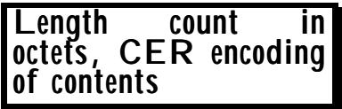

## 19 Encoding an Open Type 19. 对开放类型进行编码

We have discussed the form of an outer-level encoding, and of a general length determinant to provide a "wrapper" for extensions in sequence and set and choice types. Exactly the same mechanism is used to wrap up an Open Type (a "hole" that can contain any ASN.1 type). In general, the field of the protocol which tells a decoder what type has been encoded 我们已经讨论了外部级编码的形式，以及用于描述序列、集合和选择类型中扩展信息的通用长度指示符。同样的机制也被用来对开放类型进行封装——即一个可以容纳任何 ASN.1 类型的“容器”。一般来说，协议中负责告知解码器所编码类型信息的字段就是这种封装机制的一部分。

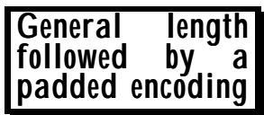

into the "hole" - into the Open Type field, may appear later in the encoding than that field, but with PER a decoder will be unable to find the end of the encoding in the "hole" without knowing the type. (Contrast BER, where there is a standard TLV wrapper at the outer level of all types, and where no additional wrapper is needed nor used). So in PER the wrapper is essential in the general case, and is always encoded. 进入“hole”这个字段后，该字段可能会在编码中出现，但使用 PER 编码方式时，解码器将无法在“hole”中找到编码的结尾，除非知道该字段的类型。与 BER 不同，在 BER 中，所有类型都有一个标准的 TLV 封装层，因此不需要或不会使用额外的封装层。所以，在 PER 编码方式中，封装层是必不可少的，并且总是会被编码进去的。

The inclusion of a wrapper in PER Open Types has been exploited by some applications to "wrap-up" parts of an encoding, even tho' it is not strictly necessary to do so. 在 PER Open Types 中加入了包装器功能后，一些应用程序利用这一特性来“封装”编码的某些部分。不过，虽然这样做并非绝对必要，但确实有一些应用采用了这种做法。

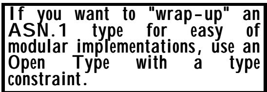

Consider an element of a large SEQUENCE consisting of: 考虑一个由多个元素构成的巨大序列：

## security-data SECURITY-TYPES.&Type (Type1) 安全数据 安全类型。类型 1

This is an example of a "type constraint" on an Open Type, and the reader was referred to this clause for an explanation of its usefulness. 这是一个关于“类型约束”的例子，其中提到了这个条款，以说明其重要性。读者可以参考该条款来了解其具体含义。

From the point of view of abstract values, this is exactly equivalent to: 从抽象价值的角度来看，这完全等同于：

## security-data Type1 安全数据 类型 1

The PER encoding, however, will have a wrapper round Type1 in the first case, not in the second (type constraints are not PER-visible). 不过，在第一种情况下，PER 编码会包含一个 Type1 的包装轮次；而在第二种情况下则不会（因为类型约束并不适用于 PER）。

This can be useful in an implementation, because it enables the main body of the protocol to be dealt with in an application-specific way, leaving the security data unwrapped and unprocessed, passing it as a complete package to some common "security kernel" in the implementation. 这在实现中非常有用，因为它使得协议的核心部分能够以特定于应用程序的方式进行处理，而安全相关数据则保持原样，未经处理，作为一个完整的包被传递给实现中的某个通用“安全核心”模块。

It is generally only in the security field that specifiers use these sorts of construct. 通常，只有在安全领域才会使用这种表述方式。

## 20 Encoding of the remaining types 20. 其余类型的编码处理

GeneralizedTime, UTCTime, ObjectDescriptor, all encode with a general length determinant giving an octet count, and contents the same as BER or CER (for BASIC-PER and CANONICAL-PER respectively). Notice that this is the fourth occurrence where BASIC-PER is not canonical, in the interests of simplicity - the other three are: GeneralizedTime、UTCTime、ObjectDescriptor 这些类型都使用一种通用的长度确定方法来编码，该方法会返回一个八位元的数值。这些类型的内容与 BER 或 CER 相同（分别用于 BASIC-PER 和 CANONICAL-PER）。需要注意的是，这是第四次出现 BASIC-PER 不是规范化的情况了。出于简洁性的考虑，其他三次情况都是如此。

```txt
At last! The final clause describing PER encodings. I wish this book was a Web site, so that I could see how many people had read all the way to here! Well done those of you that made it! 
```

• Encoding values of a set-of type. • 对某一类型集合中的值进行编码。

• Encoding GeneralString and related character string types. • 对 GeneralString 及相关字符字符串类型进行编码处理。

• Encoding a DEFAULT element (which is not a simple type) in a sequence or set type. • 在序列或集合类型中编码一个“DEFAULT”元素（该元素并非简单的类型）。

Canonical PER is, of course, always canonical. 当然，典型的 PER 始终都是具有规范性的。

That just leaves types which are defined using the "ValueSetTypeAssignment" notation, that is, notation such as: 这样就只剩下那些使用“ValueSetTypeAssignment”表示法来定义的类型了，比如这样的表示法：

```txt
MyInt1 INTEGER ::= { 3 | 4 | 7}
MyReal1 REAL ::= {0 | PLUS-INFINITY | MINUS-INFINITY} 
```

These are equivalent to: 这些相当于：

```txt
MyInt2 ::= INTEGER (3 | 4 | 7)
MyReal2 ::= REAL (0 | PLUS-INFINITY | MINUS-INFINITY) 
```

Initially the PER standard overlooked the specification of these types, but a Corrigendum was issued saying that they encode using this transformation. 最初，PER 标准没有考虑到这些类型的规范问题。不过后来发布了一个修正说明，指出这些类型确实使用了这种变换来进行编码。

## 21 Conclusion 21 结论

In a chapter like this, it seems important to emphasise that neither the author nor any of those involved in publishing this material can in any way be held liable for errors within the text. 在这样一个章节中，重要的是要强调：无论是作者还是参与出版此材料的任何人，都不应对文本中的错误负责。

Caveat Emptor! 小心，买家啊！

The only authoritative definition of PER encodings is that specified in the Standards/Recommendations themselves, and anyone undertaking implementations should base their work on those primary documents, not on this tutorial text. 关于 PER 编码的唯一定义，就是标准/建议文件中所规定的内容。任何负责实现该编码的人都应该以这些主要文件为参考，而不是依赖本教程中的内容。

Nonetheless, it is hoped that this text will have been useful, and will help implementors to more readily read and to understand the actual specifications. 不过，希望这篇文本能够起到作用，帮助实施者更轻松地阅读和理解具体的技术要求。

The reader should now have a good grasp of the principles used in PER to provide optimum encodings, but tempered by pragmatic decisions to avoid unnecessary implementation complexity. 现在，读者应该已经很好地理解了在 PER 中用于实现最佳编码的原理了。不过，这些原理的实现过程中也考虑到了实际可行性，以避免不必要的实现复杂性。

Some things may appear to be unnecessarily complex, such as fragmenting bit-maps if they are more than 64K, or encoding zero bits if an INTEGER is restricted to a single value, as such things will never occur in the real world. These specifications, however, result from applying a general principle (and general code in an implementation) to a wider range of circumstances, and are not extra implementation complexity. 有些情况看起来可能过于复杂了，比如当位图的大小超过 64K 时，就需要将其分割开来；或者当某个整数值只能取单一值时，就需要对零位进行编码。不过，这些情况其实并不存在于现实世界中。这些规范之所以存在，是因为我们将一个通用原则（以及在实现过程中使用的通用代码）应用到更广泛的情况中，而这些规范本身并不构成额外的实现复杂性。

We have also seen in the examples how PER encodings achieve significant gains over BER in verbosity, and even greater gains if sensible use of constraints has been made in the base specification. 在示例中，我们看到了 PER 编码在信息量方面比 BER 有显著的优势，而如果在基础规范中合理地使用约束条件，那么这种优势会更加明显。

There is just one more chapter to come in this section (very much shorter than this one!). That discusses some other encoding rules that never quite made it (or have not yet made it!) to becoming International standards, and the advantages and (mainly) disadvantages of "rolling your own" encoding rules. 这一节还有一章内容即将介绍（不过这一章要短得多！）。那一章会讨论一些其他编码规则，这些规则至今未能成为国际标准，同时也会探讨“自行制定编码规则”的优势以及主要缺点。
