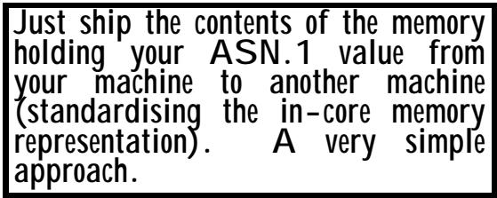
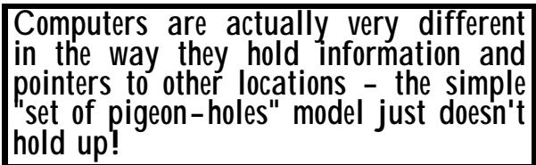
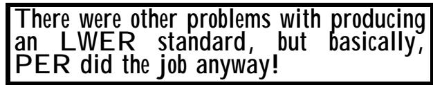
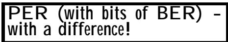

# Chapter 4 Other ASN.1-related encoding rules 
第四章 其他与 ASN.1 相关的编码规则

(Or: So you have special requirements?) （或者：那么您有一些特殊的要求吗？）

## Summary: 总结：

This chapter briefly describes other proposals for ASN.1 encoding rules that have been made from time to time. None of these are currently on a path for International Standardization as part of the ASN.1 specifications, and this chapter can safely be omitted by all but the intellectually curious. It is of no interest to most readers concerned with "What is ASN.1, how do I write it, and how do I implement protocols defined using it." But it does give an (incomplete) picture of other attempts to enhance the ASN.1 notation with different encoding rules. 本章简要介绍了一些关于 ASN.1 编码规则的提议。不过，这些提议目前都未能成为 ASN.1 规范中的国际标准，因此除了那些感兴趣的人之外，其他人可以不必关注这些内容。对于那些只关心“什么是 ASN.1、如何编写 ASN.1 代码以及如何使用它来构建协议”的读者来说，这些内容并不重要。不过，这些章节确实提供了一些关于如何改进 ASN.1 表示法的其他尝试的概述（尽管并不完整）。

The order of coverage is not time order (saying when the germ of an idea first appeared within a sometimes closed community is not easy), but is basically random! The following are briefly mentioned: 这些内容的排序并非按照时间顺序进行的（也就是说，某个想法何时首次出现在一个有时较为封闭的社会群体中并不容易确定）。实际上，这些内容的排序基本上是随机的！以下简要提及一下：

• LWER - Light-Weight Encoding Rules • LWER – 轻量级编码规则

• MBER - Minimum Bit Encoding Rules • MBER – 最小位编码规则

• OER - Octet Encoding Rules • OER——八位组编码规则

• XER - XML (Extended Mark-up Language) Encoding Rules • XER - XML（扩展标记语言）编码规则

• BACnetER - BAC (Building Automation Committee) net Encoding Rules • BACnetER – BAC（楼宇自动化委员会）的编码规则

• Encoding Control Specifications (ECS) • 编码控制规范（ECS）

No doubt there are others lurking out there! 毫无疑问，还有其他人潜伏在那些地方！

## 1 Why do people suggest new encoding rules? 1. 为什么人们会提出新的编码规则呢？

As a basic work-horse, it is doubtful if BER can be bettered. It is simple, straight-forward, and robust. If you keep its basic "TLV" approach, there are few improvements that can be made. 作为一款基础型的工作用计算机，似乎已经没有什么改进的空间了。它的设计简单、直接且稳定。如果你保持其基本的“TLV”架构，那么基本上就不需要再进行任何改进了。

But it was clear in 1984 that it should be possible to encode more efficiently 不过，在 1984 年时已经明确，应该有可能更高效地进行编码了。

In the beginning there was chaos. And the greater Gods descended and each begat a new Standard, and the people worshipped the Standards and said "Give us more, give us more!" So the greater Gods begat more Standards and more and more, and lo, there was chaos once more! 起初，一切都是混乱的。然后，伟大的神祇们降临了，他们各自创造了新的标准。人们崇拜这些标准，不断祈求更多的标准。于是，伟大的神祇们又创造了更多的标准……然而，混乱再次降临了！

than BER, and several attempts were made prior to or around the time of the introduction of PER to produce essentially PER-like encodings. To avoid a proliferation of encoding rules, PER should have been developed and standardised in the late 1980s, not the early 1990s, but it wasn't! So several "industry-specific" encoding rules emerged to fill the vacuum. 在引入 PER 之前，以及在其推出前后，人们尝试了多次方法来创建类似 PER 的编码方式。为了避免编码规则的混乱，PER 本应在 20 世纪 80 年代末而不是 90 年代初被开发并标准化。但实际上并没有这样做！于是，各种针对特定行业的编码规则应运而生，以填补这一空白。

Currently, major tool vendors support only BER and PER. Support for other encoding rules for particular industry-specific protocols (supporting only the types used in those protocols, rather than all ASN.1 types) by a library of routines to perform specific parts of the encoding (not by an ASN.1 compiler, as defined and described in Section I Chapter 6) does however exist. 目前，大多数工具供应商仅支持 BER 和 PER 编码方式。不过，确实存在一些库程序，能够支持特定行业协议所需的其他编码规则（即仅处理这些协议中使用的类型，而不是所有 ASN.1 类型）。这些库程序通过执行特定的编码操作来实现对其他编码方式的支持，而不是像 ASN.1 编译器那样进行全面的编码处理，这一点在第六章第一节中有详细说明。

Producers of new encoding rules often claim either less verbosity on the line than BER, or greater simplicity than PER (or both!). 新编码规则的制定者通常声称，与 BER 相比，新规则在行数上要少得多；而与 PER 相比，新规则则更为简洁明了（或者两者兼具！）。

But to-date, the standardizers of ASN.1 have not considered any of the alternative encoding rule drafts that have been submitted to have sufficient merit to progress them as standards within the ASN.1 suite. 但迄今为止，ASN.1 的标准制定者们并未考虑那些被提交来的替代编码规则草案中有哪些具有足够的合理性，足以被采纳为 ASN.1 标准。

That is not to say that they are (for example), necessarily on balance inferior to PER - everyone accepts that if you started again with what you know now, PER could be improved - but providing another standard for encoding rules that was very similar to PER and only a marginal improvement on it would not make any sort of sense. Tool vendors would not want to support it, and of course existing implementations of protocols would have to be considered. The ASN.1 encoding rules have a high degree of inertia (the notation can be changed much more easily) because of the "bitson-the-line" that are flowing around the world every minute of every day. 这并不是说，它们必然不如 PER。毕竟，如果重新从现有的知识出发来开始工作，那么 PER 是可以得到改进的。但是，如果有一个与 PER 非常相似的编码规则标准，而且只是对 PER 有轻微的提升，那也是没有意义的。工具供应商不会愿意支持这样的标准，当然，也需要考虑现有的协议实现方式。ASN.1 的编码规则具有很高的惯性特性（因为这种规范可以很容易地被修改），因为每天每分钟都有大量的数据在全世界范围内传输。

Nonetheless, there continue to be attempts to provide slightly different encoding rules to support a particular protocol for a particular industry, usually proposed by some consultancy or software house associated with that industry, in the hope that those encoding rules will become the de facto standard for that industry. Such encoding rules rarely, however, achieve the market demand that leads to their incorporation in the main ASN.1 compiler tools, or ratification as international standards for ASN.1 encoding rules for use across all industries. 不过，仍然有一些人试图提出一些略有不同的编码规则，以支持特定行业中的特定协议。这些建议通常由与该行业相关的咨询公司或软件公司提出，希望这些编码规则能成为该行业的事实标准。然而，这样的编码规则很少能够满足市场需求，从而被纳入主要的 ASN 编译工具中，或者被批准为国际标准，以便在所有行业中使用。

It is, perhaps, a sign of the success of the ASN.1 notation that many industries new to protocol design are choosing to use ASN.1 to define their messages, but perhaps it is the NIH (Not Invented Here) factor that so often leads to desires to cut down the notation, or to produce different encodings for it. Who knows? 这或许正是 ASN.1 标记语言成功的一个标志——许多从事协议设计的行业都选择使用 ASN.1 来定义他们的消息格式。不过，也可能是因为“并非本土发明”的因素，人们往往希望简化这种标记语言，或者为其设计不同的编码方式。谁知道呢？

## 2 LWER - Light-Weight Encoding Rules 2 轻量级编码规则 – 低重编码规范

Light-Weight Encoding Rules were first proposed in the late 1980s when ASN.1 compilers started to emerge, and were from the beginning the subject of much controversy, with the Deutsches Institut für Normung (DIN) strenuously opposing their development as international standards. 轻量级编码规则最初是在 20 世纪 80 年代末提出的，当时 ASN.1 编译器开始出现。从一开始，这一规则就引发了诸多争议，德国标准协会（DIN）强烈反对将其发展为国际标准。

Standards work was approved, but was eventually abandoned - too many problems! 这些标准工作已经得到了批准，但最终还是被放弃了——存在的问题太多了！

Suggestions for LWER pre-dated work on PER, and the concern was not with the verbosity of BER, but with the number of CPU cycles required to do a BER encoding. They were approved as a Work Item within ISO, and were being progressed up to the mid-1990s, when they were abandoned (for reasons, see below). 这些关于 LWER 的建议早于对 PER 的研究，其重点并非 BER 的冗长性，而是进行 BER 编码所需的 CPU 周期数量。这些建议被作为工作项在 ISO 内部得到了批准，并一直推进到 20 世纪 90 年代中期，之后由于某些原因而被放弃了（具体原因见下文）。

## 2.1 The LWER approach 2.1 LWER 方法

The basic idea was simple, and was based on the observation that: 这个基本的想法很简单，其基于这样的观察：

An ASN.1 compiler generates the pattern for an in-core data structure to hold values of an ASN.1 type (it is usually a whole series of linked lists and pointers to similar structures), defining that in-core data structure using a high-level programming language. ASN 编译器会生成一种内部数据结构的数据模型，该模型用于存储 ASN 类型的值。通常，这种内部数据结构由一系列链接列表以及指向类似结构的指针组成。该数据模型是使用高级编程语言来定义的。

• Run-time support tree-walks that structure to generate encodings (at some cost in CPU cycles) that are then transmitted down the line. • 在运行时支持树形结构，以生成编码结果（这需要一定的 CPU 周期开销），然后将这些编码结果沿着线路传输下去。

• A decoder reproduces a (very similar) in-core structure at the other end of the line. • 解码器能够在线路的另一端再现一个与原始结构非常相似的信号结构。

Why not simply ship the contents of the in-core data structure directly? That was in essence the LWER proposal. 为什么不直接将核心数据结构中包含的内容发送出去呢？这实际上就是 LWER 提案中的方案。

## 2.2 The way to proceed was agreed 2.2 后续的行动方案已经达成一致。

Early work agreed several key points: 早期的工作达成了几个关键共识：

<table><tbody><tr><td data-imt-p="1">Agree a standard in-core representation of ASN.1 values, and agree how to ship it to another machine. Easy. 同意采用标准化的内嵌方式来表示 ASN.1 值。同时也商量一下如何将其传输到另一台机器上。很简单而已。</td></tr></tbody></table>

• The first step was to agree a model of computer memory on which to base the definition of in-core data structures. • 第一步是就计算机内存的模型达成一致，这一模型将作为定义核心数据结构的依据。

• The second step was to standardise a memory-based in-core structure for holding the values of any ASN.1 type. • 第二步是标准化一种基于内存的核心结构，用于存储任何 ASN.1 类型的数值。

• The third step was to standardise how such a structure was to be transmitted to a remote system. • 第三步是标准化如何将这种结构传输到远程系统。

## 2.3 Problems, problems, problems 2.3 问题、问题、问题……太多了

Serious problems were encountered related to all these areas. 在所有这些领域都遇到了严重的问题。

As far as a model of computer memory was concerned, at assembler language level (which noone uses today anyway), memory is made up of addressable units capable of containing integers or pointers to other addressable units or strings of characters (a simplification, but it will do). But the size of those addressable units - bytes, 16-bit words, 32-bit words - hard-ware varies very much. 就计算机内存的模型而言，在汇编语言级别（如今已经很少有人使用这种语言了），内存是由一些可寻址的单元组成的，这些单元可以存储整数数据，或者指向其他可寻址单元或字符字符串的指针（这是一种简化的表示方式，但足够用了）。不过，这些可寻址单元的大小有所不同——可能是字节、16 位字、32 位字等。硬件层面上，这些单位的大小差异很大。

And if a structure is defined using such a model, how easy will it be to replicate that structure using the features available in particular high level languages such as Java? 如果某个结构是通过这样的模型来定义的，那么使用像 Java 这样的高级编程语言所提供的功能来复制该结构将会多么容易呢？

More significant was the little-endian/big-endian problem. (Named after the characters in Jonathon Swift's Gulliver's travels who fought a war over whether eggs should be broken at their "little-end" or their "big-end"). But in computer parlance, you look at basic hardware architecture and proceed as follows: 更为重要的是“小端序/大端序”问题。这个问题得名于乔纳森·斯威夫特的《 Gulliver's Travels》中的角色们，他们为了争论鸡蛋应该以“小端”还是“大端”方式打开而发生了战争。但在计算机领域，我们通常会考虑硬件架构的基本规则，并按照以下方式来处理这个问题：

• Assume byte addressing, and draw a picture of your memory with two-byte integers in it. • 假设采用字节寻址方式，然后绘制出包含两个字节整数数据的内存结构图。

• Put an arrow on your picture from low addresses to high addresses. (Some people will have drawn the picture so that the arrow goes left-to right, others the reverse. This is not important, that only affects the depiction on paper.) • 在图片上画一个箭头，箭头应从较低的地址指向较高的地址方向。（有些人会画成箭头从左到右的方向，有些人则相反。这并不重要，因为只会影响图片在纸上的呈现效果。）

Now write down whether, for each integer, the first byte that you encounter in the direction of the arrow is the least significant octet of the integer (a little-endian machine) or the most significant octet of the integer (a big-endian machine). 现在请写下：对于每一个整数来说，在箭头所指的方向上，首先遇到的第一个字节是該整数的最低有效八位组（对于小端字节序的机器），还是最高有效八位组（对于大端字节序的机器）。

Little-endians will probably have drawn the arrow going left-to-right, and big-endians will probably have drawn it going right-to-left, but as said above, that is not important (both could have drawn a mirror image of their picture). What matters is whether the high-order octet of an integer is at a higher or lower address position than the low-order octet. And remember, what applies to integers also (invariably) applies to fields holding addresses (pointers). 那些持小端观点的人可能会将箭头画成从左到右的方向，而持大端观点的人则可能将其画成从右到左的方向。不过，如上所述，这并不重要（两种观点的人都可以画出自己图像的镜像版本）。真正重要的是，一个整数的最高八位字节是位于比最低八位字节更靠上的位置，还是更靠下的位置。记住，这一规则同样适用于存储地址的字段（即指针）。

Unfortunately, both big-endian and little-endian machines exist in the world! 不幸的是，世界上存在两种不同版本的机器：一种是大端序的，另一种是小端序的！

And if you have an in-core data structure representing an ASN.1 value on a little-endian machine, and you copy that to a big-endian machine, decoding it into a usable from will certainly not be light-weight! 如果你在一个小端序的机器上有一个表示 ASN.1 值的内部数据结构，然后将其复制到大端序的机器上，那么将其解码为可用的格式后，结果肯定不会是简洁的！

So we need a big-endian and a little-endian variant of LWER, and you will only be able to use LWER if you are transferring between similar (endian-wise) machines, otherwise you go back to BER or PER. 因此，我们需要两种版本的 LWER：一种采用大端序，另一种采用小端序。只有在使用具有相似端序的机器进行数据传输时，才能使用 LWER；否则，就只能回到使用 BER 或 PER 的方式了。

But that was all assuming machines with byte addressing, and 16-bit integers and pointers. Now consider the possible permutations of 32-bit integers, or machines that can only (easily) address (point to) 16-bit or 32-bit words ..... 不过，这一切都是建立在机器能够使用字节地址体系、处理 16 位整数以及指针的基础上。现在，让我们考虑一下 32 位整数的情况，或者那些只能轻松处理 16 位或 32 位字长的机器的情形吧……

Suddenly we seem to need rather a lot of variants of LWER! 似乎我们现在需要很多不同版本的 LWER 了！

This was the basic reason for the DIN opposition to the work - even if standards were produced, they would be useful only for transfers between very restricted families of machine architecture. And add the problems of mirroring those low-level memory-based architectures in high-level languages. Throw in the fact that tool-vendors can, if they wish, define an LWER (separate ones for each machine range that they support) to be used when their own tool is communicating with itself on the same machine range, and what do you get? Probably as much interworking as you would get with LWER! 这就是 DIN 反对这种工作的基本原因——即便能够制定出相关标准，这些标准也只适用于非常有限范围内的机器架构之间的数据传输。此外，将那些基于内存的低级架构移植到高级语言中还会带来许多问题。再加上，工具供应商可以在需要时定义自己的 LWER（针对他们支持的各个机器架构分别定义），以便在自己的工具在同一机器架构上相互通信时使用。那么，结果会是什么呢？很可能带来的互操作性还不如使用 LWER 时那么好吧！

What LWER demonstrated was the importance of defining encoding rules (be they character-based or binary-based) that were independent of any given machine architecture - the idea of having something like BER or PER was vindicated. (And of course character-based encodings are also architecture independent.) LWER 所证明的是：定义编码规则的重要性——无论是基于字符还是基于二进制的方式，这些规则都无需依赖于任何特定的机器架构。因此，像 BER 或 PER 这样的概念确实具有实用性。（当然，基于字符的编码方式同样也是与架构无关的。）

## 2.4 The demise of LWER 2.4 LWER 的终结

Even if the above problems were sorted, there were still issues about what to ship down the line. If the total memory the linked list structures occupied was shipped, empty memory within that total hunk would need to be zeroed 即使上述问题得到了解决，仍然存在关于如何分配内存分配的问题。如果链表结构所占用的总内存被全部发送出去，那么这部分空内存就需要被清零。

to prevent security leaks. If empty memory was not shipped, then some form of garbage collection or of tree-walking for transmission would be needed, none of which seemed very light-weight. 为了防止安全漏洞的出现，如果不存在空闲内存的话，那么就需要某种形式的垃圾收集机制或树遍历方式来传输数据。不过，这些方案似乎都并不灵活。

But what eventually killed the LWER work is something that nobody had expected. Implementations of PER began to emerge. Whilst it was expected that PER would produce about a factor of two reduction in the length of an encoding (it did), it was wholly unexpected that it would encode and decode twice as fast! It did the job that LWER was trying to do! 但最终导致 LWER 项目失败的是一件出乎意料的事情。PER 的实现开始出现。虽然人们预计 PER 会使编码长度减少大约两倍（实际上确实如此），但完全出乎意料的是，PER 的编码和解码速度竟然是原来的两倍！它确实完成了 LWER 试图实现的目标。

Once you know, it seems obvious. All the complexity and CPU cycles in PER relates to analyzing the type definition and deciding what the encoding should be. This is either a hand-implementors brain-cycles, or is the compiler phase of a tool. It does not affect run-time CPU cycles. 一旦你知道了，一切似乎都变得显而易见。PER 中所有的复杂性和 CPU 消耗都集中在分析类型定义以及决定采用的编码方式上。这要么是手工实现的开发者所经历的流程，要么就是某种编译器的处理过程。不过，这些都不会影响程序的运行时的 CPU 消耗时间。

At run-time, it is a lot quicker (assuming code has been generated) to pick-up an integer value from a known location, and add the bottom three bits (say) of that integer value to a bit-position in a buffer than it is to generate the T and the L and the V for BER (probably using subroutine calls). 在运行时，从已知位置获取一个整数值，然后将该整数的最后三位附加到缓冲区的某个位位置上，这种方式要快得多（前提是代码已经生成完毕）。相比之下，为了生成 BER 所需的 T、L 和 V 等参数，就需要调用多个子程序，这显然效率较低。

There were also gains because if you reduce the size of the encoding you reduce the CPU cycles spent in the code of the lower layers of the protocol stack. 此外，还有其他方面的好处：通过减小编码的规模，就可以减少协议栈底层代码中所需的 CPU 周期数。

And finally, LWER was conceived in the mid to late 1980s, but machines got faster year-by-year. Gradually the CPU cycles spent in encoding/decoding became insignificant and irrelevant (the application processing for actual protocols also became more complex and time-consuming by comparison). 最后，LWER 这一概念是在 20 世纪 80 年代中期到后期提出的。不过，随着时间的推移，计算机的性能越来越快。因此，用于编码/解码的 CPU 周期变得越来越不重要了（实际上，处理各种协议的应用程序也变得更加复杂，所需的时间也更多了）。

LWER was dead. Too many problems with developing it, and what it was trying to achieve seemed no longer necessary. It was finally abandoned in 1997. LWER 已经失效了。开发它存在太多问题，而且它原本想要实现的目标也变得不再重要了。最终，它在 1997 年被放弃了。

## 3 MBER - Minimum Bit Encoding Rules 3 月 1 日 - 最小位编码规则

MBER was proposed in about the mid-1980s, but was never approved for the Standards path. Many of its principles were, however, adopted when PER was produced. MBER 这一概念大约在 1980 年代中期被提出，但从未被批准用于标准规范中。不过，在 PER 标准制定时，其许多原则确实被采纳了。

The idea behind MBER was to make full use of bounds information, and to produce encodings that were "what you would expect". MBER 背后的理念是充分利用边界信息，从而生成出“符合预期”的编码方式。

So a BOOLEAN would encode into one bit, and the type INTEGER (0..7) would encode into three bits. 因此，布尔类型会被编码为一位，而整数类型（0~7）则会被编码为三位比特。

MBER never addressed the encoding of all possible ASN.1 types (and in particular did not address the problems solved in PER by a choice index and a bit-map for OPTIONAL elements). MBER 从未处理过所有可能的 ASN.1 类型的编码问题（特别是没有解决在 PER 中通过选择索引和位图来处理 OPTIONAL 元素所遇到的那些问题）。

The main thrust of the MBER work was to make it possible to produce an ASN.1 definition of a type which, if MBER was applied to values of that type, would produce exactly and precisely the same bits on the line as some existing hand-crafted protocol was producing. MBER 工作的核心目标是实现一种 ASN.1 类型的定义。如果将该定义应用于该类型的各个值，那么生成的二进制位将会与某些现有的手工编写协议生成的二进制位完全一致且精确无误。

Typically, the aim was to move from protocol definitions using the techniques described in Section I Chapter 1 Clause 5.1 (pictures of octets) to ASN.1 specifications with no change to the bits on the line. 通常，我们的目标是从第 1 章第 5.1 节中描述的协议定义转向 ASN.1 规范，同时不会改变线路上的各个比特位。

(The reader may well ask "Why?", but this was a rather flattering recognition that use of the ASN.1 notation was quite a good (clear) way to describe the fields in a protocol message.) （读者可能会问：“为什么？”不过，这其实是一种相当赞赏的评价，表明使用 ASN.1 标记法来描述协议消息中的字段是一种非常有效且清晰的方法。）

MBER was never progressed internationally, but (as stated above), the idea of "minimum bit encodings" had a long-term influence and was included in PER. MBER 从未在国际上得到发展，但正如上文所述，“最小位编码”的概念产生了长期影响，并被纳入了 PER 中。

## 4 OER - Octet Encoding Rules 4. 八位组编码规则 – Octet Encoding Rules

At the time of writing this text, the future of OER is unclear, nor is its final form fully-determined. This text merely gives an outline of what this specification appears to the author to look like in the (very) late 1990s. 在撰写本文时，开放教育资源的发展前景尚不明朗，其最终形态也尚未确定。本文仅概述了作者认为这种规范在 20 世纪 90 年代末的样子。

It has been proposed as the encoding rules for a particular industry sector in the USA, and perhaps for international standardization for use with protocols in that sector. The industry sector is concerned with "intelligent highways". The sector is using ASN.1 to define protocols for communication between devices on the road-side and between them and control centres. In some cases the devices are large general-purpose computers (where BER or PER could certainly be easily handled). Some devices, however, will be more limited, and may not be able to handle the (alleged) complexity of PER, but where much of the efficiency of PER is required. 这一编码规则被提出用于美国某个特定行业领域，或许也可以用于国际标准化，以便与该领域的协议相结合。该行业领域关注的是“智能高速公路”系统。该领域使用 ASN.1 标准来定义道路两侧设备之间以及设备与控制中心之间通信的协议。在某些情况下，这些设备是大型通用计算机（在这种情况下，错误率或性能指标的问题可以轻松解决）。不过，也有一些设备的性能限制较多，可能无法处理性能指标所要求的复杂情况，但在需要大量提升性能的情况下，这种编码规则仍然非常有用。

(In relation to “alleged”, remember that all the complexity in PER is in the compile phase to analyze what the encoding should be. Once that is done, the actual encoding in PER is less code and simpler than in BER. Given a good cross-compiler system, even the simplest devices should be able to handle PER.) 关于“所谓的复杂性”，需要注意的是，PER 中的所有复杂性都存在于编译阶段，这一阶段负责分析编码方式。一旦编译完成，PER 中的实际编码方式就会比 BER 更简单、更简洁。只要拥有良好的跨编译器系统，即使是最简单的设备也能处理 PER 格式的数据。

OER was originally developed around the same time as PER, but in ignorance of the PER work (which was later folded into it). At the time of writing, it is a mix of BER (using BER length encodings) and PER. OER 最初的开发时间与 PER 几乎同时开始，但当时人们并未了解 PER 的相关研究成果（后来这些研究成果被整合到了 OER 中）。在撰写本文时，OER 实际上是由 BER 和 PER 混合而成的系统。

The name Octet-aligned Encoding Rules stems from the fact that all elements of an OER encoding have padding bits that make them an integral of eight bits. So INTEGER (0..7) will encode into eight bits (no tag, no length field), and BOOLEAN will encode into eight bits (no tag, no length field). “Octet-aligned Encoding Rules”这个名称的由来是因为 OER 编码中的所有元素都包含填充位，这些填充位使得每个元素都可以被表示为 8 位整数。因此，INTEGER 类型（0..7）会被编码为 8 位（没有标签，也没有长度字段）；而 BOOLEAN 类型则也会被编码为 8 位（同样没有标签，也没有长度字段）。

Apart from the use of BER-style length encodings, OER is very much like PER, but omits some of the optimisations of PER, producing a specification that is (arguably) simpler. 除了采用了 BER 风格的长度编码方式之外，OER 与 PER 非常相似，但省略了 PER 中的一些优化措施。因此，OER 的规范可以说更加简洁明了。

These encoding rules were considered by a joint meeting of the ISO/IEC and ITU-T ASN.1 groups in 1999, and the idea of providing a "FULLY-ALIGNED" version of PER received some support. This would in some ways complete the PER family, going along-side the existing UNALIGNED (no padding bits) and ALIGNED (padding bits where sensible) variants. 这些编码规则在 1999 年由 ISO/IEC 和 ITU-T ASN.1 小组的联合会议进行了讨论。提供“完全对齐”版本的 PER 得到了一些支持。这种方式可以在某种程度上完善 PER 系列标准，与现有的非对齐版本（没有填充位）和带有合理填充位的对齐版本相配合。

In discussion, it was felt that there was as yet insufficient customer demand to justify a "FULLY-ALIGNED" version of PER, and that in any case such a version of PER would not in fact be OER-compatible because of the multitude of differences (less optimization and use of BER features) between OER and PER. 在讨论中，人们认为目前客户的需求还不足以支持推出“完全兼容”版本的 PER。此外，由于 OER 和 PER 之间存在诸多差异（例如优化程度较低，且未充分利用 BER 功能），因此这样的 PER 版本实际上并不具备与 OER 兼容的能力。

At the time of writing, international standardization of OER is not being progressed within ASN.1 standardization. 在撰写本文时，OER 的国际标准化工作并未在 ASN.1 标准制定过程中得到推进。

## 5 XER - XML (Extended Mark-up Language) Encoding Rules 5 条 XER-XML（扩展标记语言）编码规则

XER is a relative new-comer (in 1999) to ASN.1 standardization. Work on it is proceeding with great rapidity through electronic mailing groups, and serious consideration of it will occur within ISO/IEC and ITU-T about a month after the text of this book is put to bed! The outcome of that discussion cannot be predicted with any accuracy, but I XER 是 1999 年才加入 ASN.1 标准规范的相对较新的标准。关于 XER 的工作正在通过电子邮件群组迅速进行着。而在 ISO/IEC 和 ITU-T 组织中，对 XER 的正式审议预计会在本书出版后大约一个月内进行。不过，这次讨论的结果目前还无法准确预测。

have a sneaming feeling that any second edition of this book may contain a substantial section on XER! 感觉这本书的任何修订版都可能包含关于 XER 的详细内容呢！

Many readers will be aware that XML has a strong head of steam, and a lot of supporting tools. A marriage of XML with ASN.1 will undoubtedly be a good thing for both. But XER is VERY verbose! 许多读者都知道，XML 已经拥有了强大的发展势头，同时也有许多相关的工具来支持其应用。将 XML 与 ASN.1 结合起来使用，无疑会对双方都有好处。不过，XER 的语法实在过于冗长了！

XER is character-based, and carries XML start and end mark-up (tags which are usually the names of the elements of ASN.1 SEQUENCES or SETS or CHOICES, which are frequently very long) around ASN.1 items. XER 是一种基于字符的编码方式，它在 ASN 元素周围添加了 XML 格式的起始和结束标记（这些标签通常代表 ASN 序列或集合或选择项的名称，这些标签往往非常长）。

XER appears to hold out the promise of being able to send an XER encoding to a data-base system that has only been configured with a schema corresponding to the fields of an ASN.1 SEQUENCE, and to use code which is independent of the actual ASN.1 SEQUENCE definition (and which is part of the database vendor's software) to automatically insert the received values into the database. This may prove to be worth the price of the verbosity of XER (perhaps!). XER 似乎具有这样的潜力：它能够将 XER 编码发送到那些仅配置了与 ASN.1 序列中的字段相对应的模式的数据库系统。同时，XER 还能使用一种与 ASN.1 序列定义无关的编码方式，将接收到的数据自动插入到数据库中。也许，XER 的复杂性所带来的好处确实值得付出相应的代价吧！

## 6 BACnetER - BAC (Building Automation Committee) net Encoding Rules 6 BACnetER – BAC（楼宇自动化委员会）的编码规则

These encoding rules are quite old, and were a very honest attempt to produce PER before PER ever existed! They were never submitted to the ASN.1 group for international standardization, and have largely been over-taken by PER (but are still in use). 这些编码规则非常古老，它们是在“PER”出现之前所制定的，旨在尽可能准确地实现数据交换。这些规则从未提交给 ASN.1 标准组织进行国际标准化，现在大部分已经被“PER”标准所取代（不过这些规则仍然在继续使用）。

Perhaps one of the first industry sectors to decide to use ASN.1, but to also decide to "roll their own" encoding rules. 或许，第一个决定使用 ASN.1 标准的行业领域就是这个领域。不过，该领域还自行制定了自己的编码规则。

They are again an industry sector de facto standard in the USA for messages used in "intelligent buildings" (compare the discussion of "intelligent highways" above). 这在美国再次成为了“智能建筑”中使用的消息传递方式的行业标准（可以参考上文关于“智能高速公路”的讨论）。

BACnet encodings are used to control elevators, lights, central heating systems, and so on. BACnet 编码被用于控制电梯、照明系统、中央供暖系统等设备。

From a technical point of view, there are some ASN.1 constructs for which BACnetER does not provide unambiguous encodings, and they have no real advantage over the now standard PER, so it is unlikely (in the opinion of this author) that they will have further impact on the international scene. 从技术角度来看，有一些 ASN.1 结构在 BACnetER 中并没有得到明确的编码方式，而这些结构相对于现在标准的 PER 来说并没有真正的优势。因此，作者认为这些结构在国际领域中的影响可能性不大。

## 7 Encoding Control Specifications 7.编码控制规范

A very recent (1999) development in the work on ASN.1, largely resulting from consideration of requirements for variations of encoding rules such as OER, was the production of text for extensions to the ASN.1 notation called "Encoding Control Specifications". 在 ASN.1 领域，一项非常新的发展出现在 1999 年。这一发展的主要原因在于人们开始考虑各种编码规则的变化需求，比如输出规则。于是，人们开始编写关于 ASN.1 表示法扩展的文本，这些文本被称为“编码控制规范”。

<table><tbody><tr><td data-imt-p="1">If everyone is changing BER and PER, let's have a meta-language to formally specify the changes they want. Good idea? 如果大家都想要修改 BER 和 PER 的值，那么我们应该有一个统一的语言来正式指定他们想要进行的这些修改。这个想法不错吧？</td></tr></tbody></table>

The idea is that the definition of an Encoding Control Specification (using a notation very distinct from ASN.1) could be associated with an ASN.1 module in much the same way as a style-sheet can be associated with a page of HTML or XML. The Encoding Control Specification could vary the way certain types were encoded, selecting (for specified types or all types) PER or BER styles of length, including or omitting tags and/or padding bits, etc, etc. 这个概念的核心理念是：可以将编码控制规范的定义与一个 ASN.1 模块关联起来，就像将样式表与 HTML 或 XML 页面关联一样。编码控制规范可以改变某些类型的编码方式，例如选择适用于特定类型或所有类型的 PER 或 BER 编码方式，包括或排除标签和/或填充位等元素。

This work (1999) is very much in its infancy. Could the result be a meta-language (that a tool can be built to use) which is powerful enough that a suitable Encoding Control Specification could be applied to an ASN.1 module with the effect that types in that module are encoded with BACnetER or OER (or perhaps even XER) encodings? 这项研究工作（1999 年完成）仍处于初级阶段。有没有可能开发出一种强大的元语言，从而可以构建出实用的工具来使用它？这样一来，就可以将合适的编码控制规范应用于 ASN.1 模块中，使得该模块中的数据类型能够使用 BACnetER 或 OER 编码方式来表示，甚至可以使用 XER 编码方式也是如此。

This is broadly the aim of the work. But five years from now you may never have heard of it, and it may be as dead as LWER, or it may be supported by lots of tools and give important added flexibility to ASN.1. Don’t know! Get the second edition (if there is one!) of this book! (But it is not yet even a formally approved Work Item in ISO, so this stuff is just glints in the eye at present.) 这大致就是这项工作的目标。不过，五年之后，你可能再也不会听到关于它的消息了。也许它现在已经像 LWER 一样被遗忘，或者它可能会得到许多工具的支持，从而为 ASN.1 带来重要的灵活性提升。谁知道呢？那就去获取这本书的第二版吧（如果真的有第二版的话！）不过，目前这还不是一个正式被 ISO 认可的 Work Item，所以这些想法目前还只是些幻想而已。