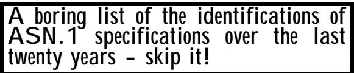
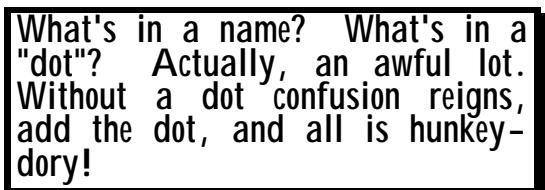
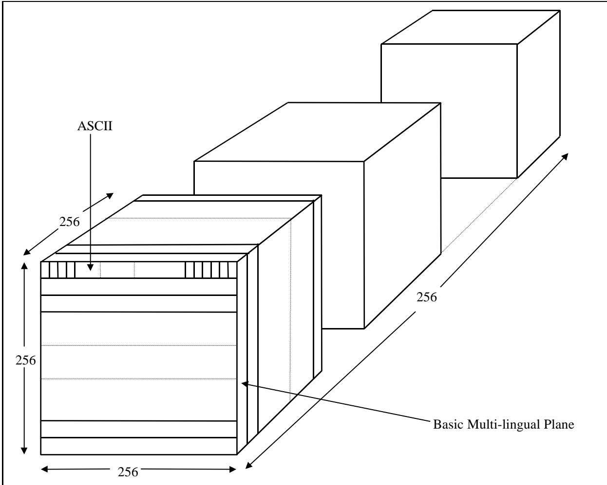

# Chapter 1 The development of ASN.1 
第 1 章 ASN.1 的发展

(Or: The ramblings of an old man!) （或者：一个老人的絮絮叨叨！）

## Summary: 总结：

This chapter is somewhat different in style from the rest of the book. (This summary is not a list of bullets, for a start!) Whilst it does contain some facts, it is not so much a formal record of the stages and dates in the development of ASN.1 (Olivier Dubuisson's book is better for that – see the link via Appendix 5) as my own personal recollections of the various events that occurred along the way. 这一章的风格与其他章节有所不同。（这个总结并不是简单的要点列表！）虽然其中包含了一些事实，但它并不像奥利维尔·杜布伊松的书中那样，严格记录着 ASN.1 发展的各个阶段和日期——对于这方面内容，建议参考附录 5 中的链接。这一章更多的是我对过程中各种事件的个人回忆。

Unusually for an academic text, in this chapter I blatantly use the "I" personal pronoun in several sections. It seemed appropriate. 与学术文本通常使用的第三人称单数形式不同，在这一章中，我在多个段落中直接使用了“我”这个代词。这似乎是个合适的选择。

I was involved in ASN.1 almost from its earliest days (I think that only Jim White – I talk about Jim in the first clause of this chapter - can claim to have seen it through from its start, but he "retired" from Standards work in the late-1980s) through to the present day. I have been active in a number of areas of Standardization within ISO, but ASN.1 has probably taken up the largest part of my time because of its time-span (at the time of writing this text) of close on 20 years. 我参与 ASN.1 项目的时间几乎从它成立之初就开始了（不过，我觉得只有 Jim White——他在本章的第一段中提到了他——能够声称亲眼见证了 ASN.1 项目的成长过程。不过，Jim 在 1980 年代末从标准制定工作中退休了）。在 ISO 组织的多个标准化领域，我一直都很活跃，但 ASN.1 项目无疑占了我大量时间的重点。因为从撰写本文到现在，ASN.1 项目已经接近 20 年了。

There were many other people who gave a great deal of their time to the development of ASN.1, and if you list of some of them, you are in very great danger of being unfair to (and offending) those who just drop off the end of the list, but who nevertheless made important contributions to the work. There is no easy criterion on who to mention, and there are some of my past fellowworkers whose names I can no longer spell with accuracy, and have lost the attendance records! 还有许多其他人也投入了大量时间来推动 ASN1 项目的开发。如果你列出他们中的一些人的名字，那么就有可能对那些虽然排在名单末尾，但实际上对这项工作做出了重要贡献的人不公平。不过，要确定该提到谁并没有简单的标准。有些人的名字我已经记不清了，而且连他们的出勤记录也丢失了！

And, of course, there are the current participants in the ASN.1 work that seem larger than life simply because they are the current drivers. But I am ignoring most of them! I hope nobody takes offence at being left out. 当然，还有那些参与 ASN 工作的当前参与者们。他们看起来就像真实存在的人物一样重要，因为他们正是当前工作的推动者。不过，我其实并没有关注他们中的大多数人！希望没有人会因为被排除在外而感到不满吧。

The structure of this chapter is not a simple time-line. Rather, certain themes have been selected for the major sub-headings, but within those sub-headings the material is largely presented on a time-line basis. I hope that this will ensure rather more continuity in the text and easier reading than a pure time-line treatment, but the reader is advised that the major sub-headings are largely self-contained, and can be read (or skipped, or omitted) in a more or less random order depending on your interests. 这一章的结构并非简单的时间线排列。相反，我们选择了一些主题作为主要的子标题，而在这些子标题内部，内容基本上是按照时间顺序展开的。希望这样的安排能够确保文本的连贯性，并使其比单纯的时间线排列方式更易于阅读。不过，需要提醒读者的是，这些主要的子标题本身都是相对独立的，因此可以根据兴趣以任意顺序来阅读、跳过或忽略它们。

One major part of this chapter contains the history of the development of character encodings, that was promised in Section II Chapter 2. 这一章的一个重要部分讲述了字符编码发展的历史，这一内容曾在第二章第二节中有所提及。

## 1 People 1 个人

Jim White played an active part (perhaps a leading part - I am not sure) in the development of the Xerox Courier specification, on which ASN.1 was eventually based. 吉姆·怀特在 Xerox Courier 规范的开发过程中发挥了重要作用（或许还是主导者——我不确定）。而 ASN.1 规范正是基于 Xerox Courier 规范发展而来的。

## Let's get this one out of the way first! 我们先把这件事解决掉吧！

Courier was part of the "XNS" protocol stack. It represented, I think, the first recognition in protocol architecture of the value of providing a notation for the definition of protocol messages that was supported by well-defined encoding rules and tools within high-level language systems to enable users (not just computer vendors) to define their own protocols and to have an easy implementation path for those protocols. Courier 是“XNS”协议栈的一部分。我认为，这是协议架构中首次认识到提供一种用于定义协议消息的表示法的价值——这种表示法需要由定义明确的编码规则来支持，并且能够在高级语言系统中实现。这样一来，用户（而不仅仅是计算机供应商）就可以自行定义自己的协议，并且能够轻松实现这些协议。

Jim (as Rapporteur in CCITT responsible for developing notational support for the X.400 work) was largely responsible for bringing the Courier principles into international standardization and in due course for the production of X.409. 吉姆作为 CCITT 的报告员，负责为 X.400 标准开发相关的符号支持系统。他在这方面做出了重大贡献，使得 Courier 协议的原则得以纳入国际标准化体系。最终，X.409 标准也由此诞生了。

Doug Steedman was also very active within both CCITT and ISO in these early days, and was (I think) the first person to author a full-length tutorial text on ASN.1. This is still read today, but unfortunately was never updated to cover the work beyond 1990, as Doug also "retired" from Standards work in the late 1980s. 道格·斯蒂德曼在早期的 CCITT 和 ISO 组织中也非常活跃。他被认为是第一个编写关于 ASN.1 的完整教程的人。这部教程至今仍然被阅读，不过遗憾的是，由于道格在 1980 年代末从标准制定工作中退休，因此该教程并未再更新，以涵盖 1990 年之后的发展情况。

I was ISO Editor for the early ISO texts (and after X.409, CCITT texts were copies of the ISO texts). Bancroft Scott came onto the seen in the late 1980s, when (due to other "retirements"), I became Rapporteur for the ASN.1 work in ISO, and Bancroft, having volunteered to be Editor for one part of ASN.1, found himself Editor for all the different parts (now six parts in ISO and six corresponding ITU-T Recommendations), a role that he continues to occupy at the date of publication of this text (1999). 我曾是早期 ISO 标准的编辑人员（在 X.409 标准之后，CCITT 的标准实际上都是 ISO 标准的副本）。Bancroft Scott 在 20 世纪 80 年代末加入这个团队，那时由于其他人退休，我成为了 ISO 标准中 ASN.1 工作的负责人。Bancroft 自愿担任 ASN.1 中某一部分的编辑工作，之后他成为了所有相关部分的编辑——在 ISO 标准中共有六部分，而在 ITU-T 标准中也有六部分相应的建议。直到本文出版时（1999 年），他仍然担任这一职务。

In more recent years, Olivier Dubuisson has played a very active role in the development of ASN.1, and is the author of the second/third/fourth major book on ASN.1. (He can claim prior publication to this text with a French version of his book - making his the second text, but at the time of typing this I hope his English version will be later than this publication, making him also the fourth - but he could make third as well! Friendly rivalry!) 在近年来，奥利维尔·杜布伊松在 ASN.1 标准的开发过程中发挥了非常重要的作用。他也是关于 ASN.1 的第二、第三或第四本重要著作的作者。（他可以声称自己的这本书有法语版本，因此这本著作应该是他的第二本著作——不过在本文撰写时，希望他的英文版本能比这本出版物更早出版，这样他就可以成为第四位作者了！不过，他也可以成为第三位作者哦！真是充满友情的竞争啊！）

There are many, many, others that I could and perhaps should list, particularly colleagues in BSI that have provided much support for ASN.1 over the years, but then I should also mention colleagues operating within AFNOR and from Sweden, and colleagues in the USA that produced course material for ASN.1 that is still used throughout the world today, and ... 还有很多很多其他的人我可以而且或许应该列出他们的名字。特别是那些在 BSI 工作的同事，他们在多年来为 ASN.1 项目提供了大量支持。此外，我还想提到那些在 AFNOR 工作、来自瑞典的同事，以及在美国的同事们——他们制作的 ASN.1 相关课程资料至今仍被全球广泛使用。

Stop! Enough of this clause! 停止！已经够了，不再需要这个条款了！

## 2 Going round in circles? 2 在循环中兜圈吗？

There are so many areas of notational and encoding support for computer communications where understanding has emerged only slowly. (Support for "holes", described earlier, is one of these, as are mechanisms to ensure interworking between implementations of "version 1" and "version 2" of protocol specifications). Sometimes developments are clear steps forward (as was the case when ASN.1 was introduced in the early 1980s), sometimes we make backward steps in some areas to make progress in others. 在计算机通信的表示和编码方面，有很多领域的发展进展十分缓慢。例如，对“空洞”这种表示方式的支持，以及确保“版本 1”和“版本 2”协议规范之间相互兼容的机制，都是需要逐步完善的领域。有时候，发展会呈现出明显的进步（比如，在 20 世纪 80 年代初引入 ASN.1 标准时的情况），而有时候，我们则需要在某些领域做出退步，才能在其他领域取得进展。

We see through a glass darkly. What is the "right" notational support for people trying to define messages for computer communication? ASN.1 has a lot to offer, and has recognised many of the problems (and provided some good solutions) but the world has a way to go yet. 我们仿佛透过玻璃看透了黑暗。对于那些试图为计算机通信定义消息的人来说，究竟应该采用哪种“正确的”表示方式呢？ASN.1 提供了很多解决方案，并且已经识别了许多问题（并提出了一些不错的解决方案），不过这个世界还有很长的路要走。

When ASN.1 was born in the early 1980s, Open System's Interconnection (OSI) Standards were "the best thing since sliced bread", and meetings to develop these Standards within ISO and CCITT often involved several hundred people. But in all the ISO groups defining OSI Standards for applications, there was at that time a doubt, a debate, about what notation to use to clearly specify the messages (including their semantics, and their bit-patterns) to be used to support the application. Every group was doing its own thing, with different approaches and different notations. 在 20 世纪 80 年代初，ASN.1 这一标准诞生时，开放系统互连标准被视作“自切片面包以来最优秀的解决方案”。在 ISO 和 CCITT 组织的各种标准化会议上，经常会有数百人参与这些标准的制定工作。不过，在那些负责定义应用层 OSI 标准的各个小组中，人们对于应该使用哪种表示方式来清晰指定消息的内容（包括它们的语义和位模式）存在争议。每个小组都采用自己的方法，使用不同的表示方式。

Use of a BNF (Bacchus-Naur Form) style of specification was common in most early OSI drafts, often with an encoding based on strings of characters (much as many Internet protocols are today). 在早期的 OSI 协议中，广泛使用 BNF（Bacchus-Naur Form）风格的规范格式。这种规范通常基于字符字符串进行编码（就像许多现代互联网协议一样）。

When the first ASN.1 text (and it was not called ASN.1 in those days - that is another story - see below) was sent as a liaison from CCITT to ISO, it was almost immediately welcomed by every single application layer standardization group in ISO as: 当第一个 ASN.1 文本（在那个时候它并不被称为 ASN.1——这是另一个故事了——详见下文）作为通信内容从 CCITT 发送给 ISO 时，它几乎立刻就受到了 ISO 中每一个应用层标准化组织的欢迎。

• Great to have a common and standard notation for all to use in specifying protocols. • 拥有一种通用的标准符号系统真是太好了，这样大家都能使用同一种方式来指定协议。

• Great to get away from verbose text-based exchanges. • 能够远离那些冗长且基于文本的交流方式，真是太好了。

(Note the latter point. Despite later strong criticism of the verbosity of BER, and the eventual emergence of PER, both are far less verbose than text-based encodings.) （注意后一点。尽管后来有人对 BER 的冗长性提出了强烈批评，并且后来出现了 PER 这种替代方案，但 PER 的冗长程度还是远远低于基于文本的编码方式。）

ASN.1 became the notation of choice (and BER the encoding) for all the application layer OSI Standards (and for the Presentation Layer as well). ASN.1 已成为所有 OSI 层协议的首选表示方式（BER 则被用作编码方式），同样，在表示层中也如此。

But it was in the mid-1980s when ASN.1 started to become widely used outside of the OSI stack. There was even some take-up (usually in a cut-down - some would say bastardised! - form) within the Internet community, but the real expansion of ASN.1 was amongst the telecommunications standards specifiers. 不过，直到 20 世纪 80 年代中期，ASN.1 才开始在 OSI 模型之外得到广泛应用。虽然它在互联网社区中也存在一些应用实例（通常都是经过简化版的形式——可以说是一种修改过的版本），但 ASN.1 真正的大规模应用还是出现在电信标准规范领域。

It is the case today that a great many telecommunications standards (for mobile phones, for intelligent networks, for signalling systems, for control of electric power distribution, for air traffic control) use ASN.1. (See the next chapter.) 目前，许多电信标准（包括移动电话、智能网络、信号系统、电力分配控制以及空中交通管制等领域的标准）都采用了 ASN.1 标准。（详见下一章。）

But today we still see a battle between those who prefer text-based protocols and the supporters of ASN.1. The emergence of XER (Extended Mark-up Language - XML - Encoding Rules) for ASN.1 has in some ways married the two camps. XER is based on ASN.1 notation for defining types, but is totally character-based (and verbose!) for the transfer of values of those types. However, you will hear people today (with some justification) saying: 不过，如今我们仍然可以看到那些偏好文本协议的人与支持 ASN1 的人之间的争论。XER（扩展标记语言——XML 编码规则）的出现在一定程度上弥合了这两派之间的分歧。XER 基于 ASN1 的语法定义类型，但在处理这些类型的值时却完全采用字符编码方式（而且非常冗长）。不过，现在人们也会说一些话——虽然有些理由可以支持这种说法：

HTML (with Netscape and Microsoft) made provision for write-it-once, read-it-anywhere Web pages. HTML（结合 Netscape 和 Microsoft 的技术）提供了可以一次性编写、任意位置阅读的网页功能。

• JAVA made provision for write-it-once, run-it-anywhere programs. • JAVA 语言提供了能够编写一次代码、在任意地方运行的程序的支持。

• XML makes provision for write-it-once, process-it-anywhere data. • XML 提供了可一次性编写、任意位置处理的数据支持。

And, of course, there is still CORBA (with its IDL notation and IOP protocol as an encoding) as a communications-specification-language contender! 当然，还有 CORBA 作为一种通信规范语言候选方案存在！它采用 IDL 表示法和 IOP 协议作为编码标准。

And we still have a lot of Internet Engineering Task Force (IETF) specifications choosing to use BNF and character-based exchanges as the preferred definition mechanism for messages. 目前，仍有许多互联网工程任务组（IETF）的规范选择将 BNF 和基于字符的交换方式作为消息传输的首选机制。

It may be some time yet before the world homes-in-on, understands, or recognises the "right" way to define and to encode computer communications (and that may or may not be ASN.1 in the form we know it today). We have progressed a lot (in terms of understanding the issues and problems to be solved) from the early 1980s, but we have progressed rather less far in political (lower-case "p") agreements, with a still (alarmingly large) number of contenders for notation to be used in defining protocols. And still people continue to suggest more! (I guess it is no worse than the programming language scene.) 或许还需要一段时间，世界才能确定、理解或认可“正确”的方式来定义和编码计算机通信（也许这种方式就是我们现在所熟知的 ASN.1 标准）。从 20 世纪 80 年代初到现在，我们在理解相关问题和需要解决的技术难题方面已经取得了很大的进展。然而，在关于协议符号选择的政治性协议中，我们取得的进展却相对较少。目前，仍然有大量的竞争者试图主导协议的符号选择。而且，人们不断提出更多新的建议！（我想这种情况并不比编程语言领域的状况更糟糕吧。）

So ... I look forward to the next decade with interest! What notation will we be using in 2020 to specify protocol standards? I regret that I may not be around to find out! Some readers will! 所以……我非常期待下一个十年的到来！2020 年我们会使用什么符号来表示协议标准呢？可惜我可能活不到那个时候了……不过，肯定会有其他人能发现答案的！

## 3 Who produces Standards? 3. 谁负责制定这些标准？

There have over the years and into today been five main sets of actors in the production of Standards related to computer communication, and in the adoption of various forms of notation to support those Standards. 多年来，在计算机通信相关标准的制定过程中，以及在各种符号的采用上，一直存在五组主要的参与者。

Who are the five? 那五个人都是谁啊？

I would suggest: 我建议：

There has always been a difficulty over de jure and de facto standards for computer communication around the world. National Standards Institutes often think/hope they wield the power. But the real power over deciding how the world's computers communicate is largely not in their hands, but has shifted over time between many actors. 在全球范围内，关于计算机通信的法律标准与事实标准一直存在争议。各国的标准机构往往认为自己拥有决定这些标准的权力，但实际上，决定全球计算机如何通信的真正权力并不掌握在它们手中，而是随着时间推移，逐渐转移到了许多其他参与者手中。

• Main-frame computer vendors in the 1970s, but largely now unimportant. • 在 20 世纪 70 年代，这些公司是大型机计算机的供应商，但现在它们已经不再重要了。

• CCITT (renamed ITU-T at the start of the 1990s) in the 1980s and 1990s, and still the dominant force in the specification of telecommunications standards today. • 在 20 世纪 80 年代和 90 年代，CCITT（在 20 世纪 90 年代初更名为 ITU-T）一直主导着电信标准的制定工作，至今仍是在这一领域中最具有影响力的组织。

• ISO, working largely in collaboration with CCITT/ITU-T, but with its major influence limited to the OSI developments of the 1980s, and perhaps not being a dominant force today except in isolated areas. • ISO 主要在与 CCITT/ITU-T 的合作下进行工作，但其主要影响范围仅限于 20 世纪 80 年代的 OSI 标准制定工作。如今，ISO 虽然在某些领域仍具有影响力，但总体上已不再是一个主导性的组织。

The IETF, its task forces and working groups, now responsible for the development of Internet standards, which have (for many applications) become the de facto standards for computer communication between telecommunications users (whilst ITU-T remains dominant for standardising the protocols that make telecommunications possible). IETF 及其各个工作组现在负责制定互联网标准。这些标准已经成为了许多应用中计算机通信的默认标准（而 ITU-T 则仍然在标准化使电信通信成为可能的协议方面占据主导地位）。

• And with increasing influence today, various consortia of manufacturers and other groups, including the SET consortium and the World-Wide Web Consortium (W3C), and the CORBA grouping. • 如今，各种制造商联盟以及其他组织的影响力日益增强，其中包括 SET 联盟、全球网络联盟（W3C）以及 CORBA 组织等。

The importance of computer vendors in protocol definition had largely declined before ASN.1 entered the scene, with the notable exception of XEROX which (as stated earlier) gave birth to the original ASN.1 concepts. 在 ASN.1 出现之前，计算机供应商在协议定义方面的重要性已经大大降低了。不过，XEROX 是一个显著的例外——正如之前提到的，XEROX 孕育了 ASN.1 的最初概念。

ASN.1 as an international specification started life within CCITT as X.409, entitled "Presentation Transfer Syntax and Notation". (Note that the "transfer syntax" was placed first in the - English - title, not the "notation"! Today we would probably see the notation as the more important part of ASN.1). The work leading to ASN.1 was originally intended only to provide notational support for the definition of the X.400-series e-mail protocols. However, it very rapidly moved into ISO, and during the early 1980s, although the work was collaborative, it was largely ISO National Bodies (they were then called "Member Bodies") through which most of the input was provided. ASN.1 作为一种国际规范，最初由 CCITT 在 X.409 标准下提出，该标准名为“Presentation Transfer Syntax and Notation”。需要注意的是，在英文标题中，“Transfer Syntax”被排在了首位，而不是“Notation”！如今，我们可能会认为“Notation”是 ASN.1 中更为重要的部分。最初制定 ASN.1 的工作只是为了为 X.400 系列电子邮件协议的定义提供相应的符号支持。然而，这项工作在很短的时间内就进入了 ISO 的管辖范围。在 20 世纪 80 年代初，尽管这项工作是由多个机构共同完成的，但实际上大部分内容都是由 ISO 各国家机构提供的。

In the late 1990s the pendulum swung back (partly due to the decline of OSI, and partly due to reorganizations within ISO), with what had by then become ITU-T making most of the running in progressing new work on ASN.1. 在 20 世纪 90 年代末，这一趋势又发生了逆转（部分原因是 OSI 的衰落，部分原因是 ISO 内部的重组）。此时，ITU-T 继续在 ASN.1 领域推进新的研究工作。

Within IETF, take-up of ASN.1 was always very patchy. This was probably at least in part due to the fact that most of the movers in IETF wanted a specification language that had support from publicly available (for-free) tools. BNF-based text-encodings satisfied this requirement. ASN.1 did not, and does not to this day (1999). So most use of ASN.1 in the IETF world was (and is) using a cut-down version of ASN.1 that was (is) easily capable of being encoded without the use of any tools. 在 IETF 内部，ASN.1 的采用情况一直很不平衡。这至少部分是因为 IETF 中的许多活跃人士希望有一种能够得到公开可用工具支持的规范语言。基于 BNF 的文本编码方式满足了这一需求。而 ASN.1 则没有做到这一点，直到今天（1999 年）仍然如此。因此，在 IETF 领域，大多数对 ASN.1 的使用都是采用一种简化版的 ASN.1 进行编码的，而这种简化版 ASN.1 完全可以通过无需任何工具就能被编码出来。

By contrast, ITU-T telecommunications specifications use the full power of ASN.1, and the telecomms and switch vendors implementing those specifications make full use of available tool products for easy, rapid, and (largely) bug-free implementation of protocols that are highly efficient in terms of band-width requirements. 相比之下，ITU-T 的电信规范充分利用了 ASN.1 框架的优势。那些实施这些规范的电信设备和交换机供应商，会充分利用现有的工具产品，从而实现协议的快速、高效的实施——而且几乎不会遇到任何问题。

## 4 The numbers game 4. 数字游戏

The ASN.1 specifications have gone through a variety of designations. ASN.1 规范经历了多种名称的变迁。



The first published specification was X.409 (1984). X.409 pre-dated the use of the term "Abstract Syntax Notation One (ASN.1)", and was part of the X.400 series. It was seen, quite simply, as a notation (and encoding rules) to aid the specification of protocols in the X.400 (OSI e-mail) suite. 第一个公开的规范是 X.409（1984 年发布）。X.409 的出现早于“抽象语法符号表示法之一（ASN.1）”这一术语的使用，它是 X.400 系列的一部分。简单来说，X.409 是一种用于辅助 X.400 协议（如 OSI 电子邮件协议）规范描述的符号和编码规则。

Later it was completely re-written (with no technical changes - see later!) and published (with some additions) by ISO as ISO 8824 and ISO 8825 in 1986, and the same text (again with some additions) was then published by CCITT as X.208 and X.209 in 1988. There was a later version of this text (with minor corrections) published jointly by ISO and IEC in 1990 as ISO/IEC 8824 and ISO/IEC 8825. This became known as the infamous "1990 version of ASN.1". 后来，该标准被完全重新编写（实际上没有进行任何技术上的修改——详见后文！），并由 ISO 在 1986 年以 ISO 8824 和 ISO 8825 的标准发布。同年，同样的内容又被 CCITT 作为 X.208 和 X.209 标准发布。此后，ISO 和 IEC 在 1990 年联合发布了修订了部分内容的版本，即 ISO/IEC 8824 和 ISO/IEC 8825。这一版本被称为“著名的 1990 版 ASN.1 标准”。

The "1994 version of ASN.1" (with very major extensions to the 1990 version) was jointly published by ISO/IEC and CCITT as a whole raft of new documents, with identical text shown in parallel columns below: “1994 版的 ASN.1”版本（在 1990 版的基础上进行了重大扩展）是由 ISO/IEC 和 CCITT 联合发布的一系列新文件。这些文件的文本内容在下面以平行方式呈现：

ITU-T X.680 ISO/IEC 8824-1 ITU-T X.681 ISO/IEC 8824-2 ITU-T X.682 ISO/IEC 8824-3 ITU-T X.683 ISO/IEC 8824-4 ITU-T X.690 ISO/IEC 8825-1 ITU-T X.691 ISO/IEC 8825-2 ITU-T X.680 ISO/IEC 8824-1；ITU-T X.681 ISO/IEC 8824-2；ITU-T X.682 ISO/IEC 8824-3；ITU-T X.683 ISO/IEC 8824-4；ITU-T X.690 ISO/IEC 8825-1；ITU-T X.691 ISO/IEC 8825-2

Still later, there was a joint ISO/IEC and ITU-T "1997 version" (with only relatively minor changes and additions to the 1994 version). However, whilst the "final" text was approved in 1997, neither ITU-T nor ISO have yet produced a published copy that people can purchase (current date early 1999)! But watch this space, it is imminent! (Later correctoin – you can now buy it from ITU-T!) 后来，又出现了一种由 ISO/IEC 和 ITU-T 联合制定的“1997 版本”标准（与 1994 年的版本相比，只有一些微小的修改和补充）。不过，虽然该“最终版”标准在 1997 年得到了批准，但无论是 ITU-T 还是 ISO 都尚未发布可供人们购买的正式版本（当前版本为 1999 年初发布的）。不过请继续关注进展情况，很快就能买到该标准了！（稍后补充：现在可以从 ITU-T 那里购买到该标准了！）

Readers should note that in 1994 (and in 1997) X.680 was roughly the old X.208 with some extensions, mainly in the character set area. X.681 was the extensions related to the Information Object concept. X.682 was the table and relational and user-defined constraints, and X.683 was parameterization. X.690 was the old X.209 with CER and DER added, and X.691 was the PER specification. 读者需要注意，在 1994 年以及 1997 年时，X.680 基本上就是旧的 X.208 标准，只是增加了一些扩展功能，主要集中在字符集方面。X.681 则包含了与信息对象概念相关的扩展功能。X.682 涉及表格处理、关系型数据以及用户自定义约束条件。而 X.683 则涉及到参数化功能。X.690 则是旧的 X.209 标准，增加了 CER 和 DER 功能。最后，X.691 则包含了 PER 规范的相关内容。

Phew! I hate numbers! 'Nuff said. 呼！我讨厌数字！说多了反而让人厌烦。

## 5 The early years - X.409 and all that 5. 早期岁月——X.409 以及相关的一切

## 5.1 Drafts are exchanged and the name ASN.1 is assigned 5.1 双方交换了草稿文件，并指定了 ASN.1 作为标识符。

The first drafts of X.409 were produced in CCITT. In those days both ISO and CCITT had a "7-layer model" for OSI, and they were totally different texts (technically very similar, but largely developed independently). The era of strong collaboration between the two groups was yet to come, and most communication was by written "liaison statements", usually accompanied by a draft of some specification. X.409 标准的初稿是在国际电信联盟 ITU 的会议上制定的。当时，ISO 和 ITU 都采用了类似的“七层模型”来描述 OSI 协议，不过它们所依据的文本是完全不同的——从技术层面来看，两者非常相似，但主要是在不同的时间、由不同的团队独立开发的。直到后来，这两个组织才开始加强合作，而当时的通信方式大多还是通过书面“联络声明”来进行，通常会附上一些规范草案作为支持。



This is how (during 1982) X.409 first reached ISO TC97 SC16 (Technical Committee 97 - responsible for the whole of computer-related standards, Sub-Committee 16 - responsible for the OSI model and for all work on OSI standards above the Network Layer). At first, it was unclear how these X.409 concepts fitted into the OSI model, and an ad hoc group (chaired, I think, by Lloyd Hollis) was set up to consider the draft. It rapidly became apparent that this work should be slotted into the Presentation Layer of OSI, and a liaison statement was despatched welcoming the work. 这就是 X.409 标准在 1982 年时首次被提交给 ISO TC97 SC16 技术委员会的过程。TC97 是负责所有与计算机相关的标准的专业委员会，而 SC16 则负责 OSI 模型以及网络层以上的所有 OSI 标准相关工作。起初，人们并不清楚 X.409 的概念如何融入 OSI 模型中。于是，一个临时小组被成立来审议这份草案。很快便明确，这项工作应该被纳入 OSI 模型的表示层。随后，一份合作声明被发送出来，以表示对这项工作的欢迎。

This X.409 draft came into an ISO vacuum - or perhaps I mean a primeval plasma! There was anarchy, with all the various application layer standards wondering what notational mechanisms to use to define their protocols, and all having different approaches. The new notation was extremely rapidly accepted by every single Application Layer standards group as the means to define their protocols. 这份 X.409 草案在 ISO 的空白环境中诞生了——或者可以说，它诞生于原始的“等离子体”状态之中。当时处于一片混乱的状态，各个应用层的标准们都在思考应该使用哪种表示机制来定义他们的协议，而且各种标准之间存在着不同的方法。不过，这种新的表示方式很快就被每一个应用层标准组织所接受，成为了定义他们协议的标准手段。

It was at this time that a name was considered for the notation, and the ISO group suggested Abstract Syntax Notation One, or "ASN1". The CCITT group replied "OK, but never talk to us about ASN2". ASN2 was never proposed, although there are those that have argued that ASN.1 (1994) should have been named ASN.2 (see later text). 就在那时，有人提议为这种标记方式起一个名字。ISO 小组建议将其命名为抽象语法标记语言一（Abstract Syntax Notation One），简称“ASN1”。而 CCITT 小组则回应说：“好吧，但请不要再跟我們提起 ASN2 这个名称。”实际上，ASN2 从未被正式提出过。不过，有些人认为，ASN.1（1994 年版本）应该被命名为 ASN.2（详见后文）。

Notice that in the last paragraph there was no dot after "ASN". This was not a typo! The original proposed name was indeed "ASN1". However, within six months it became apparent that people were frequently mistyping it as "ANS1", and/or misreading it as "ANSI" - the American National Standards Institute. Considerable confusion was being caused! I remember the day when the head of the USA delegation (also Chairman of SC16!) came to the ASN.1 group and said "Look, I know it isn't "ANSI", but it is so close that it is causing problems, can't you change the name?". Uproar! Explosion! But when the dust settled, the "dot" had been inserted and we had "ASN.1". Thereafter no-one ever mistyped it or confused it with ANSI! 请注意，在最后一段中，“ASN”后面并没有点号。这并非拼写错误！最初提议的命名确实是“ASN1”。然而，在六个月的时间里，人们经常将其误拼成“ANS1”，或者误将其理解为“ANSI”——即美国国家标准协会。这导致了相当大的混乱！我记得有一天下午，美国代表团的负责人（同时也是 SC16 会议的主席）来到 ASN.1 小组，说道：“听着，我知道它并不等于 ANSI，但这个名字太接近了，会造成问题，你们能改改这个名字吗？”顿时引起了轩然大波！不过，等一切平静下来后，人们发现“点号”被正确地加在了后面，于是“ASN.1”这个名称就定型了。从那以后，就再也没有人把它误拼或误认为是 ANSI 了！

The "dot" is not without precedent - all CCITT Recommendations are written with a dot - X.400, X.25, V.24, so ASN.1 was readily accepted. 这种用点号连接的名称并不陌生——所有国际电信联盟的建议书都是这样命名的，比如 X.400、X.25、V.24 等。因此，ASN.1 这种命名方式也很容易被接受。

It was at this time that the term "BER" (Basic Encoding Rules) was coined, but in this case there was recognition in both ISO and CCITT that other and perhaps better encoding rules could be produced, but it took ten years before PER (Packed Encoding Rules) eventually emerged. 就在那时，术语“BER”（基本编码规则）被提出。不过，当时无论是 ISO 还是 CCITT 都认识到，可以制定出更优秀的编码规则。但直到十年后，PER（打包编码规则）才最终被提出来。

## 5.2 Splitting BER from the notation 5.2 从符号表示法中解析误码率

There were some difficult moments in these early years. It was ISO and not CCITT that had a very strong view on the importance of separating abstract specification (Application Layer) from encoding issues (the first published X.400 specifications were a monolithic protocol directly on the Session Layer, with no Presentation Layer). The X.409 draft (and the eventually published X.409 (1984)) contained, interleaved paragraph by paragraph, a description of a piece of ASN.1 notation and the specification of the corresponding BER encoding. 在那些早期阶段，确实遇到了一些困难。当时是 ISO 而不是 CCITT 在强调将抽象规范（应用层）与编码问题分离的重要性。最初的 X.400 规范文档中，所有内容都是混杂在一起的；比如 X.409 草案（最终于 1984 年正式发布）中，每一段都详细描述了某种 ASN.1 表示法，并规定了相应的 BER 编码方式。

ISO was serious about the Presentation Layer. Encoding details should be kept clearly separate (in separate documents) from application semantics. A great idea, but CCITT were not quite as evangelical about it. But without ASN.1 the concept would probably never have reached reality. ISO 在表示层方面非常重视细节。编码相关的内容应该与应用程序的语义分开处理，分别放在不同的文档中。这是一个很好的想法，不过 CCITT 在这方面并没有那么积极。不过，如果没有 ASN.1 标准，这个概念可能永远无法付诸实践。

The first thing that ISO decided to do was to rip these pieces apart, and completely re-write them (in theory with no technical change) as two separate documents, one describing the notation (this eventually became ISO 8824) and one describing BER (this eventually became ISO 8825). ISO 首先采取的措施是将这些文档拆分开来，然后分别重新编写成两份独立的文件（理论上不进行任何技术上的修改）。其中一份文件用于描述符号规范（该规范最终被命名为 ISO 8824），另一份文件则用于描述 BER 标准（该标准最终被命名为 ISO 8825）。

As closer and closer collaboration occurred between ISO and CCITT in the following years (and on the ASN.1 work in particular), the question of course arose - would CCITT adopt the ISO text for ASN.1 and drop X.409? After some agonising, it did, and in 1988 X.409 was withdrawn and there were two new CCITT recommendations in the X.200 series, X.208 and X.209. Recommendation X.200 itself was (and is) the CCITT/ITU-T publication of the OSI Reference Model - eventually aligned with that of ISO but leaning technically far more towards the original CCITT draft than to the OSI one - but that is a separate story! (See my book "Understanding OSI", available on the Web.) Putting the ASN.1 specifications into the X.200 series was a recognition that ASN.1 had become a general tool for the whole of OSI, having outgrown X.400. I like to think that its move to the X.680 and the X.690 range in 1994 represented its outgrowing of OSI, but I think it was more due to the fact that it now needed six Recommendations, and there was no suitable space left in the X.200 range! (ISO does not have similar problems - a single part Standard like ISO 8824 can grow into ISO 8824 Part 1 (ISO 8824-1), Part 2, etc, without changing its number.) 在接下来的几年里，ISO 与 CCITT 之间的合作越来越紧密（尤其是在 ASN.1 领域）。自然而然地，一个问题出现了：CCITT 是否会采用 ISO 的规范来制定 ASN.1 标准，并放弃 X.409 标准？经过一番讨论后，他们决定采用 ISO 的规范，于是 X.409 标准被撤销，取而代之的是 X.200 系列中的两个新标准：X.208 和 X.209。X.200 标准本身实际上是 CCITT/ITU-T 对 OSI 参考模型的规范——最终与 ISO 的规范保持一致，但在技术层面上，X.200 更接近于原始的 CCITT 草案，而非 OSI 的规范。不过，这又是另一个故事了！（可以参考我的书籍《理解 OSI》，该书可以在网上找到。）将 ASN.1 规范纳入 X.200 系列，意味着 ASN.1 已经成为了涵盖整个 OSI 模型的通用工具，因为它已经不再适合仅用于 X.400 标准了。我喜欢认为，ASN.1 之所以被纳入 X.680 和 X.200 系列，正是因为它已经成为了整个 OSI 模型的核心规范。在 1994 年，690 系列标准代表了其超越 OSI 标准的发展态势。不过我认为，这主要是因为现在需要包含六条建议内容，而 X.200 系列标准中已经没有足够的空间来容纳这些内容了。（ISO 标准并没有类似的问题——比如 ISO 8824 这样的单一部分标准，可以逐渐发展成 ISO 8824-1 第 1 部分、第 2 部分等，而无需改变其编号。）

X.409 was written in a fairly informal style, but when it was re-written within the ISO community, the rather stilted "standardese" language required for ISO Standards was used. For example, "must" must never be used - use "shall" instead (this was due to claimed translation difficulties into French), don't give examples or reasons, just state clearly and exactly what the requirements are - you are writing a specification of what people must do to conform to the Standard, not a piece of descriptive text. X.409 的编写风格相当非正式，但在 ISO 社区内部重新编写时，采用了更为正式的标准化语言。例如，“必须”这个词绝对不能使用，应该使用“应当”来代替。此外，不要提供例子或理由，只需明确准确地说明要求是什么——你是在编写一份关于人们必须做什么才能符合标准的规范说明，而不是一篇描述性文本。

I often advise those who want a gentle introduction to ASN.1 to try to find an old copy of X.409 (1984) and read that - it is written in more informal language, and because the encodings are specified along-side the notation, I believe that it is easier for a beginner to grasp. But I was interested to see that in Olivier's book he claimed that 8824/8825 were more readable and better specifications than X.409! I guess we all have our own views on what makes a good specification! 我经常建议那些想要了解 ASN.1 的人，尝试找到一份旧的 X.409 标准（版本 1984 年）的副本进行阅读。该标准使用的语言更为简洁明了，而且由于编码规范与符号说明一起给出，因此初学者更容易理解。不过，我很惊讶地发现，在奥利维耶的书中，他声称 8824/8825 标准比 X.409 标准更易于理解，且规范更完善！我想，对于什么是好的规范标准，每个人都有自己的看法吧！

## 5.3 When are changes technical changes? 5.3 什么时候会进行技术上的变更呢？

Genuinely, ISO attempted to re-write X.409 without making technical changes, but two crept in. The first was to do with the type "GeneralizedTime". These were in the days when people had human secretaries to do their 实际上，ISO 试图在不进行任何技术修改的情况下重新编写 X.409 标准。不过，有两个修改被悄悄加进了标准中。第一个修改与“广义时间”这一类型有关。在那个时代，人们还依赖人工秘书来处理这些事务……

Correct a spelling, remove an example, trivial things. No problem. Don't you believe it! 纠正一个拼写错误，删除一个例子，处理一些琐碎的问题。没什么大不了的。你相信吧！

typing and not word processors. X.409 had been authored in the USA. The ISO text for 8824/8825 had a UK Editor (mea culpa), and the secretary (another name - Barbara Cheadle!), unknown to the Editor, corrected the spelling to "GeneralisedTime". This went unnoticed through all the formal balloting, but was eventually corrected before 8824 was actually published! Irrespective about arguments over what is "correct" English, the term "GeneralizedTime" had to stand, because this was a formal part of the notation, and any change to its spelling represented a technical change! 使用的是打字方式，而非文字处理软件来编辑文档。X.409 标准是在美国制定的。ISO 关于 8824/8825 标准的文本中，有一位英国编辑参与了编辑工作（这是我的过错），而另一位秘书（名叫芭芭拉·切德勒！）在编辑者不知情的情况下，将拼写改为“GeneralisedTime”。这一修改在所有的正式审议过程中都没有被注意到，但最终在 8824 标准正式发布之前得到了修正！无论哪种英语拼写方式才是正确的，因为“GeneralisedTime”这个术语已经是该标准的一部分了，对其拼写进行任何修改都意味着技术上的变更！

The second change was only noticed in the early 1990s! Far too late to do anything about it! There was a point of detail about the character string type TeletexString that was only indicated in X.409 in an example. The example was lost in 8824, and the point of detail lost with it - I am afraid I have forgotten the precise details of the point of detail! 第二个问题直到 20 世纪 90 年代初才被注意到！现在想要解决已经为时已晚了！在 X.409 规范中，有一个关于字符串类型 TeletexString 的细节说明，但那个例子在 8824 版本中丢失了。因此，那个细节也一并消失了——恐怕我已经记不清那个细节的详细内容了！

## 5.4 The near-demise of ASN.1 - OPERATION and ERROR 5.4 ASN.1 的即将失效——操作与错误

The final incident I want to describe, in this clause about the early days, is one which almost completely de-railed ASN.1. 在关于那段早期经历的部分，我想要描述的最后一个事件，是那个几乎完全破坏了 ASN1 运作的事件。

At that time, CCITT was locked into a fouryear time-frame called a Study Period where at the start of the four years "Questions" 当时，国际电信联盟被限制在一个为期四年的时间范围内，这个时间段被称为“研究期”。在四年期的开始之际，各种“问题”尚未得到解决。

Easy wars are based on misunderstanding or lack of understanding (difficult ones are base on real clashes of self-interest). This was an easy war, but the short time-scales for achieving peace amplified the conflict. 简单的战争是基于误解或缺乏理解而发生的（复杂的战争则是基于实际的利益冲突）。这是一场简单的战争，但由于实现和平所需的时间很短，反而加剧了冲突。

(capital Q!) were formulated. (Each Question generally gave rise to a new Recommendation or to an update of an existing one.) At the end of the Study Period, a complete new set of CCITT Recommendations were published (with a different colour cover in each period). In 1980 the colour was Yellow, Red in 1984, and Blue in 1988. （资本 Q！）这些建议被正式制定出来。每个问题通常都会产生一个新的建议，或者是对现有建议的更新。在研究期结束时，发布了一整套全新的 CCITT 建议书（每个时期的建议书都有不同的颜色封面）。1980 年，封面颜色为黄色；1984 年为红色；1988 年则变为蓝色。

(1988 was the last year this complete re-publication occurred, so if you have a set of the Bluebooks in mint condition, keep them - they will be valuable fifty years from now!) 1988 年是这次完整重新出版的最后一年。所以，如果你拥有一套保存状况良好的《蓝色之书》系列书籍，请好好保存它们——五十年后，这些书籍将会变得非常有价值！

It took time for the administration to prepare these new texts for publication, and in those days CCITT went into a "big sleep" about twelve months before the end of the Study Period, with the new or amended Recommendations finalised, and with only "rubber-stamping" meetings during the following year. It was in mid-1993, with the "big sleep" about to start - we were at five minutes to midnight - when the CCITT ASN.1 group sent their latest draft of X.409 to the ISO group. 行政机构需要一些时间来准备这些新的标准文本以供发布。在那个时期，国际电信联盟在研究期结束前大约十二个月进入了“大休整期”，新的或修改后的建议最终确定下来，而在接下来的这一年里，相关的会议也只进行了很少的次数。大约在 1993 年中期，当“大休整期”即将开始时——当时时间距离午夜还有五分钟——国际电信联盟 ASN.1 小组将他们最新的 X.409 草案提交给了 ISO 小组。

Mostly it was only minor tidies, but a whole new section had been added that "hard-wired" into the ASN.1 syntax the ability to write constructions such as: 大多数情况下，这些只是一些简单的修改而已。不过，新增了一整段内容，这些内容被“硬编码”在了 ASN.1 语法中，使得用户可以编写如下这样的结构：

and 以及

```txt
lookup OPERATION
    ARGUMENTS name Some-type
    RESULT name Result-type
    ERRORS {invalidName, nameNotFound}
::= 1

nameNotFound ERROR ::= 1

invalidName ERROR
    PARAMETER reason BITSTRING
    {nameTooLong(1),
    illegalCharacter(2),
    unspecified(3)}
::= 2 
```

Well ... if the reader has read the earlier parts of this book, and in particular Section II Chapters 6 and 7, that syntax will look rather familiar, and the meaning will be perhaps fairly obvious. But to those in the ISO group faced with a simple liaison statement defining the revised ASN.1 (and with absolutely no understanding or knowledge about even the existence of the ROSE work), there was utter incomprehension. 嗯……如果读者已经阅读了这本书的前面部分，尤其是第二部分的第六章和第七章，那么这些语法结构会显得相当熟悉，其含义也可能相当明显。不过，对于那些身处 ISO 小组的人来说，他们面对的是一条简单的关联语句，用来定义修改后的 ASN.1 标准。而他们对于 ROSE 工作甚至其存在都一无所知。因此，他们对这些内容完全无法理解。

What had this to do with defining datatypes for an abstract syntax (and corresponding encoding rules)? How were ERROR and OPERATION encoded (there was no specification of any encoding in the draft)? What on earth was an "operation" or an "error"? Rip it all out! Had there been more time .... But the ISO group decided that no-way was this stuff going into the ISO Standards that were planned. Agonies within CCITT. Keep it in and risk different Recommendations and Standards for ASN.1? 这与为抽象语法定义数据类型有什么关系呢？而“ERROR”和“OPERATION”又是如何被编码的呢？在草案中并没有对编码方式做任何规定。那么，“operation”和“error”到底指的是什么呢？算了，还是把这一切都抛到一边吧！如果还有更多的时间的话……但是 ISO 小组决定，这些内容绝对不会被纳入原本计划中的 ISO 标准中。CCITT 内部也发生了一些争执。那么，是否应该将相关内容保留下来，以便为 ASN.1 标准制定不同的建议和规则呢？

It was one minute to midnight when the next draft of X.409 reached ISO. The offending OPERATION and ERROR syntax had been removed - deep sigh of relief - but a new Annex had been added defining a "macro notation". This Annex was very, very obscure! But many programming languages had a "macro notation" to support the language. (These usually took the form of some template text with dummy parameters that could be instantiated in various places with actual parameters - what was eventually introduced with the parameterization features of ASN.1). And it was one minute to midnight. And the CCITT group had agreed to withdraw the OPERATION and ERROR syntax, and deserved a favour in return. The ISO group agreed to accept the macro notation Annex. Peace had been achieved and ASN.1 had been saved! 当 X.409 的下一版草案到达 ISO 时，已经是午夜零点刚过的一分钟。那些引起争议的 OPERATION 和 ERROR 语法已经被删除了——真是松了一口气！不过，新的附录中增加了一项关于“宏表示法”的规定。这项附录非常晦涩难懂！不过，许多编程语言都有类似的“宏表示法”来支持他们的语言设计。（通常这种表示法以某种模板文本的形式出现，其中包含可以随实际参数进行替换的虚拟参数——这种机制后来被引入到 ASN.1 的参数化功能中）。现在已经是午夜零点，而 CCITT 委员会也同意撤销 OPERATION 和 ERROR 语法，因此 ISO 委员会也愿意接受这项宏表示法附录。于是，和平达成了，ASN.1 也得救了！

In retrospect, this whole incident was probably a good thing, although it had reverberations into the late-1990s. If OPERATION and ERROR had remained hard-wired, and there had been no macro-notation, it would have been very much harder for ASN.1 to develop the concepts related to Information Objects (and it was quite hard anyway!). More on this subject below. 回顾起来，这一整件事情或许其实是一件好事，尽管它带来的影响一直持续到 20 世纪 90 年代末。如果“OPERATION”和“ERROR”这两个概念是固定不变的，而且没有使用宏注释来表述，那么 ASN.1 就难以开发出与信息对象相关的概念了（而无论如何，开发这些概念本身就已经很困难了！）。关于这个话题，下面会进一步讨论。

## 6 Organization and re-organization! 6. 组织与重组！

When the idea of Open Systems Interconnection was first considered in ISO, it came from the work in TC97 SC6 on HDLC (High Level Data Link Control) from the question "Who is going to define - and how - the formats of what fills the HDLC frames?" At a meeting in Sydney of TC97 it was decided to create a new sub-committee, SC16, to be charged with the task of developing a model for OSI, and at its first meeting about six different proposed models were submitted from each of the major countries, but the 当开放系统互连的概念首次在 ISO 中被提出时，它源自于 TC97 SC6 工作组在 HDLC（高级数据链路控制）领域的工作。当时的问题是：“谁来定义——以及如何定义——填充 HDLC 帧的数据格式？”在悉尼召开的 TC97 会议上，决定成立一个新的小组委员会 SC16，负责开发 OSI 模型的规范。在第一次会议上，来自各个主要国家的代表团分别提出了大约六种不同的模型方案。

Organizational structures matter a bit, but the technical work can often go on despite re-organization above. But sometimes too much turbulence can make it difficult to progress the work formally (and hence to reach publication status). Fortunately, with a joint project between ITU-T/CCITT and ISO/IEC, if you can't progress it in one forum, you can probably progress it in the other! 组织结构固然重要，但即便存在重组情况，技术工作仍然可以继续进行。不过，有时候过度的混乱可能会阻碍工作的正式推进（从而无法完成出版工作）。幸运的是，通过 ITU-T/CCITT 与 ISO/IEC 之间的合作项目，如果你在一个平台上无法推进工作，那么可能在另一个平台上也能顺利推进！

submission that most nearly resembled the eventual shape of OSI was that from the European Computer Manufacturers Association (ECMA). The USA voted against the establishment of a new sub-committee, but by some rather interesting political manoeuvres (again beyond the scope of this text!) became the Secretariat and provided the Chair for SC16. 与 OSI 最终确定的方案最为接近的提案，来自欧洲计算机制造商协会（ECMA）。美国投票反对成立一个新的小组委员会，但通过一些相当有趣的政治手段（同样超出了本文的讨论范围），他们最终成为了该小组的秘书处，并担任了 SC16 会议的主席。

SC16 became one of the largest sub-committees in the whole of ISO, and in its hey-day could only meet by taking over a complete large University campus. ASN.1 became a relatively selfcontained group within the Presentation Layer Rapporteur Group of SC16. SC16 成为了整个 ISO 中规模较大的子委员会之一。在其鼎盛时期，它甚至需要占据整个大型大学校园才能举行会议。而 ASN 则成为了 SC16 报告委员会中一个相对独立的团体。

On the CCITT front, ASN.1 became a part of Study Group VII, and has had a relatively calm (organizationally) life. When CCITT changed its name to ITU-T, it had little organizational impact at the bottom levels, the main change being that SG VII became SG 7! This is the home of ASN.1 to this day (within Working Party 5 of SG 7). 在 CCITT 的框架下，ASN.1 成为了第七研究组的一部分，其发展过程相对平稳。当 CCITT 更名为 ITU-T 时，其在基层组织层面几乎没有产生实质性影响，主要的改变仅仅是第七研究组更名为第七研究组而已！直到今天，ASN.1 仍然属于第七研究组的第五工作组负责处理相关事务。

On the ISO front, there was a top-level re-organization when ISO agreed that standardization of computer matters was a joint responsibility with the International Electro-Technical Commission (IEC), and formed, with the IEC, a new "Joint Technical Committee 1" to replace TC97. (There has never been, and probably never will be, a JTC2). This had zero impact on the ASN.1 work, save that the cover-page of the Standards now included the IEC logo alongside that of ISO, and the formal number became ISO/IEC 8824 instead of ISO 8824. JTC1 inherited exactly the same SC structure and the same officers and members as were originally in TC97. It was at this time that the name of contributors to the ISO work changed from "Member Body" to "National Body", but they were still the same organizations - BSI, ANSI, AFNOR, DIN, JISC, to name just a few. 在 ISO 方面，进行了一次高层级的重组。ISO 决定，计算机相关标准的制定工作应由国际电工委员会（IEC）与 ISO 共同负责。于是，ISO 与 IEC 联合成立了新的“联合技术委员会 1”，以取代原来的 TC97。实际上，从未存在过名为 JTC2 的委员会。这一重组对 ASN.1 的工作几乎没有影响，只是标准的封面现在同时印有 IEC 和 ISO 的徽标，而标准的正式编号也从 ISO 8824 改为 ISO/IEC 8824。JTC1 继承了与 TC97 相同的委员会结构和相同的委员们。此时，参与 ISO 工作的各组织名称从“会员机构”改为“国家机构”，但参与的组织仍然相同，比如 BSI、ANSI、AFNOR、DIN、JISC 等。

A slightly more disruptive reorganization was when SC5 (programming languages and databases) and SC16 (OSI) were re-shaped into a new SC21 and SC22, but the transition was smooth and the ASN.1 work was not really affected. 一次较为彻底的重组发生在 SC5（编程语言和数据库领域）以及 SC16（OSI 标准）被合并为新的 SC21 和 SC22 时。不过这一过渡过程非常顺利，ASN.1 的相关工作也没有受到太大影响。

In the late 1990s, however, the Secretariat of SC21 decided it could no longer resource the subcommittee, and it was split into an SC32 and SC33. ASN.1 was placed in SC33 as a fully-fledged Working Group (it had had the lower-status of a Rapporteur Group within a Working Group for all its previous history), but it never met under this group as there was no National Body prepared to provide the Secretariat for it, and SC33 was disbanded almost before it ever existed. ASN.1 (together with other remnants of the original OSI work, including the continuing X.400 standardization) was assigned to SC6 (a very old sub-committee, responsible for the lower layer protocol standards, and with a very long history of a close working relationship with CCITT/ITU-T SG VII/SG 7). This is likely to prove a good home for ASN.1 within ISO. 然而，在 20 世纪 90 年代末，SC21 秘书处决定不再为该小组委员会提供资金支持，于是该小组委员会被拆分为两个独立的委员会：SC32 和 SC33。ASN.1 被纳入 SC33 作为一个正式的工作组（在之前的历史中，它一直是一个较低级别的报告小组），但实际上它从未在这个小组委员会下召开过会议，因为没有任何国家机构愿意为其提供秘书处支持。SC33 在成立之前就已经解散了。ASN.1（连同原始 OSI 工作的一些残余部分，包括持续进行的 X.400 标准化工作）被分配到 SC6 这个非常古老的子委员会中。SC6 负责下层协议标准的研究，并且与 CCITT/ITU-T SG VII/SG 7 有着长期紧密的工作关系。这或许会成为 ASN.1 在 ISO 内部的一个良好发展平台。

This last transition was less smooth than earlier re-organizations, and the formal progression of ASN.1 work within ISO was disrupted, but at the technical level the work non-the-less continued, and formal progression of documents was undertaken within the ITU-T structures. 这次的过渡过程并不像之前的几次重组那样顺利。ISO 内部关于 ASN.1 标准的工作进展受到了阻碍，但在技术层面上，相关工作仍然持续进行着。相关文件的管理工作则是在 ITU-T 的架构下进行进行的。

## 7 The tool vendors 7. 工具供应商

Of course, when ASN.1 was "invented" in the 1980 to 1984 CCITT Study Period, there were no tools to support the notation. Whilst it drew on Xerox Courier for many of its concepts, it was sufficiently different that none of the Xerox tools were remotely useful for ASN.1. 当然，当 ASN.1 在 1980 至 1984 年的 CCITT 研究期间被“发明”出来时，还没有工具可以用来支持这种表示方式。虽然 ASN.1 在很多概念上借鉴了 Xerox Courier，但两者之间的差异太大，以至于 Xerox 的任何工具都无法适用于 ASN.1。

The tool vendors. The Traders of ASIMOV's "Foundation". A law unto themselves, but vital to the success of the enterprise and contributing immensely to its development in the middle years. 这些工具供应商们。他们是 ASIMOV 的“基金会”的经营者们。他们自成一派，但对企业的发展至关重要，并且在企业成长过程中发挥了极其重要的作用。

It was the mid-1980s before tools began to appear, and these were generally just syntax-checkers and pretty-print programs. It was in the late 1980s that tools as we now know them started to emerge, and the ASN.1 tool vendor industry was borne. (See Chapter 6 in Section I for more about ASN.1 tools). 在 20 世纪 80 年代中期，还没有出现专门用于特定任务的工具。那时出现的工具基本上只是一些语法检查器和格式输出程序而已。到了 20 世纪 80 年代末，我们现在所熟知的那些工具才开始出现，而 ASN.1 工具供应商行业也由此诞生了。（更多关于 ASN.1 工具的信息，请参见第一部分中的第六章。）

Of course, in the early days, all those working on ASN.1 were essentially "users" - employees of computer manufacturers or telecommunications companies, (sometimes Universities), and usually with strong interests in some protocol that was using ASN.1 as its notation for protocol definition. But at the last meeting (1999) of the ASN.1 group, the majority of those around the table had strong links one way or another with the vendor of some ASN.1 tool - ASN.1 had come of age! 当然，在初期阶段，所有从事 ASN 相关工作的人基本上都是“使用者”——他们是计算机制造商或电信公司的员工（有时也是大学的研究人员）。他们通常都非常关注那些使用 ASN 作为协议定义符号的协议。但在最后一次 ASN 小组会议（1999 年）上，与会者中大多数人与某些 ASN 工具的供应商都有直接或间接的联系——于是，ASN 终于迎来了它的“成熟时期”！

There was an interesting transition point in the late 1980s when tool vendors were beginning to appear at Standards meetings, and were complaining that there were some features of the ASN.1 syntax that made it hard for computers to read (the main problem was the lack of a semi-colon as a separator between assignment statements - eventually resolved by introducing a colon into the value notation for CHOICE and ANY values). At that time, there were strong arguments that ASN.1 was not, and was never intended to be, a computer-processable language. Rather it was a medium for communication between one set of humans (those writing protocol standards) and another set of humans (those producing implementations of those protocols). That view was rapidly demolished, and today ASN.1 is seen as very much a computer language, and many of the changes made in the early 1990s were driven by the need to make it fully computer-friendly. 在 20 世纪 80 年代末，有一个有趣的转折点。当时，一些工具供应商开始出现在标准会议上，他们抱怨 ASN.1 语法中有一些特性使得计算机难以读取。主要问题在于，赋值语句之间的分隔符缺乏分号——这个问题后来通过为 CHOICE 和 ANY 类型的值标记添加冒号得到了解决。当时，有人强烈主张认为 ASN.1 并非一种适合计算机处理的语言，它本质上是一种用于人类之间沟通的工具，即编写协议标准的人与实现这些协议的人之间的沟通手段。然而，这一观点很快被推翻了。如今，ASN.1 被视为一种非常适合计算机的语言，而 20 世纪 90 年代初所做的许多改进，都是为了使其更加适合计算机处理。

## 8 Object identifiers 8. 对象标识符

## 8.1 Long or short, human or computer friendly, that is the question 8.1 是长格式还是短格式？是适合人类还是计算机？这就是问题所在。

Object identifiers (I'll use the informal abbreviation OID below) pre-dated the "Information Object" concept by at least five years, although today they are closely associated with that concept. 对象标识符（在下文中我将使用非正式的缩写 OID 来表示）的出现时间，至少早于“信息对象”这一概念五年以上。不过，如今它们与“信息对象”这一概念已经紧密关联在一起了。

Again, what's in a name? Well the length might matter if you are carrying it in your protocol! 再次强调，名字究竟意味着什么呢？如果你在协议中使用了这个名称的话，那么它的长度或许还真有讲究哦！

It was in the mid-1980s that it became apparent that many different groups within OSI had a requirement for unambiguous names to identify things that their protocol was dealing with, and which could be assigned in a distributed fashion by many groups around the world. 在 20 世纪 80 年代中期，人们意识到 OSI 内部有许多不同的组需要一些明确的名称来标识它们所处理的对象，而且这些名称应该可以由世界各地的多个组共同分配。

A similar problem had been tackled a few years earlier in SC6, but with the narrower focus of providing a name-space for so-called "Network Service Access Point Addresses" - NSAP addresses, the OSI equivalent of IP addresses on the Internet. If the reader studies the NSAP addressing scheme, some similarities will be seen to the Object Identifier system, but with the very important difference that the length of NSAP addresses had always to be kept relatively short, whilst for application layer protocols long(ish) object identifiers were considered OK. 在几年前，SC6 中也解决了类似的问题。不过，当时关注的是为所谓的“网络服务接入点地址”提供一个命名空间——即 NSAP 地址。NSAP 地址相当于互联网上的 IP 地址。如果读者仔细研究 NSAP 地址的寻址方案，会发现它与对象标识符系统有一些相似之处。但两者有一个重要的区别：NSAP 地址的长度必须保持较短，而对于应用层协议来说，较长的对象标识符则是可以接受的。

In around 1986 a lot of blood was spilt over the OBJECT IDENTIFIER type, and it could easily have gone in a totally opposite direction (but I think the right decision was eventually taken). This was not a CCITT v ISO fight - by this time the two groups were meeting jointly, and divisions between them were rarely apparent. (That situation continues to this day, where at any given meeting, the various attendees can often claim representation of both camps, but where if they are delegates from one camp or the other, discussion almost never polarises around the two camps.) 大约在 1986 年，关于 OBJECT IDENTIFIER 类型的问题引发了大量的争论。其实，情况很可能会朝着完全相反的方向发展（不过我认为最终还是做出了正确的决定）。这并非是 CCITT 与 ISO 之间的对立关系——当时这两个组织实际上是联合在一起工作的，它们之间的分歧已经很少见了。（这种情况一直持续到现在：在任何一次会议上，与会者往往都能声称代表两个阵营的观点；但如果他们是来自某一阵营的代表，那么讨论几乎不会因为两个阵营的存在而变得两极分化。）

To return to OIDs! The argument was over whether an OID should be as short as possible, using only numbers, or whether it should be much more human-friendly and be character-based, with encouragement to use quite long names as components within it. 现在回到 OID 的问题吧！争论的焦点在于：OID 应该尽可能简短，只使用数字来表示，还是应该采用更人性化的方式，使用字符来表示，并且鼓励使用相当长的名称作为 OID 的组成部分。

The eventual compromise was what we have today - an object identifier tree with unique numbers on each arc, but with a rather loose provision for providing names as well on each arc. In the value notation for object identifiers, the numbers always appear (apart from the top-level arcs, where the names are essentially well-known synonyms for the numbers), but the names can be added as well to aid human-beings. In encodings, however, only the numbers are conveyed. 最终的妥协方案就是我们现在所使用的结构——一个对象标识符树，每个弧上都有一个唯一的数字标识。不过，这种结构也允许为每条弧提供名称。在对象标识符的表示方式中，数字总是会出现在前面（除了最高层的弧线，因为那些弧线的名称实际上是数字的名称），而名称则可以用来帮助人类更好地理解这些标识符。不过，在编码方面，只有数字被用来表示这些标识符。

A further part of the compromise was the introduction of the "ObjectDescriptor" type to carry long human-friendly text, but text that was not guaranteed to be world-wide unambiguous, and hence which was not much use to computers. As stated earlier, the "ObjectDescriptor" type was the biggest damp squib in the whole of the ASN.1 armoury! 另一个妥协措施是引入了“对象描述符”类型，用来存储较长的、易于人类理解的文本。不过，这些文本并不保证在全球范围内具有一致性，因此对于计算机来说并没有太大用处。正如之前提到的， “对象描述符”类型是整个 ASN.1 框架中最大的缺陷之一！

A very similar battle raged - but with pretty-well the opposite outcome - within the X.500 group a year or so later. X.500 names (called "Distinguished Names") are an ASN.1 data type that is (simplifying slightly again) essentially: 大约一年后，X.500 小组内部也发生了一场非常类似的争论——不过结果却截然相反。X.500 中的“知名人士”名称是一种 ASN.1 数据类型。简单来说，这些名称本质上就是：

$$
\begin{array}{l} \text {SEQUENCE OF} \\ \text {SEQUENCE} \\ \left\{\text {attribute - id} \quad \text {TYPE - IDENTIFIER.} \& \text {id}, \right. \\ \left. \text {attribute - value TYPE - IDENTIFIER.} \& \text {Type} \right\} \end{array}
$$

Remember that "TYPE-IDENTIFIER.&id" is essentially a synonym for "OBJECT IDENTIFIER", so it is clear that X.500 names are very much longer than ASN.1 names. 请记住，"TYPE-IDENTIFIER.&id"实际上与"OBJECT IDENTIFIER"是同义词。因此很明显，X.500 格式的名称要比 ASN.1 格式的名称要长得多。

There was pressure in the late 1980s (from groups outside of X.500) for X.500 to support use of a simple single OBJECT IDENTIFER (a so-called "short-form" name) along-side its Distinguished Names (so-called "long-form" names), and I believe it was formally agreed within SC21 that this should happen, but I think it never did happen! 在 20 世纪 80 年代末，有一些来自 X.500 之外团体的压力，要求 X.500 能够同时支持使用简单的单个对象标识符（所谓的“短格式”名称），以及其具有辨识性的名称（所谓的“长格式”名称）。我认为，在 SC21 会议上，大家已经正式同意了这一点，但实际上这一要求从未真正实现！

## 8.2 Where should the object identifier tree be defined? 8.2 那么，对象标识符树应该定义在何处呢？

Another problem with the definition of the OBJECT IDENTIFIER type is that it is not just defining a data type, it is implicitly establishing a whole registration authority structure. “OBJECT IDENTIFIER”类型的定义还存在另一个问题：它不仅定义了一个数据类型，还隐含地建立了一个完整的注册机构结构。

Demarcation disputes. Ugh! 边界划分争议。呃！

This went beyond the remit of the ASN.1 group (a separate group in OSI was charged with sorting out registration authority issues, and produced its own standard). This was a source of continuing wrangling over almost a decade. Initially (mid-1980), it was within ISO that people were saying "The description of the object identifier tree should be moved from ASN.1 to the Registration Authority Standard", but the CCITT people were saying "No-way - ASN.1 users want to be able to read that text as part of the ASN.1 Standard, and control of it should remain with the ASN.1 group." 这一问题超出了 ASN 小组的权限范围。在 OSI 中，有一个独立的团体负责处理注册机构的相关问题，并且他们制定了自己的标准。这一问题在将近十年的时间里一直引发争议。最初（在 1980 年代中期），人们提议将对象标识符树的描述从 ASN.1 标准中分离出来，放到注册机构标准中。但国际电信联盟的标准化人员则坚持认为：“不行——ASN.1 的用户希望将这部分内容作为 ASN.1 标准的一部分来阅读，因此这部分内容应该由 ASN.1 小组来负责。”

It stayed in the ASN.1 Standard until (and including) the 1990 publication. But in the early 1990s, the roles were reversed, and there was pressure from ITU-T (largely from outside the ASN.1 work) to move the text from X.680 (ISO/IEC 8824-1) to X.660 (ISO/IEC 9834-1). There was some opposition within the ASN.1 group itself, but the move happened, and relevant text was deleted from X.680/8824 and replaced by a reference to X.660/9834. Ever since then, there have been various liaisons between the keepers of the respective standards to try to ensure continued consistency! Fortunately, however, the work on the object identifier tree itself was completed long ago and is very stable. (But see the next clause!) 该标准一直遵循 ASN.1 标准规范，直到 1990 年发布的相关文档为止。不过在 1990 年代初，情况发生了转变：ITU-T 方面施加了压力，希望将相关文本从 X.680 标准（ISO/IEC 8824-1）迁移到 X.660 标准（ISO/IEC 9834-1）。尽管 ASN.1 标准委员会内部也出现了一些反对意见，但这一变更最终还是实现了。相关文本从 X.680/8824 标准中删除，并替换为对 X.660/9834 标准的引用。从那时起，各标准维护者之间不断进行沟通，以确保标准的持续一致性。幸运的是，关于对象标识符树的结构的规范早已完成，目前该标准非常稳定。（不过，请继续关注下一节内容！）

## 8.3 The battle for top-level arcs and the introduction of RELATIVE OIDs 8.3 对顶级弧线的争夺以及相对 OID 的引入

The change of name from CCITT to ITU-T was a simple top-level name change, yes? But remember that two of the top arcs of the object identifier tree were "ccitt" and "joint-iso-ccitt". 名称从 CCITT 改为 ITU-T 只是一个简单的顶级名称变更而已，对吧？不过需要注意的是，对象标识符树中最重要的两个分支仍然是“ccitt”和“joint-iso-ccitt”。

Everyone wants to be at the top of the tree, but in this case for good reasons - it reduces the verbosity of their protocols. 每个人都想处于顶尖的位置，但这种情况是有正当理由的——这样做可以减少他们的协议中的冗余内容。

ITU-T proposed two new arcs (with new numbers) for "itu-t" and "joint-iso-itu-t". Those who have read the text associated with figure III-13 will realise that whilst it was not wholly impossible to accede to this request, it would be very difficult! Eventually, the new names were accepted as synonyms for the existing arcs (keeping the same numbers). ITU-T 提出了两个新的名称，分别用于“itu-t”和“joint-iso-itu-t”。那些阅读过与图 III-13 相关的文本的人会明白，虽然完全拒绝这一提议并非完全不可能，但实际上是非常困难的。最终，这些新名称被接受为现有名称的替代方案（同时保留原有的编号）。

It was shortly after this that there became an increased demand by international organizations for object identifier name space using a top arc. Organizations realised that object identifier values they allocated (and used in their protocols) would be shorter if they could get "hung" nearer the top of the tree. ITU-R, the International Postal Union, and the IETF were among organizations expressing (with various degrees of strength) the wish to wrest some top-level arcs from ISO and ITU-T (who were surely never going to use all the ones allocated to them). 就在那时，各国际组织对使用顶级弧号作为对象标识符空间的需求逐渐增加。各组织意识到，如果能够将对象标识符的值放在树的较高层次，那么所分配的值就会更短一些。国际邮政联盟 ITU-R、IETF 等组织都表达了希望从 ISO 和 ITU-T 手中夺取一些顶级弧号的使用权的愿望，不过这些组织的力量程度各不相同。显然，ISO 和 ITU-T 根本不会使用所有分配给它们的弧号。

This issue looks today (1999) as if it is being defused by the addition of a new type called RELATIVE OID. (Yes, at the time of writing it is OID, not OBJECT IDENTIFIER.) A RELATIVE OID value identifies parts of the object identifier tree that sits below some (statically determined) root node, and the encodings of these values only contain the numbers of the nodes beneath that root node, omitting the common prefix. 从 1999 年今天的角度来看，这个问题似乎可以通过引入一种名为“相对 OID”的新类型来解决。在编写本文时，这个术语被称为 OID，而不是 OBJECT IDENTIFIER。相对 OID 的值用于标识对象标识符树中位于某个固定根节点下方的部分节点，这些值的编码仅包含该根节点下方的节点编号，而省略了常见的前缀部分。

This rather simple proposal was a very much cut-down version of an earlier proposal that would have allowed the common prefix to be transmitted in an instance of communication, and then be automatically associated with particular relative oid values that were transmitted later in that instance of communication. 这个相当简单的方案，其实是对之前那个方案的简化版本。在之前的方案中，会允许在通信过程中使用通用前缀，然后该前缀会自动与在通信过程中随后传输的特定相对值相关联。

(It is always very difficult when writing books to avoid them becoming rapidly out of date - you either don't talk about things like RELATIVE OID, or you do, with the danger that a few weeks after publication you find it has either been withdrawn or has been dramatically changed. But in this case, I am fairly confident that it will be added to ASN.1 much as described above.) 在撰写书籍时，避免内容迅速过时总是非常困难——要么就不谈论像相对 OID 这类概念，要么就不得不提及它们，但这样做就有风险：在出版几周后，这些概念可能会被撤销或修改。不过，在这种情况下，我相当有信心，这些概念仍会被添加到 ASN.1 中，就像上面所描述的那样。

## 9 The REAL type 9 真正的类型

The REAL type might seem innocuous enough, but was also the source of controversy around 1986. 真正的类型看起来可能相当无害，但实际上却是 1986 年争议的根源。

Probably just an academic exercise - nobody uses REAL in actual protocols! But it produced its own heated moments. 这可能只是一种学术上的练习而已——在实际的协议中根本没有人使用“REAL”这个术语！不过，这项研究还是引发了一些激烈的讨论。

Everyone agreed we had to have it, but how 大家都认为我们必须拥有它，但是具体该如何做呢？

to encode it? (The actual encoding eventually agreed is fully described in Section II Chapter 2 clause 3.5, and the interested reader should refer to that.) 如何对其进行编码呢？（具体的编码方式在第二章第二节的 3.5 条款中有详细说明，有兴趣的读者可以参考该部分内容。）

There were several issues, of which binary versus character encodings was one. As usual, the easy compromise was to allow both, but that produced problems later when canonical encodings were needed, and the rather dirty fudge had to be taken of saying that base 2 and base 10 values that are mathematically equal are regarded as distinct abstract values, and hence encode differently, even in the canonical encoding rules. 存在几个问题，其中之一就是二进制与字符编码的问题。像往常一样，最简单的解决方案是允许同时使用这两种编码方式。但是，当需要使用规范化的编码方式时，这个问题就出现了。于是，人们不得不采取一种较为复杂的解决方案：规定那些在数学上相等的二进制和十进制数值，实际上被视为不同的抽象数值，因此在使用规范化编码规则时，它们的编码方式也会有所不同。

But the main problem was with the binary encoding format. There was a (fairly new) standard at that time for floating point formats for computer systems, and it was generally used by people handling floating point in software, but not by existing hardware (later it got implemented in chips). Naturally, there were those that advocated use of this format for ASN.1 encodings. 不过，主要问题在于二进制编码格式的问题。当时有一种新的浮点数编码标准被广泛应用，这种标准被软件系统用来处理浮点数运算，但现有的硬件却并不支持这种格式（后来这种标准才被应用到芯片中）。当然，也有一些人主张将这种格式用于 ASN.1 编码。

The counter-argument, however, eventually prevailed (and again I think this was the right decision). The counter-argument was that we were some time away from a de facto standard for floating point formats, and that what mattered was to find a format that could be easily encoded and decoded with whatever floating point unit your hardware possessed. 不过，反对意见最终还是占了上风（我认为这确实是一个正确的决定）。反对者认为，我们距离实现一种公认的浮点运算格式还有一段时间，重要的是要找到一种能够轻松地被各种硬件设备支持的浮点运算格式。

This principle dictated, for example, the use of a "sign and magnitude" (rather than "two's complement" or "one's complement") mantissa, because "sign and magnitude" can be easily generated or processed by hardware of the other two forms, but the converse is not true. It was also this principle that gave rise to the rather curious format (not present in any real floating point hardware or package) involving the "F" scaling factor described in 3.5.2. 这一原则规定，例如，应该使用“符号与数值”这种形式来表示小数部分，而不是使用“二进制补数”或“原码补数”。因为另一种形式的补数很容易由硬件生成或处理，但反之则不成立。正是这一原则催生了第 3.5.2 节中提到的“F”缩放因子这种奇特的形式。不过，这种形式并不存在于任何真正的浮点运算硬件或封装中。

Finally, there was a lot of pressure at the time to support specific encodings that would identify "common and important" numbers that otherwise would have no finite representation, such as "3.14159..." and "2.7183...", and also values such as "overflow", and "not-a-number", but in the end all that was added was encodings to identify PLUS-INFINITY and MINUS-INFINITY, with plenty of encoding space for identification of other things related to type REAL later. The pressure to provide these additional encodings evaporated, and no extensions have been made, nor do any seem likely now. 最终，当时确实存在很大的压力，需要支持一些特定的编码方式，以便能够表示那些“常见且重要”的数字，比如“3.14159…”和“2.7183…”。此外，还需要处理诸如“溢出”和“非数字”等数值的编码问题。不过，最终只增加了用于表示 PLUS-INFINITY 和 MINUS-INFINITY 的编码方式，而用于表示与 REAL 类型相关的其他数值的编码空间则被留给了以后使用。对于提供这些额外编码方式的压力已经消失了，因此再也没有进行任何扩展，现在看来也不太可能再有所发展了。

## 10 Character string types - let's try to keep it short! 10 种字符串类型——我们尽量简短地介绍一下吧！

The history of the development of encodings for "characters" (and discussion on just what a "character" is) is much broader than ASN.1. ASN.1 has not really contributed to this work, but rather has done its best to enable ASN.1 users to have available notation that can let them reference “字符”编码的发展历史，以及关于“字符”究竟是什么的讨论，其范围远比 ASN.1 要广泛得多。ASN.1 实际上并没有对这一领域做出太多贡献，而是尽力为 ASN.1 用户提供一种易于使用的表示方式，使他们能够方便地引用相关的内容。


in their protocols, clearly and simply, these various character encoding standards. 在他们的协议中，这些不同的字符编码标准都被表述得清晰明了。

The result, however, has been a steady growth in the number of character types in ASN.1 over the years, with a lot of fairly obsolete baggage being carried around now. 然而，多年来，ASN1 中字符类型的数量却持续增加。现在，有很多已经相当过时的字符类型仍然被使用着。

Section II Chapter 2 promised that we would here provide a description of the history of the development of character encoding schemes, and the impact this had on ASN.1 over the years. What follows is the main parts of that history (but detail is sometimes lacking, and it is not a complete history - that is left to other texts), with the impact on ASN.1. 第二部分第二章承诺会介绍字符编码方案的发展历史，以及这一历史对 ASN.1 影响的相关内容。以下便是该历史的主要部分描述（不过有时缺乏细节，且这并不是完整的历史记载——完整的历史内容可参考其他资料）。同时也会说明这些历史对 ASN.1 的影响。

## 10.1 From the beginning to ASCII 10.1 从最初到 ASCII 编码的演变过程

The earliest character coding standards were used for the telegraph system, and on punched paper tape and cards. The earliest formats used 5 bits to represent each character (32 possible encodings), with an encoding for "alpha-shift" and "numeric-shift" to allow upper-case letters, digits, and a few additional characters. 最早的字符编码标准被用于电报系统，以及穿孔磁带和卡片上的数据传输。最早的编码格式使用 5 位来表示每个字符（共有 32 种可能的编码方式），同时引入了“字母移位”和“数字移位”的编码方式，以便表示大写字母、数字以及一些额外的字符。

Five-bit codes, seven-bit codes. And to come later, 16 bit codes and 32 bit codes! I doubt anyone will EVER suggest 64 bit codes ... but on second thoughts, how many bits does Microsoft Word take to indicate fonts etc? (OK, that is usually per paragraph not per character, but in the future ... ?) 五位代码、七位代码……将来还会有十六位代码和三十二位代码！我怀疑是否真的会有人建议使用六十四位代码……不过再想想，微软的 Word 软件究竟需要多少位来表示字体等信息呢？（好吧，通常这是按段落来计算的，而不是按字符来计算的，不过将来会不会有所不同呢？）

Later the use of 7 bits with an eighth parity bit 后来，人们开始使用 7 位数据位，再加上一个第八位用于指示奇偶校验状态。

became the de facto standard, and this eventually became enshrined in the 8-bit bytes of current computers. The ASCII code-set is the best-known 7-bit encoding, with essentially 32 so-called "control characters" (many of whose functions related to the framing of early protocol packets) and 94 so-called "graphics characters" (printing characters), plus SPACE and DEL (delete). (DEL, of course, is in the all-ones position - 127 decimal - because on punched paper tape the only thing you could do if you had made a mistake was to punch out all the rest of the holes - you could not remove a hole!). 它成为了事实上的标准，最终被固化在了当前计算机的 8 位字节中。ASCII 编码系统是最为著名的 7 位编码方式，它包含 32 个所谓的“控制字符”（许多控制字符的功能与早期协议数据包的构造有关），以及 94 个所谓的“图形字符”（用于打印的字符）。此外，还有空格键和删除键。当然，删除键处于全 1 的状态——十进制为 127——因为在穿孔纸带中，如果你犯了错误，你只能将所有其他孔都打掉，而无法移除某个孔。

ASCII has formed the basis of our character coding schemes for close on forty years, and is only now being replaced. ASCII is in fact the American variant of the international standard ISO 646, which defines a number of "national options" in certain character positions, and many other countries defined similar (but different) national variants. The UK variant was often called (incorrectly!) "UK ASCII". ASCII 标准已经成为了我们字符编码体系的基础，已经使用了近四十年之久，而现在才刚刚开始被取代。实际上，ASCII 只是国际标准 ISO 646 的美国版本而已。ISO 646 标准在某些字符位置定义了多种“国家选项”，许多其他国家也定义了类似但不同的国家版本。英国的版本常被误称为“UK ASCII”。

## 10.2 The emergence of the international register of character sets 10.2 国际字符集注册表的出现

Early computer protocols used 7 bit encodings, and retained the use of the eighth bit as a parity bit. That is why we find today that if you wish to send arbitrary binary over e-mail, it gets converted into a seven-bit format, and more or 早期的计算机协议使用 7 位编码，并保留了第 8 位作为奇偶校验位。因此，如今当我们希望通过电子邮件发送任意二进制数据时，这些数据都会被转换为 7 位格式。

Providing encodings for all the characters in the world - first attempt, and not a bad one. 为世界上所有的字符提供编码方案——这是第一次尝试，而且成果并不差。

less doubles in size! More modern protocols (such as those used to access Web pages) provide what is called "full eight-bit transparency" and the eighth bit is a perfectly ordinary bit which can carry user information. 大小增加了两倍！更现代的协议（比如用于访问网页的那些协议）提供了所谓的“全八位元透明性”功能，而第八位则是一个普通的位，可以用来存储用户信息。

As protocols developed, the use of a parity bit was very quickly dropped in favour of a Cyclic Redundancy Code (CRC) as an error detecting code on a complete packet of information, and character coding schemes were free to move to an 8-bit encoding capable of representing 256 characters. 随着协议的不断发展，使用奇偶校验位的做法很快就被放弃了，取而代之的是使用循环冗余码（CRC）作为完整信息包的错误检测机制。同时，字符编码方式也转向了 8 位编码，从而能够表示 256 种字符。

There were two developments related to this: The first of these was developed as early as 1973. This was ISO 2022, which established a framework (based on ISO 646) for the representation of all the characters in the world. (I am afraid the following description is of necessity somewhat simplified - the so-called multiple-byte formats and the dynamically redefinable character sets of 2022 are not mentioned in what follows.) 与此相关的有两项发展：第一项是在 1973 年提出的。这就是 ISO 2022 标准，它基于 ISO 646 标准，建立了一个框架，用于表示世界上所有的字符。（不过，以下描述不得不有所简化——所谓的多字节格式以及 ISO 2022 中可动态重新定义的字符集在描述中并未提及。）

The way ISO 2022 worked was to identify the first two columns (32 cells holding control characters) of the ASCII structure as cells that could contain (represent, define) any so-called Cset of characters, and the remaining 94 positions (keeping the SPACE and DEL positions fixed as SPACE and DEL) as cells that could contain (represent, define) any so-called G-set. Moreover, within the C-set positions, the ASCII ESC character would always be kept at that precise position, so a C-set of characters was in fact only allowed to be 31 control functions. ISO 2022 标准的工作原理是：将 ASCII 结构中的前两列（共 32 个单元格，用于存放控制字符）视为可以存储任意字符集的单元格；剩余的 94 个位置则用于存储任意 G 集。此外，在字符集内部，ASCII 中的 ESC 字符始终被固定位于那个位置。因此，字符集实际上最多只能包含 31 个控制功能。

The old parity bit could be used to identify one of two meanings (one of two character sets) for encodings of C-sets, called the C0 and the C1 set. If one of the C-sets in use included control characters for "shift-outer" and "shift-inner" (which affected the interpretation of G-set but not Cset codes), then the combination of using these together with the old parity bit enabled reference to (encodings of) up to four G-sets, called G0, G1, G2, and G3. 旧的奇偶位可以用来区分 C 集编码中的两种含义（即两种字符集），分别称为 C0 和 C1 集。如果使用的 C 集中包含用于“shift-outer”和“shift-inner”的控制字符（这些字符会影响 G 集的解析，但不会影响 C 集编码），那么结合使用这些字符与旧的奇偶位，就可以实现对多达四种 G 集的编码的引用，这四种 G 集分别称为 G0、G1、G2 和 G3。

Finally, there was the concept of a register of C-sets and G-sets that, for each register entry, would assign characters to each position in the ASCII structure. At any point in time, up to two C-sets and up to four G-sets could be "designated and invoked" into the C0, C1, G0, G1, G2, and G3 positions. The ESC character (required to be present in the same position in all C-sets, remember) was given a special meaning. Each register entry contained the specification of binary codes that could follow the ESC character to "designate and invoke" any register entry into either a C0 or C1 position (for C entries) or into one of the G0 to G3 positions (for G-entries). 最后，还有 C 集和 G 集的注册表这一概念。对于每个注册表条目，都可以为 ASCII 结构中的每个位置分配相应的字符。在任何时刻，最多可以有两个 C 集和四个 G 集被“指定并调用”到 C0、C1、G0、G1、G2 和 G3 这些位置中。ESC 字符（需要出现在所有 C 集的相同位置）具有特殊的含义。每个注册表条目都包含了二进制代码的规范，这些代码可以跟随 ESC 字符，以“指定并调用”某个注册表条目进入 C0 或 C1 位置（对于 C 集而言），或者进入 G0 到 G3 中的任何一个位置（对于 G 集而言）。

All that remained was to produce the register entries! This became the "International Register of Coded Character Sets to be used with Escape Sequences", commonly referred to as "the international register of character sets". 剩下的工作就是制作相应的登记条目了！这个登记条目被称之为“用于与转义序列一起使用的编码字符集国际登记册”，通常简称为“国际字符集登记册”。

The register was originally maintained by the European Computer Manufacturer's Association (ECMA), and grew to well over 200 entries covering virtually the entire world's character sets. Today it is maintained by the Japanese Industrial Standards Committee (JISC), the Japanese equivalent of BSI and ANSI and AFNOR and DIN. Both ECMA and JISC provide free copies and free up-dates to interested parties, but JISC now maintains a web-site with every register entry on it. (See Appendix 5 if you want to access this site). 该注册表最初由欧洲计算机制造商协会（ECMA）负责维护，后来其收录的条目数量增长到了 200 多个，几乎涵盖了全球所有的字符集。如今，该注册表由日本工业标准委员会（JISC）负责维护，JISC 相当于英国的 BSI、美国的 ANSI 以及法国的 AFNOR 和德国的 DIN。ECMA 和 JISC 都为感兴趣的人士提供免费的注册表副本以及定期更新服务。不过，JISC 现在有一个网站，上面包含了所有的注册表条目。（如需访问该网站，请参见附录 5。）

ASN.1 provides full support for ISO 2022, with GraphicString and GeneralString, and relies on the International Register for the definition of many of its other character string types. ASN.1 完全支持 ISO 2022 标准，其中包括 GraphicString 和 GeneralString 类型。此外，许多其他字符串类型的定义也依赖于国际注册标准。

## 10.3 The development if ISO 8859 10.3 ISO 8859 标准的发展历程

ISO 8859 came much later (in 1987), and came in a number of "parts". ISO 8859 标准出现得较晚，大约在 1987 年才被提出。该标准包含多个版本。

The problem with the 2022 scheme was that because of the inclusion of ESC sequences to make new designations and invocations, encodings for characters were not fixed length. 2022 年的方案存在的问题是，由于需要包含用于创建新标识和调用的 ESC 序列，因此字符的编码长度并不固定。

Giving European languages full coverage with an efficient encoding - a standard ignored by ASN.1! Who cares about Europe in International Standardization? (President of the European Commission, please do not read this!) 为欧洲语言提供全面的覆盖，采用高效的编码方式——这种标准被 ASN.1 所忽视！在国际标准化中，谁会在乎欧洲呢？（欧洲委员会主席，请不要阅读此内容！）

ISO 8859 was designed to meet the needs of European languages with a fixed (eight bits per character) encoding. Each part of 8859 specified ASCII as its so-called "left half" - the encoding you got with the old parity bit set to zero, and a further 94 printing characters in its "right-half" designed to meet the needs of various European languages. So 8859-1 is called "Latin alphabet No.1", and in addition to ASCII provides characters with grave, circumflex, acute accents, cedillas, tildas and umlauts, together with a number of other characters. 8859-6 is called "Latin/Arabic", and contains arabic characters in its right-half. ISO 8859 标准是为了满足使用固定字符编码方式的欧洲语言而设计的。8859 标准中的每一部分都包含了 ASCII 字符集作为“左半部分”——即那些在旧奇偶位被设置为 0 时生成的编码方式。而“右半部分”则包含了额外的 94 个用于欧洲语言的特殊字符。因此，8859-1 被称为“拉丁字母第 1 版”，除了 ASCII 字符外，它还提供了带着重号、尖号、连音符号、连字符以及 umlaut 符号的字符。8859-6 则被称为“拉丁/阿拉伯语版”，其右半部分包含了阿拉伯语字符。

ASN.1 never provided any direct support for 8859, although 8859 encodings were quite often used in computer systems in Europe. ASN.1 从未为 8859 编码提供过直接的支持，不过在欧洲的计算机系统中，8859 编码经常被使用。

## 10.4 The emergence of ISO 10646 and Unicode 10.4 ISO 10646 标准和 Unicode 标准的出现

## 10.4.1 The four-dimensional architecture 10.4.1 四维架构

A very major development in the early 1990s (still, almost a decade later, to work its way completely into computer systems and protocols) was the development of a completely new frame-work for encoding characters, wholly unrelated to the ASCII structure. (But of course capable of encoding ASCII characters!) 在 20 世纪 90 年代初，有一个非常重要的发展（尽管至今仍有一半的时间过去了，这一技术才完全融入了计算机系统和协议中）。那就是出现了一种全新的字符编码框架，这种框架与 ASCII 结构完全无关。（不过，它当然能够编码 ASCII 字符！）

Probably the most important development in character set encoding work EVER. It is hard to see a likely change from this architecture at any time in the future. Wow! At ANY time in the future? Yup. 这或许是有史以来在字符集编码领域最重要的进展。很难想象未来任何时候都会出现与当前架构不同的变化。哇！真的在任何时候都可能发生这样的变化吗？没错。

Here you must look at figure IV-1 (yes, the first figure in this chapter - you must be feeling deprived!). This shows a four-dimensional structure (compared with the ASCII 2-dimensional code table). 请查看图 IV-1（没错，这是本章的第一张图——你一定觉得很有趣吧！）该图展示了一个四维结构（与 ASCII 二维代码表相比）。

Figure IV-1 shows a street of 256 houses. Each house has 256 "planes" in it (positioned vertically, and running left to right within the house on the street). Each plane has 256 rows in it (running top to bottom within each plane of each house). And each row has 256 cells in it (running from left to right within each row). Each cell can contain (define, represent) a different character. (Actually, the correct technical term for a house is a "group" - "house" is not used, but I prefer to call them houses!) 图 IV-1 展示了一条由 256 栋房屋构成的街道。每栋房屋内部包含 256 个“平面”，这些平面垂直排列，在街道上从左到右延伸。每个平面内有 256 行，每行包含 256 个单元格。每个单元格可以容纳不同的字符。（实际上，对一栋房屋来说，更合适的术语是“组”——实际上并没有使用“房屋”这个术语，但我更愿意将其称为“房屋”）



Figure IV-1: 256 houses each with 256 planes each with 256 rows each with 256 cells 图 IV-1：共有 256 栋房屋，每栋房屋中有 256 个平面；每个平面包含 256 行，每行中有 256 个单元格。

The very first plane (number zero) of the first house (number zero) is called the Basic Multilingual Plane or "BMP". The first row of that plane contains Latin Alphabet No 1 (8859-1), and hence contains ASCII in its left half. 第一个房子中的第一个平面，被称为基础多语言平面或“BMP”。该平面的第一行包含拉丁字母第 1 种形式（8859-1），因此其左侧半部分包含了 ASCII 字符。

(In the early drafts of ISO 10646, the other parts of 8859 occupied successive rows, and hence ASCII appeared multiple times, but this was removed in the "fight" with Unicode (see below), and the other parts of 8859 only have their right-hand halves present.) 在 ISO 10646 标准的早期版本中，8859 字符集的其他部分占据了连续的行位置，因此 ASCII 字符出现了多次。不过，在与 Unicode 的“竞争”过程中，这一情况被解决了（详见下文）。现在，8859 字符集的其他部分只显示其右侧的部分内容而已。

Notice that any cell of any row of any plane of any house can be identified by four values of 0 to 255, that is to say, by 32 bits. So in its basic form ISO 10646 is a 32-bits per character encoding scheme. 注意，任何房屋中任何一行中的任何单元格都可以用 4 个 0 到 255 之间的数值来表示，也就是说，用 32 位来表示。因此，在基本形式下，ISO 10646 是一种每字符 32 位的编码方案。

Notice also that the numerical value of these 32 bits for ASCII characters is just the numerical value of those characters in 7-bit ASCII - the top 25 bits are all zero! 请注意，这 32 位数值实际上代表了 7 位 ASCII 字符的字符数值——前 25 位都是 0！

Now, it is a sad fact of life that if 现在，这是一个令人遗憾的事实：如果……

• You take all the characters there are in the world (defining things like "a-grave" and "acircumflex" and even more complicated combinations of scribbles used in the Thai language as separate and distinct characters requiring a fixed length encoding); and • 你需要处理世界上所有存在的字符（比如“a-grave”、“acircumflex”，以及泰语中那些更复杂的组合字符；这些字符都是作为独立的字符来定义的，需要采用固定长度的编码方式来表示）；

You admit that glyphs (scribbles) in the Chinese and Japanese and Korean scripts that look to a Western eye to be extremely similar are actually distinct characters that need separate encodings; and 你承认，那些在中文、日文和韩文书写系统中出现的符号，从西方人的视角来看似乎非常相似，但实际上它们是不同的字符，因此需要不同的编码方式。

You include all the scribbles carved into Egyptian tomb-stones and on bark long-preserved in deepest Africa; and 你包含了所有刻在埃及墓碑上、以及保存在非洲最偏远地区的树皮上的文字痕迹；

• You include ASCII multiple times by putting the whole of each part of 8859 into successive rows of the BMP; then • 你通过将 8859 字符集的每一部分都单独放在 BMP 的连续行中，从而实现了对 ASCII 字符的多次包含；然后……

you find that there are nowhere near 2 to the power 32 "characters" you would want to encode, but that there are very significantly more than 2 to the power 16. 你会发现，实际上需要编码的字符数量远远超过了 2 的 16 次方个。而 2 的 32 次方个字符则远远不足以满足需求。

The ISO 10646 structure permits all such characters to be represented with a fixed 32 bits per character, but is this over-kill? Can we manage with just 16 bits per character if we do some judicious pruning? ISO 10646 标准允许用固定的 32 位空间来表示所有字符。不过，这种规定是否过于繁琐了呢？如果我们进行一些合理的优化，使用 16 位空间来表示字符是否就足够了呢？

## 10.4.2 Enter Unicode 10.4.2 输入 Unicode 编码

(For a pointer to Unicode material on the Web, see Appendix 5). （如需了解网络上关于 Unicode 的相关资料，请参阅附录 5。）

Whilst the ISO group JTC1 SC2 was beavering away trying to develop ISO 10646, computer manufacturers were independently getting together to recognise 虽然 ISO 的 JTC1 SC2 工作组一直在努力制定 ISO 10646 标准，但各计算机制造商则各自为政，试图确定自己的标准。

The manufacturers flex their muscle. 32 bits per character is not necessary or sensible for commercially important character sets! 16 bits can be made to work. 这些制造商正在展示他们的实力。对于具有商业价值的字符集来说，每个字符使用 32 位并不是必要或合理的做法！使用 16 位就能满足需求了。

that neither the ISO 2022 nor the ISO 8859 schemes were adequate for the increasingly global communications infrastructure and text processing requirements of the world, but they jibbed at going to a full 32 bits per character. Can't we make 16 bits suffice? 无论是 ISO 2022 还是 ISO 8859 标准，都不足以满足日益全球化的通信基础设施以及文本处理需求。而且，这两种标准都只支持 32 位字符的表示方式，这显然不够。难道 16 位就能满足需求吗？

Well, we can reverse some of the decisions taken above. Let's ignore Egyptian hierogplyphs and anything of interest only to librarians. Let's also introduce the concept of combining characters with which we can build scribbles like a-grave etc (this does not save much for European languages, but saves a lot for Eastern languages such as Thai). Of course, from one point of view, use of combining characters means we no longer have a fixed length encoding for each character, but that depends on your definition of what is a character! 嗯，我们可以撤销上面做出的一些决定。让我们忽略埃及象形文字以及其他只有图书馆员才感兴趣的内容吧。同时，我们还可以引入字符组合的概念，这样就能构建出像“a-grave”这样的符号了（这种方法对欧洲语言影响不大，但对像泰语这样的东方语言却有很大帮助）。当然，从某种角度来看，字符组合的使用意味着我们不再需要为每个字符设定固定的长度编码，因为这取决于你对“字符”的定义！

Finally, let us perform "Han unification" or "CJK Unification" to produce a "unified code" or "Unicode". CJK Unification means that we look at the scribbles in the Chinese (C), Japanese (J), and Korean (K) scripts with a western eye, and decide that they are sufficiently similar that we can assign all three similar scribbles to a single cell in our street of houses. 最后，让我们执行“汉文统一”或“CJK 统一”操作，以创造出一种“统一编码”或“Unicode”。CJK 统一指的是用西方的眼光来审视中文、日文和韩文中的各种字符，并认为这些字符之间具有足够的相似性，因此我们可以将这三种相似的字符都归到同一个“单元格”中。

Now we have cracked it! There are less than two to the power sixteen (important) characters in the world, and we can fit them all into the Basic Multi-lingual Plane and use just 16 bits per character to represent them. 现在我们成功解决了这个问题！这个世界中的角色数量少于 2 的 16 次方个（数量相当有限），因此我们可以将所有角色都容纳到基础多语言层面中，并且每个角色只需要使用 16 位来存储信息即可。

Of course, when the final balloting to approve the ISO 10646 draft ocurred, there were massive "NO" votes, saying "replace it with Unicode"! 当然，当进行最终投票以通过 ISO 10646 标准草案时，有大量的“反对”投票，人们主张用 Unicode 来替代该标准！

## 10.4.3 The final compromise 10.4.3 最终的妥协方案

ISO 10646 was published as an International Standard in 1993 (about 750 pages long!), and the Unicode specification was published in 1992 by Addison Wesley on behalf of the Unicode Consortium, with Version 2 appearing in 1996. ISO 10646 标准于 1993 年被发布为国际标准（共约 750 页！）。而 Unicode 规范则由 Addison Wesley 在 1992 年代表 Unicode 联盟发布，其第二版则于 1996 年推出。

And the amazing thing about international standardization is that compromises ARE often reached, and standards agreed. 而国际标准化令人惊叹的地方在于，往往能够达成妥协，并共同制定标准。

Unicode and ISO 10646 were aligned: the CJK unification and the inclusion of combining characters was agreed, and the Basic Multi-lingual Plane of ISO 10646 was populated with exactly the same characters as appeared in the Unicode specification, and close collaboration has continued since. Unicode 和 ISO 10646 实现了对齐：中日文字的统一以及组合字符的纳入得到了认可。ISO 10646 的基本多语言平面中使用的字符与 Unicode 规范中的字符完全一致。自那以后，双方一直保持着密切的合作关系。

However, important differences remained in the two texts. The ISO text describes three "levels of implementation" of ISO 10646. In level 1, combining characters are forbidden. Everything is encoded with the same number of bits, 32 (UCS-4) bits if you want the whole street, or 16 (UCS-2) bits if you just want the characters in the Basic Multi-lingual Plane. In level 2, you can use combining characters, but only if the character you want is not present in a populated cell (this forbids the use of "a" with the combining character "grave" to get "a-grave"). In level 3, anything goes. Unicode does not describe these levels, but it is in the spirit of Unicode to use combining characters wherever possible. 不过，这两份文本仍然存在一些重要的差异。ISO 标准文本规定了 ISO 10646 的三种“实施级别”。在一级实施中，禁止使用字符组合。所有字符都用相同的位数进行编码：如果需要完整街道信息，则使用 32 位（UCS-4 格式）；如果只需要基本多语言平面中的字符，则使用 16 位（UCS-2 格式）。在二级实施中，可以使用字符组合，但前提是目标字符不存在于某个已填充的单元格中（这样就能避免像“a”与组合字符“grave”组合成“a-grave”这种情况）。在三级实施中，则完全允许使用字符组合。Unicode 标准并没有明确描述这些级别，但实际上，只要可能，就应该尽可能使用字符组合。

There are also other differences between the texts that do not relate to character encoding (and hence are irrelevant to ASN.1): the Unicode specification contains some excellent classificatory material that says what characters should be regarded as numbers, upper/lower-case mappings, and so on; such text is missing from ISO 10646. 这些文本之间还存在其他一些差异，这些差异与字符编码无关，因此与 ASN.1 无关。例如，Unicode 规范中包含了一些非常有用的分类指南，这些指南规定了哪些字符应该被视为数字，以及大小写字母的映射等细节；而 ISO 10646 标准中并没有这些内容。

After the initial publication of Version 1 of Unicode and of ISO 10646, work continued. There are now characters in cells outside of the BMP, but both groups have agreed a mechanism for referencing them within a 16-bit encoding scheme (called UTF-16 - Universal Transformation Function 16) by using reserved characters in the BMP as escape characters to effectively designate and invoke other planes into the BMP position (although that is not the terminology used). 在 Unicode 版本 1 和 ISO 10646 发布之后，相关工作继续展开。现在，在 BMP 之外的单元格中也可以使用字符了。不过，双方都同意在 16 位编码方案中引用这些字符的一种机制——即使用 BMP 中的保留字符作为转义字符，来指代 BMP 中的其他字符层。虽然这种机制并不是官方使用的术语。

Another extremely important development was the definition of UTF-8, briefly described in clause 12 of Section II Chapter 2. This provides a variable number of octets per character, but with all ASCII characters represented with just one octet, with their normal ASCII encoding (with the top bit - the old parity bit - set to zero). 另一个非常重要的进展是 UTF-8 编码标准的定义，这一标准在第二章第二节的第 12 条中有简要描述。该编码方式允许每个字符使用不同数量的八位元来表示，但所有 ASCII 字符都只需用一个八位元就能表示出来，其编码方式与普通 ASCII 编码相同（即最高位——也就是原来的奇偶校验位——被设置为 0）。

For in-core handling of characters in programming languages (and operating system interfaces), computer vendors are supporting 16 bits (usually) or 32 bits (some) or both representations of characters. But for storage on disk or for transfer, UTF-8 is proving a very popular format. 在编程语言（以及操作系统接口）中处理字符时，各计算机供应商通常支持 16 位、32 位或同时支持这两种字符表示方式。不过，在磁盘存储或传输过程中，UTF-8 格式却成为了非常流行的格式。

## 10.5 And the impact of all this on ASN.1? 10.5 那么，这一切对 ASN.1 有什么影响呢？

Current ASN.1 support for character sets has been described in Section II, and it should now be possible for the reader to relate that text to the development of character set standards. The history of character set work in ASN.1 关于 ASN.1 中字符集支持的现行规范，已在第二部分中进行了描述。现在，读者应该能够将这些内容与字符集标准的发展联系起来理解了。ASN.1 中字符集相关规范的历史发展情况也已在相关章节中有所介绍。

On the character set front, ASN.1 has just rolled with the punches. It has not seriously contributed to either repertoire definitions or to encodings. What it HAS tried to do is to provide simple notational support for referencing character set standards. 在字符集方面，ASN.1 确实做出了不少努力。不过，它并没有真正对字符集的定义或编码方式产生实质性影响。它所尝试的是提供一种简单的符号体系，以便引用字符集标准。

has, however, been a long up-hill struggle to try to meet the demands of its users. It has not always succeeded in keeping everybody happy! 不过，为了满足用户的需求，公司一直都在经历着艰难的努力。虽然它并不总是能够让每个人都满意！

X.409 made no use of any of the ISO character set standards apart from ISO 646 (equal to CCITT International Alphabet #5), which it used in the definition of ISO646String (no control characters) and IA5String (control characters included). "ISO646String" is still a permitted type, but the synonym "VisibleString" is preferred. NumericString and PrintableString were also present in X.409, but with the character repertoires and the encodings hard-wired into ASN.1 (as they still are today). X.409 标准并未使用任何 ISO 字符集标准，只采用了 ISO 646 标准（等同于 CCITT 国际字母表第 5 号）。在定义 ISO646String 类型时，它使用了 ISO 646 标准；而在定义 IA5String 类型时，则包含了控制字符。不过，ISO646String 类型仍然是允许使用的类型，但更推荐使用 VisibleString 这个同义词。在 X.409 标准中，还定义了 NumericString 和 PrintableString 类型，但这些类型的字符集和编码方式都是硬编码在 ASN.1 中的，这一点与现在的情况相同。

The only other two character string types in X.409 were T61String (with the preferred synonym today of TeletexString) and VideotexString, which were defined by reference to what was then Recommendation T.61 and T.100 and T.101. 在 X.409 标准中，另外两种字符串类型分别是 T61String（如今更常用的别名为 TeletexString）和 VideotexString。这两种类型的定义参考了当时相关的建议标准 T.61、T.100 和 T.101。

In the early 1980s, writers of ISO standards had to get special permission to reference any specification that was not an ISO standard, so TeletexString and VideotexString posed some problems. The decision was taken (when the re-write that produced ISO 8824 and ISO 8825 was done) to re-cast the definitions (with no technical change!) in terms of references to the international register of character sets described earlier, and this was successfully accomplished (by adding some new register entries!). 在 20 世纪 80 年代初，制定 ISO 标准的人员需要获得特别许可，才能引用那些并非 ISO 标准的规范。因此，TeletexString 和 VideotexString 这类规范确实带来了一些问题。不过，在重新编写导致 ISO 8824 和 ISO 8825 标准诞生的过程中，人们决定重新定义这些规范（而不进行任何技术上的修改），并将这些定义与之前提到的国际字符集注册表进行关联。这一做法取得了成功，同时还增加了一些新的注册项。

At the same time, GraphicString and GeneralString were added to provide full support for the International Register. 同时，还增加了 GraphicString 和 GeneralString 功能，以全面支持国际注册体系。

There were two problems with this: first, new entries were being continually made to the register, so it was very unclear what implementation of GraphicString and GeneralString really meant - these were open-ended specifications. Second, and perhaps more importantly, recasting TeletexString as a reference to particular register entries effectively "froze" it at the 1984 T.61 definition, but many countries made (successful) attempts to get their scripts added to the teletex Recommendations and were (perhaps not surprisingly!) annoyed that they were still not part of the formal definition of TeletexString in ASN.1! 这个问题主要有两点：首先，注册表中不断有新的条目被添加进来，因此很难明确 GraphicString 和 GeneralString 到底意味着什么——这些都属于不明确的规定。其次，或许更为重要的是，将 TeletexString 重新定义为对特定注册表的引用实际上使得它在 1984 年的 T.61 标准中就固定了下来。不过，许多国家都试图将自己的脚本纳入 Teletex 推荐标准之中，但他们却很失望地发现，这些脚本仍然不在 ASN.1 中 TeletexString 的正式定义范围内！

Eventually the political pressure to change TeletexString in ASN.1 became just too great, and in 1994 a whole raft of new register entries was added as permissible entries to designate and invoke within a TeletexString encoding. What about existing implementations of existing protocols? Political pressure is no respecter of minor technical matters like that! The formal definition of TeletexString changed! 最终，要求改变 TeletexString 在 ASN.1 中的使用的政治压力变得难以承受。于是，在 1994 年，大量新的注册项被添加到 TeletexString 编码中，以作为可使用的标识符。那么，现有的协议实现怎么办呢？对于这种次要的技术问题，政治压力是不考虑任何因素的！因此，TeletexString 的正式定义发生了改变。

There was another change that also caused some upsets. Formally, VisibleString and IA5String referred to register entry #2, which was the so-called "International Reference Version" of ISO 646 (but virtually everyone - incorrectly - interpreted that as "ASCII"). But ISO 646 was changed in the late 1980s to introduce the "dollar" character - present in ASCII, but not in the International Reference Version of ISO 646. So ASN.1 changed the reference to register entry #6 (ASCII). At the same time it changed the default G0 set at the start of all GraphicString and GeneralString encodings from #2 to #6. This caused great anger from the X.400 group, who now recommend that in these encodings the G-sets should be specifically designated and invoked by escape sequences, and a default should not be assumed. 还有另一个改动也引发了一些不满。原本，VisibleString 和 IA5String 指的是寄存器条目#2，这个条目代表了 ISO 646 的“国际参考版本”（但实际上，大多数人都错误地将其理解为“ASCII”）。不过，在 1980 年代末，ISO 646 被修改，加入了“美元”字符——这个字符存在于 ASCII 中，但在 ISO 646 的国际参考版本中并不存在。因此，ASN.1 将参考值改为寄存器条目#6（ASCII）。同时，它还将所有 GraphicString 和 GeneralString 编码在开始的 G 集的默认值从#2 改为#6。这一改动让 X.400 团体非常不满，他们现在建议在这些编码中，G 集应该通过转义序列来明确指定，而不应默认使用默认值。

Then ISO 10646 came along, and the ASN.1 group watched the discussions between the ISO workers and the Unicode workers with interest, but from the side-lines. When a compromise was reached and ISO 10646 was published, it looked easy: ASN.1 provided two new types, UniversalString (UCS-4 32-bit encoding), and BMPString (UCS-2 16-bit encoding) for characters in the multi-lingual plane. UCS-2 and UCS-4 provided escapes into encodings using the International Register - effectively the ability to embed GeneralString encodings in UniversalString or BMPString. In the interests of simplicity ASN.1 locked these escape mechanisms out in ASN.1 encodings, again giving some complaints today from sophisticated users! 后来，ISO 10646 标准应运而生。ASN.1 工作组则在一旁关注着 ISO 标准制定者与 Unicode 开发者之间的讨论。当最终达成一项妥协并发布了 ISO 10646 标准后，看起来问题似乎已经解决了：ASN.1 新增了两种类型——UniversalString（UCS-4 32 位编码）和 BMPString（UCS-2 16 位编码），用于处理多语言环境中的字符。UCS-2 和 UCS-4 则提供了将通用编码嵌入到 UniversalString 或 BMPString 中的机制。为了追求简洁性，ASN.1 干脆将这种嵌入式编码机制排除在标准之外，这自然引发了一些高级用户的抱怨！

A more serious problem was that just after the ink was dry on the 1994 ASN.1 publication, UTF-8 (and UTF-16), described earlier, arrived as amendments to ISO 10646 and to Unicode. UTF8String was added to ASN.1 in the 1997 version, but at the time of writing there is no support for UTF-16 - but some pressure to provide it! 一个更严重的问题是，在 1994 年 ASN.1 标准发布后不久，之前提到的 UTF-8（以及 UTF-16）作为修正案被纳入了 ISO 10646 标准和 Unicode 标准中。在 1997 版的 ASN.1 标准中，UTF-8 被添加进来；但在撰写本文时，还没有对 UTF-16 的支持——不过，有压力要求必须提供对 UTF-16 的支持！

In an attempt to "get out from under" in this character set and encoding debate, ASN.1 introduced "CHARACTER STRING" in 1994, supported by JTC1 SC2, who included an annex (but only an informative one!) in ISO 10646 that specified object identifier values to be used to identify character repertoires (including restrictions to level 1 or level 2 described above) and encoding schemes (UCS-2 and UCS-4). 为了摆脱这一关于字符集和编码争议的困境，ASN.1 在 1994 年引入了“字符字符串”这一概念。这一提议得到了 JTC1 SC2 的支持。JTC1 SC2 在 ISO 10646 标准中增加了一个附录，该附录仅用于提供信息而已！该附录规定了用于识别字符集的对象标识符值（包括上述提到的级别 1 或级别 2 的限制），以及编码方案（UCS-2 和 UCS-4）。

The type "CHARACTER STRING" was originally intended to be very efficient, with the object identifiers used to identify the character abstract and transfer syntaxes of character strings within a "SEQUENCE OF CHARACTER STRING" being transmitted only once. Unfortunately, the mechanism used to provide this turned out to have some fatal bugs in it, and was with-drawn. A later mechanism of "dynamic constraints", or "run-time parameters" attempted to provide equivalent support, but foundered because the power to complexity ratio was found to be too low. (This is discussed further in the final clause of this chapter.) “CHARACTER STRING”类型原本被设计成非常高效的机制。其中，对象标识符用于标识字符抽象，而“序列中的字符字符串”的传输语法则只需传输一次。然而，实现这一功能的机制存在一些致命缺陷，因此不得不放弃该机制。后来，人们尝试使用“动态约束”或“运行时参数”机制来提供类似的支持，但这一方案也失败了，因为其复杂性与简单性的比例过低。（这一点的详细讨论请参考本章的最后一部分。）

ASN.1 also provided mappings from the names of "collections" of characters in ISO 10646 into ASN.1 (sub)type names, and provided (sub)type names corresponding to the different "levels of implementation" of ISO 10646, and value references for each of the characters in 10646. (See Section II Chapter 2.). ASN.1 还提供了从 ISO 10646 中定义的字符集合名称到 ASN.1（(子)类型名称的映射关系。同时，它也为 ISO 10646 的不同“实现层次”提供了相应的(子)类型名称，并且为 10646 中的每个字符都定义了值引用方式。（详见第二章第二节。）

That is the history to-date, but watch this space! I think the saga of character sets and encodings is probably not yet over! 这就是迄今为止的历史了，不过请继续关注后续发展吧！我觉得关于字符集和编码的争论可能还远未结束呢！

## 11 ANY, macros, and Information Objects - hard to keep that short (even the heading has gone to two lines)! 11. 任意对象、宏以及信息对象——真难做到如此简洁啊（就连标题都长到两行了）！

Well, maybe we can keep it short - the information object concept has been well and fully discussed earlier, and ANY and macros were withdrawn from ASN.1 in 1994, so perhaps there is not really much more to say! 嗯，或许我们可以简短地总结一下——关于信息对象的概念已经得到了充分讨论，而所有宏指令在 1994 年就从 ASN.1 标准中删除了。所以，或许真的没有太多需要补充的内容了！

<table><tbody><tr><td data-imt-p="1">Much of this (if you are reading from front to back!) you already know. Let's pull the historical threads together. 这些内容中的大部分，如果你从头到尾仔细阅读的话，其实你已经了解了。让我们把这些历史线索串联起来吧。</td></tr></tbody></table>

The story starts with the attempted introduction of the OPERATION and ERROR syntax into ASN.1 in 1982/83 as described above. 这个故事始于 1982 或 1983 年，当时有人试图将 OPERATION 和 ERROR 语法引入 ASN.1 标准。如上所述，这一尝试最终成功了。

This attempt failed, and macros were introduced. It turned out that what the macro notation really provided (forget about what it appeared to provide!) was the ability to define arbitrary syntactic extensions (but with no semantics to relate those extensions to other ASN.1 constructs) to ASN.1. Until 1986, there were only two macros defined. These were defined in ROSE, and (surprise, surprise!) were called OPERATION and ERROR, and provided for any ASN.1 module that imported these macros to write precisely the OPERATION and ERROR syntax described earlier. 这次尝试失败了，于是人们引入了宏定义。实际上，宏定义真正提供的是一种定义任意语法扩展的能力（不过这些扩展与 ASN.1 的其他结构之间并没有任何语义关联）。直到 1986 年，只有两个宏被定义出来。这两个宏在 ROSE 规范中被定义，名字分别是 OPERATION 和 ERROR。任何使用这些宏的 ASN.1 模块都可以按照之前描述的 OPERATION 和 ERROR 语法来编写代码。

Of course, what was really happening (but this was only realised about five years later) was that the syntax was being provided to give ROSE users a reasonably friendly syntax with which to provide the information needed to complete the ROSE protocol - ASN.1 types and values associated with the definition of operations and errors which would be carried in ROSE messages. Information objects, in other words. But whilst the macro notation gave ROSE the ability to define the syntax it wanted, the underlying information object concepts were missing, and the use of that syntax (to define information associated with an operation or error) had no formal link with the ROSE messages. 当然，实际上发生的情况是，这种语法结构被设计出来，目的是为 ROSE 用户提供一种较为友好的语法方式，以便他们能够使用这种语法来提供完成 ROSE 协议所需的信息。这些信息包括与 ROSE 消息中的操作和错误相关的 ASN.1 类型和数据值。换句话说，就是各种信息对象。不过，虽然宏注释使得 ROSE 能够定义自己想要的语法结构，但那些底层的信息对象概念却缺失了，而且这种语法结构在定义与操作或错误相关的信息时，并没有与 ROSE 消息建立任何正式的关联。

Around 1986 there was a sudden explosion in the writing of new macros. It seemed that almost every group using ASN.1 found the need to add new syntax to the ASN.1 notation. What were they all doing? 大约在 1986 年，新的宏定义编写方式出现了突然的爆发式增长。似乎几乎所有使用 ASN.1 标准的团队都觉得有必要为 ASN.1 规范添加新的语法规则。他们到底在做什么呢？

Well ... nobody really knew, in terms of a global picture. The uses of that new syntax were many and varied, and had nothing to do with operations or errors. Moreover, tool providers were beginning to complain about the macro notation. 嗯……从全球的角度来看，其实并没有人真正了解这种新语法的具体用途。这种新语法有着多种多样的应用，而且与运算或错误处理毫无关系。此外，一些工具提供商也开始对宏注释方式表示不满了。

It became clear that (at least formally) it was possible to write new notation which claimed to define an ASN.1 type, but which totally failed to define the type unless accompanied by value notation (such as value notation in a value reference assignment, or use of DEFAULT in an element of a SET or SEQUENCE). 显然，（至少在形式上）是可以创建一种新的表示法来定义一种 ASN 类型。不过，这种表示法完全无法真正定义该类型，除非伴随有数值表示法的使用，比如在值引用赋值中使用数值表示法，或者在 SET 或 SEQUENCE 的元素中使用 DEFAULT 关键字。

There were two other major problems. 还有另外两个主要问题。

The first was that ASN.1 users were given (via the macro notation) the power to define arbitrarily complex syntactic extensions to ASN.1 using the Bacchus-Naur Form (BNF) notation. BNF is an extremely powerful notation that is often used to define the syntax of programming languages (and is indeed used to formally define the syntax of the ASN.1 notation itself). However, it is well known to definers of programming languages and other users of BNF that if the resulting syntax is to be computer-friendly (easily parsed by computers), then some moderately sophisticated and complex restrictions have to be adhered to in the BNF definition. No such restrictions were applied to its use in ASN.1. 首先，ASN.1 的用户可以通过宏定义方式，使用 BNF 语法来定义极其复杂的语法扩展。BNF 是一种非常强大的语法表示方式，常被用来定义编程语言的语法结构（实际上，BNF 也被用来正式定义 ASN.1 语法的结构）。不过，众所周知，对于编程语言的设计者以及其他使用 BNF 的用户来说，如果生成的语法结构要便于计算机处理（即能够被计算机轻松解析），那么在对 BNF 进行定义时就必须遵守一些相当复杂的规则。但在 ASN.1 中，并没有对这些规则进行应用。

The second problem was that it was generally not possible to find the end of a new piece of syntax introduced by a macro without knowing the details of that macro. But the definition of the macro could well follow the first use of the macro name and hence of the new syntax. 第二个问题是，通常很难在不了解该宏的具体细节的情况下找到新语法规则的结尾。不过，宏的定义很可能会在宏名称首次被使用时就已经确定下来，从而也确定了新的语法规则。

Whoops! Tool vendors did not like it! Some of the better tools hard-wired into their tool knowledge of the syntax defined by macros in most known international standards, and then simply ignored the actual syntax definition (macro definition) supplied to the tool. It worked, but .... 哎呀！工具供应商并不满意！一些较好的工具其实已经内置在了它们的工具知识中，这些知识是基于大多数已知国际标准中宏定义的语法结构。而工具则直接忽略了提供给工具的那些具体语法定义（宏定义）。虽然这样还能使用，但……

Around 1988, the USA campaigned strongly within SC21 for an embargo on the writing of new macros, and succeeded in getting a resolution passed forbidding such new macros until "either the macro notation was replaced, or the problems with it were resolved". It took around five years for this demand to be satisfied, with, in fact, replacement. 大约在 1988 年，美国在 SC21 组织中强烈呼吁禁止新宏变量的编写。他们成功促使会议通过了一项决议，规定在“要么宏变量表示方式被取代，要么其存在的问题得到解决”之前，不得创建新的宏变量。这一要求实际上花了大约五年的时间才得以实现，期间确实出现了一些替代方案。

Most of that time was spent trying to determine just exactly what the different groups were using macros for, and eventually light dawned, and it became apparent that in almost all cases the definition of extensions to the ASN.1 syntax was (as with ROSE) in order to provide users of a protocol full of holes with a human-friendly but formal notation to specify the contents of those holes. Use of the macro notation was (almost) always associated with use of "ANY" (and later "ANY DEFINED BY") in ASN.1-defined messages. (There were important exceptions, such as the ENCRYPTED macro in X.500, where the new syntax was being used to provide a real extension to ASN.1 which was later satisfied using the user-defined constraint and parameterization, described earlier in this text.) 大部分时间都用于研究各个小组究竟是将宏用于什么目的。最终发现，在几乎所有情况下，对 ASN.1 语法的扩展定义都是为了给那些使用这种复杂协议的用户提供一种易于理解但形式化的表示方式，以便他们能够明确了解这些“空洞”的内容。宏表示法的使用几乎总是与在 ASN.1 定义的消息中使用“ANY”或“ANY DEFINED BY”关键字联系在一起。（当然也有一些重要的例外，比如 X.500 中的 ENCRYPTED 宏，在这里，新的语法被用作对 ASN.1 的实质性扩展，而这一扩展后来通过用户自定义的约束条件和参数化机制得到了实现，这些内容在本文的 earlier 部分已经有过介绍。）

Around this time (late 1980s early 1900s) the problems with "ANY" became more widely recognised (although they had been flagged as early as 1985, with attempts to shore up "ANY" with "ANY DEFINED BY".) 在那个时候（20 世纪 80 年代末到 90 年代初），“ANY”这个表达存在的问题得到了更广泛的认可（尽管早在 1985 年就已经有人指出这个问题，当时人们试图通过添加“由某些定义来限定”这样的措辞来改进“ANY”的表达）。

The attempt to understand what macros were being used for and to define an appropriate replacement for macros and ANY went through many iterations and false starts over several years. "Non-encodable types" and "table types" were terms that were invented and discarded. 试图理解这些宏变量是用来做什么的，以及找到一种合适的替代品来替代宏变量……这个过程经历了许多迭代和尝试，耗时数年才最终确定下来。所谓“无法编码的类型”和“表类型”等概念也是先被提出然后又被放弃的。

Eventually something was almost ready, but it was complicated, and the terminology was not clear. There was a critical meeting (I think in Seoul, Korea, and I am pretty sure it was Bancroft Scott's first international ASN.1 meeting) in which it looked as tho' we could not find a replacement for macros - the earlier work was just too complex. But after a night of no sleep, solutions began to appear. The next day we started to discuss the Information Object Class concept, and to keep things simple, we agreed to allow just (eg): 最终，某个方案几乎准备好了，不过实施起来相当复杂，而且相关术语也不太清晰。有一次重要的会议中，我们似乎找不到合适的替代方案来取代宏函数——之前的工作实在太过复杂了。但在经过一整夜的思索之后，一些解决方案开始出现。第二天，我们开始讨论“信息对象类”这个概念，为了简化问题，我们决定只允许使用一些简单的描述方式，比如：

## OPERATION.&Type 操作与类型

without any constraint applied to it. (Something I still regret!) 没有任何限制条件施加在它身上。（这是我一直感到遗憾的地方！）

But the Seoul meeting was a good one. What looked (at the start) like the abandoning of several years of work, ended with the Information Object Class terminology and associated concepts pretty-well as we know them today. 不过，首尔的会议确实很成功。虽然一开始看起来似乎要放弃多年来的研究成果，但最终还是确定了“信息对象类”这一术语以及相关概念，而这些概念如今已经广为人知了。

Slightly later, another crucial meeting (at which probably nobody really understood the magnitude of the decision taken) occurred around 1991 - Washington I think (I remember the room, but can't remember the location!). This meeting decided to withdraw from ASN.1: 稍晚一些的时候，又有一场重要的会议召开（当时可能没人真正了解所做出的决定的重要性）。我记得是在 1991 年左右，地点在华盛顿州。我记得那个会议室的位置，但记不清具体的地点了。这次会议决定退出 ASN.1 组织。

• The entire macro notation. • 整个宏定义格式。

• The ANY and ANY DEFINED BY syntax. • 使用 ANY 和 ANY DEFINED BY 语法。

These were to be replaced by the notation for defining information object classes, objects, and sets, and the associated "information from object class" notation and the application of table and relational constraints. 这些概念将被用于定义信息对象类、对象和集合的表示法所取代。同时，还会引入“来自对象类的信息”这一表示法，以及表格和关系约束的应用。

There was around this time a popular UK television series about UK Government in which a civil servant would often say to a Cabinet Minister, "Minister, that is very brave of you." The Minister would wince, and almost instantly attempt to withdraw what he had been proposing. 大约在那个时候，英国有一档很受欢迎的电视系列节目，专门报道英国政府的运作情况。在节目中，经常会有公务员对内阁部长说：“部长，您真是太勇敢了。”听到这话，部长通常会感到有些尴尬，几乎会立刻收回自己提出的建议。

Nobody told the ASN.1 group that they were being "very brave" in withdrawing the macro and ANY and ANY DEFINED BY notation, but somebody should have! I don't know whether they (we) would have backed-off even if told, but I am sure that the extent of the adverse reaction was not anticipated. 没有人告诉 ASN.1 小组，他们撤销了那些宏指令以及所有基于定义符号的规范是“非常勇敢”的行为。不过，应该有人会告诉他们的！我不知道即使知道了这一点，他们是否还会坚持这么做。但我确信，这种负面反应的程度是出乎他们预期的。

This was the first (and only) non-backwards-compatible change to ASN.1 in its twenty year (todate) history, and gave rise to the "ASN.1 1990 problem" - see below - which lingered on for almost a decade. 这是 ASN.1 在过去二十年历史中首次（也是唯一一次）发生的与向后兼容无关的变化。这一变化引发了所谓的“ASN.1 1990 问题”——详见下文——该问题持续了近十年时间。

## 12 The ASN.1(1990) controversy 12. ASN.1(1990)争议

When the 1994 version of ASN.1 was published, there was an accompanying campaign to get people to change their specifications from use of ANY and ANY DEFINED BY and macros to use of the information object concepts. I think the ASN.1 group felt that as this would not 在 1994 年发布 ASN.1 的版本时，组织了一场宣传活动，旨在促使人们改变规范的使用方式，从使用“ANY”和“ANY DEFINED BY”宏，转变为使用信息对象概念。我认为，ASN.1 工作组认为，这样做是因为这样能够……

Never, never, never produce a specification that makes illegal what was previously legal. If you do, you will regret it! But maybe sometimes it is the only way to get rid of a bad feature? 千万不要制定这样的规范，让原本合法的功能变得非法。如果你这么做，你会后悔的！不过，也许有时候这是消除不良功能的唯一办法吧？

change any "bits on the line", it was not a big deal! But of course any change to a specification (even to add a single comma) that is "stable" and not immediately about to be re-issued in a new version is actually a costly exercise. The gains must be apparent. 只要修改那些“在行间的字符”即可，这并不算什么大问题！不过，当然，任何对规范的修改（哪怕只是添加一个逗号）都必须是“稳定的”，并且不会很快被重新发布到新的版本中。这样的修改确实需要花费不少精力。而且，这些修改带来的好处必须非常明显才行。

The ASN.1 group had no doubt: there were so many flaws with the macro notation and the use of ANY, and the information object concepts and associated notation were so much better. Everyone should make the transition. A transition plan was agreed. A lot of the use of macro notation was in the original ROSE OPERATION and ERROR macros. So it was agreed that ROSE would change in 1994 (it did - keeping the old macro definition as an informative annex) and that users of ROSE would change no later than 1998. ASN.1 工作组毫不怀疑：宏定义方式以及使用 ANY 这种语法存在许多缺陷，而信息对象概念及相关表示法则要好得多。所有人都应该进行迁移。已经制定了迁移计划。宏定义方式的大量应用存在于原始的 ROSE 操作与错误宏中。因此，大家一致认为 ROSE 会在 1994 年进行更新（实际上确实如此——旧的宏定义被保留下来作为补充说明）。而使用 ROSE 的用户则需要在 1998 年之前完成迁移。

New specifications (like SET - Secure Electronic Transactions) did, of course, like the readers of this book(!), have no problems in adopting the new concepts - they gave important clarity in the specification of protocols with holes in them. 新的规范（如 SET 安全电子交易等）当然没有遇到任何问题，就像本书的读者们一样，能够顺利地采纳这些新概念。这些新规范为协议的描述提供了重要的清晰度，使得那些存在漏洞的协议得到了有效的改进。

Specifications such as X.400 and X.500, which defined their own macros and were still in the process of being extended also bettered the agreed time-frame. They recognised the greater clarity of the new notation, and switched to it early in the 1990s. 像 X.400 和 X.500 这样的规范，它们定义了自己的宏命令，并且仍在不断扩展中。这些规范也改善了约定的实施时间框架。人们认识到新的表示方式更加清晰明了，因此从 20 世纪 90 年代初就开始采用这种新的规范了。

However, there were some groups that found the change more difficult, and resisted it for longer. Interestingly, the embargo that the USA placed on writing new macros lead one group whose protocol was almost 50% "ANY" (of course I exaggerate!) to define (in English) their own notation for specifying the information objects (as we now call them) that would complete their protocol. This notation is called "Generic Definition of Managed Objects" (GDMO), and is today supported by its own set of tools specific to that application and that notation. This group had the least incentive, and took longest, to make the transition to the 1994 version of ASN.1. (Removal of uses of "ANY" from their protocol.) 不过，有一些小组觉得这种改变更加困难，因此抵制了这种变化的时间更长。有趣的是，美国对编写新的宏指令的禁令使得其中一个小组的协议中有近 50%的语句使用了“ANY”作为标记（当然，我是在夸张啦！）。他们自己定义了用于指定信息对象的符号系统，这些符号系统我们现在称之为“管理对象通用定义”。这个符号系统如今得到了专门的工具支持，这些工具专门针对该应用领域而设计。这个小组是最不愿意接受 1994 年版本的 ASN.1 的，他们抵制这种改变的时间也最长。（他们从自己的协议中删除了对“ANY”的使用。）

It is normal in ISO for a revised Standard to automatically replace an earlier version. It replaces it in the sense that the older version can no longer be purchased, and is no longer recorded in the catalogue of available ISO Standards, and new Standards are not allowed to refer to the old version. 在 ISO 标准中，修订后的标准通常会自动取代旧版本的标准。这意味着旧版本的标准无法再被购买，也不会被收录在可用的 ISO 标准目录中。新的标准也不允许引用旧版本的标准。

Because the definition of the ASN.1 notation in ASN.1 (1994) was not fully backwards compatible with the ASN.1 (1990) definition (and because everyone knew that time was needed for standards referencing ASN.1 to up-date their specifications to conform to the 1994 versions), there was strong pressure to "retain" ASN.1 (1990). ISO Central Secretariat agreed to this, provided a resolution to that effect was passed by SC21 at each of its annual plenary meetings. 由于 ASN.1 规范在 1994 年提出的定义与 1990 年版本的定义并不完全向后兼容（而且众所周知，标准规范需要时间来更新其规范，以符合 1994 年的版本），因此存在强烈的压力要求保留 1990 年的 ASN.1 规范。ISO 中央秘书处同意了这一要求，前提是 SC21 在每年的全体会议上能够就相关决议达成一致。

Of course, these resolutions became the focus of a battle-ground, with each year the ASN.1 group increasingly strongly proposing withdrawal of ASN.1 1990, and each year some group or other saying "we are not ready yet". It was actually 1999 before ASN.1 (1990) was finally laid to rest! 当然，这些决议成为了争论的焦点。每年，ASN.1 小组都不断强烈建议撤销 ASN.1 1990 版本的规定。而每年都有不同团体表示“我们还没有准备好”。实际上，直到 1999 年，ASN.1 1990 版本才最终被放弃！

This has been a salutary lesson, and if in an ASN.1 meeting anyone dares to propose a change that would make illegal anything that could reasonably be interpreted as legal under the current wording, there are howls of "1990, 1990", and the proposal fails! Even if changes do not affect the bits on the line, the notation is now sacrosanct - too many people use it, and existing specifications can not be made retrospectively illegal. 这真是一堂有益的教训。如果在 ASN 的会议上有人敢提出任何会改变现有条款的提议，使得那些在现行条款下可以被合理解释为合法的内容变得非法，那么就会有人大声喊出“1990 年，1990 年”来反对这个提议，而该提议最终会失败！即使这些修改并不影响那些具体的条款内容，但现在的规范已经变得不可更改了——有太多人在使用这种规范，而现有的规范也无法被追溯性地变为非法。

## 13 The emergence of PER 13. PER 的出现

## 13.1 The first attempt - PER-2 13.1 第一次尝试——PER-2

Pronounce that "PER minus 2"! 请说出“PER 减去 2”这个数值！

It took three attempts to get PER to where it is today - PER-2, PER-1, and finally real-PER. 要让 PER 达到现在的水平，我们经历了三次尝试——分别是 PER-2、PER-1，最后才得到了真正的 PER。

Work on producing better encoding rules started at about the same time as work on understanding how macros were being used, and on mending or replacing macros, and was for a long time overshadowed by that work, with only a small number of people really contributing to work on new encoding rules. 在制定更完善的编码规则方面的工作，大约在同一时期开始进行。与此同时，人们也在研究如何有效使用宏指令，以及如何修复或替换那些不再适用的宏指令。不过，这些工作在很长一段时间内都被那些关于宏指令的研究所掩盖，真正在编码规则制定方面做出实质性贡献的人其实并不多。

The original work (let me call this "PER-2", pronounced "PER minus 2"!) was based on using BER and "improving" it. The recognition was that BER often transmitted octets down the line that a decoder (provided they had knowledge of the identical type definition to that being used by an encoder) could totally predict. This was what had to be sent at that point. Therefore it did not need to be sent. 最初的方案（让我将其命名为“PER-2”，发音为“PER 减去 2”）是基于使用 BER 并对其进行“改进”的构想。人们意识到，BER 通常会连续传输某些八位组的数据，而解码器（只要它们了解与编码器所使用的相同类型的定义）完全可以预测这些数据的内容。这些数据就是当时应该被传输的内容。因此，其实并不需要再传输这些数据了。

```txt
Example-for-encoding ::= SEQUENCE
{first-element INTEGER (0..127),
second-element SEQUENCE
{string OCTET STRING (SIZE (2)),
name PrintableString (SIZE (1..8)) }
third-element BIT STRING (SIZE (8)) }

Figure IV-2: An example sequence to be encoded 
```

It was also recognised that if the length field of a constructed encoding was changed to provide a count of the number of TLVs in the encoding of the contents rather than a count of the octets in the contents, then further octets could be removed. And finally, it was recognised that if there were constraints on the length of a character string field or on the size of an integer, then length fields could be omitted. 此外，还认识到：如果修改构造的编码中的长度字段，使其用来显示内容中 TLV 的数量，而不是显示内容中八位元的数量，那么就可以进一步减少所需的八位元数量。最后，还认识到，如果字符字符串字段的长度或整数的大小存在限制，那么可以省略长度字段。

Accept these changes to BER, and examine figure IV-2, a (slightly contrived) example of a type to be encoded, and figure IV-3, the BER encoding of that type. 请接受这些对 BER 的修改。接下来请查看图 IV-2，这是一个用于编码的类型的示例（虽然有些人为地构造了这个例子）；再看看图 IV-3，那是该类型的 BER 编码方式。

```ini
1 T=[Universal 16]
2 L=3 (TLV count)
3 T=[Universal 2]
4 L=1
5 V=what-ever
6 T=[Universal 16]
7 L=2 (TLV count)
8 T=[Universal 4]
9 L=2
10-11 V=what-ever
12 T=[Universal 19]
13 L=5 (say)
14-18 V=what-ever
19 T=[Universal 3]
20 L=2
21 V1=0 (no unused bits in last octet)
22 V2=what-ever

Figure IV-3: The 22 octet BER encoding of figure IV-2 
```

Looking at figure IV-3, we have 22 octets in the BER encoding. But all except octets 5, 10-11, 13-18, and 22 (a total of 10 octets) are completely known by a decoder, and need never be transmitted! PER-2 said "delete them!". 从图 IV-3 可以看出，BER 编码中共有 22 个八位组。不过，除了第 5、10-11、13-18 以及 22 个八位组之外，其余的八位组都完全被解码器知晓，因此无需进行传输！PER-2 命令“删除这些八位组”。

(Interestingly, whilst the final real-PER specification was totally different from this early approach, it is just these 10 octets that the current real-PER will transmit!) 有趣的是，虽然最终的真实 PER 规格与这种早期方法有很大不同，但当前的真实 PER 仍然只是传输了这 10 个八位组的数据而已！

The PER-2 draft said essentially: PER-2 草案的内容大致如下：

• Do a standard BER encoding (slightly modified to provide counts of TLVs rather than octets for constructed encodings). • 进行标准的 BER 编码处理（稍作修改，以使用 TLV 标签来表示计数，而不是用八位元来表示编码数据）。

• Apply the following rules to delete octets from the encoding. • 请遵循以下规则来删除编码中的八位组。

• At the receiving end, apply the rules in reverse to reconstruct the original BER encoding. • 在接收端，反向应用这些规则来重建原始的 BER 编码方式。

• Do a standard BER decoding (again modified to use TLV counts). • 进行标准的 BER 解码操作（再次对算法进行修改，以使用 TLV 计数方式）。

Some of the rules for when you could delete octets were obvious and straight-forward, some got quite complicated. The reader might like to try to formulate precisely the rules that enabled us to delete (not transmit) 12 of the 22 octets in the encoding of figure IV-3. 关于何时可以删除某些八位组的规定，有些相当简单明了，而有些则相当复杂。读者或许可以试着明确那些让我们能够删除图 IV-3 中编码中的 22 个八位组中的 12 个的规则。

PER-2 was really a sort of "expert system" approach to encoding. There were a whole raft of rules to be applied to determine when you could or could not delete octets (with re-insertion on receipt), and these were very ad hoc and some-how looked as if they were not complete and not founded on any good general principles. (They were ad hoc, and were not founded on any general principles!) PER-2 实际上是一种“专家系统”式的编码方法。需要遵循一系列规则来决定何时可以或不能删除某些八位组（并且这些八位组在重新插入后会重新生效）。不过，这些规则都是非常灵活的，看起来并没有任何明确的、普遍适用的原则来支撑它们。（这些规则都是非常灵活的，而且根本没有任何普遍适用的原则来支撑它们！）

But the text was eventually deemed complete, and sent for ballot. The editing meeting to consider ballot comments was in New Jersey, and was scheduled to last for one week (this being the only business under consideration). Something went wrong with the administration, and the copies of the formal National Body responses to the ballot only became available by fax at 9am on the first day of the meeting. 不过，这份文本最终被认定为完整无误，于是被送交投票环节。负责审议投票意见的编辑会议在纽杰利州举行，预计会持续一周时间（这确实是唯一需要讨论的事项）。然而，由于管理方面的原因，正式的国家机构对投票结果的回复文件直到会议第一天上午 9 点才通过传真方式送达。

Faces dropped. Everyone knew their own country's response, but until then they did not know what others had said. Every, yes every, National Body had voted "DISAPPROVE". And none of the comments were in any way helpful for further progress. They more or less all said "This is just too complicated, too ad hoc, it will never work". None of them suggested anything that could be done to change the PER-2 draft to make it acceptable. 大家都沉默了。每个人都知道自己的国家会做出什么反应，但在此之前，他们并不清楚其他国家会怎么说。每个国家机构都投票支持了“反对”这一选项。而所有的评论都毫无助于事情的进展。他们几乎都表示：“这太复杂了，太临时了，根本不可能成功。”没有人提出任何能够改变 PER-2 草案、使其变得可接受的方案。

The meeting broke up for lunch that day at about 11am, with many delegates (there were about a dozen present representing five or six countries) ringing their air-lines to find out how much more it would cost to fly back that day rather than on their scheduled flight at the end of the week. Other delegates (myself included) retired to the bar to drown their sorrows. 当天的会议在上午 11 点左右中断，以便进行午餐休息。许多代表（大约有十几位，他们来自五到六个国家）纷纷打电话询问，当天飞行返回的费用是否比本周末的预定航班更高。其他代表们则回到酒吧里，试图排解心中的烦恼。包括我在内的几位代表也不例外。

After enough beer had been consumed, people started to think the unthinkable. Why don't we just abandon the TLV principle and start from scratch? Forget interworking between different versions of a standard (PER-2 didn't really provide that anyway) - how would we encode stuff, using maximum human intelligence, to produce minimum octets on the line? The "back of a cigarette packet" (actually, it was a paper table napkin) design started to take shape. (I wish now that I had kept the napkin, but I think it was consigned to the WPB. So much for important historical documents!) Come 2pm, the chairman (Bancroft, the Editor, I think) said, "Shall we convene and get this meeting wrapped up?". "No," was the response from the then mildly intoxicated bar group (drunk - never!), "we might be getting somewhere." I think the meeting eventually resumed that day at around 4pm. PER-1 (PER minus 1), almost PER as we now know it (but not quite) had been borne. 当人们喝够了啤酒之后，他们开始思考一些不可思议的事情。为什么我们不放弃 TLV 原则，从头开始呢？先不说不同版本标准之间的互操作性问题（反正 PER-2 标准本身也不具备这种功能），我们如何利用人类最聪明的思维方式，以最少的数据传输量来编码信息呢？“香烟包装纸”设计就这样诞生了。（真希望我当时能保留那张包装纸，不过看来它已经被送到了 WPB 了……那些重要的历史文件啊！）到了下午 2 点左右，主席（我记得是 Bancroft，编辑部的人）问道：“我们是不是应该结束这次会议了？”“不，”当时还略微喝醉的酒吧成员们回答道，“我们或许还能取得一些进展。”我想，那次会议最终在下午 4 点左右才结束。PER-1（即 PER 减去 1），实际上就是我们现在所熟知的 PER 数值。不过，它并不完全等同于 PER。

The principles were in place: 原则已经确立：

Forget about tags - abandon them! (You had to be pretty drunk to make that statement - TLV was a sort of mind-set it was hard to break out of.) 别再考虑那些标签了——干脆把它们抛到一边去吧！（要说出这种话，得喝得相当醉才行……TLV 这种心态确实很难改变。）

Make full use of knowledge about constraints on integers and on lengths to remove length fields whenever possible. 充分利用关于整数限制和长度限制的知识，在可能的情况下删除那些不需要的长度字段。

How to solve the problem of SET elements being in a random order? Fix the order! (You had to be a little drunk to say that too!) 如何解决 SET 元素顺序随机的问题呢？只要固定顺序就好了！（说这话的时候你肯定有点醉了吧！）

• How to identify a chosen element of a CHOICE? Encode a choice index. • 如何识别一个选择中的元素？可以通过创建一个选择索引来实现。

• How to identify missing OPTIONAL elements in a SEQUENCE or SET? Use a bit-map at the head of the SEQUENCE or SET. • 如何识别序列或集合中缺失的可选元素？可以在序列或集合的开头部分使用一个位图来表示这些可选元素。

• How to encode a BOOLEAN - well of course, use just one bit! • 如何对布尔值进行编码——嗯，当然，只需要使用一个比特位就可以了！

But .... octet-alignment? Recognise it is good to have padding bits at times so that later material which is a sequence of elements that are an integral number of octets will lie on an octet boundary, but use the minimum number of bits without worrying about octet alignment where that looks sensible. 但是……八位数的对齐问题呢？其实，有时候使用一些填充位还是不错的。这样，那些由多个元素组成的、总位数恰好是整个数的八位数的数据，就可以整齐地排列在八位数的边界上。不过，我们还是应该尽量使用最少的位数，而不必过于担心八位数对齐的问题，只要确保数据的排列符合逻辑即可。

There were still some elements of the "expert system" approach to this design (as there are with current PER). It is a fairly ad hoc decision on which fields should encode into bit-fields (no padding bits) and which into octet-aligned-bit-fields (with padding bits). 在这种设计中，仍然采用了“专家系统”方法的某些元素（就像当前的 PER 系统一样）。关于哪些字段应该编码为位字段（无需填充位），哪些字段应该编码为八位字节对齐的字段（需要填充位），这些决策都是相当即兴的。

A lot of details remained to be solved, but the meeting continued for the rest of the week, drafts were produced and considered, and PER-1 became a reality, with later editorial work being done to produce good text over the next few months. 还有很多细节需要解决，但会议在接下来的一周里持续进行着。相关草案已经出炉并得到了审议，PER-1 终于成为了现实。在接下来的几个月里，还会进行进一步的编辑工作，以完成最终的文本编写工作。

## 13.2 The second attempt - PER-1 13.2 第二次尝试——PER-1

When PER-1 was balloted, it got a much more favorable response than PER-2, but there was still a very strong "DISAPPROVE" vote from the USA which said "Regrettably, after much discussion, we have to disapprove of PER-1. With PER-1 there is no way a version 1 system can interwork with a version 2 system (you can't even find the end of an encoding unless you are both working with an identical type definition). This stuff just isn't going to work for International Standards. Kill it." 在 PER-1 的投票中，得到了比 PER-2 更为积极的反馈。不过，来自美国的投票中还是有一票表示“不赞成”。投票者写道：“很遗憾，经过多次讨论后，我们不得不对 PER-1 表示反对。使用 PER-1 的系统无法与版本 2 的系统协同工作（甚至无法找到编码的结尾部分，除非双方使用的类型定义完全相同）。这种方案根本无法成为国际标准。应该取消它。”

Nope - you must go back to TLV. Only TLV can provide interworking between version 1 and version 2 systems. It is a tried and true technique. Well, the last sentence is true, but is the second? We know now that it is not. In 1992 we were less sure! 不行——你必须回到 TLV 那里。只有 TLV 能够实现版本 1 和版本 2 系统之间的互操作。这是经过验证的有效方法。不过，最后一句话是正确的，但第二句话呢？我们现在知道这是不正确的。在 1992 年时，我们对此还不太确定呢！

This meeting was less traumatic than the last, but this "interworking" (or "extensibility" problem as it became known) delayed the production of the final real-PER for just over twelve months. 这次会议的创伤比上次要小一些，不过这个“互操作性问题”还是导致了最终的实际 PER 的发布被推迟了大约十二个月。

## 13.3 And eventually we get real-PER 13.3 最终，我们得到了真正的 PER 值。

A lot of trees were cut down to provide paper for people to describe what sorts of additions or changes they would want to make between version 1 and version 2 of a protocol. The consensus that emerged was essentially "We only need to add things at the end." 为了编写描述人们希望在协议版本 1 和版本 2 之间进行哪些改进或变更的文字，很多人砍掉了许多树木来获取纸张。最终达成的共识是：“我们只需要在协议的末尾添加一些内容就可以了。”

The ellipsis goes into the notation (and the exception marker with it), and the extension bit goes into PER. We have got there! 省略号被放入了符号中（同时附上了例外标记），而扩展位则被放入了 PER 中。我们终于完成了！

The ellipsis was provided for people to indicate this, and the extension bit in PER provided the encoding support. 省略号是为了让人们能够表示这一点而添加的，而 PER 中的扩展位则提供了编码支持。

The real-PER approach is to say essentially: 真正的 PER 计算方法本质上可以表述为：

• If parts of the specification are not flagged as extensible, then encode them in an efficient manner. • 如果规范的某些部分没有被标记为可扩展的，那么应当以高效的方式对这些部分进行编码。

• If parts are marked extensible, but the values are values of the version 1 specification (in the root), provide one bit to say so, but still encode them efficiently. • 如果某些部分被标记为可扩展的，但其值仍遵循版本 1 规范的规定（位于根节点中），那么可以预留一个比特位来表示这一点，同时仍需要高效地编码这些值。

• If extensible parts have values outside of the root (version 2 additions), set the extensions bit to one, and provide a length wrapper. • 如果可扩展部分的值位于根部分之外（这是版本 2 新增的功能），请将扩展标志设置为 1，并提供一个长度封装器。

It is unlikely that this approach would have been developed if we had not been starting from a design (PER-1) that did efficient encodings, with no concern for interworking. The various traumas on the path to PER were probably necessary to break the in-built tradition of TLV encodings as the only way to provide version 1 to version 2 interworking. 如果我们不是从一个能够实现高效编码且不考虑互操作性的设计出发，那么这种方法的开发可能性就很小了。在通往 PER 过程中的各种挑战或许是必要的，因为它们有助于打破 TLV 编码作为唯一实现版本 1 与版本 2 之间互操作的方式的固有传统。

This is not quite the end of the story! Later, there was strong pressure to be able to add things in the middle of sequences and sets, and version brackets were added. 但这并不是故事的终点！后来，人们强烈要求能够在序列和集合的中间添加元素，于是版本括号就被引入了。

There was also pressure from the air traffic control people to get rid of the padding bits and to forget about octet alignment, which produced the UNALIGNED version of PER. 此外，空中交通管制部门也施加了压力，要求去掉那些填充部分，并忽略八位字节的对齐问题。因此，就产生了未经对齐的 PER 版本。

But these were minor problems. The path from PER-1 to the final PER has left us with text which is not always as precise as it should be, and in particular the integration of the extensibility and extensions bit concept into the PER-1 text still poses some problems today (1999), with arguments (and probably eventually corrigenda) related to obscure uses of the extensibility notation (which fortunately no-one has yet written, and perhaps never will!). Many of these problems were uncovered by Olivier and myself when we started writing our books! Fortunately, we both agreed on what the answer should be, and I think our books both tell the same story! 不过，这些问题都是次要的。从 PER-1 到最终版本的 PER 的过程中，我们得到了一些文本，这些文本并不总是十分精确。特别是，将可扩展性和扩展概念整合到 PER-1 文本中仍然存在一些问题（1999 年），其中一些问题与可扩展性符号的模糊使用有关（幸运的是，至今还没有人提出过相关的解决方案，也许永远也不会有人这样做！）。这些问题中很多都是 Olivier 和我在我们开始编写书籍时发现的！幸运的是，我们两人对问题的解决方案达成了共识，我认为我们的书籍都讲述了同样的故事！

## 14 DER and CER 14 个 DER 和 CER

(Sounds familiar? Yup, I've used that box before - sorry!) （听起来很耳熟吧？没错，我之前用过那个盒子——抱歉！）

The major "option" in a BER encoding is the use of definite or indefinite lengths for constructed encodings. There was never agreement on which was best, and both are allowed in the BER specification. There have been all sorts of rows over the years when some profiling groups attempted to mandate one form or the other. 在 BER 编码中，主要的“选项”是采用固定长度或可变长度来构建编码。关于哪种方式更优一直没有达成一致意见，因此在 BER 规范中同时允许这两种方式。多年来，每当有一些分析团队试图强制使用某种特定方式时，就会引发各种争议。

Engraven on the hearts of standardizers: Your job is to produce Standards. If you can't agree, make it optional, or better still, another Standard. After all, if one Standard is good, many standards must be better! 这些标准被刻在那些制定标准的人心中：你的任务就是制定标准。如果你无法达成一致意见，那就让这项标准成为可选择的选项吧；或者，更好的办法是再制定一个标准。毕竟，如果一个标准已经足够好了，那么更多的标准当然会更优秀！

Roughly speaking, for short messages, the definite length form is probably the most sensible, but for long ones the indefinite form is to be preferred. Leaving the option to an implementor seems like a good idea, but of course it means that decoders have to handle both forms. 一般来说，对于简短的消息来说，使用固定长度的形式可能是最合理的选择；而对于较长的消息则应该采用不固定长度的形式。将这种选择留给实现者来处理似乎是个不错的主意，不过当然，这意味着解码器需要能够处理这两种形式的数据。

If, however, you want encoding rules with no options for the encoder (to minimise the testing problem and to help with security-related problems, as discussed in clause 10 of Section III Chapter 1) then you have to bite the bullet! 不过，如果你希望编解码器没有任何选项可供选择（这是为了减少测试难度，同时解决与安全性相关的问题，详见第 1 章第 III 节第 10 条），那么你就不得不接受现实了！

X.500 first produced (as about a twenty-line specification) the rules for producing a canonical encoding of BER, and they called it a "distinguished" encoding. It did enough of the job to cover the types that they wanted to apply it to, but was not complete. It also (arguably) did not make some choices in an optimal manner. X.500 规范最初提出了一套用于生成 BER 规范编码的规则（该规范描述大约包含二十行内容），并将其称为“高级”编码方式。这套规范确实足以涵盖他们想要应用的各种类型，但还不够完善。此外，可以说，它在某些方面并没有做出最优的选择。

The ASN.1 group decided to produce a standard for a canonical version of BER which it decided to call "Distinguished Encoding Rules", taking the name from X.500. ASN.1 工作组决定为 BER 的规范版本制定一个标准，并将其命名为“Distinguished Encoding Rules”，这一名称来源于 X.500 标准。

The major difference between the ASN.1 specification and the X.500 specification was that X.500 mandated use of definite length encodings, and the ASN.1 group went for indefinite length wherever they were possible! ASN.1 规范与 X.500 规范之间的主要区别在于：X.500 要求使用固定长度的编码方式，而 ASN.1 规范则尽可能采用不定长度的编码方式！

Major liaison statements, etc etc. Meanwhile, workers on another standard - ODA (Office Document Architecture) - who had very large messages to ship but who also needed canonical encodings, liked the ASN.1 groups draft! 此外，那些使用另一种标准——ODA（办公文档架构）的工程师们，他们有大量的消息需要发送，但同时也需要使用特定的编码规则。对他们来说，ASN.1 的组结构是一个很好的选择！

So the eventual up-shot was effectively two separate standards, one for DER (totally aligned with the early X.500 text, and using definite length encodings), and one for CER ("improving" on the © OS, 31 May 1999 353 original X.500 work, and using indefinite length encodings whenever possible). Both "standards" are, of course, published alongside BER in X.690 (ISO/IEC 8825-1). 因此，最终的成果实际上是两种不同的标准：一种适用于 DER 标准（完全符合早期的 X.500 规范，采用固定的长度编码方式）；另一种则适用于 CER 标准（在 1999 年 5 月 31 日发布的原始 X.500 规范基础上进行“改进”，尽可能使用不固定的长度编码方式）。这两种“标准”都随 X.690 标准（ISO/IEC 8825-1）一起发布。

The X.500 use of DER is mainly for certificates, becoming now heavily used in the development of e-commerce. (Most e-commerce activity is based on X.509 certificates, which use DER encoding.) By contrast, the ODA work has not been widely implemented. So whatever their relative technical merits, DER has become the de facto standard for canonical encodings of BER, and CER is probably dead! X.500 规范中 DER 编码的主要应用场景是证书传输。如今，DER 编码在电子商务领域的开发中得到了广泛应用（大多数电子商务活动都是基于 X.509 证书进行的，而这些证书就使用了 DER 编码）。相比之下，ODA 编码则几乎没有得到广泛应用。因此，无论 DER 编码在技术上有哪些优势，它都已经成为了 BER 和 CER 编码的默认标准，而 ODA 编码可能已经逐渐被淘汰了！

## 15 Semantic models and all that - ASN.1 in the late 1990s 15 种语义模型等等——在 20 世纪 90 年代末的 ASN 标准中出现的概念

There have always been questions about the legality of certain ASN.1 constructs where things were syntactically permissible, but might or might not really be something you should allow. The main area of these problems is in "type matching" rules between a value reference and its governor. For example, with: 一直以来，人们对于某些 ASN.1 构造的合法性一直存在疑问。这些构造在语法上可能是可行的，但实际上是否真的属于应该允许的范围，这一点并不明确。这些问题主要出现在值和其描述符之间的“类型匹配”规则上。例如：

Humans only write simple and obvious ASN.1. But stupid dumb computers want to know about the legality of the most abstruse expressions that the syntax allows. And the computers have an important voice in the tool vendors! They have to be listened to! 人类只会编写简单明了的 ASN.1 代码。但是那些愚蠢的计算机却想要了解语法所能表达的最复杂的概念的含义。而在工具供应商的决策过程中，计算机发挥着重要作用！他们的意见必须得到重视！

## intval INTEGER ::= 7 intval 整数类型 ::= 7

You might ask whether you can legally write as an element of a sequence: 你可能会想问，作为序列的一部分来编写内容，在法律上是否可行呢？

## \[27\] INTEGER DEFAULT intval \[27\] 整数类型 默认值为 intval

or 或

## INTEGER (0..127) DEFAULT intval 整数类型（0~127）默认值为 intval

Of course you would expect these to be legal, yes? But "\[27\] INTEGER" and "INTEGER (0..27)" are certainly not exactly the same type as "INTEGER". All three types do not contain exactly the same values, and the encoding of their common values differs in either or both of BER and PER. 当然，你可能会认为这些类型应该是合法的，对吧？不过，“\[27\] INTEGER”和“INTEGER(0..27)”显然与“INTEGER”不是完全相同的类型。这三种类型所包含的值并不完全相同，而且它们在 BER 和 PER 中的编码方式也有所不同。

Again, if a value reference is defined using a certain (fairly complex) type definition, and that value reference is then used when governed by an identical (but textually distinct) type reference, is that legal? And if the second textual occurrence is not quite identical to the first, by how much can it deviate before the text becomes illegal ASN.1? 再次，如果某个值引用是通过某种相当复杂的类型定义来定义的，而该值引用在受到另一个相同（但在文本上有所不同）的类型引用时也被使用，那么这是否合法呢？如果第二个文本出现的情况与第一个不完全相同，那么文本在变得不符合 ASN.1 标准之前，可以相差多少才会导致其变得非法呢？

Add to these examples use of the extension marker .... 在这些例子中，还包含了对扩展标记器的使用说明……

These are the problems that are being grappled with in the late 1990s, and which will probably lead to the inclusion in the standard of models (pictures) of types as buckets containing values, and of "value mappings" between types which are defined by textually separate pieces of notation. Similar models/pictures are needed to cover types that have an ellipsis, and/or extensions. 这些问题是在 20 世纪 90 年代末被研究的课题，它们可能会导致标准中引入一些模型（例如图表），这些模型用于描述不同类型的数据如何包含值，以及不同类型之间如何通过文本形式的规范来定义“值映射”。为了涵盖那些带有省略号的类型，以及相关的扩展情况，就需要使用类似的模型/图表来描述。

The guiding principle in all this work is to make things legal if they make any sort of sense (rather than a tight specification that makes only the most obviously correct things legal), but to end up with a very complete specification of what is legal ASN.1. 所有工作的指导原则都是：如果某件事有道理，那就将其合法化（而不是仅仅满足于严格的规范，只让那些显然正确的事情变得合法）。但最终，我们会得到一个非常完整的关于什么是合法的 ASN.1 规范。

Of course, the reader will guess that the pressure for this work comes from tool vendors. They have to write code which is required to make judgments on the legality or otherwise of stuff that no protocol specifier in their right mind would ever write! 当然，读者可以猜测，这项工作的压力主要来自工具供应商。他们必须编写一些代码，这些代码用于判断某些内容的合法性与否，而实际上，任何理智的协议规范制定者都不会编写这样的代码！

## 16 What got away? 16 什么被遗漏了？

There have been a few features of ASN.1 development that have not made it into the current standard. They may get resurrected, but probably won't! 在 ASN.1 的开发中，有一些特性并未被纳入当前的标准中。这些特性有可能会被重新引入，但可能性不大吧！

<table><tbody><tr><td data-imt-p="1">Could ASN.1 be even better? There are certainly further improvements that have been discussed. But is the added complexity worth the gains? The consensus is "NO". ASN.1 是否还能改进得更好呢？当然，肯定还有更多的改进空间。但是，这些额外的复杂性是否值得这样的提升呢？大家的共识是：“不值得”。</td></tr></tbody></table>

The Light Weight Encoding Rules (LWER) were fully discussed in Section III Chapter 4, and will not be referred to again here. 轻量级编码规则（LWER）已在第 4 章的第 III 节中详细讨论过，因此在此不再赘述。

Probably the major loss was in not providing an efficient encoding for SEQUENCE OF CHARACTER STRING, and for the encoding of a table where each column can be the choice of a number of possible types. 可能最大的损失在于未能为“字符字符串序列”类型提供一个高效的编码方式，同时也无法对包含多个可能类型的列的表格进行正确的编码处理。

In the case of CHARACTER STRING (which, if you remember, carries two object identifier values with each encoding of this type), the original concept was to permit chains of encodings of type CHARACTER STRING, where each encoding in any given chain had the same object identifier values. These values would be transmitted at the start of each chain, and then, rather like virtual circuits in network protocol, there would be an abbreviated identification to link each encoding into its chain. Unfortunately, serious bugs were found in this chaining concept (because of interaction with extensions), and it was very rapidly withdrawn within days of its initial publication. 在“字符字符串”这种编码类型的情况下（如果你还记得的话，每种编码类型都包含两个对象标识符值），最初的设想是允许一系列字符字符串的编码方式，其中每个编码在链条中都具有相同的对象标识符值。这些标识符值会在每个链条开始时被传输，然后，类似于网络协议中的虚拟电路机制，会有一个简化的标识符来将每个编码链接到相应的链条中。不过，由于与扩展功能的交互问题，这种链式编码方式出现了严重的漏洞，因此该编码方式在发布后的几天内就被迅速弃用了。

At the time, it was felt that another feature "run-time parameters" (also called "dynamic constraints", because the run-time parameters could only be used in constraints) could support the same efficiency requirement, but run-time parameters (dynamic constraints) were eventually abandoned. 当时认为，另一种名为“运行时参数”的功能（也被称为“动态约束”，因为运行时参数只能在约束条件下使用）也能满足相同的效率要求。不过，最终决定放弃使用运行时参数（动态约束）。

The approach was abandoned not because of any inherent problems, but simply that the marketplace (ASN.1 users) did not really seem to be demanding it, and adding a further fairly complex feature to ASN.1 did not seem worthwhile. 这种方法的采用并非因为存在任何固有的问题，而是因为市场（ASN.1 用户）似乎并不迫切需要这种功能。此外，在 ASN.1 中添加一项相当复杂的特性似乎也并不值得。

What were these run-time parameters? The idea was that a type could be a parameterised type, but the actual parameters would be transmitted in an instance of communication rather than being specified when the type was referenced. This would enable any information that was common to a SEQUENCE OF (for example the object identifiers of SEQUENCE OF CHARACTER STRING, or the identification of the types for each column of a table) to be transmitted just once, rather than with each element of the SEQUENCE OF. 这些运行时参数到底是什么？其概念是，一种类型可以作为一个可参数化的类型，但实际上这些参数是通过通信实例来传递的，而不是在引用该类型时直接指定。这样就能实现一种优化，即那些在“序列”中常见的信息（例如，序列中所有字符字符串对象的标识符，或者表中每一列类型的标识）只需传输一次，而无需为序列中的每个元素都单独传输这些信息。

Another abandoned feature was "global parameters". If you have a parameterised type, it is quite common for parameters to be passed down from the abstract syntax definition through many levels of type definition to the point where they are eventually used. 另一个被废弃的功能是“全局参数”。如果你有一个参数化的类型，那么参数通常会从抽象语法定义开始，经过多个级别的类型定义，最终被使用到具体的代码中。

The global parameters work was intended to improve clarity and reduce the verbosity of specifications by providing essentially a direct path from a parameter of the abstract syntax to the point where it would be used. 这些全局参数的设计旨在提高文档的清晰度，并减少规范的冗余程度。它们提供了一种直接的路径，从抽象语法中的某个参数直接指向该参数实际会被使用的位置。

If you rather like some of these ideas, get into the standardization game and see if you can bring them back! If you don't want to get into the standardization game, then just agree that ASN.1 is great as it is, and we can end this chapter! 如果你觉得其中一些想法还不错，那么不妨尝试进行标准化工作，看看能否将它们重新引入到讨论中！如果你不想参与标准化工作，那只需同意现状，即 ASN.1 已经很不错了，我们可以就此结束这一章的讨论吧！

END OF CHAPTER. 本章结束。