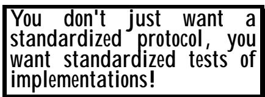
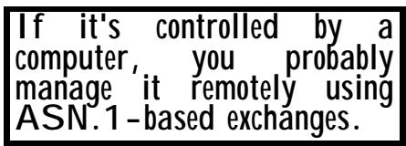

# Chapter 2 Applications of ASN.1 
第 2 章 ASN.1 的应用

(Or: Are you using software that does ASN.1 encodings?) （或者：您使用的是可以进行 ASN.1 编码处理的软件吗？）

## Summary: 总结：

This chapter: 这一章：

• Tries to provide an indication of the application areas in which ASN.1 has been used. • 试图指出那些已经应用了 ASN.1 的领域。

• Tries to identify some of the organizations that have used ASN.1 as their chosen specification-language. • 试图找出那些将 ASN.1 作为指定语言的组织。

• Uses a partial historical framework for the discussion of applications and organizations. • 在讨论相关应用和组织时，采用了部分历史背景作为参考框架。

## 1 Introduction 1 引言

This brief chapter outlines some of the areas in which ASN.1 has been applied. It in no way claims to be exhaustive, and if some groups feel offended that they have not been mentioned, I apologise! 这一小节简要介绍了 ASN.1 所应用于的一些领域。当然，这份列表并非详尽无遗；如果有些团队因为未被提及而感到不满，请谅解！

Equally, I have seen Web pages that say they will include their ASN.1 definitions, only to be assured by people I trust that use of ASN.1 for that particular application was abandoned! I hope there are not too many errors in what follows, but I am sure there are serious omissions. 同样，我也见过一些网页声称会包含他们的 ASN.1 定义。不过，后来我了解到，那些信任的人已经放弃了在那种特定应用中使用 ASN.1 的做法。希望以下内容中没有太大的错误，但我确信肯定有一些重要的信息被遗漏了。

Whilst the emphasis is on different applications, the treatment is partly historical, showing the gradual extension of the use of ASN.1 from a single application (X.400) to a wide range of applications today. 虽然重点在于不同的应用场景，但这部分内容也带有一定的历史性质，展示了 ASN.1 技术从最初仅应用于 X.400 系统，逐渐扩展到如今广泛应用于各种场景的过程。

Thus this chapter complements the previous historical chapter. 因此，这一章是对之前历史章节的补充。

The chapter does not contain a detailed list of ISO Standard numbers and ITU-T Recommendations and Internet RFCs, but rather gives a broad outline of application areas with the occasional mention of an actual specification as an illustration. 这一章节并未列出详细的 ISO 标准编号、ITU-T 推荐标准以及互联网 RFC 文件列表，而是简要介绍了这些标准的应用领域，偶尔会提及一些具体的规范作为示例。

For anyone interested, a more complete set of detailed references to specifications using ASN.1 can be found via the URL in Appendix 5, or in the companion text by Olivier Dubuisson (also referenced via Appendix 5). 对于感兴趣的人士来说，如果想要更完整的关于 ASN.1 规范的详细参考信息，可以通过附录 5 中的链接获取，或者参考 Olivier Dubuisson 撰写的配套文档（该文档也在附录 5 中有提及）。

Most of the acronyms in this chapter can be used as input to Web search engines, and will usually result in hits on home-pages for the relevant organizations or specifications. This is the best way to obtain more information if Appendix 5 does not work for you! (Web URLs have a habit of changing!) 本章中的大多数缩写都可以作为搜索关键词输入到网络搜索引擎中，通常能够找到相关组织或规格的详细信息。如果附录 5 无法提供所需信息，这种方法就是获取更多资料的最佳途径！（不过，网络链接的内容可能会随时发生变化。）

There are also Web sites (access via Appendix 5 or a search) for ITU-T and ETSI and ECMA that will give you much more information about their specifications, and in the case of ITU-T a list of the Recommendations that use ASN.1. (If you get interested in any of the ITU-T Recommendations, beware - they can all be purchased and delivered on-line, but it will cost you serious money!) 此外，还有一些网站可以提供 ITU-T、ETSI 和 ECMA 的相关信息（可通过附录 5 或在线搜索获取）。这些网站能为您提供大量关于其规范的信息。对于 ITU-T 的规范，这些网站还会提供使用 ASN.1 的推荐方案列表。不过，如果您对 ITU-T 的某些推荐方案感兴趣，请注意——这些资料都可以在线购买，但价格相当昂贵！

This chapter inevitably contains a lot of acronyms - every protocol and every organization has its own acronym. I try to spell out the acronym if it has not been used in earlier text, but sometimes it it seems hardly worth the effort, because the acronym is often far better known than the full title! 这一章中不可避免地会包含很多缩写词——每种协议和每个组织都有各自的缩写名称。如果之前的相关文字中已经使用过某个缩写词，我会尽量将其完整拼写出来；但有时候，似乎并没有必要这么做，因为很多缩写词本身就比完整的名称更容易被人记住！

In many cases you will find that a document you locate via a search uses the acronym without giving the full name. Many, many people know these acronyms, but would have to think hard to give you the full name, and would probably then get it wrong! (In some cases, different Web and other documents give different full names for the same acronyms - but clearly intend to identify the same thing!) 在许多情况下，你会发现通过搜索找到的文档中，缩写词被使用而没有提供完整的名称。很多人都知道这些缩写词，但要想提供完整的名称就需要花费较多精力，而且很可能还会出错！（在某些情况下，不同的网页和其他文档可能会给出相同缩写词的不同完整名称——但显然它们指的是同一件事！）

So, we do our best. But if you want a challenge, see what you can find out about the following acronyms (in the ASN.1 context). They are given in no particular order. Some are mentioned in this chapter, most are not. It is believed that they all relate to protocols or organizations that are using ASN.1 as a specification language. Test yourself on the following: 所以，我们会尽力而为。不过，如果你想要挑战一下，可以试着了解以下这些缩写的含义（在 ASN.1 领域里）。这些缩写并没有特定的排序。有些在本章已经提到过，而大多数则没有。相信这些缩写都与那些使用 ASN.1 作为规范语言的协议或组织有关。你可以自己来测试一下：

SET, SNMP, TCAP, CMIP, PKCS, MHS, ACSE, CSTA, NSDP, DPA, TDP, ETSI, DMH, ICAO, IMTC, DAVIC, DSS1, PKIX, IIF, LSM, MHEG, NSP, ROS(E), FTAM, JTMP, VT, RPI, RR, SCAI, TME, WMtp, GDMO, SMTP. SET、SNMP、TCAP、CMIP、PKCS、MHS、ACSE、CSTA、NSDP、DPA、TDP、ETSI、DMH、ICAO、IMTC、DAVIC、DSS1、PKIX、IIF、LSM、MHEG、NSP、ROS(E)、FTAM、JTMP、VT、RPI、RR、SCAI、TME、WMtp、GDMO、SMTP。

If you don't get 100% (although some could of course be mistyping!), you are not a network guru, and can't charge $££££$ per hour for your advice on network matters! 如果你无法达到 100%的正确率（当然，也有可能存在一些错误！），那么你就不算是个网络专家了。因此，你无法以每小时 $££££$ 的价格来收取关于网络问题的建议费用！

If you commute between Europe and the US and are active in both communities, you stand a better chance of meeting the challenge than those operating on only one side of the Atlantic pond. Of course, ASN.1 tool providers CERTAINLY know what all these acronyms mean, 'cos they are selling their tools to support them. But will they tell? 如果你在欧洲和美国之间往返通勤，并且同时活跃于这两个社区，那么你就有更大的机会应对这一挑战。当然，那些提供 ASN.1 工具的公司肯定明白这些缩写的含义——因为它们正是通过这些工具来提供支持的。不过，他们会主动说明吗？

Well, I honestly admit that after a fair bit of research I can cover about 95% of the above list (I have described a lot less than 95% in this chapter), but certainly not all! 嗯，老实说，经过一番研究后，我承认自己能够涵盖上述列表中的大约 95%内容（在本章中，我描述的内容还不到 95%）。当然，并不是所有的内容都能被涵盖啦！

If any reader can cover the lot (and preferably give a URL for further info) then an e-mail to the my address via the link in Appendix 5 would be welcomed - but too late for this book, maybe the second edition? 如果有任何读者能够提供相关的信息（最好是附上网址以便进一步了解），那么可以通过附录 5 中的链接发送电子邮件至我的地址。不过，对于这本书来说，现在可能已经太晚了，也许可以在第二版中补上这些信息吧？

## 2 The origins in X.400 2 其起源可以追溯到 X.400 系统。

X.400 was originally a related set of CCITT Recommendations covering (with gaps) X.400 to X.430. The X.400 specifications were intended to become the (OSI) de facto e-mail system for the world. X.400 最初是一组与 CCITT 建议书相关的标准，涵盖了从 X.400 到 X.430 的内容。X.400 规范旨在成为全球范围内事实上的电子邮件系统。

Everything has a beginning! 一切都有个开始！

X.400 started off with many advantages over the Internet mail protocol (at that time it was Simple Mail Transfer Protocol (SMTP), with no frills - frills like Multipurpose Internet Mail Extensions (MIME) were added later). X.400 相比当时的互联网邮件协议有着许多优势（当时的协议只是简单的邮件传输协议，没有附加功能；直到后来才出现了像多用途互联网邮件扩展标准这样的附加功能）。

X.400 from the start supported a variety of different types of "body part", permitting multi-media attachments to mail, and in its 1998 version incorporated virtually all the security features of the Military Message Handling Systems (MMHS) specifications (security features in SMTP are still very much poorer). X.400 从一开始就支持多种不同类型的“主体部分”，允许在邮件中附加多媒体内容。在 1998 年版本中，它几乎包含了军事消息处理系统规范中的所有安全功能（而 SMTP 的安全性功能仍然相对较弱）。

SMTP was, however, enhanced with the MIME extensions to provide for the transfer of arbitrary attachments (albeit at about twice the band-width of X.400) and Internet mail implementations today generally do not accept mail from outside their own domain, reducing (but not eliminating) the risks of masquerade. (None of this work is ASN.1-based.) But whatever the technical merits or otherwise, we all know that SMTP-based e-mail is now the world's de facto standard, although X.400 still plays a roll in gateways between different mail systems, and in military communications, and has other minority followings. 不过，SMTP 通过 MIME 扩展得到了改进，从而能够传输任意类型的附件（不过其传输带宽大约是 X.400 的两倍）。如今，大多数互联网邮件系统都不接受来自自身域之外的邮件，这在一定程度上降低了伪装攻击的风险。不过，这些技术改进并非基于 ASN.1 标准。但无论从技术角度来看如何，我们都明白，基于 SMTP 的电子邮件现在已成为全球的事实标准。虽然 X.400 仍在不同邮件系统之间的网关通信以及军事通信中发挥着作用，而且还有一些小范围的追随者。

ASN.1 was originally produced to support just this one X.400 specification, and is, of course, still used in all the ongoing X.400 work. ASN.1 最初就是为了支持 X.400 规范而设计的，目前仍然被广泛应用于所有的 X.400 相关工作中。

Another important specification which was originally produced to support just X.400 was the Remote Operations Service Element (ROSE) specification - originally just called "ROS". Like ASN.1, this became recognised as of more general utility, and moved into the X.200 series of Recommendations. (ROSE is discussed further in Section II Chapter 6). ROSE was (and is) totally ASN.1-based and is the foundation of many many applications in the telecommunications area. Its requirements were very influential in the development of the Information Object concept and in the recognition of the need to handle "holes". (See the previous chapter on the history of ASN.1.) 另一个重要的规范是远程操作服务元素（Remote Operations Service Element，简称 ROSE）规范——最初仅被称为“ROS”规范。与 ASN.1 类似，该规范也逐渐被认可，并纳入了 X.200 系列建议中。关于 ROSE 的详细信息请参见第二章第 6 节。ROSE 完全基于 ASN.1 规范，是电信领域许多应用的基础。其规范在信息对象概念的发展以及解决“漏洞”问题的需求方面发挥了重要作用。（有关 ASN.1 历史的更多信息，请参考前一章。）

## 3 The move into Open Systems Interconnection (OSI) and ISO 3. 转向开放系统互连以及 ISO 标准

In the early 1980s, papers at conferences would have titles like "OSI versus SNA" (SNA was IBM's "Systems Network Architecture"), with most people believing that the OSI work would eventually become the de facto standard for world-wide networking, but would have a battle 在 20 世纪 80 年代初，会议上的论文标题常常类似“OSI 与 SNA 的比较”（SNA 是 IBM 提出的“系统网络架构”），大多数人认为 OSI 标准最终会成为全球网络的标准。不过，两者之间确实存在竞争关系。

Rapid expansion to take over the world through OSI - supposedly! But also take-up by several other ISO Technical Committees. 通过 OSI 技术实现迅速扩张，以征服世界——至少是这样吧！而且，还有其他几个 ISO 技术委员会也加入了这一计划。

to unseat SNA. Again, historically, OSI as a whole never really made it, but it was the introduction of ASN.1 into main-stream OSI that moved ASN.1 from being a single-application language into a tool used by many protocol specifiers. 为了推翻 SNA 的统治地位。从历史上看，OSI 作为一个整体其实一直并不成功，但正是 ASN.1 被引入到 OSI 标准中，使得 ASN.1 从一种单一应用语言转变为一种被许多协议规范者使用的工具。

Very soon after it was introduced from CCITT (as it then was) into ISO, ASN.1 was adopted as the specification language of choice by every single group producing specifications for the Application Layer of OSI and for many other OSI-related standards. Implementations of most of these standards are still in use today, but it is fair to say that in most cases they are in a minority use. 自从它被从 CCITT（当时的名称）引入到 ISO 之后，ASN.1 很快就被成为所有负责制定 OSI 应用层规范以及许多其他与 OSI 相关的标准的团体所选择的规范语言。目前，这些标准中的大多数仍然在应用之中，但可以说，在大多数情况下，ASN.1 只是少数被使用的规范语言而已。

Most of the OSI applications of ASN.1 were for standards in the so-called "Application Layer" of OSI, developed by ISO/JTC1/SC16, and then (following a reorganization) by ISO/JTC1/SC21. These covered, inter alia, standards for remote database access, for transaction processing, for file transfer, for virtual terminals, and so on. ASN.1 的 OSI 层应用大多属于 ISO/JTC1/SC16 工作组所制定的所谓“应用层”标准。这些标准包括远程数据库访问、事务处理、文件传输、虚拟终端等方面的规范。这些标准在后来经过一些调整之后，由 ISO/JTC1/SC21 工作组继续负责维护。

The ASN.1 concepts of a separation of abstract and transfer syntax fitted very well with the socalled "Presentation Layer" of OSI for protocols running over the OSI stack and using the Presentation Layer to negotiate the transfer syntax to be used for any given abstract syntax. ASN 的抽象与传输语法分离的概念，非常适用于 OSI 层次结构中所谓的“表示层”。对于那些在 OSI 层次上运行的协议来说，使用表示层来协商用于特定抽象语法的传输语法，是一种非常有效的做法。

Interestingly, however, ASN.1 was also used to define the Presentation Layer protocol itself - probably the first use of ASN.1 for a protocol which did not run over the OSI Presentation Layer (many others were to follow). 不过，有趣的是，ASN.1 也被用来定义呈现层协议本身——这可能是 ASN.1 首次被用于描述一种并非基于 OSI 呈现层运行的协议。此后还有许多其他例子也使用了 ASN.1 来描述类似的协议。

There was even a draft circulated showing how the OSI Session Layer (the layer below the Presentation Layer) could be defined (more clearly, and in a machine-readable format) using ASN.1. This was accompanied by a draft of a "Session-Layer-BER" which was a minor change to BER and which if applied to the ASN.1 definition would produce exactly the bits on the line that the Session Protocol Standard currently specified. But the Session Layer specifications were complete and stable by then, so the draft was never progressed. 甚至还有一份草案，其中详细描述了如何使用 ASN1 来明确定义会话层（位于表示层之下的一层）。该草案还包含了一份名为“会话层 BER”的修改方案，其实就是对 BER 进行的轻微调整。如果将该方案应用到 ASN1 的定义中，就能得到与会话协议标准当前规定的二进制位完全一致的结果。不过，当时会话层的规范已经相当完善且稳定了，因此这份草案最终并没有得到进一步的发展。

A similar situation arose with the Generic Definition of Managed Objects (GDMO) - see Clause 8 below, where an equivalent notation using Information Object Classes and "WITH SYNTAX" was identified in a circulated draft - from Japan - but was never progressed because the GDMO work was by then stable and quite mature. 关于“受管理的对象通用定义”（GDMO）这一方面也出现了类似的情况——请参考下面的第 8 条。在一份来自日本的草案中，提到了一种使用“信息对象类”和“具有语法”的等效表示方式。不过，由于 GDMO 的相关工作当时已经相当成熟且稳定，因此这一提议并未得到进一步推进。

ASN.1 has been used in many other ISO Technical Committees, in areas such as banking, security, protocols for control of automated production lines, and most recently in the development of protocols in the transportation domain for "intelligent highways". These protocols are often (usually) not carried over the OSI stack, and have served to show the independence of ASN.1 from OSI, despite its early roots in the OSI work. ASN.1 已被许多其他 ISO 技术委员会所采用，这些领域包括银行业、安全性、自动化生产线控制协议，最近则用于“智能高速公路”领域的协议开发。这些协议通常无法在 OSI 层结构中延续使用，这充分体现了 ASN.1 与 OSI 的独立性，尽管 ASN.1 的起源可以追溯到 OSI 工作。

A recent example of such use is for the definition (by ISO/TC68) of messages passing between an Integrated Circuit credit card and the card accepting device. 最近的一个应用实例是，根据 ISO/TC68 的标准，这种机制被用于定义集成电路信用卡与受理该信用卡的终端设备之间的通信方式。

## 4 Use within the protocol testing community 4. 在协议测试领域中使用

As well as protocol specifications, the OSI world started the idea of standardized tests of protocol implementations. These test sequences are, of course, protocols in their own right, where a testing system sends messages to an implementation under test, and assesses the responses it gets. The Tree and Tabular Combined Notation (TTCN) is the most commonly used notation for this purpose, and ASN.1 is embedded within this notation for the definition of data structures. 除了协议规范之外，OSI 领域还提出了对协议实现进行标准化测试的理念。这些测试序列本身也是一种协议，其中测试系统会向被测试的实现发送消息，并评估该实现所返回的响应。树状与表格结合表示法（TTCN）是最常用的这种测试表示方法，而 ASN.1 则用于定义数据结构。

Closely related to the TTCN application is the use of ASN.1 within another ITU-T formal description technique, System Description Language (SDL). 与 TTCN 应用密切相关的是在 ITU-T 另一种正式描述技术——系统描述语言（SDL）中运用 ASN.1 标准的情况。

The European Telecommunications Standards Institute (ETSI) has been a major actor in the development of testing specifications using these notations. 欧洲电信标准协会（ETSI）在采用这些标记方式来制定测试规范方面发挥了重要作用。

## 5 Use within the Integrated Services Digital Network (ISDN) 5. 在综合业务数字网络（ISDN）中的应用

In the 80's, Integrated Services Digital Network (ISDN) was the great talking point. It grew out of the digitisation of the telephone network. 在 80 年代，综合业务数字网络（ISDN）成为了当时的热门话题。这一技术起源于电话网络的数字化改造。

<table><tbody><tr><td data-imt-p="1">Probably the first application of ASN.1 outside of the main OSI work. 这可能是 ASN.1 在 OSI 模型之外领域的首次应用。</td></tr></tbody></table>

The telephone network in most advanced countries is now entirely digital apart from the so-called "local loop" between homes and the local telephone exchange, which in the majority of cases remains analogue. 在大多数发达国家，电话网络已经完全实现了数字化，不过在家庭与当地电话交换站之间的连接仍然采用模拟方式。

ISDN provided, using the existing local loops between homes and a local telephone exchange, two so-called "B-channels" each capable of carrying a telephone call or a 64 Kbps data connection, and a "D-channel" (used for signalling between the subscriber and the exchange). ISDN became widely available to telephone subscribers, but its main application was (and still is today - 1999) the use of the two B-channels together to provide a 128 Kbps data channel for video-conferencing over the telephone network. ISDN 通过利用家庭与当地电话交换局之间的现有局部回路，提供了两种所谓的“B 通道”。每种通道都能支持一个电话通话或 64 Kbps 的数据传输。此外，还有一条“D 通道”，用于实现用户与交换局之间的信号传输。ISDN 逐渐被电话用户所接受，但其主要应用方式仍然是将这两种 B 通道结合起来，从而通过电话网络实现 128 Kbps 级别的数据传输，用于视频会议等应用。这一技术至今仍被广泛应用。

Within ISDN, many so-called "supplementary services" (for example, Call Back to Busy Subscriber) were implemented using the D-channel, and ASN.1 (with BER encodings) was chosen to define the protocol for these services. 在 ISDN 标准中，许多所谓的“附加服务”都是通过 D 通道来实现的（例如，回拨到繁忙用户的功能）。这些服务的协议定义采用了 ASN.1 格式，并使用了 BER 编码方式。

## 6 Use in ITU-T and multimedia standards 6. 适用于 ITU-T 标准和多媒体标准

ASN.1 was, of course, first introduced to ITU-T through X.400 and OSI, but was rapidly taken up by many other standardization groups within ITU-T (then CCITT). ASN.1 最初是通过 X.400 和 OSI 标准被引入 ITU-T 的，但很快就被 ITU-T 内部的其他许多标准化组织所采用（当时称为 CCITT）。

<table><tbody><tr><td data-imt-p="1">Widespread use of ASN.1 throughout many parts of ITU-T continues to this day. ASN.1 在 ITU-T 的许多领域中被广泛使用，这一现象一直持续到了今天。</td></tr></tbody></table>

Uses of ASN.1 within ITU-T can be found in: ITU-T 标准框架中，ASN.1 的应用可以在以下文档中找到：

• The G-series recommendations for speech encoding and silence compression. • G 系列产品对语音编码和静音压缩方面的建议。

• The H-series for multimedia (audio-visual) communications, including moving video coding for low bit rate communication, and specifications being implemented by the Interactive Multimedia Teleconferencing Consortium (IMTC). • H 系列用于多媒体通信（音视频通信），包括适用于低比特率通信的动态视频编码技术。这些规范由互动多媒体电话会议联盟（IMTC）负责实施。

• The M-series for test management in ATM. • 适用于 ATM 测试管理的 M 系列产品。

• The Q-series for a host of specifications related to ISDN and Intelligent Networks (IN). • Q 系列产品涵盖了与 ISDN 和智能网络相关的各种规格。

• The T-series for group 3 facsimile and for MHEG communications. • T 系列适用于第三组的仿真功能，以及 MHEG 通信需求。

• The V-series for audio-visual terminal communication. • 适用于视听终端通信的 V 系列产品。

• The Z-series for use within SDL (described above) and within GDMO (described in Clause 8 below). • Z 系列设备适用于 SDL 系统（如上所述），也适用于 GDMO 系统（详见下文的第 8 条）。

• And of course, in the X-series for Recommendations that originated in the OSI work. • 当然，在 X 系列的相关功能中，这些功能都是基于 OSI 规范中提出的建议而设计的。

Regarding the H-series, the most important of these Recommendations is perhaps the H.323 series for audio, video, and data communication across the Internet (including video-conferencing, interactive shopping, network gaming, and many other multi-media applications - check out the H.323 Web site for further details). Other specifications in the H.320 series address multimedia communication over both narrow-band and broad-band (ATM) ISDN and PSTN communications. These Recommendations seem set to become de facto standards for multi-media communication that will operate over a wide range of network infrastructures. 关于 H 系列协议，其中最重要的规范可能是 H.323 协议。该协议适用于通过互联网进行的音频、视频和数据通信（包括视频会议、互动购物、网络游戏等多种多媒体应用——更多详情请参考 H.323 协议网站）。而 H.320 系列规范则涵盖了通过窄带和宽带（ATM）ISDN 以及 PSTN 通信进行的多媒体通信。这些规范似乎将成为在各种网络基础设施上运行的多媒体通信的行业标准。

It is these Recommendations that cause many familiar products to have ASN.1 (PER in this case) encoders embedded wtihin them, so if you use any of these products, you are using ASN.1 (encodings)! Examples of such products are Microsoft NetMeeting, Intel VideoPhone, PictureTel software, and so on and so on. 正是这些建议使得许多常见的产品都内置了 ASN.1 编码方式。因此，如果你使用了这些产品，那就意味着你正在使用 ASN.1 编码方式！这类产品的例子包括 Microsoft NetMeeting、Intel VideoPhone、PictureTel 软件等等。

## 7 Use in European and American standardization groups 7. 适用于欧洲和美国的标准化团体

There are three European standardization groups worth mentioning where ASN.1 has been quite heavily used (no doubt there are others). The first two carry the name "European" in their title, but they all contribute standards to the world-wide community. These are the European Computer Manufacturers Association (ECMA), the 有三个欧洲标准化组织值得一提，在这些组织中，ASN.1 被广泛应用（当然，还有其他组织也使用它）。前两个组织的名称中带有“欧洲”字样，但它们都为全球社区制定标准。这两个组织分别是欧洲计算机制造商协会（ECMA）和——

Many sub-international (to coin a phrase) groups that are really international actors have used ASN.1. 许多属于国际性组织的子组织也使用了 ASN.1 标准。

European Telecommunications Standards Institute (ETSI), and the rather more recent Digital Audio Visual Council (DAVIC). (DAVIC is Europe-based, but would justifiably claim to be a world-wide consortium.) 欧洲电信标准协会（ETSI），以及相对较新的数字音频视觉委员会（DAVIC）。虽然 DAVIC 总部位于欧洲，但它确实可以被视为一个全球性的组织。

ECMA has long worked on OSI-related standards for input into OSI (but also in broader areas - for example, it had significant input into the initial IEEE 802 Standard). It has also produced the ASN.1-based Computer Supported Telecommunications Applications (CSTA) specification for communication between telephone switches and end-user computers. Initial deployment of CSTA has been in support of large Call Centres - an important development in communications in the late 1990s. As is normal with ECMA specifications, the work has been input to ISO for international standardization. ECMA 长期以来一直致力于 OSI 相关标准的研发，这些标准被广泛应用于 OSI 领域（同时也涉及更广泛的领域——例如，ECMA 对最初的 IEEE 802 标准也提出了重要的贡献）。此外，ECMA 还制定了基于 ASN.1 的计算机支持电信应用规范，用于实现电话交换机与终端用户计算机之间的通信。CSTA 规范最初应用于大型客服中心，这无疑是 1990 年代末通信领域的重要进展。像 ECMA 的规范一样，这些成果已经提交给 ISO 进行国际标准化工作。

ETSI is primarily concerned with European variants of ITU-T Recommendations and with the development of telecommunications specifications for input into ITU-T. It has also been active in the development of specifications based on TTCN (which has ASN.1 embedded within it). There is close liaison between ECMA and ETSI on telecommunications standards, and with ITU-T. ETSI 主要关注欧洲地区的 ITU-T 建议的变体，以及为 ITU-T 提供规范的开发工作。该组织还积极参与基于 TTCN 的规范制定工作（TTCN 标准中包含了 ASN.1 标准）。ECMA 与 ETSI 在电信标准方面有着紧密的合作关系，同时也与 ITU-T 保持密切沟通。

DAVIC is a consortium of 157 companies and government agencies from 25 countries promoting video-conferencing. Its specifications are input to ISO for international standardization. DAVIC 是由来自 25 个国家的 157 家企业和政府机构组成的联盟，致力于推动视频会议技术的发展。该联盟的规范被提交给 ISO 进行国际标准化工作。

There are also a number of standards groups and consortia in the USA that have used ASN.1 in their specifications. Frequently, but not always, such work feeds into international standardization. 在美国，还有许多标准组织和联盟在其规范中使用了 ASN.1 标准。通常，这类工作会推动国际标准的制定。不过，并非总是如此。

Worth mentioning (but this list is very incomplete and a bit random - it is the ones I have heard about) are: 值得一提的是（不过这个列表非常不完整，而且内容有些随机——这些只是我听过的例子）：

The ANSI X9 committees concerned with Financial Industry Standardization (Funds Transfer and EDI, for example), feeding into ISO/TC68. 负责金融行业标准标准化的 ANSI X9 委员会（例如，资金转移和 EDI 领域的工作）正在为 ISO/TC68 委员会提供建议。

The American Chemical Society for the exchange of chemical information and DNA sequences (for the Web site, see links via Appendix 5 to the National Centre for Biological Information (NCBI)). 美国化学学会致力于化学信息及 DNA 序列的交换工作（有关网站信息，请参见附录 5 中的链接，该链接指向国家生物信息中心网站）。

Many Federal Information Processing Standards (FIPS) concerned with security matters, for example, FIPS PUB 188 on Standard Security Labels for Information Transfer - the Standard Security Label is defined as an ASN.1 type: "SET OF NamedTagSet" where "NamedTagSet" is .... etc. 许多与安全性相关的联邦信息处理标准（FIPS）规范中，例如 FIPS PUB 188《信息传输的标准安全标签》就定义了标准安全标签。该标准安全标签被定义为一个 ASN.1 类型：“SET OF NamedTagSet”，其中“NamedTagSet”的具体含义则不明确……

• The SET consortium (see Clause 9 below). • SET 联盟（详见下文第 9 条）。

## 8 Use for managing computer-controlled systems 8. 用于管理计算机控制系统

Another major "invention" from the OSI work was the concept of "managed objects" (devices that are interrogated, tested, configured, reset, etc by remote communications). This came out of the work on Common Management Information Services/Protocol (CMIS/CMIP), which produced a model of such objects (identified by ASN.1 object identifiers) having attributes (which were ASN.1 types identified by further ASN.1 object identifiers). "Management" was essentially performed by reading from or writing to these "attributes" (using CMIP) which were, as it were, on the surface of the managed objects, and provided external visibility and contro of the object. OSI 团队的另一项重要“发明”是“管理对象”的概念（即那些可以通过远程通信进行查询、测试、配置、重置等操作的设备）。这一概念源自于通用管理信息服务/协议的研究，该研究提出了一个管理对象的模型（这些对象由 ASN.1 对象标识符标识），并且这些对象具有属性（这些属性又是 ASN.1 类型，进一步由 ASN.1 对象标识符进行标识）。所谓“管理”操作，实际上是通过读取或写入这些“属性”来实现的（使用 CMIP 协议），而这些属性就存在于被管理对象的表面，从而提供了对对象的外部可见性和控制能力。

When the CMIP standard was first published, it was a protocol full of "holes" - not a single managed object and its attributes had been defined at that stage! A notation was clearly needed to allow people to define (preferably in a machine-readable way) managed objects. An ASN.1 macro might well have been used to define that notation, but by then there was an embargo on writing new macros, and the replacement Information Object Class work was still in its infancy. So Generic Definition of Managed Objects (GDMO) was defined (in English) as a notation for specifying the necessary details about managed objects, with ASN.1 as an embedded notation within GDMO. 当 CMIP 标准首次发布时，它存在一个严重的问题：几乎没有管理对象的定义，而且管理对象的属性也尚未明确指定。因此，需要一种能够让人们以机器可读取的方式定义管理对象的符号系统。当时可能会使用 ASN.1 宏来定义这种符号系统，但那时已经禁止了新宏的编写，而替代性的信息对象类规范工作也还处于初期阶段。于是，最终提出了“管理对象通用定义”（GDMO）这一方案——它是一种用于指定管理对象所需细节的符号系统，而 ASN.1 则作为 GDMO 内的嵌入式符号系统被使用。

In the Internet world, the concepts of CMIS/CMIP were adopted, and while work was still continuing on the development of CMIS/CMIP, an RFC was produced for Simple Network Management Protocol (SNMP). Initially, this was stated to be a temporary solution until CMIS/CMIP matured, but like most temporary solutions, it became rather permanent, and has today a greater market share of management of remote devices than does CMIS/CMIP. 在互联网领域，CMIS/CMIP 的概念被采纳了。虽然 CMIS/CMIP 的开发工作仍在进行中，但当时已经发布了关于简单网络管理协议（SNMP）的 RFC 文档。最初，这种解决方案被视作一种临时解决方案，直到 CMIS/CMIP 成熟之后才会被采用。不过，就像大多数临时解决方案一样，简单网络管理协议也逐渐变成了永久性的解决方案。如今，它在远程设备管理领域的市场份额甚至超过了 CMIS/CMIP。

Like CMIS/CMIP, SNMP also uses ASN.1, but in a very cut-down form, and with considerable restrictions on the form of ASN.1 types that can be used to define the values to be set or read on managed objects. This did, however, represent the first real penetration of ASN.1 into the Internet standardization community. 与 CMIS/CMIP 类似，SNMP 也使用了 ASN.1 标准。不过，SNMP 的实现方式要简单得多，而且对于用于定义需要设置或读取的数据类型的 ASN.1 类型也有相当多的限制。尽管如此，这仍然标志着 ASN.1 标准首次真正被纳入了互联网标准化领域。

CMIS/CMIP was originally designed to control implementations of the OSI stack in network switches and remote hosts, but (like SNMP) it is increasingly used today to manage remotely anything that is computer controlled. So applications of management protocols can include the steering of telescopes or radar dishes, or even the switching on and off of washing machines or ovens! (But I am not sure the latter are yet a reality.) CMIS/CMIP 最初是为了在网络交换机和远程主机上实现 OSI 协议的运行而设计的，不过如今它也被越来越多地用于管理任何由计算机控制的设备。因此，管理协议的应用范围可以扩展到控制望远镜或雷达天线的转向，甚至包括控制洗衣机或烤箱的开关操作！不过，我不确定后者是否已经实现啦。

## 9 Use in PKCS and PKIX and SET and other security-related protocols 9. 适用于 PKCS、PKIX、SET 以及其他与安全相关的协议。

Let's just get the acronyms in the title out of the way! PKCS is Public Key Cryptographic Standards, PKIX is Public Key Infrastructure (X.509), and SET is Secure Electronic Transactions (a little more detail on these follows below). 让我们先把标题中的缩写部分处理一下吧！PKCS 指的是公共密钥加密标准，PKIX 指的是公共密钥基础设施（X.509 领域的术语），而 SET 则指的是安全电子交易技术。关于这些术语的详细解释，后面会有所说明。

The wide-spread adoption of X.509 (ASN.1-based) certificates has made ASN.1 the dominant specification technique in security work. X.509 证书标准的广泛采用（基于 ASN.1 标准）使得 ASN.1 成为了安全领域中的主要规范技术。

X.500 is one of the OSI Standards that still has significant support, and its use of ASN.1 in the OSI work has led to adoption of ASN.1 in almost all security-related protocols. X.500 是 OSI 标准之一，至今仍得到广泛支持。它在 OSI 框架中采用 ASN.1 编码的方式，这使得 ASN.1 编码几乎被应用于所有与安全相关的协议中。

X.500 was (and is) an ISO and ITU-T Standard and Recommendation, but the Light-Weight Directory Access Protocol (LDAP), which is a functional subset of X.500 is an Internet RFC, and is rapidly becoming the de facto standard for access to Directory services, leaving X.500 proper for use "behind the scenes" to link local LDAP servers to provide a world-wide Directory service. LDAP uses the ASN.1 notation to define its messages, but specifies a text encoding for values of the (limited) subset of ASN.1 that it uses (see later discussion in Clause 10 on preferences for textbased protocols among Internet specifiers). X.500 曾经是（现在仍然）一项由 ISO 和 ITU-T 制定的标准和建议规范。而轻量级目录访问协议（LDAP）则是 X.500 的一个功能子集，它属于互联网 RFC 标准，正迅速成为访问目录服务的默认标准。真正的 X.500 则用于“幕后操作”，用于将本地 LDAP 服务器连接起来，从而提供全球范围的目录服务。LDAP 使用 ASN.1 表示法来定义其通信消息，但它为 ASN.1 子集中的值指定了文本编码方式（关于互联网规范中基于文本的协议的选择偏好，请参见第 10 条的描述）。

Whilst X.500 was primarily designed to provide a world-wide Directory service, allowing look-up of a very wide variety of information with a world-wide search, it also provided the first standard (X.509) for certificates (which were - and are, of course, an ASN.1 type). 虽然 X.500 最初旨在提供一种全球范围的目录服务，能够查询各种类型的信息，但它同时也提出了第一个证书标准（X.509）——而证书本身其实就是 ASN.1 类型的数据。

The basic certificate concept is that a Certification Authority (CA) will provide a public and private key pair (usually for some commercial fee) to an applicant, and will also provide an electronic bit-pattern (a certificate) that is encrypted using the public key of the CA. The certificate is an ASN.1 type that provides an association between the public key issued to the applicant and some property of the applicant (name, company registration number, etc). Certificates cannot be forged provided the CA keeps its own private key secure. However, anyone knowing (for absolutely sure) the public key of the CA, can decrypt the certificates it issues and hence "believe" the public key of the organization or person that the certificate contains - and hence apply some degree of "trust" to that organization or person (and to messages or signatures that decrypt to produce valid hash values using that public key). Of course, the public key of the CA is usually obtained from another certificate issued by a "higher" CA, whose public key is obtained from another certificate issued by .... and so on, until, .... well, .... the Netscape public key is usually built into your Web browser software! (Which of course you obtained from a trustworthy source!). 基本证书的概念是，认证机构会向申请人提供一把公共密钥和私有密钥对（通常需要支付一定的费用），同时还会提供一份用认证机构的公共密钥加密后的电子证书。该证书属于 ASN.1 类型，它能够实现向申请人颁发的公共密钥与申请人的某些信息（如姓名、公司注册号等）之间的关联。只要认证机构能够保护好自己的私有密钥，那么证书就无法被伪造。不过，只要有人确切知道认证机构的公共密钥，就可以解密该机构颁发的证书，从而相信证书中所包含的组织或个人的公共密钥。这样一来，人们就可以对该组织或个人以及使用该公共密钥解密后得到有效哈希值的信息或签名产生一定程度的“信任”。当然，认证机构的公共密钥本身也是需要被保护的。CA 证书通常是从另一个由“更高权威”的 CA 机构颁发的证书中获得的。该 CA 机构的公钥又来自另一个由……机构颁发的证书……以此类推。最终，……嗯，……Netscape 的公钥通常会被内置在你的网络浏览器软件中！（当然，这些证书都是来自可信来源的）。

This process of obtaining a public key from one certificate to unlock another certificate to get a public key which unlocks another certificate etc is called certificate chaining, and originally people expected just one or two top-level CAs in the entire world, with their public keys really public - perhaps advertised daily in the newspapers! 这种从某个证书中获取公钥以解锁另一个证书的过程，被称为证书链验证。最初，人们认为全世界只有一两个顶级证书颁发机构，它们的公钥应该是完全公开的——或许可以像报纸上那样每天进行公告！

But then just about every national government decided it wanted one of its agencies to be a toplevel CA, and many companies also decided to be their own CA for internal use. And suddenly the problem of distribution of public keys and of degrees of trust got a lot more complicated. 不过，几乎每个国家政府都决定让其中一个机构成为顶级证书颁发机构。许多公司也决定为自己内部使用而设立自己的证书颁发机构。于是，公钥的分发问题以及信任程度的问题就变得复杂多了。

PKIX stands for Public Key Infrastructure (X.509), and is a set of Internet RFCs and Draft RFCs which specify how CAs should operate. For example, PKIX 4 specifies the form of a Certification Policy Statement (CPS) which all conforming CAs should make available to the public. The CPS says, for example, that (before issuing a certificate) the CA should verify individual names by requiring a photo-copy of a passport, or an actual passport, or a birth certificate, or (for a company in the UK) has checked that the Registered Office exists, as registered with Companies House, or ... You get the idea. The certificate they issue asserts that there is some association between the public key it contains and some further information about an individual or company. How much trust can you place in that assertion? The CPS helps you to determine that. PKIX 代表的是公共密钥基础设施（X.509 协议）。它包含一系列互联网 RFC 文档和草案文档，这些文档规定了证书颁发机构应该如何运作。例如，PKIX 4 规范了证书政策声明的形式，所有符合该规范的证书颁发机构都应向公众提供这种声明。该声明规定，在颁发证书之前，证书颁发机构必须验证个人的身份，这可能要求用户提供护照的复印件、真实的护照、出生证明，或者对于在英国注册的公司，还需要确认其注册地址确实存在于公司注册处所记录的地址中……以此类推。他们颁发的证书表明，其中包含的公共密钥与有关个人或公司的其他信息之间存在关联。那么，我们究竟能信任这种声明呢？证书政策声明可以帮助我们判断出这种信任的程度。

Several parts of PKIX use ASN.1, fully and straight-forwardly. 在 PKIX 的多个部分中，完全采用了 ASN.1 标准。

PKCS stands for Public-Key Cryptographic Standards. These are standards produced by a consortium of RSA Data Security and its major licensees, including Microsoft, Apple, Lotus, Sun, Novell, and MIT. PKCS uses ASN.1 as its notation for defining data-structures and their encoding. PKCS 指的是公共密钥加密标准。这些标准是由 RSA 数据安全公司及其主要授权方组成的联盟所制定的，这些授权方包括微软、苹果、Lotus、Sun、Novell 和 MIT 等公司。PKCS 使用 ASN.1 作为定义数据结构及其编码的语法标准。

Another important security-related protocol is Secure Electronic Transactions (SET), produced by a consortium of MasterCard, Visa, and other parts of the computer and banking industries. SET is designed to support electronic commerce in a fully secure manner, and hence uses X.509 certificates, and is itself about 60 pages of ASN.1 (with many more pages of supporting text). 另一个重要的安全相关协议是安全电子交易协议（SET），该协议由万事达卡、维萨卡以及计算机和银行行业的相关机构联合推出。SET 旨在以完全安全的方式支持电子商业交易，因此采用了 X.509 证书体系。该协议文件大约有 60 页，其中还包含大量关于 ASN.1 编码的详细说明。

When SET certificates are stored on smart-cards (because of the limited memory available on smart-cards) PER encoding is likely to be used with an ASN.1 datatype called a compressed certificate. 当 SET 证书存储在智能卡上时（由于智能卡上内存有限），通常会使用 PER 编码方式对 ASN.1 类型的数据进行编码，这种编码方式被称为“压缩证书”。

In general, the use of ASN.1 in X.509 has led most security-related protocols to use ASN.1. 总体而言，X.509 标准中采用 ASN.1 标准的方式，使得大多数与安全性相关的协议也采用了 ASN.1 标准。

## 10 Use in other Internet specifications 10. 在其他互联网规范中的应用

We have already discussed PKCS and PKIX and SNMP. ASN.1 (with PER) was considered for use in the latest version of HTTP, but instead an ASN.1-like notation called "pseudo-C was invented. 我们已经讨论过 PKCS、PKIX 以及 SNMP 了。在最新版本的 HTTP 协议中，考虑过使用 ASN.1 标准（结合 PER 特性）。不过，后来人们发明了另一种类似 ASN.1 的表示方式，称为“伪-C”。

Yes, even here we see some use of ASN.1! 是的，在这里我们也看到了一些使用 ASN1 的情况！

In general, Internet specifiers try to keep protocol specifications as simple as possible and to make it easy for implementors to operate without specialised tools, or using only tools that are in the public domain. 一般来说，互联网规范的设计者们力求使协议规范尽可能简单明了，同时让实施者能够在不使用特殊工具的情况下进行操作，或者仅使用那些属于公共领域的工具。

This tends to lead to protocols that in the end are simply lines of ASCII text (usually defined using BNF), or, if ASN.1 is used, to use of a subset of the ASN.1 notation. 这通常会导致一些协议规范，这些规范最终都只是简单的 ASCII 文本字符串（通常采用 BNF 格式定义），或者，如果使用了 ASN.1 标准，那么就会采用 ASN.1 表示法的某个子集来进行描述。

The Web is very much part of the Internet, but the World-Wide Web Consortium (W3C) now has very much a life of its own. 互联网中的网络部分其实也是互联网的重要组成部分，不过现在，万维网联盟（W3C）已经拥有了自己独立的存在。

It is within the W3C forum that work is on-going to marry XML and ASN.1 through the definition of XML Encoding Rules (XER). This work is recent, and was mentioned also in Section III Chapter 3. 在 W3C 的论坛中，人们正在努力通过定义 XML 编码规则来整合 XML 和 ASN.1 标准。这项工作刚刚开始，而且也在第 III 部分的第 3 章中有所提及。

## 11 Use in major corporate enterprises and agencies 11. 适用于大型企业和机构的使用

It is known that a number of house-hold name corporations and national and international agencies have made use of (and are still using) ASN.1 and its encoding rules to support communications activities within their corporations and agencies. 众所周知，许多家庭式企业以及国内外机构都采用了 ASN.1 标准及其编码规则，来支持其内部之间的通信活动。目前，这些机构和组织依然在继续使用这一技术。

However, attempts to obtain more details for publication in this book met with an almost universal rejection, due to concerns about commercial confidentiality of the applications. With regret, therefore, I have decided to make no mention of any specific name of a commercial organization unless the information about their use of ASN.1 appears on the Web. 然而，试图在本书中提供更多详细信息以进行出版，几乎都遭到了拒绝，因为人们担心这些信息的商业机密问题会受到侵犯。因此，很遗憾，我决定不提及任何商业组织的具体名称，除非有关这些组织使用 ASN.1 的信息能够在网上找到。

I will, however, mention one agency, and this is the International Civil Aviation Organization (ICAO). 不过，我还是要提到一个机构，那就是国际民用航空组织（ICAO）。

The ICAO is worth mentioning because it was the first organization to take-up (and to help in the development of) the Packed Encoding Rules. PER encodings were described in ICAO specifications long before the actual ASN.1 specifications were finally ratified, and use of ASN.1 and PER is fundamental to their Aeronautical Telecommunication Network (ATN). ICAO 值得提及，因为它是第一个采用并参与开发封装编码规则的组织。在正式的 ASN 规范最终得到批准之前，ICAO 规范就已经描述了 PER 编码方式。而 ASN.1 和 PER 的应用，正是其航空电信网络的基础。

## 12 Conclusion 12. 结论

ASN.1 has come a long way from the days when it provided support for just one application (X.400). ASN.1 从最初仅支持一种应用（X.400）的发展，已经取得了巨大的进步。

It is now used to a significant extent by all the main specifiers of protocols, and in some (but not all) cases is the dominant specification language. Usually use of the notation is associated with use of the ASN.1-defined encodings, with a few exceptions. 现在，这种表示法被所有主要的协议规范机构广泛使用，在某些情况下（但并非所有情况），它甚至是主要的规范语言。不过，这种表示法的使用通常与 ASN.1 定义的编码方式相关联，有一些例外情况除外。

If you were to wave a magic wand and eliminate from the world all messages that are encodings of ASN.1-defined values, disaster would certainly strike on a scale far beyond any that the most pessimistic have described for possible effects of the Y2K (year 2000) computer bugs. (Or any that actually occurred if you are reading this book post-2000!) 如果你挥动一根魔法棒，将所有用 ASN.1 定义的值进行编码的消息从世界上消除掉，那么灾难必将降临——其规模远远超过最悲观的人所描述的 2000 年计算机漏洞可能带来的后果。（或者，如果你在 2000 年后阅读这本书，那么实际上发生的灾难规模会更加巨大！）

Aircraft would collide, mobile phones would cease to work, virtually all telecoms and network switches would be unmanageable and unmaintainable and would gradually die, electric power distribution systems would cease to work, and to look a little further ahead before we wave our magic wand, smart-card-based electronic transactions would fail to complete and your washing machine might fail to work! But worst of all, your NetMeeting with your newly betrothed would suddenly collapse and your life would become a misery! 飞机将会相撞，手机将无法使用，几乎所有的电信系统和网络交换机都会变得无法维护，并逐渐失效。电力分配系统也会停止工作。再往前看一点，我们挥动魔法棒之后，基于智能卡的电子交易也会无法完成，而你的洗衣机也可能无法运转了！但最糟糕的是，你新订婚的伴侣使用的 NetMeeting 软件可能会突然崩溃，而你的生活将会变得极其痛苦！

It is on that happy note that we will conclude this book! 就带着这种愉悦的心情，我们结束这本书的编写吧！