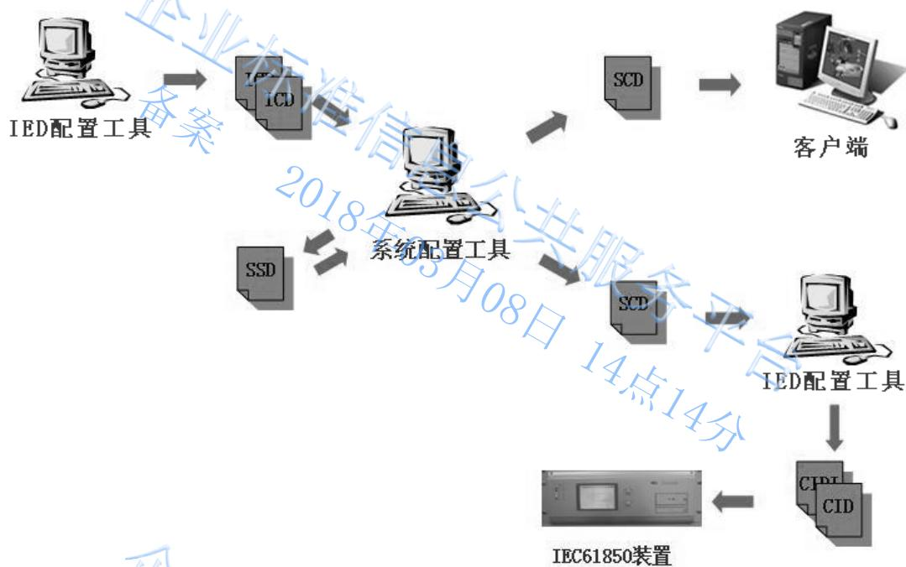
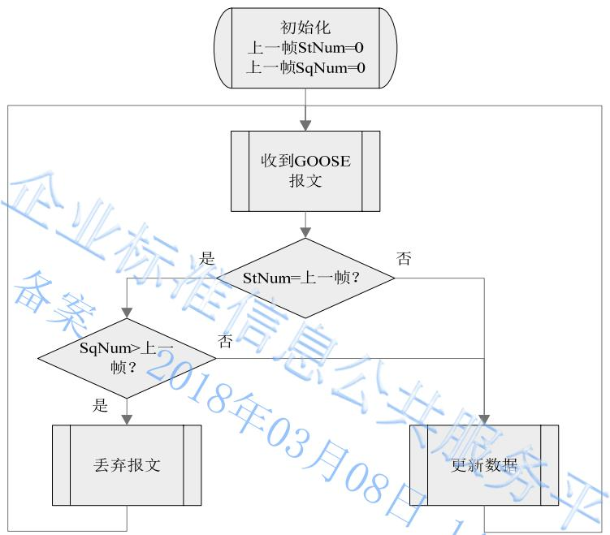
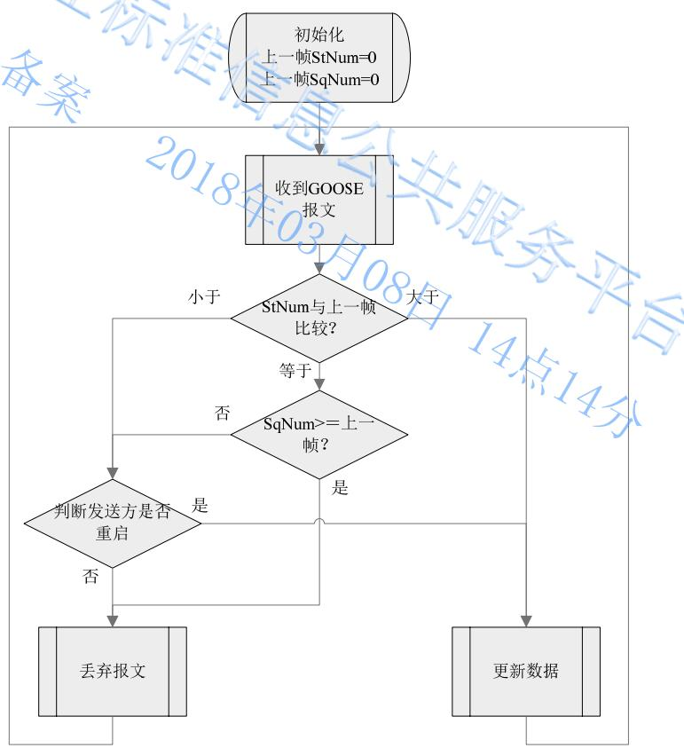
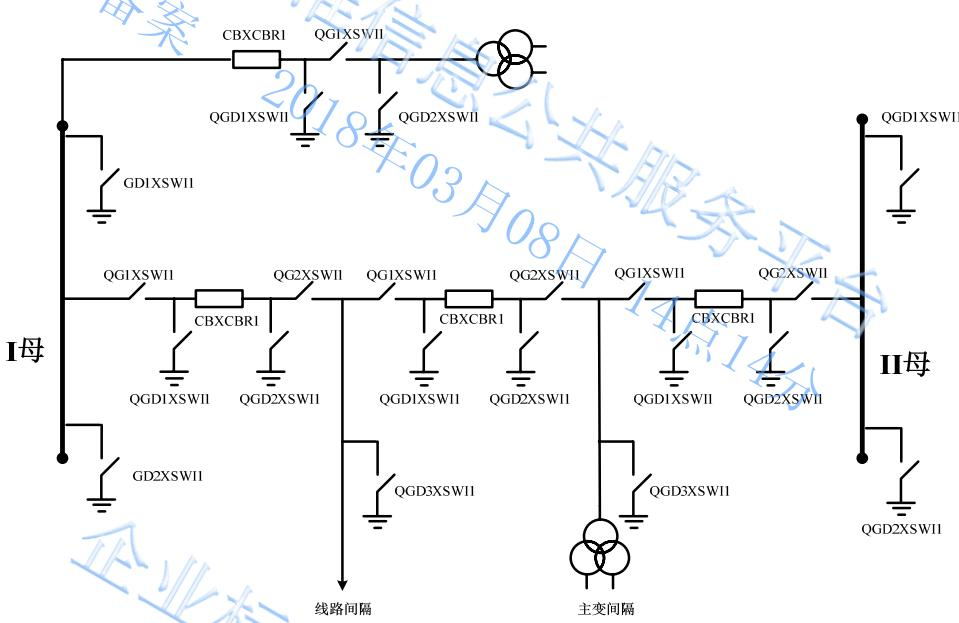
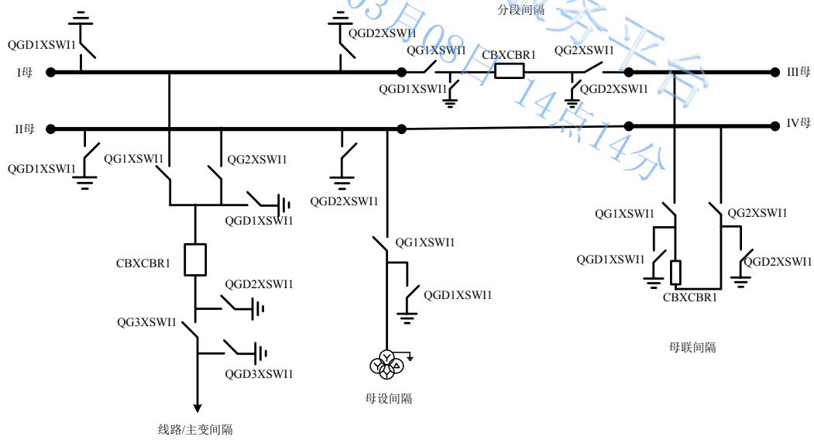
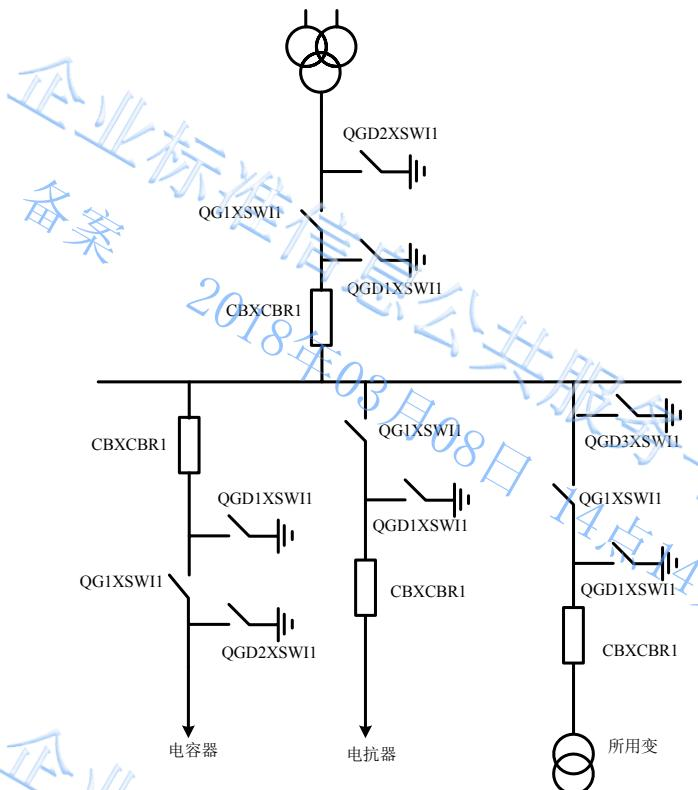
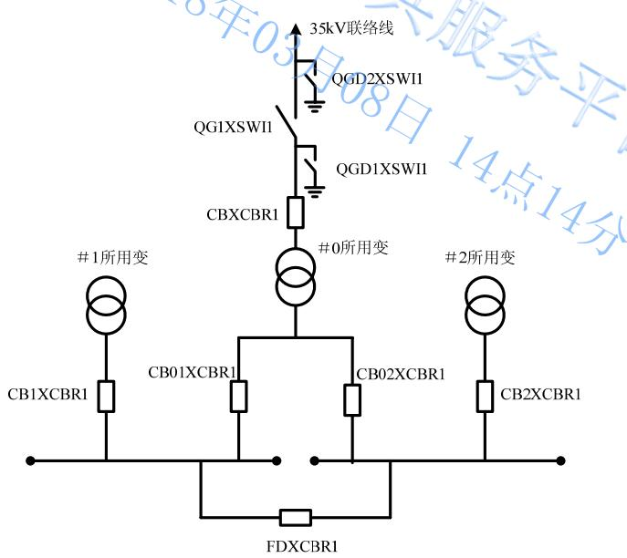

# 国家电网公司企业标准

Q / GDW 1396 — 2012 

# IEC 61850 工程继电保护应用模型

# Data Model of Protection Relay in Project Based on IEC61850

2014-05-01发布

2014-05-01实施

国家电网公司 发 布


## 目 次

目次 …… I
前言 …… II
1 范围 …… 1
2 规范性引用文件 …… 1
3 术语和定义 …… 1
4 缩略语 …… 1
5 总则 …… 2
6 配置 …… 2
7 IED 应用模型规范 …… 5
8 服务实现原则 …… 20
9 MMS 双网冗余机制 …… 24
10 GOOSE 模型和实施规范 …… 24
11 SV 模型和实施规范 …… 27
12 IED 物理端口描述规范 …… 28
13 检修处理机制 …… 29
附录 A （规范性附录）逻辑节点类定义 1 …… 30
附录 B （规范性附录）逻辑节点类定义 2 …… 45
附录 C （规范性附录）统一扩充公用数据类 …… 60
附录 D （规范性附录）统一定义的数据类型和数据属性类型 …… 61
附录 E （规范性附录）故障报告文件格式 …… 80
附录 F （规范性附录）服务一致性要求 …… 84
附录 G （规范性附录）过程层虚端子 CRC 校验码生成规则 …… 87
附录 H （资料性附录）设备逻辑节点前缀示例 …… 93
附录 I （资料性附录）逻辑节点前缀命名示例 …… 95
附录 J （资料性附录）IED 物理端口描述及站控层双网配置示例 …… 96
编制说明 …… 99

## 前 言

为规范 IEC 61850 变电站通信网络和系统国际标准的应用，实现各制造厂商设备的互操作性，提高IEC 61850 标准设备生产、调试、检修、运行的便利性，特制定 IEC 61850 工程应用模型。

本标准规定了对 IEC 61850 标准设备建模的具体要求，为国家电网公司范围内应用的 IEC 61850 标准设备提供统一的技术规范。

DL/T 860 为等同采用 IEC 61850 标准的国家标准，本标准文本使用 IEC 61850 处，不另标注 DL/T860。

本标准附录 A、附录 B、附录 C、附录 D、附录 E、附录 F、附录 G 为规范性附录，附录 H、附录I、附录 J 为资料性附录。

本标准由国家电力调度控制中心提出并解释。

本标准由国家电网公司科技部归口。

本标准起草单位：浙江省电力公司、国家电力调度控制中心、国家电网华东分部、国家电网华北分部、山东电力集团公司、南京南瑞继保电气有限公司、北京四方继保自动化股份有限公司、许继电气股份有限公司、国电南京自动化股份有限公司、长园深瑞继保自动化有限公司、中国电力科学研究院、国网电力科学研究院。

本标准主要起草人：马锁明、刘宇、裘愉涛、王松、邱智勇、潘武略、王宁、马杰、曹卫国、任雁铭、廖泽友、姚亮、陈远生、李仲青、梅德冬、叶刚进。

本标准 2010年 2 月首次发布，2012年 11 月第一次修订。

# IEC 61850 工程继电保护应用模型

## 1 范围

本标准规定了变电站应用 IEC 61850 标准时变电站通信网络和系统的配置、模型和服务，规定了功能、语法、语义的统一性以及选用参数的规范性，并规定了在实际应用中扩充模型应遵循的原则。

本标准适用于国家电网公司采用 IEC 61850 标准的新建变电站自动化系统的工程设计及应用，改造工程参照执行。

## 2 规范性引用文件

下列文件对于本文件的应用是必不可少的。凡是注日期的引用文件，仅注日期的版本适用于本文件。凡是不注日期的引用文件，其最新版本（包括所有的修改单）适用于本文件。

DL/T 860 变电站通信网络和系统

DL/T 1146 DL/T 860 实施技术规范

Q/GDW 161 线路保护及辅助装置标准化设计规范

Q/GDW 175 变压器、高压并联电抗器和母线保护及辅助装置标准化设计规范

Q/GDW XXX-2012 智能变电站继电保护通用技术条件

## 3 术语和定义

DL/T 860 界定立的以及下列术语和定义适用于本文件。

## 3.1

## 客户端 client

请求服务器提供服务，或接受服务器主动传输数据的实体，如监控系统等。

## 3.2

## GOOSE

基于发布/订阅机制，快速和可靠地交换数据集中的通用变电站事件数据值的相关模型对象和服务，以及这些模型对象和服务到 ISO/IEC8802-3 帧之间的映射。

## 3.3

## SV

，以及这些模型对象和服务到 ISO/IEC8802-3 帧之间的映射。

## 3.4

## 虚端子 virtual terminator

描述 IED 设备的 GOOSE、SV 输入、输出信号连接点的总称，用以标识过程层、间隔层及其之间联系的二次回路信号，等同于传统变电站的屏端子。

## 4 缩略语

下列缩略语适用于本文件。

Acc Accelerate（加速）

BF Breaker failure（断路器失灵）

BRCB Buffered Report Control Block （有缓存报告控制块)

CID Configured IED Description（IED 实例配置文件）

CT Current transformer（电流互感器）

Dev Device（设备）

Err Error（错误）

Fst First（第一个）

GOOSE，GO Generic object oriented substation events（面向通用对象的变电站事件）

IED Intelligent Electronic Device（智能电子设备）

ICD IED Capability Description（IED 能力描述文件）

Long Long（长期的）

OC Over current（过电流）

OV Over voltage（过电压）

Pers Persist, persistent（持续性的）

Pmt Permit, permitted（许可）

PT Potential Transformer（电压互感器）

SCD Substation Configuration Description（全站系统配置文件）

Sig Signal（信号）

SSD System Specification Description（系统规格文件）

Strp Strap（压板）

SV Sampled value（采样值）

URCB Unbuffered Report Control Block （无缓存报告控制块)

UV Under voltage（欠电压）

## 5 总则

5.1 本标准严格遵循 IEC 61850 标准，是 IEC 61850 标准的细化和补充，规范了 IEC 61850 标准中不明确的部分。

5.2 本标准统一了 IEC 61850 标准应用的数据类型定义，避免因各制造厂商数据类型不统一引起的数据类型冲突，避免因各种数据类型支持不同导致的实施困难。

5.3 本标准统一了几种典型类型的设备所包含的逻辑节点的列表，对于一个包含多个虚拟设备的装置，该装置的各个虚拟设备应参照对应类型的设备的逻辑节点列表进行建模。

5.4 本标准以 Q/GDW 161、Q/GDW 175 为基础扩充了各种保护所包含的逻辑节点和逻辑节点中的数据对象。

5.5 本标准对 GOOSE 和 SV的模型、配置和传输等方面进行了规范。

## 6 配置

## 6.1 基本流程

配置流程应按 DL/T 1146 执行，具体见图 1。

## 6.2 ICD 文件基本要求

a） ICD 文件应包含模型自描述信息。如 LD 和 LN 实例应包含中文“desc”属性，实例化的 DOI应包含中文“desc”和dU赋值；

b） ICD 文件应按照工程远景规模配置实例化的 DOI 元素。ICD 文件中数据对象实例 DOI 应包含

中文的“desc”描述和 dU属性赋值，两者应一致并能完整表达该数据对象具体意义；

c） ICD 文件应明确包含制造商（manufacturer）、型号（type）、配置版本（configVersion）等信息，增加“铭牌”等信息并支持在线读取；

d） ICD 文件中可包含定值相关数据属性如“units”、“stepSize”、“minVal”和“maxVal”等配置实例，客户端应支持在线读取这些定值相关数据属性。




图 1 变电站配置流程图


## 6.3 配置文件版本管理

a） 系统配置工具应在保存文件时提示用户保存详细配置历史记录并自动保存，同时自动生成全站虚端子配置 CRC 版本和 IED 虚端子配置 CRC 版本并自动保存；

b） 系统配置工具应能自动生成 SCD 文件版本（version）、SCD 文件修订版本（revision）和生成时间（when），修改人（who）、修改什么（what）和修改原因（why）可由用户填写。文件版本从 1.0 开始，当文件增加了新的 IED 或某个 IED 模型实例升级时，以步长 0.1 向上累加；文件修订版本从 1.0 开始，当文件做了通信配置、参数、描述修改时，以步长 0.1 向上累加，文件版本增加时，文件修订版本清零；

c） 系统配置工具应根据附录 G 生成 IED 虚端子配置 CRC 版本并生成（或替换）相应 IED 中的Private（type="IED virtual terminal conection CRC"）元素，例如：

```html
<IED type="XX" manufacturer="XX" name="XX" configVersion="1.0">
    <Private type="IED virtual terminal convection CRC">EF012345</Private>
    <Services/>
    <AccessPoint/>
...... 
```

</IED> 

d） 系统配置工具应根据附录 G生成全站虚端子配置 CRC 版本并生成（或替换）SCL 中的 Private（type="Substation virtual terminal conection CRC"）元素，例如：<SCL >

```txt
DW 1396—2012
<Private type="Substation virtual terminal convection CRC">ABCDEF01</Private>
<Header/>
...
</SCL> 
```

e） IED 配置工具在下装过程层虚端子配置时应自动提取全站过程层虚端子配置 CRC 版本和 IED过程层虚端子配置 CRC 版本，下装到装置并可通过人机界面查看。

## 6.4 Substation 配置

Substation 部分从功能的角度描述开关场的导电设备、基于电气接线图的连接（拓扑）、说明设备和功能，是基于变电站功能结构的对象分层。其主要包括的对象模型：变电站，电压等级，变压器，间隔，设备，子设备，连接节点，端点等。

a） 系统配置工具宜支持图形化的方式配置全站的电气接线图到 substation 部分；

b） 系统配置工具应支持将逻辑节点关联到一次设备。

## 6.5 Communication 配置

## 6.5.1 总体配置原则

a） 子网（SubNetwork）是 IED 模型的逻辑连接，全站子网宜划分成站控层和过程层两个子网，命名分别为“Subnetwork_Stationbus”和“Subnetwork_Processbus”；

b） 冗余的站控层网络，宜在 IED 中采用 ServerAt 元素，具体见 11.2 节。

## 6.5.2 GSE 配置

a） 系统配置工具应限制 APPID 为 4 位 16 进制值，范围从 0000 到 3FFF；

b） 系统配置工具应限制 VLAN-ID 为 3 位 16 进制值；

c） MinTime 和 MaxTime 的典型数值宜为 2ms 和 5000ms。

## 6.5.3 SMV 配置

a） 系统配置工具应限制 APPID 为 4 位 16 进制值，范围从 4000 到 7FFF；

b） 系统配置工具应限制 VLAN-ID 为 3 位 16 进制值。

## 6.6 IED 配置

a） 系统配置工具导入 ICD 文件时不应修改 ICD 文件模型实例的任何参数；

b） 系统配置工具导入 ICD 文件时应能检测模版冲突；

c） 系统配置工具导入 ICD 文件时保留厂家私有命名空间及其元素；

d） 系统配置工具应支持数据集及其成员配置；

e） 系统配置工具应支持 GOOSE 控制块、报告控制块、采样值控制块、日志控制块及相关配置参数配置；

f） 系统配置工具应支持 GOOSE 和 SV 虚端子配置；

g） 系统配置工具应支持 ICD 文件中功能约束为 CF 和 DC 的实例化数据属性值配置。

## 6.7 装置下装

a） IED 配置工具应支持从 SCD 文件自动导出相关 CID 文件和 IED 过程层虚端子配置文件，这两种文件可分开下装；

b） IED 配置文件下装工具操作应简单、可靠，宜从站控层通信接口下装所有配置文件；

c） CID 文件和 IED 过程层虚端子配置文件下装时装置应采取确认机制防止误下装；

d） 下装工具在下装前宜能自动对比显示装置内部虚端子联系和待下装配置的区别并显示给用户查看。

7 IED 应用模型规范

## 7.1 总体建模原则

## 7.1.1 物理设备建模（IED）原则

一个物理设备，应建模为一个 IED 对象。该对象是一个容器，包含 server对象，server对象中至少包含一个 LD 对象，每个 LD 对象中至少包含 3 个LN 对象：LLN0、LPHD、其他应用逻辑接点。

一配置。

## 7.1.2 服务器（Server）建模原则

服务器描述了一个设备外部可见（可访问）的行为，每个服务器至少应有一个访问点（AccessPoint）。访问点体现通信服务，与具体物理网络无关。一个访问点可以支持多个物理网口。无论物理网口是否合一，过程层GOOSE 服务与 SV服务应分访问点建模。站控层MMS 服务与GOOSE 服务（联闭锁）应统一访问点建模。

支持过程层的间隔层设备，对上与站控层设备通信，对下与过程层设备通信，应采用 3 个不同访问点分别与站控层、过程层 GOOSE、过程层 SV 进行通信。所有访问点，应在同一个 ICD 文件中体现。

## 7.1.3 逻辑设备（LD）建模原则

逻辑设备建模原则，应把某些具有公用特性的逻辑节点组合成一个逻辑设备。LD 不宜划分过多，保护功能宜使用一个 LD 来表示。SGCB 控制的数据对象不应跨 LD，数据集包含的数据对象不应跨 LD。

逻辑设备的划分宜依据功能进行，按以下几种类型进行划分：

a） 公用 LD，inst 名为“LD0”；

b） 测量 LD，inst 名为“MEAS”；

c） 保护 LD，inst 名为“PROT”；

d） 控制 LD，inst 名为“CTRL”；

e） GOOSE 过程层访问点 LD，inst 名为“PIGO”；

f） SV 过程层访问点 LD，inst 名为“PISV”；

g） 智能终端 LD，inst 名为“RPIT”（Remote Process Interface Terminal）；

h） 录波 LD，inst 名为“RCD”；

i） 合并单元 GOOSE 访问点 LD，inst 名为“MUGO”；

j） 合并单元 SV 访问点 LD，inst 名为“MUSV”。

若装置中同一类型的 LD 超过一个可通过添加两位数字尾缀，如 PIGO01、PIGO02。

## 7.1.4 逻辑节点（LN）建模原则

需要通信的每个最小功能单元建模为一个 LN 对象，属于同一功能对象的数据和数据属性应放在同一个 LN 对象中。LN 类的数据对象统一扩充。统一扩充的 LN 类，见附录 A和附录 B。

IEC 61850 标准、附录 A和附录 B 中已经定义 LN 类而且是 IED 自身完成的最小功能单元，应按照IEC 61850 标准、附录 A和附录 B 建立 LN 模型；IEC 61850 标准、附录 A和附录 B 中均已定义的 LN类，应优先选用附录 A 和附录 B 中的定义；其它没有定义或不是 IED 自身完成的最小功能单元应选用通用 LN 模型（GGIO或 GAPC），或按照本标准的原则扩充，如测控装置的断路器本体信号、主变本体信号和保护装置的非电量保护信号、稳控装置等。

## 7.1.5 逻辑节点类型（LNodeType）定义

a） 统一扩充的逻辑节点类及其数据对象类，见附录 A和附录 B，逻辑节点类型中的数据对象排序应与附录一致；

b） 其他逻辑节点类参照 IEC 61850 标准 7-4 部分，逻辑节点类型中的数据对象排序应与 IEC 61850标准 7-4 一致；

c） 自定义逻辑节点类型的名称宜增加“厂商名称_装置型号_模版版本_”前缀，厂商应确保其装置在不同型号、不同时期的模型版本不冲突。 服

## 7.1.6 数据对象类型（DOType）定义

a） 统一扩充的公用数据类，见附录 C；

b） 装置使用的数据对象类型应按附录 D 统一定义，其中数据属性排序应与附录 D 一致；

c） 附录 D统一定义的数据类型中装置未实际映射的数据属性可不上送，同时应在装置模型实现一致性声明文件中说明；

d） 附录 D 中无法表达的数据类型，各制造厂商需扩充时命名宜增加“厂商名称_装置型号_模版版本_”前缀，厂商应确保其装置在不同型号、不同时期的模型版本不冲突。

## 7.1.7 数据属性类型（DAType）定义

a） 公用数据属性类型不应扩充；

b） 保护测控功能用的数据属性类型按附录 D 统一定义，不宜自定义，其中“BDA”排序应与附录 D 一致；

c） 附录 D中无法表达的数据类型，各制造厂商需扩充时命名宜增加“厂商名称_装置型号_模版版本_”前缀，厂商应确保其装置在不同型号、不同时期的模型版本不冲突。

## 7.2 LN 实例建模

## 7.2.1 LN 实例化建模原则

a） 分相断路器和互感器建模应分相建不同的实例；

b） 同一种保护的不同段分别建不同实例，如距离保护、零序过流保护等；

c） 同一种保护的不同测量方式分别建不同实例，如相过流 PTOC 和零序过流 PTOC，分相电流差动 PDIF 和零序电流差动 PDIF 等；

d） 涉及多个时限，动作定值相同，且有独立的保护动作信号的保护功能应按照面向对象的概念划分成多个相同类型的逻辑节点，动作定值只在第一个时限的实例中映射；

e） 保护模型中对应要跳闸的每个断路器各使用一个PTRC实例。如母差保护按间隔建PTRC实例，变压器保护按每侧断路器建 PTRC实例，3/2 接线线路保护则建 2 个 PTRC 实例；

f） 保护功能软压板宜在 LLN0 中统一加Ena 后缀扩充，具体见附录 A。停用重合闸、母线功能软压板与硬压板采用或逻辑，其它均采用与逻辑；

g） GOOSE 出口软压板应按跳闸、启动失灵、闭锁重合、合闸、远传等重要信号在 PTRC、RREC、

PSCH 中统一加 Strp 后缀扩充出口软压板，从逻辑上隔离相应的信号输出，具体见附录 A；h） GOOSE、SV 接收软压板采用 GGIO.SPCSO 建模；

i） 站控层和过程层存在相关性的 LN 模型，应在两个访问点中重复出现，且两者的模型和状态应关联一致，如跳闸逻辑模型 PTRC、重合闸模型 RREC、控制模型 CSWI、联闭锁模型 CILO；

j） 常规交流测量使用 MMXU 实例，单相测量使用 MMXN 实例，不平衡测量使用 MSQI 实例；

k） 标准已定义的报警使用模型中的信号，其他的统一在 GGIO 中扩充；告警信号用 GGIO 的 Alm上送，普通遥信信号用 GGIO的 Ind 上送。

## 7.2.2 保护定值建模

a） 保护定值要求按照附录 A统一扩充。保护定值应按面向 LN 对象分散放置，一些多个 LN 公用的启动定值和功能软压板放在 LN0 下；

b） 定值单采用装置 ICD 文件中定义固定名称的定值数据集的方式。装置参数数据集名称为dsParameter，装置参数不受 SGCB 控制；装置定值数据集名称为 dsSetting。客户端根据这两个数据集获得装置定值单进行显示和整定。参数数据集 dsParameter 和定值数据集 dsSetting 由制造厂商根据定值单顺序自行在 ICD 文件中给出。定值数据集必须是 FC=SG 的定值集合；参数数据集必须是 FC=SP 的定值集合；

c） 保护当前定值区号按标准从 1 开始，保护编辑定值区号按标准从 0 开始，0 区表示当前不允许修改定值。

## 7.2.3 LN 实例化建模要求

a） 一个 LN 中的 DO若需要重复使用时，应按加阿拉伯数字后缀的方式扩充；

b） GGIO 和 GAPC 是通用输入输出逻辑节点，扩充 DO 应按 Ind1，Ind2，Ind3…；Alm1，Alm2，Alm3；SPCSO1，SPCSO2，SPCSO3…的标准方式实现；

c） DOI 实例配置如遥测系数、遥控超时时间等应支持系统组态配置；

d） 突变量保护是普通保护的实例，如突变量差动保护是 PDIF 的实例、突变量零序过流保护是PTOC 的实例、突变量距离保护是 PDIS的实例等；

e） 比例制动差动保护和差动速断保护应分别建不同的实例；

f） 复压闭锁过流使用 PVOC 模型；

g） 过励磁保护使用 PVPH 模型；

h） 非电量信号宜使用 GGIO模型；

i） 保护的启动信号建模应遵循如下要求：启动信号 Str应包含数据属性“故障方向”，若保护功能无故障方向信息，应填“unknown”值；装置的总启动信号映射到逻辑节点 PTRC 的启动信号中；IEC 61850 标准要求每个保护逻辑节点均应有启动信号，装置实际没有的可填总启动信号，也可不填；对于归并的启动信号，如后备启动，可映射到每个后备保护逻辑节点的启动信号上送，也可放在 GGIO中上送；

j） 跳闸逻辑节点 PTRC 的动作信号 Op是 PTRC 产生跳闸信号 Tr的条件，保护功能逻辑节点与断路器逻辑节点 XCBR之间应有逻辑节点 PTRC；

k） 保护装置应包含 PTRC 模型实例，PTRC 中的 Str 为保护启动信号，Op 为保护动作信号，Tr 为经保护出口软压板后的跳闸出口信号。

## 7.2.4 故障录波与故障报告模型

a） 故障录波应使用逻辑节点 RDRE 进行建模。保护装置只包含一个 RDRE 实例，专用故障录波器可包含多个 RDRE 实例，每个 RDRE 实例应位于不同的 LD 中；

b） 故障录波逻辑节点 RDRE 中的数据 RcdMade，FltNum 应配置到保护录波数据集中，通过报告服务通知客户端；

c） 保护装置录波文件存储于\COMTRADE 文件目录中，波形文件名称为：IED 名_逻辑设备名_故障序号_故障时间，其中逻辑设备名不包含 IED 名，故障序号为十进制整数，故障时间格式为年月日_时分秒_毫秒（北京时间），如20070531_172305_456。监控后台与保护信息子站等客户端应同时支持二进制和 ASCII 两种格式的 COMTRADE 文件；

d） 保护装置故障简报功能通过上送录波头文件实现，保护整组动作并完成录波后，通过报告上送故障序号 FltNum和录波完成信号 RcdMade，录波头文件放置于装置的\COMTRADE 目录下，文件名按录波文件名要求实现，客户端通过文件读取服务获得录波头文件，解析出故障简报信息。录波头文件统一采用 XML 文件格式，具体文件格式见附录 E；

e） 专用故障录波器包含多个 RDRE 实例的情况下，每个 RDRE 的录波文件、故障简报存储目录为\LD\LD 实例名\COMTRADE。

## 7.3 分类装置模型

## 7.3.1 线路保护模型

本线路保护模型主要面向 220 kV 及以上电压等级的线路保护，其它电压等级参照执行。线路保护包含下列逻辑节点，其中标注 M 的为必选、标注 O的为根据保护实现可选。


表 1 线路保护逻辑节点列表


<table><tr><td>功能类</td><td>逻辑节点</td><td>逻辑节点类</td><td>M/O</td><td>备注</td><td>LD</td></tr><tr><td rowspan="2">基本逻辑节点</td><td>管理逻辑节点</td><td>LLN0</td><td>M</td><td></td><td rowspan="19">PROT</td></tr><tr><td>物理设备逻辑节点</td><td>LPHD</td><td>M</td><td></td></tr><tr><td rowspan="7">主保护</td><td>纵联差动</td><td>PDIF</td><td>O</td><td rowspan="4">为纵联差动保护时根据保护实际实现可选</td></tr><tr><td>零序差动</td><td>PDIF</td><td>O</td></tr><tr><td>分相差动</td><td>PDIF</td><td>O</td></tr><tr><td>突变量差动</td><td>PDIF</td><td>O</td></tr><tr><td>纵联距离</td><td>PDIS</td><td>O</td><td rowspan="3">为纵联距离方向保护时必选</td></tr><tr><td>纵联方向</td><td>PDIR</td><td>O</td></tr><tr><td>纵联零序</td><td>PTOC</td><td>M</td></tr><tr><td rowspan="4">通道</td><td>纵联通道</td><td>PSCH</td><td>M</td><td></td></tr><tr><td>远传1</td><td>PSCH</td><td>O</td><td></td></tr><tr><td>远传2</td><td>PSCH</td><td>O</td><td></td></tr><tr><td>远传3</td><td>PSCH</td><td>O</td><td></td></tr><tr><td rowspan="6">后备保护</td><td>快速距离</td><td>PDIS</td><td>O</td><td></td></tr><tr><td>接地距离I段</td><td>PDIS</td><td>M</td><td></td></tr><tr><td>接地距离II段</td><td>PDIS</td><td>M</td><td></td></tr><tr><td>接地距离III段</td><td>PDIS</td><td>M</td><td></td></tr><tr><td>相间距离I段</td><td>PDIS</td><td>M</td><td></td></tr><tr><td>相间距离II段</td><td>PDIS</td><td>M</td><td></td></tr><tr><td rowspan="7">后备保护</td><td>相间距离III段</td><td>PDIS</td><td>M</td><td></td><td rowspan="7"></td></tr><tr><td>距离加速动作</td><td>PDIS</td><td>M</td><td></td></tr><tr><td>零序过流I段</td><td>PTOC</td><td>O</td><td></td></tr><tr><td>零序过流II段</td><td>PTOC</td><td>M</td><td></td></tr><tr><td>零序过流III段</td><td>PTOC</td><td>M</td><td></td></tr><tr><td>零序过流IV段</td><td>PTOC</td><td>O</td><td></td></tr><tr><td>零序过流加速定值</td><td>PTOC</td><td>M</td><td></td></tr><tr><td rowspan="4">后备保护</td><td>PT断线相电流</td><td>PTOC</td><td>M</td><td></td><td rowspan="17">PROT</td></tr><tr><td>PT断线零序过流</td><td>PTOC</td><td>M</td><td></td></tr><tr><td>零序反时限过流</td><td>PTOC</td><td>O</td><td></td></tr><tr><td>振荡闭锁</td><td>RPSB</td><td>M</td><td></td></tr><tr><td rowspan="4">过电压及就地判别功能</td><td>过电压保护</td><td>PTOV</td><td>O</td><td></td></tr><tr><td>过电压起动远跳</td><td>PTOV</td><td>O</td><td></td></tr><tr><td>远跳有判据</td><td>PTOC</td><td>O</td><td></td></tr><tr><td>远跳无判据</td><td>PTOC</td><td>O</td><td></td></tr><tr><td>保护动作</td><td>跳闸逻辑</td><td>PTRC</td><td>M</td><td></td></tr><tr><td rowspan="3">保护辅助功能</td><td>重合闸</td><td>RREC</td><td>O</td><td></td></tr><tr><td>故障定位</td><td>RFLO</td><td>M</td><td></td></tr><tr><td>故障录波</td><td>RDRE</td><td>M</td><td></td></tr><tr><td rowspan="3">保护输入接口</td><td>线路或母线电压互感器</td><td>TVTR</td><td>M</td><td></td></tr><tr><td>线路电流互感器</td><td>TCTR</td><td>M</td><td></td></tr><tr><td>保护开入</td><td>GGIO</td><td>M</td><td>可多个</td></tr><tr><td>保护自检</td><td>保护自检告警</td><td>GGIO</td><td>M</td><td>可多个</td></tr><tr><td>保护测量</td><td>保护测量</td><td>MMXU</td><td>M</td><td>可多个</td></tr><tr><td rowspan="8">保护GOOSE过程层接口</td><td>管理逻辑节点</td><td>LLN0</td><td>M</td><td></td><td rowspan="8">PIGO</td></tr><tr><td>物理设备逻辑节点</td><td>LPHD</td><td>M</td><td></td></tr><tr><td>位置输入</td><td>GGIO</td><td>O</td><td></td></tr><tr><td>其他输入</td><td>GGIO</td><td>O</td><td>可多个</td></tr><tr><td>(边断路器)出口</td><td>PTRC</td><td>O</td><td></td></tr><tr><td>(中断路器)出口</td><td>PTRC</td><td>O</td><td></td></tr><tr><td>重合闸出口</td><td>RREC</td><td>O</td><td></td></tr><tr><td>远传命令输出</td><td>PSCH</td><td>O</td><td></td></tr><tr><td rowspan="3">保护SV过程层接口</td><td>管理逻辑节点</td><td>LLN0</td><td>M</td><td>通道延时配置在LLN0下</td><td rowspan="3">PISV</td></tr><tr><td>物理设备逻辑节点</td><td>LPHD</td><td>M</td><td></td></tr><tr><td>保护电流、电压输入</td><td>GGIO</td><td>O</td><td></td></tr></table>

线路保护建模说明：

a） 充电保护、PT 断线过流保护均是 PTOC 的不同实例；

b） 远跳、远传使用 PSCH 模型，远跳、远传收发信和动作信号采用标准强制的 ProTx、ProRx、Op 信号；

c） 纵联距离保护由实例 PDIS+PSCH 组成，纵联零序保护由实例 PTOC+PSCH 组成，纵联方向保护由实例 PDIR+PSCH 组成；

d） 重合闸检同期相关定值在自动重合闸 RREC 中扩充，不单独建模。

## 7.3.2 断路器保护模型

本断路器保护模型主要面向 220 kV 及以上电压等级的断路器保护，其他电压等级参照执行。断路器保护应包含下列逻辑节点，其中标注 M 的为必选、标注 O的为根据保护实现可选。


表 2 断路器保护逻辑节点列表


<table><tr><td>功能类</td><td>逻辑节点</td><td>逻辑节点类</td><td>M/O</td><td>备注</td><td>LD</td></tr><tr><td rowspan="2">基本逻辑节点</td><td>管理逻辑节点</td><td>LLN0</td><td>M</td><td></td><td rowspan="22">PROT</td></tr><tr><td>物理设备逻辑节点</td><td>LPHD</td><td>M</td><td></td></tr><tr><td rowspan="5">失灵及跟跳</td><td>失灵跳本断路器</td><td>RBRF</td><td>M</td><td rowspan="3">包含失灵保护时需要包含的逻辑节点</td></tr><tr><td>失灵保护动作跳相邻断路器</td><td>RBRF</td><td>M</td></tr><tr><td>A相跟跳</td><td>RBRF</td><td>O</td></tr><tr><td>B相跟跳</td><td>RBRF</td><td>O</td><td rowspan="2"></td></tr><tr><td>C相跟跳</td><td>RBRF</td><td>O</td></tr><tr><td rowspan="2">失灵及跟跳</td><td>三相跟跳</td><td>RBRF</td><td>O</td><td rowspan="2"></td></tr><tr><td>两相联跳三相</td><td>RBRF</td><td>O</td></tr><tr><td rowspan="4">过流保护</td><td>过流I段</td><td>PTOC</td><td>M</td><td></td></tr><tr><td>过流II段</td><td>PTOC</td><td>M</td><td></td></tr><tr><td>零序过流</td><td>PTOC</td><td>M</td><td></td></tr><tr><td>死区保护</td><td>PTOC</td><td>O</td><td></td></tr><tr><td rowspan="4">辅助功能</td><td>三相不一致保护</td><td>PPDP</td><td>O</td><td></td></tr><tr><td>跳闸逻辑</td><td>PTRC</td><td>M</td><td></td></tr><tr><td>重合闸</td><td>RREC</td><td>O</td><td></td></tr><tr><td>故障录波</td><td>RDRE</td><td>M</td><td></td></tr><tr><td rowspan="3">保护输入接口</td><td>线路或母线电压互感器</td><td>TVTR</td><td>O</td><td></td></tr><tr><td>线路或断路器电流互感器</td><td>TCTR</td><td>M</td><td></td></tr><tr><td>保护开入</td><td>GGIO</td><td>M</td><td>可多个</td></tr><tr><td>保护自检</td><td>保护自检告警</td><td>GGIO</td><td>M</td><td>可多个</td></tr><tr><td>保护测量</td><td>保护测量</td><td>MMXU</td><td>M</td><td></td></tr><tr><td rowspan="7">保护 GOOSE 过程层接口</td><td>管理逻辑节点</td><td>LLN0</td><td>M</td><td></td><td rowspan="7">PIGO</td></tr><tr><td>物理设备逻辑节点</td><td>LPHD</td><td>M</td><td></td></tr><tr><td>位置输入</td><td>GGIO</td><td>O</td><td></td></tr><tr><td>其他输入</td><td>GGIO</td><td>O</td><td>可多个</td></tr><tr><td>本断路器跳闸出口</td><td>PTRC</td><td>O</td><td></td></tr><tr><td>相邻断路器跳闸及闭重出口</td><td>PTRC</td><td>O</td><td>可多个</td></tr><tr><td>重合闸出口</td><td>RREC</td><td>O</td><td></td></tr><tr><td rowspan="3">保护 SV 过程层接口</td><td>管理逻辑节点</td><td>LLN0</td><td>M</td><td>通道延时配置在LLN0下,也可配置GGIO接收</td><td rowspan="3">PISV</td></tr><tr><td>物理设备逻辑节点</td><td>LPHD</td><td>M</td><td></td></tr><tr><td>保护电流、电压输入</td><td>GGIO</td><td>O</td><td></td></tr></table>

## 7.3.3 变压器保护模型

本变压器保护模型主要面向 220 kV 及以上电压等级的变压器保护，其他电压等级参照执行。变压器保护应包含下列逻辑节点，其中标注 M 的为必选、标注 O的为根据保护实现可选。


表 3 变压器保护逻辑节点列表


<table><tr><td>功能类</td><td>逻辑节点</td><td>逻辑节点类</td><td>M/O</td><td>备注</td><td>LD</td></tr><tr><td rowspan="2">基本逻辑节点</td><td>管理逻辑节点</td><td>LLN0</td><td>M</td><td></td><td rowspan="15">PROT</td></tr><tr><td>物理设备逻辑节点</td><td>LPHD</td><td>M</td><td></td></tr><tr><td rowspan="7">差动保护</td><td>比率差动动作</td><td>PDIF</td><td>M</td><td rowspan="5"></td></tr><tr><td>差动速断动作</td><td>PDIF</td><td>M</td></tr><tr><td>工频变化量差动</td><td>PDIF</td><td>O</td></tr><tr><td>零序差动保护</td><td>PDIF</td><td>O</td></tr><tr><td>分侧差动保护</td><td>PDIF</td><td>O</td></tr><tr><td>小区差动</td><td>PDIF</td><td>O</td><td></td></tr><tr><td>分相差动</td><td>PDIF</td><td>O</td><td></td></tr><tr><td rowspan="2">高压侧后备保护</td><td>相间阻抗1时限动作</td><td>PDIS</td><td>M</td><td rowspan="2">500kV变压器</td></tr><tr><td>相间阻抗2时限动作</td><td>PDIS</td><td>M</td></tr><tr><td rowspan="4">高压侧后备保护</td><td>接地阻抗1时限动作</td><td>PDIS</td><td>M</td><td rowspan="2">500kV变压器</td></tr><tr><td>接地阻抗2时限动作</td><td>PDIS</td><td>M</td></tr><tr><td>复压闭锁过流I段1时限</td><td>PVOC</td><td>M</td><td rowspan="2">220kV变压器</td></tr><tr><td>复压闭锁过流I段2时限</td><td>PVOC</td><td>M</td></tr><tr><td rowspan="8">高压侧后备保护</td><td>高压侧复压闭锁过流II段</td><td>PVOC</td><td>M</td><td rowspan="8"></td><td rowspan="15"></td></tr><tr><td>零序过流I段1时限</td><td>PTOC</td><td>M</td></tr><tr><td>零序过流I段2时限</td><td>PTOC</td><td>M</td></tr><tr><td>零序过流II段</td><td>PTOC</td><td>M</td></tr><tr><td>间隙零序过压保护</td><td>PTOV</td><td>O</td></tr><tr><td>间隙零序过流保护</td><td>PTOC</td><td>O</td></tr><tr><td>失灵联跳</td><td>RBRF</td><td>O</td></tr><tr><td>过负荷告警</td><td>PTOC</td><td>O</td></tr><tr><td rowspan="7">中压侧后备保护</td><td>相间阻抗1时限动作</td><td>PDIS</td><td>M</td><td rowspan="4">500kV变压器</td></tr><tr><td>相间阻抗2时限动作</td><td>PDIS</td><td>M</td></tr><tr><td>接地阻抗1时限动作</td><td>PDIS</td><td>M</td></tr><tr><td>接地阻抗2时限动作</td><td>PDIS</td><td>M</td></tr><tr><td>复压闭锁过流I段1时限</td><td>PVOC</td><td>M</td><td rowspan="3">220kV变压器</td></tr><tr><td>复压闭锁过流I段2时限</td><td>PVOC</td><td>M</td></tr><tr><td>复压闭锁过流II段</td><td>PVOC</td><td>M</td></tr><tr><td rowspan="7">中压侧后备保护</td><td>零序过流I段1时限</td><td>PTOC</td><td>M</td><td rowspan="6">220kV变压器</td><td rowspan="18">PROT</td></tr><tr><td>零序过流I段2时限</td><td>PTOC</td><td>M</td></tr><tr><td>零序过流II段</td><td>PTOC</td><td>M</td></tr><tr><td>间隙零序过压保护</td><td>PTOV</td><td>O</td></tr><tr><td>间隙零序过流保护</td><td>PTOC</td><td>O</td></tr><tr><td>失灵联跳</td><td>RBRF</td><td>O</td></tr><tr><td>过负荷告警</td><td>PTOC</td><td>O</td><td></td></tr><tr><td rowspan="5">低压侧后备保护</td><td>过流1时限</td><td>PTOC</td><td>M</td><td rowspan="5">500kV变压器220kV变压器,可多个分支</td></tr><tr><td>过流2时限</td><td>PTOC</td><td>M</td></tr><tr><td>过流3时限</td><td>PTOC</td><td>O</td></tr><tr><td>复压闭锁过流1时限</td><td>PVOC</td><td>M</td></tr><tr><td>复压闭锁过流2时限</td><td>PVOC</td><td>M</td></tr><tr><td rowspan="2">低压侧后备保护</td><td>复压闭锁过流3时限</td><td>PVOC</td><td>O</td><td rowspan="2"></td></tr><tr><td>过负荷告警</td><td>PTOC</td><td>O</td></tr><tr><td rowspan="2">公共绕组模块</td><td>中性点零流保护动作</td><td>PTOC</td><td>O</td><td></td></tr><tr><td>公共绕组过负荷告警</td><td>PTOC</td><td>O</td><td></td></tr><tr><td rowspan="2">过励磁保护</td><td>定时限过励磁告警</td><td>PVPH</td><td>M</td><td rowspan="2">500kV变压器</td></tr><tr><td>反时限过励磁保护</td><td>PVPH</td><td>M</td></tr><tr><td rowspan="2">辅助功能</td><td>跳闸逻辑</td><td>PTRC</td><td>M</td><td>可多个</td><td rowspan="7"></td></tr><tr><td>故障录波</td><td>RDRE</td><td>M</td><td></td></tr><tr><td rowspan="2">保护输入接口</td><td>电压互感器</td><td>TVTR</td><td>M</td><td>可多个</td></tr><tr><td>电流互感器</td><td>TCTR</td><td>M</td><td>可多个</td></tr><tr><td>保护输入接口</td><td>保护开入</td><td>GGIO</td><td>M</td><td>可多个</td></tr><tr><td>保护自检</td><td>保护自检告警</td><td>GGIO</td><td>M</td><td>可多个</td></tr><tr><td>保护测量</td><td>保护测量</td><td>MMXU</td><td>M</td><td>可多个</td></tr><tr><td rowspan="5">保护 GOOSE 过程层接口</td><td>管理逻辑节点</td><td>LLN0</td><td>M</td><td></td><td rowspan="5">PIGO</td></tr><tr><td>物理设备逻辑节点</td><td>LPHD</td><td>M</td><td></td></tr><tr><td>失灵联跳输入</td><td>GGIO</td><td>O</td><td></td></tr><tr><td>断路器跳闸及起失灵出口及解除失灵电压闭锁</td><td>PTRC</td><td>M</td><td>可多个</td></tr><tr><td>风冷或闭锁调压出口</td><td>GGIO</td><td>O</td><td></td></tr><tr><td rowspan="3">保护 SV 过程层接口</td><td>管理逻辑节点</td><td>LLN0</td><td>M</td><td>通道延时配置在LLN0下,也可配置GGIO接收</td><td rowspan="3">PISV</td></tr><tr><td>物理设备逻辑节点</td><td>LPHD</td><td>M</td><td></td></tr><tr><td>各侧保护电流、电压输入</td><td>GGIO</td><td>O</td><td></td></tr></table>

## 7.3.4 母线保护模型

本母线保护模型主要面向 220 kV 及以上电压等级的母线保护，其他电压等级参照执行。母线保护应包含下列逻辑节点，其中标注 M 的为必选、标注 O 的为根据保护实现可选。


表 4 母线保护逻辑节点列表


<table><tr><td>功能类</td><td>逻辑节点</td><td>逻辑节点类</td><td>M/O</td><td>备注</td><td>LD</td></tr><tr><td rowspan="2">基本逻辑节点</td><td>管理逻辑节点</td><td>LLN0</td><td>M</td><td></td><td rowspan="8">PROT</td></tr><tr><td>物理设备逻辑节点</td><td>LPHD</td><td>M</td><td></td></tr><tr><td rowspan="2">差动保护</td><td>变化量差动保护</td><td>PDIF</td><td>M</td><td rowspan="2">根据保护的母线数量可多个</td></tr><tr><td>稳态量差动保护</td><td>PDIF</td><td>M</td></tr><tr><td rowspan="4">母线相关逻辑节点</td><td>母线失灵动作</td><td>RBRF</td><td>M</td><td>根据保护的母线数量可多个</td></tr><tr><td>母线电压互感器</td><td>TVTR</td><td>O</td><td>根据保护的母线数量可多个</td></tr><tr><td>母线电压测量</td><td>MMXU</td><td>O</td><td>根据保护的母线数量可多个</td></tr><tr><td>母线差动电流测量</td><td>MMXU</td><td>O</td><td></td></tr><tr><td rowspan="2">间隔相关逻辑节点</td><td>断路器失灵保护</td><td>RBRF</td><td>M</td><td>根据母线所连断路器数应为多个</td><td rowspan="11"></td></tr><tr><td>间隔跳闸逻辑</td><td>PTRC</td><td>M</td><td>根据母线所连断路器数应为多个</td></tr><tr><td rowspan="4">间隔相关逻辑节点</td><td>间隔开入</td><td>GGIO</td><td>M</td><td>根据母线所连断路器数应为多个</td></tr><tr><td>间隔电流互感器</td><td>TCTR</td><td>M</td><td>根据母线所连断路器数应为多个</td></tr><tr><td>间隔模拟量测量</td><td>MMXU</td><td>M</td><td>根据母线所连断路器数应为多个</td></tr><tr><td>间隔软压板</td><td>GGIO</td><td>O</td><td>GOOSE失灵开入软压板、刀闸强制位置软压板、SV接收软压板等</td></tr><tr><td>主变失灵联跳</td><td>主变失灵联跳</td><td>PTRC</td><td>O</td><td>根据主变数量应为多个</td></tr><tr><td rowspan="3">辅助功能</td><td>保护动作</td><td>PTRC</td><td>M</td><td></td></tr><tr><td>基准电流互感器</td><td>TCTR</td><td>O</td><td></td></tr><tr><td>故障录波</td><td>RDRE</td><td>M</td><td></td></tr><tr><td>保护自检</td><td>保护自检告警</td><td>GGIO</td><td>M</td><td>可多个</td></tr><tr><td rowspan="4">保护GOOSE过程层接口</td><td>管理逻辑节点</td><td>LLN0</td><td>M</td><td></td><td rowspan="4">PIGO</td></tr><tr><td>物理设备逻辑节点</td><td>LPHD</td><td>M</td><td></td></tr><tr><td>间隔位置输入</td><td>GGIO</td><td>O</td><td>根据母线所连断路器数应为多个,宜支持单点和双点位置输入</td></tr><tr><td>间隔其他开入</td><td>GGIO</td><td>O</td><td>根据母线所连断路器数应为多个</td></tr><tr><td rowspan="2">保护GOOSE过程层接口</td><td>解除失灵电压闭锁输入</td><td>GGIO</td><td>O</td><td></td><td rowspan="2">PIGO</td></tr><tr><td>间隔跳闸、闭重、起失灵出口</td><td>PTRC</td><td>M</td><td>根据母线所连断路器数应为多个</td></tr><tr><td rowspan="3">保护SV过程层接口</td><td>管理逻辑节点</td><td>LLN0</td><td>M</td><td>通道延时配置在LLN0下,也可配置GGIO接收</td><td rowspan="3">PISV</td></tr><tr><td>物理设备逻辑节点</td><td>LPHD</td><td>M</td><td></td></tr><tr><td>保护电流、电压输入</td><td>GGIO</td><td>O</td><td></td></tr></table>

母差保护建模说明：母差保护应按照面向对象的原则为每个间隔相应逻辑节点建模。如母差保护内含失灵保护，母差保护每个间隔单独建 RBFR实例，用于不同间隔的失灵保护。失灵保护逻辑节点中包含复压闭锁功能。

## 7.3.5 电抗器保护模型

本电抗器保护模型主要面向 220 kV 及以上电压等级的并联电抗器保护。电抗器保护应包含下列逻辑节点，其中标注 M 的为必选、标注 O的为根据保护实现可选。


表 5 电抗器保护逻辑节点列表


<table><tr><td>功能类</td><td>逻辑节点</td><td>逻辑节点类</td><td>M/O</td><td>备注</td><td>LD</td></tr><tr><td rowspan="2">基本逻辑节点</td><td>管理逻辑节点</td><td>LLN0</td><td>M</td><td></td><td rowspan="18">PROT</td></tr><tr><td>物理设备逻辑节点</td><td>LPHD</td><td>M</td><td></td></tr><tr><td rowspan="5">差动保护</td><td>差动速断</td><td>PDIF</td><td>M</td><td rowspan="5"></td></tr><tr><td>差动保护</td><td>PDIF</td><td>M</td></tr><tr><td>工频变化量差动</td><td>PDIF</td><td>O</td></tr><tr><td>零序差动保护</td><td>PDIF</td><td>M</td></tr><tr><td>零序差动速断保护</td><td>PDIF</td><td>O</td></tr><tr><td>匝间保护</td><td>匝间保护</td><td>PDUP</td><td>M</td><td>考虑基本原理零序功率方向,选用PDUP节点</td></tr><tr><td rowspan="5">过流保护</td><td>零序过流保护</td><td>PTOC</td><td>M</td><td rowspan="5"></td></tr><tr><td>主电抗过电流</td><td>PTOC</td><td>M</td></tr><tr><td>小电抗过电流</td><td>PTOC</td><td>M</td></tr><tr><td>主电抗过负荷</td><td>PTOC</td><td>M</td></tr><tr><td>小电抗过负荷</td><td>PTOC</td><td>M</td></tr><tr><td rowspan="2">辅助功能</td><td>跳闸逻辑</td><td>PTRC</td><td>M</td><td></td></tr><tr><td>故障录波</td><td>RDRE</td><td>M</td><td></td></tr><tr><td rowspan="2">保护输入接口</td><td>电压互感器</td><td>TVTR</td><td>M</td><td>可多个</td></tr><tr><td>电流互感器</td><td>TCTR</td><td>M</td><td>可多个</td></tr><tr><td>保护输入接口</td><td>保护开入</td><td>GGIO</td><td>M</td><td>可多个</td></tr><tr><td>保护自检</td><td>保护自检告警</td><td>GGIO</td><td>M</td><td>可多个</td><td rowspan="2">PROT</td></tr><tr><td>保护测量</td><td>保护测量</td><td>MMXU</td><td>M</td><td>可多个</td></tr><tr><td rowspan="3">GOOSE接口</td><td>管理逻辑节点</td><td>LLN0</td><td>M</td><td></td><td rowspan="3">PIGO</td></tr><tr><td>物理设备逻辑节点</td><td>LPHD</td><td>M</td><td></td></tr><tr><td>断路器跳闸</td><td>PTRC</td><td>M</td><td></td></tr><tr><td rowspan="3">SV接口</td><td>管理逻辑节点</td><td>LLN0</td><td>M</td><td></td><td rowspan="3">PISV</td></tr><tr><td>物理设备逻辑节点</td><td>LPHD</td><td>M</td><td></td></tr><tr><td>采样值输入</td><td>GGIO</td><td>M</td><td>首端三相电流、末端三相电流、中性点电流、线路PT</td></tr></table>

## 7.3.6 测控装置模型

本测控模型主要面向 220 kV 及以上电压等级的断路器对象，其它电压等级及母设测控、变压器本体测控参照执行。断路器测控装置应包含下列逻辑节点，其中标注 M 的为必选、标注 O 的为根据需要可选。


表 6 测控装置逻辑节点列表


<table><tr><td>功能类</td><td>逻辑节点</td><td>逻辑节点类</td><td>M/O</td><td>备注</td><td>LD</td></tr><tr><td rowspan="2">基本逻辑节点</td><td>管理逻辑节点</td><td>LLN0</td><td>M</td><td></td><td rowspan="19">CTRL</td></tr><tr><td>物理设备逻辑节点</td><td>LPHD</td><td>M</td><td></td></tr><tr><td>断路器控制</td><td>断路器分合含无压合</td><td>CSWI</td><td>O</td><td>站控层设备与间隔层测控的控制交互模型</td></tr><tr><td rowspan="2">隔离开关控制</td><td>隔离开关控制</td><td>CSWI</td><td>O</td><td>可多个</td></tr><tr><td>接地开关控制</td><td>CSWI</td><td>O</td><td>可多个</td></tr><tr><td rowspan="4">断路器过程层接口</td><td>总断路器</td><td>XCBR</td><td>O</td><td></td></tr><tr><td>A相断路器</td><td>XCBR</td><td>O</td><td></td></tr><tr><td>B相断路器</td><td>XCBR</td><td>O</td><td></td></tr><tr><td>C相断路器</td><td>XCBR</td><td>O</td><td></td></tr><tr><td rowspan="2">隔离开关过程层接口</td><td>隔离开关</td><td>XSWI</td><td>O</td><td>可多个</td></tr><tr><td>接地开关</td><td>XSWI</td><td>O</td><td>可多个</td></tr><tr><td rowspan="3">备用控制</td><td>备用1</td><td>CSWI</td><td>O</td><td></td></tr><tr><td>备用2</td><td>CSWI</td><td>O</td><td></td></tr><tr><td>备用3</td><td>CSWI</td><td>O</td><td></td></tr><tr><td rowspan="3">联锁功能</td><td>隔离开关联锁</td><td>CILO</td><td>O</td><td>可多个</td></tr><tr><td>接地开关联锁</td><td>CILO</td><td>O</td><td>可多个</td></tr><tr><td>备用联锁</td><td>CILO</td><td>O</td><td>可多个</td></tr><tr><td rowspan="2">其他</td><td>开入</td><td>GGIO</td><td>O</td><td>可多个</td></tr><tr><td>告警</td><td>GGIO</td><td>O</td><td>可多个</td></tr><tr><td rowspan="2">基本逻辑节点</td><td>管理逻辑节点</td><td>LLN0</td><td>M</td><td></td><td rowspan="8">MEAS</td></tr><tr><td>物理设备逻辑节点</td><td>LPHD</td><td>M</td><td></td></tr><tr><td rowspan="3">测量</td><td>间隔测量</td><td>MMXU</td><td>M</td><td></td></tr><tr><td>同期电压频率</td><td>MMXN</td><td>M</td><td>根据同期需要可多个</td></tr><tr><td>通用模拟量</td><td>GGIO</td><td>O</td><td>可多个</td></tr><tr><td rowspan="3">互感器输入</td><td>母线电压</td><td>TVTR</td><td>M</td><td>可多个</td></tr><tr><td>线路电压</td><td>TVTR</td><td>M</td><td>可多个</td></tr><tr><td>线路电流</td><td>TCTR</td><td>M</td><td>可多个</td></tr><tr><td rowspan="2">基本逻辑节点</td><td>管理逻辑节点</td><td>LLN0</td><td>M</td><td></td><td rowspan="9">PIGO</td></tr><tr><td>物理设备逻辑节点</td><td>LPHD</td><td>M</td><td></td></tr><tr><td rowspan="7">测控 GOOSE 过程层接口</td><td>GOOSE 位置输入</td><td>GGIO</td><td>O</td><td></td></tr><tr><td>GOOSE 开入</td><td>GGIO</td><td>O</td><td></td></tr><tr><td>GOOSE 模拟量输入</td><td>GGIO</td><td>O</td><td></td></tr><tr><td>GOOSE 输出</td><td>GGIO</td><td>O</td><td></td></tr><tr><td>GOOSE 联锁输出</td><td>CILO</td><td>O</td><td>可多个</td></tr><tr><td>断路器分合</td><td>CSWI</td><td>M</td><td rowspan="2">间隔层测控与过程层智能设备的GOOSE 控制和位置接收模型,可多个</td></tr><tr><td>隔离开关分合</td><td>CSWI</td><td>M</td></tr><tr><td rowspan="2">基本逻辑节点</td><td>管理逻辑节点</td><td>LLN0</td><td>M</td><td></td><td rowspan="3">PISV</td></tr><tr><td>物理设备逻辑节点</td><td>LPHD</td><td>M</td><td></td></tr><tr><td>测控 SV 过程层接口</td><td>测控电流、电压</td><td>GGIO</td><td>O</td><td>多个</td></tr><tr><td rowspan="2">基本逻辑节点</td><td>管理逻辑节点</td><td>LLN0</td><td>M</td><td></td><td rowspan="4">LD0可选</td></tr><tr><td>物理设备逻辑节点</td><td>LPHD</td><td>M</td><td></td></tr><tr><td rowspan="2">其他</td><td>开入</td><td>GGIO</td><td>O</td><td>可多个</td></tr><tr><td>告警</td><td>GGIO</td><td>O</td><td>可多个</td></tr></table>

## 测控装置建模说明：

a） 断路器使用 XCBR 实例，隔离开关使用 XSWI 实例，两者的控制均使用 CSWI 实例；

b） 断路器控制模型无压合、有压合、合环合宜采用在 CSWI 中扩充定值设置同期控制模式定值（SP）的方式实现，客户端在控制断路器前应确认或设置 CSWI 同期模式。check的sync 位区分同期合与强制合，强制合不单独建实例，check 类型不应扩充；

c） 其它控制功能如小电流接地试跳，根据采用单点或双点模型，分别使用 GAPC 实例的 SPCSO数据或 DPCSO 数据；

d） 控制模型的数据类型如 SBOw、Oper、Cancel 统一定义，具体见附录 D；

e） 遥控返回的原因代码应按标准定义统一使用；

f） 关于断路器、隔离开关模型建模分为两种情况：

1） 过程层设备智能化：测控装置中将无可选的 XCBR、XSWI 等逻辑节点。断路器逻辑节点XCBR、隔离开关逻辑节点 XSWI，将位于过程层智能设备，断路器位置、隔离开关位置采用数据对象 Pos 的数据属性 stVal 建模；间隔层测控装置通过 GOOSE 接收过程层智能设备的断路器、隔离开关的位置信息。这些位置信息在间隔层设备建模为 CSWI（与该断路器或者隔离开关的控制模型对应），采用数据对象 Pos 的数据属性 stVal，供站控层设备与间隔层设备交换信息使用；

2） 过程层设备非智能化：断路器逻辑节点 XCBR，隔离开关逻辑节点 XSWI，位于间隔层测控装置，断路器位置、隔离开关位置采用数据对象 Pos，数据属性 stVal 建模；对站控层设备通信，断路器、隔离开关位置信息在间隔层设备建模为 CSWI（与该断路器或者隔离开关的控制模型对应），采用数据 Pos，数据属性 stVal。由于无智能化过程层设备，故断路器、隔离开关 LN 置于间隔层设备。

g） 断路器、隔离开关接入单位置，建模分为两种情况：

1） 过程层设备智能化，具有过程层通信的情况：由过程层智能设备处理单位置到双位置的转换，建模同断路器位置接入合位和分位，具有过程层通信的模型；

2） 过程层设备非智能化，无过程层通信的情况：由间隔层智能设备处理单位置到双位置的转换，建模同断路器位置接入合位和分位，具有过程层通信的模型。

h） 隔离开关和接地开关的逻辑接点数目根据工程需求可以扩充，对于高压开关间隔应满足 4 个隔离开关、3 个接地开关的要求；

i） 变压器本体测控关于变压器档位的建模说明：测控用 ATCC，ctlModel 值宜为 1，智能终端用YLTC。对于分相的变压器档位，智能终端使用三个 YLTC 实例对应三个相别；测控装置如需分相控制建模则作为三个 ATCC 实例来建模，若不分相控制则在一个 ATCC 中扩展 TapChgA、TapChgB、TapChgC 表示分相的档位。在 ATCC 中扩展 OpHi、OpLo、OpStop 三个 DO，类型为 ACT，用于发出 GOOSE 命令；

j） 温度、湿度、直流电压等测量使用 GGIO中的 Ain 建模。

## 7.3.7 智能终端模型

本智能终端模型主要面向 220 kV 及以上电压等级的分相断路器间隔，单相断路器智能中断和母线智能终端、变压器智能终端参照执行。智能终端应包含下列逻辑节点，其中标注 M 的为必选、标注 O的为根据需要可选。


表 7 智能终端逻辑节点列表


<table><tr><td>功能类</td><td>逻辑节点</td><td>逻辑节点类</td><td>M/O</td><td>备注</td><td>LD</td></tr><tr><td rowspan="2">基本逻辑节点</td><td>管理逻辑节点</td><td>LLN0</td><td>M</td><td></td><td rowspan="7">RPIT</td></tr><tr><td>物理设备逻辑节点</td><td>LPHD</td><td>M</td><td></td></tr><tr><td rowspan="4">断路器</td><td>总断路器</td><td>XCBR</td><td>M</td><td rowspan="4"></td></tr><tr><td>A相断路器</td><td>XCBR</td><td>O</td></tr><tr><td>B相断路器</td><td>XCBR</td><td>O</td></tr><tr><td>C相断路器</td><td>XCBR</td><td>O</td></tr><tr><td>(接地)隔离开关</td><td>(接地)隔离开关</td><td>XSWI</td><td>M</td><td>可多个</td></tr><tr><td rowspan="5">其他</td><td>开关量输入</td><td>GGIO</td><td>M</td><td>可多个</td><td rowspan="7">RPIT</td></tr><tr><td>保护用信号</td><td>GGIO</td><td>M</td><td></td></tr><tr><td>内部告警信号</td><td>GGIO</td><td>M</td><td></td></tr><tr><td>GOOSE告警信号</td><td>GGIO</td><td>M</td><td></td></tr><tr><td>温湿度测量</td><td>GGIO</td><td>O</td><td></td></tr><tr><td rowspan="2">GOOSE</td><td>保护输入虚端子</td><td>GGIO</td><td>M</td><td></td></tr><tr><td>测控输入虚端子</td><td>GGIO</td><td>M</td><td></td></tr></table>


智能终端建模说明：


a） 智能终端关于断路器、隔离开关、变压器档位的建模参照 7.3.6 中测控装置的建模说明；


b） 断路器、隔离开关双位置数据属性类型 Dbpos 值应按“00 中间态，01 分位，10 合位，11 无效


态”执行；

c） 当断路器为分相操作机构时，断路器总位置由智能终端合成，逻辑关系为三相与。

## 7.3.8 合并单元模型

本合并单元模型主要面向线路间隔，其它合并单元参照执行。合并单元应包含下列逻辑节点，其中标注 M 的为必选、标注 O的为根据需要可选。


表 8 合并单元逻辑节点列表


<table><tr><td>功能类</td><td>逻辑节点</td><td>逻辑节点类</td><td>M/O</td><td>备注</td><td>LD</td></tr><tr><td rowspan="2">基本逻辑节点</td><td>管理逻辑节点</td><td>LLN0</td><td>M</td><td></td><td rowspan="15">MUSV</td></tr><tr><td>物理设备逻辑节点</td><td>LPHD</td><td>M</td><td></td></tr><tr><td rowspan="4">电压</td><td>A相电压互感器</td><td>TVTR</td><td>M</td><td rowspan="3">为线路电压互感器或母线电压互感器</td></tr><tr><td>B相电压互感器</td><td>TVTR</td><td>M</td></tr><tr><td>C相电压互感器</td><td>TVTR</td><td>M</td></tr><tr><td>零序电压互感器</td><td>TVTR</td><td>O</td><td></td></tr><tr><td>同期电压</td><td>A相电压互感器</td><td>TVTR</td><td>O</td><td>为母线电压互感器或线路电压互感器</td></tr><tr><td rowspan="3">测量电流</td><td>A相电流互感器</td><td>TCTR</td><td>M</td><td rowspan="3"></td></tr><tr><td>B相电流互感器</td><td>TCTR</td><td>M</td></tr><tr><td>C相电流互感器</td><td>TCTR</td><td>M</td></tr><tr><td rowspan="4">保护电流</td><td>A相电流互感器</td><td>TCTR</td><td>M</td><td rowspan="3"></td></tr><tr><td>B相电流互感器</td><td>TCTR</td><td>M</td></tr><tr><td>C相电流互感器</td><td>TCTR</td><td>M</td></tr><tr><td>零序电流互感器</td><td>TCTR</td><td>O</td><td>宜为外接零序互感器</td></tr><tr><td>主变间隙电流</td><td>间隙电流互感器</td><td>TCTR</td><td>O</td><td></td></tr><tr><td rowspan="2">基本逻辑节点</td><td>管理逻辑节点</td><td>LLN0</td><td>M</td><td></td><td rowspan="5">MUGO</td></tr><tr><td>物理设备逻辑节点</td><td>LPHD</td><td>M</td><td></td></tr><tr><td rowspan="3">其他</td><td>内部告警GOOSE信号</td><td>GGIO</td><td>M</td><td></td></tr><tr><td>电压切换和合并GOOSE输入</td><td>GGIO</td><td>O</td><td></td></tr><tr><td>温湿度测量</td><td>GGIO</td><td>O</td><td></td></tr></table>

合并单元建模说明：

合并单元不应计算生成反极性、Y/△变换等采样值，保护和测控应自行根据需要计算生成相关信号。

## 7.3.9 录波装置模型

一台录波装置应建模为一个 IED 对象，而对于该装置上不同的物理功能模块则采用建立一个或多个逻辑设备 LD，并建议 LD 名称前缀为 RCD。对于独立硬件实现稳态录波功能的录波装置，独立的稳态录波可建模为一个 IED 对象，该 IED 对象的建模与暂态录波一致。对于非独立硬件实现的稳态录波功能的录波装置，稳态录波可建模为一个 LD，该 LD 与暂态录波一致。

录波装置应包含下列逻辑节点，其中标注 M 的为必选、标注 O的为根据需要可选。


表 9 录波装置逻辑节点列表


<table><tr><td>功能类</td><td>逻辑节点</td><td>逻辑节点类</td><td>M/O</td><td>备注</td><td>LD</td></tr><tr><td rowspan="2">基本逻辑节点</td><td>管理逻辑节点</td><td>LLN0</td><td>M</td><td></td><td rowspan="15">RCD</td></tr><tr><td>物理设备逻辑节点</td><td>LPHD</td><td>M</td><td></td></tr><tr><td rowspan="11">单元采样</td><td>额定线电压</td><td>TVTR</td><td>O</td><td rowspan="11">根据录波单元的数目可多个,每个单元中通道的数目可增减RADR</td></tr><tr><td>额定相电流</td><td>TCTR</td><td>O</td></tr><tr><td>相电压突变</td><td>RADR</td><td>O</td></tr><tr><td>零序电压突变</td><td>RADR</td><td>O</td></tr><tr><td>正序电压</td><td>RADR</td><td>O</td></tr><tr><td>零序电压</td><td>RADR</td><td>O</td></tr><tr><td>频率</td><td>RADR</td><td>O</td></tr><tr><td>相电流</td><td>RADR</td><td>O</td></tr><tr><td>零序电流</td><td>RADR</td><td>O</td></tr><tr><td>负序电流</td><td>RADR</td><td>O</td></tr><tr><td>故障定位</td><td>RFLO</td><td>O</td></tr><tr><td>开关量</td><td>开关量</td><td>RBDR</td><td>O</td><td>根据录波开关量的数目可多个</td></tr><tr><td>录波信息</td><td>故障录波</td><td>RDRE</td><td>M</td><td></td></tr><tr><td rowspan="4">过程层开入</td><td>管理逻辑节点</td><td>LLN0</td><td>M</td><td></td><td rowspan="4">PIGO</td></tr><tr><td>物理设备逻辑节点</td><td>LPHD</td><td>M</td><td></td></tr><tr><td>单元单点GOOSE开入</td><td>GGIO</td><td>O</td><td>根据接入开关量的数目,可多个</td></tr><tr><td>单元双点GOOSE开入</td><td>GGIO</td><td>O</td><td>根据接入开关量的数目,可多个</td></tr><tr><td rowspan="4">过程层采样</td><td>管理逻辑节点</td><td>LLN0</td><td>M</td><td>通道延时配置在LLN0下,也可配置GGIO接收</td><td rowspan="4">PISV</td></tr><tr><td>物理设备逻辑节点</td><td>LPHD</td><td>M</td><td></td></tr><tr><td>录波电流</td><td>GGIO</td><td>O</td><td>根据录波通道的数目,多个</td></tr><tr><td>录波电压</td><td>GGIO</td><td>O</td><td>根据录波通道的数目,多个</td></tr></table>

## 8 服务实现原则

## 8.1 关联服务

a） 使用 Associate（关联）、Abort（异常中止）和 Release（释放） 服务；

b） 支持同时与不少于 16 个客户端建立连接；

c） 当服务器端与客户端的通讯意外中断时，服务器端通讯故障的检出时间不大于 1分钟；

d） 客户端应能检测服务器端应用层是否正常运行，如果通讯故障客户端检出时间不大于 1 分钟；

e） 各个客户端使用的报告实例号使用预先分配的方式。

## 8.2 数据读写服务

a） 使用 GetServerDirectory（服务器目录）、GetLogicalDeviceDirectory（逻辑设备目录）、GetLogicalNodeDirectory（逻辑节点目录）、GetDataDirectory（读数据目录）、GetDataDefinition（读数据定义）、GetDataValues（读数据值）、SetDataValues（设置数据值）、GetDataSetDirectory（读数据集定义）和 GetDataSetValues（读数据集值）服务；

b） 所有数据和控制块都应支持 GetDataDirectory（读数据目录）、GetDataDefinition（读数据定义）和 GetDataValues（读数据值）服务；

c） 只允许可操作数据 SetDataValues（设置数据值）。可操作数据包括控制块、遥控、修改定值、取代数据等。

## 8.3 报告服务

a） 使用 Report（报告）、GetBRCBValues（读缓存报告控制块值）、SetBRCBValues（设置缓存报告控制块值）、GetURCBValues（读非缓存报告控制块值）、SetURCBValues（设置非缓存报告控制块值）服务；

b） 数据集在 ICD 文件中定义，可在 SCD 文件中进行增减，不要求数据集动态创建和修改；

c） 支持 IntgPd 和 GI；

d） 支持客户端在线设置 OptFlds 和 Trgop。

## 8.3.1 数据集

装置 ICD 文件中应预先定义统一名称的数据集，并由装置制造厂商预先配置数据集中的数据。若某类数据集内容为空，可不建该数据集。

测控装置预定义下列数据集，前面为数据集描述，括号中为数据集名：

a） 遥测（dsAin）

b） 遥信（dsDin）

c） 故障信号（dsAlarm）

d） 告警信号（dsWarning）

e） 通信工况（dsCommState）

f） 装置参数（dsParameter）

g） 联锁状态（dsInterLock）

h） GOOSE 输出信号（dsGOOSE）

保护装置预定义下列数据集，前面为数据集描述，括号中为数据集名：

a） 保护事件（dsTripInfo）

b） 保护遥信（dsRelayDin）

c） 保护压板（dsRelayEna）

d） 保护录波（dsRelayRec）

e） 保护遥测（dsRelayAin）

f） 故障信号（dsAlarm）

g） 告警信号（dsWarning）

h） 通信工况（dsCommState）

i） 装置参数（dsParameter）

j） 保护定值（dsSetting）

k） GOOSE 输出信号（dsGOOSE）

l） 采样输出值（dsSV）

m）日志记录（dsLog）

注1：保护软压板状态放入保护压板数据集，硬压板状态放入保护遥信数据集。

注2：故障信号数据集中包含所有导致装置闭锁无法正常工作的报警信号。

注 3：告警信号数据集中包含所有影响装置部分功能，装置仍然继续运行的告警信号。

注4：通信工况数据集中包含所有装置GOOSE、SV通信链路的告警信息。

注 5：装置参数数据集中包含要求用户整定的设备参数，比如定值区号、被保护设备名、保护相关的电压、电流互感器一次和二次额定值，不应包含通信等参数。

注 6：保护定值数据集中包含的应为支持多个区的保护定值和控制字。

注7：日志数据集成员可与其他数据集成员相同。

注 8：在数据集过大或信号需要分组的情况下，可将该数据集分成多个以从 1 开始的数字作为尾缀的数据集，如需要多个 GOOSE 数据集时，GOOSE 数据集名依次为 dsGOOSE1、dsGOOSE2、dsGOOSE3。

注 9：dsGOOSE 数据集成员应采用 FCDA，其它数据集成员都应采用 FCD，数据集成员个数不应超过 256 个。

## 8.3.2 报告

BRCB 和 URCB 均采用多个实例可视方式，报告实例数应不小于 12。装置 ICD 文件应预先配置与预定义的数据集相对应的报告控制块，报告控制块的名称应统一，各装置制造厂商应预先正确配置报告控制块中的参数。遥测类报告控制块使用无缓冲报告控制块类型，报告控制块名称以 urcb 开头；遥信、告警类报告控制块为有缓冲报告控制块类型，报告控制块名称以 brcb 开头。

ICD 文件中 RptID 赋值应为空（根据 IEC 61850-7-2，RptID 值为空时，上送报告 RptID 应为报告控制块路径）。

若 IED 中存在多个同类型的报告控制块，报告控制块的命名应加字母后缀区分，如 brcbRelayDinA、brcbRelayDinB 等。

测控装置预配置下列报告控制块，前面为描述，括号中为名称：

a） 遥测（urcbAin）

b） 遥信（brcbDin）

c） 故障信号（brcbAlarm）

d） 告警信号（brcbWarning）

e） 通信工况（brcbCommState）

f） 联锁（brcbInterLock）

保护装置预定义下列数据集，前面为数据集描述，括号中为数据集名：

a） 保护事件（brcbTripInfo）

b） 保护压板（brcbRelayEna）

c） 保护录波（brcbRelayRec）

d） 保护遥测（urcbRelayAin）

e） 保护遥信（brcbRelayDin）

f） 故障信号（brcbAlarm）

g） 告警信号（brcbWarning）

h） 通信工况（brcbCommState）

## 8.4 控制服务

a） 使用 SelectWithValue（带值的选择）、Cancel（取消）和 Operate（操作）服务；

b） 断路器隔离开关遥控使用 sbo–with–enhenced security 方式；

c） 装置复归使用 direct control with normal security 方式；

d） 软压板采用 sbo-with-enhanced security 的控制方式；

e） 变压器档位采用 sbo-with-enhanced security 的控制方式；

f） 装置应初始化遥控相关参数（ctlModel、sboTimeout 等）；

g） SBOw、Oper 和 Cancel 数据应支持 GetDataDirectory（读数据目录）、GetDataDefinition（读数据定义）和 GetDataValues（读数据值）服务。

## 8.5 取代服务

a） 使用 SetDataValues 服务将 subEna 置为 True 时，subVal、subQ 应被赋值到相应的数据属性 Val、q，其品质的第 10 位（0 开始）应该置 1，表明取代状态；

b） 当 subEna 置为 True 时，改变 subVal、subQ应直接改变相应的数据属性 Val、q，无须再次使能subEna；

c） 当取代的数据配置在数据集中，subEna 置为 True 时，取代的状态值和实际状态值不同，应上送报告，上送的数据值为取代后的数值，原因码同时置数据变化和品质变化位；

d） 客户端除了设置取代值，还要设置 subID。当某个数据对象处于取代状态时，服务器端应禁止subID 不一致的客户端改变取代相关的属性；

e） 装置站控层访问点 MMS及 GOOSE（联锁）应支持取代，过程层 GOOSE 和 SV访问点不应支持取代服务。装置重启后，取代状态不应保持；

f） 客户端应支持批量恢复取代信号的功能。

## 8.6 定值服务

a） 使用 SelectActiveSG（选择激活定值组）、SelectEditSG（选择编辑定值组）、SetSGValuess（设置定值组值）、ConfirmEditSGValues（确认编辑定值组值）、GetSGValues （读定值组值）和GetSGCBValues（读定值组控制块值）服务；

应在 PROT 逻辑设备中建模；

c） “远方修改定值”软压板只能在装置本地修改。“远方修改定值”软压板投入时，装置参数、装置定值可远方修改；

d） “远方切换定值区”软压板只能在装置本地修改。“远方切换定值区”软压板投入时，装置定值区可远方切换。运行定值区号应放入遥测数据集；

e） “远方投退压板”软压板只能在装置本地修改。“远方投退压板”软压板投入时，装置功能软压板、GOOSE 出口软压板可远方投退。

## 8.7 文件服务

a） 使用 GetFile（读文件）和 GetFileAttributeValues（读文件属性值）服务；

b） 文件服务的参数应按 DL/T 860.81 中的规定执行；

c） FileName 参数不应为空；

d） File-Data 参数应包含被传输的数据，file-data 的类型为八位位组串；

e） 读文件目录时, 参数为目录名，不可使用 “*.*”参数；

f） COMTRADE 文件应包含在根目录下的”COMTRADE”文件目录内。COMTRADE 文件包含以hdr，cfg 和 dat 为后缀的文件；

g） 装置事件、遥测以外需要记录的日志信息（含遥控记录、定值设置等）存入文本文件，文件存放在根目录下，文件名为 devicelog.txt，通过文件服务上传；

h） 一个客户端一次不应读多个文件。

## 8.8 日志服务

a） 使用 GetLCBValues（读日志控制块值）、SetLCBValues（设置日志控制块值）、QueryLogByTime状态值）服务；

b） 保护装置上电启动时，LogEna 属性应自动设置为 True，TrgOps 属性应默认为 dchg=True（数据变化触发，其它为 False）；

c） 日志条目的 DataRef和 Value 参数分别填充日志数据集成员的引用名和数值。

## 9 MMS 双网冗余机制

采用双重化 MMS 通信网络的情况下，应遵循如下规范要求：

a） 双重化网络的 IP 地址应分属不同的网段，不同网段 IP 地址配置采用双访问点描述，第二访问点宜采用“ServerAt”元素引用第一访问点。在站控层通信子网中，对两个访问点分别进行 IP地址等参数配置。具体示例见附录 J；

b） 冗余连接组等同于 IEC 61850 标准中的一个连接，服务器端应支持来自冗余连接组的连接；

c） 冗余连接组中只有一个网的 TCP 连接处于工作状态，可以进行应用数据和命令的传输；另一个网的 TCP连接应保持在关联状态，只能进行读数据操作；

d） 由客户端控制使用冗余连接组中的哪一个连接进行应用数据的传输；

e） 来自于冗余连接组的连接应使用同一个报告实例号同一个缓冲区映像进行数据传输；

f） 客户端可以通过冗余连接组的任何一个连接对属于本连接组的报告实例进行控制，但在注册报告控制块过程的一系列操作应由同一个连接完成；

g） 客户端应通过发送测试报文，如读取某个数据的状态，来监视冗余连接组的两个连接的完好性；

h） 客户端检测到处于工作状态的连接断开时，应通过冗余连接组另一个处于关联状态的连接清除本连接组的报告实例的使能位，写入客户端最后收到的本连接组的报告实例的 EntryID，然后重新使能本连接组的报告实例的使能位，恢复客户端与服务器的数据传输。

## 10 GOOSE 模型和实施规范

## 10.1 GOOSE 建模

## 10.1.1 GOOSE 配置

a） ICD 文件中应预先定义 GOOSE 控制块，系统配置工具应确保 GOID、APPID 参数的唯一性；

b） MAC-Address、APPID、VLAN-ID、VLAN-PRIORITY、MinTime、MaxTime 参数由系统组态统一配置，装置根据 SCD 文件的通信配置具体实现 GOOSE 功能；

c） 装置（除测控联闭锁用 GOOSE 信号外）应在 ICD 文件中预先配置满足工程需要的 GOOSE 数据集，数据集应支持在工程中系统配置时修改、删除或增加成员；

d） GOOSE 输入采用虚端子模型。GOOSE 输入虚端子模型为包含“GOIN”关键字前缀的 GGIO逻辑节点实例中定义四类数据对象：DPCSO（双点输入）、SPCSO（单点输入）、ISCSO（整形输入）和 AnIn（浮点型输入），DO的描述和 dU可以明确描述该信号的含义，作为 GOOSE 连线的依据。装置 GOOSE 输入进行分组时，可采用不同 GGIO实例号来区分；

e） 系统配置时在相关联逻辑设备下的 LLN0 逻辑节点中的 Inputs 部分定义该设备输入的 GOOSE连线，每一个GOOSE连线包含了该逻辑设备内部输入虚端子信号和外部装置的输出信号信息，虚端子与每个外部输出信号为一一对应关系。Extref 中的 IntAddr 描述了内部输入信号的引用地址，应填写与之相对应的以“GOIN”为前缀的 GGIO 中 DO 信号的引用名，引用地址的格式为“LD/LN.DO.DA”。

## 10.1.2 GOOSE 告警

a） GOOSE通信中断应送出告警信号，设置网络断链告警。在接收报文的允许生存时间（Time Allowto live）的 2 倍时间内没有收到下一帧 GOOSE 报文时判断为中断。双网通信时须分别设置双网的网络断链告警；

b） GOOSE 通信时对接收报文的配置不一致信息须送出告警信号，判断条件为配置版本号及 DA类型不匹配；

c） ICD 文件中应配置有逻辑接点 GOAlmGGIO，其中配置足够多的 Alm用于 GOOSE 中断告警和GOOSE 配置版本错误告警。GOOSE 告警模型应按 inputs 输入顺序自动排列，系统组态配置SCD 时添加与 GOOSE 配置顺序一致的 Alm 的“desc”描述和 dU 赋值。

## 10.2 GOOSE 的收发机制

## 10.2.1 GOOSE 发送机制

a） 装置上电时 GOCB 自动使能，待本装置所有状态确定后，按数据集变位方式发送一次，将自身的 GOOSE 信息初始状态迅速告知接收方；

b） GOOSE报文变位后立即补发的时间间隔应为GOOSE网络通信参数中的MinTime参数（即T1）；

c） GOOSE 报文中“timeAllowedtoLive”参数应为“MaxTime”配置参数的 2 倍（即 2T0）；

d） 采用双重化 GOOSE 通信方式的两个 GOOSE 网口报文应同时发送，除源 MAC 地址外，报文内容应完全一致，系统配置时不必体现物理网口差异；

e） 采用直接跳闸方式的所有 GOOSE 网口同一组报文应同时发送，除源 MAC 地址外，报文内容应完全一致，系统配置时不必体现物理网口差异。

## 10.2.2 GOOSE 接收机制

a） 接收方应严格检查 AppID、GOID、GOCBRef、DataSet、ConfRev 等参数是否匹配；

GOOSE 通信中断或配置版本不一致时，GOOSE 接收信息宜保持中断前状态；

## c） 单网接收机制

装置的单网 GOOSE 接收机制，见图 2。装置的 GOOSE 接收缓冲区接收到新的 GOOSE 报文，接收方严格检查 GOOSE 报文的相关参数后，首先比较新接收帧和上一帧 GOOSE 报文中的 StNum（状态号）参数是否相等。若两帧 GOOSE 报文的 StNum 相等，继续比较两帧 GOOSE 报文的 SqNum（顺序号）的大小关系，若新接收 GOOSE 帧的 SqNum 大于上一帧的 SqNum，丢弃此 GOOSE 报文，否则更新接收方的数据。若两帧 GOOSE 报文的 StNum不相等，更新接收方的数据；

## d） 双网接收机制

装置的双网 GOOSE 接收机制，见图 3。装置的 GOOSE 接收缓冲区接收到新的 GOOSE 报文，接收方严格检查 GOOSE 报文的相关参数后，首先比较新接收帧和上一帧 GOOSE 报文中的 StNum参数的大小关系。若两帧 GOOSE 报文的 StNum 相等，继续比较两帧 GOOSE 报文的 SqNum 的大小关系，若新接收GOOSE帧的SqNum大于等于上一帧的SqNum，丢弃此GOOSE报文。若新接收GOOSE帧的SqNum小于上一帧的SqNum，判断出发送方不是重启，则丢弃此报文，否则更新接收方的数据。若新接收GOOSE帧的 StNum 小于上一帧的 StNum，判断出发送方不是重启，则丢弃此报文，否则更新接收方的数据。若新接收 GOOSE 帧的 StNum 大于上一帧的 StNum，更新接收方的数据。




图 2 GOOSE 单网接收机制





图 3 GOOSE 双网接收机制


## 10.3 GOOSE 时标

a） 保护、测控装置发送的 GOOSE 数据集不宜带时标；

b） 智能终端输出的信号宜带 UTC 时标信息，每个时标应紧跟相应的信号排放；

c） 间隔层装置虚端子关联时标时采用 GOOSE 报文关联的时标，不关联时标时采用本装置时标。

## 11 SV模型和实施规范

## 11.1 SV 建模

## 11.1.1 SV 配置

a） ICD 文件中应预先定义 SV 控制块，系统配置工具应确保 SMVID、APPID 参数的唯一性；

b） 各装置应在 ICD 文件中预先定义采样值访问点 M1，并配置采样值发送数据集；

c） 通信地址参数由系统组态统一配置，装置根据 SCD 文件的通信配置具体实现 SV 功能；

d） 采样值输出数据集应为 FCD，数据集成员统一为每个采样值的 i 和q 属性；

e） 合并单元装置应在 ICD 文件中预先配置满足工程需要的采样值数据集；

f） 合并单元装置若需发送通道延时，宜配置在采样值数据集的第一个 FCD。若需发送双 AD的采样值，双 AD 宜配置相同的 TCTR 或 TVTR 实例，且在采样值数据集中双 AD 的 DO 宜按“AABBCC”顺序连续排放；

g） SV 输入采用虚端子模型。SV 输入虚端子模型为包含“SVIN”关键字前缀的 GGIO 逻辑节点实例中定义一类数据对象：AnIn（整形输入），DO的描述和 dU可以明确描述该信号的含义和极性，作为 SV连线的依据。装置 SV输入进行分组时，可采用不同 GGIO实例号来区分；

h） MU输出数据极性应与互感器一次极性一致。间隔层装置如需要反极性输入采样值时，应建立负极性 SV输入虚端子模型；

i） 在 SCD 文件中每个装置的 LLN0 逻辑节点中的 Inputs 部分定义了该装置输入的采样值连线，每一个采样值连线包含了装置内部输入虚端子信号和外部装置的输出信号信息，虚端子与每个外部输出采样值为一一对应关系。Extref 中的 IntAddr 描述了内部输入采样值的引用地址，应填写与之相对应的以“SVIN”为前缀的 GGIO 中 DO 信号的引用名，引用地址的格式为“LD/LN.DO”。

## 11.1.2 SV 告警

a） 保护装置的接收采样值异常应送出告警信号，设置对应合并单元的采样值无效和采样值报文丢帧告警；

b） SV 通信时对接收报文的配置不一致信息应送出告警信号，判断条件为配置版本号、ASDU 数目及采样值数目不匹配；

c） ICD 文件中，应配置有逻辑接点 SVAlmGGIO，其中配置足够多的 Alm用于 SV告警，SV告警模型应按 inputs 输入顺序自动排列，系统组态配置 SCD 时添加与 SV 配置相关的 Alm 的 desc描述和 dU赋值。

## 11.2 SV 的收发机制

## 11.2.1 SV 发送机制

a） 合并单元发送给保护、测控的采样值频率应为 4kHz，SV 报文中每 1 个 APDU 部分配置 1 个

ASDU，发送频率应固定不变；

b） 电压采样值为 32 位整型，1LSB=10mV，电流采样值为 32 位整型，1LSB=1mA；

c） 采用直接采样方式的所有 SV网口或 SV、GOOSE 共用网口同一组报文应同时发送，除源 MAC地址外，报文内容应完全一致，系统配置时不必体现物理网口差异。

## 11.2.2 SV 接收机制

a） 接收方应严格检查 AppID、SMVID、ConfRev 等参数是否匹配；

b） SV 采样值报文接收方应根据收到的报文和采样值接收控制块的配置信息，判断报文配置不一致，丢帧，编码错误等异常出错情况，并给出相应报警信号；

c） SV 采样值报文接收方应根据采样值数据对应的品质中的 validity，test 位，来判断采样数据是否有效，以及是否为检修状态下的采样数据；

d） SV中断后，该通道采样数据清零。

## 11.3 采样同步

a） 合并单元正常情况下对时精度应为±1us，10min 内守时精度范围为±4us；

b）合并单元采样点应该和外部时钟同步信号进行同步，同步秒脉冲时刻采样点对应的样本计数器应是 0；

c）当外部同步信号失去时，合并单元应该利用内部时钟进行守时。当守时精度能够满足同步要求时，采样值报文中的同步标识位“SmpSynch”应为 TRUE。当守时精度不能够满足同步要求时，采样值报文中的同步标识位“SmpSynch”应为 FALSE；

d）合并单元应在外部同步时钟失去时应产生“授时异常”的告警信号；

e）不论合并单元是否在同步状态，采样值报文中的样本计数均应在（0，采样率-1）的范围内正常翻转；

f） 点对点直接采样插值同步的保护在 MU 失步时不应告警；

g）合并单元失步后再同步，其采样周期调整步长应不大于 1μs。采样序号应在采样周期调整完毕后跳变，同时合并单元输出的数据帧同步位由不同步转为同步状态。

## 12 IED 物理端口描述规范

## 12.1 装置访问点多物理端口描述

采用“PhysConn”元素定义，定义示例如下：

```txt
<PhysConn type="Connection/RedConn">
<P type="Plug">ST</P>
<P type="Port">1-A</P>
<P type="Type">FOC</P>
</PhysConn> 
```

PhysConn元素的“type”属性值为“Connection”时定义第一个物理网口，“RedConn”为其它冗余物理连接网口定义。当采用冗余连接或多个连接时，PhysConn元素可重复出现，但“type”属性应为“RedConn”。<P type=“Plug”>元素表明插头类型，如ST、SC、LC、FC、MTRJ、RJ45；<P type=“Port”>元素表明端口号，如1-A；<P type=“Type”>元素表明接口类型，如FOC、Radio、100BaseT。

<P type=“Port”>元素为必选，其它三个可选。端口号描述应为“板卡号-端口号”。物理端口应由厂家在ICD文件预先描述，ICD文件按访问点预先填写访问点物理端口，具体示例见附录J。如果一个物理端口支持多个访问点，该物理端口描述应出现在多个访问点中。

## 12.2 GOOSE、SV接收访问点物理端口关联

采用在“ExtRef”元素“intAddr”属性中增加物理端口描述的方式，示例如下：

<ExtRef daName=“stVal” doName=“Pos” iedName=“IL2201A” ldInst=“RPIT” lnClass=“XCBR” lnInst=“1” prefix=“Q0A” intAddr=“1-A:PIGO/GOINGGIO1.DPCSO1.stVal” /> 

端口号描述与12.1一致，端口号与虚端子之间采用“:” 符号（半角）分离。如需要多端口输入同一信号，可增加多端口描述，之间采用“/”符号（半角）分离。如不描述端口号，则没有“:”符号，与本标准第一版兼容。系统配置连接虚端子时，配置工具应根据相应访问点的物理端口描述提示用户选择端口。

## 13 检修处理机制

## 13.1 装置检修状态

检修状态通过装置压板开入实现，检修压板应只能就地操作，当压板投入时，表示装置处于检修状态。装置应通过 LED 状态灯、液晶显示或报警接点提醒运行、检修人员装置处于检修状态。

## 13.2 MMS 报文检修处理机制

a） 装置应将检修压板状态上送客户端；

b） 当装置检修压板投入时，本装置上送的所有报文中信号的品质 q 的Test 位应置；

c） 当装置检修压板退出时，经本装置转发的信号应能反映 GOOSE 信号的原始检修状态；

d） 客户端根据上送报文中的品质 q 的Test 位判断报文是否为检修报文并作出相应处理。当报文为检修报文，报文内容应不显示在简报窗中，不发出音响告警，但应该刷新画面，保证画面的状态与实际相符。检修报文应存储，并可通过单独的窗口进行查询。

## 13.3 GOOSE 报文检修处理机制

a） 当装置检修压板投入时，装置发送的 GOOSE 报文中的 test应置位；

b） GOOSE 接收端装置应将接收的 GOOSE 报文中的 test 位与装置自身的检修压板状态进行比较，只有两者一致时才将信号作为有效进行处理或动作，不一致时宜保持一致前状态；

c） 当发送方 GOOSE 报文中 test 置位时发生 GOOSE 中断，接收装置应报具体的 GOOSE 中断告警，但不应报“装置告警（异常）”信号，不应点“装置告警（异常）”灯。

## 13.4 SV报文检修处理机制

a） 当合并单元装置检修压板投入时，发送采样值报文中采样值数据的品质 q 的 Test 位应置 True；

b） SV接收端装置应将接收的 SV报文中的 test 位与装置自身的检修压板状态进行比较，只有两者一致时才将该信号用于保护逻辑，否则应按相关通道采样异常进行处理；

c） 对于多路 SV 输入的保护装置，一个 SV 接收软压板退出时应退出该路采样值，该 SV 中断或检修均不影响本装置运行。

## 附 录 A

（规范性附录）

逻辑节点类定义 1

本标准在 IEC 61850 标准基础上，建立了符合国内应用要求的逻辑节点类定义。

本附录列出了 220 kV 及以上国网标准化装置需要统一扩充的逻辑节点类的定义，其它逻辑节点类和数据类应符合 DL/T 860.74 要求，不得扩充；扩充信号和定值的命名空间为“SGCC MODEL: 2012”，在装置的 ICD 模型的 dataNs 中应标明；统一扩充的数据用 E 表示，也为可选项，ESG 为国网标准化中定义的定值，EO 为各厂家统一规范的自定义定值。


表 A.1 逻辑节点零 LLN0


<table><tr><td>属性名</td><td>属性类型</td><td>全称</td><td>M/O</td><td>中文语义</td></tr><tr><td colspan="4">公用逻辑节点信息</td><td></td></tr><tr><td>Mod</td><td>INC</td><td>Mode</td><td>M</td><td>模式</td></tr><tr><td>Beh</td><td>INS</td><td>Behaviour</td><td>M</td><td>行为</td></tr><tr><td>Health</td><td>INS</td><td>Health</td><td>M</td><td>健康状态</td></tr><tr><td>NamPlt</td><td>LPL</td><td>Name</td><td>M</td><td>逻辑节点铭牌</td></tr><tr><td>Loc</td><td>SPS</td><td>Local operation for complete logical device</td><td>O</td><td>就地位置</td></tr><tr><td>控制</td><td></td><td colspan="3"></td></tr><tr><td>LEDRs</td><td>SPC</td><td>LED reset</td><td>O</td><td>复归LED</td></tr><tr><td>FuncEna1</td><td>SPC</td><td>Function 1 enabled</td><td>ESG</td><td>保护功能软压板1</td></tr><tr><td>FuncEna2</td><td>SPC</td><td>Function 2 enabled</td><td>ESG</td><td>保护功能软压板2</td></tr><tr><td>CBFlt</td><td>SPC</td><td>Current Breaker Flaut</td><td>ESG</td><td>事故总信号及人工复归</td></tr><tr><td>状态信息</td><td></td><td colspan="3"></td></tr><tr><td>RemSetEna</td><td>SPS</td><td>Enable modify setting remotely</td><td>ESG</td><td>远方修改定值</td></tr><tr><td>RemGrpEna</td><td>SPS</td><td>Enable modify setting group remotely</td><td>ESG</td><td>远方切换定值区</td></tr><tr><td>RemGoEna</td><td>SPS</td><td>Enable control GOOSE out strap remotely</td><td>ESG</td><td>远方控制GOOSE</td></tr><tr><td>SelfRstFlt</td><td>SPS</td><td>Self Reset Current Breaker Flaut</td><td>ESG</td><td>自复归事故总信号</td></tr><tr><td>定值信息</td><td colspan="4"></td></tr><tr><td>DPFCStr</td><td>ASG</td><td>DPFC start value</td><td>ESG</td><td>变化量启动电流定值</td></tr><tr><td>ROCStr</td><td>ASG</td><td>Residual current start value</td><td>ESG</td><td>零序启动电流定值</td></tr></table>


注：模型中加入两个通用的保护功能投退软压板，若不够可按尾缀继续追加，具体含义功能由保护装置通过映射不同的短地址和不同的描述来决定。


表 A.2 保护通道 PSCH


<table><tr><td>属性名</td><td>属性类型</td><td>全称</td><td>M/O</td><td>中文语义</td></tr><tr><td colspan="4">公用逻辑节点信息</td><td></td></tr><tr><td>Mod</td><td>INC</td><td>Mode</td><td>M</td><td>模式</td></tr><tr><td>Beh</td><td>INS</td><td>Behaviour</td><td>M</td><td>行为</td></tr><tr><td>Health</td><td>INS</td><td>Health</td><td>M</td><td>健康状态</td></tr><tr><td>NamPlt</td><td>LPL</td><td>Name</td><td>M</td><td>逻辑节点铭牌</td></tr><tr><td colspan="4">控制</td><td></td></tr><tr><td>OpStrp</td><td>SPC</td><td>Op strap</td><td>C</td><td>远跳或远传压板</td></tr><tr><td colspan="4">状态信息</td><td></td></tr><tr><td>ProTx</td><td>SPS</td><td>Teleprotection signal transmitted</td><td>M</td><td>纵联保护发信或远跳保护发信</td></tr><tr><td>ProRx</td><td>SPS</td><td>Teleprotection signal received</td><td>M</td><td>纵联保护收信或远跳保护收信</td></tr><tr><td>Str</td><td>ACD</td><td>Carrier Send</td><td>M</td><td>启动</td></tr><tr><td>Op</td><td>ACT</td><td>Operate</td><td>M</td><td>纵联保护动作或远跳保护动作</td></tr><tr><td colspan="5">定值信息</td></tr><tr><td>Type</td><td>ING</td><td>Channel Type</td><td>ESG</td><td>通道类型</td></tr><tr><td>LocChnID</td><td>ING</td><td>Local channel ID</td><td>ESG</td><td>本侧识别码</td></tr><tr><td>RemChnID</td><td>ING</td><td>Remote channel ID</td><td>ESG</td><td>对侧识别码</td></tr><tr><td>ChkTmh</td><td>ING</td><td>Channel check time</td><td>EO</td><td>通道交换时间定值</td></tr><tr><td>PermSchTyp</td><td>SPG</td><td>Permissive scheme type</td><td>ESG</td><td>允许式通道</td></tr><tr><td>UnBlkEna</td><td>SPG</td><td>Unblock Enable</td><td>ESG</td><td>解除闭锁功能</td></tr><tr><td>WeakEnd</td><td>SPG</td><td>Mode of Weak End</td><td>ESG</td><td>弱电源侧</td></tr><tr><td>IntClkMod</td><td>SPG</td><td>Internal Clock Mode</td><td>ESG</td><td>通信内时钟</td></tr><tr><td>AutChk</td><td>SPG</td><td>Auto check Mode</td><td>EO</td><td>自动交换通道</td></tr><tr><td>ChnSpd</td><td>SPG</td><td>Channel Speed, 0: 64K, 1: 2M</td><td>EO</td><td>通道速率</td></tr><tr><td>StrEnaRT</td><td>SPG</td><td>Remote Trip Blocked by Local Startup</td><td>EO</td><td>远跳受本侧启动控制</td></tr><tr><td>RemTrEna</td><td>SPG</td><td>Remote Trip Function Enable</td><td>E0</td><td>远跳功能</td></tr></table>


表 A.3 保护跳闸 PTRC


<table><tr><td>属性名</td><td>属性类型</td><td>全称</td><td>M/O</td><td>中文语义</td></tr><tr><td colspan="4">公用逻辑节点信息</td><td></td></tr><tr><td>Mod</td><td>INC</td><td>Mode</td><td>M</td><td>模式</td></tr><tr><td>Beh</td><td>INS</td><td>Behaviour</td><td>M</td><td>行为</td></tr><tr><td>Health</td><td>INS</td><td>Health</td><td>M</td><td>健康状态</td></tr><tr><td>NamPlt</td><td>LPL</td><td>Name</td><td>M</td><td>逻辑节点铭牌</td></tr><tr><td colspan="4">控制</td><td></td></tr><tr><td>TrStrp</td><td>SPC</td><td>Trip strap</td><td>ESG</td><td>跳闸出口压板</td></tr><tr><td>StrBFStrp</td><td>SPC</td><td>Start breaker failure strap</td><td>ESG</td><td>启动失灵出口压板</td></tr><tr><td>BlkRecStrp</td><td>SPC</td><td>Block recloser starp</td><td>ESG</td><td>闭锁重合出口压板</td></tr><tr><td colspan="4">状态信息</td><td></td></tr><tr><td>Tr</td><td>ACT</td><td>Trip</td><td>C</td><td>跳闸</td></tr><tr><td>Op</td><td>ACT</td><td>Operate</td><td>C</td><td>动作</td></tr><tr><td>Str</td><td>ACD</td><td>Start</td><td>O</td><td>启动</td></tr><tr><td>StrBF</td><td>ACT</td><td>Start breaker failure</td><td>ESG</td><td>启动失灵</td></tr><tr><td>BlkRecST</td><td>SPS</td><td>Block reclosing</td><td>ESG</td><td>闭锁重合</td></tr><tr><td colspan="5">定值信息</td></tr><tr><td>TPTrMod</td><td>ING</td><td>Three Pole Trip Mode</td><td>ESG</td><td>三相跳闸模式</td></tr><tr><td>Z2BlkRec</td><td>SPG</td><td>Zone 2 fault blocking recloser</td><td>ESG</td><td>II段保护闭锁重合闸</td></tr><tr><td>MPFltBlkRec</td><td>SPG</td><td>multi-phase fault blocking recloser</td><td>ESG</td><td>多相故障闭锁重合闸</td></tr><tr><td>Z3BlkRec</td><td>SPG</td><td>Zone 3 fault blocking recloser</td><td>ESG</td><td>III段以上保护闭锁重合闸</td></tr></table>


注 1：对于 M/O 栏内条件 C， Tr、Op 状态信息中至少应该使用一个，建议两个都输出，Op 用于报信号，Tr 为经过出口压板的跳闸信号。


注 2：断路器保护、变压器保护、母线保护等涉及到多个断路器的跳闸输出，应为每一个断路器建立 PTRC 实例。这些装置的出口压板应使用相关断路器PTRC的出口压板，而不应另扩充出口压板。


表 A.4 三相不一致 PPDP（Pole Disagreement Protection）


<table><tr><td>属性名</td><td>属性类型</td><td>全称</td><td>M/O</td><td>中文语义</td></tr><tr><td colspan="4">公用逻辑节点信息</td><td></td></tr><tr><td>Mod</td><td>INC</td><td>Mode</td><td>M</td><td>模式</td></tr><tr><td>Beh</td><td>INS</td><td>Behaviour</td><td>M</td><td>行为</td></tr><tr><td>Health</td><td>INS</td><td>Health</td><td>M</td><td>健康状态</td></tr><tr><td>NamPlt</td><td>LPL</td><td>Name</td><td>M</td><td>逻辑节点铭牌</td></tr><tr><td colspan="4">状态信息</td><td></td></tr><tr><td>Str</td><td>ACD</td><td>Start</td><td>O</td><td>启动</td></tr><tr><td>Op</td><td>ACT</td><td>Operate</td><td>M</td><td>动作</td></tr><tr><td colspan="5">定值信息</td></tr><tr><td>ABlkVal</td><td>ASG</td><td>I0、I2 block value</td><td>EO</td><td>不一致零负序电流定值</td></tr><tr><td>I0BlkVal</td><td>ASG</td><td>I0 block value</td><td>ESN</td><td>不一致零序电流定值</td></tr><tr><td>I2BlkVal</td><td>ASG</td><td>I2 block value</td><td>ESN</td><td>不一致负序电流定值</td></tr><tr><td>OpDI Tmms</td><td>ING</td><td>Operate Delay Time in Miliseconds</td><td>EO</td><td>三相不一致保护时间</td></tr><tr><td>Enable</td><td>SPG</td><td>Enable</td><td>EO</td><td>三相不一致保护</td></tr><tr><td>ABlkEna</td><td>SPG</td><td>I0、I2 block enable</td><td>EO</td><td>不一致经零负序电流</td></tr></table>


表 A.5 差动保护 PDIF


<table><tr><td>属性名</td><td>属性类型</td><td>全称</td><td>M/O</td><td>中文语义</td></tr><tr><td colspan="4">公用逻辑节点信息</td><td></td></tr><tr><td>Mod</td><td>INC</td><td>Mode</td><td>M</td><td>模式</td></tr><tr><td>Beh</td><td>INS</td><td>Behaviour</td><td>M</td><td>行为</td></tr><tr><td>Health</td><td>INS</td><td>Health</td><td>M</td><td>健康状态</td></tr><tr><td>NamPlt</td><td>LPL</td><td>Name</td><td>M</td><td>逻辑节点铭牌</td></tr><tr><td colspan="4">状态信息</td><td></td></tr><tr><td>Str</td><td>ACD</td><td>Start</td><td>M</td><td>启动</td></tr><tr><td>Op</td><td>ACT</td><td>Operate</td><td>M</td><td>动作</td></tr><tr><td colspan="4">测量信息</td><td></td></tr><tr><td>DifAClc</td><td>WYE</td><td>Differential Current</td><td>O</td><td>差动电流</td></tr><tr><td>RstA</td><td>WYE</td><td>Restraint Mode</td><td>O</td><td>制动电流</td></tr><tr><td colspan="5">定值信息</td></tr><tr><td>LinCapac</td><td>ASG</td><td>Line capacitance (for load currents)</td><td>O</td><td>线路正序容抗</td></tr><tr><td colspan="5">线路差动保护扩充</td></tr><tr><td>LinCapac0</td><td>ASG</td><td>Zero Sequence Line Capacitance</td><td>ESG</td><td>线路零序容抗</td></tr><tr><td>LocShRX</td><td>ASG</td><td>X value of Local Shunt Reactor</td><td>ESG</td><td>电抗器阻抗定值</td></tr><tr><td>LocNRX</td><td>ASG</td><td>X value of Local Reactor of Neutral Point</td><td>ESG</td><td>中性点电抗器阻抗定值</td></tr><tr><td>CTFact</td><td>ASG</td><td>CT Factor</td><td>ESG</td><td>CT变比系数</td></tr><tr><td>StrValSG</td><td>ASG</td><td>PDIF operate value</td><td>ESG</td><td>差动动作电流定值</td></tr><tr><td>CTBrkVal</td><td>ASG</td><td>PDIF operate value when CT broken</td><td>ESG</td><td>CT断线差流定值</td></tr><tr><td>Enable</td><td>SPG</td><td>Enable</td><td>ESG</td><td>投入</td></tr><tr><td>CTBlkEna</td><td>SPG</td><td>CT broken Block PDIF Enable</td><td>ESG</td><td>CT断线闭锁差动</td></tr><tr><td>RemShRX</td><td>ASG</td><td>X value of Local Shunt Reactor</td><td>EO</td><td>对侧电抗器阻抗</td></tr><tr><td>RemNRX</td><td>ASG</td><td>X value of Local Reactor of Neutral Point</td><td>EO</td><td>对侧中性点电抗器阻抗</td></tr><tr><td>CCCEna</td><td>SPG</td><td>Capacitive Current Compensate Enable</td><td>EO</td><td>电容电流补偿</td></tr><tr><td>BrkDifEna</td><td>SPG</td><td>Break value PDIF Enable</td><td>EO</td><td>突变量差动保护投入</td></tr><tr><td>Dif0BlkRec</td><td>SPG</td><td>Zero sequence PDIF blocking recloser</td><td>EO</td><td>零序差动动作永跳</td></tr><tr><td colspan="4">元件差动保护扩充</td><td></td></tr><tr><td>StrValSG</td><td>ASG</td><td>PDIF operate value</td><td>ESG</td><td>差动动作电流定值</td></tr><tr><td>Ha2RstFact</td><td>ASG</td><td><eq>2^{nd}</eq> harmonic restraint factor</td><td>ESG</td><td>二次谐波制动系数</td></tr><tr><td>CTWrnSet</td><td>ASG</td><td>Different value to warning for CT abnormal</td><td>ESG</td><td>CT断线告警定值</td></tr><tr><td>CTBlkSet</td><td>ASG</td><td>Different value to block for CT broken</td><td>ESG</td><td>CT断线闭锁定值</td></tr><tr><td>Enable</td><td>SPG</td><td>Enable</td><td>ESG</td><td>投入</td></tr><tr><td>Ha2RstMod</td><td>SPG</td><td><eq>2^{nd}</eq> harmonica restraint mode</td><td>ESG</td><td>二次谐波制动</td></tr><tr><td>CTBlkEna</td><td>SPG</td><td>CT loop broken Block PDIF Enable</td><td>ESG</td><td>CT 断线闭锁差动(变压器保护用)</td></tr><tr><td>InfVal</td><td>ASG</td><td>PDIF inflexion value</td><td>EO</td><td>差动拐点电流</td></tr></table>


表 A.6 距离保护 PDIS


<table><tr><td>属性名</td><td>属性类型</td><td>全称</td><td>M/O</td><td>中文语义</td></tr><tr><td colspan="4">公用逻辑节点信息</td><td></td></tr><tr><td>Mod</td><td>INC</td><td>Mode</td><td>M</td><td>模式</td></tr><tr><td>Beh</td><td>INS</td><td>Behaviour</td><td>M</td><td>行为</td></tr><tr><td>Health</td><td>INS</td><td>Health</td><td>M</td><td>健康状态</td></tr><tr><td>NamPlt</td><td>LPL</td><td>Name</td><td>M</td><td>逻辑节点铭牌</td></tr><tr><td colspan="4">状态信息</td><td></td></tr><tr><td>Str</td><td>ACD</td><td>Start</td><td>M</td><td>启动</td></tr><tr><td>Op</td><td>ACT</td><td>Operate</td><td>M</td><td>动作</td></tr><tr><td colspan="5">定值信息</td></tr><tr><td>PhStr</td><td>ASG</td><td>Phase Start Value</td><td>O</td><td>相间阻抗定值</td></tr><tr><td>GndStr</td><td>ASG</td><td>Groud Start Value</td><td>O</td><td>接地阻抗定值</td></tr><tr><td>RisLod</td><td>ASG</td><td>Resistive Reach for Load Area</td><td>O</td><td>负荷限制电阻</td></tr><tr><td>OpDITmms</td><td>ING</td><td>Operate Time Delay</td><td>O</td><td>时间定值</td></tr><tr><td>PhDITmms</td><td>ING</td><td>Operate Time Delay</td><td>O</td><td>相间时间定值</td></tr><tr><td>GndDITmms</td><td>ING</td><td>Operate Time Delay</td><td>O</td><td>接地时间定值</td></tr><tr><td>LinAng</td><td>ASG</td><td>Line Angle</td><td>O</td><td>线路正序灵敏角</td></tr><tr><td>K0Fact</td><td>ASG</td><td>Residual Compensation Factor K0</td><td>O</td><td>零序补偿系数KZ</td></tr><tr><td colspan="5">线路保护扩充</td></tr><tr><td>StrVal</td><td>ASG</td><td></td><td>ESG</td><td>阻抗定值(在不同的实例中分别表示相间和接地阻抗)</td></tr><tr><td>Z1</td><td>ASG</td><td>Positive sequence line impedance</td><td>ESG</td><td>线路正序阻抗定值</td></tr><tr><td>Z0</td><td>ASG</td><td>Zero sequence line impedance</td><td>ESG</td><td>线路零序阻抗定值</td></tr><tr><td>LinAng0</td><td>ASG</td><td>Zero sequence line angle</td><td>ESG</td><td>线路零序灵敏角</td></tr><tr><td>Enable</td><td>SPG</td><td>Enable</td><td>ESG</td><td>投入</td></tr><tr><td>K0FactX</td><td>ASG</td><td>Residual Compensation Factor KX</td><td>EO</td><td>零序电抗补偿系数KX</td></tr><tr><td>K0FactR</td><td>ASG</td><td>Residual Compensation Factor KR</td><td>EO</td><td>零序电阻补偿系数KR</td></tr><tr><td>SpdupEna</td><td>SPG</td><td>Speedup Enable</td><td>EO</td><td>距离加速投入</td></tr><tr><td>RisLodEna</td><td>SPG</td><td>Resistive Reach for Load Area Enable</td><td>EO</td><td>负荷限制投入</td></tr><tr><td>StrValR</td><td>ASG</td><td>Positive sequence line resistance</td><td>EO</td><td>电阻定值(在不同的实例中分别表示相间和接地阻抗)</td></tr><tr><td>StrValX</td><td>ASG</td><td>Positive sequence line reactance</td><td>EO</td><td>电抗定值(在不同的实例中分别表示相间和接地阻抗)</td></tr><tr><td>SedBlkRec</td><td>SPG</td><td><eq>2^{nd}</eq> fault blocking recloser</td><td>EO</td><td>距离II段永跳投入</td></tr><tr><td>TrdBlkRec</td><td>SPG</td><td><eq>3^{rd}</eq> fault blocking recloser</td><td>EO</td><td>距离III段永跳投入</td></tr><tr><td>LineAngOfsPG</td><td>ASG</td><td>Ground offset angle</td><td>ESG</td><td>接地距离偏移角</td></tr><tr><td>元件保护扩充</td><td></td><td></td><td></td><td></td></tr><tr><td>ZValToTfm</td><td>ASG</td><td>Phase Start Value to transformer</td><td>ESG</td><td>指向主变阻抗定值</td></tr><tr><td>ZValToBus</td><td>ASG</td><td>Phase Start Value to bus</td><td>ESG</td><td>指向母线阻抗定值</td></tr></table>


注1：此模型适用于220 kV及以上国网标准化装置。


注 2：相间、阻抗采用不同的实例，不同的时限也是不同的保护实例。


表 A.7 过流保护 PTOC


<table><tr><td>属性名</td><td>属性类型</td><td>全称</td><td>M/O</td><td>中文语义</td></tr><tr><td colspan="4">公用逻辑节点信息</td><td></td></tr><tr><td>Mod</td><td>INC</td><td>Mode</td><td>M</td><td>模式</td></tr><tr><td>Beh</td><td>INS</td><td>Behaviour</td><td>M</td><td>行为</td></tr><tr><td>Health</td><td>INS</td><td>Health</td><td>M</td><td>健康状态</td></tr><tr><td>NamPlt</td><td>LPL</td><td>Name</td><td>M</td><td>逻辑节点铭牌</td></tr><tr><td colspan="4">状态信息</td><td></td></tr><tr><td>Str</td><td>ACD</td><td>Start</td><td>M</td><td>启动</td></tr><tr><td>Op</td><td>ACT</td><td>Operate</td><td>M</td><td>动作</td></tr><tr><td colspan="5">定值信息</td></tr><tr><td>StrVal</td><td>ASG</td><td>Start Value</td><td>O</td><td>动作定值</td></tr><tr><td>MinOpTmms</td><td>ING</td><td>Minimum Operate Time</td><td>O</td><td>最小动作时间</td></tr><tr><td>OpDITmms</td><td>ING</td><td>Operate Delay Time</td><td>O</td><td>时间定值</td></tr><tr><td>DirEna</td><td>SPG</td><td>Directional Mode Enable</td><td>ESG</td><td>经方向</td></tr><tr><td>DirToBus</td><td>SPG</td><td>Direction To Bus</td><td>ESG</td><td>方向指向母线(元件用)</td></tr><tr><td>Enable</td><td>SPG</td><td>Enable</td><td>ESG</td><td>投入</td></tr><tr><td>OCBlkRec</td><td>SPG</td><td>Inverse zero sequence trip blocking recloser</td><td>EO</td><td>零序反时限永跳投入</td></tr><tr><td>VolBlk</td><td>SPG</td><td>zero sequence voltage blocking</td><td>EO</td><td><eq>3U_0</eq>突变量闭锁投入</td></tr><tr><td>SpdupEna</td><td>SPG</td><td>Speedup Enable</td><td>EO</td><td>加速段投入</td></tr></table>


表 A.8 复压闭锁过流保护 PVOC


<table><tr><td>属性名</td><td>属性类型</td><td>全称</td><td>M/O</td><td>中文语义</td></tr><tr><td colspan="4">公用逻辑节点信息</td><td></td></tr><tr><td>Mod</td><td>INC</td><td>Mode</td><td>M</td><td>模式</td></tr><tr><td>Beh</td><td>INS</td><td>Behaviour</td><td>M</td><td>行为</td></tr><tr><td>Health</td><td>INS</td><td>Health</td><td>M</td><td>健康状态</td></tr><tr><td>NamPlt</td><td>LPL</td><td>Name</td><td>M</td><td>逻辑节点铭牌</td></tr><tr><td colspan="4">状态信息</td><td></td></tr><tr><td>Str</td><td>ACD</td><td>Start</td><td>M</td><td>启动</td></tr><tr><td>Op</td><td>ACT</td><td>Operate</td><td>M</td><td>动作</td></tr><tr><td colspan="5">定值信息</td></tr><tr><td>OpDITmms</td><td>ING</td><td>Operate Delay Time</td><td>O</td><td>时间定值</td></tr><tr><td>BlkValVpp</td><td>ASG</td><td>Block value Vpp</td><td>ESG</td><td>低电压闭锁定值(线电压,用于复压闭锁)</td></tr><tr><td>BlkValV2</td><td>ASG</td><td>Block value V2</td><td>ESG</td><td>负序电压闭锁定值(相电压,用于复压闭锁)</td></tr><tr><td>StrValSG</td><td>ASG</td><td>Start Value</td><td>ESG</td><td>电流定值</td></tr><tr><td>DirToBus</td><td>ING</td><td>Current Directional To Bus</td><td>ESG</td><td>方向指向母线</td></tr><tr><td>Enable</td><td>SPG</td><td>Enable</td><td>ESG</td><td>投入</td></tr></table>


表 A.9 过电压保护 PTOV


<table><tr><td>属性名</td><td>属性类型</td><td>全称</td><td>M/O</td><td>中文语义</td></tr><tr><td colspan="4">公用逻辑节点信息</td><td></td></tr><tr><td>Mod</td><td>INC</td><td>Mode</td><td>M</td><td>模式</td></tr><tr><td>Beh</td><td>INS</td><td>Behaviour</td><td>M</td><td>行为</td></tr><tr><td>Health</td><td>INS</td><td>Health</td><td>M</td><td>健康状态</td></tr><tr><td>NamPlt</td><td>LPL</td><td>Name</td><td>M</td><td>逻辑节点铭牌</td></tr><tr><td colspan="4">状态信息</td><td></td></tr><tr><td>Str</td><td>ACD</td><td>Start</td><td>M</td><td>启动</td></tr><tr><td>Op</td><td>ACT</td><td>Operate</td><td>M</td><td>动作</td></tr><tr><td colspan="5">定值信息</td></tr><tr><td>StrVal</td><td>ASG</td><td>Start Value</td><td>O</td><td>过压定值</td></tr><tr><td>OpDITmms</td><td>ING</td><td>Operate Delay Time</td><td>O</td><td>动作时间</td></tr><tr><td>Enable</td><td>SPG</td><td>Enable</td><td>ESG</td><td>投入</td></tr><tr><td>CBOpnBlkRT</td><td>SPG</td><td>Breaker open block Remote trip</td><td>ESG</td><td>过电压远跳经跳位闭锁</td></tr><tr><td>OnePhOVMod</td><td>SPG</td><td>One Phase Overvoltage Mode</td><td>EO</td><td>过电压&#x27;三取一&#x27;方式</td></tr></table>


表 A.10 过励磁保护 PVPH


<table><tr><td>属性名</td><td>属性类型</td><td>全称</td><td>M/O</td><td>中文语义</td></tr><tr><td colspan="4">公用逻辑节点信息</td><td></td></tr><tr><td>Mod</td><td>INC</td><td>Mode</td><td>M</td><td>模式</td></tr><tr><td>Beh</td><td>INS</td><td>Behaviour</td><td>M</td><td>行为</td></tr><tr><td>Health</td><td>INS</td><td>Health</td><td>M</td><td>健康状态</td></tr><tr><td>NamPlt</td><td>LPL</td><td>Name</td><td>M</td><td>逻辑节点铭牌</td></tr><tr><td colspan="4">状态信息</td><td></td></tr><tr><td>Str</td><td>ACD</td><td>Start</td><td>M</td><td>启动</td></tr><tr><td>Op</td><td>ACT</td><td>Operate</td><td>M</td><td>动作</td></tr><tr><td colspan="5">定值信息</td></tr><tr><td>StrVal</td><td>ASG</td><td>Volts per hertz Start Value</td><td>O</td><td>动作定值</td></tr><tr><td>WarnDI Tmms</td><td>ING</td><td>Operate Delay Time</td><td>ESG</td><td>告警时间</td></tr><tr><td>OpDI Tmms1</td><td>ING</td><td>Operate Delay Time</td><td>ESG</td><td>反时限过励磁1段时间</td></tr><tr><td>OpDI Tmms2</td><td>ING</td><td>Operate Delay Time</td><td>ESG</td><td>反时限过励磁2段时间</td></tr><tr><td>OpDI Tmms3</td><td>ING</td><td>Operate Delay Time</td><td>ESG</td><td>反时限过励磁3段时间</td></tr><tr><td>OpDI Tmms4</td><td>ING</td><td>Operate Delay Time</td><td>ESG</td><td>反时限过励磁4段时间</td></tr><tr><td>OpDI Tmms5</td><td>ING</td><td>Operate Delay Time</td><td>ESG</td><td>反时限过励磁5段时间</td></tr><tr><td>OpDI Tmms6</td><td>ING</td><td>Operate Delay Time</td><td>ESG</td><td>反时限过励磁6段时间</td></tr><tr><td>OpDI Tmms7</td><td>ING</td><td>Operate Delay Time</td><td>ESG</td><td>反时限过励磁7段时间</td></tr><tr><td>TrEna</td><td>SPG</td><td>Trip enable</td><td>ESG</td><td>过激磁保护跳闸</td></tr></table>


表 A.11 断路器失灵保护 RBRF


<table><tr><td>属性名</td><td>属性类型</td><td>全称</td><td>M/O</td><td>中文语义</td></tr><tr><td colspan="4">公用逻辑节点信息</td><td></td></tr><tr><td>Mod</td><td>INC</td><td>Mode</td><td>M</td><td>模式</td></tr><tr><td>Beh</td><td>INS</td><td>Behaviour</td><td>M</td><td>行为</td></tr><tr><td>Health</td><td>INS</td><td>Health</td><td>M</td><td>健康状态</td></tr><tr><td>NamPlt</td><td>LPL</td><td>Name</td><td>M</td><td>逻辑节点铭牌</td></tr><tr><td colspan="4">状态信息</td><td></td></tr><tr><td>Str</td><td>ACD</td><td>Start</td><td>M</td><td>启动</td></tr><tr><td>OpEx</td><td>ACT</td><td>Breaker failure trip (“external trip”)</td><td>C</td><td>失灵跳闸(跳母线)</td></tr><tr><td>OpIn</td><td>ACT</td><td>Operate, retrip (“internal trip”)</td><td>C</td><td>失灵跟跳</td></tr><tr><td>OpTie</td><td>ACT</td><td>Breaker failure trip Tie</td><td>EO</td><td>失灵跳母联</td></tr><tr><td colspan="5">定值信息</td></tr><tr><td colspan="5">断路器保护失灵</td></tr><tr><td>FailTmms</td><td>ING</td><td>Breaker Failure Time Delay for bus bar trip</td><td>O</td><td>失灵保护跳相邻断路器延时</td></tr><tr><td>ReTrTmms</td><td>ING</td><td>Retrip Time Delay</td><td>ESG</td><td>失灵保护跟跳本断路器时间</td></tr><tr><td>StrValA</td><td>ASG</td><td>Phase current to start RBRF</td><td>ESG</td><td>失灵保护相电流定值</td></tr><tr><td>StrVal3I0</td><td>ASG</td><td>3I0 value to start RBRF</td><td>ESG</td><td>失灵保护零序电流定值</td></tr><tr><td>StrValI2</td><td>ASG</td><td>I2 value to start RBRF</td><td>ESG</td><td>失灵保护负序电流定值</td></tr><tr><td></td><td></td><td></td><td></td><td></td></tr><tr><td>LoPFAng</td><td>ASG</td><td>Angle setting of low power factor element</td><td>ESG</td><td>低功率因数角</td></tr><tr><td>Enable</td><td>SPG</td><td>Enable</td><td>ESG</td><td>投入</td></tr><tr><td>ReTrEna</td><td>SPG</td><td>Retrip enable</td><td>ESG</td><td>跟跳本断路器</td></tr><tr><td>StrValAHi</td><td>ASG</td><td>Higher Phase current to start RBRF</td><td>EO</td><td>失灵保护高定值</td></tr><tr><td>PDPStrEna</td><td>SPG</td><td>PDP start RBRF</td><td>EO</td><td>不一致启动失灵</td></tr><tr><td>LoPFEna</td><td>SPG</td><td>Low Power fact Enable trip</td><td>EO</td><td>三跳经低功率因数</td></tr><tr><td>HiAEna</td><td>SPG</td><td>Higher Phase current Enable</td><td>EO</td><td>投失灵保护高定值</td></tr><tr><td colspan="5">母联分段失灵</td></tr><tr><td>StrValA</td><td>ASG</td><td>Phase current to start RBRF</td><td>ESG</td><td>母联分段失灵电流定值</td></tr><tr><td>FailTmms</td><td>ING</td><td>Breaker Failure Time Delay</td><td>ESG</td><td>母联分段失灵时间</td></tr><tr><td colspan="5">母线保护失灵</td></tr><tr><td>FailTmms</td><td>ING</td><td>Breaker Failure Time Delay for bus bar trip</td><td>O</td><td>失灵保护2时限</td></tr><tr><td>Fail1Tmms</td><td>ING</td><td>Breaker Failure Time Delay for bus tie trip</td><td>ESG</td><td>失灵保护1时限</td></tr><tr><td>UVBlkVal</td><td>ASG</td><td>Block value of phase voltage</td><td>ESG</td><td>低电压闭锁定值(相电压)</td></tr><tr><td>V0BlkVal</td><td>ASG</td><td>Block value of V0</td><td>ESG</td><td>零序电压闭锁定值</td></tr><tr><td>V2BlkVal</td><td>ASG</td><td>Block value of V2</td><td>ESG</td><td>负序电压闭锁定值</td></tr><tr><td>StrValA</td><td>ASG</td><td>Phase current to start RBRF</td><td>ESG</td><td>三相失灵相电流定值</td></tr><tr><td>StrVal3I0</td><td>ASG</td><td>3I0 value to start RBRF</td><td>ESG</td><td>失灵零序电流定值</td></tr><tr><td>StrValI2</td><td>ASG</td><td>I2 value to start RBRF</td><td>ESG</td><td>失灵负序电流定值</td></tr><tr><td>Enable</td><td>SPG</td><td>Enable</td><td>ESG</td><td>投入</td></tr></table>


表 A.12 远跳就地判别 RRTC（remote trip criterion）


<table><tr><td>属性名</td><td>属性类型</td><td>全称</td><td>M/O</td><td>中文语义</td></tr><tr><td colspan="4">公用逻辑节点信息</td><td></td></tr><tr><td>Mod</td><td>INC</td><td>Mode</td><td>M</td><td>模式</td></tr><tr><td>Beh</td><td>INS</td><td>Behaviour</td><td>M</td><td>行为</td></tr><tr><td>Health</td><td>INS</td><td>Health</td><td>M</td><td>健康状态</td></tr><tr><td>NamPlt</td><td>LPL</td><td>Name</td><td>M</td><td>逻辑节点铭牌</td></tr><tr><td colspan="4">状态信息</td><td></td></tr><tr><td>Str</td><td>ACD</td><td>Start</td><td>M</td><td>启动</td></tr><tr><td>Op</td><td>ACT</td><td>Operate</td><td>M</td><td>动作</td></tr><tr><td colspan="4">定值信息</td><td></td></tr><tr><td>StrVal3I0</td><td>ASG</td><td>Zero sequence undervoltage block value (3U0)</td><td>ESG</td><td>零序电流定值</td></tr><tr><td>StrValI2</td><td>ASG</td><td>negative sequence undervoltage block value</td><td>ESG</td><td>负序电流定值</td></tr><tr><td>StrVal3U0</td><td>ASG</td><td>zero sequence undervoltage block value (3U0)</td><td>ESG</td><td>零序电压定值</td></tr><tr><td>StrValU2</td><td>ASG</td><td>negative sequence undervoltage block value</td><td>ESG</td><td>负序电压定值</td></tr><tr><td>LoA</td><td>ASG</td><td>Low current value</td><td>ESG</td><td>低电流定值</td></tr><tr><td>LoW</td><td>ASG</td><td>Low active power value</td><td>ESG</td><td>低有功功率</td></tr><tr><td>LoPFAng</td><td>ING</td><td>Angle setting of low power factor element</td><td>ESG</td><td>低功率因数角</td></tr><tr><td>RTCDITmms</td><td>ING</td><td>Operate delay time with the criterion</td><td>ESG</td><td>远跳经故障判据时间</td></tr><tr><td>RTDITmms</td><td>ING</td><td>Operate delay time without the criterion</td><td>ESG</td><td>远跳不经故障判据时间</td></tr><tr><td>AVStrEna</td><td>SPG</td><td>Start by current and voltage</td><td>ESG</td><td>故障电流、电压启动</td></tr><tr><td>LoAWStrEna</td><td>SPG</td><td>Start by low current or active power</td><td>ESG</td><td>低电流、低有功启动</td></tr><tr><td>LoPFAngEna</td><td>SPG</td><td>Start by low power factor angle</td><td>ESG</td><td>低功率因数角启动</td></tr><tr><td>NoCrtrnEna</td><td>SPG</td><td>Remote trip without criterion</td><td>ESG</td><td>远方跳闸不经故障判据</td></tr><tr><td>PTFDisCEna</td><td>SPG</td><td>Disable criterion when PT Fail</td><td>EO</td><td>PT断线转无判据</td></tr><tr><td>RTCDChTmms</td><td>ASG</td><td>Operate delay time with the criterion for double channel mode</td><td>EO</td><td>二取二经故障判据时间</td></tr><tr><td>RTDChTmms</td><td>ASG</td><td>Operate delay time without the criterion for double channel mode</td><td>EO</td><td>二取二无判据时间</td></tr><tr><td>RTDChMod</td><td>SPG</td><td>Remote trip adopt double channel mode</td><td>EO</td><td>远方跳闸二取二方式</td></tr><tr><td>RTDChEna</td><td>SPG</td><td>without criterion for double channel mode</td><td>EO</td><td>远方跳闸二取二不经故障判据</td></tr></table>


表 A.13 振荡闭锁 RPSB


<table><tr><td>属性名</td><td>属性类型</td><td>全称</td><td>M/O</td><td>中文语义</td></tr><tr><td colspan="4">公用逻辑节点信息</td><td></td></tr><tr><td>Mod</td><td>INC</td><td>Mode</td><td>M</td><td>模式</td></tr><tr><td>Beh</td><td>INS</td><td>Behaviour</td><td>M</td><td>行为</td></tr><tr><td>Health</td><td>INS</td><td>Health</td><td>M</td><td>健康状态</td></tr><tr><td>NamPlt</td><td>LPL</td><td>Name</td><td>M</td><td>逻辑节点铭牌</td></tr><tr><td colspan="5">定值信息</td></tr><tr><td>BlkValASG</td><td>ASG</td><td>Block current value for PSB</td><td>EO</td><td>振荡闭锁过流定值</td></tr><tr><td>Enable</td><td>SPG</td><td>Enable</td><td>ESG</td><td>振荡闭锁元件(控制字)</td></tr><tr><td>BlkZ1Ena</td><td>SPG</td><td>Unblock <eq>1^{st}</eq> distance for PSB</td><td>EO</td><td>距离I段不经振荡闭锁</td></tr><tr><td>BlkZ2Ena</td><td>SPG</td><td>Unblock <eq>2^{nd}</eq> distance for PSB</td><td>EO</td><td>距离II段不经振荡闭锁</td></tr></table>


表 A.14 自动重合闸 RREC


<table><tr><td>属性名</td><td>属性类型</td><td>全称</td><td>M/O</td><td>中文语义</td></tr><tr><td colspan="4">公用逻辑节点信息</td><td></td></tr><tr><td>Mod</td><td>INC</td><td>Mode</td><td>M</td><td>模式</td></tr><tr><td>Beh</td><td>INS</td><td>Behaviour</td><td>M</td><td>行为</td></tr><tr><td>Health</td><td>INS</td><td>Health</td><td>M</td><td>健康状态</td></tr><tr><td>NamPlt</td><td>LPL</td><td>Name</td><td>M</td><td>逻辑节点铭牌</td></tr><tr><td colspan="4">控制</td><td></td></tr><tr><td>OpStrp</td><td>SPC</td><td>Operate strap</td><td>E</td><td>重合闸出口软压板</td></tr><tr><td>PhRecEna</td><td>SPC</td><td>Phase Reclosing</td><td>ESG</td><td>按相重合闸</td></tr><tr><td>StopRecEna</td><td>SPC</td><td>Phase Reclosing</td><td>ESG</td><td>停用重合闸</td></tr><tr><td colspan="4">状态信息</td><td></td></tr><tr><td>Op</td><td>ACT</td><td>Operate (used here to provide close to XCBR)</td><td>M</td><td>重合闸动作信号</td></tr><tr><td>AutoRecSt</td><td>INS</td><td>Auto Reclosing Status</td><td>M</td><td>重合闸状态</td></tr><tr><td colspan="5">定值信息</td></tr><tr><td>SPRecTmms</td><td>ING</td><td>single pole reclose time delay in ms</td><td>ESG</td><td>单相重合闸时间</td></tr><tr><td>TPRecTmms</td><td>ING</td><td>triple pole reclose time delay in ms</td><td>ESG</td><td>三相重合闸时间</td></tr><tr><td>RecDifAng</td><td>ASG</td><td>Reclose Angle</td><td>ESG</td><td>同期合闸角</td></tr><tr><td>RecChkSyn</td><td>SPG</td><td>Reclose check synchronousness</td><td>ESG</td><td>重合闸检同期方式</td></tr><tr><td>RecChkDea</td><td>SPG</td><td>Reclose check dead line</td><td>ESG</td><td>重合闸检无压方式</td></tr><tr><td>SPRChkLiv</td><td>SPG</td><td>SP recolse check live line</td><td>ESG</td><td>单相重合闸检线路有压</td></tr><tr><td>OpnStrSPR</td><td>SPG</td><td>Breaker open start SP recloser</td><td>ESG</td><td>TWJ启动单相重合闸</td></tr><tr><td>OpnStrTPR</td><td>SPG</td><td>Breaker open start TP recloser</td><td>ESG</td><td>TWJ启动三相重合闸</td></tr><tr><td>ChkLivLin</td><td>SPG</td><td>Following reclose check live line</td><td>ESG</td><td>后合检线路有压</td></tr><tr><td>SPRecMod</td><td>SPG</td><td>Single pole recloser mode</td><td>ESG</td><td>单相重合闸</td></tr><tr><td>TPRecMod</td><td>SPG</td><td>Triple pole recloser mode</td><td>ESG</td><td>三相重合闸</td></tr><tr><td>InhRec</td><td>SPG</td><td>Inhibit recloser</td><td>ESG</td><td>禁止重合闸</td></tr><tr><td>StopRec</td><td>SPG</td><td>Stop recloser</td><td>ESG</td><td>停用重合闸</td></tr></table>


表 A.15 冷控失电 SCAS


<table><tr><td>属性名</td><td>属性类型</td><td>全称</td><td>M/O</td><td>中文语义</td></tr><tr><td colspan="4">公用逻辑节点信息</td><td></td></tr><tr><td>Mod</td><td>INC</td><td>Mode</td><td>M</td><td>模式</td></tr><tr><td>Beh</td><td>INS</td><td>Behaviour</td><td>M</td><td>行为</td></tr><tr><td>Health</td><td>INS</td><td>Health</td><td>M</td><td>健康状态</td></tr><tr><td>NamPlt</td><td>LPL</td><td>Name</td><td>M</td><td>逻辑节点铭牌</td></tr><tr><td colspan="4">状态信息</td><td></td></tr><tr><td>CoolTr</td><td>ACT</td><td>Cooler Failure Trip</td><td>E</td><td>冷控失电跳闸</td></tr><tr><td>CoolAlm</td><td>SPS</td><td>Cooler Failure Alarm</td><td>E</td><td>冷控失电告警</td></tr><tr><td colspan="5">定值信息</td></tr><tr><td>OpDITmm1</td><td>ING</td><td>Operate Delay Time 1</td><td>EO</td><td>冷控失电固定时限</td></tr><tr><td>OpDITmm2</td><td>ING</td><td>Operate Delay Time 2</td><td>EO</td><td>冷控失电跳闸时限</td></tr><tr><td>DITmm1Ena</td><td>SPG</td><td>Operate Delay Time 1 Enable</td><td>EO</td><td>冷控失电固定时限投入</td></tr><tr><td>DITmm2Ena</td><td>SPG</td><td>Operate Delay Time 2 Enable</td><td>EO</td><td>冷控失电跳闸时限投入</td></tr><tr><td>TmpBlkEna</td><td>SPG</td><td>Temperature Block Enable</td><td>EO</td><td>经非电量信号闭锁投入</td></tr></table>


表 A.16 电流互感器 TCTR


<table><tr><td>属性名</td><td>属性类型</td><td>全称</td><td>M/O</td><td>中文语义</td></tr><tr><td colspan="4">公用逻辑节点信息</td><td></td></tr><tr><td>Mod</td><td>INC</td><td>Mode</td><td>M</td><td>模式</td></tr><tr><td>Beh</td><td>INS</td><td>Behaviour</td><td>M</td><td>行为</td></tr><tr><td>Health</td><td>INS</td><td>Health</td><td>M</td><td>健康状态</td></tr><tr><td>NamPlt</td><td>LPL</td><td>Name</td><td>M</td><td>逻辑节点铭牌</td></tr><tr><td>EEHealth</td><td>INS</td><td>External equipment health</td><td>O</td><td>外部设备健康</td></tr><tr><td>EEName</td><td>DPL</td><td>External equipment name plate</td><td>O</td><td>外部设备铭牌</td></tr><tr><td>OpTmh</td><td>INS</td><td>Operation time</td><td>O</td><td>运行时间</td></tr><tr><td colspan="4">测量信息</td><td></td></tr><tr><td>Amp</td><td>SAV</td><td>Current (Sampled value)</td><td>M</td><td>电流采样值</td></tr><tr><td colspan="4">状态信息</td><td></td></tr><tr><td colspan="5">定值信息</td></tr><tr><td>ARtg</td><td>ASG</td><td>Rated Current</td><td>O</td><td>额定电流</td></tr><tr><td>HzRtg</td><td>ASG</td><td>Rated Frequency</td><td>O</td><td>额定频率</td></tr><tr><td>ARtgSnd</td><td>ASG</td><td>Secondary Rated Current</td><td>ESG</td><td>二次额定电流</td></tr></table>


表 A.17 电压互感器 TVTR


<table><tr><td>属性名</td><td>属性类型</td><td>全称</td><td>M/O</td><td>中文语义</td></tr><tr><td colspan="4">公用逻辑节点信息</td><td></td></tr><tr><td>Mod</td><td>INC</td><td>Mode</td><td>M</td><td>模式</td></tr><tr><td>Beh</td><td>INS</td><td>Behaviour</td><td>M</td><td>行为</td></tr><tr><td>Health</td><td>INS</td><td>Health</td><td>M</td><td>健康状态</td></tr><tr><td>NamPlt</td><td>LPL</td><td>Name</td><td>M</td><td>逻辑节点铭牌</td></tr><tr><td>EEHealth</td><td>INS</td><td>External equipment health</td><td>O</td><td>外部设备健康</td></tr><tr><td>EEName</td><td>DPL</td><td>External equipment name plate</td><td>O</td><td>外部设备铭牌</td></tr><tr><td>OpTmh</td><td>INS</td><td>Operation time</td><td>O</td><td>运行时间</td></tr><tr><td colspan="4">测量信息</td><td></td></tr><tr><td>Vol</td><td>SAV</td><td>Current (Sampled value)</td><td>M</td><td>电压采样值</td></tr><tr><td colspan="4">状态信息</td><td></td></tr><tr><td>FuFail</td><td>SPS</td><td>TVTR fuse failure</td><td>O</td><td>PT 断线</td></tr><tr><td colspan="5">定值信息</td></tr><tr><td>VRtg</td><td>ASG</td><td>Rated Voltage</td><td>O</td><td>一次额定电压</td></tr><tr><td>HzRtg</td><td>ASG</td><td>Rated frequency</td><td>O</td><td>额定频率</td></tr><tr><td>VRtgSnd</td><td>ASG</td><td>Secondary Rated Voltage</td><td>ESG</td><td>二次额定电压</td></tr><tr><td>LinPTMod</td><td>SPG</td><td>Line PT MODE</td><td>ESG</td><td>电压取线路 PT 电压</td></tr></table>


表 A.18 联闭锁 CILO


<table><tr><td>属性名</td><td>属性类型</td><td>全称</td><td>M/O</td><td>中文语义</td></tr><tr><td colspan="4">公用逻辑节点信息</td><td></td></tr><tr><td>Mod</td><td>INC</td><td>Mode</td><td>M</td><td>模式</td></tr><tr><td>Beh</td><td>INS</td><td>Behaviour</td><td>M</td><td>行为</td></tr><tr><td>Health</td><td>INS</td><td>Health</td><td>M</td><td>健康状态</td></tr><tr><td>NamPlt</td><td>LPL</td><td>Name</td><td>M</td><td>逻辑节点铭牌</td></tr><tr><td colspan="4">状态信息</td><td></td></tr><tr><td>EnaOpn</td><td>SPS</td><td>Enable Open</td><td>M</td><td>允许分闸</td></tr><tr><td>EnaCls</td><td>SPS</td><td>Enable Close</td><td>M</td><td>允许合闸</td></tr><tr><td>EnaOp</td><td>SPS</td><td>Enable Operate</td><td>ESG</td><td>允许操作</td></tr></table>


表 A.19 自动分接头调节控制 ATCC


<table><tr><td>属性名</td><td>属性类型</td><td>全称</td><td>M/O</td><td>T</td><td>中文语义</td></tr><tr><td colspan="5">公用逻辑节点信息</td><td></td></tr><tr><td>Mod</td><td>INC</td><td>Mode</td><td>M</td><td></td><td>模式</td></tr><tr><td>Beh</td><td>INS</td><td>Behaviour</td><td>M</td><td></td><td>行为</td></tr><tr><td>Health</td><td>INS</td><td>Health</td><td>M</td><td></td><td>健康状态</td></tr><tr><td>NamPlt</td><td>LPL</td><td>Name</td><td>M</td><td></td><td>逻辑节点铭牌</td></tr><tr><td>Loc</td><td>SPS</td><td>Local operation</td><td>M</td><td></td><td></td></tr><tr><td colspan="5">控制信息</td><td></td></tr><tr><td>TapChg</td><td>BSC</td><td>Change Tap Position (stop, higher, lower)</td><td>M</td><td></td><td>调节分接头位置(急停,上升,下降)</td></tr><tr><td>ParOp</td><td>DPC</td><td>Parallel/Independent operation</td><td>M</td><td></td><td>并列、独立操作</td></tr><tr><td>OpStop</td><td>ACT</td><td>Tap Position stop operate</td><td>ESG</td><td>T</td><td>分接头急停操作</td></tr><tr><td>OpHi</td><td>ACT</td><td>Tap Position higher operate</td><td>ESG</td><td>T</td><td>分接头升操作</td></tr><tr><td>OpLo</td><td>ACT</td><td>Tap Position lower operate</td><td>ESG</td><td>T</td><td>分接头降操作</td></tr><tr><td colspan="5">测量信息</td><td></td></tr><tr><td>CtlV</td><td>MV</td><td>Control Voltage</td><td>M</td><td></td><td>控制电压</td></tr></table>


表 A.20 扰动记录功能 RDRE


<table><tr><td>属性名</td><td>属性类型</td><td>全称</td><td>M/O</td><td>中文语义</td></tr><tr><td colspan="4">公用逻辑节点信息</td><td></td></tr><tr><td>Mod</td><td>INC</td><td>Mode</td><td>M</td><td>模式</td></tr><tr><td>Beh</td><td>INS</td><td>Behaviour</td><td>M</td><td>行为</td></tr><tr><td>Health</td><td>INS</td><td>Health</td><td>M</td><td>健康状态</td></tr><tr><td>NamPlt</td><td>LPL</td><td>Name</td><td>M</td><td>逻辑节点铭牌</td></tr><tr><td colspan="4">状态信息</td><td></td></tr><tr><td>RcdStr</td><td>SPS</td><td>Recorder Start</td><td>O</td><td>装置录波启动</td></tr><tr><td>RcdMade</td><td>SPS</td><td>Recorder Made</td><td>M</td><td>装置录波状态</td></tr><tr><td>FltNum</td><td>INS</td><td>Fault Number</td><td>M</td><td>录波文件序号</td></tr><tr><td>GriFltNum</td><td>INS</td><td>Grid Fault Number</td><td>O</td><td>电网故障序号</td></tr><tr><td colspan="4">控制</td><td></td></tr><tr><td>RcdTrg</td><td>SPC</td><td>Recorder Trig</td><td>O</td><td>录波装置复归</td></tr><tr><td>MemClr</td><td>SPC</td><td>Memory Clear</td><td>O</td><td></td></tr></table>


表 A.21 录波装置模拟通道定值 RADR


<table><tr><td>属性名</td><td>属性类型</td><td>全称</td><td>M/O</td><td>中文语义</td></tr><tr><td colspan="4">公用逻辑节点信息</td><td></td></tr><tr><td>Mod</td><td>INC</td><td>Mode</td><td>M</td><td>模式</td></tr><tr><td>Beh</td><td>INS</td><td>Behaviour</td><td>M</td><td>行为</td></tr><tr><td>Health</td><td>INS</td><td>Health</td><td>M</td><td>健康状态</td></tr><tr><td>NamPlt</td><td>LPL</td><td>Name</td><td>M</td><td>逻辑节点铭牌</td></tr><tr><td colspan="4">状态信息</td><td></td></tr><tr><td>ChTrg</td><td>SPS</td><td>Channel Trig</td><td>M</td><td>触发通道</td></tr><tr><td colspan="4">定值信息</td><td></td></tr><tr><td>ChnlCo</td><td>ASG</td><td>Channel Chop</td><td>EO</td><td>通道突变量定值</td></tr><tr><td>ChnlHi</td><td>ASG</td><td>Channel High Limit</td><td>EO</td><td>通道高越限定值</td></tr><tr><td>ChnlLo</td><td>ASG</td><td>Channel Low Limit</td><td>EO</td><td>通道低越限定值</td></tr><tr><td>ChnlKd</td><td>ASG</td><td>Channel Current Difference</td><td>EO</td><td>通道电流变差定值</td></tr><tr><td>ChRate</td><td>ASG</td><td>Channel Frequency Rate</td><td>EO</td><td>通道频率变化率定值</td></tr><tr><td>HiLevl</td><td>ASG</td><td>Channel Frequency High Level</td><td>EO</td><td>通道频率高越限定值</td></tr><tr><td>LoLevl</td><td>ASG</td><td>Channel Frequency Low Level</td><td>EO</td><td>通道频率低越限定值</td></tr><tr><td>HmHi3</td><td>ASG</td><td>Harmonic High 3</td><td>EO</td><td>通道3次谐波定值</td></tr><tr><td>HmHi5</td><td>ASG</td><td>Harmonic High 5</td><td>EO</td><td>通道5次谐波定值</td></tr><tr><td>HmHi7</td><td>ASG</td><td>Harmonic High 7</td><td>EO</td><td>通道7次谐波定值</td></tr></table>


表 A.22 录波装置控制定值 RBDR


<table><tr><td>属性名</td><td>属性类型</td><td>全称</td><td>M/O</td><td>中文语义</td></tr><tr><td colspan="5">公用逻辑节点信息</td></tr><tr><td>Mod</td><td>INC</td><td>Mode</td><td>M</td><td>模式</td></tr><tr><td>Beh</td><td>INS</td><td>Behaviour</td><td>M</td><td>行为</td></tr><tr><td>Health</td><td>INS</td><td>Health</td><td>M</td><td>健康状态</td></tr><tr><td>NamPlt</td><td>LPL</td><td>Name</td><td>M</td><td>逻辑节点铭牌</td></tr><tr><td colspan="4">状态信息</td><td></td></tr><tr><td>ChTrg</td><td>SPS</td><td>Channel Trig</td><td>M</td><td>触发通道</td></tr><tr><td colspan="5">定值信息</td></tr><tr><td>MaxRdTimeWidth</td><td>ING</td><td>Max Record Time Width</td><td>EO</td><td>单次最大录波时长</td></tr><tr><td>PartARate</td><td>ING</td><td>Part A Sample Rate</td><td>EO</td><td>AB段采样频率</td></tr><tr><td>PartATimeWidth</td><td>ING</td><td>Part A Time Width</td><td>EO</td><td>A段长度</td></tr><tr><td>PartBTimeWidth</td><td>ING</td><td>Part B Time Width</td><td>EO</td><td>B段长度</td></tr><tr><td>PartCRate</td><td>ING</td><td>Part C Sample Rate</td><td>EO</td><td>C段采样频率</td></tr><tr><td>PartCTimeWidth</td><td>ING</td><td>Part C Time Width</td><td>EO</td><td>C段总长度</td></tr><tr><td>RealTimeRate</td><td>ING</td><td>Real Time Sample Rate</td><td>EO</td><td>录波插件实时波形采样频率</td></tr><tr><td>ContinueRate</td><td>ING</td><td>Continue-Recode Plug Sample Rate</td><td>EO</td><td>连续记录插件采样频率</td></tr></table>

## 附 录 B

（规范性附录）

逻辑节点类定义 2

本附录列出了 110 kV 及以下装置需要统一扩充的逻辑节点类的定义，其它逻辑节点类和数据类应符合 DL/T 860.74 要求，不得扩充；本附录仅列出 110 kV及以下需要特别扩充的逻辑节点类，对于和附录 A 相同的逻辑节点，参考附录 A，本附录不再重复列出。


表 B.1 逻辑节点零 LLN0


<table><tr><td>属性名</td><td>属性类型</td><td>全称</td><td>M/O</td><td>中文语义</td></tr><tr><td colspan="4">公用逻辑节点信息</td><td></td></tr><tr><td>Mod</td><td>INC</td><td>Mode</td><td>M</td><td>模式</td></tr><tr><td>Beh</td><td>INS</td><td>Behaviour</td><td>M</td><td>行为</td></tr><tr><td>Health</td><td>INS</td><td>Health</td><td>M</td><td>健康状态</td></tr><tr><td>NamPlt</td><td>LPL</td><td>Name</td><td>M</td><td>逻辑节点铭牌</td></tr><tr><td>Loc</td><td>SPS</td><td>Local operation for complete logical device</td><td>O</td><td>就地位置</td></tr><tr><td>控制</td><td></td><td colspan="3"></td></tr><tr><td>LEDRs</td><td>SPC</td><td>LED reset</td><td>O</td><td>复归 LED</td></tr><tr><td>FuncEna1</td><td>SPC</td><td>Function 1 enabled</td><td>ESG</td><td>保护功能软压板 1</td></tr><tr><td>FuncEna2</td><td>SPC</td><td>Function 2 enabled</td><td>ESG</td><td>保护功能软压板 2</td></tr><tr><td>状态信息</td><td></td><td></td><td></td><td></td></tr><tr><td>RemSetEna</td><td>SPS</td><td>Enable modify setting remotely</td><td>ESG</td><td>远方修改定值</td></tr><tr><td>RemGoEna</td><td>SPS</td><td>Enable control GOOSE out strap remotely</td><td>ESG</td><td>远方控制 GOOSE</td></tr><tr><td>SelfRstFlt</td><td>SPS</td><td>Self Reset Current Breaker Flaut</td><td>ESG</td><td>自复归事故总信号</td></tr><tr><td colspan="5">定值信息</td></tr><tr><td>DPFCStr</td><td>ASG</td><td>DPFC start value</td><td>ESG</td><td>变化量启动电流定值</td></tr><tr><td>ROCStr</td><td>ASG</td><td>Residual current start value</td><td>ESG</td><td>零序启动电流定值</td></tr><tr><td>N0CStr</td><td>ASG</td><td>Negtive current start value</td><td>EO</td><td>负序启动电流定值</td></tr><tr><td>KG1</td><td>ING</td><td>Protect Function Enable 1</td><td>EO</td><td>控制字 1</td></tr><tr><td>KG2</td><td>ING</td><td>Protect Function Enable 2</td><td>EO</td><td>控制字 2</td></tr></table>


注：建议不采用控制字1和控制字2（各个保护逻辑的投退SPG类型定值按位组合成整型定值）的方式，采用各个保护逻辑节点的投退定值建立模型。


表 B.2 差动保护 PDIF


<table><tr><td>属性名</td><td>属性类型</td><td>全称</td><td>M/O</td><td>中文语义</td></tr><tr><td colspan="4">公用逻辑节点信息</td><td></td></tr><tr><td>Mod</td><td>INC</td><td>Mode</td><td>M</td><td>模式</td></tr><tr><td>Beh</td><td>INS</td><td>Behaviour</td><td>M</td><td>行为</td></tr><tr><td>Health</td><td>INS</td><td>Health</td><td>M</td><td>健康状态</td></tr><tr><td>NamPlt</td><td>LPL</td><td>Name</td><td>M</td><td>逻辑节点铭牌</td></tr><tr><td colspan="4">状态信息</td><td></td></tr><tr><td>Str</td><td>ACD</td><td>Start</td><td>M</td><td>启动</td></tr><tr><td>Op</td><td>ACT</td><td>Operate</td><td>M</td><td>动作</td></tr><tr><td colspan="4">测量信息</td><td></td></tr><tr><td>DifAClc</td><td>WYE</td><td>Differential Current</td><td>O</td><td>差动电流</td></tr><tr><td>RstA</td><td>WYE</td><td>Restraint Mode</td><td>O</td><td>制动电流</td></tr><tr><td colspan="5">定值信息</td></tr><tr><td>LinCapac</td><td>ASG</td><td>Line capacitance (for load currents)</td><td>O</td><td>线路正序容抗</td></tr><tr><td colspan="5">线路差动保护扩充</td></tr><tr><td>LinCapac0</td><td>ASG</td><td>Zero Sequence Line Capacitance</td><td>ESG</td><td>线路零序容抗</td></tr><tr><td>LocShRX</td><td>ASG</td><td>X value of Local Shunt Reactor</td><td>ESG</td><td>电抗器阻抗定值</td></tr><tr><td>LocNRX</td><td>ASG</td><td>X value of Local Reactor of Neutral Point</td><td>ESG</td><td>中性点电抗器阻抗定值</td></tr><tr><td>CTFact</td><td>ASG</td><td>CT Factor</td><td>ESG</td><td>CT变比系数</td></tr><tr><td>StrValSG</td><td>ASG</td><td>PDIF operate value</td><td>ESG</td><td>差动动作电流定值</td></tr><tr><td>CTBrkVal</td><td>ASG</td><td>PDIF operate value when CT broken</td><td>ESG</td><td>CT断线差流定值</td></tr><tr><td>Enable</td><td>SPG</td><td>Enable</td><td>ESG</td><td>投入</td></tr><tr><td>CTBlkEna</td><td>SPG</td><td>CT broken Block PDIF Enable</td><td>ESG</td><td>CT断线闭锁差动</td></tr><tr><td>RemShRX</td><td>ASG</td><td>X value of Local Shunt Reactor</td><td>EO</td><td>对侧电抗器阻抗</td></tr><tr><td>RemNRX</td><td>ASG</td><td>X value of Local Reactor of Neutral Point</td><td>EO</td><td>对侧中性点电抗器阻抗</td></tr><tr><td>CCCEna</td><td>SPG</td><td>Capacitive Current Compensate Enable</td><td>EO</td><td>电容电流补偿</td></tr><tr><td>BrkDifEna</td><td>SPG</td><td>Break value PDIF Enable</td><td>EO</td><td>突变量差动保护投入</td></tr><tr><td>DifBlkRec</td><td>SPG</td><td>Zero sequence PDIF blocking recloser</td><td>EO</td><td>零序差动动作永跳</td></tr><tr><td colspan="5">元件差动保护扩充</td></tr><tr><td>StrValSG</td><td>ASG</td><td>PDIF operate value</td><td>ESG</td><td>差动动作电流定值</td></tr><tr><td>Ha2RstFact</td><td>ASG</td><td><eq>2^{nd}</eq>harmonica restraint factor</td><td>ESG</td><td>二次谐波制动系数</td></tr><tr><td>CTWrnSet</td><td>ASG</td><td>Different value to warning for CT abnormal</td><td>ESG</td><td>CT断线告警定值</td></tr><tr><td>CTBlkSet</td><td>ASG</td><td>Different value to block for CT broken</td><td>ESG</td><td>CT断线闭锁定值</td></tr><tr><td>Enable</td><td>SPG</td><td>Enable</td><td>ESG</td><td>投入</td></tr><tr><td>Ha2RstMod</td><td>SPG</td><td><eq>2^{nd}</eq>harmonica restraint mode</td><td>ESG</td><td>二次谐波制动</td></tr><tr><td>CTBlkEna</td><td>SPG</td><td>CT loop broken Block PDIF Enable</td><td>ESG</td><td>CT断线闭锁差动(变压器保护用)</td></tr><tr><td>InfVal</td><td>ASG</td><td>PDIF inflexion value</td><td>EO</td><td>差动拐点电流</td></tr><tr><td>PctRstFact</td><td>ASG</td><td>Percentage restraint factor</td><td>EO</td><td>比率差动制动系数</td></tr></table>


表 B.3 距离保护 PDIS


<table><tr><td>属性名</td><td>属性类型</td><td>全称</td><td>M/O</td><td>中文语义</td></tr><tr><td colspan="4">公用逻辑节点信息</td><td></td></tr><tr><td>Mod</td><td>INC</td><td>Mode</td><td>M</td><td>模式</td></tr><tr><td>Beh</td><td>INS</td><td>Behaviour</td><td>M</td><td>行为</td></tr><tr><td>Health</td><td>INS</td><td>Health</td><td>M</td><td>健康状态</td></tr><tr><td>NamPlt</td><td>LPL</td><td>Name</td><td>M</td><td>逻辑节点铭牌</td></tr><tr><td colspan="4">状态信息</td><td></td></tr><tr><td>Str</td><td>ACD</td><td>Start</td><td>M</td><td>启动</td></tr><tr><td>Op</td><td>ACT</td><td>Operate</td><td>M</td><td>动作</td></tr><tr><td colspan="4">定值信息</td><td></td></tr><tr><td>PhStr</td><td>ASG</td><td>Phase Start Value</td><td>O</td><td>相间阻抗定值</td></tr><tr><td>GndStr</td><td>ASG</td><td>Groud Start Value</td><td>O</td><td>接地阻抗定值</td></tr><tr><td>RisLod</td><td>ASG</td><td>Resistive Reach for Load Area</td><td>O</td><td>负荷限制电阻</td></tr><tr><td>OpDITmms</td><td>ING</td><td>Operate Time Delay</td><td>O</td><td>时间定值</td></tr><tr><td>PhDITmms</td><td>ING</td><td>Operate Time Delay</td><td>O</td><td>相间时间定值</td></tr><tr><td>GndDITmms</td><td>ING</td><td>Operate Time Delay</td><td>O</td><td>接地时间定值</td></tr><tr><td>LinAng</td><td>ASG</td><td>Line Angle</td><td>O</td><td>线路正序灵敏角</td></tr><tr><td>K0Fact</td><td>ASG</td><td>Residual Compensation Factor K0</td><td>O</td><td>零序补偿系数KZ</td></tr><tr><td colspan="4">线路保护扩充</td><td></td></tr><tr><td>StrVal</td><td>ASG</td><td></td><td>ESG</td><td>阻抗定值(在不同的实例中分别表示相间和接地阻抗)</td></tr><tr><td>Z1</td><td>ASG</td><td>Positive sequence line impedance</td><td>ESG</td><td>线路正序阻抗定值</td></tr><tr><td>Z0</td><td>ASG</td><td>Zero sequence line impedance</td><td>ESG</td><td>线路零序阻抗定值</td></tr><tr><td>LinAng0</td><td>ASG</td><td>Zero sequence line angle</td><td>ESG</td><td>线路零序灵敏角</td></tr><tr><td>Enable</td><td>SPG</td><td>Enable</td><td>ESG</td><td>投入</td></tr><tr><td>K0FactX</td><td>ASG</td><td>Residual Compensation Factor KX</td><td>EO</td><td>零序电抗补偿系数KX</td></tr><tr><td>K0FactR</td><td>ASG</td><td>Residual Compensation Factor KR</td><td>EO</td><td>零序电阻补偿系数KR</td></tr><tr><td>SpdupEna</td><td>SPG</td><td>Speedup Enable</td><td>EO</td><td>距离加速投入</td></tr><tr><td>RisLodEna</td><td>SPG</td><td>Resistive Reach for Load Area Enable</td><td>EO</td><td>负荷限制投入</td></tr><tr><td>StrValR</td><td>ASG</td><td>Positive sequence line resistance</td><td>EO</td><td>电阻定值(在不同的实例中分别表示相间和接地阻抗)</td></tr><tr><td>StrValX</td><td>ASG</td><td>Positive sequence line reactance</td><td>EO</td><td>电抗定值(在不同的实例中分别表示相间和接地阻抗)</td></tr><tr><td>SedBlkRec</td><td>SPG</td><td><eq>2^{nd}</eq> fault blocking recloser</td><td>EO</td><td>距离II段永跳投入</td></tr><tr><td>TrdBlkRec</td><td>SPG</td><td><eq>3^{rd}</eq> fault blocking recloser</td><td>EO</td><td>距离III段永跳投入</td></tr><tr><td>AngOfsPG</td><td>ASG</td><td>Ground offset angle</td><td>ESG</td><td>接地距离偏移角</td></tr><tr><td>AngOfsPP</td><td>ASG</td><td>Phase offset angle</td><td>ESG</td><td>相间距离偏移角</td></tr><tr><td>MQGndRch</td><td>ASG</td><td>Mho&amp;Quad Ground Reach</td><td>EO</td><td>接地四边形</td></tr><tr><td>MQPhRch</td><td>ASG</td><td>Mho&amp;Quad Phase Reach</td><td>EO</td><td>相间四边形</td></tr><tr><td>SpdupTmms</td><td>ING</td><td>Speedup Time Delay</td><td>EO</td><td>距离加速时间</td></tr><tr><td>WFEna</td><td>SPG</td><td>Load side Enable</td><td>EO</td><td>负荷侧</td></tr><tr><td colspan="4">元件保护扩充</td><td></td></tr><tr><td>ZValToTfm</td><td>ASG</td><td>Phase Start Value to transformer</td><td>ESG</td><td>指向主变阻抗定值</td></tr><tr><td>ZValToBus</td><td>ASG</td><td>Phase Start Value to bus</td><td>ESG</td><td>指向母线阻抗定值</td></tr></table>


表 B.4 过流保护 PTOC


<table><tr><td>属性名</td><td>属性类型</td><td>全称</td><td>M/O</td><td>中文语义</td></tr><tr><td colspan="4">公用逻辑节点信息</td><td></td></tr><tr><td>Mod</td><td>INC</td><td>Mode</td><td>M</td><td>模式</td></tr><tr><td>Beh</td><td>INS</td><td>Behaviour</td><td>M</td><td>行为</td></tr><tr><td>Health</td><td>INS</td><td>Health</td><td>M</td><td>健康状态</td></tr><tr><td>NamPlt</td><td>LPL</td><td>Name</td><td>M</td><td>逻辑节点铭牌</td></tr><tr><td colspan="4">状态信息</td><td></td></tr><tr><td>Str</td><td>ACD</td><td>Start</td><td>M</td><td>启动</td></tr><tr><td>Op</td><td>ACT</td><td>Operate</td><td>M</td><td>动作</td></tr><tr><td colspan="5">定值信息</td></tr><tr><td>StrVal</td><td>ASG</td><td>Start Value</td><td>O</td><td>动作定值</td></tr><tr><td>MinOpTmms</td><td>ING</td><td>Minimum Operate Time</td><td>O</td><td>最小动作时间</td></tr><tr><td>OpDITmms</td><td>ING</td><td>Operate Delay Time</td><td>O</td><td>时间定值</td></tr><tr><td>DirEna</td><td>SPG</td><td>Directional Mode Enable</td><td>ESG</td><td>经方向</td></tr><tr><td>DirToBus</td><td>SPG</td><td>Direction To Bus</td><td>ESG</td><td>方向指向母线(元件用)</td></tr><tr><td>Enable</td><td>SPG</td><td>Enable</td><td>ESG</td><td>投入</td></tr><tr><td>OCBlkRec</td><td>SPG</td><td>Inverse zero sequence trip blocking recloser</td><td>EO</td><td>零序反时限永跳投入</td></tr><tr><td>VolBlk</td><td>SPG</td><td>zero sequence voltage blocking</td><td>EO</td><td>3U0 突变量闭锁投入</td></tr><tr><td>SpdupEna</td><td>SPG</td><td>Speedup Enable</td><td>EO</td><td>加速段投入</td></tr><tr><td>ROCPTFailEna</td><td>SPG</td><td>Reserve over current Enable</td><td>EO</td><td>PT 断线保留过流</td></tr><tr><td>InvertMod</td><td>ING</td><td>Invert Time Mode</td><td>EO</td><td>反时限特性</td></tr><tr><td>InvertExp</td><td>ASG</td><td>Invert Time Exponent</td><td>EO</td><td>反时限指数</td></tr><tr><td>TmACrvSG</td><td>ING</td><td>Invert Curve Type</td><td>EO</td><td>反时限曲线类型</td></tr><tr><td>TmStrVal</td><td>ASG</td><td>Invert Time Base Value</td><td>EO</td><td>反时限时间基准值</td></tr><tr><td>TmMult</td><td>ASG</td><td>Invert Time Constant</td><td>EO</td><td>反时限时间常数</td></tr><tr><td>OpModEna</td><td>SPG</td><td>Operation mode Enable</td><td>EO</td><td>-30°灵敏角投退</td></tr><tr><td>TrEna</td><td>SPG</td><td>Trip Enable</td><td>EO</td><td>过流跳闸投入</td></tr></table>


注1：PT 断线保留过流定值在不同的110 kV保护中可以用作PT 断线留相过流I段，也可用作PT 断线留零序过流I段，在110 kV以下保护中可以用作PT 断线退电流保护。


注 2：反时限保护采用 PTOC 的实例，Enable 作为反时限投入的控制字。


注3：反时限保护采用PTOC 的实例，其中的定值建议厂家统一做法。


表 B.5 过热保护 PTTR


<table><tr><td>属性名</td><td>属性类型</td><td>全称</td><td>M/O</td><td>中文语义</td></tr><tr><td colspan="4">公用逻辑节点信息</td><td></td></tr><tr><td>Mod</td><td>INC</td><td>Mode</td><td>M</td><td>模式</td></tr><tr><td>Beh</td><td>INS</td><td>Behaviour</td><td>M</td><td>行为</td></tr><tr><td>Health</td><td>INS</td><td>Health</td><td>M</td><td>健康状态</td></tr><tr><td>NamPlt</td><td>LPL</td><td>Name</td><td>M</td><td>逻辑节点铭牌</td></tr><tr><td colspan="5">测量</td></tr><tr><td>Amp</td><td>MV</td><td>Current for thermal load model</td><td>O</td><td>热负荷模型电流</td></tr><tr><td>Tmp</td><td>MV</td><td>Temperature for thermal load</td><td>O</td><td>热负荷温度</td></tr><tr><td>TmpRl</td><td>MV</td><td>Relation between temperature and max. temperature</td><td>O</td><td>温度和最大温度之间关系</td></tr><tr><td>LodRsvAlm</td><td>MV</td><td>Load reserve to alarm</td><td>O</td><td>报警前负荷裕度</td></tr><tr><td>LodRsvTr</td><td>MV</td><td>Load reserve to trip</td><td>O</td><td>跳闸前负荷裕度</td></tr><tr><td>AgeRat</td><td>MV</td><td>Ageing rate</td><td>O</td><td>老化速率</td></tr><tr><td colspan="4">状态信息</td><td></td></tr><tr><td>Str</td><td>ACD</td><td>Start</td><td>O</td><td>启动</td></tr><tr><td>Op</td><td>ACT</td><td>Operate</td><td>M</td><td>动作</td></tr><tr><td>AlmThm</td><td>ACT</td><td>Thermal Alarm</td><td>O</td><td>热告警</td></tr><tr><td>TmTmpSt</td><td>CSD</td><td>Active curve characteristic</td><td>O</td><td>活动曲线特征</td></tr><tr><td>TmAStSG</td><td>CSD</td><td>Active curve characteristic</td><td>O</td><td>活动曲线特征</td></tr><tr><td colspan="5">定值信息</td></tr><tr><td>TmTmpCrv</td><td>CURVE</td><td>Characteristic Curve for temperature measurement</td><td>O</td><td>温度量测特性曲线</td></tr><tr><td>TmACrv</td><td>CURVE</td><td>Characteristic Curve for current measurement /Thermal model</td><td>O</td><td>电流量测/热学模型特性曲线</td></tr><tr><td>TmpMax</td><td>ASG</td><td>Maximum allowed temperature</td><td>O</td><td>最大允许温度</td></tr><tr><td>StrVal</td><td>ASG</td><td>Start Value</td><td>O</td><td>启动值</td></tr><tr><td>OpDltmms</td><td>ING</td><td>Operate Delay Time</td><td>O</td><td>动作延时时间</td></tr><tr><td>MinOpTmms</td><td>ING</td><td>Minimum Operate Time</td><td>O</td><td>最小动作时间</td></tr><tr><td>MaxOpTmms</td><td>ING</td><td>Maximum Operate Time</td><td>O</td><td>最大动作时间</td></tr><tr><td>RsDlTmms</td><td>ING</td><td>Reset Delay Time</td><td>O</td><td>复位延时时间时间</td></tr><tr><td>ConsTms</td><td>ING</td><td>Time constant of the thermal model</td><td>O</td><td>热负荷模型时间常数</td></tr><tr><td>AlmVal</td><td>ASG</td><td>Alarm Value</td><td>O</td><td>告警值</td></tr><tr><td>StrBlkVal</td><td>ASG</td><td>Block Value</td><td>EO</td><td>闭锁值</td></tr><tr><td>ThdVal</td><td>ASG</td><td>The value above this threshold</td><td>EO</td><td>基准电流值</td></tr><tr><td>CConsTms</td><td>ING</td><td>Time constant of the thermal Cool</td><td>EO</td><td>散热时间常数</td></tr><tr><td>TrEna</td><td>SPG</td><td>Trip Enable</td><td>EO</td><td>过热跳闸投入</td></tr><tr><td>InhStrEna</td><td>SPG</td><td>Inhibit Start Enable</td><td>EO</td><td>过热禁止再启动投入</td></tr><tr><td>Enable</td><td>SPG</td><td>Enable</td><td>EO</td><td>过热保护投入</td></tr></table>


表 B.6 复压闭锁过流保护 PVOC


<table><tr><td>属性名</td><td>属性类型</td><td>全称</td><td>M/O</td><td>中文语义</td></tr><tr><td colspan="4">公用逻辑节点信息</td><td></td></tr><tr><td>Mod</td><td>INC</td><td>Mode</td><td>M</td><td>模式</td></tr><tr><td>Beh</td><td>INS</td><td>Behaviour</td><td>M</td><td>行为</td></tr><tr><td>Health</td><td>INS</td><td>Health</td><td>M</td><td>健康状态</td></tr><tr><td>NamPlt</td><td>LPL</td><td>Name</td><td>M</td><td>逻辑节点铭牌</td></tr><tr><td colspan="4">状态信息</td><td></td></tr><tr><td>Str</td><td>ACD</td><td>Start</td><td>M</td><td>启动</td></tr><tr><td>Op</td><td>ACT</td><td>Operate</td><td>M</td><td>动作</td></tr><tr><td colspan="5">定值信息</td></tr><tr><td>OpDITmms</td><td>ING</td><td>Operate Delay Time</td><td>O</td><td>时间定值</td></tr><tr><td>BlkValVpp</td><td>ASG</td><td>Block value Vpp</td><td>ESG</td><td>低电压闭锁定值(线电压,用于复压闭锁)</td></tr><tr><td>BlkValV2</td><td>ASG</td><td>Block value V2</td><td>ESG</td><td>负序电压闭锁定值(相电压,用于复压闭锁)</td></tr><tr><td>BlkValV0</td><td>ASG</td><td>Block value V0</td><td>EO</td><td>零序电压闭锁定值</td></tr><tr><td>StrValSG</td><td>ASG</td><td>Start Value</td><td>ESG</td><td>电流定值</td></tr><tr><td>Enable</td><td>SPG</td><td>Enable</td><td>ESG</td><td>投入</td></tr><tr><td>BlkDirEna</td><td>SPG</td><td>Direction Block Enable</td><td>EO</td><td>经方向闭锁投入</td></tr><tr><td>BlkVolEna</td><td>SPG</td><td>Voltage Block Enable</td><td>EO</td><td>经复压闭锁投入</td></tr><tr><td>BlkOVolEna</td><td>SPG</td><td>Other Side Voltage Block Enable</td><td>EO</td><td>经其他侧复压闭锁</td></tr><tr><td>AngEna</td><td>SPG</td><td>Line Angle Enable</td><td>EO</td><td>灵敏角投入</td></tr></table>


注：110 kV及以下保护装置的过流保护经电压和方向控制，建议不使用PTOC而使用PVOC节点。


表 B.7 低周保护 PTUF


<table><tr><td>属性名</td><td>属性类型</td><td>全称</td><td>M/O</td><td>中文语义</td></tr><tr><td colspan="4">公用逻辑节点信息</td><td></td></tr><tr><td>Mod</td><td>INC</td><td>Mode</td><td>M</td><td>模式</td></tr><tr><td>Beh</td><td>INS</td><td>Behaviour</td><td>M</td><td>行为</td></tr><tr><td>Health</td><td>INS</td><td>Health</td><td>M</td><td>健康状态</td></tr><tr><td>NamPlt</td><td>LPL</td><td>Name</td><td>M</td><td>逻辑节点铭牌</td></tr><tr><td colspan="4">状态信息</td><td></td></tr><tr><td>Str</td><td>ACD</td><td>Start</td><td>M</td><td>启动</td></tr><tr><td>Op</td><td>ACT</td><td>Operate</td><td>M</td><td>动作</td></tr><tr><td>BlkV</td><td>SPS</td><td>Blocked because of voltage</td><td>O</td><td>电压闭锁</td></tr><tr><td colspan="5">定值信息</td></tr><tr><td>StrVal</td><td>ASG</td><td>Volts per hertz Start Value</td><td>O</td><td>动作定值</td></tr><tr><td>OpDITmms</td><td>ING</td><td>Operate Delay Time</td><td>O</td><td>动作延时时间</td></tr><tr><td>BlkVal</td><td>ASG</td><td>Voltage Block Value</td><td>O</td><td>电压闭锁定值</td></tr><tr><td>Enable</td><td>SPG</td><td>Enable</td><td>EO</td><td>低周保护投入</td></tr><tr><td>RteHzVal</td><td>ASG</td><td>df/dt Block Value</td><td>EO</td><td>滑差闭锁</td></tr><tr><td>RteHzEna</td><td>SPG</td><td>df/dt Block Enable</td><td>EO</td><td>滑差闭锁投入</td></tr></table>


表 B.8 低电压保护 PTUV


<table><tr><td>属性名</td><td>属性类型</td><td>全称</td><td>M/O</td><td>中文语义</td></tr><tr><td colspan="4">公用逻辑节点信息</td><td></td></tr><tr><td>Mod</td><td>INC</td><td>Mode</td><td>M</td><td>模式</td></tr><tr><td>Beh</td><td>INS</td><td>Behaviour</td><td>M</td><td>行为</td></tr><tr><td>Health</td><td>INS</td><td>Health</td><td>M</td><td>健康状态</td></tr><tr><td>NamPlt</td><td>LPL</td><td>Name</td><td>M</td><td>逻辑节点铭牌</td></tr><tr><td colspan="4">状态信息</td><td></td></tr><tr><td>Str</td><td>ACD</td><td>Start</td><td>M</td><td>启动</td></tr><tr><td>Op</td><td>ACT</td><td>Operate</td><td>M</td><td>动作</td></tr><tr><td colspan="5">定值信息</td></tr><tr><td>StrVal</td><td>ASG</td><td>Volts per hertz Start Value</td><td>O</td><td>动作定值</td></tr><tr><td>OpDITmms</td><td>ING</td><td>Operate Delay Time</td><td>O</td><td>动作延时时间</td></tr><tr><td>BlkVal</td><td>ASG</td><td>Current Block Value</td><td>EO</td><td>电流闭锁定值</td></tr><tr><td>BlkValEna</td><td>SPG</td><td>Current Block Enable</td><td>EO</td><td>电流闭锁投入</td></tr><tr><td>Enable</td><td>SPG</td><td>Enable</td><td>EO</td><td>低电压保护投入</td></tr><tr><td>RteUBlkVal</td><td>ASG</td><td>du/dt Block Value</td><td>EO</td><td>电压滑差闭锁</td></tr><tr><td>RteUBlkEna</td><td>SPG</td><td>du/dt Block Enable</td><td>EO</td><td>电压滑差闭锁投入</td></tr></table>


表 B.9 三相不一致 PPDP


<table><tr><td>属性名</td><td>属性类型</td><td>全称</td><td>M/O</td><td>中文语义</td></tr><tr><td colspan="4">公用逻辑节点信息</td><td></td></tr><tr><td>Mod</td><td>INC</td><td>Mode</td><td>M</td><td>模式</td></tr><tr><td>Beh</td><td>INS</td><td>Behaviour</td><td>M</td><td>行为</td></tr><tr><td>Health</td><td>INS</td><td>Health</td><td>M</td><td>健康状态</td></tr><tr><td>NamPlt</td><td>LPL</td><td>Name</td><td>M</td><td>逻辑节点铭牌</td></tr><tr><td colspan="4">状态信息</td><td></td></tr><tr><td>Str</td><td>ACD</td><td>Start</td><td>O</td><td>启动</td></tr><tr><td>Op</td><td>ACT</td><td>Operate</td><td>M</td><td>动作</td></tr><tr><td colspan="5">定值信息</td></tr><tr><td>ABlkVal</td><td>ASG</td><td>I0、I2 block value</td><td>EO</td><td>不一致零负序电流定值</td></tr><tr><td>I0BlkVal</td><td>ASG</td><td>I0 block value</td><td>EO</td><td>不一致零序电流定值</td></tr><tr><td>I2BlkVal</td><td>ASG</td><td>I2 block value</td><td>EO</td><td>不一致负序电流定值</td></tr><tr><td>OpDI Tmms</td><td>ING</td><td>Operate Delay Time in Miliseconds</td><td>EO</td><td>三相不一致保护时间</td></tr><tr><td>Enable</td><td>SPG</td><td>Enable</td><td>EO</td><td>三相不一致保护</td></tr><tr><td>ABlkEna</td><td>SPG</td><td>I0、I2 block enable</td><td>EO</td><td>不一致经零负序电流</td></tr><tr><td>TWJEna</td><td>SPG</td><td>TWJ Enable</td><td>EO</td><td>不一致经 TWJ</td></tr></table>


表 B.10 接地故障 PSDE


<table><tr><td>属性名</td><td>属性类型</td><td>全称</td><td>M/O</td><td>中文语义</td></tr><tr><td colspan="4">公用逻辑节点信息</td><td></td></tr><tr><td>Mod</td><td>INC</td><td>Mode</td><td>M</td><td>模式</td></tr><tr><td>Beh</td><td>INS</td><td>Behaviour</td><td>M</td><td>行为</td></tr><tr><td>Health</td><td>INS</td><td>Health</td><td>M</td><td>健康状态</td></tr><tr><td>NamPlt</td><td>LPL</td><td>Name</td><td>M</td><td>逻辑节点铭牌</td></tr><tr><td colspan="4">状态信息</td><td></td></tr><tr><td>Str</td><td>ACD</td><td>Start</td><td>M</td><td>启动</td></tr><tr><td>Op</td><td>ACT</td><td>Operate</td><td>M</td><td>动作</td></tr><tr><td>GndAlm</td><td>ACT</td><td>Ground Alarm</td><td>EO</td><td>接地告警</td></tr><tr><td>GndAlm2</td><td>ACT</td><td>Ground Alarm</td><td>EO</td><td>试跳接地告警</td></tr><tr><td colspan="5">定值信息</td></tr><tr><td>Ang</td><td>ASG</td><td>Angle between voltage (U0) and current (I0)</td><td>O</td><td>电压(U0)和电流(I0)间相角</td></tr><tr><td>GndStr</td><td>ASG</td><td>Ground Start Value (3 U0)</td><td>O</td><td>接地启动值(3U0)</td></tr><tr><td>GndOp</td><td>ASG</td><td>Ground Operate Value (3 I0)</td><td>O</td><td>接地启动值(3I0)</td></tr><tr><td>StrDITmms</td><td>ING</td><td>Start Delay Time</td><td>O</td><td>启动延时</td></tr><tr><td>OpDlTmms</td><td>ING</td><td>Operate Delay Time</td><td>O</td><td>动作延时</td></tr><tr><td>DirMod</td><td>ING</td><td>Directional Mode</td><td>O</td><td>方向模式</td></tr><tr><td>V0BlkEna</td><td>SPG</td><td>V0 Block Enable</td><td>EO</td><td>零压闭锁投入</td></tr></table>


表 B.11 故障测距 RFLO


<table><tr><td>属性名</td><td>属性类型</td><td>全称</td><td>M/O</td><td>中文语义</td></tr><tr><td colspan="4">公用逻辑节点信息</td><td></td></tr><tr><td>Mod</td><td>INC</td><td>Mode</td><td>M</td><td>模式</td></tr><tr><td>Beh</td><td>INS</td><td>Behaviour</td><td>M</td><td>行为</td></tr><tr><td>Health</td><td>INS</td><td>Health</td><td>M</td><td>健康状态</td></tr><tr><td>NamPlt</td><td>LPL</td><td>Name</td><td>M</td><td>逻辑节点铭牌</td></tr><tr><td colspan="4">测量</td><td></td></tr><tr><td>FltZ</td><td>CMV</td><td>Fault Impedance</td><td>M</td><td>故障阻抗值</td></tr><tr><td>FltDiskm</td><td>MV</td><td>Fault Distance in km</td><td>M</td><td>故障测距值(km)</td></tr><tr><td>MaxFltA</td><td>MV</td><td>Max Fault Phase Current</td><td>EO</td><td>最大故障相电流</td></tr><tr><td>MaxFltI0A</td><td>MV</td><td>Max Fault I0 Current</td><td>EO</td><td>最大故障零序电流</td></tr><tr><td>MaxFltDifA</td><td>MV</td><td>Fault Different Current</td><td>EO</td><td>最大故障差流</td></tr><tr><td colspan="4">状态信息</td><td></td></tr><tr><td>FltLoop</td><td>INS</td><td>Fault Loop</td><td>O</td><td>故障相别</td></tr><tr><td colspan="5">定值信息</td></tr><tr><td>LinLenKm</td><td>ASG</td><td>Line length in km</td><td>O</td><td>线路全长(km)</td></tr><tr><td>R1</td><td>ASG</td><td>Positive-sequence line resistance</td><td>O</td><td>线路正序电阻</td></tr><tr><td>X1</td><td>ASG</td><td>Positive-sequence line reactance</td><td>O</td><td>线路正序电抗</td></tr><tr><td>R0</td><td>ASG</td><td>Zero -sequence line resistance</td><td>O</td><td>线路零序电阻</td></tr><tr><td>X0</td><td>ASG</td><td>Zero -sequence line reactance</td><td>O</td><td>线路零序电抗</td></tr><tr><td>XPerKm</td><td>ASG</td><td>Per Kilometre line reactance</td><td>EO</td><td>线路每千米电抗值</td></tr><tr><td>RatRX</td><td>ASG</td><td>Ratio of Positive-sequence line resistance and reactance</td><td>EO</td><td>正序电阻与电抗之比</td></tr></table>


注：建议不采用线路每千米电抗值和正序电阻与电抗之比两个定值，采用RFLO的线路正序电阻和线路正序电抗。


表 B.12 自动重合闸 RREC


<table><tr><td>属性名</td><td>属性类型</td><td>全称</td><td>M/O</td><td>中文语义</td></tr><tr><td colspan="4">公用逻辑节点信息</td><td></td></tr><tr><td>Mod</td><td>INC</td><td>Mode</td><td>M</td><td>模式</td></tr><tr><td>Beh</td><td>INS</td><td>Behaviour</td><td>M</td><td>行为</td></tr><tr><td>Health</td><td>INS</td><td>Health</td><td>M</td><td>健康状态</td></tr><tr><td>NamPlt</td><td>LPL</td><td>Name</td><td>M</td><td>逻辑节点铭牌</td></tr><tr><td colspan="4">控制</td><td></td></tr><tr><td>OpStrp</td><td>SPC</td><td>Operate strap</td><td>E</td><td>重合闸出口软压板</td></tr><tr><td>StopRecEna</td><td>SPC</td><td>Phase Reclosing</td><td>ESG</td><td>停用重合闸</td></tr><tr><td colspan="4">状态信息</td><td></td></tr><tr><td>Op</td><td>ACT</td><td>Operate (used here to provide close to XCBR)</td><td>M</td><td>重合闸动作信号</td></tr><tr><td>AutoRecSt</td><td>INS</td><td>Auto Reclosing Status</td><td>M</td><td>重合闸状态</td></tr><tr><td colspan="5">定值信息</td></tr><tr><td>TPRecTmms</td><td>ING</td><td>triple pole reclose time delay in ms</td><td>ESG</td><td>三相重合闸时间</td></tr><tr><td>RecDifAng</td><td>ASG</td><td>Reclose Angle</td><td>ESG</td><td>同期合闸角</td></tr><tr><td>RecChkSyn</td><td>SPG</td><td>Reclose check synchronousness</td><td>ESG</td><td>重合闸检同期方式</td></tr><tr><td>RecChkDea</td><td>SPG</td><td>Reclose check dead line</td><td>ESG</td><td>重合闸检无压方式</td></tr><tr><td>ChkLivLin</td><td>SPG</td><td>Following reclose check live line</td><td>ESG</td><td>后合检线路有压</td></tr><tr><td>TPRecMod</td><td>SPG</td><td>Triple pole recloser mode</td><td>ESG</td><td>三相重合闸</td></tr><tr><td>InhRec</td><td>SPG</td><td>Inhibit recloser</td><td>ESG</td><td>禁止重合闸</td></tr><tr><td>StopRec</td><td>SPG</td><td>Stop recloser</td><td>ESG</td><td>停用重合闸</td></tr><tr><td>OpTrgRec</td><td>SPG</td><td>op trip enable recloser</td><td>EO</td><td>保护起动重合闸投入</td></tr><tr><td>PTFBlkRec</td><td>SPG</td><td>PT Fail Block recloser</td><td>EO</td><td>PT 断线闭锁重合</td></tr><tr><td>DbLnLvEna</td><td>SPG</td><td>Double line live check Enable</td><td>EO</td><td>投检相邻线有流</td></tr><tr><td>DifPosMod</td><td>SPG</td><td>Different position mode</td><td>EO</td><td>不对应启动重合</td></tr><tr><td>RecChaTmms</td><td>ING</td><td>Reclose Charger Time</td><td>EO</td><td>重合充电时间</td></tr><tr><td>Rec1Tmms</td><td>ING</td><td>1st Reclose Time</td><td>EO</td><td>重合 1 时限</td></tr><tr><td>Rec2Tmms</td><td>ING</td><td>2nd Reclose Time</td><td>EO</td><td>重合 2 时限</td></tr><tr><td>Rec3Tmms</td><td>ING</td><td>3rd Reclose Time</td><td>EO</td><td>重合 3 时限</td></tr><tr><td>RecNum</td><td>ING</td><td>Reclose Times</td><td>EO</td><td>重合次数</td></tr><tr><td>RecBlkTmms</td><td>ING</td><td>3rd Reclose Time</td><td>EO</td><td>重合闸闭锁时限</td></tr><tr><td>Phase</td><td>ING</td><td>Voltage Phase Type</td><td>EO</td><td>抽取电压相别</td></tr></table>


表 B.13 同期检查 RSYN


<table><tr><td>属性名</td><td>属性类型</td><td>全称</td><td>M/O</td><td>中文语义</td></tr><tr><td colspan="4">公用逻辑节点信息</td><td></td></tr><tr><td>Mod</td><td>INC</td><td>Mode</td><td>M</td><td>模式</td></tr><tr><td>Beh</td><td>INS</td><td>Behaviour</td><td>M</td><td>行为</td></tr><tr><td>Health</td><td>INS</td><td>Health</td><td>M</td><td>健康状态</td></tr><tr><td>NamPlt</td><td>LPL</td><td>Name</td><td>M</td><td>逻辑节点铭牌</td></tr><tr><td colspan="4">测量信息</td><td></td></tr><tr><td>DifVClc</td><td>MV</td><td>Calculated Difference in Voltage</td><td>O</td><td>压差测量值</td></tr><tr><td>DifHzClc</td><td>MV</td><td>Calculated Difference in Frequency</td><td>O</td><td>频差测量值</td></tr><tr><td>DifAngClc</td><td>MV</td><td>Calculated Difference of Phase Angle</td><td>O</td><td>角差测量值</td></tr><tr><td colspan="4">状态信息</td><td></td></tr><tr><td>Rel</td><td>SPS</td><td>Release</td><td>M</td><td>同期条件满足</td></tr><tr><td>VInd</td><td>SPS</td><td>Voltage Difference Indicator</td><td>O</td><td>压差条件不满足</td></tr><tr><td>AngInd</td><td>SPS</td><td>Angle Difference Indicator</td><td>O</td><td>角差条件不满足</td></tr><tr><td>HzInd</td><td>SPS</td><td>Frequency Difference Indicator</td><td>O</td><td>频差条件不满足</td></tr><tr><td colspan="5">定值信息</td></tr><tr><td>DifV</td><td>ASG</td><td>Difference Voltage</td><td>O</td><td>压差定值</td></tr><tr><td>DifHz</td><td>ASG</td><td>Difference Frequency</td><td>O</td><td>频差定值</td></tr><tr><td>DifAng</td><td>ASG</td><td>Difference Phase Angle</td><td>O</td><td>角差定值</td></tr><tr><td>LivDeaMod</td><td>ING</td><td>Live Dead Mode</td><td>O</td><td>无压模式</td></tr><tr><td>DeaLinVal</td><td>ASG</td><td>Dead Line Value</td><td>O</td><td>线路无压定值</td></tr><tr><td>LivLinVal</td><td>ASG</td><td>Live Line Value</td><td>O</td><td>线路有压定值</td></tr><tr><td>DeaBusVal</td><td>ASG</td><td>Dead Bus Value</td><td>O</td><td>母线无压定值</td></tr><tr><td>LivBusVal</td><td>ASG</td><td>Live Bus Value</td><td>O</td><td>母线有压定值</td></tr><tr><td>PlsTmms</td><td>ING</td><td>Close Pulse Time</td><td>O</td><td>断路器合闸脉宽</td></tr><tr><td>BkrTmms</td><td>ING</td><td>Closing time of breaker</td><td>O</td><td>断路器合闸时间</td></tr><tr><td>Enable</td><td>SPG</td><td>Enable</td><td>EO</td><td>同期投入</td></tr><tr><td>AngOfs</td><td>ASG</td><td>Angle Offset between Ux and Ua</td><td>EO</td><td>固定角度差</td></tr><tr><td>DeaLinLivB</td><td>SPG</td><td>Dead Line &amp; Live Bus Enable</td><td>EO</td><td>检线无压母有压投入</td></tr><tr><td>DeaBusLivL</td><td>SPG</td><td>Dead Bus &amp; Live Line Enable</td><td>EO</td><td>检母无压线有压投入</td></tr><tr><td>DeaBusDeaL</td><td>SPG</td><td>Dead Bus &amp; Dead Line Enable</td><td>EO</td><td>检母无压线无压投入</td></tr><tr><td>ChkDeaPct</td><td>ING</td><td>Check Line Dead Percent</td><td>EO</td><td>检无压百分比</td></tr><tr><td>ChkLivPct</td><td>ING</td><td>Check Line Live Percent</td><td>EO</td><td>检有压百分比</td></tr><tr><td>SynRsTmms</td><td>ING</td><td>Synchronousness Reset time delay</td><td>EO</td><td>同期复归时间</td></tr><tr><td>RteHz</td><td>ASG</td><td>df/dt Value</td><td>EO</td><td>滑差定值</td></tr><tr><td>PTFBlkDea</td><td>SPG</td><td>PT failure Block Check Dead Line</td><td>EO</td><td>PT 断线闭锁检无压</td></tr><tr><td>PTFBlkSyn</td><td>SPG</td><td>PT failure Block Check Synchronousness</td><td>EO</td><td>PT 断线闭锁检同期</td></tr></table>


表 B.14 电流互感器 TCTR


<table><tr><td>属性名</td><td>属性类型</td><td>全称</td><td>M/O</td><td>中文语义</td></tr><tr><td colspan="4">公用逻辑节点信息</td><td></td></tr><tr><td>Mod</td><td>INC</td><td>Mode</td><td>M</td><td>模式</td></tr><tr><td>Beh</td><td>INS</td><td>Behaviour</td><td>M</td><td>行为</td></tr><tr><td>Health</td><td>INS</td><td>Health</td><td>M</td><td>健康状态</td></tr><tr><td>NamPlt</td><td>LPL</td><td>Name</td><td>M</td><td>逻辑节点铭牌</td></tr><tr><td>EEHealth</td><td>INS</td><td>External equipment health</td><td>O</td><td>外部设备健康</td></tr><tr><td colspan="4">公用逻辑节点信息</td><td></td></tr><tr><td>EEName</td><td>DPL</td><td>External equipment name plate</td><td>O</td><td>外部设备铭牌</td></tr><tr><td>OpTmh</td><td>INS</td><td>Operation time</td><td>O</td><td>运行时间</td></tr><tr><td colspan="4">测量信息</td><td></td></tr><tr><td>Amp</td><td>SAV</td><td>Current (Sampled value)</td><td>M</td><td>电流采样值</td></tr><tr><td colspan="5">定值信息</td></tr><tr><td>ARtg</td><td>ASG</td><td>Rated Current</td><td>O</td><td>额定电流</td></tr><tr><td>HzRtg</td><td>ASG</td><td>Rated Frequency</td><td>O</td><td>额定频率</td></tr><tr><td>ARtgSnd</td><td>ASG</td><td>Secondary Rated Current</td><td>ESG</td><td>二次额定电流</td></tr><tr><td>DPhMod</td><td>SPG</td><td>Double Phase CT mode</td><td>EO</td><td>两相式保护CT</td></tr><tr><td>PhyCombVal</td><td>SPG</td><td>a combination of values from other real physical sensors</td><td>EO</td><td>零序电流自产</td></tr></table>


表 B.15 电压互感器 TVTR


<table><tr><td>属性名</td><td>属性类型</td><td>全称</td><td>M/O</td><td>中文语义</td></tr><tr><td colspan="4">公用逻辑节点信息</td><td></td></tr><tr><td>Mod</td><td>INC</td><td>Mode</td><td>M</td><td>模式</td></tr><tr><td>Beh</td><td>INS</td><td>Behaviour</td><td>M</td><td>行为</td></tr><tr><td>Health</td><td>INS</td><td>Health</td><td>M</td><td>健康状态</td></tr><tr><td>NamPlt</td><td>LPL</td><td>Name</td><td>M</td><td>逻辑节点铭牌</td></tr><tr><td>EEHealth</td><td>INS</td><td>External equipment health</td><td>O</td><td>外部设备健康</td></tr><tr><td>EEName</td><td>DPL</td><td>External equipment name plate</td><td>O</td><td>外部设备铭牌</td></tr><tr><td>OpTmh</td><td>INS</td><td>Operation time</td><td>O</td><td>运行时间</td></tr><tr><td colspan="4">测量信息</td><td></td></tr><tr><td>Vol</td><td>SAV</td><td>Current (Sampled value)</td><td>M</td><td>电压采样值</td></tr><tr><td colspan="4">状态信息</td><td></td></tr><tr><td>FuFail</td><td>SPS</td><td>TVTR fuse failure</td><td>O</td><td>PT 断线</td></tr><tr><td colspan="5">定值信息</td></tr><tr><td>VRtg</td><td>ASG</td><td>Rated Voltage</td><td>O</td><td>一次额定电压</td></tr><tr><td>HzRtg</td><td>ASG</td><td>Rated frequency</td><td>O</td><td>额定频率</td></tr><tr><td>VRtgSnd</td><td>ASG</td><td>Secondary Rated Voltage</td><td>ESG</td><td>二次额定电压</td></tr><tr><td>LinPTMod</td><td>SPG</td><td>Line PT MODE</td><td>ESG</td><td>电压取线路 PT 电压</td></tr><tr><td>PTFChkEna</td><td>SPG</td><td>PT Failure Check Enable</td><td>EO</td><td>PT 断线检测投入</td></tr></table>


表 B.16 备用电源自投 RBZT


<table><tr><td>属性名</td><td>属性类型</td><td>全称</td><td>M/O</td><td>中文语义</td></tr><tr><td colspan="4">公用逻辑节点信息</td><td></td></tr><tr><td>Mod</td><td>INC</td><td>Mode</td><td>M</td><td>模式</td></tr><tr><td>Beh</td><td>INS</td><td>Behaviour</td><td>M</td><td>行为</td></tr><tr><td>Health</td><td>INS</td><td>Health</td><td>M</td><td>健康状态</td></tr><tr><td>NamPlt</td><td>LPL</td><td>Name</td><td>M</td><td>逻辑节点铭牌</td></tr><tr><td colspan="4">状态信息</td><td></td></tr><tr><td>Str</td><td>ACD</td><td>Start</td><td>M</td><td>启动</td></tr><tr><td>Op</td><td>ACT</td><td>Operate</td><td>M</td><td>动作</td></tr><tr><td>Alm</td><td>ACT</td><td>Alarm</td><td>EO</td><td>备自投告警</td></tr><tr><td>Bus1Cls</td><td>ACT</td><td>Bus link Close</td><td>EO</td><td>分段合闸</td></tr><tr><td>Bus1Trp</td><td>ACT</td><td>Bus link Trip</td><td>EO</td><td>分段跳闸</td></tr><tr><td>Pwr1HCls</td><td>ACT</td><td>Power 1 High Sise Close</td><td>EO</td><td>电源1高压侧合闸</td></tr><tr><td>Pwr1LCls</td><td>ACT</td><td>Power 1 Low Sise Close</td><td>EO</td><td>电源1低压侧合闸</td></tr><tr><td>Pwr1HTrp</td><td>ACT</td><td>Power 1 High Sise Trip</td><td>EO</td><td>电源1高压侧跳闸</td></tr><tr><td>Pwr1LTrp</td><td>ACT</td><td>Power 1 Low Sise Trip</td><td>EO</td><td>电源1低压侧跳闸</td></tr><tr><td>Pwr1OTrp</td><td>ACT</td><td>Power 1 Other Trip</td><td>EO</td><td>电源1联跳</td></tr><tr><td>Pwr2HCls</td><td>ACT</td><td>Power 2 High Sise Close</td><td>EO</td><td>电源2高压侧合闸</td></tr><tr><td>Pwr2LCls</td><td>ACT</td><td>Power 2 Low Sise Close</td><td>EO</td><td>电源2低压侧合闸</td></tr><tr><td>Pwr2HTrp</td><td>ACT</td><td>Power 2 High Sise Trip</td><td>EO</td><td>电源2高压侧跳闸</td></tr><tr><td>Pwr2OTrp</td><td>ACT</td><td>Power 2 Other Trip</td><td>EO</td><td>电源2联跳</td></tr><tr><td colspan="5">定值信息</td></tr><tr><td>StrVal</td><td>ASG</td><td>Start Value</td><td>O</td><td>启动值</td></tr><tr><td>DeaBusVal</td><td>ASG</td><td>Dead Bus Value</td><td>EO</td><td>母线无压定值</td></tr><tr><td>LivBusVal</td><td>ASG</td><td>Live Bus Value</td><td>EO</td><td>母线有压定值</td></tr><tr><td>LivLinVal</td><td>ASG</td><td>Live Line Value</td><td>EO</td><td>线路有压定值</td></tr><tr><td>DeaLinAVal</td><td>ASG</td><td>Dead Line Current Value</td><td>EO</td><td>线路无流定值</td></tr><tr><td>ChTmms</td><td>ING</td><td>Charge Time</td><td>EO</td><td>备自投充电时间</td></tr><tr><td>DschTmms</td><td>ING</td><td>Discharge Time</td><td>EO</td><td>备自投放电时间</td></tr><tr><td>Trp1Tmms</td><td>ING</td><td>Line Trip Time</td><td>EO</td><td>跳闸时间 1</td></tr><tr><td>Trp2Tmms</td><td>ING</td><td>Line Trip Time</td><td>EO</td><td>跳闸时间 2</td></tr><tr><td>Trp3Tmms</td><td>ING</td><td>Line Trip Time</td><td>EO</td><td>跳闸时间 3</td></tr><tr><td>Trp4Tmms</td><td>ING</td><td>Line Trip Time</td><td>EO</td><td>跳闸时间 4</td></tr><tr><td>Cls1Tmms</td><td>ING</td><td>Line Close Time</td><td>EO</td><td>合闸时间 1</td></tr><tr><td>Cls2Tmms</td><td>ING</td><td>Line Close Time</td><td>EO</td><td>合闸时间 2</td></tr><tr><td>Cls3Tmms</td><td>ING</td><td>Line Close Time</td><td>EO</td><td>合闸时间 3</td></tr><tr><td>MOpBlkEna</td><td>SPG</td><td>Manual Operation Block Enable</td><td>EO</td><td>手跳操作闭锁备自投</td></tr><tr><td>Lin1Vena</td><td>SPG</td><td>Line 1 voltage Check Enable</td><td>EO</td><td>线路电压 1 检查</td></tr><tr><td>Lin2Vena</td><td>SPG</td><td>Line 2 voltage Check Enable</td><td>EO</td><td>线路电压 2 检查</td></tr><tr><td>AutoMod</td><td>SPG</td><td>Automatic Work mode</td><td>EO</td><td>备自投模式</td></tr><tr><td>Bus1ReTrp</td><td>SPG</td><td>Retrip Bus I</td><td>EO</td><td>联跳 I 母</td></tr><tr><td>Bus2ReTrp</td><td>SPG</td><td>Retrip Bus II</td><td>EO</td><td>联跳 II 母</td></tr><tr><td>Spd1Ena</td><td>SPG</td><td>Speed Automatic Ena</td><td>EO</td><td>加速自投 1</td></tr><tr><td>Spd2Ena</td><td>SPG</td><td>Speed Automatic Ena</td><td>EO</td><td>加速自投 2</td></tr></table>


注：备自投逻辑建议使用RBZT 逻辑节点建立模型，特殊定值和动作信号在RBZT 中扩充数据对象建模，不建议备自投相关定值放在LLN0中。


表 B.17 电力变压器 YPTR


<table><tr><td>属性名</td><td>属性类型</td><td>全称</td><td>M/O</td><td>中文语义</td></tr><tr><td colspan="4">公用逻辑节点信息</td><td></td></tr><tr><td>Mod</td><td>INC</td><td>Mode</td><td>M</td><td>模式</td></tr><tr><td>Beh</td><td>INS</td><td>Behaviour</td><td>M</td><td>行为</td></tr><tr><td>Health</td><td>INS</td><td>Health</td><td>M</td><td>健康状态</td></tr><tr><td>NamPlt</td><td>LPL</td><td>Name</td><td>M</td><td>逻辑节点铭牌</td></tr><tr><td>EEHealth</td><td>INS</td><td>External equipment health</td><td>O</td><td>外部设备健康</td></tr><tr><td>EEName</td><td>DPL</td><td>External equipment name plate</td><td>O</td><td>外部设备铭牌</td></tr><tr><td>OpTmh</td><td>INS</td><td>Operation time</td><td>O</td><td>运行时间</td></tr><tr><td colspan="5">定值信息</td></tr><tr><td>HiVRtg</td><td>ASG</td><td>High Rated Voltage</td><td>O</td><td>高压侧额定电压</td></tr><tr><td>MdVRtg</td><td>ASG</td><td>Middle Rated Voltage</td><td>EO</td><td>中压侧额定电压</td></tr><tr><td>LoVRtg</td><td>ASG</td><td>Low Rated Voltage</td><td>O</td><td>低压侧额定电压</td></tr><tr><td>PwrRtg</td><td>ASG</td><td>Rated power</td><td>O</td><td>额定功率</td></tr><tr><td>LoVPwrRtg</td><td>ASG</td><td>Low Vside Rated power</td><td>EO</td><td>低压侧额定功率</td></tr><tr><td>HiVTmode</td><td>ING</td><td>High Vside Trasformer Connection Mode</td><td>EO</td><td>高压侧接线方式</td></tr><tr><td>MdVTmode</td><td>ING</td><td>Middle Vside Trasformer Connection Mode</td><td>EO</td><td>中压侧接线方式</td></tr><tr><td>LoVTmode</td><td>ING</td><td>Low Vside Trasformer Connection Mode</td><td>EO</td><td>低压侧接线方式</td></tr></table>


表 B.18 电动机 ZMOT


<table><tr><td>属性名</td><td>属性类型</td><td>全称</td><td>M/O</td><td>中文语义</td></tr><tr><td colspan="4">公用逻辑节点信息</td><td></td></tr><tr><td>Mod</td><td>INC</td><td>Mode</td><td>M</td><td>模式</td></tr><tr><td>Beh</td><td>INS</td><td>Behaviour</td><td>M</td><td>行为</td></tr><tr><td>Health</td><td>INS</td><td>Health</td><td>M</td><td>健康状态</td></tr><tr><td>NamPlt</td><td>LPL</td><td>Name</td><td>M</td><td>逻辑节点铭牌</td></tr><tr><td>EEHealth</td><td>INS</td><td>External equipment health</td><td>O</td><td>外部设备健康</td></tr><tr><td>EEName</td><td>DPL</td><td>External equipment name plate</td><td>O</td><td>外部设备铭牌</td></tr><tr><td>OpTmh</td><td>INS</td><td>Operation time</td><td>O</td><td>运行时间</td></tr><tr><td colspan="5">控制</td></tr><tr><td>DExt</td><td>SPC</td><td>De-excitation</td><td>M</td><td>去磁</td></tr><tr><td colspan="5">定值信息</td></tr><tr><td>ARtg</td><td>ASG</td><td>Rated Current</td><td>EO</td><td>额定电流</td></tr><tr><td>StrTmms</td><td>ING</td><td>Start Time</td><td>EO</td><td>启动时间</td></tr></table>

## 附 录 C

（规范性附录）

统一扩充公用数据类

附录 C 只列举统一扩充的公用数据类，其它公用数据类应符合 DL/T 860.73 要求，不得扩充。扩充命名空间为“SGCC MODEL: 2012”。


表 C.1 字符整定 String setting（STG）


<table><tr><td>属性名</td><td>属性类型</td><td>功能约束</td><td>触发条件</td><td>值/范围</td><td>M/O/C</td></tr><tr><td>DataName</td><td colspan="4">Inherited from Data Class (see IEC 61850-7-2)</td><td></td></tr><tr><td colspan="6">数据属性</td></tr><tr><td colspan="6">Setting</td></tr><tr><td>setVal</td><td>UNICODE STRING255</td><td>SP</td><td></td><td></td><td>AC_NSG_M</td></tr><tr><td>setVal</td><td>UNICODE STRING255</td><td>SG, SE</td><td></td><td></td><td>AC_SG_M</td></tr><tr><td colspan="6">configuration, description and extension</td></tr><tr><td>D</td><td>VISIBLE STRING255</td><td>DC</td><td></td><td>Text</td><td>O</td></tr><tr><td>dU</td><td>UNICODE STRING255</td><td>DC</td><td></td><td></td><td>O</td></tr><tr><td>cdcNs</td><td>VISIBLE STRING255</td><td>EX</td><td></td><td></td><td>AC_DLNDA_M</td></tr><tr><td>cdcName</td><td>VISIBLE STRING255</td><td>EX</td><td></td><td></td><td>AC_DLNDA_M</td></tr><tr><td>dataNs</td><td>VISIBLE STRING255</td><td>EX</td><td></td><td></td><td>AC_DLN_M</td></tr></table>

## 附 录 D

（规范性附录）

## 统一定义的数据类型和数据属性类型

统一定义的数据类型和数据属性采用统一的前缀“CN_。按照 IEC 61850 标准扩充的数据对象应包含数据的命名空间 dataNs 数据属性，非扩充的数据则可以不包含该数据属性，统一定义的数据类型提供带后缀“_EX”和不带后缀的两类数据类型分别应用于这两种情况。逻辑节点 PTRC 的数据对象 Op 或Tr 的数据类型分为了 ACT 和 ACT_3P 两种类型，其中 ACT 类型不包含可选的 DA：phsA、phsB、phsC、neut，ACT_3P 则包含上述 DA，保护装置应根据是否要带分相信息选择两种类型之一使用；对于 ASG、ING、SPG等数据类型，当用于不分区定值时其 FC 属性为 SP，用于分区定值时其 FC 属性为 SG。为了不分区和分区的定值。

统一定义的数据类型尽可能包含了应用需要的各个数据属性，装置无法提供或使用 IEC 61850 标准中标为可选的数据属性时，该部分数据属性可不映射，并应在装置模型一致性声明文件中说明。

## D.1 统一定义数据类型

根据标准和实际应用需求对相关数据属性进行筛选后，统一定义数据类型如下：

```txt
<DOCTYPE id="CN_SPS" cdc="SPS">
    <DA name="stVal" bType="BOOLEAN" dchg="true" fc="ST"/>
    <DA name="q" bType="Quality" qchg="true" fc="ST"/>
    <DA name="t" bType="Timestamp" fc="ST"/>
    <DA name="subEna" bType="BOOLEAN" fc="SV"/>
    <DA name="subVal" bType="BOOLEAN" fc="SV"/>
    <DA name="subQ" bType="Quality" fc="SV"/>
    <DA name="subID" bType="VisString64" fc="SV"/>
    <DA name="dU" bType="Unicode255" fc="DC"/>
</DOCTYPE>
<DOCTYPE id="CN_SPS_EX" cdc="SPS">
    <DA name="stVal" bType="BOOLEAN" dchg="true" fc="ST"/>
    <DA name="q" bType="Quality" qchg="true" fc="ST"/>
    <DA name="t" bType="Timestamp" fc="ST"/>
    <DA name="subEna" bType="BOOLEAN" fc="SV"/>
    <DA name="subVal" bType="BOOLEAN" fc="SW"/>
    <DA name="subQ" bType="Quality" fc="SV"/>
    <DA name="subID" bType="VisString64" fc="SV"/>
    <DA name="dU" bType="Unicode255" fc="DC"/>
    <DA name="dataNs" bType="VisString255" fc="EX">
    <Val>SGCC MODEL: 2012</Val>
    </DA>
</DOCTYPE>
<DOCTYPE id="CN_INS" cdc="INS">
    <DA name="stVal" bType="INT32" dchg="true" fc="ST"/> 
```

```txt
<DA name="q" bType="Quality" qchg="true" fc="ST"/>
<DA name="t" bType="Timestamp" fc="ST"/>
<DA name="subEna" bType="BOOLEAN" fc="SV"/>
<DA name="subVal" bType="INT32" fc="SV"/>
<DA name="subQ" bType="Quality" fc="SV"/>
<DA name="subID" bType="VisString64" fc="SV"/>
<DA name="dU" bType="Unicode255" fc="DC"/>
</DOCTYPE>
<DOCTYPE id="CN_INS_EX" cdc="INS">
<DA name="stVal" bType="INT32" dchg="true" fc="ST"/>
<DA name="q" bType="Quality" qchg="true" fc="ST"/>
<DA name="t" bType="Timestamp" fc="ST"/>
<DA name="subEna" bType="BOOLEAN" fc="SV"/>
<DA name="subVal" bType="INT32" fc="SV"/>
<DA name="subQ" bType="Quality" fc="SV"/>
<DA name="subID" bType="VisString614" fc="SV"/>
<DA name="dU" bType="Unicode255" fc="DC"/>
<DA name="dataNs" bType="VisString255" fc="EX">
<Val>SGCC MODEL: 2012</Val>
</DA>
</DOCTYPE>
<DOCTYPE id="CN_INS_Beh" cdc="INS">
<DA name="stVal" bType="Enum" type="Beh" dchg="true" fc="ST"/>
<DA name="q" bType="Quality" qchg="true" fc="ST"/>
<DA name="t" bType="Timestamp" fc="ST"/>
</DOCTYPE>
<DOCTYPE id="CN_INS_Health" cdc="INS">
<DA name="stVal" bType="Enum" type="Health" dchg="true" fc="ST"/>
<DA name="q" bType="Quality" qchg="true" fc="ST"/>
<DA name="t" bType="Timestamp" fc="ST"/>
</DOCTYPE>
<DOCTYPE id="CN_INS_ARST" cdc="INS">
<DA name="stVal" bType="Enum" type="AutoRecSt" dchg="true" fc="ST"/>
<DA name="q" bType="Quality" qchg="true" fc="ST"/>
<DA name="t" bType="Timestamp" fc="ST"/>
<DA name="subEna" bType="BOOLEAN" fc="SV"/>
<DA name="subVal" bType="Enum" type="AutoRecSt" fc="SV"/>
<DA name="subQ" bType="Quality" fc="SV"/>
<DA name="subID" bType="VisString64" fc="SV"/>
<DA name="dU" bType="Unicode255" fc="DC"/>
</DOCTYPE>
<DOCTYPE id="CN_INS_CBOpCap" cdc="INS">
<DA name="stVal" bType="Enum" type="CBOpCap" dchg="true" fc="ST"/> 
```

```asp
<DA name="q" bType="Quality" qchg="true" fc="ST"/>
<DA name="t" bType="Timestamp" fc="ST"/>
<DA name="subEna" bType="BOOLEAN" fc="SV"/>
<DA name="subVal" bType="Enum" type="CBOpCap" fc="SV"/>
<DA name="subQ" bType="Quality" fc="SV"/>
<DA name="subID" bType="VisString64" fc="SV"/>
<DA name="dU" bType="Unicode255" fc="DC"/>
</DOCTYPE>
<DOCTYPE id="CN_INS_SwTyp" cdc="INS">
<DA name="stVal" bType="Enum" type="Sw Typ" dchg="true" fc="ST"/>
<DA name="q" bType="Quality" qchg="true" fc="ST"/>
<DA name="t" bType="Timestamp" fc="ST"/>
<DA name="subEna" bType="BOOLEAN" fc="SV"/>
<DA name="subVal" bType="Enum" type="Sw Typ" fc="SV"/>
<DA name="subQ" bType="Quality" fc="SV"/>
<DA name="subID" bType="VisString64" fc="SV"/>
<DA name="dU" bType="Unicode255" fc="DC"/>
</DOCTYPE>
<DOCTYPE id="CN_INS_SwOpCap" cdc="INS">
<DA name="stVal" bType="Enum" type="SwOpCap" dchg="true" fc="ST"/>
<DA name="q" bType="Quality" qchg="true" fc="ST"/>
<DA name="t" bType="Timestamp" fc="ST"/>
<DA name="subEna" bType="BOOLEAN" fc="SV"/>
<DA name="subVal" bType="Enum" type="SwOpCap" fc="SV"/>
<DA name="subQ" bType="Quality" fc="SV"/>
<DA name="subID" bType="VisString64" fc="SV"/>
<DA name="dU" bType="Unicode255" fc="DC"/>
</DOCTYPE>
<DOCTYPE id="CN_INS_FltLoop" cdc="INS">
<DA name="stVal" bType="Enum" type="FltLoop" dchg="true" fc="ST"/>
<DA name="q" bType="Quality" qchg="true" fc="ST"/>
<DA name="t" bType="Timestamp" fc="ST"/>
<DA name="subEna" bType="BOOLEAN" fc="SV"/>
<DA name="subVal" bType="Enum" type="FltLoop" fc="SV"/>
<DA name="subQ" bType="Quality" fc="SV"/>
<DA name="subID" bType="VisString64" fc="SV"/>
<DA name="dU" bType="Unicode255" fc="DC"/>
</DOCTYPE>
<DOCTYPE id="CN_ACT" cdc="ACT">
<DA name="general" bType="BOOLEAN" dchg="true" fc="ST"/>
<DA name="q" bType="Quality" qchg="true" fc="ST"/>
<DA name="t" bType="Timestamp" fc="ST"/>
<DA name="dU" bType="Unicode255" fc="DC"/> 
```

```xml
</DOCTYPE>
<DOCTYPE id="CN_ACT_EX" cdc="ACT">
    <DA name="general" bType="BOOLEAN" dchg="true" fc="ST"/>
    <DA name="q" bType="Quality" qchg="true" fc="ST"/>
    <DA name="t" bType="Timestamp" fc="ST"/>
    <DA name="dU" bType="Unicode255" fc="DC"/>
    <DA name="dataNs" bType="VisString255" fc="EX">
    <Val>SGCC MODEL: 2012</Val>
    </DA>
</DOCTYPE>
<DOCTYPE id="CN_ACT_3P" cdc="ACT">
    <DA name="general" bType="BOOLEAN" dchg="true" fc="ST"/>
    <DA name="phsA" bType="BOOLEAN" dchg="true" fc="ST"/>
    <DA name="phsB" bType="BOOLEAN" dchg="true" fc="ST"/>
    <DA name="phsC" bType="BOOLEAN" dchg="true" fc="ST"/>
    <DA name="neut" bType="BOOLEAN" dchg="true" fc="ST"/>
    <DA name="q" bType="Quality" qchg="true" fc="ST"/>
    <DA name="t" bType="Timestamp" fc="ST"/>
    <DA name="dU" bType="Unicode255" fc="DC"/>
</DOCTYPE>
<DOCTYPE id="CN_ACT_3P_EX" cdc="ACT">
    <DA name="general" bType="BOOLEAN" dchg="true" fc="ST"/>
    <DA name="phsA" bType="BOOLEAN" dchg="true" fc="ST"/>
    <DA name="phsB" bType="BOOLEAN" dchg="true" fc="ST"/>
    <DA name="phsC" bType="BOOLEAN" dchg="true" fc="ST"/>
    <DAName="neut" bType="BOOLEAN" dchg="true" fc="ST"/>
    <DA name=q" bType="Quality" qchg="true" fc="ST"/>
    <DA name=t" bType="Timestamp" fc="ST"/>
    <DA name=dU" bType="Unicode255" fc="DC"/>
    <DA name="dataNs" bType="VisString255" fc="EX">
    <Val>SGCC MODEL: 2012</Val>
    </DA>
</DOCTYPE>
<DOCTYPE id="CN_ACD" cdc="ACD">
    <DA name="general" bType="BOOLEAN" dchg="true" fc="ST"/>
    <DA name="dirGeneral" bType="Enum" type="dir" dchg="true" fc="ST"/>
    <DA name=q" bType="Quality" qchg="true" fc="ST"/>
    <DA name=t" bType="Timestamp" fc="ST"/>
    <DA name=dU" bType="Unicode255" fc="DC"/>
</DOCTYPE>
<DOCTYPE id="CN_ACD_EX" cdc="ACD">
    <DA name="general" bType="BOOLEAN" dchg="true" fc="ST"/>
    <DA name="dirGeneral" bType="Enum" type="dir" dchg="true" fc="ST"/>
</TYPE> 
```

```txt
<DA name="q" bType="Quality" qchg="true" fc="ST"/>
<DA name="t" bType="Timestamp" fc="ST"/>
<DA name="dU" bType="Unicode255" fc="DC"/>
<DA name="dataNs" bType="VisString255" fc="EX">
    <Val>SGCC MODEL: 2012</Val>
</DA>
</DOCTYPE>
<DOCTYPE id="CN_ACD_3P" cdc="ACD">
<DA name="general" bType="BOOLEAN" dchg="true" fc="ST"/>
<DA name="dirGeneral" bType="Enum" type="dir" dchg="true" fc="ST"/>
<DA name="phsA" bType="BOOLEAN" dchg="true" fc="ST"/>
<DA name="dirPhsA" bType="Enum" type="dir" dchg="true" fc="ST"/>
<DA name="phsB" bType="BOOLEAN" dchg="true" fc="ST"/>
<DA name="dirPhsB" bType="Enum" type="dir" dchg="true" fc="ST"/>
<DA name="phsC" bType="BOOLEAN" dchg="true" fc="ST"/>
<DA name="dirPhsC" bType="Enum" type="dir" dchg="true" fc="ST"/>
<DA name="neut" bType="BOOLEAN" dchg="true" fc="ST"/>
<DA name="dirNeut" bType="Enum" type="dir" dchg="true" fc="ST"/>
<DA name="q" bType="Quality" qchg="true" fc="ST"/>
<DA name="t" bType="Timestamp" fc="ST"/>
<DA name="dU" bType="Unicode255" fc="DC"/>
</DOCTYPE>
<DOCTYPE id="CN_ACD_3P_EX" cdc="ACD">
<DA name="general" bType="BOOLEAN" dchg="true" fc="ST"/>
<DA name="dirGeneral" bType="Enum" type="dir" dchg="true" fc="ST"/>
<DA name="phsA" bType="BOOLEAN" dchg="true" fc="ST"/>
<DA name="dirPhsA" bType="Enum" type="dir" dchg="true" fc="SIT"/>
<DA name="phsB" bType="BOOLEAN" dchg="true" fc="ST"/>
<DA name="dirPhsB" bType="Enum" type="dir" dchg="true" fc="ST"/>
<DA name="phsC" bType="BOOLEAN" dchg="true" fc="ST"/>
<DA name="dirPhsC" bType="Enum" type="dir" dchg="true" fc="ST"/>
<TVA>SGCC MODEL: 2012</Val>
</VA>
</DOCTYPE>
<DOCTYPE id="CN_MV" cdc="MV">
<DA name="mag" bType="Struct" type="CN_AnalogueValue" dchg="true" fc="MX"/>
<DA name="q" bType="Quality" qchg="true" fc="MX"/> 
```

```asp
<DA name="t" bType="Timestamp" fc="MX"/>
<DA name="subEna" bType="BOOLEAN" fc="SV"/>
<DA name="subMag" bType="Struct" type="CN_AnalogueValue" fc="SV"/>
<DA name="subQ" bType="Quality" fc="SV"/>
<DA name="subID" bType="VisString64" fc="SV"/>
<DA name="units" bType="Struct" type="CN_units" fc="CF"/>
<DA name="db" bType="INT32U" fc="CF"/>
<DA name="zeroDb" bType="INT32U" fc="CF"/>
<DA name="sVC" bType="Struct" type="CN_ScaledValueConfig" fc="CF"/>
<DA name="rangeC" bType="Struct" type="CN_RangeConfig" fc="CF"/>
<DA name="smpRate" bType="INT32U" fc="CF"/>
<DA name="dU" bType="Unicode255" fc="DC"/>
DOType>
DOType id="CN_MV_EX" cdc="MV">
<DA name="mag" bType="Struct" type="CN_AnalogueValue" dchg="true" fc="M"
<DA name="q" bType="Quality" qchg="true" fc="MX"/>
<DA name="t" bType="Timestamp" fc="MX"/>
<DA name="subEna" bType="BOOLEAN" fc="SV"/>
<DA name="subMag" bType="Struct" type="CN_AnalogueValue" fc="SV"/>
<DA name="subQ" bType="Quality" fc="SV"/>
<DA name="subID" bType="VisString64" fc="SV"/>
<DA name="units" bType='Struct' type="CN_units" fc="CF"/>
<DA name="db" bType="INT32U" fc="CF"/>
<DA name="zeroDb" bType="INT32U" fc="CF"/>
<DA name="sVC" bType="Struct" type="CN_ScaledValueConfig" fc="CF"/>
<DA name="rangeC" bType="Struct" type="CN_RangeConfig" fc="CF"/>
<DA name="smpRate" bType="INT32U" fc="CF"/>
<DA name="dU" bType="Unicode255" fc="DC"/>
<DA name="dataNs" bType="VisString255" fc="EX">
<Val>SGCC MODEL: 2012</Val>
</DA>
DOType>
DOType id="CN_CMV" cdc="CMV">
<DA name="cVal" bType="Struct" type="CN_Vector" dchg="true" fc="MX"/>
<DA name="q" bType="Quality" qchg="true" fc="MX"/>
<DA name="t" bType="Timestamp" fc="MX"/>
<DA name="subEna" bType="BOOLEAN" fc="SV"/>
<DA name="subCVal" bType="Struct" type="CN_Vector" fc="SV"/>
<DA name="subQ" bType="Quality" fc="SV"/>
<DA name="subID" bType="VisString64" fc="SV"/>
<DA name="units" bType="Struct" type="CN_units" fc="CF"/>
<DA name="db" bType="INT32U" fc="CF"/>
<DA name="zeroDb" bType="INT32U" fc="CF"/> 
```

```txt
<DA name="rangeC" bType="Struct" type="CN_RangeConfig" fc="CF"/>
<DA name="magSVC" bType="Struct" type="CN_ScaledValueConfig" fc="CF"/>
<DA name="angSVC" bType="Struct" type="CN_ScaledValueConfig" fc="CF"/>
<DA name="angRef" bType="Enum" type="angidCMV" fc="CF"/>
<DA name="smpRate" bType="INT32U" fc="CF"/>
<DA name="dU" bType="Unicode255" fc="DC"/>
</DOCTYPE>
<DOCTYPE id="CN_CMV_EX" cdc="CMV">
<DA name="cVal" bType="Struct" type="CN_Vector" dchg="true" fc="MX"/>
<DA name="q" bType="Quality" qchg="true" fc="MX"/>
<DA name="t" bType="Timestamp" fc="MX"/>
<DA name="subEna" bType="BOOLEAN" fc="SV"/>
<DA name="subCVal" bType="Struct" type="CN_Vector" fc="SV"/>
<DA name="subQ" bType="Quality" fc="SV"/>
<DA name="subID" bType="VisString64" fc="SV"/>
<DA name="units" bType="Struct" type="CN_units" fc="CF"/>
<DA name="db" bType="INT32U" fc="CF"/>
<DA name="zeroDb" bType="INT32U" fc="CF"/>
<DA name="rangeC" bType="Struct" type="CN_RangeConfig" fc="CF"/>
<DA name="magSVC" bType="Struct" type="CN_ScaledValueConfig" fc="CF"/>
<DA name="angSVC" bType="Struct" type="CN_ScaledValueConfig" fc="CF"/>
<DA name="angRef" bType="Enum" type="angidCMV" fc="CF"/>
<DA name=smpRate" bType="INT32U" fc="CF"/>
<DA name="dU" bType="Unicode255" fc="DC"/>
<DA name="dataNs" bType="VisString255" fc="EX">
    <Val>SGCC MODEL: 2012</Val>
    </DA>
</DOCTYPE>
<DOCTYPE id="CN_WYE" cdc="WYE">
    <SDO name="phsA" type="CN_CMV"/>
    <SDO name="phsB" type="CN_CMV"/>
    <SDO name="phsC" type="CN_CMV"/>
    <DA name="angRef" bType="Enum" type="angid" fc="CF"/>
    <DA name="dU" bType="Unicode255" fc="DC"/>
</DOCTYPE>
<DOCTYPE id="CN_WYE_EX" cdc="WYE">
    <SDO name="phsA" type="CN_CMV"/>
    <SDO name="phsB" type="CN_CMV"/>
    <SDO name="phsC" type="CN_CMV"/>
    <DA name="angRef" bType="Enum" type="angid" fc="CF"/>
    <DA name="dU" bType="Unicode255" fc="DC"/>
    <DA name="dataNs" bType="VisString255" fc="EX">
    <Val>SGCC MODEL: 2012</Val>
    </VA>
</DOCTYPE> 
```

```txt
</DOCTYPE>
<DOCTYPE id="CN_WYE_ALL" cdc="WYE">
    <SDO name="phsA" type="CN_CMV"/>
    <SDO name="phsB" type="CN_CMV"/>
    <SDO name="phsC" type="CN_CMV"/>
    <SDO name="neut" type="CN_CMV"/>
    <SDO name="net" type="CN_CMV"/>
    <SDO name="res" type="CN_CMV"/>
    <DA name="angRef" bType="Enum" type="angid" fc="CF"/>
    <DA name="dU" bType="Unicode255" fc="DC"/>
</DOCTYPE>
<DOCTYPE id="CN_WYE_ALL_EX" cdc="WYE">
    <SDO name="phsA" type="CN_CMV"/>
    <SDO name="phsB" type="CN_CMV"/>
    <SDO name="phsC" type="CN_CMV"/>
    <SDO name="neut" type="CN_CMV"/>
    <SDO name="net" type="CN_CMV"/>
    <SDO name="res" type="CN_CMV"/>
    </DA>
    <DA name="angRef" bType="Enum" type="angid" fc="CF"/>
    <DA name="dU" bType="Unicode255" fc="DC"/>
    <DA name="dataNs" bType="VisString255" fc="EX">
    <Val>SGCC MODEL: 2012</Val>
    </DA>
</DOCTYPE>
<DOCTYPE id="CN_DEL" cdc="DEL">
    <SDO name="phsAB" type="CN_CMV"/>
    <SDO name="phsBC" type="CN_CMV"/>
    <SDO name="phsCA" type="CN_CMV"/>
    <DA name="angRef" bType="Enum" type="angid" fc="CF"/>
    <DA name="dU" bType="Unicode255" fc="DC"/>
</DOCTYPE>
<DOCTYPE id="CN_DEL_EX" cdc="DEL">
    <SDO name="phsAB" type="CN_CMV"/>
    <SDO name="phsBC" type="CN_CMV"/>
    <SDO name="phsCA" type="CN_CMV"/>
    <DA name="angRef" bType="Enum" type="angid" fc="CF"/>
    <DA name="dU" bType="Unicode255" fc="DC"/>
    <DA name="dataNs" bType="VisString255" fc="EX">
    <Val>SGCC MODEL: 2012</Val>
    </DA>
</DOCTYPE>
<DOCTYPE id="CN_SPC" cdc="SPC"> 
```

```txt
<DA name="SBOw" bType="Struct" type="CN_SBOw_Oper_SDPC" fc="CO"/>
<DA name="Oper" bType="Struct" type="CN_SBOw_Oper_SDPC" fc="CO"/>
<DA name="Cancel" bType="Struct" type="CN_Cancel_SDPC" fc="CO"/>
<DA name="stVal" bType="BOOLEAN" dchg="true" fc="ST"/>
<DA name="q" bType="Quality" qchg="true" fc="ST"/>
<DA name="t" bType="Timestamp" fc="ST"/>
<DA name="subEna" bType="BOOLEAN" fc="SV"/>
<DA name="subVal" bType="BOOLEAN" fc="SV"/>
<DA name="subQ" bType="Quality" fc="SV"/>
<DA name="subID" bType="VisString64" fc="SV"/>
<DA name="pulseConfig" bType="Struct" type="CN_PulseConfig" fc="CF"/>
<DA name="ctlModel" bType="Enum" type="ctlModel" fc="CF"/>
<DA name="sboTimeout" bType="INT32U" fc="CF"/>
<DA name="sboClass" bType="Enum" type="sboClass" fc="CF"/>
<DA name="dU" bType="Unicode255" fc="DC"/>
</DOCTYPE>
<DOCTYPE id="CN_SPC_EX" cdc="SPC">
<DA name="SBOw" bType="Struct" type="CN_SBOw_Oper_SDPC" fc="CO"/>
<DA name="Oper" bType="Struct" type="CN_SBOw_Oper_SDPC" fc="CO"/>
<DA name="Cancel" bType="Struct" type="CN_Cancel_SDPC" fc="CO"/>
<DA name="stVal" bType="BOOLEAN" dchg="true" fc="ST"/>
<DAName="q" bType="Quality" qchg="true" fc="ST"/>
<DA name="t" bType="Timestamp" fc="ST"/>
<DA name="subEna" bType="BOOLEAN" fc="SV"/>
<DA name="subVal" bType="BOOLEAN" fc="SV"/>
<DA name="subQ" bType="Quality" fc="SV"/>
<DA name="subID" bType="VisString64" fc="SV/I>
<DA name="pulseConfig" bType="Struct" type="CN_PulseConfig" fc="CF"/>
<DA name="ctlModel" bType="Enum" type="ctlModel" fc="CF"/>
<DA name=sboTimeout" bType=INT32U" fc=CF"/>
<DA name=sboClass" bType=Enum" type=sboClass" fc=CF"/>
<DA name=dU" bType=Unicode255" fc=DC"/>
<DA name=dataNs" bType=VisString255" fc=EX">
    <Val>SGCC MODEL: 2012</Val>
</DA>
</DOCTYPE>
<DOCTYPE id="CN_SPC_DC" cdc="SPC">
<DA name="Oper" bType="Struct" type="CN_SBOw_Oper_SDPC" fc=CO"/>
<DA name="stVal" bType=“BOOLEAN” dchg=“true” fc=“ST”/>
<DA name=q" bType=“Quality” qchg=“true” fc=“ST”/>
<DA name=t" bType=“Timestamp” fc=“ST”/>
<DA name="subEna" bType=“BOOLEAN” fc=“SV”/>
<DA name="subVal" bType=“BOOLEAN” fc=“SV”/> 
```

```txt
<DA name="subQ" bType="Quality" fc="SV"/>
<DA name="subID" bType="VisString64" fc="SV"/>
<DA name="pulseConfig" bType="Struct" type="CN_PulseConfig" fc="CF"/>
<DA name="ctlModel" bType="Enum" type="ctlModel" fc="CF"/>
<DA name="dU" bType="Unicode255" fc="DC"/>
</DOCTYPE>
<DOCTYPE id="CN_DPC" cdc="DPC">
<DA name="SBOw" bType="Struct" type="CN_SBOw_Oper_SDPC" fc="CO"/>
<DA name="Oper" bType="Struct" type="CN_SBOw_Oper_SDPC" fc="CO"/>
<DA name="Cancel" bType="Struct" type="CN_Cancel_SDPC" fc="CO"/>
<DA name="stVal" bType="Dbpos" dchg="true" fc="ST"/>
<DA name="q" bType="Quality" qchg="true" fc="ST"/>
<DA name="t" bType="Timestamp" fc="ST"/>
<DA name="subEna" bType="BOOLEAN" fc="SV"/>
<DA name="subVal" bType="Dbpos" fc="SV"/>
<DA name="subQ" bType="Quality" fc="SV"/>
<DA name="subID" bType="VisString64" fc="SV"/>
<DA name="pulseConfig" bType="Struct" type="CN_PulseConfig" fc="CF"/>
<DA name="ctlModel" bType="Enum" type="ctlModel" fc="CF"/>
<DA name="sboTimeout" bType="INT32U" fc="CF"/>
<DA name="sboClass" bType="Enum" type="sboClass" fc="CF"/>
<DA name="dU" bType="Unicode255" fc="DC"/>
</DOCTYPE>
<DOCTYPE id="CN_DPC_EX" cdc="DPC">
<DA name="SBOw" bType="Struct" type="CN_SBOw_Oper_SDPC" fc="CO"/>
<DA name="Oper" bType="Struct" type="CN_SBOw_Oper_SDPC" fc="CO"/>
<DA name="Cancel" bType="Struct" type="CN_Cancel_SDPC" fc="CO"/>
<DA name="stVal" bType="Dbpos" dchg="True" fc="ST"/>
<DA name=q" bType="Quality" qchg="True" fc="ST"/>
<DA name=t" bType="Timestamp" fc="ST"/>
<DA name="subEna" bType="BOOLEAN" fc="SV"/>
<DA name="subVal" bType="Dbpos" fc="SV"/>
<DA name="subQ" bType="Quality" fc="SV"/>
<DA name="subID" bType="VisString64" fc="SV"/>
<DA name="pulseConfig" bType="Struct" type="CN_PulseConfig" fc=CF"/>
<DA name="ctlModel" bType="Enum" type="ctlModel" fc=CF"/>
<DA name="sboTimeout" bType="INT32U" fc=CF"/>
<DA name=sboClass" bType="Enum" type=sboClass" fc=CF"/>
<DA name="dU" bType="Unicode255" fc=DC"/>
<DA name="dataNs" bType="VisString255" fc=EX">
<Val>SGCC MODEL: 2012</Val>
</VA>
</DOCTYPE> 
```

```txt
<DOCTYPE id="CN_INC" cdc="INC">
    <DA name="SBOw" bType="Struct" type="CN_SBOw_Oper_INC" fc="CO"/>
    <DA name="Oper" bType="Struct" type="CN_SBOw_Oper_INC" fc="CO"/>
    <DA name="Cancel" bType="Struct" type="CN_Cancel_INC" fc="CO"/>
    <DA name="stVal" bType="INT32" type="dchg="true" fc="ST"/>
    <DA name="q" bType="Quality" qchg="true" fc="ST"/>
    <DA name="t" bType="Timestamp" fc="ST"/>
    <DA name="subEna" bType="BOOLEAN" fc="SV"/>
    <DA name="subVal" bType="INT32" fc="SV"/>
    <DA name="subQ" bType="Quality" fc="SV"/>
    <DA name="subID" bType="VisString64" fc="SV"/>
    <DA name="ctlModel" bType="Enum" type="ctlModel" fc="CF"/>
    <DA name="sboTimeout" bType="INT32U" fc="CF"/>
    <DA name="sboClass" bType="Enum" type="sboClass" fc="CF"/>
    <DA name="minVal" bType="INT32" fc="CF"/>
    <DA name="maxVal" bType="INT32" fc="CF"/>
    <DA name="stepSize" bType="INT32U" fc="CF"/>
    <DA name="dU" bType="Unicode255" fc="DC"/>
</DOCTYPE>
<DOCTYPE id="CN_INC_EX" cdc="INC">
    <DA name="SBOw" bType="Struct" type="CN_SBOw_Oper_INC" fc="CO"/>
    <DA name="Oper" bType="Struct" type="CN_SBOw_Oper_INC" fc="CO"/>
    <DA name="Cancel" bType="Struct" type="CN_Cancel_INC" fc="CO"/>
    <DA name="stVal" bType="INT32" type=" dchg="true" fc="ST"/>
    <DA name="q" bType="Quality" qchg="true" fc="ST"/>
    <DA name="t" bType="Timestamp" fc="ST"/>
    <DA name="subEna" bType="BOOLEAN" fc="SV"/>
    <DA name="subVal" bType="INT32" fc="SV"/>
    <DA name="subQ" bType="Quality" fc="SV"/>
    
    <DA name="subID" bType="VisString64" fc="SV"/>
    <DA name="ctlModel" bType="Enum" type="ctlModel" fc="CF"/>
    <DA name="sboTimeout" bType="INT32U" fc="CF"/>
    <DA name="sboClass" bType="Enum" type=sboClass" fc="CF"/>
    <DA name="minVal" bType="INT32" fc="CF"/>
    <DA name="maxVal" bType="INT32" fc="CF"/>
    <DA name="stepSize" bType="INT32U" fc="CF"/>
    <DA name="dU" bType="Unicode255" fc="DC"/>
    <DA name="dataNs" bType="VisString255" fc="EX">
    <Val>SGCC MODEL: 2012</Val>
    </DA>
</DOCTYPE>
<DOCTYPE id="CN_INC_Mod" cdc="INC">
    <DA name="stVal" bType="Enum" type="Mod" dchg="true" fc="ST"/> 
```

```txt
<DA name="q" bType="Quality" qchg="true" fc="ST"/>
<DA name="t" bType="Timestamp" fc="ST"/>
<DA name="ctlModel" bType="Enum" type="ctlModel" fc="CF">
<Val>0</Val>
</DA>
</DOCTYPE>
<DOCTYPE id="CN_BSC" cdc="BSC">
<DA name="SBOw" bType="Struct" type="CN_SBOw_Oper_BSC" fc="CO"/>
<DA name="Oper" bType="Struct" type="CN_SBOw_Oper_BSC" fc="CO"/>
<DA name="Cancel" bType="Struct" type="CN_Cancel_BSC" fc="CO"/>
<DA name="valWTr" bType="Struct" type="CN_ValWithTrans" dchg="true" fc="ST"/>
<DA name="q" bType="Quality" qchg="true" fc="ST"/>
<DA name="t" bType="Timestamp" fc="ST"/>
<DA name="subEna" bType="BOOLEAN" fc="SV"/>
<DA name="subVal" bType="Struct" type="CN_ValWithTrans" fc="SV"/>
<DA name="subQ" bType="Quality" fc="SV"/>
<DA name="subID" bType="VisString64" fc="SV"/>
<DA name="persistent" bType="BOOLEAN" fc="CF"/>
<DA name="ctlModel" bType="Enum" type="ctlModel" fc="CF"/>
<DA name="sboTimeout" bType="INT32U" fc="CF"/>
<DA name="sboClass" bType="Enum" type="sboClass" fc="CF"/>
<DA name="minVal" bType="INT8" fc="CF"/>
<DA name="maxVal" bType="INT8" fc="CF"/>
<DA name="stepSize" bType="INT8U" fc="CF"/>
<DA name="dU" bType="Unicode255" fc="DC"/>
</DOCTYPE>
<DOCTYPE id="CN_BSC_EX" cdc="BSC">
<DA name="SBOw" bType="Struct" type="CN_SBOw_Oper_BSC" fc="CO"/>
<DA name="Oper" bType="Struct" type="CN_SBOw_Oper_BSC" fc="CO"/>
<DA name="Cancel" bType="Struct" type="CN_Cancel_BSC" fc="CO"/>
<DA name="valWTr" bType="Struct" type="CN_WalWithTrans" dchg="true" fc="ST"/>
<DA name="q" bType="Quality" qchg="true" fc="ST"/>
<DA name="t" bType="Timestamp" fc="ST"/>
<DA name="subEna" bType="BOOLEAN" fc="SV"/>
<DA name="subVal" bType="Struct" type="CN_WalWithTrans" fc="SV"/>
<DA name="subQ" bType="Quality" fc="SV"/>
<DA name="subID" bType="VisString64" fc="SV"/>
<DA name="persistent" bType="BOOLEAN" fc="CF"/>
<DA name="ctlModel" bType="Enum" type="ctlModel" fc="CF"/>
<DA name="sboTimeout" bType="INT32U" fc="CF"/>
<RAName="sboClass" bType=“Enum” type=sboClass”fc=“CF”/
<RAName=“minVal”bType=“INT8”fc=“CF”/
<RAName=“maxVal”bType=“INT8”fc=“CF” 
```

```txt
<DA name="stepSize" bType="INT8U" fc="CF"/>
<DA name="dU" bType="Unicode255" fc="DC"/>
<DA name="dataNs" bType="VisString255" fc="EX">
<Val>SGCC MODEL: 2012</Val>
</DA>
</DOCTYPE>
<DOCTYPE id="CN_SPG_SG" cdc="SPG">
<DA name="setVal" bType="BOOLEAN" fc="SG"/>
<DA name="dU" bType="Unicode255" fc="DC"/>
</DOCTYPE>
<DOCTYPE id="CN_SPG_SG_EX" cdc="SPG">
<DA name="setVal" bType="BOOLEAN" fc="SG"/>
<DA name="dU" bType="Unicode255" fc="DC"/>
<DA name="dataNs" bType="VisString255" fc="EX">
<Val>SGCC MODEL: 2012</Val>
</DA>
</DOCTYPE>
<DOCTYPE id="CN_SPG_SP" cdc="SPG">
<DA name="setVal" bType="BOOLEAN" fc="SP"/>
<DA name="dU" bType="Unicode255" fc="DC"/>
</DOCTYPE>
<DOCTYPE id="CN_SPG_SP_EX" cdc="SPG">
<DA name="setVal" bType="BOOLEAN" fc="SP"/>
<DA name="dU" bType="Unicode255" fc="DC"/>
<DA name="dataNs" bType="VisString255" fc="EX">
<Val>SGCC MODEL: 2012</Val>
</DA>
</DOCTYPE>
<DOCTYPE id="CN_ING_SG" cdc="ING">
<DA name="setVal" bType="INT32" fc="SG"/>
<DA name="minVal" bType="INT32" fc="CF"/>
<DA name="maxVal" bType="INT32" fc="CF"/>
<DA name="stepSize" bType="INT32U" fc="CF"/>
<DA name="dU" bType="Unicode255" fc="DC"/>
</DOCTYPE>
<DOCTYPE id="CN_ING_SG_EX" cdc="ING">
<DA name="setVal" bType="INT32" fc="SG"/>
<DA name="minVal" bType="INT32" fc="CF"/>
<DA name="maxVal" bType="INT32" fc="CF"/>
<DA name="stepSize" bType="INT32U" fc="CF"/>
<DA name="dU" bType="Unicode255" fc="DC"/>
<DA name="dataNs" bType="VisString255" fc="EX">
<Val>SGCC MODEL: 2012</Val> 
```

```xml
</DA>
</DOCTYPE>
<DOCTYPE id="CN_ING_SP" cdc="ING">
    <DA name="setValue" bType="INT32" fc="SP"/>
    <DA name="minVal" bType="INT32" fc="CF"/>
    <DA name="maxVal" bType="INT32" fc="CF"/>
    <DA name="stepSize" bType="INT32U" fc="CF"/>
    <DA name="dU" bType="Unicode255" fc="DC"/>
</DOCTYPE>
<DOCTYPE id="CN_ING_SP_EX" cdc="ING">
    <DA name="setValue" bType="INT32" fc="SP"/>
    <DA name="minVal" bType="INT32" fc="CF"/>
    <DA name="maxVal" bType="INT32" fc="CF"/>
    <DA name="stepSize" bType="INT32U" fc="CF"/>
    <DA name="dU" bType="Unicode255" fc=“DC”/>
    <DA name="dataNs" bType="VisString255" fc="EX">
    <Val>SGCC MODEL: 2012</Val>
    </DA>
</DOCTYPE>
<DOCTYPE id="CN_ASG_SG" cdc="ASG">
    <DA name="setMag" bType="Struct" type="CN_AnalogueValue" fc="SG"/>
    <DA name="units" bType="Struct" type="CN_units" fc="CF"/>
    <DA name="sVC" bType="Struct" type="CN_ScaledValueConfig" fc="CF"/>
    <DA name="minVal" bType="Struct" type="CN_AnalogueValue" fc="CF"/>
    <DA name="maxVal" bType="Struct" type="CN_AnalogueValue" fc="CF"/>
    <DA name="stepSize" bType="Struct" type="CN_AnalogueValue" fc="CF"/>
    <DA name="dU" bType="Unicode255" fc="DC"/>
</DOCTYPE>
<DOCTYPE id="CN_ASG_SG_EX" cdc="ASG">
    <DA name="setMag" bType="Struct" type="CN_AnalogueValue" fc="SG"/>
    <DA name="units" bType="Struct" type="CN_units" fc="CF"/>
    <DA name="sVC" bType="Struct" type="CN_ScaledValueConfig" fc="CF"/>
    <DA name="minVal" bType="Struct" type="CN_AnalogueValue" f=CF"/>
    <DA name="maxVal" bType="Struct" type="CN_AnalogueValue" f=CF"/>
    <DA name="stepSize" bType="Struct" type="CN_AnalogueValue" f=CF"/>
    <DA name="dU" bType="Unicode255" f=“DC”/>
    <DA name="dataNs" bType="VisString255" f=“EX">
    <Val>SGCC MODEL: 2012</Val>
    </DA>
</DOCTYPE>
<DOCTYPE id="CN_ASG_SP" cdc=“ASG">
    <DA name="setMag" bType="Struct" type="CN_AnalogueValue" f=“SP"/>
    <DA name="units" bType="Struct" type="CN_units" f=“CF"/>
    </VA>
</TYPE> 
```

```asp
<DA name="sVC" bType="Struct" type="CN_ScaledValueConfig" fc="CF"/>
<DA name="minVal" bType="Struct" type="CN_AnalogueValue" fc="CF"/>
<DA name="maxVal" bType="Struct" type="CN_AnalogueValue" fc="CF"/>
<DA name="stepSize" bType="Struct" type="CN_AnalogueValue" fc="CF"/>
<DA name="dU" bType="Unicode255" fc="DC"/>
</DOCTYPE>
<DOCTYPE id="CN_ASG_SP_EX" cdc="ASG">
<DA name="setMag" bType="Struct" type="CN_AnalogueValue" fc="SP"/>
<DA name="units" bType="Struct" type="CN_units" fc="CF"/>
<DA name="sVC" bType="Struct" type="CN_ScaledValueConfig" fc="CF"/>
<DA name="minVal" bType="Struct" type="CN_AnalogueValue" fc="CF"/>
<DA name="maxVal" bType="Struct" type="CN_AnalogueValue" fc="CF"/>
<DA name="stepSize" bType="Struct" type="CN_AnalogueValue" fc="CF"/>
<DA name=dU" bType="Unicode255" fc="DC"/>
<DA name="dataNs" bType="VisString255" fc="EX">
<Val>SGCC MODEL: 2012</Val>
</DA>
</DOCTYPE>
<DOCTYPE id="CN_STG_SG_EX" cdc="STG">
<DA name="setVal" bType="Unicode255" fc="SG"/>
<DA name="dU" bType="Unicode255" fc="DC"/>
<DA name="cdcNs" bType="VisString255" fc="EX">
<Val>SGCC MODEL: 2012</Val>
</DA>
<DA name="cdcName" bType="VisString255" fc="EX">
<Val>SGCC MODEL: 2012</Val>
</DA>
<DA name="dataNs" bType="VisString255" fc="EX">
<Val>SGCC MODEL: 2012</Val>
</DA>
</DOCTYPE>
<DOCTYPE id="CN_STG_SP_EX" cdc="STG">
<DA name="setVal" bType="Unicode255" fc="SP"/>
<DA name="dU" bType="Unicode255" fc="DC"/>
<DA name="cdcNs" bType="VisString255" fc="EX">
<Val>SGCC MODEL: 2012</Val>
</DA>
<DA name="cdcName" bType="VisString255" fc="EX">
<Val>SGCC MODEL: 2012</Val>
</DA>
<DA name='dataNs' bType='VisString255' fc='EX'>
<Val>SGCC MODEL: 2012</Val>
</DA> 
```

```xml
</DOCTYPE>
<DOCTYPE id="CN_DPL" cdc="DPL">
    <DA name="vendor" bType="VisString255" fc="DC"/>
    <DA name="hwRev" bType="VisString255" fc="DC"/>
    <DA name="swRev" bType="VisString255" fc="DC"/>
    <DA name="serNum" bType="VisString255" fc="DC"/>
    <DA name="model" bType="VisString255" fc="DC"/>
    <DA name="location" bType="VisString255" fc="DC"/>
    <DA name="mRID" bType="VisString255" fc="DC"/>
</DOCTYPE>
<DOCTYPE id="CN_LPL_LN0" cdc="LPL">
    <DA name="vendor" bType="VisString255" fc="DC"/>
    <DA name="swRev" bType="VisString255" fc="DC"/>
    <DA name="d" bType="VisString255" fc="DC"/>
    <DA name="dU" bType="Unicode255" fc="DC"/>
    <DA name="configRev" bType="VisString255" fc="DC"/>
    <DA name="ldNs" bType="VisString255" fc="EX">
    <Val>IEC 61850-7-4:2003</Val>
    </DA>
</DOCTYPE>
<DOCTYPE id="CN_LPL" cdc="LPL">
    <DA name="vendor" bType="VisString255" fc="DC"/>
    <DA name="swRev" bType="VisString255" fc="DC"/>
    <DA name="d" bType="VisString255" fc="DC"/>
    <DA name="dU" bType="Unicode255" fc="DC"/>
</DOCTYPE>
<DOCTYPE id="CN_LPL_EX" cdc="LPL">
    <DA name="vendor" bType="VisString255" fc="DC"/>
    <DA name="swRev" bType="VisString255" fc="DC"/>
    <DA name="d" bType="VisString255" fc="DC"/>
    <DA name="dU" bType="Unicode255" fc="DC"/>
    <DA name="lnNs" bType="VisString255" fc="EX">
    <Val>SGCC MODEL: 2012</Val>
    </DA>
</DOCTYPE>
<DOCTYPE id="CN_SAV" cdc="SAV">
    <DA name="instMag" bType="Struct" type="CN_AnalogueValue_I" fc="MX"/>
    <DA name=q" bType="Quality" qchg="true" fc="MX"/>
    <DA name="units" bType="Struct" type="CN_units" fc="CF"/>
    <DA name="sVC" bType="Struct" type="CN_ScaledValueConfig" fc="CF"/>
    <DA name=min" bType="Struct" type="CN_AnalogueValue_I" fc="CF"/>
    <DA name=max" bType="Struct" type="CN_AnalogueValue_I" fc="CF"/>
    <DA name=dU" bType="Unicode255" fc="DC"/> 
```

```txt
</DOCTYPE>
<DOCTYPE id="CN_SAV_EX" cdc="SAV">
    <DA name="instMag" bType="Struct" type="CN_AnalogueValue_I" fc="MX"/>
    <DA name="q" bType="Quality" qchg="true" fc="MX"/>
    <DA name="t" bType="Timestamp" fc="MX"/>
    <DA name="units" bType="Struct" type="CN_units" fc="CF"/>
    <DA name="sVC" bType="Struct" type="CN_ScaledValueConfig" fc="CF"/>
    <DA name="min" bType="Struct" type="CN_AnalogueValue_I" fc="CF"/>
    <DA name="max" bType="Struct" type="CN_AnalogueValue_I" fc="CF"/>
    <DA name="dU" bType="Unicode255" fc="DC"/>
    <DA name="dataNs" bType="VisString255" fc="EX">
    <Val>SGCC MODEL: 2012</Val>
    </DA>
</DOCTYPE> 
```

## D.2 统一定义数据属性类型

下列数据属性采用统一定义，共 15种，名称加统一的前缀”CN_”：

```xml
<DAType id="CN_AnalogueValue">
    <BDA name="f" bType="FLOAT32"/>
</DAType>
<DAType id="CN_AnalogueValue_I">
    <BDA name="i" bType="INT32"/>
</DAType>
<DAType id="CN_RangConfig">
    <BDA name="hhLim" bType="Struct" type="CN_AnalogueValue"/>
    <BDA name="hLim" bType="Struct" type="CN_AnalogueValue"/>
    <BDA name="llLim" bType="Struct" type="CN_AnalogueValue"/>
    <BDA name="min" bType="Struct" type="CN_AnalogueValue"/>
    <BDA name="max" bType="Struct" type="CN_AnalogueValue"/>
</DAType>
<DAType id="CN_Vector">
    <BDA name="mag" bType="Struct" type="CN_AnalogueValue"/>
    <BDA name="ang" bType="Struct" type="CN_AnalogueValue"/>
</DAType>
<DAType id="CN_SBOw_Oper_SDPC">
    <BDA name="ctlVal" bType="BOOLEAN"/>
    <BDA name="origin" bType="Struct" type="CN_Originator"/>
    <BDA name="ctlNum" bType="INT8U"/>
    <BDA name="T" bType="Timestamp"/>
    <BDA name="Test" bType="BOOLEAN"/>
    <BDA name="Check" bType="Check"/>
</DAType> 
```

```xml
<DAType id="CN_Cancel_SDPC">
    <BDA name="ctlVal" bType="BOOLEAN"/>
    <BDA name="origin" bType="Struct" type="CN_Originator"/>
    <BDA name="ctlNum" bType="INT8U"/>
    <BDA name="T" bType="Timestamp"/>
    <BDA name="Test" bType="BOOLEAN"/>
</DAType>
<DAType id="CN_SBOw_Oper_INC">
    <BDA name="ctlVal" bType="INT32"/>
    <BDA name="origin" bType="Struct" type="CN_Originator"/>
    <BDA name="ctlNum" bType="INT8U"/>
    <BDA name="T" bType="Timestamp"/>
    <BDA name="Test" bType="BOOLEAN"/>
    <BDA name="Check" bType="Check"/>
</DAType>
<DAType id="CN_Cancel_INC">
    <BDA name="ctlVal" bType="INT32"/>
    <BDA name="origin" bType="Struct" type="CN_Originator"/>
    <BDA name="ctlNum" bType="INT8U"/>
    <BDA name="T" bType="Timestamp"/>
    <BDA name="Test" bType="BOOLEAN"/>
    </DAType>
<DAType id="CN_SBOw_Oper_BSC">
    <BDA name="ctlVal" bType="Tcmd"/>
    <BDA name="origin" bType="Struct" type="CN_Originator"/>
    <BDA name="ctlNum" bType="INT8U"/>
    <BDA name="T" bType="Timestamp"/>
    <BDA name="Test" bType="BOOLEAN"/>
    <BDA name="Check" bType="Check"/>
</DAType>
<DAType id="CN_Cancel_BSC">
    <BDA name="ctlVal" bType="Tcmd"/>
    <BDA name="origin" bType="Struct" type="CN_Originator"/>
    <BDA name="ctlNum" bType="INT8U"/>
    <BDA name="T" bType="Timestamp"/>
    <BDA name="Test" bType="BOOLEAN"/>
</DAType>
<DAType id="CN_Originator">
    <BDA name="orCat" bType="Enum" type="orCategory"/>
    <BDA name="orIdent" bType="Octet64"/>
</DAType>
<DAType id="CN_ValWithTrans">
    <BDA name="posVal" bType="INT8"/> 
```

```xml
</DAType>
<DAType id="CN_ScaledValueConfig">
    <BDA name="scaleFactor" bType="FLOAT32"/>
    <BDA name="offset" bType="FLOAT32"/>
</DAType>
<DAType id="CN_PulseConfig">
    <BDA name="cmdQual" bType="Enum" type="PulseConfigCmdQual"/>
    <BDA name="onDur" bType="INT32U"/>
    <BDA name="offDur" bType="INT32U"/>
    <BDA name="numPls" bType="INT32U"/>
</DAType>
<DAType id="CN_units">
    <BDA bType="Enum" name="SIUnit" type="SIUnit"/>
    <BDA bType="Enum" name="multiplier" type="multiplier"/>
</DAType> 
```

## D.3 统一定义枚举类型

统一定义 19种枚举类型，具体如下：

附 录 E

（规范性附录）

故障报告文件格式

## E.1 保护故障报告格式统一采用XML 文件，具体格式示例如下：

<?xml version=“1.1” encoding=“UTF-8”?> 

<TripInfo><time> 0ms</time><name> 保护启动</name><phase> </phase><value>1 </value>

</TripInfo> 

<TripInfo><time> 100ms</time><name> 距离一段</name><phase> ABC </phase><value>1 </value>

<FaultInfo><value> 1.0 欧 </value>

</FaultInfo> 

</TripInfo> 

<TripInfo><time> 101ms</time><name> 跳闸出口</name><phase> ABC </phase><value> 1 </value>

</TripInfo> 

<TripInfo><time> 200ms</time><name> 距离一段</name><phase> ABC </phase><value>0 </value>

</TripInfo> 

<TripInfo><time> 200ms</time><name> 跳闸出口</name><phase> ABC </phase><value> 0 </value>

</TripInfo> 

<TripInfo><time> 1101ms</time><name> 重合闸动作</name><phase> ABC </phase><value> 1 </value>

</TripInfo> 

<TripInfo><time> 1201ms</time><name> 重合闸动作</name><phase> ABC </phase><value> 0 </value>

</TripInfo> 

<TripInfo><time> 7000ms</time><name> 保护启动</name><phase> ABC </phase><value> 0 </value>

</TripInfo> 

<FaultInfo><name> 故障选相</name><value> AB </value>

</FaultInfo> 

<FaultInfo><name> 故障测距</name><value> 10.6kM </value>

</FaultInfo> 

<FaultInfo><name> 故障电流</name><value> 5.6kA </value>

</FaultInfo> <DataFileSize>312000</DataFileSize> <FaultKeepingTime>102ms</FaultKeepingTime> 

<DigitalStatus><name> 主保护压板 </name><value> 1 </value>

</DigitalStatus> 

<DigitalStatus> <name> TWJA </name> <value> 0 </value> 

</DigitalStatus> 

<DigitalStatus> <name> TWJB </name> 

```sgml
<value> 0 </value>
</DigitalStatus>
<DigitalStatus>
    <name> TWJC </name>
    <value> 0 </value>
</DigitalStatus>
<DigitalEvent>
    <time> 200ms</time>
    <name> TWJA </name>
    <value> 1 </value>
</DigitalEvent>
<DigitalEvent>
    <time> 200ms</time>
    <name> TWJB </name>
    <value> 1 </value>
</DigitalEvent>
<DigitalEvent>
    <time> 200ms</time>
    <name> TWJC </name>
    <value> 1 </value>
</DigitalEvent>
<SettingValue>
    <name> 距离一段阻抗定值 </name>
    <value> 1 </value>
    <unit> 欧姆 </unit>
</SettingValue>
<SettingValue>
    <name> 距离一段时间定值 </name>
    <value> 100 </value>
    <unit> ms </unit>
</SettingValue>
aultReport>
```

## E.2 XML 图例

## E.3 故障报告内容说明

故障报告主要分为 TripInfo、FaultInfo、DigitalStatus、DigitalEvent、SettingValue 五种信息体。TripInfo中 phase 的内容可以为空。TripInfo 信息体中可以包含多个可选的 FaultInfo 信息体，FaultInfo 信息体表示该次动作时相应的电流电压等信息。通过该报告内容可以比较好地反应和显示故障的概况和动作过程。

TripInfo、FaultInfo、DigitalStatus、DigitalEvent、SettingValue 信息的多少可以根据不同的保护类型、不同的制造厂商而不同。各信息体表示的内容如下：

<table><tr><td colspan="7">TripInfo (8)</td></tr><tr><td></td><td>() time</td><td>() name</td><td>() phase</td><td>() value</td><td colspan="2">() FaultInfo</td></tr><tr><td>1</td><td>0ms</td><td>保护启动</td><td></td><td>1</td><td colspan="2"></td></tr><tr><td rowspan="3">2</td><td rowspan="3">100ms</td><td rowspan="3">距离一段</td><td rowspan="3">ABC</td><td rowspan="3">1</td><td colspan="2">FaultInfo</td></tr><tr><td rowspan="2"></td><td>() name 动作阻抗</td></tr><tr><td>() value 1.0</td></tr><tr><td>3</td><td>101ms</td><td>跳闸出口</td><td>ABC</td><td>1</td><td colspan="2"></td></tr><tr><td>4</td><td>200ms</td><td>距离一段</td><td>ABC</td><td>0</td><td colspan="2"></td></tr><tr><td>5</td><td>200ms</td><td>跳闸出口</td><td>ABC</td><td>0</td><td colspan="2"></td></tr><tr><td>6</td><td>1101ms</td><td>重合闸动作</td><td>ABC</td><td>1</td><td colspan="2"></td></tr><tr><td>7</td><td>1201ms</td><td>重合闸动作</td><td>ABC</td><td>0</td><td colspan="2"></td></tr><tr><td>8</td><td>7000ms</td><td>保护启动</td><td>ABC</td><td>0</td><td colspan="2"></td></tr><tr><td colspan="7">FaultInfo (9)</td></tr><tr><td></td><td>() name</td><td>() value</td><td rowspan="4" colspan="4"></td></tr><tr><td>1</td><td>故障选相</td><td>AB</td></tr><tr><td>2</td><td>故障测距</td><td>10.6kM</td></tr><tr><td>3</td><td>故障电流</td><td>5.6kA</td></tr><tr><td colspan="2">() DataFileSize</td><td colspan="5">312000</td></tr><tr><td colspan="2">() FaultKeepingTime</td><td colspan="5">102ms</td></tr><tr><td colspan="7">DigitalStatus (4)</td></tr><tr><td></td><td>() name</td><td>() value</td><td rowspan="5" colspan="4"></td></tr><tr><td>1</td><td>主保护压板</td><td>1</td></tr><tr><td>2</td><td>TWJA</td><td>0</td></tr><tr><td>3</td><td>TWJB</td><td>0</td></tr><tr><td>4</td><td>TWJC</td><td>0</td></tr><tr><td colspan="7">DigitalEvent (3)</td></tr><tr><td></td><td>() time</td><td>() name</td><td>() value</td><td rowspan="4" colspan="3"></td></tr><tr><td>1</td><td>200ms</td><td>TWJA</td><td>1</td></tr><tr><td>2</td><td>200ms</td><td>TWJB</td><td>1</td></tr><tr><td>3</td><td>200ms</td><td>TWJC</td><td>1</td></tr><tr><td colspan="7">SettingValue (2)</td></tr><tr><td></td><td>() name</td><td>() value</td><td>() unit</td><td rowspan="3" colspan="3"></td></tr><tr><td>1</td><td>距离一段阻抗定值</td><td>1</td><td>欧姆</td></tr><tr><td>2</td><td>距离一段时间定值</td><td>100</td><td>ms</td></tr></table>


图 E.1


a） TripInfo 部分记录故障过程中的保护动作事件；

b） FaultInfo 部分记录故障过程中的故障电流、故障电压、故障相、故障距离等信息；

c） DigitalStatus 部分记录故障前装置开入自检等信号状态；

d） DigitalEvent 部分记录保护故障过程中装置开入自检等信号的变化事件；

e） SettingValue 部分记录故障前装置定值的值。

附 录 F

（规范性附录）

服务一致性要求

服务一致性要求见表 F.1。


表 F.1 ACSI 服务一致性要求


<table><tr><td rowspan="2">信息交换模型</td><td rowspan="2">信息交换服务</td><td colspan="3">是否强制(M/O)</td></tr><tr><td>客户</td><td>服务器</td><td>备注</td></tr><tr><td colspan="5">服务器 SERVER</td></tr><tr><td></td><td>GetServerDirectory</td><td></td><td>M</td><td></td></tr><tr><td colspan="5">关联 ASSOCIATION</td></tr><tr><td></td><td>Associate</td><td>M</td><td>M</td><td></td></tr><tr><td></td><td>Abort</td><td>M</td><td>M</td><td></td></tr><tr><td></td><td>Release</td><td>M</td><td>M</td><td></td></tr><tr><td colspan="5">逻辑设备 LOGICAL-DEVICE</td></tr><tr><td></td><td>GetLogicalDeviceDirectory</td><td>M</td><td>M</td><td></td></tr><tr><td colspan="5">逻辑节点 LOGICAL-NODE</td></tr><tr><td></td><td>GetLogicalNodeDirectory</td><td>M</td><td>M</td><td></td></tr><tr><td></td><td>GetAllDataValues</td><td>M</td><td>M</td><td></td></tr><tr><td colspan="5">数据 DATA</td></tr><tr><td></td><td>GetDataValues</td><td>M</td><td>M</td><td></td></tr><tr><td></td><td>SetDataValues</td><td>M</td><td>M</td><td></td></tr><tr><td></td><td>GetDataDirectory</td><td>M</td><td>M</td><td></td></tr><tr><td></td><td>GetDataDefinition</td><td>M</td><td>M</td><td></td></tr><tr><td colspan="5">数据集 DATA-SET</td></tr><tr><td></td><td>GetDataSetDirectory</td><td>M</td><td>M</td><td></td></tr><tr><td></td><td>GetDataSetValues</td><td>M</td><td>M</td><td></td></tr><tr><td></td><td>SetDataSetValues</td><td>O</td><td>O</td><td></td></tr><tr><td></td><td>CreateDataSet</td><td>O</td><td>O</td><td></td></tr><tr><td></td><td>DeleteDataSet</td><td>O</td><td>O</td><td></td></tr><tr><td colspan="5">取代 Substitution</td></tr><tr><td></td><td>SetDataValues</td><td>M</td><td>M</td><td></td></tr><tr><td colspan="5">定值组控制 Setting Group Control</td></tr><tr><td></td><td>GetSGCBValues</td><td>M</td><td>保护 M</td><td></td></tr><tr><td></td><td>SelectEditSG</td><td>M</td><td>保护 M</td><td></td></tr><tr><td></td><td>SelectActiveSG</td><td>M</td><td>保护 M</td><td></td></tr><tr><td></td><td>SetSGValues</td><td>M</td><td>保护 M</td><td></td></tr><tr><td></td><td>ConfirmEditSGValues</td><td>M</td><td>保护M</td><td></td></tr><tr><td></td><td>GetSGValues</td><td>M</td><td>保护M</td><td></td></tr><tr><td colspan="5">报告 Reporting</td></tr><tr><td></td><td>Report</td><td>M</td><td>M</td><td></td></tr><tr><td></td><td>data-change</td><td>M</td><td>M</td><td></td></tr><tr><td></td><td>quality-change</td><td>M</td><td>O</td><td></td></tr><tr><td></td><td>data-update</td><td>O</td><td>O</td><td></td></tr><tr><td></td><td>GI</td><td>M</td><td>M</td><td></td></tr><tr><td></td><td>IntgPd</td><td>M</td><td>M</td><td></td></tr><tr><td></td><td>GetBRCBValues</td><td>M</td><td>M</td><td></td></tr><tr><td></td><td>SetBRCBValues</td><td>M</td><td>M</td><td></td></tr><tr><td></td><td>GetURCBValues</td><td>M</td><td>M</td><td></td></tr><tr><td></td><td>SetURCBValues</td><td>M</td><td>M</td><td></td></tr><tr><td colspan="5">日志 Logging</td></tr><tr><td colspan="5">日志控制块</td></tr><tr><td></td><td>GetLCBValues</td><td>O</td><td>O</td><td></td></tr><tr><td></td><td>SetLCBValues</td><td>O</td><td>O</td><td></td></tr><tr><td colspan="5">日志 Log</td></tr><tr><td></td><td>GetLogStatusValues</td><td>O</td><td>O</td><td></td></tr><tr><td></td><td>QueryLogByTime</td><td>O</td><td>O</td><td></td></tr><tr><td></td><td>QueryLogAfter</td><td>O</td><td>O</td><td></td></tr><tr><td colspan="5"></td></tr><tr><td colspan="5">GOOSE</td></tr><tr><td></td><td>SendGOOSEMessage</td><td>O</td><td>M</td><td></td></tr><tr><td></td><td>GetGoCBValues</td><td>M</td><td>M</td><td></td></tr><tr><td></td><td>SetGoCBValues</td><td>M</td><td>O</td><td></td></tr><tr><td></td><td>GetGoReference</td><td>O</td><td>O</td><td></td></tr><tr><td></td><td>GetGOOSEElementNumber</td><td>O</td><td>O</td><td></td></tr><tr><td colspan="5">采样值 SVC</td></tr><tr><td></td><td>SendMSVMessage</td><td>O</td><td>O</td><td></td></tr><tr><td></td><td>SendUSVMessage</td><td>O</td><td>O</td><td></td></tr><tr><td></td><td>GetMSVCBValues</td><td>O</td><td>O</td><td></td></tr><tr><td></td><td>SetMSVCBValues</td><td>O</td><td>O</td><td></td></tr><tr><td></td><td>GetUSVCBValues</td><td>O</td><td>O</td><td></td></tr><tr><td></td><td>SetUSVCBValues</td><td>O</td><td>O</td><td></td></tr><tr><td colspan="5">控制 Control</td></tr><tr><td></td><td>Select</td><td>M</td><td>O</td><td></td></tr><tr><td></td><td>SelectWithValue</td><td>M</td><td>M</td><td></td></tr><tr><td></td><td>Cancel</td><td>M</td><td>M</td><td></td></tr><tr><td></td><td>Operate</td><td>M</td><td>M</td><td></td></tr><tr><td></td><td>Command-Termination</td><td>M</td><td>M</td><td></td></tr><tr><td></td><td>TimeActivated-Operate</td><td>O</td><td>O</td><td></td></tr><tr><td colspan="5">文件传输 File Transfer</td></tr><tr><td></td><td>GetFile</td><td>M</td><td>M</td><td></td></tr><tr><td></td><td>SetFile</td><td>O</td><td>O</td><td></td></tr><tr><td></td><td>DeleteFile</td><td>O</td><td>O</td><td></td></tr><tr><td></td><td>GetFileAttributeValues</td><td>M</td><td>M</td><td></td></tr><tr><td colspan="5">时间 Time</td></tr><tr><td></td><td>时钟同步</td><td>O</td><td>O</td><td></td></tr></table>

## 附 录 G

（规范性附录）

过程层虚端子 CRC 校验码生成规则

## G.1 提取虚端子联系及 CRC校验码计算原则

提取每个 IED 过程层虚端子配置相关内容形成 XML 文件（若无过程层虚端子配置则不提取，描述性属性 desc、dU元素不提取）。所有提取元素的子元素应与 SCD 文件中的顺序一致；所有提取元素的属性按字母顺序从 a-z 的顺序排列；没有子元素和赋值的元素应采用“/>”结尾。

根据形成的 IED 过程层虚端子配置 XML 文件，剔除元素间及属性间的空格、换行符、回车符、列表符后转换成 ASCII 码序列计算四字节 CRC-32 校验码。CRC 参数如下：

CRC 比特数 Width: 32；

生成项 Poly: 04C11DB7；

初始化值 Init: FFFFFFFF；

待测数据是否颠倒 RefIn: True；

计算值是否颠倒 RefOut: True；

输出数据异或项 XorOut: FFFFFFFF；

字串“123456789”的校验结果 Check: CBF43926。

为每个 IED 提取的过程层虚端子配置文件计算 CRC 校验码，即 IED 过程层虚端子配置 CRC 码，用于单个装置过程层虚端子配置管理。按 IED 命名排序合成所有 IED CRC 校验码生成全站过程层虚端子 CRC 码，用于全站虚端子配置管理。IED 过程层虚端子配置 CRC 码和全站过程层虚端子 CRC 码应由系统配置工具在保存文件时自动计算并存入 SCD 文件。

## G.2 IED 虚端子配置提取内容

a） GOOSE 发送参数

GOCB1 路径名（GOCBRef）：

GSEControl 元素参数（含 Private 元素，

GOCB1 相关 ConnectedAP 元素参数（含 Private、GSE、PhysConn 元素）；

GOCB1 引用的 DataSet 元素参数（含 Private 元素）：

Data1Ref:相关 DAI 元素、bType；

Data2Ref:相关 DAI 元素、bType；

DatanRef:相关 DAI 元素、bType。

GOCB2 路径名（GOCBRef）：同上

GOCBn 路径名（GOCBRef）：同上

b） GOOSE 接收参数（外部 GOCB 按 inputs 中引用外部数据属性先后顺序排列）

外部 GOCB1 路径名（GOCBRef）：

GSEControl 元素参数（不含 Private 元素）；

外部 GOCB1 相关的 ConnectedAP 元素参数（不含 Private、PhysConn 元素）；

外部 GOCB1 引用的 DataSet 元素参数（不含 Private 元素）：

Data1Ref: bType、intAddr 及相关 DAI 元素或 NULL；

Data2Ref: bType、intAddr 及相关 DAI 元素或 NULL；

DatanRef: bType、intAddr 及相关 DAI 元素或 NULL。

外部 GOCB2 路径名（GOCBRef）：同上

外部 GOCBn 路径名（GOCBRef）：同上

## c） SV 发送参数

MSVCB1 路径名（MSVCBRef）：

SampledValueControl 元素参数（含 Private 元素）；

MSVCB1 相关 ConnectedAP 元素参数（含 Private、SMV、PhysConn 元素）；

MSVCB1 引用的 DataSet 元素参数（含 Private 元素）：

Data1Ref:相关 DOI 元素；

Data2Ref:相关 DOI 元素；

DatanRef:相关 DOI 元素。

MSVCB2 路径名（MSVCBRef）：同上

MSVCBn 路径名（MSVCBRef）：同上

d） SV接收参数（外部 MSVCB 按 inputs中引用外部数据对象先后顺序排列）

外部 MSVCB1 路径名（MSVCBRef）：

SampledValueControl 元素参数（不含 Private 元素）；

与该 MSVCB 相关 ConnectedAP 元素参数（不含 Private、PhysConn 元素）；

该 MSVCB 引用的 DataSet 元素参数（不含 Private 元素）：

Data1Ref: intAddr 及相关 DOI 元素或 NULL；

Data2Ref: intAddr 及相关 DOI 元素或 NULL；

DatanRef: intAddr 及相关 DOI 元素或 NULL。

外部 MSVCB2 路径名（MSVCBRef）：同上

外部 MSVCBn 路径名（MSVCBRef）：同上

```html
G.3 IED 虚端子配置提取文件示例
<?xml version="1.0" encoding="UTF-8"?>
<IED name="PL2201A">
    <GOOSEPUB>
    <GOCBref name="PL2201APIGO/LLN0$GO$gocb0">
```

```xml
<GSEControl appID="PL2201APIGO/LLN0$GO$gocb0" confRev="1" datSet="dsGOOSE0" name="gocb0" type="GOOSE"/>
<ConnectedAP apName="G1" iedName="PL2201A">
<Private type="Config1">2400</Private>
<Private type="DOCtrlSendPTP">0 65535 0 0 65535 0 65535</Private>
<Private type="DOSendPTP">31 65504 132 0 65535 0 65535</Private>
<Private type="DORddcyOr">0 65535 0 65535 0 65535 0 65535</Private>
<GSE cbName="gocb0" ldInst="PIGO">
<Address>
<P type="MAC-Address">01-0C-CD-01-01-11</P>
<P type="VLAN-ID">000</P>
<P type="APPID">0111</P>
<P type="VLAN-PRIORITY">4</P>
</Address>
<MinTime unit="s" multiplier="m">2</MinTime>
<MaxTime unit="s" multiplier="m">5000</MaxTime>
</GSE>
<PhysConn type="Connection">
<P type="Port">5-A</P>
<P type="Type">FOC</P>
</PhysConn>
<PhysConn type="RedConn">
<P type="Cable">OPT</P>
<P type="Plug">LC</P>
<P type="Port">5-B</P>
</PhysConn>
</ConnectedAP>
<DataSet name="dsGOOSE0">
<FCDA bType="BOOLEAN" daName="phsA" doName="Tr" fc="ST" ldInst="PIGO" lnClass="PTRC" lnInst="1" prefix="Break1">
<DAI name="phsA" sAddr="DZYJ:B02.SwitchOut_F0.Go_S0_BIN0"/>
</FCDA>
<FCDA bType="BOOLEAN" daName="phsB" doName="Tr" fc="ST" ldInst="PIGO" lnClass="PTRC" lnInst="1" prefix="Break1">
<DAI name="phsB" sAddr="DZYJ:B02.SwitchOut_F0.Go_S0_BIN1"/>
</FCDA>
<FCDA bType="BOOLEAN" daName="phsC" doName="Tr" fc="ST" ldInst="PIGO" lnClass="PTRC" lnInst="1" prefix="Break1">
<DAI name="phsC" sAddr="DZYJ:B02.SwitchOut_F0.Go_S0_BIN2"/>
</FCDA>
<FCDA bType="BOOLEAN" daName="general" doName="Op" fc="ST" ldInst="PIGO" lnClass="RREC" lnInst="1">
<DAI name="general" sAddr="DZYJ:B02.Switch_F0.Go_S4_BIN2"/> 
```

$$
<   \text { DAI   name } = ` ` \text { general }" s A d d r = ` ` D Z Y J: B 0 2. S w i t c h \_ F 0. G o \_ S 4 \_ B I N 3" / >
$$

```xml
</FCDA>
<FCDA bType="BOOLEAN" daName="stVal" doName="ProRx" fc="ST" ldInst="PIGO"
InClass="PSCH" InInst="1" prefix="RemTr1">
    <DAI name="stVal" sAddr="10.1.5.1.1"/>
    </FCDA>
    <FCDA bType="BOOLEAN" daName="stVal" doName="ProRx" fc="ST" ldInst="PIGO"
InClass="PSCH" InInst="1" prefix="RemTr2">
    <DAI name="stVal">
    <Private type="intcode">123.456.789</Private>
    </DAI>
    </FCDA>
    </DataSet>
    </GOCBref>
    </GOOSEPUB>
    <GOOSESUB>
    <GOCBref name="IL2201ARPIT/LLN0$GO$gocb0">
    <GSEControl appID="ABCD1234" confRev="1" datSet="dsGOOSE0" name="gocb0"
type="GOOSE"/>
    <ConnectedAP apName="G1" iedName="IL2201A">
    <GSE cbName="gocb0" ldInst="RPIT">
    <Address>
    <P type="MAC-Address">01-0C-CD-01-01-31</P>
    <P type="VLAN-ID">000</P>
    <P type="APPID">0123</P>
    <P type="VLAN-PRIORITY">4</P>
    </Address>
    <MinTime unit="s" multiplier="m">10</MinTime>
    <MaxTime unit="s" multiplier="m">5000</MaxTime>
    </GSE>
    </ConnectedAP>
    <DataSet name="dsGOOSE0">
    <FCDA bType="Dbpos" daName="stVal" doName="Pos" fc="ST" ldInst="RPIT"
InClass="XCBR" InInst="1" prefix="Q0A">
    <intAddr="1-A:PIGO/GOINGGIO1.DPCSO1.stVal">
    <DAI name="stVal" sAddr="YX:B04.NR1504_Din.Din5"/>
    </intAddr>
    </FCDA>
    <FCDA bType="Timestamp" daName="t" doName="Pos" fc="ST" ldInst="RPIT"
InClass="XCBR" InInst="1" prefix="Q0A">
    <intAddr="NULL"/>
    </FCDA>
    <FCDA ldInst="RPIT" prefix="Q0B" lnClass="XCBR" lnInst="1" doName="Pos"
daName="stVal" fc="ST" bType="Dbpos"> 
```

```xml
<DataSet name="dsGOOSE0"> 
```

```asp
<DAI name="stVal"> 
```

< intAddr=“1-C:PIGO/GOINGGIO1.DPCSO2.stVal”> 

<DAI name=“stVal” sAddr=“3.2.5.1.456”/> 

</ intAddr> 

</FCDA> 

lnClass=“XCBR” lnInst=“1” prefix=“Q0B”> 

<intAddr=“NULL”/> 

</FCDA> 

daName=“stVal” fc=“ST” bType=“Dbpos”> 

<Private type=“intcode”>1.46.789.8</Private> 

</DAI> 

</ intAddr> 

</FCDA> 

</DataSet> 

</GOCBref> 

<GOCBref name=“PM2201APIGO/LLN0$GO$gocb0”> 

<GSEControl appID=“PM2201APIGO/LLN0.gocb0” confRev=“1” datSet=“dsGOOSE0” name=“gocb0” 

type=“GOOSE”/> 

<ConnectedAP apName=“M1” iedName=“PM2201A”> 

<GSE cbName=“gocb0” ldInst=“RPIT”> 

<Address> 

<P type=“VLAN-ID”>000</P> 

</Address> 

<MinTime unit=“s” multiplier=“m”>2</MinTime> 

<MaxTime unit=“s” multiplier=“m”>5000</MaxTime> 

</GSE> 

</ConnectedAP> 

lnClass=“PTRC” lnInst=“1” prefix=“Bay1” > 

</FCDA> 

lnClass=“PTRC” lnInst=“1” prefix=“Bay2”> 

<intAddr=“3-A:PIGO/GOINGGIO2.SPCSO1.stVal”> 

$$
<   \text { DAI   name } = \text {"stVal"} \text { sAddr } = \text {"1.2.3.4.456"} / >
$$

</intAddr> 

```asp
<intAddr="9-A:PISV/SVINGGIO1.AnIn1"/> 
```

</FCDA> 

<FCDA bType=“BOOLEAN” daName=“general” doName=“Tr” fc=“ST” ldInst=“PIGO” 

lnClass=“PTRC” lnInst=“1” prefix=“Bay3” > 

$$
<   \text { intAddr } = ` ` \text { NULL } ^ {\prime \prime} / >
$$

</FCDA> 

</DataSet> 

</GOCBref> 

</GOOSESUB> 

<SVSUB> 

<SMVCBref name=“MU2201AMU01/LLN0$SV$msvcb0”> 

<SampledValueControl confRev=“1” datSet=“dsSV0” multicast=“true” name=“smvcb0” nofASDU=“1” 

$$
\mathrm{smpRate} = \text {" 4000"} \mathrm{smvID} = \text {" MU2201AMU01 / LLN0.msvcb0"} / >
$$

$$
<   \text { ConnectedAP   apName } = " G 1" \text { iedName } = " M U 2 2 0 1 A" >
$$

$$
<   \text { SMV   cbName } = ` ` \text { msvcb0 }" \text { ldInst } = ` ` \text { MU01 } >
$$

<Address> 

$$
<   \mathrm{P} \text { type } = “ \mathrm{MAC-Address}" > 0 1 - 0 \mathrm{C} - \mathrm{CD} - 0 4 - 0 1 - 3 1 <   / \mathrm{P} >
$$

$$
<   \mathrm{P} \text { type } = “ \mathrm{VLAN-ID}" > 0 0 0 <   / \mathrm{P} >
$$

$$
<   \mathrm{P} \text { type } = “ \mathrm{APPID}" > 4 1 2 3 <   / \mathrm{P} >
$$

$$
<   \mathrm{P} \text { type } = “ \text { VLAN - PRIORITY } ” > 4 <   / \mathrm{P} >
$$

</Address> 

</SMV> 

</ConnectedAP> 

```txt
<DataSet name="dsSV0"> 
```

<FCDA doName=“Amp” fc=“MX” ldInst=“MU” lnClass=“TCTR” lnInst=“0”> 

</FCDA> 

<FCDA doName=“Amp” fc=“MX” ldInst=“MU” lnClass=“TCTR” lnInst=“1”> 

<intAddr=“NULL”/> 

$$
<   / \mathrm{FCDA} >
$$

<FCDA doName=“Amp” fc=“MX” ldInst=“MU” lnClass=“TCTR” lnInst=“2”> 

<intAddr=“9-B:PISV/SVINGGIO2. AnIn1”> 

$$
<   \text { DOI   name } = ` ` \text { ISCSO1 } >
$$

</DOI> 

</intAddr> 

</FCDA> 

</DataSet> 

</SMVCBref> 

</SVSUB> 

</IED> 

# 附 录 H

（资料性附录）

设备逻辑节点前缀示例

## H.1 3/2 接线系统示例

3/2 接线系统设备逻辑节点前缀见图 H.1。




图 H.1 3/2接线系统设备逻辑节点前缀


## H.2 双母线接线系统示例

双母线接线系统设备逻辑节点前缀见图 H.2。




图 H.2 双母线接线系统设备逻辑节点前缀


## H.3 35 kV 系统示例

35kV系统设备逻辑节点前缀见图 H.3。




图 H.3 35kV 系统设备逻辑节点前缀


## H.4 所用电系统示例

所用电系统设备逻辑节点前缀见图 H.4。




图 H.4 所用电系统设备逻辑节点前缀


## 附 录 I

## （资料性附录）

## 逻辑节点前缀命名示例

I.1 断路器XCBR、隔离开关 XSWI 及相关控制 CSWI 和闭锁状态 CILO 应统一配置前缀，前缀说明建议如下：间隔内断路器使用“CB”，隔离开关统一使用“QG1、QG2、QG3、QG4”，接地开关统一使用“QGD1、QGD2、QGD3、QGD4”。对于分相断路器，使用断路器命名加字母“A”、“B”、“C”表示，如“CBA”表示 A相断路器；与具体接线的对应关系的配置可参考附录 H。

I.2 其它类 LN 建议可添加功能英文缩写作为前缀。保护功能分段使用后缀名表达，如不分段则为 1。建议的前缀示例如下：

a）线路测量使用“LinMMXU1”（三相）或“LinMMXN1”（单相）；

b） 母线测量使用“BusMMXU1”（三相）或“BusMMXN1”（单相）；

c） 断路器同期控制使用“CBSynCSWI1”；

d）断路器无压控制使用“CBDeaCSWI1”；

e） 开入遥信使用“BinInGGIOx”；

f） 装置告警信号使用“DevAlmGGIOx”；

g） GOOSE 告警信号使用“GOAlmGGIOx”；

h）相间距离二段保护使用“PPPDIS2”；

i） 接地距离三段保护使用“PGPDIS3”；

j） 相过流二段使用“PhPTOC2”；

k） 零序过流三段使用“ZerPTOC3”；

l） 纵联（高频）距离使用“CarDisPDIS”及“CarDisPSCH”；

m） 纵联（高频）零序使用“CarZerPTOC”及“CarZerPSCH”；

n） 比例差动保护使用“PctDifPDIF”；

o）速断差动保护使用“HiSetPDIF”；

p） 零序差动保护使用“ZerPDIF”；

q）远方跳闸使用“RemTrPSCH”；

r） 充电保护使用“ChaPTOC”；

s） PT 断线过流保护使用“PTFailPTOC”。

附 录 J

（资料性附录）

IED 物理端口描述及站控层双网配置示例

<Communication> 

<SubNetwork name=“SubNetwork_Stationbus”> 

$$
<   \text { ConnectedAP   apName } = " S 1" \text { desc } = " \text { StationbusA }" \text { iedName } = " P L 2 2 0 1 A" >
$$

<Address> 

$$
<   \mathrm{P} \text { type } = “ \mathrm{IP}" > 1 9 2. 1 6 8. 0 0 1. 1 0 6 <   / \mathrm{P} >
$$

<P type=“IP-SUBNET”>255.255.255.0</P> 

</Address> 

<PhysConn type=“Connection”> 

$$
<   \mathrm{P} \text { type } = “ \text { Port } ” > 1 - \mathrm{A} <   / \mathrm{P} >
$$

$$
<   \mathrm{Ptype} = ^ {\prime \prime} \text { Type } > 1 0 0 \text { BaseT } <   / \mathrm{P} >
$$

</PhysConn> 

</ConnectedAP> 

<ConnectedAP apName=“S2” desc=“StationbusB” iedName=“PL2201A”> 

<Address> 

$$
<   \mathrm{P} \text { type } = ^ {\prime \prime} \mathrm{IP} > 1 9 2. 1 6 8. 0 0 2. 1 0 6 <   / \mathrm{P} >
$$

$$
<   \mathrm{P} \text { type } = “ \mathrm{IP-SUBNET} ” > 2 5 5. 2 5 5. 2 5 5. 0 <   / \mathrm{P} >
$$

</Address> 

<PhysConn type=“Connection”> 

$$
<   \mathrm{Ptype} = ^ {\prime \prime} \text {Port} > 1 - \mathrm{B} <   / \mathrm{P} >
$$

$$
<   \mathrm{Ptype} = \text { "Type" } > 1 0 0 \text { BaseT } <   / \mathrm{P} >
$$

</PhysConn> 

</ConnectedAP> 

</SubNetwork> 

<SubNetwork name=“SubNetwork_Processbus”> 

<ConnectedAP apName=“G1” desc=“GOOSE” iedName=“PL2201A”> 

$$
<   \mathrm{P} \text { type } = ` ` \text { Cable } > \mathrm{OPT} <   / \mathrm{P} >
$$

$$
<   \mathrm{Ptype} = ^ {\prime \prime} \text { Plug } > \mathrm{ST} <   / \mathrm{P} >
$$

$$
<   \mathrm{Ptype} = ^ {\prime \prime} \text {Port} ^ {\prime \prime} > 5 - \mathrm{A} <   / \mathrm{P} >
$$

$$
<   \mathrm{Ptype} = \text { "Type" } > \mathrm{FOC} <   / \mathrm{P} >
$$

</PhysConn> 

$$
<   \mathrm{P} \text { type } = “ \text { Port } ” > 5 - \mathrm{B} <   / \mathrm{P} >
$$

$$
<   \mathrm{Ptype} = \text { "Type" } > \mathrm{FOC} <   / \mathrm{P} >
$$

$$
<   \mathrm{Ptype} = \text { ``Cable'' } > \mathrm{TW} <   / \mathrm{P} >
$$

<P type=“Plug”>RJ45</P> 

$$
<   \mathrm{P} \text { type } = “ \text { Port } ” > 6 - \mathrm{A} <   / \mathrm{P} >
$$

$$
<   \mathrm{P} \text { type } = “ \text { Type } ” > \mathrm{FOC} <   / \mathrm{P} >
$$

</PhysConn> 

</ConnectedAP> 

<ConnectedAP apName=“V1” desc=“9-2SV” iedName=“PL2201A”> 

<PhysConn type=“Connection”> 

$$
<   \mathrm{Ptype} = “ \text {Port}" > 9 - \mathrm{A} <   / \mathrm{P} >
$$

$$
<   \mathrm{Ptype} = \text { "Type" } > \mathrm{FOC} <   / \mathrm{P} >
$$

$$
<   / \text { PhysConn } > <   0
$$

<PhysConn type=“Connection”> 

$$
<   \mathrm{P} \text { type } = “ \text { Port } ” > 9 - \mathrm{B} <   / \mathrm{P} >
$$

$$
<   \mathrm{P} \text { type } = “ \text { Type } ” > \mathrm{FOC} <   / \mathrm{P} >
$$

</PhysConn> 

<PhysConn type=“Connection”> 

$$
<   \mathrm{P} \text { type } = “ \text { Port } ” > 1 0 - \mathrm{A} <   / \mathrm{P} >
$$

$$
<   \mathrm{Ptype} = \text { "Type" } > \mathrm{FOC} <   / \mathrm{P} >
$$

</PhysConn> 

</ConnectedAP> 

</SubNetwork> 

</Communication> 

$$
<   \text { AccessPoint   name } = " S 1" \text {   router } = " \text { false }" \text {   clock } = " \text { false }" / >
$$

</IED> 


# IEC 61850工程继电保护应用模型

编 制 说 明

## 目 次

一、编制背景 …… 99  
二、编制主要原则 …… 99  
三、与其他标准文件的关系 …… 99  
四、主要工作过程 …… 99  
五、标准结构和内容 …… 100  
六、条文说明 …… 100

## 一、编制背景

为推进智能变电站的规范化建设，根据国家电网科〔2009〕217 号文件《关于下达 2009 年度国家电网公司标准制（修）订计划的通知》中下达的企业标准编制计划，由国家电力调度控制中心（以下简称国调中心）牵头，浙江省电力公司负责编写了《IEC61850 标准工程继电保护应用模型》并于 2010 年2月正式发布，编号为 Q/GDW 396-2009。

随着智能变电站在国网公司大规模建设和改造，相关企业标准也陆续发布，其中与继电保护专业密切相关的《智能变电站继电保护技术规范》Q/GDW 441-2010 于2010年4 月发布。由于技术上的要求和规范有所不同，Q/GDW 441 与 Q/GDW 396 有部分技术条款不一致；另外，对于 Q/GDW 441 要求的“直采直跳”，Q/GDW 396 也没有详细描述；Q/GDW 396 也存在一些不妥之处需要修订。基于以上原因，国调中心组织专家对 Q/GDW 396-2009 进行了修编。

## 二、编制主要原则

本标准的修订主要依据国内用户和主流二次设备生成厂商的反馈意见和修订需求，参考国家电网公司第一批新建和改造智能变电站的设计、建设、调试和运行中碰到的技术问题，综合考虑智能变电站继电保护的技术特点，重点解决工程配置文件版本管理、物理端口描述等问题。

## 三、与其他标准文件的关系

本规范根据《IEC61850 标准工程继电保护应用模型》（Q/GDW 396-2009）内容修编。

Q/GDW 396-2009 主要对逻辑节点类、扩充的公共数据类、数据类型、数据属性类型、GOOSE、SV、典型装置的模型等内容进行统一规范。通过规范各制造厂家 IEC 61850 设备的建模，提高各厂家设备模型的规范性，可以减少各厂家实现的不一致性，保证设备的互操作性，提高变电站二次设备调试的效率，减少工程实施中的协调需求，缩短基建工期；可以提高变电站扩建、技改的可维护性，使 IEC 61850 设备增加、更换更加容易。标准修订版则根据用户和厂商的反馈意见和第一批智能变电站建设改造的经验，进行了一些修订和扩充，与第一版相比，本次修订主要体现在以下几个方面：

a） 修改和增加了配置小节内容，进一步规范系统配置工具的技术要求；

b） 增加了过程层虚端子联系 CRC 校验码的配置文件版本生成方法技术规定；

c） 明确访问点建模原则，明确接收虚端子建模原则；

d） 增加录波装置等模型；

e） 增加 IED 多物理端口描述规范，增加 MMS 双网冗余端口及配置描述规范。

## 四、主要工作过程

本规范修编过程得到了国家电网公司国调中心、科技部、浙江省电力公司、山东电力集团公司、中国电科院、国网电科院和南瑞继保、国电南自、北京四方、许继电气、长园深瑞、南瑞科技等主流厂家的大力支持。

2010年 2月10 日，国家电网公司正式颁布企业标准《IEC61850 标准工程继电保护应用模型》，编号为 Q/GDW 396-2009。

2012 年 4 月，国家电网公司下达了 Q/GDW 396-2009 修订的计划。

2012 年 5 月 18 日，国调中心组织在北京召开了《IEC61850 标准工程继电保护应用模型》修订启动会。

2012年 5-6月，浙江省电力公司对 Q/GDW 396-2009 修订内容进行了征求意见。

2012 年 6 月 19 日，国调中心组织在浙江绍兴召开了《IEC61850 标准工程继电保护应用模型》修订内容讨论会。

2012 年 7 月 12 日，浙江省电力公司组织在浙江杭州召开了《IEC61850 标准工程继电保护应用模型》修订版讨论会，并形成征求意见稿。

2012年 8月18 日，编写组征求了 12家单位以及专家组的意见和建议 70条（含小项），采纳 40 条，未采纳 29 条，建议会上讨论 1 条，并形成送审稿。

2012年 8月21 日，国调中心在北京组织召开了《IEC61850 标准工程继电保护应用模型》修订（送审稿）的审查会。审查组对该送审稿进行了认真审议，形成审查意见如下：

审查组一致同意通过评审，按审查意见修改后形成报批稿，报主管部门批准。

2012年 8月24 日，编写组根据专家意见进行修改，形成报批稿。

2012年 X月X日，国家电网公司正式颁布为企业标准，编号为 Q/GDW 396-2012。

## 五、标准结构和内容

第 2 章为规范性引用文件。

第 3 章为术语。

第 4 章缩略语说明。

第 5 章为总则。

第 6 章规范了配置的技术条款。

第 7 章规范了 IED 的具体应用模型。

第 8 章规范了应用服务实现方式。

第 9 章规范了 MMS双网冗余机制。

第 10 章规范了 GOOSE 模型和实施规范。

第 11 章规范了 SV模型和实施规范。

第 12 章规范了物理端口描述。

第 13 章规范了检修处理机制。

附录 A 至附录 G 为规范性附录，给出了逻辑节点类、公用数据类统一扩充定义、统一数据类型和数据属性类型、故障报告文件格式、服务一致性要求和过程层虚端子 CRC 校验码生成规则。

附录 H至附录 J 为资料性附录，给出了逻辑节点前缀及命名示例、物理端口描述示例。

## 六、条文说明

1 范围

2 引用标准

3 术语

3.1 客户端 client

3.2 GOOSE 

3.3 SV 

3.4 虚端子 virtual terminator

第一版中描述为网络上传输的信号有误，其实虚端子是模型，不传输也有虚端子，与传统端子有对应关系。

## 4 缩略语

修改 BRCB、URCB 等笔误。TV 统一改为 PT。

5 总则

总则部分没有修改

6 配置

6.1 基本流程

配置流程图中增加“IED 配置工具”和“系统配置工具”中文标识。

6.2 ICD 文件基本要求

明确了客户端应支持在线读取定值相关数据属性如“units”、“stepSize”、“minVal”和“maxVal”。

6.3 配置文件版本管理

a） 明确了全站虚端子配置 CRC 版本和 IED 虚端子配置 CRC 版本生成方式；

b） 明确了 SCD 文件版本（version）、SCD 文件修订版本（revision）和生成时间（when），修改人

（who）、修改什么（what）和修改原因（why）等参数生成原则；

c） 明确 IED 虚端子配置 CRC 版本生成原则和保存位置；

d） 明确全站虚端子配置 CRC 版本生成原则和保存位置；

e） 规范 IED 配置工具在下装过程层虚端子配置时的行为。

6.4 Substation 配置

规范 substation 配置原则。

6.5 Communication 配置

6.5.1 总体配置原则

a） 明确全站子网宜划分成站控层和过程层两个子网及其命名；

b） 推荐冗余的站控层网络按 61850 第二版在 IED 中采用 ServerAt 元素。

6.5.2 GSE 配置

规范 GSE 配置。

6.5.3 SMV 配置

规范 SMV配置。

6.6 IED 配置

规范 IED 配置。

6.7 装置下装

明确下装的 CID 文件和 IED 过程层虚端子配置文件和下装方式。

7 IED 应用模型规范

7.1 总体建模原则

7.1.1 物理设备建模（IED）原则

7.1.2 服务器（Server）建模原则

明确访问点体建模原则。

## 7.1.3 逻辑设备（LD）建模原则

逻辑设备建模原则，修改 GOOSE 过程层访问点 LD，inst 名为“PIGO”， SV 过程层访问点 LD，inst 名为“PISV”。

7.1.4 逻辑节点（LN）建模原则

7.1.5 逻辑节点类型（LNodeType）定义

7.1.6 数据对象类型（DOType）定义

7.1.7 数据属性类型（DAType）定义

7.2 LN 实例建模

7.2.1 LN 实例化建模原则

增加保护压板建模原则，其它未变。

7.2.3 LN 实例化建模要求

基本没有改变。

## 7.3 分类装置模型

这部分将标准第一版中各类装置模型合并为一节，各类装置变成小节。按修订原则和部分厂家提供的修订意见修订了各类装置的模型表格。

8 服务实现原则

8.1 关联服务

修改同时与连接客户端个数为 16；

8.2、8.3 均未改变

8.3.1 数据集

增加：dsGOOSE 数据集成员采用 FCDA，其它数据集成员都采用 FCD，数据集成员个数不应超过256 个。

8.3.2 报告

修订：报告实例数应不小于 12。

增加：ICD 文件中 RptID 赋值应为空（根据 IEC 61850-7-2，RptID 值为空时，上送报告 RptID 应为

修订：报告控制块的命名应加字母后缀区分，如 brcbRelayDinA、brcbRelayDinB 等。

8.6 定值服务

明确保护用的 SGCB 应在 PROT 逻辑设备中建模，其它未变。

8.7 文件服务

增加“一个客户端一次不应读多个文件”的要求。

8.8 日志服务

没有改变

9 MMS双网冗余机制

增加不同网段地址配置方案。

10 GOOSE 模型和实施规范

10.1 GOOSE 建模

10.1.1 GOOSE 配置

明确 ICD 文件中应预先定义 GOOSE 控制块；

明确数据集应支持在工程中系统配置时修改、删除或增加成员；

明确 GOOSE 输入采用虚端子模型。

10.1.2 GOOSE 告警

10.2 GOOSE 的收发机制

10.2.1 GOOSE 发送机制

明确 GOOSE 报文中“timeAllowedtoLive”参数应为“MaxTime”配置参数的 2 倍（即 2T0）；

明确采用双重化或直接跳闸的多个 GOOSE 网口报文应同时发送，除源 MAC 地址外，报文内容应完全一致，系统配置时不必体现物理网口差异。

## 10.2.2 GOOSE 接收机制

推荐 GOOSE 接收信息保持中断前状态；

10.3 GOOSE 时标

明确 GOOSE 信号时标原则及处理方式。

11 SV模型和实施规范

11.1 SV 建模

11.1.1 SV 配置

明确 ICD 文件中应预先定义 SV控制块；

明确采样值数据集中双 AD的 DO宜按“AABBCC”顺序连续排放；

明确 SV虚端子模型；

11.1.2 SV 告警

11.2 SV 的收发机制

11.2.1 SV 发送机制

明确直接采样方式的所有 SV 网口或 SV、GOOSE 共用网口同一组报文应同时发送，除源 MAC 地址外，报文内容应完全一致，系统配置时不必体现物理网口差异。

## 11.2.2 SV 接收机制

明确 SV中断后，该通道采样数据清零。

## 11.3 采样同步

明确合并单元 10min 内守时精度范围为±4us；

明确合并单元应在外部同步时钟失去时应产生“授时异常”的告警信号；

明确点对点直接采样插值同步的保护在 MU失步时不应告警。

12 IED 物理端口描述规范

按照 61850标准第二版增加 IED 物理端口描述规范。

12.1 装置访问点多物理端口描述

明确采用“PhysConn”元素定义物理端口描述。

12.2 站控层双网配置描述

MMS双网采用双访问建议采用“ServerAt”元素引用第一访问点。

12.3 GOOSE、SV接收访问点物理端口关联

明确采用在“ExtRef”元素“intAddr”属性中增加物理端口描述的方式。

13 检修处理机制

13.1 装置检修状态

13.2 MMS报文检修处理机制

明确检修品质向上传递的原则。

13.3 GOOSE 报文检修处理机制

明确检修报文中断，装置不应点灯。

13.4 SV 报文检修处理机制

明确检修不一致应按相关通道采样异常进行处理。