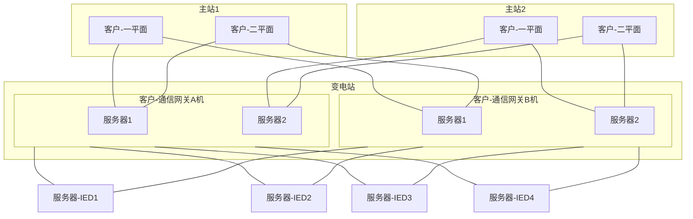
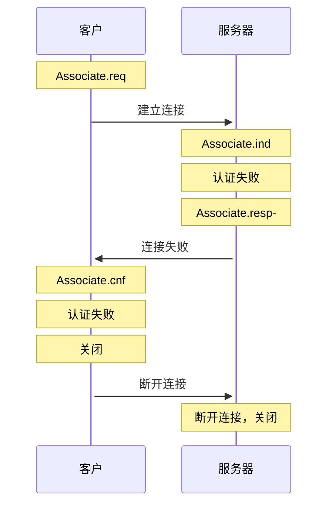
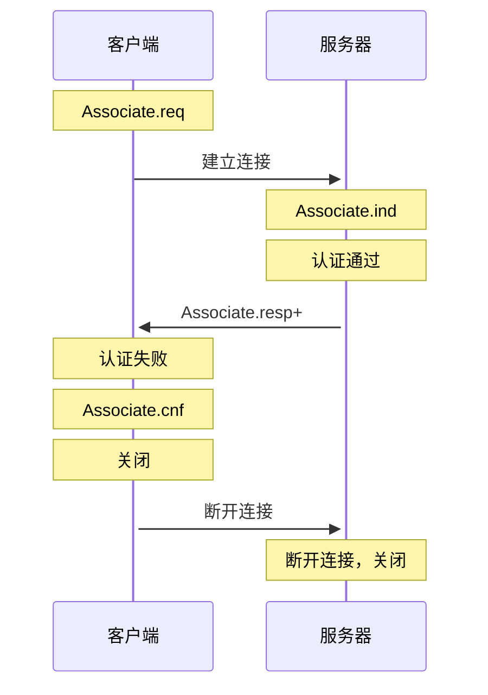
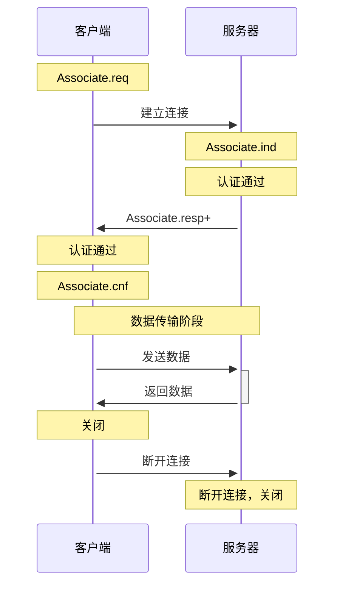
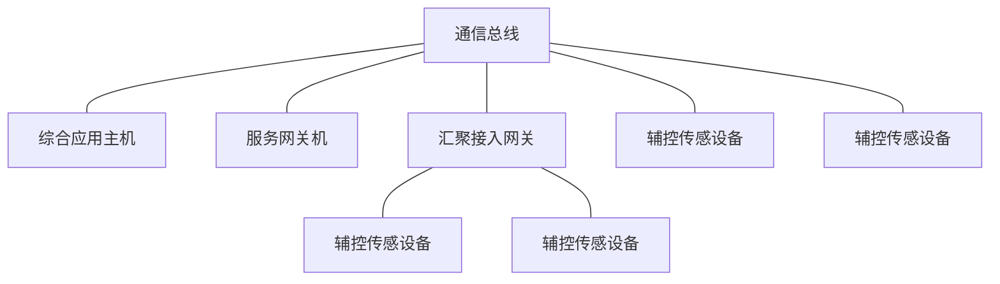

# GB/T 16263.2

## 封面

* 中华人民共和国国家标准 **GB/T 45906.3—2025** 代替 GB/T 16263.2—2006
* 变电站二次系统
* 第 3 部分: 通信报文规范
* Substationsecondarysystem—Part3: Communicationmessagespecification
* 2025-08-01 发布 2026-02-01 实施

## 目次

| 标号 | 标题 | 页号 |
|------|------|------|
| | 前言 | Ⅲ |
| | 引言 | Ⅳ |
| 1 | 范围 | 1 |
| 2 | 规范性引用文件 | 1 |
| 3 | 术语和定义 | 1 |
| 4 | 缩略语 | 2 |
| 5 | 通信协议集 | 2 |
| 6 | 数据帧 | 3 |
| 6.1 | 应用协议数据单元 | 3 |
| 6.2 | 应用服务数据单元 | 6 |
| 6.3 | 空数据帧 | 6 |
| 6.4 | 数据帧协商 | 7 |
| 6.5 | 分帧传输方式 | 7 |
| 6.6 | 服务端口 | 7 |
| 6.7 | TCP 连接控制 | 7 |
| 6.8 | 差错处理 | 7 |
| 6.9 | 超时和通信状态检测 | 7 |
| 6.10 | 数据编码 | 8 |
| 6.11 | 基于 ISO/IEC/IEEE8802-3 的数据帧 | 8 |
| 7 | 数据对象 | 9 |
| 7.1 | 基本数据类型 | 9 |
| 7.2 | 扩展的数据类型 | 10 |
| 7.3 | 公共 ACSI 类型 | 11 |
| 7.4 | 功能约束(FC) | 14 |
| 7.5 | 控制对象 | 14 |
| 7.6 | 控制块 | 16 |
| 7.7 | 数据值与定义 | 17 |
| 8 | 通信服务 | 18 |
| 8.1 | 交互模式 | 18 |
| 8.2 | 关联类服务 | 19 |
| 8.3 | 服务器、逻辑设备、逻辑节点类服务 | 20 |
| 8.4 | 数据类服务 | 26 |
| 8.5 | 数据集类服务 | 29 |
| 8.6 | 定值类服务 | 32 |
| 8.7 | 报告类服务 | 34 |
| 8.8 | 日志类服务 | 39 |
| 8.9 | 通用变电站事件类服务 | 42 |
| 8.10 | 多播采样值类服务 | 45 |
| 8.11 | 控制类服务 | 46 |
| 8.12 | 文件类服务 | 53 |
| 8.13 | 远程过程调用类服务 | 56 |
| 8.14 | 测试服务(Test) | 60 |
| 8.15 | 关联协商服务(AssociateNegotiate) | 60 |
| 附录 A | (规范性) 通信网关应用 | 61 |
| A.1 | 工作模式 | 61 |
| A.2 | 通信网关模型 | 61 |
| A.3 | 通信网关实现 | 62 |
| 附录 B | (资料性) 通信传输安全 | 63 |
| B.1 | 概述 | 63 |
| B.2 | 传输层安全 | 63 |
| B.3 | 应用层安全 | 63 |
| 附录 C | (资料性) 在辅控及传感物联网络中的应用 | 65 |
| C.1 | 工作模式 | 65 |
| C.2 | 设备模型 | 65 |
| C.3 | 通信数据分类 | 65 |
| C.4 | 通信服务 | 66 |

## 前言

本文件按照 GB/T 1.1—2020《标准化工作导则 第 1 部分：标准化文件的结构和起草规则》的规定起草。

本文件是 GB/T 45906《变电站二次系统》的第 3 部分。GB/T 45906 已经发布了以下部分：

- 第 1 部分：通用要求
- 第 2 部分：数据与模型
- 第 3 部分：通信报文规范
- 第 4 部分：网络安全防护
- 第 5 部分：保护控制及相关设备
- 第 6 部分：站内监控系统
- 第 7 部分：集中监控系统
- 第 8 部分：电气操作防误
- 第 9 部分：建设规范
- 第 10 部分：试验与检测

请注意本文件的某些内容可能涉及专利。本文件的发布机构不承担识别专利的责任。

本文件由中国电力企业联合会提出。

本文件由全国电网运行与控制标准化技术委员会(SAC/TC 446)、全国电力系统管理及其信息交换标准化技术委员会(SAC/TC 82)归口。

本文件起草单位：中国电力科学研究院有限公司、国家电网有限公司、国家电网有限公司华东分部、国网北京市电力公司、国网天津市电力公司、国网山东省电力公司、国网江苏省电力有限公司、国网浙江省电力有限公司、国网湖北省电力有限公司、国网吉林省电力有限公司、中国南方电网有限责任公司、内蒙古电力(集团)有限责任公司、中国长江三峡集团有限公司、南京南瑞继保电气有限公司、国电南瑞科技股份有限公司、国网电力科学研究院有限公司、北京四方继保自动化股份有限公司、东方电子股份有限公司、长园深瑞继保自动化有限公司、国电南京自动化股份有限公司。

本文件主要起草人：窦仁晖、常乃超、王永福、李丹、李文琢、盛福、王丽华、代小翔、罗华煜、余静、刘千令、葛雅川、孙发恩、史泽兵、李金、韩东、肖永立、孙军、李劲松、张金虎、屈刚、郭磊、陈建、张琦兵、杜奇伟、郑翔、洪悦、杨松、任辉、吴艳平、姚志强、张海燕、彭志强、阮黎翔、刘雪飞、梁正堂、王志华、孙丹、王珍珍、赵娜、徐歆、杨青、任浩、王水。

## 引言

为满足变电站二次系统转型发展需求，实现变电站二次系统整体架构、功能、数据、设备的顶层设计，助推新型电力系统设备制造产业优化升级，提升变电站二次系统整体性能和可靠性水平，制定本系列标准。

GB/T 45906《变电站二次系统》从通用需求、设备系统功能需求和工程实施与检测等方面全面涵盖了变电站二次系统各环节，拟由 10 个部分构成。

- **第 1 部分：通用要求。** 目的在于规范变电站二次系统总体要求和可靠性、功能集成、信息交互、网络安全等技术要求。
- **第 2 部分：数据与模型。** 目的在于规范变电站二次系统数据和模型框架，明确数据分类、采集处理要求、建模方法和模型配置流程。
- **第 3 部分：通信报文规范。** 目的在于规范变电站二次系统的通信协议集，明确数据对象和通信服务的实现方法。
- **第 4 部分：网络安全防护。** 目的在于规范变电站二次系统安全防护的技术要求。
- **第 5 部分：保护控制及相关设备。** 目的在于规范变电站继电保护及安全自动装置、自动化设备、电能计量及电能质量设备、采集执行设备、通信设备及辅助监控设备等的技术要求。
- **第 6 部分：站内监控系统。** 目的在于规范站内监控系统的功能、性能、信息交互等技术要求。
- **第 7 部分：集中监控系统。** 目的在于规范变电站集中监控系统的系统架构、功能、性能、信息交互等技术要求。
- **第 8 部分：电气操作防误。** 目的在于规范变电站二次系统电气操作防误的总体要求、架构、功能、性能及应用要求。
- **第 9 部分：建设规范。** 目的在于规范变电站二次系统工程建设的总体要求、设计原则、过程控制和技术要求。
- **第 10 部分：试验与检测。** 目的在于规范变电站二次系统设备和系统的检测总体原则、检测要求等。

# 变电站二次系统 第 3 部分：通信报文规范

## 1 范围

本文件规定了变电站二次系统进行数据交互的通信协议集、数据帧、数据对象和通信服务。

本文件适用于变电站二次系统内设备之间，以及变电站二次系统与主站之间的数据和文件传输。

## 2 规范性引用文件

下列文件中的内容通过文中的规范性引用而构成本文件必不可少的条款。其中，注日期的引用文件，仅该日期对应的版本适用于本文件；不注日期的引用文件，其最新版本(包括所有的修改单)适用于本文件。

- GB/T 16262.1 信息技术 抽象语法记法—(ASN.1) 第 1 部分：基本记法规范
- GB/T 16262.2 信息技术 抽象语法记法—(ASN.1) 第 2 部分：信息客体规范
- GB/T 16263.2 信息技术 ASN.1 编码规则 第 2 部分：紧缩编码规则(PER)规范
- GB/T 33602 电力系统通用服务协议
- GB/T 42151.6 电力自动化通信网络和系统 第 6 部分：与智能电子设备相关的电力自动化系统通信配置描述语言
- GB/T 42151.72 电力自动化通信网络和系统 第 7-2 部分：基本信息和通信结构 抽象通信服务接口(ACSI)
- DL/T 860(所有部分) 电力自动化通信网络和系统
- DL/T 860.73 电力自动化通信网络和系统 第 7-3 部分：基本通信结构-公用数据类
- DL/T 860.74 电力自动化通信网络和系统 第 7-4 部分：基本通信结构-兼容逻辑节点类和数据库
- ISO/IEC/IEEE 8802-3 信息技术系统间的远程通信和交换 局域网和城域网要求 第 3 部分：以太网标准 (Telecommunications and exchange between information technology systems — Requirements for local and metropolitan area networks — Part 3: Standard for Ethernet)
- RFC 5905 网络时间协议版本 4：协议和算法规范 (Network Time Protocol Version 4: Protocol and Algorithms Specification)

## 3 术语和定义

下列术语和定义适用于本文件。

### 3.1

**服务请求者** service requester

发出请求服务原语的实体。

> 注：服务请求者通常为客户。

### 3.2

**服务响应者** service responder

根据收到的请求服务返回响应数据的实体。

> 注：服务响应者通常为服务器。

## 4 缩略语

下列缩略语适用于本文件。

| 缩略语 | 英文全称 | 中文全称 |
|--------|----------|----------|
| ACSI | Abstract Communication Service Interface | 抽象通信服务接口 |
| APCH | Application Protocol Control Header | 应用协议控制头 |
| APDU | Application Protocol Data Unit | 应用协议数据单元 |
| ASDU | Application Service Data Unit | 应用服务数据单元 |
| BRCB | Buffered Report Control Block | 缓存报告控制块 |
| CID | Configured IED Description | 配置的 IED 描述 |
| GMT | Greenwich Mean Time | 格林尼治标准时间 |
| GoCB | GOOSE Control Block | GOOSE 控制块 |
| GOOSE | Generic Object Oriented Substation Event | 通用面向对象的变电站事件 |
| ICD | IED Capability Description | IED 能力描述 |
| IED | Intelligent Electronic Device | 智能电子设备 |
| IP | Internet Protocol | 网际互连协议 |
| LCB | Log Control Block | 日志控制块 |
| MSV | Multicast Sample Value | 多播采样值 |
| MSVCB | Multicast Sampled Value Control Block | 多播采样值控制块 |
| SCD | System Configuration Description | 系统配置描述 |
| SCL | System Configuration description Language | 系统配置描述语言 |
| SGCB | Setting Group Control Block | 定值组控制块 |
| SNTP | Simple Network Time Protocol | 简单网络时间协议 |
| SV | Sampled Value | 采样值 |
| TCP | Transmission Control Protocol | 传输控制协议 |
| TLS | Transport Layer Security | 传输层安全 |
| UDP | User Datagram Protocol | 用户数据报协议 |
| URCB | Unbuffered Report Control Block | 非缓存报告控制块 |
| UTC | Universal Time Coordinated | 协调世界时 |

## 5 通信协议集

### 5.1

变电站二次系统的通信协议集包括采样值、快速事件、时间同步和客户/服务器四个部分，各部分通信协议间的关系见图 1。采样值和快速事件用于快速、可靠地传输通用变电站事件，宜采用 SV 和 GOOSE 服务直接映射到支持 IEEE 802.1Q 的以太网进行传输。时间同步用于为设备和系统提供时间基准，宜采用 SNTP 协议，通过 UDP/IP 协议集进行传输。客户/服务器用于两个设备间基于模型的数据访问和控制，宜采用面向连接的 ACSI 服务直接映射到 TCP/IP 传输协议集。

<div style="border: 2px solid #000; display: inline-block; font-family: system-ui, sans-serif;">
  <!-- 第1行：采样值 快速事件 时间同步 客户/服务器 -->
  <div style="display: flex; border-bottom: 1px solid #000;">
    <div style="width: 120px; padding: 12px; text-align: center; border-right: 1px solid #000; font-weight: bold;"> 采样值 </div>
    <div style="width: 120px; padding: 12px; text-align: center; border-right: 1px solid #000; font-weight: bold;"> 快速事件 </div>
    <div style="width: 120px; padding: 12px; text-align: center; border-right: 1px solid #000; font-weight: bold;"> 时间同步 </div>
    <div style="width: 120px; padding: 12px; text-align: center; font-weight: bold;"> 客户/服务器 </div>
  </div>
  <!-- 第2行：SV GOOSE SNTP ACSI -->
  <div style="display: flex; border-bottom: 1px solid #000;">
    <div style="width: 120px; padding: 10px; text-align: center; border-right: 1px solid #000; background: #f9f9f9;"> SV </div>
    <div style="width: 120px; padding: 10px; text-align: center; border-right: 1px solid #000; background: #f9f9f9;"> GOOSE </div>
    <div style="width: 120px; padding: 10px; text-align: center; border-right: 1px solid #000; background: #f9f9f9;"> SNTP </div>
    <div style="width: 120px; padding: 10px; text-align: center; background: #f9f9f9;"> ACSI </div>
  </div>
  <!-- 第3行：IEEE 802.1Q  IEEE 802.1Q  UDP/IP  TCP/IP -->
  <div style="display: flex; border-bottom: 1px solid #000;">
    <div style="width: 120px; padding: 10px; text-align: center; border-right: 1px solid #000;"> IEEE 802.1Q </div>
    <div style="width: 120px; padding: 10px; text-align: center; border-right: 1px solid #000;"> IEEE 802.1Q </div>
    <div style="width: 120px; padding: 10px; text-align: center; border-right: 1px solid #000;"> UDP/IP </div>
    <div style="width: 120px; padding: 10px; text-align: center;"> TCP/IP </div>
  </div>
  <!-- 第4行：ISO/IEC 8802-3 以太网类型（跨四列） -->
  <div style="padding: 12px; text-align: center; background: #f5f5f5;"> ISO/IEC 8802-3 以太网类型（跨四列）</div>
</div>

**图 1 变电站二次系统的通信协议集**

### 5.2

变电站二次系统通信协议的各层之间应通过服务接口分隔，使上层应用可独立于下层实现，当切换到新的通信协议或通信介质时，可保持设备应用功能稳定。

### 5.3

通信报文使用的模型和服务接口应符合 DL/T 860(所有部分)的要求，可直接使用 GB/T 42151.6 中规定的采用 SCL 语言配置的 SCD、ICD、CID 等文件。DL/T 860.73 和 DL/T 860.74 未定义的数据对象，例如控制对象、控制块等，应使用 GB/T 42151.72 的定义。

### 5.4

当用于通信网关或代理服务器等场景时，通信报文的服务和过程实现方法应符合附录 A 的规定。存在通信安全要求时，可采用的传输过程见附录 B。在辅控及传感物联网络中的应用见附录 C。

## 6 数据帧

### 6.1 应用协议数据单元

#### 6.1.1 应用协议数据单元结构

应用协议数据单元(APDU)是通信报文的基本信息单元，由应用协议控制头(APCH)和应用服务数据单元(ASDU)组成。应用协议数据单元的结构应与图 2 相符合。

<div style="border: 2px solid #000; display: inline-block; font-family: system-ui, sans-serif; font-size: 14px;">
  <!-- 表头：比特 8 7 6 5 4 3 2 1 -->
  <div style="display: flex; border-bottom: 1px solid #000; background: #f0f0f0;">
    <div style="width: 100px; padding: 10px; border-right: 1px solid #000; font-weight: bold;"> 比特 </div>
    <div style="width: 50px; padding: 10px; text-align: center; border-right: 1px solid #000; font-weight: bold;"> 8 </div>
    <div style="width: 50px; padding: 10px; text-align: center; border-right: 1px solid #000; font-weight: bold;"> 7 </div>
    <div style="width: 50px; padding: 10px; text-align: center; border-right: 1px solid #000; font-weight: bold;"> 6 </div>
    <div style="width: 50px; padding: 10px; text-align: center; border-right: 1px solid #000; font-weight: bold;"> 5 </div>
    <div style="width: 50px; padding: 10px; text-align: center; border-right: 1px solid #000; font-weight: bold;"> 4 </div>
    <div style="width: 50px; padding: 10px; text-align: center; border-right: 1px solid #000; font-weight: bold;"> 3 </div>
    <div style="width: 50px; padding: 10px; text-align: center; border-right: 1px solid #000; font-weight: bold;"> 2 </div>
    <div style="width: 50px; padding: 10px; text-align: center; font-weight: bold;"> 1 </div>
  </div>
  <!-- 控制码行 -->
  <div style="display: flex; border-bottom: 1px solid #000;">
    <div style="width: 100px; padding: 10px; border-right: 1px solid #000;"> 控制码 </div>
    <div style="width: 50px; padding: 10px; text-align: center; border-right: 1px solid #000;"> Next </div>
    <div style="width: 50px; padding: 10px; text-align: center; border-right: 1px solid #000;"> Resp </div>
    <div style="width: 50px; padding: 10px; text-align: center; border-right: 1px solid #000;"> Err </div>
    <div style="width: 50px; padding: 10px; text-align: center; border-right: 1px solid #000;"> bak </div>
    <div style="width: 200px; padding: 10px; text-align: center; border-right: 1px solid #000;" colspan="4"> PI / 协议类型 = 0x01 </div>
  </div>
  <!-- 服务码 SC -->
  <div style="display: flex; border-bottom: 1px solid #000;">
    <div style="width: 100px; padding: 10px; border-right: 1px solid #000;"> 服务码 SC </div>
    <div style="flex: 1; padding: 10px; text-align: center; border-right: 1px solid #000;" colspan="8"> </div>
  </div>
  <!-- 帧长度 FL -->
  <div style="display: flex; border-bottom: 1px solid #000;">
    <div style="width: 100px; padding: 10px; border-right: 1px solid #000;"> 帧长度 FL </div>
    <div style="flex: 1; padding: 10px; text-align: center; border-right: 1px solid #000;" colspan="8"> </div>
  </div>
  <!-- 服务请求序号 ReqID -->
  <div style="display: flex; border-bottom: 1px solid #000;">
    <div style="width: 100px; padding: 10px; border-right: 1px solid #000;"> 服务请求序号 ReqID </div>
    <div style="flex: 1; padding: 10px; text-align: center; border-right: 1px solid #000;" colspan="8"> </div>
  </div>
  <!-- 服务器数据区 -->
  <div style="display: flex; border-bottom: 1px solid #000;">
    <div style="width: 100px; padding: 10px; border-right: 1px solid #000;"> 服务器数据区 </div>
    <div style="flex: 1; padding: 10px; text-align: center; border-right: 1px solid #000;" colspan="8"> </div>
  </div>
</div>

ASDU = ReqID + Data
APCH = 控制码 + SC + FL
APDU = APCH + ASDU

**图 2 应用协议数据单元(APDU)结构**

#### 6.1.2 应用协议控制头定义

应用协议控制头 APCH 各部分值的定义如下。

a) 协议类型 PI = 0x01。

b) 服务码 SC 表示服务数据区中的服务类别，服务码及其含义见表 1。

c) 帧长度 FL 表示不包括 APCH 的 APDU 长度，占用两字节，低位在前，高位在后。APDU 的最大长度为 65535，帧长度 FL 最大不超过 65531。

**表 1 服务码**

| 服务码 | 服务接口 | 描述 |
|--------|----------|------|
| 1 | Associate | 关联服务 |
| 2 | Abort | 关联服务 |
| 3 | Release | 关联服务 |
| 80 | GetServerDirectory | 模型和数据服务 |
| 81 | GetLogicDeviceDirectory | 模型和数据服务 |
| 82 | GetLogicNodeDirectory | 模型和数据服务 |
| 83 | GetAllDataValues | 模型和数据服务 |
| 155 | GetAllDataDefinition | 模型和数据服务 |
| 156 | GetAllCBValues | 模型和数据服务 |
| 48 | GetDataValues | 模型和数据服务 |
| 49 | SetDataValues | 模型和数据服务 |
| 50 | GetDataDirectory | 模型和数据服务 |
| 51 | GetDataDefinition | 模型和数据服务 |
| 54 | CreateDataSet | 数据集服务 |
| 55 | DeleteDataSet | 数据集服务 |
| 57 | GetDataSetDirectory | 数据集服务 |
| 58 | GetDataSetValues | 数据集服务 |
| 59 | SetDataSetValues | 数据集服务 |
| 68 | Select | 控制服务 |
| 69 | SelectWithValue | 控制服务 |
| 70 | Cancel | 控制服务 |
| 71 | Operate | 控制服务 |
| 72 | CommandTermination | 控制服务 |
| 73 | TimeActivatedOperate | 控制服务 |
| 74 | TimeActivatedOperateTermination | 控制服务 |
| 84 | SelectActiveSG | 定值组服务 |
| 85 | SelectEditSG | 定值组服务 |
| 86 | SetEditSGValue | 定值组服务 |
| 87 | ConfirmEditSGValues | 定值组服务 |
| 88 | GetEditSGValue | 定值组服务 |
| 89 | GetSGCBValues | 定值组服务 |
| 90 | Report | 报告服务 |
| 91 | GetBRCBValues | 报告服务 |
| 92 | SetBRCBValues | 报告服务 |
| 93 | GetURCBValues | 报告服务 |
| 94 | SetURCBValues | 报告服务 |
| 95 | GetLCBValues | 日志服务 |
| 96 | SetLCBValues | 日志服务 |
| 97 | QueryLogByTime | 日志服务 |
| 98 | QueryLogAfter | 日志服务 |
| 99 | GetLogStatusValues | 日志服务 |
| 102 | GetGoCBValues | GOOSE 控制块服务 |
| 103 | SetGoCBValues | GOOSE 控制块服务 |
| 105 | GetMSVCBValues | MSV 控制块服务 |
| 106 | SetMSVCBValues | MSV 控制块服务 |
| 128 | GetFile | 文件服务 |
| 129 | SetFile | 文件服务 |
| 130 | DeleteFile | 文件服务 |
| 131 | GetFileAttributeValues | 文件服务 |
| 132 | GetFileDirectory | 文件服务 |
| 110 | GetRpcInterfaceDirectory | 远程过程调用 |
| 111 | GetRpcMethodDirectory | 远程过程调用 |
| 112 | GetRpcInterfaceDefinition | 远程过程调用 |
| 113 | GetRpcMethodDefinition | 远程过程调用 |
| 114 | RpcCall | 远程过程调用 |
| 153 | Test | 测试 |
| 154 | AssociateNegotiate | 关联协商 |

#### 6.1.3 帧格式错误处理

接收到帧格式错误的报文时，应丢弃报文而不断开连接，例如协议类型、服务码、帧长度不正确。连续接收到的错误报文次数超过预设阈值时，应主动中断连接。

### 6.2 应用服务数据单元

#### 6.2.1 应用服务数据单元结构

应用服务数据单元(ASDU)由服务请求序号(ReqID)和服务数据区组成。服务请求序号使用一个 16 位的无符号整数，低位在前，高位在后，用于唯一标识一次服务请求和响应过程。服务数据区为编码后的服务数据，采用特定的编码规则，接收者根据服务码 SC 对数据区内容进行解码处理。

服务请求序号(ReqID)符合以下要求。

a) ReqID 的取值范围是 1~65535。每一次新的请求响应服务开始时，服务请求者应将 ReqID 加 1，超过 65535 后翻转为 1。

b) 服务响应者返回响应报文时，应使用请求时的 ReqID。

c) 0 为保留值，用于非请求响应服务，例如 Report 服务。

#### 6.2.2 报文解码错误处理

接收报文的服务数据区解码错误时，应返回空的错误响应帧(Resp = 1, Err = 1)，帧长度 FL = 2，ReqID 与接收报文相同。连续接收到的错误报文次数超过预设阈值时，应主动中断连接。

### 6.3 空数据帧

APDU 数据帧可能出现 ASDU 或服务数据区长度为 0 的情况。ASDU 长度为 0 的情况下，数据帧仅包含 APCH 头，没有 ASDU 部分，帧长度 FL = 0，例如测试服务的数据帧。服务数据区长度为 0 的情况下，数据帧由 APCH 头和 ReqID 组成，帧长度 FL = 2，例如确认编辑定值组值服务的肯定响应。

### 6.4 数据帧协商

TCP 连接建立后，客户与服务器之间应首先进行关联协商，协商内容包括允许的 APDU 大小、ASDU 大小、协议版本号等。具体流程见 8.15。

### 6.5 分帧传输方式

#### 6.5.1 分帧方法

服务 ASDU 超出 APDU 帧的长度限制时，客户与服务器应使用分帧传输方式。分帧的方法是：

a) 根据 APDU 帧的限制长度对 ASDU 数据区(不包括 ReqID)进行切分；

b) 切分后的数据分别加上 APCH 头和 ReqID(应与原始 ASDU 的 ReqID 相同)，组成多个新的 APDU 帧。

#### 6.5.2 分帧标识

APCH 头的 Next 标志位用于分帧标识，Next 标志位为 1 表示有后续帧，Next 标志位为 0 表示无后续帧。APCH 头的帧长度 FL 表示本帧中 ReqID 和数据区的长度。全部 APDU 帧的帧长度之和，减去重复的 ReqID 所增加的长度，即为原始 ASDU 长度。不采用分帧传输方式时，即每次只有一个 APDU 帧，Next 标志位应设置为 0。

#### 6.5.3 顺序控制

分帧传输时，发送方应保证各 APDU 帧按顺序发送，过程中应不丢失和错序。传输过程的重传和顺序控制由传输层协议保证，因此客户与服务器应合理设置 TCP 参数，并随时监测 TCP 传输错误信息。接收方收到全部 APDU 帧后，将数据内容重新组合后得到完整的 ASDU。

### 6.6 服务端口

服务端口应使用 8102，支持安全认证的服务端口应使用 9102。

### 6.7 TCP 连接控制

服务器接受 TCP 连接时应检测客户的 IP 地址。变电站与主站通信时，相同的客户地址只允许建立一个连接。检测到重复连接时，服务器可主动中止并关闭旧的连接，然后接受新的连接。

### 6.8 差错处理

通信报文规范的流量控制、分段/重组和差错控制由 TCP/IP 协议层提供，应监测其工作状态是否正常。使用 UDP/IP 或其他面向数据报的传输层协议时，应用程序应在底层协议中设计上述机制。通信过程中检测到错误时，采用以下措施：

a) 服务器或客户应记录错误日志，并根据错误的性质采取不同的处理方法；

b) 数据帧可正确解析时，应返回错误响应，并说明错误原因；

c) 数据帧无法正确解析时，应丢弃当前数据帧，多次出错后应中止当前关联，甚至断开连接。

### 6.9 超时和通信状态检测

#### 6.9.1 超时处理

客户发出服务请求后，应设置对应的时间定时器。超出预定时间仍未收到服务器的响应数据，可判断为通信超时，放弃该次请求或重发请求。连续多次请求均出现超时，客户可选择中止关联。

#### 6.9.2 通信状态检测

客户和服务器建立通信关联后，应定时进行通信状态检测。客户和服务器持续进行数据交互时，可认为双方通信正常。通信链路较长时间处于空闲状态时，客户和服务器均可主动发出 Test 报文，以测试接收方的通信程序是否处于工作状态。Test 报文的发送周期宜选择 1min~5min。当接收到任何有效报文后，Test 报文的发送计时器应重新计数。

#### 6.9.3 KeepAlive 参数

客户和服务器应启用 TCP 的 KeepAlive 机制。KeepAlive 的空闲检测时间宜设置为 30s，发送间隔宜设置为 5s，发送次数宜设置为 4 次。网络接口或线缆损坏时，最长 50s 内可检测出网络故障。

### 6.10 数据编码

服务语法使用 GB/T 16262.1 和 GB/T 16262.2 格式定义，数据编码使用 GB/T 16263.2 或 GB/T 33602 规定的编码规则。使用 GB/T 16263.2 编码规则时，应使用 BASIC-PER 对齐编码方式。

### 6.11 基于 ISO/IEC/IEEE 8802-3 的数据帧

#### 6.11.1 帧结构

采样值和快速事件服务直接映射到 ISO/IEC/IEEE 8802-3 的以太网数据帧，其帧结构参考 ISO/IEC 8802-3 定义，应用协议数据单元(APDU)的结构应与图 3 相符合。服务码 SC 定义见表 1。服务数据区的内容按照 GOOSE 和 MSV 服务编码，长度应小于 1491。

<div style="border: 2px solid #000; display: inline-block; font-family: system-ui, sans-serif; font-size: 14px;">
  <!-- 第1行：n+1 | 服务码 SC -->
  <div style="display: flex; border-bottom: 1px solid #000;">
    <div style="width: 80px; padding: 10px; border-right: 1px solid #000; text-align: center;"> n+1 </div>
    <div style="width: 150px; padding: 10px; text-align: center;"> 服务码 SC </div>
  </div>
  <!-- 第2行：n+2 | 服务数据区 -->
  <div style="display: flex; border-bottom: 1px solid #000;">
    <div style="width: 80px; padding: 10px; border-right: 1px solid #000; text-align: center;"> n+2 </div>
    <div style="width: 150px; padding: 10px; text-align: center;"> 服务数据区 </div>
  </div>
  <!-- 第3行：n+3 | 空 -->
  <div style="display: flex; border-bottom: 1px solid #000;">
    <div style="width: 80px; padding: 10px; border-right: 1px solid #000; text-align: center;"> n+3 </div>
    <div style="width: 150px; padding: 10px; text-align: center;"> </div>
  </div>
  <!-- 第4行：n+4 | 空 -->
  <div style="display: flex; border-bottom: 1px solid #000;">
    <div style="width: 80px; padding: 10px; border-right: 1px solid #000; text-align: center;"> n+4 </div>
    <div style="width: 150px; padding: 10px; text-align: center;"> </div>
  </div>
  <!-- 第5行：...... | 空 -->
  <div style="display: flex;">
    <div style="width: 80px; padding: 10px; border-right: 1px solid #000; text-align: center;">......</div>
    <div style="width: 150px; padding: 10px; text-align: center;"> </div>
  </div>
</div>

**图 3 基于 ISO/IEC 8802-3 的协议数据单元**

#### 6.11.2 以太网类型

ISO/IEC/IEEE 8802-3 数据帧的以太网类型和 APPID 的取值范围见表 2。在同一个子网中使用 GOOSE 和采样值服务时，可通过不同的 APPID 值区分所使用的具体协议。

**表 2 以太网类型分配**

| 服务类型 | 以太网类型值(十六进制) | APPID 类型的首 2 位 |
|----------|------------------------|------------------|
| GOOSE 类型 1 | 88~B8 | 01 |
| GSE 管理 | 88~B9 | 01 |
| 采样值 | 88~BA | 10 |
| GOOSE 类型 1A | 88~B8 | 11 |

## 7 数据对象

### 7.1 基本数据类型

#### 7.1.1 布尔型

布尔型只有两个值：TRUE、FALSE。使用 GB/T 16263.2 编码规则时，布尔型应使用 BOOLEAN 类型。

#### 7.1.2 有符号整型

有符号整型分为 4 种，具体名称和取值范围见表 3。

**表 3 有符号整数类型**

| 数据类型 | 数值范围 |
|----------|----------|
| INT8 | 有符号整型，-128~127 |
| INT16 | 有符号整型，-32768~32767 |
| INT32 | 有符号整型，-2147483648~2147483647 |
| INT64 | 有符号整型，-2⁶³~(2⁶³)-1 |

#### 7.1.3 无符号整型

无符号整型分为 4 种，具体名称和取值范围见表 4。其中 INT24U 仅用于协调世界时类型。

**表 4 无符号整数类型**

| 数据类型 | 数值范围 |
|----------|----------|
| INT8U | 无符号整型，0~255 |
| INT16U | 无符号整型，0~65535 |
| INT24U | 无符号整型，0~16777215，仅用于 UtcTime 类型 |
| INT32U | 无符号整型，0~4294967295 |
| INT64U | 无符号整型，0~2⁶⁴-1 |

#### 7.1.4 浮点型

浮点型分为单精度和双精度 2 种，具体名称和取值范围见表 5。

**表 5 浮点数类型**

| 数据类型 | 数值范围 |
|----------|----------|
| FLOAT32 | 单精度浮点型，取值范围和精度由 IEEE754 单精度浮点数规定 |
| FLOAT64 | 双精度浮点型，取值范围和精度由 IEEE754 双精度浮点数规定 |

#### 7.1.5 数据串

数据串类型分为 4 种，具体名称和取值范围见表 6。每一种数据串又分为定长和变长两类，定长数据串的长度是固定的，无论取值多少，均为同一个长度，不使用的部分应设置为 0；变长数据串的长度是可变的，最小长度为 0，最大长度由应用定义。

**表 6 数据串类型**

| 数据类型 | 数值范围 |
|----------|----------|
| BITSTRING | 位串型，最大长度在使用处定义 |
| OCTETSTRING | 八位组串型，最大长度在使用处定义 |
| VisibleString | 可视字符串型，最大长度在使用处定义 |
| UNICODESTRING | Unicode 字符串型，最大长度在使用处定义 |

#### 7.1.6 枚举(ENUMERATED)

枚举类型表示为 7.1.2 定义的有符号整数，值的具体含义由数据模型定义。大多数情况下 ENUMERATED 类型的取值范围均小于 127，可采用 INT8 类型。若存在取值范围超过 128 的情况，可采用 INT16 等其他类型。

#### 7.1.7 编码枚举(CODEDENUM)

编码枚举类型表示为 0 定义的定长位串，位串长度和每一位的具体含义由数据模型定义。

#### 7.1.8 压缩列表(Packed list)

压缩列表类型表示为 0 定义的变长位串，位串最大长度和每一位的具体含义由数据模型定义。在位串中，位 0 是值域的第一个成员，后续比特位依次为值域的其他成员。

### 7.2 扩展的数据类型

#### 7.2.1 协调世界时(UtcTime)

协调世界时类型采用 RFC 5905 定义的编码方式，由一个 INT32U 类型的 SecondSinceEpoch(世纪秒)、一个 INT24U 类型的 FractionOfSecond(秒的小数)和一个 8 位位串 TimeQuality(时间品质)组成。SecondSinceEpoch 表示从 1970-01-01 00:00:00 UTC 开始的秒数。FractionOfSecond 属性表示当前秒的小数。TimeQuality 表示时标品质，其定义见表 7。

**表 7 时标品质**

| 位 | 值 | 含义 |
|----|-----|------|
| 0 | — | 闰秒已知 |
| 1 | — | 时钟故障 |
| 2 | — | 时钟未同步 |
| 3~7 | — | 秒的小数部分的时间精度 |
| | 00000 | 0 位精度 |
| | 00001 | 1 位精度 |
| | 00010 | 2 位精度 |
| | 00011 | 3 位精度 |
| | 00100~11000 | 数值所对应的整数位精度 |
| | 11001~11110 | 非法 |
| | 11111 | 未规定 |

#### 7.2.2 二进制时间(BinaryTime)

二进制时间类型用于表示报告服务中的条目时间，采用一个长度为 6 字节的八位组串，由一个 INT32U 类型整数和一个 INT16U 类型整数组成。INT32U 类型整数表示最后一天逝去的毫秒数，INT16U 类型整数表示从 GMT 1984 年 1 月 1 日起逝去的天数。

### 7.3 公共 ACSI 类型

#### 7.3.1 对象名(ObjectName)

对象名类型表示为 0 定义的变长可视字符串，串长度最大为 64 个字符。

#### 7.3.2 对象引用(ObjectReference)

对象引用类型表示为 0 定义的变长可视字符串，串长度最大为 129 个字符。对象引用的格式定义如下：

```
LDName/LNName[.Name[....]]
```

对象引用符合以下要求：

a) LDName 是逻辑设备的名称，模型显式定义 ldName 的情况下，应采用 ldName，否则由 IedName 和 ldInst 两部分组合而成；

b) 对象引用中不含功能约束 FC；

c) 对象引用应不使用'$'；

d) 用于非持久数据集时，对象引用应采用@DataSetName 的格式。

#### 7.3.3 子引用(SubReference)

子引用类型用于表示与父节点相关的相对引用名，采用变长可视字符串，串长度最大为 129 个字符。例如 LDName 下子节点的子引用为 LN.DO.DA.BDA，LDName/LN.DO 下子节点的子引用为 DA.BDA。子引用类型表示为 0 定义的变长可视字符串，串长度最大为 129 个字符。

#### 7.3.4 时标(TimeStamp)

时标类型表示为 7.2.1 定义的协调世界时类型。

#### 7.3.5 双点位置(Dbpos)

双点位置类型表示为 0 定义的定长位串，长度 2 位，其定义见表 8。

**表 8 双点位置**

| 位 | 值 | 含义 |
|----|-----|------|
| 0~1 | 00~11 | intermediate-state \| off \| on \| bad-state |

#### 7.3.6 品质(Quality)

品质类型表示为 0 定义的定长位串，长度 13 位，每一位的定义见表 9。

**表 9 品质**

| 位 | 值 | 含义 |
|----|-----|------|
| 0~1 | 00~11 | good \| invalid \| reserved \| questionable |
| 2 | — | overflow |
| 3 | — | outOfRange |
| 4 | — | badReference |
| 5 | — | oscillatory |
| 6 | — | failure |
| 7 | — | oldData |
| 8 | — | inconsistent |
| 9 | — | inaccurate |
| 10 | 0~1 | process \| substituted |
| 11 | — | test |
| 12 | — | operatorBlocked |

#### 7.3.7 档位命令(Tcmd)

档位命令类型表示为 0 定义的定长位串，长度 2 位，其定义见表 10。

**表 10 档位命令**

| 位 | 值 | 含义 |
|----|-----|------|
| 0~1 | 00~11 | stop \| lower \| higher \| reserved |

#### 7.3.8 条目标识(EntryID)

条目标识类型表示为 0 定义的定长八位组串，串长度固定为 8 个八位组。

#### 7.3.9 条目时间(EntryTime)

条目时间类型表示为 0 定义的二进制时间类型。

#### 7.3.10 文件条目(FileEntry)

文件条目类型的定义见表 11。

**表 11 文件条目**

| 参数 | 数据类型 |
|------|----------|
| FileName | VisibleString129 |
| FileSize | INT32U |
| LastModified | UtcTime |
| CheckSum | INT32U |

文件条目类型中的 FileName 应不包含路径名。以 "/" 结尾的 FileName 表示子目录。FileSize 表示文件长度，单位为字节。CheckSum 是文件数据的 CRC32 校验码，其生成多项式采用 0x04C11DB7。

#### 7.3.11 服务错误(ServiceError)

服务错误类型表示为 7.1.6 定义的枚举类型，取值范围和含义见表 12。

**表 12 服务错误码**

| 位 | 值 | 含义 |
|----|-----|------|
| 0 | no-error | 无差错 |
| 1 | instance-not-available | 实例不可用 |
| 2 | instance-in-use | 实例在使用 |
| 3 | access-violation | 访问违例 |
| 4 | access-not-allowed-in-current-state | 当前状态不允许访问 |
| 5 | parameter-value-inappropriate | 参数值不合适 |
| 6 | parameter-value-inconsistent | 参数值不一致 |
| 7 | class-not-supported | 类不被支持 |
| 8 | instance-locked-by-other-client | 实例被其他客户锁定 |
| 9 | control-must-be-selected | 控制应被选择 |
| 10 | type-conflict | 类型冲突 |
| 11 | failed-due-to-communications-constraint | 由于通信约束失败 |
| 12 | failed-due-to-server-constraint | 由于服务器约束失败 |

#### 7.3.12 物理通信地址(PHYCOMADDR)

物理通信地址类型的定义见表 13。

**表 13 物理通信地址**

| 参数 | 数据类型 |
|------|----------|
| Addr | OCTETSTRING6 |
| PRIORITY | INT8U |
| VID | INT16U |
| APPID | INT16U |

### 7.4 功能约束(FC)

功能约束表征数据属性的特定用途，包含功能约束的数据对象和数据对象属性称为 FCD 和 FCDA。约束参数不属于对象的引用名。

### 7.5 控制对象

#### 7.5.1 控制对象属性

控制对象属性包括引用名 reference、控制值 ctlVal、操作时间 operTm、发出者 origin、控制序列号 ctlNum、控制时标 t、测试状态 test、检查条件 check 等，其数据类型和取值范围由数据模型定义。

#### 7.5.2 控制操作的发出者(Originator)

发出者类型定义的是控制服务的发起者，由发出者类别 orCat 和发出者识别码 orIdent 两个部分组成。

#### 7.5.3 控制操作的检测(Check)

控制操作的检测类型表示为 0 定义的定长位串，长度 2 位，每一位的定义见表 14。

**表 14 控制操作的检测**

| 位 | 含义 |
|----|------|
| 0 | 同期检测(synchrocheck) |
| 1 | 联锁检测(Interlock-check) |

#### 7.5.4 控制操作的附加原因(AddCause)

控制操作的附加原因类型表示为 7.1.6 定义的枚举类型，取值范围和含义见表 15。

**表 15 控制操作的附加原因**

| 代码 | 值 | 含义 |
|------|-----|------|
| 0 | unknown | 未知 |
| 1 | not-supported | 不支持 |
| 2 | blocked-by-switching-hierarchy | 由开关层闭锁 |
| 3 | select-failed | 选择失败 |
| 4 | invalid-position | 无效位置 |
| 5 | position-reached | 位置早已达到 |
| 6 | parameter-change-in-execution | 执行中参数改变 |
| 7 | step-limit | 步位置受限制 |
| 8 | blocked-by-Mode | 模式闭锁 |
| 9 | blocked-by-process | 过程闭锁 |
| 10 | blocked-by-interlocking | 受互锁闭锁 |
| 11 | blocked-by-synchrocheck | 同期检查闭锁 |
| 12 | command-already-in-execution | 命令已在执行中 |
| 13 | blocked-by-health | 由运行状况闭锁 |
| 14 | 1-of-n-control | n 中取 1 控制 |
| 15 | abortion-by-cancel | 由取消异常中止 |
| 16 | time-limit-over | 超时 |
| 17 | abortion-by-trip | 由跳闸异常中止 |
| 18 | object-not-selected | 没有选择对象 |
| 19 | object-already-selected | 对象早已被选择 |
| 20 | no-access-authority | 无访问权限 |
| 21 | ended-with-overshoot | 因过调节结束 |
| 22 | abortion-due-to-deviation | 由于失常(偏差)异常中止 |
| 23 | abortion-by-communication-loss | 通信故障异常中止 |
| 24 | blocked-by-command | 由命令闭锁 |
| 25 | none | 无错误 |
| 26 | locked-by-other-client | 由其他客户闭锁 |
| 27 | inconsistent-parameters | 参数不一致 |

### 7.6 控制块

#### 7.6.1 控制块属性

控制块包括 BRCB、URCB、LCB、SGCB、GoCB、MSVCB，控制块属性在通信时表示为通信服务的参数。

#### 7.6.2 触发条件(TriggerConditions)

触发条件类型表示为 0 定义的定长位串，位 0 为保留位，位 1~位 5 表示数据变化 data-change、品质变化 quality-change、数据刷新 data-update、完整性周期 integrity、总召唤 general-interrogation。

#### 7.6.3 触发原因(ReasonCode)

触发原因类型表示为 0 定义的定长位串，位 0 为保留位，位 1~位 6 表示数据变化 data-change、品质变化 quality-change、数据刷新 data-update、完整性周期 integrity、总召唤 general-interrogation、应用触发 application-trigger。

#### 7.6.4 报告控制块的选项域(RCBOptFlds)

报告控制块的选项域类型表示为 0 定义的定长位串，长度 10 位，每位的定义见表 16。

**表 16 缓存报告控制块的选项域**

| 代码 | 值 | 含义 |
|------|-----|------|
| 0 | — | 保留(reserved) |
| 1 | — | 序列号(sequence-number) |
| 2 | — | 报告时标(report-time-stamp) |
| 3 | — | 包含原因(reason-for-inclusion) |
| 4 | — | 数据集名称(data-set-name) |
| 5 | — | 数据引用(data-reference) |
| 6 | — | 缓存区溢出(buffer-overflow) |
| 7 | — | 条目标识(entryID) |
| 8 | — | 配置版本(conf-revision) |
| 9 | — | 分段(segmentation) |

选项域用于非缓冲报告控制块时，buffer-overflow 位无效，应设置为 0。

#### 7.6.5 日志控制块的选项域(LCBOptFlds)

日志控制块的选项域类型表示为 0 定义的定长位串，长度 1 位，应设置为 1。

#### 7.6.6 多播采样值控制块的选项域(MSVCBOptFlds)

多播采样值控制块的选项域类型表示为 0 定义的定长位串，长度 5 位，每位的定义见表 17。

**表 17 多播采样值控制块的选项域**

| 代码 | 值 | 含义 |
|------|-----|------|
| 0 | — | 刷新时间(refresh-time) |
| 1 | — | 保留(reserved) |
| 2 | — | 采样率(sample-rate) |
| 3 | — | 数据集名(data-set-name) |
| 4 | — | 安全(security) |

#### 7.6.7 采样模式(SmpMod)

采样模式类型表示为 7.1.6 定义的枚举类型，取值范围和含义见表 18。

**表 18 采样模式**

| 代码 | 值 |
|------|-----|
| 0 | samplespernominalperiod |
| 1 | samplespersecond |
| 2 | secondspersample |

### 7.7 数据值与定义

#### 7.7.1 数据值(Data)

数据值类型用于描述数据对象或数据对象属性的值，通过嵌套的 array、structure 及其他数据表示复杂的数据结构。array 表示数组型数据，structure 表示结构化数据，其他类型的定义见 7.1 和 7.2。array 的数量应不大于数据定义中 numberOfElement 规定的最大长度。error 是数据值类型中的一个特殊属性，表示数据访问错误的错误原因。

#### 7.7.2 数据定义(DataDefinition)

数据定义类型用于描述数据对象或数据对象属性的类型，其结构与数据值类型相似。数据定义类型包括功能约束 fc、数据长度等信息，符合以下要求。

a) fc 为条件可选项。数据无 fc 属性或请求时已指定 fc，响应中不需返回 fc；数据有 fc 属性且请求时未指定 fc 时，响应中应返回 fc。

b) bit-string、octet-string、visible-string、unicode-string 四种类型均有长度限制，采用 INTEGER 数值说明其长度。bit-string 的长度按位计算，octet-string、visible-string 的长度按 8 位组或字节计算，unicode-string 的长度按字计算。

c) numberOfElement 和数据串的长度可以是正数、负数或 0。长度为正数时应包含固定数量的元素，数量等于该长度值。长度为负数时应包含可变数量的元素，最小数量是 0，最大数量不大于该负数的绝对值。长度等于 0 时表示不定数量。

## 8 通信服务

### 8.1 交互模式

#### 8.1.1 三种交互模式

变电站二次系统的通信服务分为三种交互模式：请求-响应模式、订阅-发布模式和测试模式。请求-响应模式为每个服务定义了 Request 和 Response 两种 ASDU，例如各类读、写、控制等服务。订阅-发布模式分为订阅和发布两个独立的过程，订阅是一个请求-响应过程，发布是一个主动发送过程。发布只有一种 ASDU，例如 Report、CommandTermination、Abort 服务。测试模式用于通道测试，与 TCP 协议的 KeepAlive 机制一起，用于网络异常中断的检测。

#### 8.1.2 应用协议控制头

APCH 中的 Resp 字段用于标识 Request-ASDU 和 Response-ASDU。0 表示 Request，1 表示 Response。APCH 中的 Err 字段用于标识 Response-ASDU 属于肯定响应(Response+)或否定响应(Response-)。0 表示肯定响应，1 表示否定响应。肯定响应的 ServiceError 应设置为 no-error。

#### 8.1.3 服务请求序号 ReqID

采用请求-响应模式时，ReqID 应符合以下要求：

a) 正确设置 ReqID 字段，便于请求方根据 ReqID 快速识别响应目标；

b) 确保每次请求时 ReqID 的唯一性；

c) 一次请求-响应过程中，应保持 ReqID 不变。

#### 8.1.4 超长数据的请求和响应

部分服务的响应内容较长，可能无法在一帧中发送。对于读数据目录、读数据值、报告等服务，可分为多个独立的 ASDU 传输。这种方式下，每一帧报文应是完整的，可以单独进行解码处理。对于读数据定义等服务，无法在 ASDU 层面分包，应采用 APDU 层提供的分包机制。这种方式下，需要将多个 APDU 重组后才可进行解码处理。

### 8.2 关联类服务

#### 8.2.1 关联服务(Associate)

##### 8.2.1.1 服务参数

关联服务用于客户与服务器之间进行连接认证，服务的参数见表 19。

**表 19 关联服务参数**

| 服务/参数 | 数据类型 |
|-----------|----------|
| **Request** | |
| serverAccessPointReference [0..1] | VisibleString129 |
| authenticationParameter [0..1] | OCTETSTRING |
| **Response+** | |
| associationId | OCTETSTRING64 |
| result | ServiceError = no-error |
| authenticationParameter | OCTETSTRING |
| **Response-** | |
| serviceError | ServiceError |

ServerAccessPointReference 为访问点的引用，格式为：

```
IEDName.AccessPoint
```

authenticationParameter 表示应用层关联过程的安全认证。associationId 表示应用层关联的标识，具体格式由服务器定义。signatureCertificate 表示签名证书，是 OCTET STRING 类型数据。signedTime 表示签名时间。signedValue 表示签名值。

##### 8.2.1.2 关联的访问点

建立应用层关联时，客户通过 serverAccessPointReference 指定所关联的访问点，服务器后续的所有服务均针对此访问点下的模型。未指定 serverAccessPointReference 时，服务器应使用缺省的访问点，或根据客户地址选择一个访问点。

通常一个访问点对应于一个子网，不同子网的地址不同。但服务器在一个子网上需要同时为多个客户服务，且不同客户的访问模型不同时，通过指定访问点来区分所使用的模型。

##### 8.2.1.3 服务要求

关联服务参数符合以下要求。

a) 安全认证参数 authenticationParameter 是可选参数。需要安全通信时 authenticationParameter 中应携带数字证书相关信息。

b) 关联建立过程中，关联请求者应将自己的签名证书赋值到 signatureCertificate 中发送。关联响应者确认了关联请求者的身份合法后，应将自己的签名证书内容赋到 signatureCertificate 中回传给关联请求者。至少应支持 8192 字节的证书传输。

c) 签名时间 signedTime 是 authenticationParameter 生成的 UTC 时间，用 UtcTime 类型表示，时间精度应小于 1s。

d) 签名值 signedValue 由发起方计算(客户和服务器都可以为发起方)，由关联接收方对签名值进行验证，计算时只对 time 自身数据进行签名，不包含编码附加的标签、长度等额外信息。

#### 8.2.2 释放关联服务(Release)

释放关联服务用于关闭已建立的关联，服务的参数见表 20。

**表 20 释放关联服务参数**

| 服务/参数 | 数据类型 |
|-----------|----------|
| **Request** | |
| associationId | OCTETSTRING |
| **Response+** | |
| associationId | OCTETSTRING |
| result | ServiceError = no-error |
| **Response-** | |
| serviceError | ServiceError |

#### 8.2.3 异常中止服务(Abort)

异常中止服务用于强行断开已关联的服务，服务的参数见表 21。

**表 21 异常中止服务参数**

| 服务/参数 | 数据类型 |
|-----------|----------|
| **Request** | |
| associationId | OCTETSTRING |
| reason | CODEDENUM |
| **Indication** | |
| associationId | OCTETSTRING |
| reason | CODEDENUM |

### 8.3 服务器、逻辑设备、逻辑节点类服务

#### 8.3.1 读服务器目录服务(GetServerDirectory)

##### 8.3.1.1 服务参数

读服务器目录服务用于获取所有逻辑设备名称，服务的参数见表 22。

**表 22 读服务器目录服务参数**

| 服务/参数 | 数据类型 |
|-----------|----------|
| **Request** | |
| objectClass | ENUMERATED |
| referenceAfter [0..1] | ObjectReference |
| **Response+** | |
| reference [0..n] | ObjectReference |
| moreFollows [0..1] | BOOLEAN |
| **Response-** | |
| serviceError | ServiceError |

objectClass 的取值范围见表 23。

**表 23 objectClass 值**

| objectClass | 值 | 含义 |
|-------------|-----|------|
| reserved | 0 | 保留 |
| logical-device | 1 | 逻辑设备 |

##### 8.3.1.2 服务要求

读服务器目录服务的要求如下：

a) referenceAfter 是不正确的引用名时，应返回 Response-；

b) referenceAfter 正确但返回的 reference 数量为 0 时，应返回 Response+；

c) objectClass 应始终为 logical-device。

> 注 1：0 定义了新的 GetFileDirectory 服务，因此不使用 file-system 类型读取文件目录，objectClass 始终为 logical-device。
>
> 注 2：0～8.5、0、8.13.2～8.13.4 的读逻辑设备目录、读逻辑节点目录、读数据目录、列文件目录、读远程调用接口目录、读远程调用方法目录、读远程调用接口定义等服务的处理方法与此相同。

#### 8.3.2 读逻辑设备目录服务(GetLogicalDeviceDirectory)

##### 8.3.2.1 服务参数

读逻辑设备目录服务用于获取指定逻辑设备的逻辑节点，服务的参数见表 24。其中 referenceAfter 用于请求指定 reference 之后的信息。

**表 24 读逻辑设备目录服务参数**

| 服务/参数 | 数据类型 |
|-----------|----------|
| **Request** | |
| ldName [0..1] | ObjectName |
| referenceAfter [0..1] | ObjectReference |
| **Response+** | |
| lnReference [0..n] | SubReference |
| moreFollows [0..1] | BOOLEAN |
| **Response-** | |
| serviceError | ServiceError |

##### 8.3.2.2 服务要求

读逻辑设备目录服务符合以下要求。

a) 请求时指定了 ldName 的情况下，响应的 lnReference 应为逻辑节点的名称。未指定 ldName 的情况下，应读取所有逻辑设备的逻辑节点，响应的 lnReference 应为逻辑节点的引用。

b) referenceAfter 用于连续多次请求时，宜设为上一次响应的最后一个 lnReference。

c) referenceAfter 用于单次请求时，应直接从指定的 referenceAfter 之后返回结果。

d) lnReference 是 SubReference 类型，应补齐 reference 的内容。

#### 8.3.3 读逻辑节点目录服务(GetLogicalNodeDirectory)

##### 8.3.3.1 服务参数

读逻辑节点目录服务用于获取逻辑节点内的所有数据对象或控制块，服务的参数见表 25。

**表 25 读逻辑节点目录服务参数**

| 服务/参数 | 数据类型 |
|-----------|----------|
| **Request** | |
| ldName/lnReference | ObjectName/ObjectReference |
| acsiClass | ACSIClass |
| referenceAfter [0..1] | ObjectReference |
| **Response+** | |
| reference [0..n] | SubReference |
| moreFollows [0..1] | BOOLEAN |
| **Response-** | |
| serviceError | ServiceError |

acsiClass 参数用于限定请求的对象类型，其定义见表 26。

**表 26 ACSIClass 值**

| ACSIClass | 值 | 含义 |
|-----------|-----|------|
| reserved | 0 | 保留 |
| DataObject | 1 | 数据对象 |
| DATA-SET | 2 | 数据集 |
| BRCB | 3 | 缓存报告控制块 |
| URCB | 4 | 非缓存报告控制块 |
| LCB | 5 | 日志控制块 |
| LOG | 6 | 日志 |
| SGCB | 7 | 定值组控制块 |
| GoCB | 8 | GOOSE 控制块 |
| MSVCB | 10 | 多播采样值控制块 |

##### 8.3.3.2 服务要求

acsiClass 为 DataObject 时，请求逻辑节点下所有数据对象及其子数据对象的引用名，引用名应按模型定义的顺序排序。如 LD/LN.DO1, LD/LN.DO1.SDO1, LD/LN.DO1.SDO2。

#### 8.3.4 读所有数据值服务(GetAllDataValues)

##### 8.3.4.1 服务参数

读所有数据值服务用于获取指定逻辑设备或逻辑节点下所有数据对象的值，服务的参数见表 27。

**表 27 读所有数据值服务参数**

| 服务/参数 | 所属 | 数据类型 |
|-----------|------|----------|
| **Request** | | |
| ldName/lnReference | | ObjectName/ObjectReference |
| fc [0..1] | | FunctionalConstraint |
| referenceAfter [0..1] | | ObjectReference |
| **Response+** | | |
| data [0..n] | | |
| reference | data | SubReference |
| value | data | Data |
| moreFollows [0..1] | | BOOLEAN |
| **Response-** | | |
| serviceError | | ServiceError |

参数 `fc` 用于筛选特定功能约束的数据属性，其定义见表28。参数 `data` 的 `reference` 为相对于 `ld-Name` 或 `lnReference` 的子引用名。

**表28 功能约束值**

| 功能约束 | 语义 |
| :--- | :--- |
| ST | 状态信息 |
| MX | 测量值（模拟值） |
| SP | 设点（在定值组外） |
| SV | 取代 |
| CF | 配置 |
| DC | 描述 |
| SG | 定值组 |
| SE | 可编辑的定值组 |
| SR | 服务响应 |
| OR | 接收的操作 |
| BL | 闭锁 |
| EX | 扩充定义（应用名字空间） |
| XX | 所有属性 |

##### 8.3.4.2 服务要求

读所有数据值服务的返回结果符合以下要求。

a) 数据不包含指定 fc 的内容时，返回的结果中应不包含该数据。

b) 参数 fc 为 XX 或空时，应返回指定逻辑设备或逻辑节点内全部数据属性的值(不包括功能约束 SE)。仅当参数 fc 明确指定为 SE 时，服务器才返回功能约束 SE 的数据属性值。仅当选择编辑定值组服务后，功能约束 SE 的数据属性值有效。

#### 8.3.5 读所有数据定义服务(GetAllDataDefinition)

##### 8.3.5.1 服务参数

读所有数据定义服务用于获取指定逻辑设备或逻辑节点下所有数据对象的定义，服务的参数见表 29。

**表 29 读所有数据定义服务参数**

| 服务/参数 | 所属 | 数据类型 |
|-----------|------|----------|
| **Request** | | |
| ldName/lnReference | | ObjectName/ObjectReference |
| fc [0..1] | | FunctionalConstraint |
| referenceAfter [0..1] | | ObjectReference |
| **Response+** | | |
| data [0..n] | | |
| reference | data | SubReference |
| cdcType [0..1] | data | VisibleString |
| definition | data | DataDefinition |
| moreFollows [0..1] | | BOOLEAN |
| **Response-** | | |
| serviceError | | ServiceError |

参数 fc 用于筛选特定功能约束的数据属性，其定义见表 28。参数 data 的 reference 是相对于 ldName 或 lnReference 的子引用名，参数 cdcType 是数据对象的 CDC 类型。

##### 8.3.5.2 服务要求

读所有数据定义服务的返回结果符合以下要求。

a) 数据不包含指定 fc 的内容时，返回的结果中应不包含该数据。

b) 参数 fc 为 XX 或空时，应返回指定逻辑设备或逻辑节点内全部数据属性的定义(不包括功能约束 SE)。

c) 仅当参数 fc 明确指定为 SE 时，服务器返回功能约束 SE 的数据属性定义。功能约束 SE 的数据属性定义应与功能约束 SG 完全相同。

#### 8.3.6 读所有控制块值服务(GetAllCBValues)

读所有控制块值服务用于获取指定逻辑设备或逻辑节点下所有控制块的值，服务的参数见表 30。

**表 30 读所有控制块值服务参数**

| 服务/参数 | 所属 | 数据类型 |
|-----------|------|----------|
| **Request** | | |
| ldName/lnReference | | ObjectName/ObjectReference |
| acsiClass | | ACSIClass |
| referenceAfter [0..1] | | ObjectReference |
| **Response+** | | |
| cbValue [0..n] | | |
| reference | cbValue | SubReference |
| value | cbValue | BRCB/URCB/LCB/SGCB/GoCB/MSVCB |
| moreFollows [0..1] | | BOOLEAN |
| **Response-** | | |
| serviceError | | ServiceError |

控制块类型由 acsiClass 指定，如缓存报告控制块、非缓存报告控制块、定值控制块等。控制块定义见 8.6~8.10。

### 8.4 数据类服务

#### 8.4.1 读数据值服务(GetDataValues)

##### 8.4.1.1 服务参数

读数据值服务用于获取一组数据对象或数据属性的值，服务的参数见表 31。

**表 31 读数据值服务参数**

| 服务/参数 | 所属 | 数据类型 |
|-----------|------|----------|
| **Request** | | |
| data [1..n] | | |
| reference | data | ObjectReference |
| fc [0..1] | data | FunctionalConstraint |
| **Response+** | | |
| value [1..n] | | Data |
| moreFollows [0..1] | | BOOLEAN |
| **Response-** | | |
| serviceError | | ServiceError |

参数 fc 用于指定功能约束条件，筛选特定类别的数据属性。fc 为 XX 或空时，不进行筛选。

##### 8.4.1.2 服务要求

读数据值服务的返回结果符合以下要求。

a) 一帧报文无法返回所有数据的值时，服务器应按顺序返回其中的部分结果，返回的每一个 value 应是完整的，同时设置 moreFollows 参数，通知客户数据未能完全响应。客户应根据响应的结果，修改参数队列，再次发起新的读数据值请求。

b) 请求队列中的某一个数据无法访问时，应返回错误原因，并继续处理下一个数据。

c) 数据不包含指定 fc 的内容时，应返回错误原因。

#### 8.4.2 设置数据值服务(SetDataValues)

##### 8.4.2.1 服务参数

设置数据值服务用于批量设置一组数据的值，服务的参数见表 32。

**表 32 设置数据值服务参数**

| 服务/参数 | 所属 | 数据类型 |
|-----------|------|----------|
| **Request** | | |
| data [1..n] | | |
| reference | data | ObjectReference |
| fc [0..1] | data | FunctionalConstraint |
| value | data | Data |
| **Response+** | | |
| **Response-** | | |
| result [1..n] | | ServiceError |

##### 8.4.2.2 服务要求

设置数据值服务的每一个数据由 Reference 唯一索引，当包含 fc(功能约束)时，表示数据值为 FCD 的值；不包含 fc(功能约束)时，表示数据值为所有数据属性的值。所有数据值设置成功时返回 Response+，部分或全部失败时返回 Response-。在 Response-中，依次返回每个数据值的设置结果。

#### 8.4.3 读数据目录服务(GetDataDirectory)

##### 8.4.3.1 服务参数

读数据目录服务用于获取指定数据对象的所有子数据对象和数据属性的引用名，服务的参数见表 33。

**表 33 读数据目录服务参数**

| 服务/参数 | 所属 | 数据类型 |
|-----------|------|----------|
| **Request** | | |
| dataReference | | ObjectReference |
| referenceAfter [0..1] | | ObjectReference |
| **Response+** | | |
| dataAttribute [0..n] | | |
| reference | dataAttribute | SubReference |
| fc [0..1] | dataAttribute | FunctionalConstraint |
| moreFollows [0..1] | | BOOLEAN |
| **Response-** | | |
| serviceError | | ServiceError |

##### 8.4.3.2 服务要求

读数据目录服务的要求如下。

a) 读数据目录服务的子数据对象应不包含 fc，数据属性应包含 fc。

b) 嵌套结构的数据属性，应按深度优先的顺序逐层返回数据属性引用。

c) SCL 定义的 DA 对象含有 fc 定义，因此结果中应包含 fc；DO 对象和 BDA 对象不含有 fc 定义，因此结果中应不包含 fc。

#### 8.4.4 读数据定义服务(GetDataDefinition)

##### 8.4.4.1 服务参数

读数据定义服务用于获取一组数据对象或数据属性的结构定义，服务的参数见表 34。

**表 34 读数据定义服务参数**

| 服务/参数 | 所属 | 数据类型 |
|-----------|------|----------|
| **Request** | | |
| data [1..n] | | |
| reference | data | ObjectReference |
| fc [0..1] | data | FunctionalConstraint |
| **Response+** | | |
| data [1..n] | | |
| cdcType [0..1] | data | VisibleString |
| definition | data | DataDefinition |
| moreFollows [0..1] | | BOOLEAN |
| **Response-** | | |
| serviceError | | ServiceError |

##### 8.4.4.2 服务要求

读数据定义服务的返回结果符合以下要求。

a) data 是数据对象的情况下，响应时应设置 cdcType 为对应的 CDC 类型。data 是数据属性的情况下，响应时应设置 cdcType 为空。

b) 一帧报文无法返回所有数据的定义时，服务器应按顺序返回其中的部分结果，返回的每一组定义应是完整的，同时设置 moreFollows 参数，通知客户数据未能完全响应。客户应根据响应的结果，修改参数队列，再次发起新的读数据定义请求。

c) 请求队列中的某一个数据无法访问时，应返回错误原因，并继续处理下一个数据。

d) 数据不包含指定 fc 的内容时，应返回错误原因。

### 8.5 数据集类服务

#### 8.5.1 读数据集值服务(GetDataSetValues)

##### 8.5.1.1 服务参数

读数据集值服务用于批量获取数据集成员的值，服务的参数见表 35。

**表 35 读数据集值服务参数**

| 服务/参数 | 数据类型 |
|-----------|----------|
| **Request** | |
| datasetReference | ObjectReference |
| referenceAfter [0..1] | ObjectReference |
| **Response+** | |
| memberValue [1..n] | Data |
| moreFollows [0..1] | BOOLEAN |
| **Response-** | |
| serviceError | ServiceError |

##### 8.5.1.2 服务要求

读数据集值服务的要求如下。

a) 未指定 referenceAfter 时，应从数据集的第一个成员开始按顺序返回数据值。指定了 referenceAfter 时，应从 referenceAfter 成员之后按顺序返回数据集中的数据值。

b) 一个 ASDU 无法返回所有数据值时，应设置 moreFollows 为 TRUE。数据集不存在或数据集中的某一个数据无法访问时，应返回错误响应。

#### 8.5.2 设置数据集值服务(SetDataSetValues)

##### 8.5.2.1 服务参数

设置数据集值服务用于批量设置数据集成员的值，服务的参数见表 36。

**表 36 设置数据集值服务参数**

| 服务/参数 | 数据类型 |
|-----------|----------|
| **Request** | |
| datasetReference | ObjectReference |
| referenceAfter [0..1] | ObjectReference |
| memberValue [1..n] | Data |
| **Response+** | |
| **Response-** | |
| result [1..n] | ServiceError |

##### 8.5.2.2 服务要求

设置数据集值服务的要求如下。

a) 服务的每一个数据应按数据集内的索引顺序排列。

b) 未指定 referenceAfter 的情况下，应从数据集的第一个成员开始设置数据值。

c) 指定了 referenceAfter 的情况下，应从 referenceAfter 成员之后按顺序设置数据值。

d) 所有数据集值设置成功时返回 Response+，部分或全部失败时返回 Response-。在 Response-中，依次返回每个数据集值的设置结果。

#### 8.5.3 创建数据集服务(CreateDataSet)

##### 8.5.3.1 服务参数

创建数据集服务用于动态创建新的数据集，服务的参数见表 37。

**表 37 创建数据集服务参数**

| 服务/参数 | 所属 | 数据类型 |
|-----------|------|----------|
| **Request** | | |
| datasetReference | | ObjectReference |
| referenceAfter [0..1] | | ObjectReference |
| memberData [1..n] | | |
| reference | memberData | ObjectReference |
| fc | memberData | FunctionalConstraint |
| **Response+** | | |
| **Response-** | | |
| serviceError | | ServiceError |

##### 8.5.3.2 服务要求

动态创建的数据集应支持持久数据集和非持久数据集两类。非持久性数据集在关联释放后自动删除。持久数据集即使服务器重新启动也应不自动删除。

接收到的请求中未指定 referenceAfter 时，应创建一个新的数据集。接收到的请求中指定了 referenceAfter 时，应在现有数据集之后增加新的成员，referenceAfter 为现有数据集的最后一个成员。预定义的数据集或已关联报告控制块的数据集应不允许增加新成员。数据集成员为 FCD 或 FDCA。

#### 8.5.4 删除数据集服务(DeleteDataSet)

删除数据集服务用于删除指定的数据集，服务的参数见表 38。

**表 38 删除数据集服务参数**

| 服务/参数 | 数据类型 |
|-----------|----------|
| **Request** | |
| datasetReference | ObjectReference |
| **Response+** | |
| **Response-** | |
| serviceError | ServiceError |

#### 8.5.5 读数据集目录服务(GetDataSetDirectory)

##### 8.5.5.1 服务参数

读数据集目录服务用于批量获取数据集成员的引用名，服务的参数见表 39。

**表 39 读数据集目录服务参数**

| 服务/参数 | 所属 | 数据类型 |
|-----------|------|----------|
| **Request** | | |
| datasetReference | | ObjectReference |
| referenceAfter [0..1] | | ObjectReference |
| **Response+** | | |
| memberData [1..n] | | |
| reference | memberData | ObjectReference |
| fc | memberData | FunctionalConstraint |
| moreFollows [0..1] | | BOOLEAN |
| **Response-** | | |
| serviceError | | ServiceError |

##### 8.5.5.2 服务要求

接收到的请求中未指定 referenceAfter 时，应从第一个成员开始读数据集目录。接收到的请求中指定了 referenceAfter 时，应从数据集的指定成员之后读数据集目录。

### 8.6 定值类服务

#### 8.6.1 选择激活定值组服务(SelectActiveSG)

选择激活定值组服务用于选择待启用的定值组，服务的参数见表 40。

**表 40 选择激活定值组服务参数**

| 服务/参数 | 数据类型 |
|-----------|----------|
| **Request** | |
| sgcbReference | ObjectReference |
| settingGroupNumber | INT8U |
| **Response+** | |
| **Response-** | |
| serviceError | ServiceError |

#### 8.6.2 选择编辑定值组服务(SelectEditSG)

选择编辑定值组服务用于选择待编辑的定值组，服务的参数见表 41。

**表 41 选择编辑定值组服务参数**

| 服务/参数 | 数据类型 |
|-----------|----------|
| **Request** | |
| sgcbReference | ObjectReference |
| settingGroupNumber | INT8U |
| **Response+** | |
| **Response-** | |
| serviceError | ServiceError |

#### 8.6.3 设置编辑定值组值服务(SetEditSGValue)

##### 8.6.3.1 服务参数

设置编辑定值组值用于修改一组定值数据，服务的参数见表 42。

**表 42 设置编辑定值组值服务参数**

| 服务/参数 | 所属 | 数据类型 |
|-----------|------|----------|
| **Request** | | |
| data [1..n] | | |
| reference | data | ObjectReference |
| value | data | Data |
| **Response+** | | |
| **Response-** | | |
| result [1..n] | | ServiceError |

##### 8.6.3.2 服务要求

设置编辑定值组值的功能约束自动识别为 SE。所有编辑定值组值设置成功时返回 Response+，部分或全部失败时返回 Response-。在 Response-中，依次返回每个编辑定值组值的设置结果。

#### 8.6.4 确认编辑定值组值服务(ConfirmEditSGValues)

确认编辑定值组值服务用于确认编辑定值组的设置值生效，服务的参数见表 43。

**表 43 确认编辑定值组值服务参数**

| 服务/参数 | 数据类型 |
|-----------|----------|
| **Request** | |
| sgcbReference | ObjectReference |
| **Response+** | |
| **Response-** | |
| serviceError | ServiceError |

#### 8.6.5 读编辑定值组值服务(GetEditSGValue)

读编辑定值组用于获取编辑定值组的数据，服务的参数见表 44。

**表 44 读编辑定值组值服务参数**

| 服务/参数 | 所属 | 数据类型 |
|-----------|------|----------|
| **Request** | | |
| data [1..n] | | |
| reference | data | ObjectReference |
| fc | data | FunctionalConstraint |
| **Response+** | | |
| value [1..n] | | Data |
| moreFollows [0..1] | | BOOLEAN |
| **Response-** | | |
| serviceError | | ServiceError |

功能约束 fc 的值为 SG 或 SE。

#### 8.6.6 读定值组控制块值服务(GetSGCBValues)

读定值组控制块值服务用于获取定值组控制块的所有属性，服务的参数见表 45。

**表 45 读定值组控制块值服务参数**

| 服务/参数 | 所属 | 数据类型 |
|-----------|------|----------|
| **Request** | | |
| sgcbReference [1..n] | | ObjectReference |
| **Response+** | | |
| error/sgcb [1..n] | | ServiceError/SGCB |
| **Response-** | | |
| serviceError | | ServiceError |

### 8.7 报告类服务

#### 8.7.1 报告服务(Report)

##### 8.7.1.1 服务参数

报告服务用于服务器向客户主动发送订阅的数据，服务的参数见表 46。

**表 46 报告服务参数**

| 服务/参数 | 所属 | 数据类型 |
|-----------|------|----------|
| rptID | | VisibleString129 |
| optFlds | | RCBOptFlds |
| sqNum [0..1] | | INT16U |
| subSqNum [0..1] | | INT16U |
| moreSegmentsFollow [0..1] | | BOOLEAN |
| datSet [0..1] | | ObjectReference |
| bufOvfl [0..1] | | BOOLEAN* |
| confRev [0..1] | | INT32U |
| entry | | |
| timeOfEntry [0..1] | entry | EntryTime |
| entryID [0..1] | entry | EntryID* |
| entryData [1..n] | entry | |
| reference [0..1] | entryData | ObjectReference |
| fc [0..1] | entryData | FunctionalConstraint |
| id | entryData | INT16U |
| value | entryData | Data |
| reason [0..1] | entryData | ReasonCode |

> * 数据只出现于缓存报告，非缓存报告中无相关数据。

##### 8.7.1.2 服务要求

报告服务的要求如下。

a) 使用非缓存报告时，应不出现 bufOvfl、entryID 属性，而不是可选项。

b) 非缓存报告的 sqNum、subSqNum 表示为 INT16U 类型，取值范围在 0~255 之间。

c) sqNum、subSqNum、moreSegmentsFollow、datSet、bufOvfl、confRev、timeOfEntry、entryID、reference、reason 是否出现在报告中由报告控制块的选项域 OptFlds 确定。subSqNum、moreSegmentsFollow 应同时出现或不出现。

d) entryData 可采用 reference 索引方式，也可采用 id 索引方式。reference 和 fc 是报告数据的引用名和功能约束，id 是报告数据在数据集中的索引号，从 1 开始编号，0 为保留项。

#### 8.7.2 读缓存报告控制块值服务(GetBRCBValues)

##### 8.7.2.1 服务参数

读缓存报告控制块值服务用于获取缓存报告控制块的所有属性，服务的参数见表 47。

**表 47 读缓存报告控制块值服务参数**

| 服务/参数 | 所属 | 数据类型 |
|-----------|------|----------|
| **Request** | | |
| brcbReference [1..n] | | ObjectReference |
| **Response+** | | |
| error/brcb [1..n] | | ServiceError/BRCB |
| moreFollows [0..1] | | BOOLEAN |
| **Response-** | | |
| serviceError | | ServiceError |

##### 8.7.2.2 服务要求

读缓存报告控制块值服务的要求如下。

a) 一帧报文无法返回所有缓存报告控制块的值时，服务器应按顺序返回其中的部分结果，返回的每一个控制块的值应是完整的，同时设置 moreFollows 参数，通知客户数据未能完全响应。客户应根据响应的结果，修改参数队列，再次发起新的请求。

b) 请求队列中的某一个控制块无法访问时，应返回错误原因，并继续处理下一个控制块。

#### 8.7.3 设置缓存报告控制块值服务(SetBRCBValues)

##### 8.7.3.1 服务参数

设置缓存报告控制块值服务用于修改缓存报告控制块内的一个或多个属性，服务的参数见表 48。

**表 48 设置缓存报告控制块值服务参数**

| 服务/参数 | 所属 | 数据类型 |
|-----------|------|----------|
| **Request** | | |
| brcb [1..n] | | |
| reference | brcb | ObjectReference |
| rptID [0..1] | brcb | VisibleString129 |
| rptEna [0..1] | brcb | BOOLEAN |
| datSet [0..1] | brcb | ObjectReference |
| optFlds [0..1] | brcb | RCBOptFlds |
| bufTm [0..1] | brcb | INT32U |
| trgOps [0..1] | brcb | TriggerConditions |
| intgPd [0..1] | brcb | INT32U |
| gi [0..1] | brcb | BOOLEAN |
| purgeBuf [0..1] | brcb | BOOLEAN |
| entryID [0..1] | brcb | EntryID |
| resvTms [0..1] | brcb | INT16 |
| **Response+** | | |
| **Response-** | | |
| result [1..n] | | ServiceError |

##### 8.7.3.2 服务要求

设置缓存报告控制块值的要求如下。

a) 除 rptEna 之外，其他属性之间没有顺序要求，某一个属性设置失败应不影响其他属性设置。

b) 设置序列中含有 rptEna 且其值为 False 时，应先设置 rptEna 为 False 再设置其他属性。rptEna 值为 True 时，应先设置其他属性再设置 rptEna。属性设置未全部成功的情况下，应不继续设置 rptEna 值为 True。

c) 设置序列为空时，应返回 Response+，不对缓存报告控制块做任何修改。

d) 所有控制块均设置成功时返回 Response+，部分或全部失败时返回 Response-。在 Response-中，无论设置成功或失败，应返回每个控制块的设置结果。

e) 某控制块的所有属性均设置成功的情况下，该控制块 result 的内容为空。某控制块的部分属性设置失败的情况下，该控制块 result 中应包含设置失败的属性，设置成功的属性不需列入。

#### 8.7.4 读非缓存报告控制块值服务(GetURCBValues)

##### 8.7.4.1 服务参数

读非缓存报告控制块值服务用于获取非缓存报告控制块的所有属性，服务的参数见表 49。

**表 49 读非缓存报告控制块值服务参数**

| 服务/参数 | 所属 | 数据类型 |
|-----------|------|----------|
| **Request** | | |
| urcbReference [1..n] | | ObjectReference |
| **Response+** | | |
| error/urcb [1..n] | | ServiceError/URCB |
| moreFollows [0..1] | | BOOLEAN |
| **Response-** | | |
| serviceError | | ServiceError |

##### 8.7.4.2 服务要求

读非缓存报告控制块值的服务要求如下。

a) 一帧报文无法返回所有非缓存报告控制块的值时，服务器应按顺序返回其中的部分结果，返回的每一个控制块的值应是完整的，同时设置 moreFollows 参数，通知客户数据未能完全响应。客户应根据响应的结果，修改参数队列，再次发起新的请求。

b) 请求队列中的某一个控制块无法访问时，应返回错误原因，并继续处理下一个控制块。

#### 8.7.5 设置非缓存报告控制块值服务(SetURCBValues)

##### 8.7.5.1 服务参数

设置非缓存报告控制块值服务用于修改非缓存报告控制块内的一个或多个属性，服务的参数见表 50。

**表 50 设置非缓存报告控制块值服务参数**

| 服务/参数 | 所属 | 数据类型 |
|-----------|------|----------|
| **Request** | | |
| urcb [1..n] | | |
| reference | urcb | ObjectReference |
| rptID [0..1] | urcb | VisibleString129 |
| rptEna [0..1] | urcb | BOOLEAN |
| resv [0..1] | urcb | BOOLEAN |
| datSet [0..1] | urcb | ObjectReference |
| optFlds [0..1] | urcb | RCBOptFlds |
| bufTm [0..1] | urcb | INT32U |
| trgOps [0..1] | urcb | TriggerConditions |
| intgPd [0..1] | urcb | INT32U |
| gi [0..1] | urcb | BOOLEAN |
| **Response+** | | |
| **Response-** | | |
| result [1..n] | | ServiceError |

##### 8.7.5.2 服务要求

设置非缓存报告控制块值的服务要求如下。

a) 除 rptEna 外，其他属性之间没有顺序要求，某一个属性设置失败应不影响其他属性设置。

b) 设置序列中含有 rptEna 且其值为 False 时，应先设置 rptEna 为 False 再设置其他属性。rptEna 值为 True 时，应先设置其他属性再设置 rptEna。属性设置未全部成功的情况下，应不继续设置 rptEna 值为 True。

c) 设置序列为空时，应返回 Response+，不对非缓存报告控制块做任何修改。

d) 所有控制块均设置成功时返回 Response+，部分或全部失败时返回 Response-。在 Response-中，无论设置成功或失败，应返回每个控制块的设置结果。

e) 某控制块的所有属性均设置成功的情况下，该控制块 result 的内容应为空。某控制块的部分属性设置失败的情况下，该控制块 result 中应包含设置失败的属性，设置成功的属性不需列入。


### 8.8 日志类服务

#### 8.8.1 日志条目(LogEntry)

日志条目的参数见表51。

**表51 日志条目参数**

| 结构/参数 | 所属 | 数据类型 |
|-----------|------|----------|
| LogEntry | | |
| timeOfEntry | LogEntry | EntryTime |
| entryID | LogEntry | EntryID |
| entryData[1..n] | LogEntry | |
| reference | entryData | ObjectReference |
| fc | entryData | FunctionalConstraint |
| value | entryData | Data |
| reason | entryData | ReasonCode |

日志条目的entryData采用reference索引方式，reference和fc是日志条目数据的引用名和功能约束。

#### 8.8.2 读日志控制块值服务(GetLCBValues)

读日志控制块值服务用于获取日志控制块的所有属性，服务的参数见表52。

**表52 读日志控制块值服务参数**

| 服务/参数 | 所属 | 数据类型 |
|-----------|------|----------|
| **Request** | | |
| lcbReference[1..n] | | ObjectReference |
| **Response+** | | |
| error/lcb[1..n] | | ServiceError/LCB |
| moreFollows[0..1] | | BOOLEAN |
| **Response-** | | |
| result | | ServiceError |

#### 8.8.3 设置日志控制块值服务(SetLCBValues)

##### 8.8.3.1 服务参数

设置日志控制块值服务用于修改日志控制块内的一个或多个属性，服务的参数见表53。

**表53 设置日志控制块值服务参数**

| 服务/参数 | 所属 | 数据类型 |
|-----------|------|----------|
| **Request** | | |
| lcb[1..n] | | |
| reference | lcb | ObjectReference |
| logEna[0..1] | lcb | BOOLEAN |
| dataSet[0..1] | lcb | ObjectReference |
| optFlds[0..1] | lcb | LCBOptFlds |
| intgPd[0..1] | lcb | INT32U |
| logRef[0..1] | lcb | ObjectReference |
| trgOps[0..1] | lcb | TriggerConditions |
| bufTm[0..1] | lcb | INT32U |
| **Response+** | | |
| **Response-** | | |
| result[1..n] | | ServiceError |

##### 8.8.3.2 服务要求

设置日志控制块值的服务要求如下。

a) 除logEna外，其他属性之间没有顺序要求，某一个属性设置失败应不影响其他属性设置。

b) 设置序列中含有logEna且其值为False时，应先设置logEna为False再设置其他属性。logEna值为True时，应先设置其他属性再设置logEna。属性设置未全部成功的情况下，应不继续设置logEna值为True。

c) 设置序列为空时，应返回Response+，不对日志控制块做任何修改。

#### 8.8.4 按时间查询日志服务(QueryLogByTime)

##### 8.8.4.1 服务参数

按时间查询日志服务的参数见表54。

**表54 按时间查询日志服务参数**

| 服务/参数 | 所属 | 数据类型 |
|-----------|------|----------|
| **Request** | | |
| LogReference | | ObjectReference |
| startTime[0..1] | | EntryTime |
| stopTime[0..1] | | EntryTime |
| entryAfter[0..1] | | EntryID |
| **Response+** | | |
| logEntry[0..n] | | LogEntry |
| moreFollows[0..1] | | BOOLEAN |
| **Response-** | | |
| serviceError | | ServiceError |

startTime表示查询服务的起始时间，stopTime表示查询服务的截止时间。未指定startTime时，应从整个日志记录的第一条开始查询；未指定stopTime时，应一直查询到整个日志记录的最后一条。

##### 8.8.4.2 服务要求

查询得到的日志条目过多且无法在一次响应中返回时，服务器应设置moreFollows为TRUE，以通知客户未能返回全部查询结果。客户可以用时间和ID再一次发起查询请求。

#### 8.8.5 查询指定条目之后的日志服务(QueryLogAfter)

查询指定条目之后的日志服务的参数见表55。

**表55 查询指定条目之后的日志服务参数**

| 服务/参数 | 所属 | 数据类型 |
|-----------|------|----------|
| **Request** | | |
| logReference | | ObjectReference |
| startTime[0..1] | | EntryTime |
| entry | | EntryID |
| **Response+** | | |
| logEntry[0..n] | | LogEntry |
| moreFollows[0..1] | | BOOLEAN |
| **Response-** | | |
| serviceError | | ServiceError |

#### 8.8.6 读日志状态值服务(GetLogStatusValues)

读日志状态值服务的参数见表56。

**表56 读日志状态值服务参数**

| 服务/参数 | 所属 | 数据类型 |
|-----------|------|----------|
| **Request** | | |
| logReference[1..n] | | ObjectReference |
| **Response+** | | |
| log[1..n] | | |
| error/value | log | ServiceError/log |
| oldEntrTm | log | EntryTime |
| newEntrTm | log | EntryTime |
| oldEntr | log | EntryID |
| newEntr | log | EntryID |
| moreFollows[0..1] | | BOOLEAN |
| **Response-** | | |
| serviceError | | ServiceError |

### 8.9 通用变电站事件类服务

#### 8.9.1 发送GOOSE消息服务(SendGOOSEMessage)

发送GOOSE消息服务的参数见表57。

**表57 发送GOOSE消息服务参数**

| 服务/参数 | 所属 | 数据类型 |
|-----------|------|----------|
| **Ind** | | |
| goID | | VisibleString129 |
| datSet[0..1] | | ObjectReference |
| goRef[0..1] | | ObjectReference |
| t | | TimeStamp |
| stNum | | INT32U |
| sqNum | | INT32U |
| simulation | | BOOLEAN |
| confRev | | INT32U |
| ndsCom | | BOOLEAN |
| data[1..n] | | Data |

#### 8.9.2 读GOOSE引用服务(GetGoReference)

读GOOSE引用服务的参数见表58。

**表58 读GOOSE引用服务参数**

| 服务/参数 | 所属 | 数据类型 |
|-----------|------|----------|
| **Request** | | |
| gocbReference | | ObjectReference |
| memberOffset[1..n] | | INT16U |
| **Response+** | | |
| gocbReference | | ObjectReference |
| confRev | | INT32U |
| datSet | | ObjectReference |
| memberData[1..n] | | |
| reference | memberData | ObjectReference |
| fc | memberData | FunctionalConstraint |
| **Response-** | | |
| serviceError | | ServiceError |

#### 8.9.3 读GOOSE元素序号服务(GetGOOSEElementNumber)

读GOOSE元素序号服务的参数见表59。

**表59 读GOOSE元素序号服务参数**

| 服务/参数 | 所属 | 数据类型 |
|-----------|------|----------|
| **Request** | | |
| gocbReference | | ObjectReference |
| memberData[1..n] | | |
| reference | memberData | ObjectReference |
| fc | memberData | FunctionalConstraint |
| **Response+** | | |
| gocbReference | | ObjectReference |
| confRev | | INT32U |
| datSet | | ObjectReference |
| memberOffset[1..n] | | INT16U |
| **Response-** | | |
| serviceError | | ServiceError |

#### 8.9.4 读GOOSE控制块值服务(GetGoCBValues)

读GOOSE控制块值服务的参数见表60。

**表60 读GOOSE控制块值服务参数**

| 服务/参数 | 所属 | 数据类型 |
|-----------|------|----------|
| **Request** | | |
| gocbReference[1..n] | | ObjectReference |
| **Response+** | | |
| error/gocb[1..n] | | ServiceError/GoCB |
| moreFollows[0..1] | | BOOLEAN |
| **Response-** | | |
| serviceError | | ServiceError |

#### 8.9.5 设置GOOSE控制块值服务(SetGoCBValues)

设置GOOSE控制块值服务的参数见表61。

**表61 设置GOOSE控制块值服务参数**

| 服务/参数 | 所属 | 数据类型 |
|-----------|------|----------|
| **Request** | | |
| gocb[1..n] | | |
| reference | gocb | ObjectReference |
| goEna[0..1] | gocb | BOOLEAN |
| goID[0..1] | gocb | VisibleString129 |
| datSet[0..1] | gocb | ObjectReference |
| **Response+** | | |
| **Response-** | | |
| result[1..n] | | ServiceError |

### 8.10 多播采样值类服务

#### 8.10.1 发送多播采样值消息服务(SendMSVMessage)

发送多播采样值消息服务的参数见表62。

**表62 发送多播采样值消息服务参数**

| 服务/参数 | 所属 | 数据类型 |
|-----------|------|----------|
| **Ind** | | |
| msvID | | VisibleString129 |
| datSet[0..1] | | ObjectReference |
| smpCnt | | INT16U |
| confRev | | INT32U |
| refrTm[0..1] | | TimeStamp |
| smpSynch | | INT8U |
| smpRate[0..1] | | INT16U |
| simulation | | BOOLEAN |
| sample[1..n] | | Data |
| smpMod[0..1] | | SmpMod |

#### 8.10.2 读多播采样值控制块值服务(GetMSVCBValues)

读多播采样值控制块值服务的参数见表63。

**表63 读多播采样值控制块值服务参数**

| 服务/参数 | 所属 | 数据类型 |
|-----------|------|----------|
| **Request** | | |
| reference[1..n] | | ObjectReference |
| **Response+** | | |
| error/msvcb[1..n] | | ServiceError/MSVCB |
| moreFollows[0..1] | | BOOLEAN |
| **Response-** | | |
| serviceError | | ServiceError |

#### 8.10.3 设置多播采样值控制块值服务(SetMSVCBValues)

设置多播采样值控制块值服务的参数见表64。

**表64 设置多播采样值控制块值服务参数**

| 服务/参数 | 所属 | 数据类型 |
|-----------|------|----------|
| **Request** | | |
| msvcb[1..n] | | |
| reference | msvcb | ObjectReference |
| svEna[0..1] | msvcb | BOOLEAN |
| msvID[0..1] | msvcb | VisibleString129 |
| datSet[0..1] | msvcb | ObjectReference |
| smpMod[0..1] | msvcb | SmpMod |
| smpRate[0..1] | msvcb | INT16U |
| optFlds[0..1] | msvcb | MSVOptFlds |
| **Response+** | | |
| **Response-** | | |
| result[1..n] | | ServiceError |

### 8.11 控制类服务

#### 8.11.1 选择服务(Select)

选择服务的参数见表65。

**表65 选择服务参数**

| 服务/参数 | 所属 | 数据类型 |
|-----------|------|----------|
| **Request** | | |
| reference | | ObjectReference |
| **Response+** | | |
| reference | | ObjectReference |
| **Response-** | | |
| reference | | ObjectReference |

#### 8.11.2 带值选择服务(SelectWithValue)

##### 8.11.2.1 带值选择服务的参数

见表66。

**表66 带值选择服务参数**

| 服务/参数 | 所属 | 数据类型 |
|-----------|------|----------|
| **Request** | | |
| reference | | ObjectReference |
| ctlVal | | 由模型定义 |
| operTm[0..1] | | TimeStamp |
| origin | | Originator |
| ctlNum | | INT8U |
| t | | TimeStamp |
| test | | BOOLEAN |
| check | | Check |
| **Response+** | | |
| reference | | ObjectReference |
| ctlVal | | 由模型定义 |
| operTm[0..1] | | TimeStamp |
| origin | | Originator |
| ctlNum | | INT8U |
| t | | TimeStamp |
| test | | BOOLEAN |
| check | | Check |
| **Response-** | | |
| reference | | ObjectReference |
| ctlVal | | 由模型定义 |
| operTm[0..1] | | TimeStamp |
| origin | | Originator |
| ctlNum | | INT8U |
| t | | TimeStamp |
| test | | BOOLEAN |
| check | | Check |
| addCause | | AddCause |

##### 8.11.2.2 服务要求

因为不同控制对象的数据类型不同，所以ctlVal的类型由模型定义。客户可通过解析模型文件获取ctlVal的类型，也可通过8.4.4的GetDataDefinition服务获取ctlVal的类型。以下控制类服务中的ctlVal与此相同。

#### 8.11.3 执行服务(Operate)

执行服务的参数见表67。

**表67 执行服务参数**

| 服务/参数 | 所属 | 数据类型 |
|-----------|------|----------|
| **Request** | | |
| reference | | ObjectReference |
| ctlVal | | 由模型定义 |
| origin | | Originator |
| ctlNum | | INT8U |
| t | | TimeStamp |
| test | | BOOLEAN |
| check | | Check |
| **Response+** | | |
| reference | | ObjectReference |
| ctlVal | | 由模型定义 |
| origin | | Originator |
| ctlNum | | INT8U |
| t | | TimeStamp |
| test | | BOOLEAN |
| check | | Check |
| **Response-** | | |
| reference | | ObjectReference |
| ctlVal | | 由模型定义 |
| origin | | Originator |
| ctlNum | | INT8U |
| t | | TimeStamp |
| test | | BOOLEAN |
| check | | Check |
| addCause | | AddCause |

#### 8.11.4 取消服务(Cancel)

取消服务的参数见表68。

**表68 取消服务参数**

| 服务/参数 | 所属 | 数据类型 |
|-----------|------|----------|
| **Request** | | |
| reference | | ObjectReference |
| ctlVal | | 由模型定义 |
| operTm[0..1] | | TimeStamp |
| origin | | Originator |
| ctlNum | | INT8U |
| t | | TimeStamp |
| test | | BOOLEAN |
| **Response+** | | |
| reference | | ObjectReference |
| ctlVal | | 由模型定义 |
| operTm[0..1] | | TimeStamp |
| origin | | Originator |
| ctlNum | | INT8U |
| t | | TimeStamp |
| test | | BOOLEAN |
| **Response-** | | |
| reference | | ObjectReference |
| ctlVal | | 由模型定义 |
| operTm[0..1] | | TimeStamp |
| origin | | Originator |
| ctlNum | | INT8U |
| t | | TimeStamp |
| test | | BOOLEAN |
| addCause | | AddCause |

#### 8.11.5 命令终止服务(CommandTermination)

命令终止服务的参数见表69。

**表69 命令终止服务参数**

| 服务/参数 | 所属 | 数据类型 |
|-----------|------|----------|
| **Request+** | | |
| reference | | ObjectReference |
| ctlVal | | 由模型定义 |
| operTm[0..1] | | TimeStamp |
| origin | | Originator |
| ctlNum | | INT8U |
| t | | TimeStamp |
| test | | BOOLEAN |
| check | | Check |
| **Request-** | | |
| reference | | ObjectReference |
| ctlVal | | 由模型定义 |
| operTm[0..1] | | TimeStamp |
| origin | | Originator |
| ctlNum | | INT8U |
| t | | TimeStamp |
| test | | BOOLEAN |
| check | | Check |
| addCause | | AddCause |

#### 8.11.6 时间激活操作服务(TimeActivatedOperate)

时间激活操作服务的参数见表70。

**表70 时间激活操作服务参数**

| 服务/参数 | 所属 | 数据类型 |
|-----------|------|----------|
| **Request** | | |
| reference | | ObjectReference |
| ctlVal | | 由模型定义 |
| operTm | | TimeStamp |
| origin | | Originator |
| ctlNum | | INT8U |
| t | | TimeStamp |
| test | | BOOLEAN |
| check | | Check |
| **Response+** | | |
| reference | | ObjectReference |
| ctlVal | | 由模型定义 |
| operTm | | TimeStamp |
| origin | | Originator |
| ctlNum | | INT8U |
| t | | TimeStamp |
| test | | BOOLEAN |
| check | | Check |
| **Response-** | | |
| reference | | ObjectReference |
| ctlVal | | 由模型定义 |
| operTm | | TimeStamp |
| origin | | Originator |
| ctlNum | | INT8U |
| t | | TimeStamp |
| test | | BOOLEAN |
| check | | Check |
| addCause | | AddCause |

#### 8.11.7 时间激活操作终止服务(TimeActivatedOperateTermination)

时间激活操作终止服务的参数见表71。

**表71 时间激活操作终止服务参数**

| 服务/参数 | 所属 | 数据类型 |
|-----------|------|----------|
| **Request+** | | |
| reference | | ObjectReference |
| ctlVal | | 由模型定义 |
| operTm | | TimeStamp |
| origin | | Originator |
| ctlNum | | INT8U |
| t | | TimeStamp |
| test | | BOOLEAN |
| check | | Check |
| **Request-** | | |
| reference | | ObjectReference |
| ctlVal | | 由模型定义 |
| operTm | | TimeStamp |
| origin | | Originator |
| ctlNum | | INT8U |
| t | | TimeStamp |
| test | | BOOLEAN |
| check | | Check |
| addCause | | AddCause |

### 8.12 文件类服务

#### 8.12.1 读文件服务(GetFile)

##### 8.12.1.1 服务参数

读文件服务用于客户从服务器读取文件，服务的参数见表72。

**表72 读文件服务参数**

| 服务/参数 | 所属 | 数据类型 |
|-----------|------|----------|
| **Request** | | |
| fileName | | VisibleString255 |
| startPosition | | INT32U |
| **Response+** | | |
| fileData[0..n] | | OCTETSTRING |
| endOfFile[0..1] | | BOOLEAN |
| **Response-** | | |
| serviceError | | ServiceError |

startPosition表示读文件的起始位置，服务器根据startPosition返回从指定位置开始的文件数据，返回的数据长度不超过一个ASDU的最大限制。startPosition从1开始。endOfFile表示是否到达文件尾。

##### 8.12.1.2 服务要求

读文件的服务要求如下。

a) fileName应使用完整路径，以"/"起始。

b) 每一个GetFile请求，服务器只返回一个响应。客户应重复请求不同起始位置的数据，直到文件结束。文件读取结束时，服务器可关闭所读的文件。客户长时间未读后续数据的情况下，服务器应具有超时机制，自动关闭相关文件。

c) startPosition等于0时，表示客户放弃读取后续数据，服务器应关闭所读的文件。

#### 8.12.2 写文件服务(SetFile)

##### 8.12.2.1 服务参数

写文件服务用于客户向服务器写入文件，服务的参数见表73。

**表73 写文件服务参数**

| 服务/参数 | 所属 | 数据类型 |
|-----------|------|----------|
| **Request** | | |
| fileName | | VisibleString255 |
| startPosition | | INT32U |
| fileData[0..n] | | OCTETSTRING |
| endOfFile[0..1] | | BOOLEAN |
| **Response+** | | |
| **Response-** | | |
| serviceError | | ServiceError |

fileName和startPosition的定义与GetFile服务相同。endOfFile表示是否到达文件尾。

##### 8.12.2.2 服务要求

写文件的服务要求如下。

a) 根据写入文件的长度，客户应发起多个SetFile请求。第一个请求的startPosition为1，后续每个请求的startPosition和fileData应是连续的。

b) startPosition等于0时，表示客户放弃写入后续数据，服务器应关闭并删除未完成的文件。

c) 文件写入结束时，服务器应保存所写的文件。客户长时间未写入后续数据的情况下，服务器应具有超时机制，自动关闭并删除不完整的文件。

#### 8.12.3 删除文件服务(DeleteFile)

删除文件服务的参数见表74。

**表74 删除文件服务参数**

| 服务/参数 | 所属 | 数据类型 |
|-----------|------|----------|
| **Request** | | |
| fileName | | VisibleString255 |
| **Response+** | | |
| **Response-** | | |
| serviceError | | ServiceError |

#### 8.12.4 读文件属性值服务(GetFileAttributeValues)

读文件属性值服务的参数见表75。

**表75 读文件属性值服务参数**

| 服务/参数 | 所属 | 数据类型 |
|-----------|------|----------|
| **Request** | | |
| fileName | | VisibleString255 |
| **Response+** | | |
| fileEntry | | FileEntry |
| **Response-** | | |
| serviceError | | ServiceError |

#### 8.12.5 列文件目录服务(GetFileDirectory)

##### 8.12.5.1 服务参数

列文件目录的参数见表76。

**表76 列文件目录服务参数**

| 服务/参数 | 所属 | 数据类型 |
|-----------|------|----------|
| **Request** | | |
| pathName[0..1] | | VisibleString255 |
| startTime[0..1] | | TimeStamp |
| stopTime[0..1] | | TimeStamp |
| fileAfter[0..1] | | VisibleString255 |
| **Response+** | | |
| fileEntry[0..n] | | FileEntry |
| moreFollows[0..1] | | BOOLEAN |
| **Response-** | | |
| serviceError | | ServiceError |

##### 8.12.5.2 服务要求

列文件目录的服务要求如下：

a) startTime和stopTime表示文件目录的起始和截止时间，返回结果应在起始和截止时间之间，包含起始和截止时间；

b) pathName应采用完整路径名，格式为"/××××××"。

> 注：pathName中不要求支持"*""?"等通配符，具体实现时，厂商可自主决定。

### 8.13 远程过程调用类服务

#### 8.13.1 远程过程调用

远程过程调用是一组扩展服务，用于远程请求服务器执行特定功能，并返回执行结果。广义而言，数据、数据集、定值、报告、控制等服务均可视为远程过程调用。本节定义的远程过程调用特指一种通用化、自描述的接口和方法调用机制，可由客户动态获取接口和方法定义，根据定义动态组织发送数据并对返回结果进行自动解析。

远程过程调用由方法和接口组成，方法是调用的入口，用于实现某一特定功能；接口则是一组方法的集合，提供面向对象的封装。方法和接口的名称均为VisibleString格式的字符串，完整的引用方式为：

```
接口名.方法名
```

远程过程调用是典型的请求响应过程，客户发出调用请求，服务器返回响应结果。请求和响应的参数采用0中Data格式的数据，其数据结构由0的DataDefinition描述。客户可通过读目录和读定义等服务动态获取请求和响应的参数定义。

原则上，远程过程调用可用于任何功能。但出于安全性考虑，在变电站的应用场景中，远程过程调用应仅限于查询和分析类功能的调用，而不可用于远程控制、下装、复归。需要使用远程控制、下装、复归等功能时，应使用控制、定值等服务，此类服务提供了更加全面的安全性保障。

#### 8.13.2 读远程过程调用接口目录服务(GetRpcInterfaceDirectory)

读远程过程调用接口目录服务用于获取服务器所有可用的调用接口，服务的参数见表77。

**表77 读远程过程调用接口目录服务参数**

| 服务/参数 | 所属 | 数据类型 |
|-----------|------|----------|
| **Request** | | |
| referenceAfter[0..1] | | VisibleString |
| **Response+** | | |
| reference[0..n] | | VisibleString |
| moreFollows[0..1] | | BOOLEAN |
| **Response-** | | |
| serviceError | | ServiceError |

#### 8.13.3 读远程过程调用方法目录服务(GetRpcMethodDirectory)

##### 8.13.3.1 服务参数

读远程过程调用方法目录服务用于获取指定调用接口的所有方法的名称，服务的参数见表78。

**表78 读远程过程调用方法目录服务参数**

| 服务/参数 | 所属 | 数据类型 |
|-----------|------|----------|
| **Request** | | |
| interface[0..1] | | VisibleString |
| referenceAfter[0..1] | | VisibleString |
| **Response+** | | |
| reference[0..n] | | VisibleString |
| moreFollows[0..1] | | BOOLEAN |
| **Response-** | | |
| serviceError | | ServiceError |

参数interface是指定的接口名称，参数referenceAfter用于通知服务器只返回referenceAfter之后的方法。肯定响应中的reference是所有方法的名称，moreFollows表示是否返回了全部方法。

##### 8.13.3.2 服务要求

读远程过程调用方法目录的服务要求如下：

a) 没有指定interface时，表示需要获取所有调用接口的所有方法的名称，参数referenceAfter和reference应使用完整的引用名，格式见8.13.1；

b) DataDefinition、Data仅用于描述实例化后的数据，所以应不使用OPTIONAL和Default语法，请求和响应参数均应是明确定义的结构。

#### 8.13.4 读远程过程调用接口定义服务(GetRpcInterfaceDefinition)

##### 8.13.4.1 服务参数

读远程过程调用接口定义服务用于获取指定接口的所有方法的定义，服务的参数见表79。

**表79 读远程过程调用接口定义服务参数**

| 服务/参数 | 所属 | 数据类型 |
|-----------|------|----------|
| **Request** | | |
| interface | | VisibleString |
| referenceAfter[0..1] | | VisibleString |
| **Response+** | | |
| method[1..n] | | |
| name | method | VisibleString |
| version | method | INT32U |
| timeout | method | INT32U |
| request | method | DataDefinition |
| response | method | DataDefinition |
| moreFollows[0..1] | | BOOLEAN |
| **Response-** | | |
| serviceError | | ServiceError |

interface是接口的名称，referenceAfter用于通知服务器返回指定方法之后的结果。name是方法的名称，version是方法的版本，timeout是该方法执行的超时时间，request是请求参数的格式定义，response是响应结果的格式定义。

##### 8.13.4.2 服务要求

远程过程调用接口定义的服务要求如下。

a) version用于客户和服务器间的版本适配。客户应提供向前兼容的能力，服务器提供方法的版本低于客户时，应能正确适配并进行调用。

b) 若客户版本低于服务器版本，应及时对客户程序进行升级，而应不强行发起调用请求。

c) timeout用于说明服务器执行该方法的超时时间。超过timeout定义的时间仍未收到服务器响应的情况下，客户可认为该请求失败。

d) 读远程过程调用接口定义服务应返回指定接口的所有方法的定义。一帧报文无法返回所有方法时，服务器应按顺序返回其中的部分结果，返回的每一个方法应是完整的，同时设置moreFollows参数，通知客户数据未能完全响应。客户应根据响应的结果，修改参数referenceAfter，再次发起新的读远程过程调用接口定义请求。

#### 8.13.5 读远程过程调用方法定义服务(GetRpcMethodDefinition)

##### 8.13.5.1 服务参数

读远程过程调用方法定义服务用于获取一组方法的定义，服务的参数见表80。

**表80 读远程过程调用方法定义服务参数**

| 服务/参数 | 所属 | 数据类型 |
|-----------|------|----------|
| **Request** | | |
| reference[1..n] | | VisibleString |
| **Response+** | | |
| error/method[1..n] | | |
| timeout | error/method | INT32U |
| version | error/method | INT32U |
| request | error/method | DataDefinition |
| response | error/method | DataDefinition |
| moreFollows[0..1] | | BOOLEAN |
| **Response-** | | |
| serviceError | | ServiceError |

reference是方法的引用名，格式见8.13.1。timeout、version、request、response的含义见8.13.4。

##### 8.13.5.2 服务要求

读远程过程调用方法定义的服务要求如下。

a) 一帧报文无法返回所有方法的定义时，服务器应按顺序返回其中的部分结果，返回的每一组定义应是完整的，同时设置moreFollows参数，通知客户数据未能完全响应。客户应根据响应的结果，修改参数队列，再次发起新的读远程过程调用方法定义请求。

b) 请求队列中的某一个方法无法访问时，应返回错误原因，并继续处理下一个方法。

#### 8.13.6 远程过程调用服务(RpcCall)

##### 8.13.6.1 服务参数

远程过程调用服务用于请求服务器执行指定的方法，服务的参数见表81。

**表81 远程过程调用服务参数**

| 服务/参数 | 所属 | 数据类型 |
|-----------|------|----------|
| **Request** | | |
| method | | VISIBLESTRING |
| reqData/callID | | Data/OCTETSTRING |
| **Response+** | | |
| rspData | | Data |
| nextCallID[0..1] | | OCTETSTRING |
| **Response-** | | |
| serviceError | | ServiceError |

method是调用方法的引用，格式见8.13.1；reqData是调用方法的请求参数；rspData是调用后的返回结果。

##### 8.13.6.2 服务要求

远程过程调用的服务要求如下。

a) 一帧报文无法返回所有结果时，服务器应按顺序返回其中的部分结果，返回的每一组结果应是完整的，同时设置nextCallID参数，通知客户数据未能完全响应。

b) nextCallID是一组十六进制串，其含义由服务器定义，服务器应能根据这一组十六进制串直接定位到上一次调用的位置并继续执行。客户识别出响应结果中含有nextCallID时，应再次发起新的调用请求，参数method应与前一次调用相同，参数callID设置为前一次响应返回的nextCallID。服务器继续执行未完成的调用，直至调用全部完成。

### 8.14 测试服务(Test)

测试服务用于通信连接的双方测试链路是否正常、对方是否能正确响应请求。当接收到Test帧时，应立刻返回一个Test帧。测试服务仅有APCH头，不含ASDU部分，帧长度FL=0。

### 8.15 关联协商服务(AssociateNegotiate)

#### 8.15.1 服务参数

关联协商服务用于客户和服务器之间协商双方的服务参数，服务的参数见表82。

**表82 关联协商服务参数**

| 服务/参数 | 所属 | 数据类型 |
|-----------|------|----------|
| **Request** | | |
| apduSize | | INT16U |
| asduSize | | INT32U |
| protocolVersion | | INT32U |
| **Response+** | | |
| apduSize | | INT16U |
| asduSize | | INT32U |
| protocolVersion | | INT32U |
| modelVersion | | VisibleString |
| **Response-** | | |
| serviceError | | ServiceError |

apduSize参数用于协商客户和服务器的APDU帧大小。asduSize参数用于声明客户和服务器所支持的最大ASDU大小。protocolVersion用于声明客户和服务器所使用的协议版本号。modelVersion参数用于声明服务器的模型版本。

#### 8.15.2 服务要求

建立TCP连接后，关联服务之前，应首先使用该服务协商通信双方服务参数。后续通信服务应按照协商后的服务参数执行。符合以下要求：

a) 服务器应根据客户该参数，结合自身APDU帧大小，返回可支持的APDU帧大小，作为协商结果。通信双方后续通信服务中APDU帧大小应采用服务器响应的该参数。

b) apduSize大于asduSize表示支持分帧传输，小于apduSize表示不能实现分帧传输数据。通信双方应记录对侧所能支持的ASDU大小，并据此组织ASDU数据帧，确保不超出对侧的能力。

c) 接收方应检查自身是否能够支持对端协议的版本，并采用对应版本的协议报文进行通信。无法支持该版本时，应返回协商失败。

# 附录 A
(规范性)

## 通信网关应用

### A.1 工作模式

参与通信的双方称为客户和服务器，客户应是业务数据的消费者和接收方、控制命令的发送者，服务器应是业务数据的生产者和发送方、控制命令的执行者。通信网关可作为客户与服务器通信，也可作为服务器与另一客户通信。

通信网关有使用路由模式和网关模式两种工作方式。路由模式也叫代理模式，客户可透过网关直接访问位于内部子网的IED，网关模式下，客户无法透过通信网关直接访问内部子网的设备。两个子网可使用不同的通信协议，由通信网关将一种协议转换成另一种协议。出于安全性考虑，变电站与主站之间应使用网关模式，通信网关的工作模式见图A.1。




**图A.1 通信网关的工作模式示意图**

### A.2 通信网关模型

A.2.1 通信网关与变电站内设备通信时，作为通信双方中的客户，应使用变电站的模型。

A.2.2 通信网关与主站通信时，作为通信双方中的服务器，应使用对变电站模型进行转换后的通信网关模型，转换方式有直接映射和裁剪重组两种。

- **直接映射方式。** 通信网关模型中仍保留变电站模型的逻辑设备，数据引用名与变电站模型保持一致。
- **裁剪重组方式。** 通信网关模型中，原变电站模型被彻底打散，数据引用名与变电站模型不再有任何关系，而是通过内部的映射索引进行转换。

A.2.3 通信网关应支持动态创建数据集，支持主站定制需传输的数据。

A.2.4 通信网关同时为多个主站提供服务时，宜为每个主站创建一个通信网关模型。根据主站需求，该模型应预配置数据集和控制块。

### A.3 通信网关实现

#### A.3.1 软件组成

A.3.1.1 通信网关应至少包含子站IED通信、主站通信、数据库3个模块：

- **子站IED通信模块**，与自身之外的所有变电站IED建立关联，对各个IED进行读写、控制、报告使能、接收报告、查询日志、操作定值和文件，并根据接收的报告更新本地的数据库；
- **主站通信模块**，接收所有主站发来的连接请求并与主站建立关联，提供读写、控制、发送报告、文件、日志等各类服务；
- **数据库模块**，存储通信网关自身和子站IED通信模块采集的数据。

A.3.1.2 子站IED通信模块应随时保持与变电站内各IED的通信。当与某个IED长时间通信中断时，应能正确识别，并设置该IED的数据品质为无效(invalid)或可疑(questionable)。

A.3.1.3 通信网关转发主站服务请求/响应时，应基于该服务报文中的数据服务区重新组织，应不直接转发。

#### A.3.2 数据集和报告服务

A.3.2.1 通信网关应支持主站动态创建和删除数据集，支持将数据集赋予预先配置的报告控制块。对于动态创建的持久数据集，即使设备重启，也应不丢失。

A.3.2.2 报告服务应基于通信网关的数据库实现，应不直接转发到子站IED。报告控制块的EntryID(条目标识)应重新组织。通信网关重启后，缓冲的报告应不丢失。缓冲报告可来自于与子站IED之间的重新同步，也可在通信网关进行保存。

#### A.3.3 控制和定值服务

通信网关应提供以下两类控制和定值服务。

a) 面向自身的控制和定值请求。通信网关应直接响应远方的控制和定值请求，并操作内部的数据和功能。

b) 面向子站IED的控制和定值请求。通信网关应实时转发给对应的子站IED，并将响应结果转发给主站。通信网关应不在自身内部进行控制确认和定值确认。

通信网关应能根据请求的引用名识别实际需要操作的IED。通信网关应不缓存控制和定值请求。

#### A.3.4 日志和取代服务

通信网关的日志和取代服务应由自身实现，而应不转发给子站IED。通信网关重启后，日志记录和取代标记应不丢失。

#### A.3.5 文件服务

A.3.5.1 通信网关应提供以下两类文件服务。

a) 存储在通信网关上的文件。通信网关应直接响应远方的文件请求。

b) 存储在子站IED上的文件。通信网关应在数据库中维护一个子站IED的文件列表。主站发起读文件属性和列文件目录请求时，通信网关应首先查询本地列表，本地查询失败时才进行转发。主站发起读文件、写文件和删除文件请求时，通信网关应将请求转发给子站IED处理。

A.3.5.2 通信网关应能根据请求的目录名识别实际需要访问的IED。通信网关的子站IED文件列表应定时更新。长时间通信中断时，应自动清空文件列表。

# 附录 B
(资料性)

## 通信传输安全

### B.1 概述

通信安全机制分为传输层安全(T-Profile)与应用层安全(A-Profile)。安全手段的实施需要考虑适用性，尤其在资源紧缺或者实时性要求高的通信设施上，如低资源的嵌入式设备或者高实时性要求的GOOSE通信，不适用过于复杂的耗资源、耗时的加密手段。

### B.2 传输层安全

传输层安全采用TLS协议，保证通信双方数据传输的保密性与身份的真实性，加密算法宜采用国密算法。

### B.3 应用层安全

#### B.3.1 应用层安全连接过程

应用层安全通过启用认证信息域来实现身份认证，在关联服务Associate中实现。关联请求和响应报文中传输表征自身身份的数字证书，接收方对收到的证书进行校验，应用层安全连接的过程见图B.1。









**图B.1 应用层安全连接过程**

关联建立Associate服务有以下过程：

a) 客户发起的Associate请求中携带认证参数authenticationParameter；

b) 服务器收到关联请求后对认证参数进行校验；

c) 服务器校验失败发出Associate否定响应，校验成功发出Associate肯定响应；

d) 客户收到否定响应发起断开连接请求；

e) 客户收到肯定响应但校验失败发起断开连接请求；

f) 客户收到肯定响应且校验成功开始数据传输过程。

#### B.3.2 应用层安全参数认证过程

应用层安全参数认证分为签名和验签两个过程。关联请求发起端签名过程包含以下步骤：

步骤1：请求数字证书并赋值给authenticationParameter的signatureCertificate参数；

步骤2：以UtcTime记录当前的时间值cur_time，并将cur_time赋给authenticationParameter的time参数；

步骤3：加载signatureCertificate相对应的私钥req-user-privatekey；

步骤4：用hash算法和私钥req-user-privatekey进行签名得到签名值signedValue；

步骤5：将signedValue赋给authenticationParameter的signedValue参数；

步骤6：将authenticationParameter进行编码。

关联请求接收端验签过程包含以下步骤：

步骤1：对收到的authenticationParameter进行解码；

步骤2：提取authenticationParameter的{signatureCertificate, time, signedValue}中的参数；

步骤3：加载CA根证书；

步骤4：使用CA根证书对申请方证书进行验证，验证通过，否则认证失败，终止关联并记录失败原因；

步骤5：提取请求数字证书signatureCertificate中的公钥req-user-publickey；

步骤6：进行验签，认证失败时，终止关联并记录失败原因；

步骤7：提取当前时间cur_time，与time比较，如差值小于10min(可配置)，发出肯定响应，否则发出否定响应。

# 附录 C
(资料性)

## 在辅控及传感物联网络中的应用

### C.1 工作模式

C.1.1 辅控系统及传感物联网络设备包括但不限于部署于变电站的设备在线监测、消防、安防、动环等辅助设备，以及通过无线接入的各类传感设备(以下统称辅控传感设备)。辅控传感设备的数据可以直接传输至站控层主机(服务网关机、综合应用主机等，以下统称站控层设备)，或通过具有接入汇聚功能的网关(以下统称汇聚接入网关)传输，辅控传感网络的结构见图C.1。



**图C.1 辅控传感网络结构**

C.1.2 在辅控传感设备直接与站控层设备通信的情况下，辅控传感设备作为服务器，站控层设备作为客户。

C.1.3 在辅控传感设备通过汇聚接入网关接入站控层设备的情况下，汇聚接入网关对上作为服务器与作为客户的站控层设备通信，对下作为客户与作为服务器的辅控传感设备通信。

### C.2 设备模型

辅控传感设备模型包括逻辑设备、逻辑节点、数据对象、数据属性等元素。为简化服务器处理机制，模型中不必构建数据集、报告控制块(BRCB和URCB)、定值组控制块(SGCB)、GOOSE控制块、采样值控制块、日志控制块(LCB)以及日志(LOG)等元素。站控层设备或汇聚接入网关作为客户，导入由系统配置工具合成的模型文件，与所接入的各个IED进行通信。

### C.3 通信数据分类

辅控传感设备对外传输的数据包括实时变化的采集数据和实时告警信息，需要支持动态读取、变化实时上送和总召唤全体上送服务，部分设备还需提供参数读取和配置功能，具体服务类型如下：

- 实时数据和告警信息的动态读取；
- 实时数据的变化上送；
- 实时数据的总召唤；
- 设备参数的读取和写入；
- 设备状态控制。

### C.4 通信服务

#### C.4.1 通信基础服务

通过使用通信协议中的关联协商(AssociateNegotiate)、关联(Associate)、关联释放(Release)、异常中止(Abort)、Test等五项服务，可以实现客户与服务器之间的通信链路初始化、链路断开和链路维持等基础功能。

#### C.4.2 实时数据和告警信息的动态读取

客户可通过GetDataValues服务读取服务器的数据对象或数据属性。

#### C.4.3 实时数据的变化上送

服务器实时数据发生数值变化或品质变化，变化数据通过报告Report服务上传，传送原因分别为数据变化和品质变化。报告的rptID设置为NULL，optFlds设置序列号、报告时标、包含原因、数据集名称、数据引用、配置版本、分段等均为False。

#### C.4.4 实时数据的总召唤

客户通过GetDataValues服务读取指定数据集的所有数据值。

#### C.4.5 设备参数的读取和写入

客户通过GetDataValues和SetDataValues服务访问和修改指定参数。

#### C.4.6 设备状态控制

客户通过SetDataValues服务实现对设备状态的控制。
