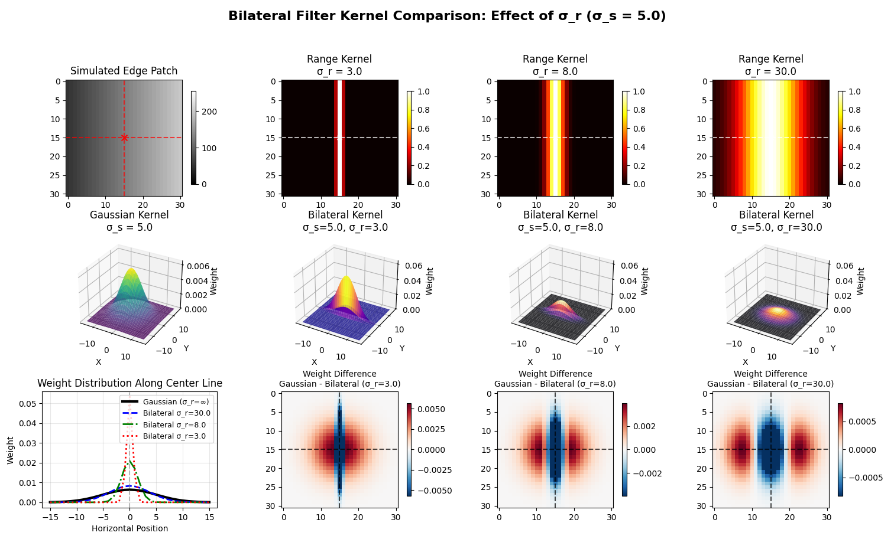
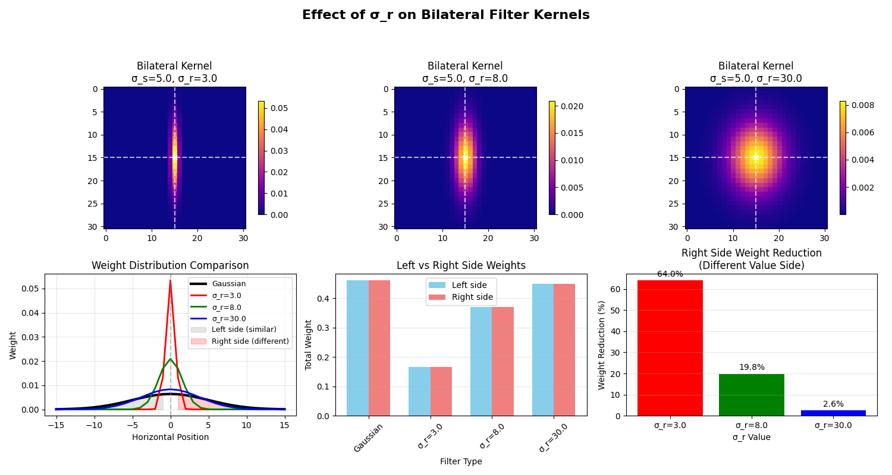

# 双边滤波 (Bilateral Filter)

## 概述

双边滤波是一种**非线性、边缘保持**的平滑滤波器。它结合了**空间邻近度**和**像素值相似度**两个权重，在平滑图像的同时能有效保留边缘。
* 传统高斯滤波只考虑**空间距离**：离中心越近的像素权重越大。  
* 双边滤波在此基础上增加了**像素值相似度**：与中心像素值越相似的像素权重越大。这样，在平滑均匀区域时，它像高斯滤波；但在边缘处，由于像素值差异大，权重会自动降低，从而保护边缘不被模糊。



## 数学公式

对于像素位置 $(x, y)$，双边滤波的输出为：

$$
I_{\text{filtered}}(x, y) = \frac{1}{W_p} \sum_{i=-a}^{a} \sum_{j=-b}^{b} I(x+i, y+j) \cdot w_s(i, j) \cdot w_r(i, j)
$$

其中：

1. **空间权重**（高斯核）：
   $$
   w_s(i, j) = \exp\left(-\frac{i^2 + j^2}{2\sigma_s^2}\right)
   $$

2. **值域权重**（基于像素强度差异）：
   $$
   w_r(i, j) = \exp\left(-\frac{\|I(x+i, y+j) - I(x, y)\|^2}{2\sigma_r^2}\right)
   $$

3. **归一化因子**：
   $$
   W_p = \sum_{i=-a}^{a} \sum_{j=-b}^{b} w_s(i, j) \cdot w_r(i, j)
   $$

**参数说明**：
- $\sigma_s$：空间标准差，控制空间邻域大小
- $\sigma_r$：值域标准差，控制像素值相似度的敏感度

## 代码实现


```python
from matplotlib import pyplot as plt
import skimage.data as data
import numpy as np
from scipy.ndimage import gaussian_filter

def bilateral_filter(image, sigma_s=3, sigma_r=30, kernel_size=15):
    """
    双边滤波实现
    
    参数:
        image: 输入图像 (灰度图)
        sigma_s: 空间标准差
        sigma_r: 值域标准差
        kernel_size: 核大小（奇数）
    
    返回:
        滤波后的图像
    """
    # 确保核大小为奇数
    if kernel_size % 2 == 0:
        kernel_size += 1
    
    half_size = kernel_size // 2
    h, w = image.shape
    output = np.zeros_like(image)
    
    # 预计算空间权重
    x, y = np.meshgrid(np.arange(-half_size, half_size+1),
                      np.arange(-half_size, half_size+1))
    spatial_weight = np.exp(-(x**2 + y**2) / (2 * sigma_s**2))
    
    for i in range(half_size, h - half_size):
        for j in range(half_size, w - half_size):
            # 提取局部区域
            region = image[i-half_size:i+half_size+1, j-half_size:j+half_size+1]
            
            # 计算值域权重
            intensity_diff = region - image[i, j]
            range_weight = np.exp(-(intensity_diff**2) / (2 * sigma_r**2))
            
            # 组合权重并归一化
            combined_weight = spatial_weight * range_weight
            combined_weight /= combined_weight.sum()
            
            # 加权平均
            output[i, j] = np.sum(region * combined_weight)
    
    # 处理边界（简单复制）
    output[:half_size, :] = image[:half_size, :]
    output[-half_size:, :] = image[-half_size:, :]
    output[:, :half_size] = image[:, :half_size]
    output[:, -half_size:] = image[:, -half_size:]
    
    return output

# 加载测试图像
image = data.camera().astype(np.float32)

# 添加噪声（用于演示去噪效果）
np.random.seed(42)
noisy_image = image + np.random.normal(0, 20, image.shape)
noisy_image = np.clip(noisy_image, 0, 255)

# 应用不同滤波器
# 1. 高斯滤波（作为对比）
gaussian_result = gaussian_filter(noisy_image, sigma=2)

# 2. 双边滤波（不同参数）
bilateral_result1 = bilateral_filter(noisy_image, sigma_s=2, sigma_r=10, kernel_size=9)
bilateral_result2 = bilateral_filter(noisy_image, sigma_s=4, sigma_r=30, kernel_size=15)
bilateral_result3 = bilateral_filter(noisy_image, sigma_s=6, sigma_r=50, kernel_size=21)

# 绘制结果
plt.figure(figsize=(15, 10))

# 第一行：原始和噪声图像
plt.subplot(3, 3, 1)
plt.imshow(image, cmap='gray')
plt.title('Original Image')
plt.axis('off')

plt.subplot(3, 3, 2)
plt.imshow(noisy_image, cmap='gray')
plt.title('Noisy Image')
plt.axis('off')

plt.subplot(3, 3, 3)
plt.imshow(gaussian_result, cmap='gray')
plt.title('Gaussian Filter (σ=2)')
plt.axis('off')

# 第二行：双边滤波不同参数
plt.subplot(3, 3, 4)
plt.imshow(bilateral_result1, cmap='gray')
plt.title('Bilateral (σ_s=2, σ_r=10)')
plt.axis('off')

plt.subplot(3, 3, 5)
plt.imshow(bilateral_result2, cmap='gray')
plt.title('Bilateral (σ_s=4, σ_r=30)')
plt.axis('off')

plt.subplot(3, 3, 6)
plt.imshow(bilateral_result3, cmap='gray')
plt.title('Bilateral (σ_s=6, σ_r=50)')
plt.axis('off')

# 第三行：边缘细节对比（裁剪区域）
crop_y, crop_x = 150, 150
crop_h, crop_w = 100, 100

plt.subplot(3, 3, 7)
plt.imshow(noisy_image[crop_y:crop_y+crop_h, crop_x:crop_x+crop_w], cmap='gray')
plt.title('Noisy (Crop)')
plt.axis('off')

plt.subplot(3, 3, 8)
plt.imshow(gaussian_result[crop_y:crop_y+crop_h, crop_x:crop_x+crop_w], cmap='gray')
plt.title('Gaussian (Crop)')
plt.axis('off')

plt.subplot(3, 3, 9)
plt.imshow(bilateral_result2[crop_y:crop_y+crop_h, crop_x:crop_x+crop_w], cmap='gray')
plt.title('Bilateral (Crop)')
plt.axis('off')

plt.tight_layout()
plt.show()

# 参数影响分析
fig, axes = plt.subplots(2, 3, figsize=(12, 8))

# 固定σ_r，变化σ_s
sigma_r_fixed = 30
for idx, sigma_s in enumerate([1, 3, 6]):
    result = bilateral_filter(noisy_image, sigma_s=sigma_s, sigma_r=sigma_r_fixed, kernel_size=15)
    axes[0, idx].imshow(result[crop_y:crop_y+crop_h, crop_x:crop_x+crop_w], cmap='gray')
    axes[0, idx].set_title(f'σ_s={sigma_s}, σ_r={sigma_r_fixed}')
    axes[0, idx].axis('off')

# 固定σ_s，变化σ_r
sigma_s_fixed = 3
for idx, sigma_r in enumerate([10, 30, 60]):
    result = bilateral_filter(noisy_image, sigma_s=sigma_s_fixed, sigma_r=sigma_r, kernel_size=15)
    axes[1, idx].imshow(result[crop_y:crop_y+crop_h, crop_x:crop_x+crop_w], cmap='gray')
    axes[1, idx].set_title(f'σ_s={sigma_s_fixed}, σ_r={sigma_r}')
    axes[1, idx].axis('off')

plt.tight_layout()
plt.show()
```


## 特点与应用

### 优点
1. **边缘保持**：在平滑的同时保护边缘不被模糊
2. **无参数调优**：不需要预先知道边缘位置
3. **简单直观**：物理意义明确，易于理解

### 缺点
1. **计算量大**：每个像素都需要计算权重，速度慢
2. **参数敏感**：$\sigma_s$ 和 $\sigma_r$ 需要仔细调整
3. **大核效率低**：核尺寸增大时计算量急剧增加

### 应用场景
- **图像去噪**：特别是需要保留细节的情况
- **HDR色调映射**：用于细节增强
- **美颜滤镜**：平滑皮肤同时保留五官轮廓
- **纹理/结构分离**：将图像分解为结构层和纹理层

## 与高斯滤波对比

| 特性 | 高斯滤波 | 双边滤波 |
|------|----------|----------|
| **线性/非线性** | 线性 | 非线性 |
| **边缘保持** | 否（会模糊边缘） | 是 |
| **计算复杂度** | O(n) | O(n²) |
| **参数** | 仅 $\sigma_s$ | $\sigma_s$ 和 $\sigma_r$ |
| **适用场景** | 快速平滑、预处理 | 细节保留的去噪 |

双边滤波通过结合**空间**和**值域**双重权重，实现了"智能平滑"：在平坦区域像高斯滤波一样平滑，在边缘处自动降低权重以保护细节。