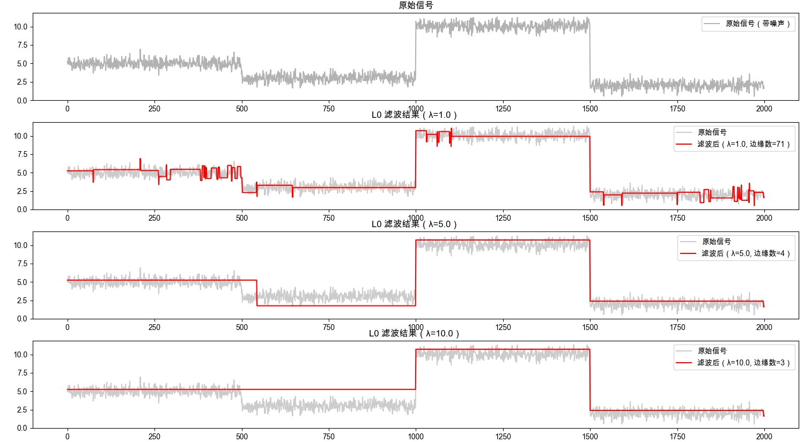

# L0

---
## 资料

* 官网： https://www.cse.cuhk.edu.hk/~leojia/projects/L0smoothing/index.html

---
## 原理

通过增加过渡的陡峭程度来锐化主要边缘。该框架利用 L0 梯度最小化，以结构-稀疏性管理的方式全局控制产生多少非零梯度来近似显著结构。与其他边缘保留平滑方法不同，我们的方法不依赖于局部特征，而是全局定位重要边缘。

$$
\min_{f} \sum_{p} (f_{p} - g_{p})^{2} \quad \text{s.t.} \quad c(f) = n
$$

通过控制$\lambda$可以调整边缘数量。下图是一维信号进行l0滤波之后的不同$\lambda$的结果：

👉 [代码](l0-1d.md)

---
## 代码


```python
import numpy as np
import matplotlib.pyplot as plt
import cv2
from numpy.fft import fft2, ifft2


# 设置字体以支持中文显示
plt.rcParams['font.sans-serif'] = ['Arial Unicode MS', 'SimHei', 'Heiti TC', 'Microsoft YaHei']
plt.rcParams['axes.unicode_minus'] = False # 解决负号显示问题


def psf2otf(psf, shape):
    """
    将点扩散函数 (PSF) 转换为光学传递函数 (OTF)。
    对应 MATLAB 的 psf2otf 函数。
    """
    in_shape = psf.shape
    # 填充 PSF 到指定大小
    psf_padded = np.zeros(shape, dtype=psf.dtype)
    psf_padded[:in_shape[0], :in_shape[1]] = psf
    # 循环移动 PSF，使其中心位于 (0, 0)
    for axis, axis_size in enumerate(in_shape):
        psf_padded = np.roll(psf_padded, -int(axis_size / 2), axis=axis)
    # 计算 FFT
    otf = fft2(psf_padded)
    return otf

def L0Smoothing(Im, lambda_val=2e-2, kappa=2.0):
    """
    L0 Gradient Smoothing Implementation (Python version of L0Smoothing.m)
    Reference: "Image Smoothing via L0 Gradient Minimization", SIGGRAPH Asia 2011
    参数:
    Im: 输入图像 (float, [0,1] 范围)
    lambda_val: 平滑参数
    kappa: 迭代速率参数
    """
    # 确保输入是 float 类型
    S = Im.astype(np.float32)
    if S.max() > 1.0:
        S = S / 255.0
    N, M = S.shape[:2]
    D = S.shape[2] if S.ndim == 3 else 1
    # 定义差分算子 (PSF)
    fx = np.array([[1, -1]])
    fy = np.array([[1], [-1]])
    # 计算 OTF (Optical Transfer Function)
    sizeI2D = (N, M)
    otfFx = psf2otf(fx, sizeI2D)
    otfFy = psf2otf(fy, sizeI2D)
    # 预计算分母的一部分 |F(dx)|^2 + |F(dy)|^2
    Denormin2 = np.abs(otfFx)**2 + np.abs(otfFy)**2
    # 如果是多通道图像，复制分母以匹配维度
    if D > 1:
        Denormin2 = np.repeat(Denormin2[:, :, np.newaxis], D, axis=2)
    # 初始化变量
    betamax = 1e5
    beta = 2 * lambda_val
    # 初始 FFT
    Normin1 = fft2(S, axes=(0, 1))
    while beta < betamax:
        # 1. h-v 子问题 (求解梯度 h, v)
        Denormin = 1.0 + beta * Denormin2
        # 计算当前 S 的梯度
        # diff(S, 1, 1) 是垂直差分 (dy)，对应 v
        # diff(S, 1, 2) 是水平差分 (dx)，对应 h
        # 注意 MATLAB 的 diff 和 numpy 的 diff 略有不同，MATLAB diff 后尺寸减小
        # 但原代码用了循环填充: [diff(S,1,2), S(:,1,:) - S(:,end,:)]
        # 这实际上就是循环差分
        # 水平梯度 (h)
        h = np.roll(S, -1, axis=1) - S
        # 垂直梯度 (v)
        v = np.roll(S, -1, axis=0) - S
        # 阈值截断 (Hard Thresholding)
        if D == 1:
            t = (h**2 + v**2) < (lambda_val / beta)
        else:
            # 对所有通道求和
            t = np.sum((h**2 + v**2), axis=2) < (lambda_val / beta)
        # 扩展 mask 维度以便广播
        t = np.repeat(t[:, :, np.newaxis], D, axis=2)
        h[t] = 0
        v[t] = 0
        # 2. S 子问题 (求解图像 S)
        # 这是一个线性系统，可以在频域求解
        # Normin2 = dx_T(h) + dy_T(v)
        # dx_T(h) = h(x-1) - h(x) (类似于散度)
        # 计算 h 的水平差分 (注意方向相反)
        # MATLAB: Normin2 = [h(:,end,:) - h(:, 1,:), -diff(h,1,2)];
        # 这对应于 h(x-1) - h(x)
        h_diff = np.roll(h, 1, axis=1) - h
        # 计算 v 的垂直差分
        v_diff = np.roll(v, 1, axis=0) - v
        Normin2 = h_diff + v_diff
        # 频域求解
        FS = (Normin1 + beta * fft2(Normin2, axes=(0, 1))) / Denormin
        # 逆变换回空域
        S = np.real(ifft2(FS, axes=(0, 1)))
        # 更新 beta
        beta *= kappa
        # print('.', end='', flush=True)
        # print('\nDone.')
    return S

# ------------------- 测试代码 -------------------
if __name__ == "__main__":
    from skimage.data import astronaut
    # 读取图像
    img = astronaut()
    img = cv2.resize(img, (256, 256)) # 缩小一点以便快速测试
    img_float = img.astype(np.float32) / 255.0
    # 显示结果
    plt.figure(figsize=(12, 6))
    plt.subplot(1, 3, 1)
    plt.imshow(img)
    plt.title('原始图像')
    plt.axis('off')
    plt.subplot(1, 3, 2)
    plt.imshow(np.clip(L0Smoothing(img_float, lambda_val=0.02), 0, 1))
    plt.title(f'L0 平滑结果 (lambda={0.02})')
    plt.axis('off')
    plt.subplot(1, 3, 3)
    plt.imshow(np.clip(L0Smoothing(img_float, lambda_val=0.1), 0, 1))
    plt.title(f'L0 平滑结果 (lambda={0.1})')
    plt.axis('off')
    plt.tight_layout()
    plt.show()
```