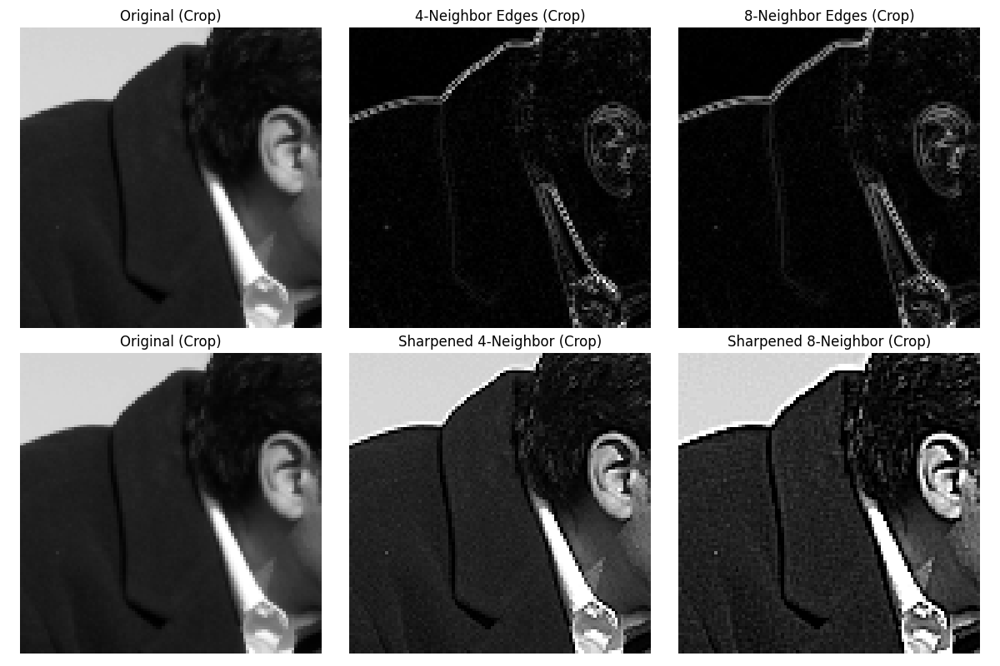

```python
from matplotlib import pyplot as plt
from scipy.ndimage import convolve
import skimage.data as data
import numpy as np

# 加载图像
image = data.camera().astype(np.float32)

# 定义两种Laplacian核
laplacian_4 = np.array([[0, -1, 0],
[-1, 4, -1],
[0, -1, 0]])
laplacian_8 = np.array([[-1, -1, -1],
[-1, 8, -1],
[-1, -1, -1]])

# 应用卷积得到边缘信息
edges_4 = convolve(image, laplacian_4, mode='reflect')
edges_8 = convolve(image, laplacian_8, mode='reflect')

# 将边缘信息加回原图得到锐化图像
# 可以调整增强系数 alpha 控制锐化强度
alpha = 0.5 # 锐化强度系数
sharpened_4 = image + alpha * edges_4
sharpened_8 = image + alpha * edges_8

# 确保像素值在合理范围内
sharpened_4 = np.clip(sharpened_4, 0, 255)
sharpened_8 = np.clip(sharpened_8, 0, 255)

# 绘制结果：边缘检测
plt.figure(figsize=(15, 5))

plt.subplot(1, 3, 1)
plt.imshow(image, cmap='gray')
plt.title('Original Image')
plt.axis('off')

plt.subplot(1, 3, 2)
plt.imshow(np.abs(edges_4), cmap='gray')
plt.title('4-Neighbor Laplacian Edges')
plt.axis('off')

plt.subplot(1, 3, 3)
plt.imshow(np.abs(edges_8), cmap='gray')
plt.title('8-Neighbor Laplacian Edges')
plt.axis('off')
plt.tight_layout()
plt.show()

# 绘制结果：锐化效果
plt.figure(figsize=(15, 5))

plt.subplot(1, 3, 1)
plt.imshow(image, cmap='gray')
plt.title('Original Image')
plt.axis('off')

plt.subplot(1, 3, 2)
plt.imshow(sharpened_4, cmap='gray')
plt.title(f'Sharpened (4-Neighbor, α={alpha})')
plt.axis('off')

plt.subplot(1, 3, 3)
plt.imshow(sharpened_8, cmap='gray')
plt.title(f'Sharpened (8-Neighbor, α={alpha})')
plt.axis('off')
plt.tight_layout()
plt.show()

# 显示细节对比（裁剪部分区域）
crop_y, crop_x = 100, 100
crop_h, crop_w = 100, 100
fig, axes = plt.subplots(2, 3, figsize=(12, 8))

# 原始图像裁剪
axes[0, 0].imshow(image[crop_y:crop_y+crop_h, crop_x:crop_x+crop_w], cmap='gray')
axes[0, 0].set_title('Original (Crop)')
axes[0, 0].axis('off')

# 边缘检测裁剪
axes[0, 1].imshow(np.abs(edges_4)[crop_y:crop_y+crop_h, crop_x:crop_x+crop_w], cmap='gray')
axes[0, 1].set_title('4-Neighbor Edges (Crop)')
axes[0, 1].axis('off')
axes[0, 2].imshow(np.abs(edges_8)[crop_y:crop_y+crop_h, crop_x:crop_x+crop_w], cmap='gray')
axes[0, 2].set_title('8-Neighbor Edges (Crop)')
axes[0, 2].axis('off')

# 锐化图像裁剪
axes[1, 0].imshow(image[crop_y:crop_y+crop_h, crop_x:crop_x+crop_w], cmap='gray')
axes[1, 0].set_title('Original (Crop)')
axes[1, 0].axis('off')
axes[1, 1].imshow(sharpened_4[crop_y:crop_y+crop_h, crop_x:crop_x+crop_w], cmap='gray')
axes[1, 1].set_title('Sharpened 4-Neighbor (Crop)')
axes[1, 1].axis('off')
axes[1, 2].imshow(sharpened_8[crop_y:crop_y+crop_h, crop_x:crop_x+crop_w], cmap='gray')
axes[1, 2].set_title('Sharpened 8-Neighbor (Crop)')
axes[1, 2].axis('off')

plt.tight_layout()
plt.show()
```
