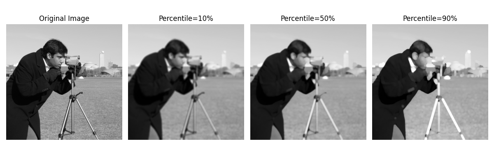

1. 定义局部区域： 对于每个像素，根据定义的结构元素（由 `selem` 参数指定）确定一个局部区域。
2. 计算局部均值： 在每个局部区域内，计算像素值的均值。
3. 计算百分位数： 将局部区域内的像素值排序，并计算指定百分位数（由 `p0` 和 `p1` 参数指定）。
4. 应用滤波： 将计算得到的局部均值和局部百分位数作为滤波后的像素值。

```python
from matplotlib import pyplot as plt
from skimage.filters.rank import mean_percentile
import skimage.data as data
import numpy as np
from skimage.morphology import disk
from skimage.util import img_as_ubyte

# 加载图像并转换为uint8类型（rank filters要求）
image = img_as_ubyte(data.camera())

# 定义不同的百分比参数
percentiles = [10, 50, 90]

# 创建滤波后的图像列表
filtered_images = []
for p in percentiles:
    # 使用 mean_percentile 滤波，邻域大小为5x5的圆盘
    filtered = mean_percentile(image, disk(5), p0=p/100.0)
    filtered_images.append(filtered)

# 绘制结果
plt.figure(figsize=(12, 4))

# 原始图像
plt.subplot(1, 4, 1)
plt.imshow(image, cmap='gray')
plt.title('Original Image')
plt.axis('off')

# 不同百分比的滤波结果
for i, (p, filtered) in enumerate(zip(percentiles, filtered_images)):
    plt.subplot(1, 4, i+2)
    plt.imshow(filtered, cmap='gray')
    plt.title(f'Percentile={p}%')
    plt.axis('off')

plt.tight_layout()
plt.show()
```