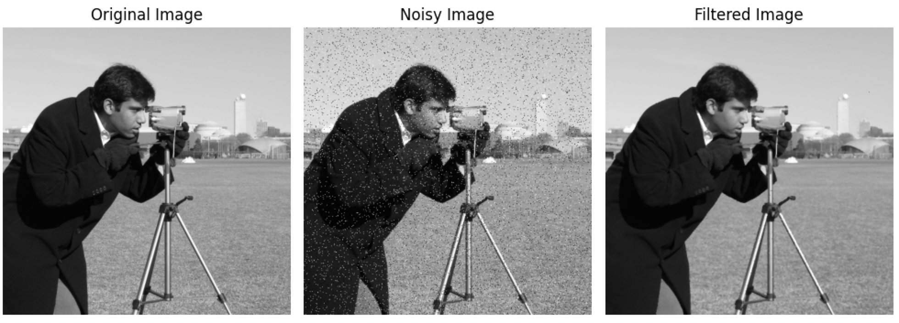

```python
from matplotlib import pyplot as plt
from skimage import data, util, filters
import numpy as np

image = data.camera()

noisy_image = util.random_noise(image, mode='s&p',rng=None,clip= True)

filtered_image = filters.median(noisy_image)

plt.figure(figsize=(10, 5))
plt.subplot(1, 3, 1)
plt.imshow(image, cmap='gray')
plt.title('Original Image')
plt.axis('off')

plt.subplot(1, 3, 2)
plt.imshow(np.abs(noisy_image), cmap='gray')
plt.title('Noisy Image')
plt.axis('off')

plt.subplot(1, 3, 3)
plt.imshow(filtered_image, cmap='gray')
plt.title('Filtered Image')
plt.axis('off')

plt.tight_layout()
plt.show()
```
