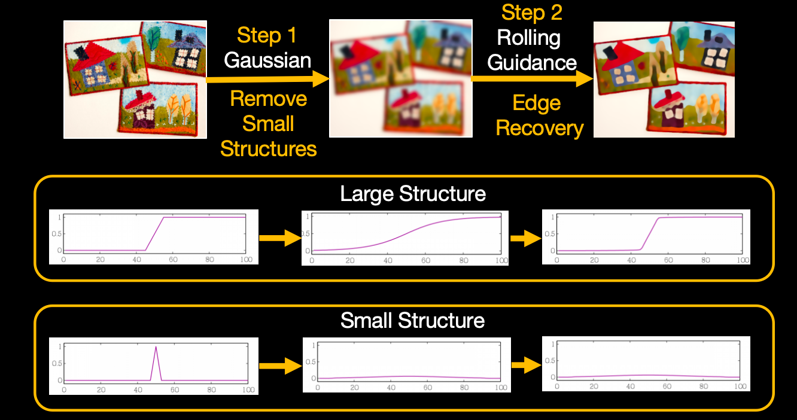
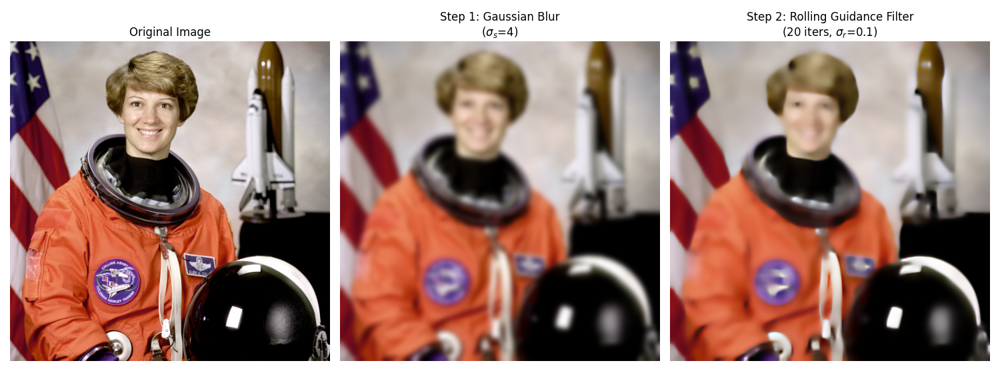

# Rolling Guidance Filter

---
## 资料

* https://blog.csdn.net/m0_59284005/article/details/127925099
* 论文pdf： https://link.springer.com/content/pdf/10.1007/978-3-319-10578-9_53.pdf
* 官网（里边有一些例子）： https://www.cse.cuhk.edu.hk/~leojia/projects/rollguidance/index.html

---
## 原理

RGF是2014年发表在ECCV由Qi Zhang等人提出的。

RGF的滤波过程分为两步：第一步中按照对图像结构的尺度的定义，我们使用合适强度的高斯滤波器将小尺度的边缘完全抹平。此时图像的大尺度边缘也会被平滑。因此在第二步中需要恢复大尺度的边缘结构。然后以上两步进行迭代。

---
## 案例

