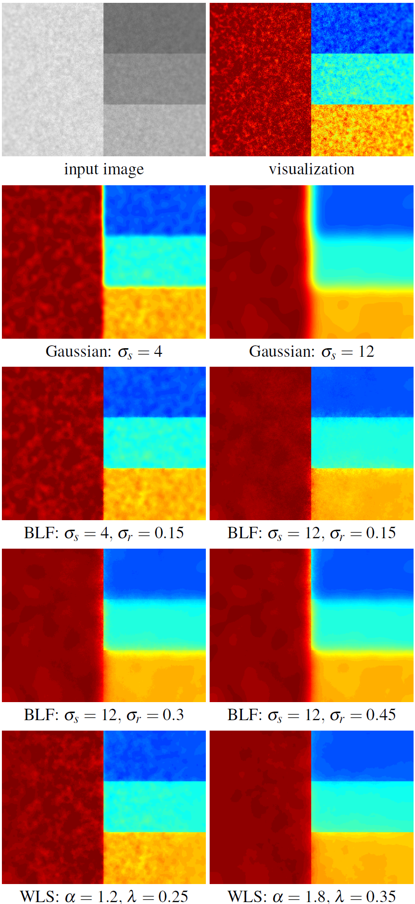

# Weighted Least Squares Filter
---
## 资料

* github： https://github.com/goldbema/WeightedLeastSquaresFilter
* 大佬介绍： https://blog.csdn.net/qq_19784349/article/details/130504721

---
## 原理

作者认为，虽然 BLF 在平滑强度的微小变化同时保留强边缘方面非常有效，但它实现渐进粗化的能力相当有限。如下图所示，左上角是合成示例，拥有几个不同步长幅度的边缘，并且包含两个不同尺度的噪声。



WLS将图像分解为**基底层**（大尺度强度变化）和**细节层**（小尺度细节），进而提出了一种基于**加权最小二乘法**（Weighted Least Squares, WLS）的新方法。
* WLS方法将图像平滑过程转化为一个**最小化能量函数**的数学问题。该函数包含两个目标：
	- **保真度（Fidelity）**：平滑后的图像 u要尽量接近原始图像 g。
	- **平滑度（Smoothness）**：图像 u要尽量平滑，但**在原始图像的强边缘处允许不连续**。
* 能量函数：
	$$E(u)=p∑​((up​−gp​)2+λ(ax,p​(g)(∂x∂u​)p2​+ay,p​(g)(∂y∂u​)p2​))$$
	- up​,gp​：像素 p在平滑后图像和原始图像中的值。
	- λ：**平滑系数**。λ越大，图像越平滑。
	- ax,p​(g),ay,p​(g)：**权重函数**。这是实现“保边”的关键，它根据原始图像 g的梯度动态调整平滑力度。
* 权重函数（Edge-Aware Weights）权重函数的设计决定了算法是“无脑模糊”还是“智能保边”。文章采用如下定义：
	$$ax,p​(g)=(​∂x∂ℓ​(p)​α+ϵ)−1$$
	- ℓ：原始图像的对数亮度（log-luminance）。
	- α：**敏感度参数**（通常取1.2-2.0）。α越大，对边缘越敏感，越不容易模糊。
	- ϵ：极小常数（如0.0001），防止分母为零。
* 逻辑解释
	- 在**平坦区域**：梯度 ∂x∂ℓ​很小，权重 a很大，此时算法会大力平滑（即允许模糊）。
	- 在**边缘处**：梯度很大，权重 a很小，此时算法会限制平滑，从而**保留边缘**。
* 求解方法：线性系统。将上述能量函数最小化，最终转化为求解一个大型**稀疏线性系统**
	$$(I+λLg​)u=g$$
	- I：单位矩阵。
	- Lg​：由权重 a构造的拉普拉斯矩阵。
	- g：原始图像向量。
	由于矩阵 (I+λLg​)是稀疏且对称正定的，文章建议使用**预条件共轭梯度法**（Preconditioned Conjugate Gradient）来高效求解。
* 多尺度分解，为了提取不同尺度的细节，文章提出两种构建多尺度金字塔的方法：
	- **直接法**：直接对原始图像 g应用不同 λ的WLS滤波，得到不同尺度的平滑结果 ui。细节层 di=ui−1−ui。
	- **迭代法**：对上一层的平滑结果 ui再次应用WLS滤波。这种方法更倾向于产生分片常数（piecewise constant）的结果，适合图像抽象化（Abstraction）应用。

---
## 代码


```python
import cv2
import numpy as np
import scipy.sparse as sparse
import scipy.sparse.linalg as sl
import matplotlib.pyplot as plt

# ----------------- WLS Filter Implementation -----------------

def process_difference_operator(difference_operator, lambda_, alpha, epsilon):
  """
    Apply non-linear mapping to the difference operator to compute weights.
    """
  difference_operator = -lambda_ / (epsilon + (np.absolute(difference_operator)**alpha))
  return difference_operator


def wls_filter(L, lambda_=0.35, alpha=1.2, epsilon=1e-4):
  """
    Weighted Least Squares (WLS) Filter
    Based on: "Edge-Preserving Decompositions for Multi-Scale Tone and Detail Manipulation" (Farbman et al., 2008)

    Args:
        L: Input luminance image (2D numpy array), values should be normalized to [0, 1] or similar scale.
        lambda_: Balance between data fidelity and smoothness. Larger lambda = more smoothing.
        alpha: Controls the sensitivity to edges.
        epsilon: Small constant to avoid division by zero.

    Returns:
        x: Smoothed image (same shape as L)
    """
  # Get log-luminance for weight calculation (perceptual based edge detection)
  L_log = np.log(L.astype(np.float64) + 1e-10)

  # Compute the forward and backward differences of the luminance channel
  # dx_forward: L(x+1) - L(x)
  dx_forward = L_log - cv2.copyMakeBorder(L_log[:, 1:], top=0, bottom=0, left=0, right=1,borderType=cv2.BORDER_REPLICATE)
  # dx_backward: L(x-1) - L(x)
  dx_backward = L_log - cv2.copyMakeBorder(L_log[:, :-1], top=0, bottom=0, left=1, right=0,borderType=cv2.BORDER_REPLICATE)
  # dy_forward: L(y+1) - L(y)
  dy_forward = L_log - cv2.copyMakeBorder(L_log[1:, :], top=0, bottom=1, left=0, right=0,borderType=cv2.BORDER_REPLICATE)
  # dy_backward: L(y-1) - L(y)
  dy_backward = L_log - cv2.copyMakeBorder(L_log[:-1, :], top=1, bottom=0, left=0, right=0,borderType=cv2.BORDER_REPLICATE)

  # Weight each derivative (compute smoothness weights)
  dx_forward_weighted = process_difference_operator(dx_forward, lambda_, alpha, epsilon)
  dx_forward_weighted[:, -1] = 0

  dx_backward_weighted = process_difference_operator(dx_backward, lambda_, alpha, epsilon)
  dx_backward_weighted[:, 0] = 0

  dy_forward_weighted = process_difference_operator(dy_forward, lambda_, alpha, epsilon)
  dy_forward_weighted[-1, :] = 0

  dy_backward_weighted = process_difference_operator(dy_backward, lambda_, alpha, epsilon)
  dy_backward_weighted[0, :] = 0

  # Calculate the diagonal (central) element
  # A_ii = 1 - sum(weights connected to i)
  # But here weights are negative (see process_difference_operator: -lambda / ...), 
  # so we subtract them to make A_ii = 1 + sum(|weights|) if we view it as Laplacian matrix
  # The code does: 1 - (sum of negative weights) = 1 + sum(positive weights)
  central_element = np.ones_like(dx_forward) - (dx_forward_weighted + dx_backward_weighted + dy_forward_weighted + dy_backward_weighted)

  # Form sparse matrix
  N = L.size
  C = L.shape[1]

  row = np.zeros(5 * N)
  col = np.zeros_like(row)
  data = np.zeros_like(row)

  # Central element
  row[:N] = np.arange(N)
  col[:N] = row[:N]
  data[:N] = central_element.ravel()

  # dx_forward (neighbor at x+1, index i+1)
  row[N:2*N] = np.arange(N)
  col[N:2*N] = row[N:2*N] + 1
  data[N:2*N] = dx_forward_weighted.ravel()

  # dx_backward (neighbor at x-1, index i-1)
  row[2*N:3*N] = np.arange(N)
  col[2*N:3*N] = row[2*N:3*N] - 1
  data[2*N:3*N] = dx_backward_weighted.ravel()

  # dy_forward (neighbor at y+1, index i+C)
  row[3*N:4*N] = np.arange(N)
  col[3*N:4*N] = row[3*N:4*N] + C
  data[3*N:4*N] = dy_forward_weighted.ravel()

  # dy_backward (neighbor at y-1, index i-C)
  row[4*N:5*N] = np.arange(N)
  col[4*N:5*N] = row[4*N:5*N] - C
  data[4*N:5*N] = dy_backward_weighted.ravel()

  # Prevent out-of-bounds indices.
  # Setting invalid indices to 0 ensures they don't affect the matrix structure wrongly.
  # However, since we used copyMakeBorder and set boundary weights to 0, 
  # the values at boundary connections should already be 0.
  # But col indices might be out of range (e.g. -1 or N).
  valid_mask = (col >= 0) & (col < N)

  # Filter valid entries
  row = row[valid_mask]
  col = col[valid_mask]
  data = data[valid_mask]

  # Construct sparse matrix A
  A = sparse.coo_matrix((data, (row, col)), shape=(N, N)).tocsr()
  b = L.ravel()

  # Solve linear system Ax = b
  # Use Conjugate Gradient method for symmetric positive definite matrix
  x, info = sl.cg(A=A, b=b)

  if info != 0:
    print(f"Warning: CG did not converge (info={info})")

    x = x.reshape(L.shape)

    return x


  # ----------------- Testing Code -----------------

  if __name__ == '__main__':
    from skimage import data, img_as_float

    # Load test image
    image = data.astronaut()

    # Convert to grayscale for WLS filter (which operates on luminance)
    # Alternatively, you can apply it to V channel in HSV or Y in YCbCr
    gray_image = cv2.cvtColor(image, cv2.COLOR_RGB2GRAY)
    gray_image = img_as_float(gray_image)

    # Apply WLS Filter
    # lambda_ controls smoothing amount (0.1 is subtle, 1.0 is strong)
    lambda_val = 1.0
    alpha_val = 1.2
    smoothed = wls_filter(gray_image, lambda_=lambda_val, alpha=alpha_val)

    # Enhance detail: Original + (Original - Smoothed) * gain
    detail_layer = gray_image - smoothed
    enhanced = gray_image + 2.0 * detail_layer
    enhanced = np.clip(enhanced, 0, 1)

    # Visualization
    plt.figure(figsize=(15, 5))

    plt.subplot(1, 3, 1)
    plt.imshow(gray_image, cmap='gray')
    plt.title('Original (Grayscale)')
    plt.axis('off')

    plt.subplot(1, 3, 2)
    plt.imshow(smoothed, cmap='gray')
    plt.title(f'WLS Smoothed (lambda={lambda_val})')
    plt.axis('off')

    plt.subplot(1, 3, 3)
    plt.imshow(enhanced, cmap='gray')
    plt.title('Detail Enhanced (Original + 2*Detail)')
    plt.axis('off')

    plt.tight_layout()
    plt.show()

```