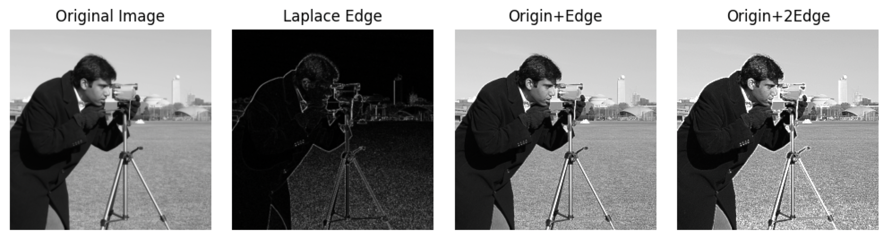

# Space Transform

---
## Overview

***
## 卷积

一维卷积：反转，相乘相加。假设有两个一维连续信号进行卷积，公式如下。

$$
(g * f)(t) = \int_{-\infty}^{\infty} f(\tau) h(t - \tau) \, d\tau
$$

二维卷积其实是“相关”，因为缺少了反转的这一步骤，但是由于卷积核大部分都是对称的，所以可以忽略这一条件。所以图像卷积就是对应位置相乘相加！图片的卷积公式如下。

$$
T(x, y) = \sum_{i=-a}^{b} \sum_{j=-a}^{b} I(x + i, y + j) k(i, j)
$$
---
## 降噪/平滑

### Box

均值滤波器（盒式滤波器），就是某个“方块”内的像素求均值。👉 [代码](../details/box.md)

$$
k = \frac{1}{mn}\begin{bmatrix} 1&1&...&1\\1&1&...&1\\...&...&...&...\\1&1&...&1\end{bmatrix}_{mn}
$$

### Gaussian

Box 太平均了，边缘损失严重，为了提升“保边”效果，进行高斯加权平均。👉 [代码](../details/gaussian.md)

$$
G(x,y)=\frac{1}{2\pi\sigma^2}e^{-\frac{x^2+y^2}{2\sigma^2}}
$$
$$
W(i,j) = \frac{G(i,j)}{\sum_{i=-a}^{a}\sum_{i=-b}^{b}G(i,j)}
$$

### Mean

以上滤波器均为线性滤波，而中值滤波是一种基于统计的非线性滤波，它是椒盐噪声的“特效药”。👉 [代码](../details/mean.md)

---
## 边缘/锐化

### Roberts

2x2大小的求边缘。👉 [代码](../details/roberts.md)

$$
G_x = \begin{bmatrix} -1 & 0 \\ 0 & 1 \end{bmatrix}
$$

$$
G_y = \begin{bmatrix} 0 & -1 \\ 1 & 0 \end{bmatrix}
$$

### Sobel

3x3 大小的边缘。👉 [代码](../details/sobel.md)

$$
G_x = \begin{bmatrix} -1 & -2 & -1 \\ 0 & 0 & 0 \\ 1 & 2 & 1 \end{bmatrix}
$$

$$
G_y = \begin{bmatrix} -1 & 0 & 1 \\ -2 & 0 & 2 \\ -1 & 0 & 1 \end{bmatrix}
$$

.png)

### Laplacian

Sobel 和 Robert 把 3x3 或者 2x2 的区域当成一个大像素，算这个像素内部的梯度。Laplacian 换了一个角度，找一个 3x3 的区域，算这个区域中心往外的梯度。另外，实践中，尝尝采用中心权重为正的形式，虽然按照梯度公式中心应该是负。

$$
G = \begin{bmatrix} 0 & -1 & 0 \\ -1 & 4 & -1 \\ 0 & -1 & 0 \end{bmatrix}
$$
或者加上四个对角线方向
$$
G = \begin{bmatrix} -1 & -1 & -1 \\ -1 & 8 & -1 \\ -1 & -1 & -1 \end{bmatrix}
$$
另外，可以把边缘加到原图上得到锐化图像。👉 [代码](../details/laplacian.md)

