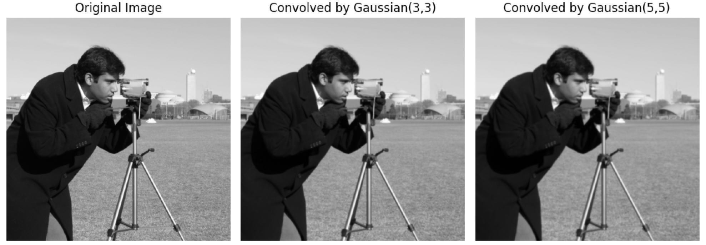
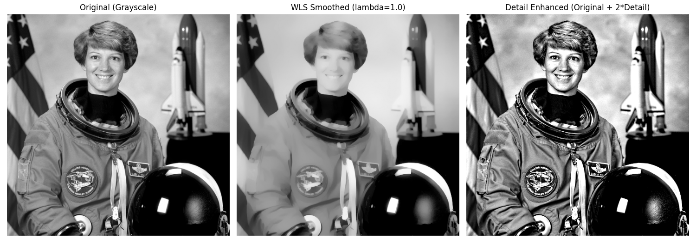
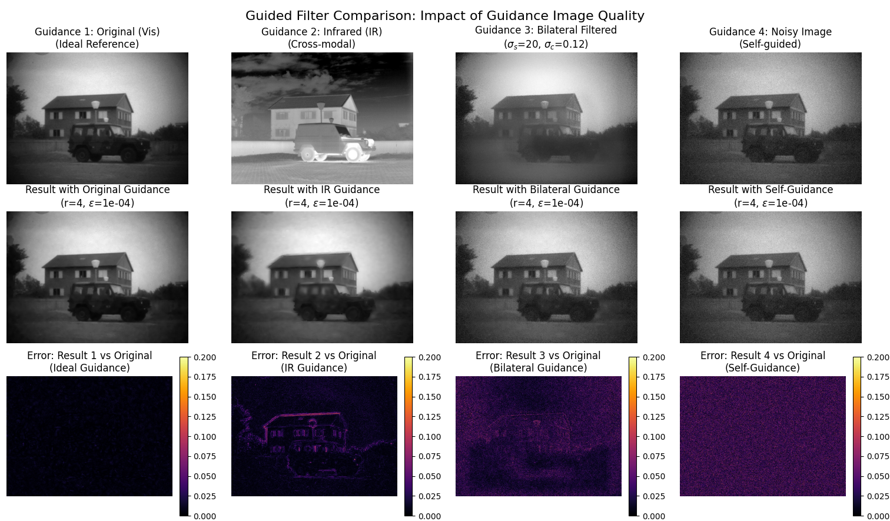
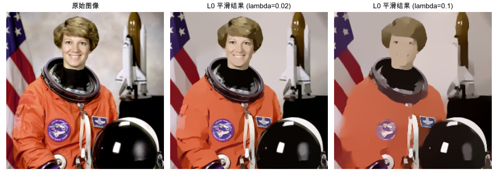
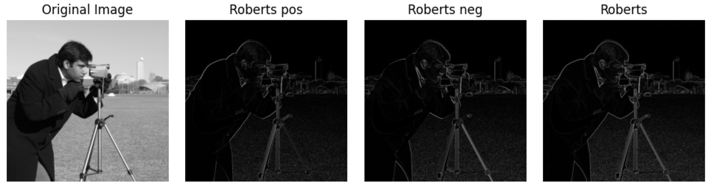
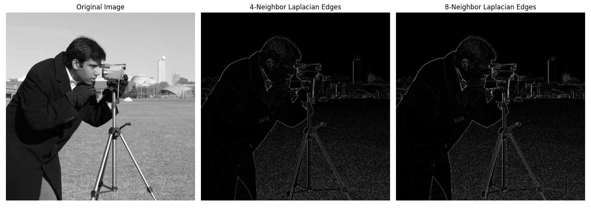
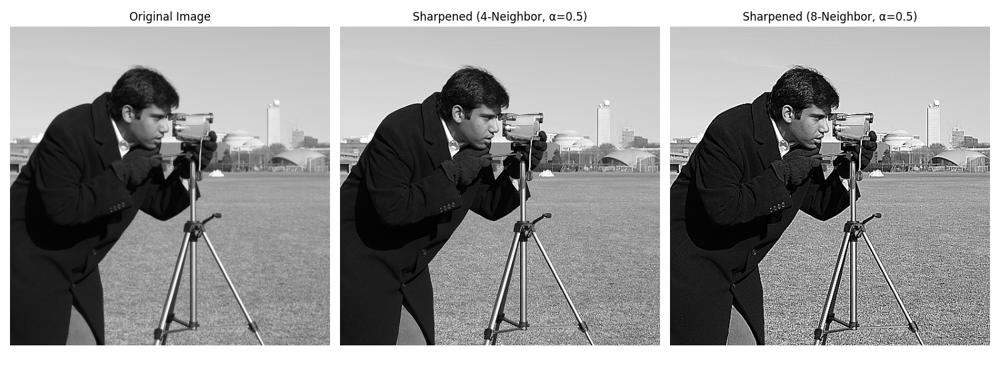

# Space Transform

---
## Overview

***
## 卷积

一维卷积：反转，相乘相加。假设有两个一维连续信号进行卷积，公式如下。

$$
(g * f)(t) = \int_{-\infty}^{\infty} f(\tau) h(t - \tau) \, d\tau
$$

二维卷积其实是“相关”，因为缺少了反转的这一步骤，但是由于卷积核大部分都是对称的，所以可以忽略这一条件。所以图像卷积就是对应位置相乘相加！图片的卷积公式如下。

$$
T(x, y) = \sum_{i=-a}^{b} \sum_{j=-a}^{b} I(x + i, y + j) k(i, j)
$$
---
## 降噪/平滑

### Median

中值滤波是一种基于统计的非线性滤波，它是椒盐噪声的“特效药”。👉 [代码](../details/median.md)

### Box / Average / Local Mean

均值滤波器（盒式滤波器），就是某个“方块”内的像素求均值。👉 [代码](../details/box.md)

$$
k = \frac{1}{mn}\begin{bmatrix} 1&1&...&1\\1&1&...&1\\...&...&...&...\\1&1&...&1\end{bmatrix}_{mn}
$$

### Percentile Mean

百分数均值滤波。计算局部区域内排在指定百分位数范围内的像素值的均值，对图像中的离群值更具鲁棒性。而普通的均值滤波则简单地计算局部区域内所有像素值的平均值，对所有像素值一视同仁，可能对包含离群值的图像较为敏感。👉 [代码](../details/mean-percentile.md)

### Gaussian

Box 还是太平均了，边缘损失严重，为了提升“保边”效果，进行高斯加权。👉 [代码](../details/gaussian.md)

$$
G(x,y)=\frac{1}{2\pi\sigma^2}e^{-\frac{x^2+y^2}{2\sigma^2}}
$$
$$
W(i,j) = \frac{G(i,j)}{\sum_{i=-a}^{a}\sum_{i=-b}^{b}G(i,j)}
$$

### Bilateral

双边滤波是一种**非线性、边缘保持**的平滑滤波器。它结合了**空间邻近度**和**像素值相似度**两个权重，在平滑图像的同时能有效保留边缘。详细介绍：👉 [bilateral](../details/bilateral.md)

* 传统高斯滤波只考虑**空间距离**：离中心越近的像素权重越大。  
* 双边滤波在此基础上增加了**像素值相似度**：与中心像素值越相似的像素权重越大。

对于像素位置 $(x, y)$，双边滤波的输出为：

$$
I_{\text{filtered}}(x, y) = \frac{1}{W_p} \sum_{i=-a}^{a} \sum_{j=-b}^{b} I(x+i, y+j) \cdot w_s(i, j) \cdot w_r(i, j)
$$

其中：
1. **空间权重**（高斯核）：
   $$
   w_s(i, j) = \exp\left(-\frac{i^2 + j^2}{2\sigma_s^2}\right)
   $$
2. **值域权重**（基于像素强度差异）：
   $$
   w_r(i, j) = \exp\left(-\frac{\|I(x+i, y+j) - I(x, y)\|^2}{2\sigma_r^2}\right)
   $$
3. **归一化因子**：
   $$
   W_p = \sum_{i=-a}^{a} \sum_{j=-b}^{b} w_s(i, j) \cdot w_r(i, j)
   $$

### Weighted Least Squares

（2008 ACM TOG）WLS将图像分解为基底层（大尺度强度变化）和细节层（小尺度细节），进而提出了一种基于加权最小二乘法（Weighted Least Squares, WLS）的新方法。[wls](../details/wls.md)

### Guided Filter

（2009 CVPR）引导滤波（Guided Filter）的核心思想是利用一张引导图（Guidance Image）来指导对输入图像的滤波过程。它假设输出图像在局部窗口内是引导图的线性变换，从而在平滑噪声的同时，能更好地保持引导图所提供的边缘结构。[guided-filter](../details/guided-filter.md)

### L0-minimization

（2011 SIGGRAPH Asia）通过增加过渡的陡峭程度来锐化主要边缘。该框架利用 L0 梯度最小化，以结构-稀疏性管理的方式全局控制产生多少非零梯度来近似显著结构。与其他边缘保留平滑方法不同，我们的方法不依赖于局部特征，而是全局定位重要边缘。[l0](../details/l0.md)

### Rolling Guidance Filter

（2014 ECCV）第一步中按照对图像结构的尺度的定义，我们使用合适强度的高斯滤波器将小尺度的边缘完全抹平。此时图像的大尺度边缘也会被平滑。因此在第二步中需要恢复大尺度的边缘结构。然后以上两步进行迭代。[rolling-guidance-filter](../details/rolling-guidance-filter.md)

---
## 边缘/锐化

### Roberts

2x2大小的求边缘。👉 [代码](../details/roberts.md)

$$
G_x = \begin{bmatrix} -1 & 0 \\ 0 & 1 \end{bmatrix}
$$

$$
G_y = \begin{bmatrix} 0 & -1 \\ 1 & 0 \end{bmatrix}
$$

### Sobel

3x3 大小的边缘。👉 [代码](../details/sobel.md)

$$
G_x = \begin{bmatrix} -1 & -2 & -1 \\ 0 & 0 & 0 \\ 1 & 2 & 1 \end{bmatrix}
$$

$$
G_y = \begin{bmatrix} -1 & 0 & 1 \\ -2 & 0 & 2 \\ -1 & 0 & 1 \end{bmatrix}
$$

.png)

### Laplacian

Sobel 和 Robert 把 3x3 或者 2x2 的区域当成一个大像素，算这个像素内部的梯度。Laplacian 换了一个角度，找一个 3x3 的区域，算这个区域中心往外的梯度。另外，实践中，尝尝采用中心权重为正的形式，虽然按照梯度公式中心应该是负。Laplacian 核是离散拉普拉斯算子的近似：
$$
\nabla^2 f \approx f(x+1,y) + f(x-1,y) + f(x,y+1) + f(x,y-1) - 4f(x,y)
$$
对于 3×3 核，这对应**四邻域**形式。**八邻域**形式额外加上了对角线方向的贡献。
1. 四邻域 Laplacian（不考虑对角线）
$$
k = \begin{bmatrix}
0 & -1 & 0 \\
-1 & 4 & -1 \\
0 & -1 & 0
\end{bmatrix}
$$
2. 八邻域 Laplacian（考虑对角线）
$$
k = \begin{bmatrix}
-1 & -1 & -1 \\
-1 & 8 & -1 \\
-1 & -1 & -1
\end{bmatrix}
$$
另外，可以把边缘加到原图上得到锐化图像。👉 [代码](../details/laplacian.md)

